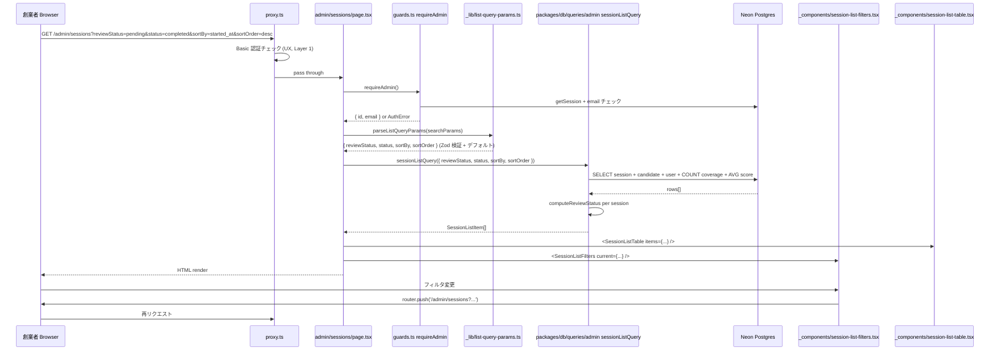
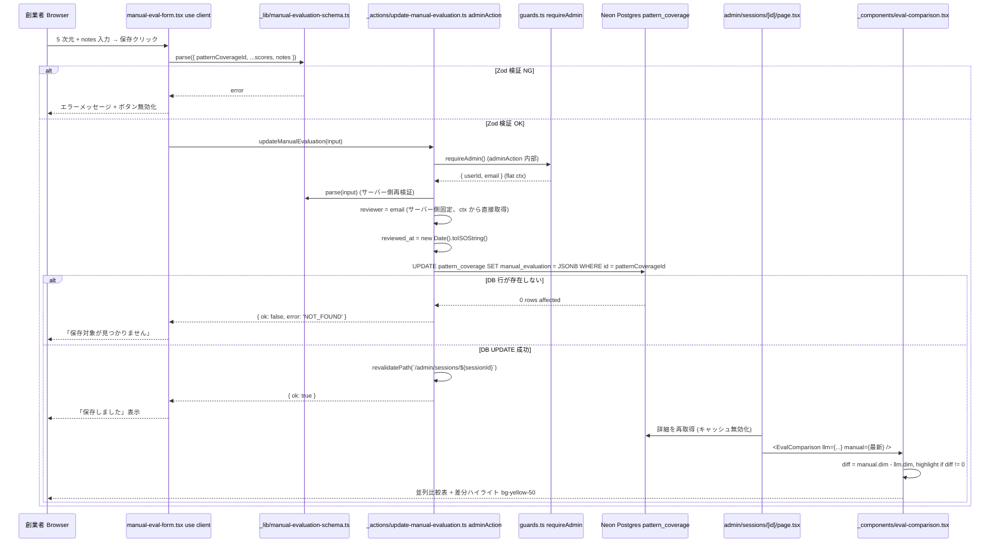

# Design Document — admin-review-panel

## Overview

**Purpose**: 本機能は bulr Stage 1 MVP プロトタイプ（AI 面接アシスタント型）の **創業者の検証作業ツール** を実装する。`monorepo-foundation` で構築された apps/web スケルトン、`multi-env-infrastructure` で整備された 12 環境変数、`authentication` で確立された二段認証境界（proxy.ts Basic 認証 + `requireAdmin()` 二重チェック + `adminAction` ラッパー）、`assessment-engine` で実装された 6 テーブル + LLM 評価 JSONB 構造 + 共通型（`@bulr/types/profile` / `@bulr/types/evaluation`）を土台に、**セッション一覧 + 詳細閲覧 + 5 次元手動評価入力 + LLM 評価との並列比較・差分ハイライト + CSV/JSON エクスポート + smoke test 削除（冪等）** を実装する。

v1 では「ヒートマップ閲覧 + 手動評価」だったが、v2 移行に伴い役割が **大幅に縮小**：ヒートマップ閲覧は assessment-engine の面接官向けレポート画面（`/interviews/[sessionId]/report`、CSS 横棒で実装済み）に移管し、本 spec は **手動評価入力 + LLM 評価との突合 + CSV/JSON エクスポート** に集中する。本 spec はチャートライブラリを一切導入せず、ヒートマップ可視化を実装しない。

**Users**: 創業者（admin）が直接利用する。Stage 1 検証ゴール「ベトナム人 20-30 + 日本人 10-20 の面接結果と既知実力評価および面接官独自判断との一致度確認」を達成するためのデータ収集ツールとして使う。Stage 2 で apps/admin 分離 / フル機能ヒートマップ / 受験者管理に発展する想定。

**Impact**: `assessment-engine` 完了時点では `/admin/login` と `/admin/_health/`（既に削除済みの想定）以外の `/admin/*` ルート未実装、`packages/db/src/queries/admin/` サブディレクトリ未作成、`pattern_coverage.manual_evaluation` JSONB に書き込む手段なし。本スペック完了で、創業者は `/admin/sessions` で全セッションを横断レビューでき、各 pattern_coverage に 5 次元手動スコアを入力でき、LLM vs 手動の差分を確認でき、CSV/JSON でデータをエクスポートして相関分析できる状態になる。`/admin/_health/` smoke test ページは本 spec で冪等削除する。

### Goals

- `/admin/sessions` 一覧ページ（フィルタ + ソート + レビューステータス計算）を Server Component で実装
- `/admin/sessions/[id]` 詳細ページ（候補者情報 + 面接官情報 + interview_turn 時系列 + pattern_coverage カード + 手動評価フォーム + LLM vs 手動 並列比較 + 差分ハイライト + 面接後レポートへのリンク）を実装
- `apps/web/app/admin/_components/` に admin 専用コンポーネントを閉じて配置（Stage 2 移行時にディレクトリごと移動可能、Next.js private folder 規約 `_` を活用）
- `apps/web/app/admin/_actions/update-manual-evaluation.ts` に `adminAction` ラップの Server Action を実装（reviewer はサーバー側で `requireAdmin()` 戻り値の email を固定使用、信頼境界）
- `apps/web/app/admin/sessions/[id]/export/route.ts` に CSV/JSON エクスポート Route Handler を実装（UTF-8 BOM + CRLF for Excel 互換、papaparse 不使用、`escapeCsvField` 純関数で自作）
- `packages/db/src/queries/admin/` サブディレクトリを **本 spec で初導入**、3 階層バレルチェーン（`admin/index.ts` → `queries/index.ts` → `db/index.ts`）を構築
- `pattern_coverage.manual_evaluation` JSONB の **権威定義**（`{ authenticity, judgment, scope, meta_cognition, ai_literacy, notes, reviewer, reviewed_at }`）を確立
- `apps/web/app/admin/_health/` smoke test ページを冪等削除（既に削除済みでもエラーを起こさない）
- 手動 smoke test 完走（admin sign-in → 一覧 → 詳細 → 1 件採点 → CSV エクスポート）を完了条件とする

### Non-Goals

- ヒートマップ可視化（チャートライブラリ含む、フル機能 Stage 2 / 簡易版は assessment-engine の面接官向けレポートで完了済み）
- apps/admin への分離（Stage 2）
- 受験者管理（招待・削除・停止、Stage 2）
- 候補者削除フロー（Stage 3、企業側機能として実装）
- パターン管理 UI（Stage 2、Stage 1 は TypeScript ファイル編集 + シード再実行で運用）
- フリー質問の新パターン昇格 UI（Stage 2、Stage 1 は DB 直接閲覧で対応）
- LLM 評価の手動再実行（Stage 2）
- レビュー履歴・監査ログ（Stage 2）
- 複数管理者の権限分離（Stage 1 は `ADMIN_ALLOWED_EMAILS` でフラットに許可）
- リアルタイム通知（Stage 2）
- 統計ダッシュボード（受験率・完走率トレンド等、Stage 2）
- 音声再生 UI（Stage 1 では Blob URL を Client Component に返さない、必要時に署名付き URL 発行で Stage 2）
- Vitest / Playwright 等の自動テストフレームワーク導入（Stage 1 は手動 smoke test）
- `pattern_coverage.manual_evaluation` カラム自体の追加（`assessment-engine` spec で nullable JSONB として実装済み、本 spec は upsert のみ）
- 共通型の追加（`CandidateInfo` / `InterviewerProfile` / `LlmEvaluation` / `ManualEvaluation` は `assessment-engine` spec で `packages/types` に定義済み、本 spec は import のみ）
- 認証ヘルパー実装（`authentication` spec で実装済み、本 spec は `requireAdmin` / `adminAction` を再利用のみ）
- 採用推奨フィールド（`evaluation-rubric.md` の方針、本 spec の手動評価および CSV/JSON 双方で含めない）

## Boundary Commitments

### This Spec Owns

- `apps/web/app/admin/sessions/page.tsx`（セッション一覧 Server Component）
- `apps/web/app/admin/sessions/[id]/page.tsx`（セッション詳細 Server Component）
- `apps/web/app/admin/sessions/[id]/export/route.ts`（CSV/JSON エクスポート Route Handler、`runtime: 'nodejs'`）
- `apps/web/app/admin/_components/session-list-table.tsx`（一覧テーブル、Server Component）
- `apps/web/app/admin/_components/session-list-filters.tsx`（フィルタ + ソート UI、Client Component）
- `apps/web/app/admin/_components/profile-display.tsx`（候補者情報表示、Server Component）
- `apps/web/app/admin/_components/interviewer-display.tsx`（面接官情報表示、Server Component）
- `apps/web/app/admin/_components/chat-message-timeline.tsx`（interview_turn 時系列表示、Server Component）
- `apps/web/app/admin/_components/answer-card.tsx`（1 pattern_coverage カード、Server Component が ManualEvalForm + EvalComparison を内包）
- `apps/web/app/admin/_components/manual-eval-form.tsx`（手動評価入力フォーム、Client Component）
- `apps/web/app/admin/_components/eval-comparison.tsx`（LLM vs 手動 並列比較表 + 差分ハイライト、Server Component）
- `apps/web/app/admin/_components/report-link.tsx`（面接官向けレポートへのリンク、Server Component）
- `apps/web/app/admin/_actions/update-manual-evaluation.ts`（Server Action、`adminAction` ラップ、Zod 入力検証、reviewer サーバー側固定）
- `apps/web/app/admin/_lib/csv-export.ts`（`escapeCsvField` 純関数 + `buildCsvFromCoverages` + UTF-8 BOM + CRLF）
- `apps/web/app/admin/_lib/json-export.ts`（`buildJsonFromSession` 純関数）
- `apps/web/app/admin/_lib/manual-evaluation-schema.ts`（Zod スキーマ集約、Server Action と Form の両方で再利用）
- `apps/web/app/admin/_lib/list-query-params.ts`（一覧ページの URL クエリパラメータ Zod 検証 + デフォルト値）
- `apps/web/app/admin/_lib/review-status.ts`（レビューステータス判定純関数、`computeReviewStatus(pendingCount, totalCount)`）
- `packages/db/src/queries/admin/session-list-query.ts`（`sessionListQuery` 関数、フィルタ + ソート + レビューステータス計算 + 平均スコア計算）
- `packages/db/src/queries/admin/session-detail-query.ts`（`sessionDetailQuery(sessionId)` 関数、session + candidate + interviewer + turns + coverage 一括取得）
- `packages/db/src/queries/admin/index.ts`（admin 配下 2 ファイルのバレル再エクスポート、**本 spec で初導入**）
- `packages/db/src/queries/index.ts` 更新（`export * from './admin/index'` を追加、既存の `./interview/*` 再エクスポートを保つ）
- `packages/db/src/index.ts` 更新（必要に応じて `export * from './queries/index'` のバレルを確認、未追加なら追加）
- `apps/web/app/admin/_health/` ディレクトリの **冪等削除**（既に削除済みなら処理スキップ）

### Out of Boundary

- 共通型（`CandidateInfo` / `InterviewerProfile` / `LlmEvaluation` / `ManualEvaluation` / `HeatmapData`）の追加 → `assessment-engine` spec で定義済み、本 spec は import のみ
- 6 テーブル（`candidate` / `interview_session` / `question_proposal` / `interview_turn` / `pattern_coverage` / `session_report`）のスキーマ追加 → `assessment-engine` spec、本 spec は読み取り + `pattern_coverage.manual_evaluation` JSONB upsert のみ
- 認証ヘルパー（`requireAdmin` / `adminAction`）の実装 → `authentication` spec で実装済み、本 spec は import のみ
- proxy.ts の Basic 認証ロジック → `authentication` spec で実装済み
- `/admin/login` ページ → `authentication` spec で実装済み
- 面接官向けレポート画面（`/interviews/[sessionId]/report`、ヒートマップ含む） → `assessment-engine` spec、本 spec はリンク先 URL のみ参照
- LLM 評価生成（`aggregatePatternCoverage` / `generateSessionReport`） → `assessment-engine` spec
- Whisper / 音声録音 → `assessment-engine` spec
- 受験者管理 / 候補者削除 / パターン管理 / フリー質問昇格 / 監査ログ → Stage 2 / Stage 3
- フル機能ヒートマップ（D3.js / Recharts 等） → Stage 2
- apps/admin への分離 → Stage 2
- 自動テストフレームワーク（Vitest / Playwright） → Stage 2

### Allowed Dependencies

- **External libraries** (新規追加なし):
  - 本 spec では新規 npm パッケージを追加しない（papaparse 不採用、自作 `escapeCsvField` で対応）
- **Existing dependencies**（既設）:
  - `next` 16、`react` 19、`tailwindcss` 4（`monorepo-foundation`）
  - `drizzle-orm` ^0.45、`pg` ^8（`monorepo-foundation`）
  - `zod` ^4（`authentication` で導入済み）
  - `better-auth` ^1.6（`authentication` 既設、`requireAdmin` 経由でのみ参照）
  - `@bulr/db`（既設、6 テーブル schema + `queries/interview/`）
  - `@bulr/types`（既設、profile + evaluation 型）
- **Environment variables**（既設、`multi-env-infrastructure`）:
  - `DATABASE_URL`、`BETTER_AUTH_SECRET`、`BETTER_AUTH_URL`、`ADMIN_ALLOWED_EMAILS`、`ADMIN_BASIC_AUTH_USER`、`ADMIN_BASIC_AUTH_PASSWORD`、`NEXT_PUBLIC_APP_URL`
- **制約**:
  - チャートライブラリ（D3 / Recharts / Chart.js 等）は導入しない（ヒートマップは本 spec で実装しない）
  - papaparse 等 CSV ライブラリは導入しない（`escapeCsvField` 純関数で十分）
  - `@bulr/types` には新規型を追加しない（assessment-engine で定義済みのものを再利用）
  - 6 テーブルのスキーマは変更しない（読み取り + `pattern_coverage.manual_evaluation` upsert のみ）
  - 自動テストフレームワーク（Vitest / Playwright）は本 spec で導入しない
  - admin 専用コンポーネントは `apps/web/app/admin/_components/` 配下に閉じる（`/interviews/*` 等の他ルートからは import しない、Stage 2 移行容易性）

### Revalidation Triggers

- `ManualEvaluation` JSONB 構造の変更（5 次元スコア整数制約 / reviewer / reviewed_at 等）→ 本 spec の Server Action Zod スキーマ + 手動評価フォーム + EvalComparison + CSV/JSON エクスポート全体を更新、assessment-engine の `pattern_coverage.manual_evaluation` カラム型を更新
- `LlmEvaluation` 構造の変更 → EvalComparison の差分計算ロジック + CSV/JSON 列定義を更新
- `pattern_coverage` テーブルのスキーマ変更（カラム追加 / 型変更）→ `sessionDetailQuery` + AnswerCard + CSV/JSON 出力を更新
- `interview_session` の status enum 値の追加 → `sessionListQuery` フィルタ + UI ラベルを更新
- `stuck_type` enum 値の追加 → AnswerCard 表示 + CSV/JSON 出力を更新
- `assessment_pattern.code` 形式の変更（現在は `[DTPSOA]-\d{2}`）→ Zod スキーマ + 表示ロジックを更新
- `pattern_category` enum 値の追加（`'frontend'` 等）→ CSV 列の `pattern_category` 表示を更新
- `requireAdmin()` の戻り値構造の変更 → Server Action の reviewer 取得ロジックを更新
- `adminAction` ラッパーのシグネチャ変更 → Server Action の実装を更新
- レビューステータス判定ロジックの変更（pending == total を「未レビュー」とする等）→ `computeReviewStatus` 純関数 + `sessionListQuery` 集約を更新
- CSV / JSON 列定義の変更（採用推奨追加など、これは禁止だが将来仕様変更があれば）→ `csv-export.ts` / `json-export.ts` を更新
- 平均スコア計算ロジックの変更（5 次元の総平均 → 次元別表示等）→ `sessionListQuery` + 一覧 UI を更新
- フィルタ / ソートのキー追加 → `list-query-params.ts` Zod + `sessionListQuery` + UI を更新
- `_components/` ディレクトリ閉鎖の解除（apps/admin 分離時に外部参照を許す等）→ Stage 2 移行計画に従い別 spec として実施
- `/admin/_health/` の再設置（authentication spec で復活する場合）→ 本 spec の冪等削除処理を確認

## Architecture

### Existing Architecture Analysis

`monorepo-foundation` 完了時点で apps/web の Next.js 16 + React 19 + Tailwind CSS 4 スケルトンと、`packages/{db, types, lib, ai}` の 4 パッケージスケルトンが整備済み。`multi-env-infrastructure` で 12 環境変数（本 spec 関連: `ADMIN_ALLOWED_EMAILS` / `ADMIN_BASIC_AUTH_USER` / `ADMIN_BASIC_AUTH_PASSWORD` / `BETTER_AUTH_SECRET` / `DATABASE_URL`）が登録済み。

`authentication` 完了時点で:
- `apps/web/proxy.ts` で `/admin/*` への Basic 認証チェック（UX のみ、Layer 1）
- `apps/web/lib/guards.ts` に `requireAdmin()` を含む全ガード関数（Layer 2/3 で独立認可）
- `apps/web/lib/safe-action.ts` に `adminAction` ラッパー（Server Action 用）
- `apps/web/app/admin/login/page.tsx` 管理画面ログイン案内 UI
- `apps/web/app/admin/_health/page.tsx` smoke test ページ（assessment-engine spec で削除予定だが、本 spec のタスクで「存在すれば削除」の冪等処理を入れる）
- `packages/db/src/schema/{auth,user-profile,rate-limit}.ts`（Better Auth 管理テーブル + user_profile + rate_limit）

`assessment-engine` 完了時点で:
- `packages/db/src/schema/{candidate, interview-session, question-proposal, interview-turn, pattern-coverage, session-report}.ts`（6 テーブル + 関連 enum）
- `packages/db/src/queries/interview/`（`load-session-with-turns` / `load-completed-pattern-codes` / `load-recent-turns`）
- `packages/types/src/profile.ts`（`SystemType` / `InterviewerProfile` / `CandidateInfo`）
- `packages/types/src/evaluation.ts`（`StuckType` / `PatternMatchConfidence` / `QuestionIntent` / `LlmAnalysis` / `LlmEvaluation` / `ManualEvaluation` / `HeatmapData`）
- 5 LLM 関数 + 面接官向けレポート画面（`/interviews/[sessionId]/report`、CSS 横棒ヒートマップ含む）
- `pattern_coverage.manual_evaluation` JSONB nullable カラムが既に存在（本 spec が初の書き込み手段を提供）
- `/admin/_health/` smoke test ページは assessment-engine spec で削除済みの想定（本 spec は冪等削除で再保証）

`packages/db/src/queries/admin/` サブディレクトリは未作成。本 spec が初導入し、3 階層バレルチェーン（`admin/index.ts` → `queries/index.ts` → `db/index.ts`）を構築する。

### Architecture Pattern & Boundary Map

```mermaid
graph TB
    subgraph Browser[創業者 Browser]
        AdminLogin[/admin/login<br/>authentication spec]
        SessionList[/admin/sessions<br/>本 spec 一覧]
        SessionDetail[/admin/sessions/id<br/>本 spec 詳細]
        ExportLink[/admin/sessions/id/export<br/>本 spec ダウンロード]
        InterviewerReport[/interviews/sessionId/report<br/>assessment-engine 別タブ]
    end

    subgraph ProxyLayer[Layer 1: proxy.ts UX のみ authentication spec]
        Proxy[apps/web/proxy.ts<br/>Basic 認証 + Cookie 存在チェック]
    end

    subgraph ServerComponentLayer[Layer 2: Server Component 本 spec]
        ListPage[admin/sessions/page.tsx<br/>requireAdmin → sessionListQuery]
        DetailPage[admin/sessions/id/page.tsx<br/>requireAdmin → sessionDetailQuery]
        ListTable[_components/session-list-table.tsx]
        ListFilters[_components/session-list-filters.tsx use client]
        ProfileDisplay[_components/profile-display.tsx]
        InterviewerDisplay[_components/interviewer-display.tsx]
        Timeline[_components/chat-message-timeline.tsx]
        AnswerCard[_components/answer-card.tsx<br/>内包 ManualEvalForm + EvalComparison]
        ManualForm[_components/manual-eval-form.tsx use client]
        EvalCompare[_components/eval-comparison.tsx<br/>差分ハイライト]
        ReportLink[_components/report-link.tsx]
    end

    subgraph ServerActionLayer[Layer 3: Server Action 本 spec]
        UpdateManualAction[_actions/update-manual-evaluation.ts<br/>adminAction + Zod + reviewer サーバー側固定]
    end

    subgraph RouteHandlerLayer[Layer 4: Route Handler 本 spec]
        ExportRoute[admin/sessions/id/export/route.ts<br/>requireAdmin + format=csv/json]
    end

    subgraph LibLayer[apps/web/app/admin/_lib 本 spec]
        CsvExport[csv-export.ts<br/>escapeCsvField + buildCsvFromCoverages<br/>UTF-8 BOM + CRLF]
        JsonExport[json-export.ts<br/>buildJsonFromSession]
        ManualEvalSchema[manual-evaluation-schema.ts<br/>Zod スキーマ]
        ListQueryParams[list-query-params.ts<br/>URL Zod + デフォルト]
        ReviewStatus[review-status.ts<br/>computeReviewStatus 純関数]
    end

    subgraph DataLayer[packages/db/src/queries/admin 本 spec で初導入]
        SessionListQuery[session-list-query.ts<br/>フィルタ + ソート + レビューステータス + 平均スコア]
        SessionDetailQuery[session-detail-query.ts<br/>session + candidate + user + user_profile + turns + coverage]
        AdminBarrel[admin/index.ts<br/>バレル]
    end

    subgraph QueriesBarrel[packages/db/src/queries/index.ts 更新]
        QueriesIndex[export * from interview/index<br/>export * from admin/index 追加]
    end

    subgraph DbBarrel[packages/db/src/index.ts]
        DbIndex[既存バレル]
    end

    subgraph DB[Neon Postgres]
        Candidate[candidate<br/>assessment-engine]
        Session[interview_session<br/>assessment-engine]
        Proposal[question_proposal<br/>assessment-engine]
        Turn[interview_turn<br/>assessment-engine]
        Coverage[pattern_coverage<br/>assessment-engine<br/>manual_evaluation JSONB]
        Pattern[assessment_pattern<br/>assessment-pattern-seed]
        UserAuth[user<br/>authentication]
        UserProfile[user_profile<br/>authentication]
    end

    subgraph FsDelete[本 spec ファイル削除]
        AdminHealthDelete[apps/web/app/admin/_health/<br/>冪等削除]
    end

    AdminLogin -.認証.-> SessionList
    SessionList --> Proxy
    SessionDetail --> Proxy
    ExportLink --> Proxy
    Proxy --> ListPage
    Proxy --> DetailPage
    Proxy --> ExportRoute

    ListPage --> ListTable
    ListPage --> ListFilters
    ListPage --> SessionListQuery
    ListPage --> ListQueryParams

    DetailPage --> ProfileDisplay
    DetailPage --> InterviewerDisplay
    DetailPage --> Timeline
    DetailPage --> AnswerCard
    DetailPage --> ReportLink
    DetailPage --> SessionDetailQuery

    AnswerCard --> ManualForm
    AnswerCard --> EvalCompare
    ManualForm --> UpdateManualAction
    ManualForm --> ManualEvalSchema
    UpdateManualAction --> ManualEvalSchema

    ExportRoute --> CsvExport
    ExportRoute --> JsonExport
    ExportRoute --> SessionDetailQuery

    SessionListQuery --> ReviewStatus
    SessionListQuery --> Session
    SessionListQuery --> Candidate
    SessionListQuery --> UserAuth
    SessionListQuery --> Coverage
    SessionListQuery --> Turn

    SessionDetailQuery --> Session
    SessionDetailQuery --> Candidate
    SessionDetailQuery --> UserAuth
    SessionDetailQuery --> UserProfile
    SessionDetailQuery --> Turn
    SessionDetailQuery --> Proposal
    SessionDetailQuery --> Coverage
    SessionDetailQuery --> Pattern

    UpdateManualAction --> Coverage
    UpdateManualAction -.revalidatePath.-> DetailPage

    SessionListQuery --> AdminBarrel
    SessionDetailQuery --> AdminBarrel
    AdminBarrel --> QueriesIndex
    QueriesIndex --> DbBarrel

    ReportLink -.別タブ.-> InterviewerReport
```

**Architecture Integration**:

- **Selected pattern**: 「Server Component で `requireAdmin()` → 集約クエリ → 子コンポーネントに props で渡す」の典型的 Server-First パターン。Client Component は手動評価フォーム（ManualEvalForm）とフィルタ UI（SessionListFilters）のみに限定。CSV/JSON エクスポートは Route Handler（`runtime: 'nodejs'`）で実装し、`requireAdmin()` を最初に呼んで URL 直接アクセスを禁止
- **Domain/feature boundaries**: admin 専用コンポーネント / Server Action / lib ヘルパーは `apps/web/app/admin/_components/`、`_actions/`、`_lib/` 配下に閉じる（Next.js private folder 規約 `_` を活用、URL ルーティング対象外）。集約クエリは `packages/db/src/queries/admin/` に閉じ、3 階層バレルチェーン（`admin/index.ts` → `queries/index.ts` → `db/index.ts`）で公開。Stage 2 で apps/admin 分離時にディレクトリごと移動可能
- **Existing patterns preserved**: `authentication` spec の 4 層多層認証（proxy.ts → Server Component → Server Action → Route Handler）と `requireAdmin` / `adminAction` を再利用。`assessment-engine` spec の `packages/db/src/queries/interview/` サブディレクトリ規約と並列で `queries/admin/` を初導入。`packages/types` の型を import のみ
- **New components rationale**: `_components/` private folder は Next.js App Router の規約で URL ルーティング対象外、apps/web の他ルートから import しない閉鎖性を boundary 強制（Stage 2 移行容易性）。`_actions/` / `_lib/` も同じ規約。`packages/db/src/queries/admin/` は assessment-engine の `queries/interview/` と並列の構造で、admin 専用集約クエリを集約。`reviewer` をサーバー側で固定する設計は LLM trust boundary に準じた信頼境界、フォーム入力からの reviewer なりすましを構造的に防ぐ
- **Steering compliance**:
  - `tech.md` L42-53（Next.js 16 App Router + React 19 + Tailwind CSS 4 + shadcn/ui ベース）、no チャートライブラリ
  - `evaluation-rubric.md` L29-46（5 次元整数値域）、L134-156（dual evaluation スキーマ + manual_evaluation 構造）、L275-283（採用推奨を出さない）
  - `security.md` L25-62（多層認証 + 認証ヘルパー + Server Action ラッパー）、L237-250（管理画面 Basic + 許可メール二重）、L66-82（Zod 入力検証）、L88-105（Drizzle ORM のみ + ユーザースコープ）
  - `structure.md` L25-29（admin 配下の URL 設計）、L62（packages/db/src/queries/admin/）、L114-116（Server Components で データフェッチ + Client Components 最小限）、L124-132（kebab-case ファイル + PascalCase コンポーネント）

### Technology Stack

| Layer | Choice / Version | Role in Feature | Notes |
|-------|------------------|-----------------|-------|
| Frontend | Next.js 16 App Router + React 19 + Tailwind CSS 4 | 一覧・詳細ページ、UI 全般 | Server Components 中心、`monorepo-foundation` 既設 |
| UI base | shadcn/ui ベースの Tailwind コンポーネント | テーブル / フォーム / カード | Stage 1 は最小限、機能性優先 |
| Validation | Zod ^4 | URL パラメータ + 手動評価入力 + Server Action 入力 | `authentication` で導入済み |
| ORM | Drizzle ORM ^0.45 + `pg` ^8 | 集約クエリ + manual_evaluation upsert | `monorepo-foundation` 既設 |
| 認証 | Better Auth 1.6 + 認証ヘルパー | `requireAdmin` / `adminAction` 再利用 | `authentication` 既設 |
| Route Handler | Next.js 16 Route Handler `runtime: 'nodejs'` | CSV/JSON エクスポート | Drizzle + pg.Pool 利用のため Edge ではなく Node |
| CSV 整形 | 自作 `escapeCsvField` 純関数 + UTF-8 BOM + CRLF | papaparse 不採用 | RFC 4180 準拠 |
| State Management | URL クエリパラメータ + Server Component 再描画 | フィルタ / ソート状態 | Client State 最小化、`?reviewStatus=...&status=...&sortBy=...&sortOrder=...` |

## File Structure Plan

### Directory Structure

```
bulr-app-mvp/
├── apps/
│   └── web/
│       └── app/
│           └── admin/
│               ├── sessions/
│               │   ├── page.tsx                                # 新規: 一覧 Server Component
│               │   └── [id]/
│               │       ├── page.tsx                            # 新規: 詳細 Server Component
│               │       └── export/
│               │           └── route.ts                        # 新規: CSV/JSON エクスポート Route Handler
│               ├── _components/
│               │   ├── session-list-table.tsx                  # 新規: 一覧テーブル Server Component
│               │   ├── session-list-filters.tsx                # 新規: フィルタ + ソート Client Component
│               │   ├── profile-display.tsx                     # 新規: 候補者情報 Server Component
│               │   ├── interviewer-display.tsx                 # 新規: 面接官情報 Server Component
│               │   ├── chat-message-timeline.tsx               # 新規: ターン時系列 Server Component
│               │   ├── answer-card.tsx                         # 新規: pattern_coverage カード Server Component
│               │   ├── manual-eval-form.tsx                    # 新規: 手動評価フォーム Client Component
│               │   ├── eval-comparison.tsx                     # 新規: LLM vs 手動 並列比較 Server Component
│               │   └── report-link.tsx                         # 新規: 面接官向けレポートへのリンク Server Component
│               ├── _actions/
│               │   └── update-manual-evaluation.ts             # 新規: Server Action (adminAction ラップ)
│               ├── _lib/
│               │   ├── csv-export.ts                           # 新規: escapeCsvField + buildCsvFromCoverages
│               │   ├── json-export.ts                          # 新規: buildJsonFromSession
│               │   ├── manual-evaluation-schema.ts             # 新規: Zod スキーマ
│               │   ├── list-query-params.ts                    # 新規: URL パラメータ Zod
│               │   └── review-status.ts                        # 新規: computeReviewStatus 純関数
│               └── _health/                                    # 削除: smoke test (assessment-engine spec で削除済み想定、冪等削除)
│
└── packages/
    └── db/
        └── src/
            ├── queries/
            │   ├── admin/                                      # 新規ディレクトリ: 本 spec で初導入
            │   │   ├── session-list-query.ts                   # 新規: sessionListQuery
            │   │   ├── session-detail-query.ts                 # 新規: sessionDetailQuery
            │   │   └── index.ts                                # 新規: admin バレル
            │   └── index.ts                                    # 更新: ./admin/index 再エクスポート追加
            └── index.ts                                        # 更新: ./queries/index バレル確認 (未追加なら追加)
```

### Modified Files

- `packages/db/src/queries/index.ts` — `export * from './admin/index'` を追加（既存の `./interview/*` 再エクスポートを保つ）
- `packages/db/src/index.ts` — `export * from './queries/index'` のバレルを確認、未追加なら追加（assessment-engine spec で追加済みの可能性あり、冪等処理）

### Deleted Files

- `apps/web/app/admin/_health/page.tsx`（冪等削除：既に削除済みなら処理スキップ、スクリプトまたは手動 `rm -rf` で対応）
- `apps/web/app/admin/_health/`（ディレクトリも削除）

> 各ファイルは単一責務。新規作成: apps/web/app/admin/ 配下 17 ファイル、packages/db 3 ファイル（2 query + 1 バレル）。更新: packages/db/src/queries/index.ts、packages/db/src/index.ts（必要時）。削除: admin/_health ディレクトリ + page.tsx（冪等）。

## System Flows

### セッション一覧表示フロー



### 手動評価入力 → 保存 → 並列比較再描画フロー



### CSV/JSON エクスポートフロー

```mermaid
sequenceDiagram
    participant U as 創業者 Browser
    participant P as proxy.ts
    participant Route as admin/sessions/[id]/export/route.ts
    participant Guard as guards.ts requireAdmin
    participant Q as queries/admin sessionDetailQuery
    participant DB as Neon Postgres
    participant Csv as _lib/csv-export.ts
    participant Json as _lib/json-export.ts

    U->>P: GET /admin/sessions/abc123/export?format=csv
    P->>P: Basic 認証チェック (UX, Layer 1)
    P->>Route: pass through
    Route->>Guard: requireAdmin() (Layer 2 で再検査)
    Guard-->>Route: { id, email } or AuthError
    Route->>Route: Zod 検証 ?format (csv | json)
    alt format invalid
        Route-->>U: 400 Bad Request
    end
    Route->>Q: sessionDetailQuery(sessionId)
    Q->>DB: SELECT session + candidate + interviewer + turns + coverages
    Q-->>Route: SessionDetail
    alt session が存在しない
        Route-->>U: 404 Not Found
    else format=csv
        Route->>Csv: buildCsvFromCoverages(detail)
        Csv->>Csv: ヘッダー行 + 各 coverage 1 行 (escapeCsvField)
        Csv->>Csv: prepend UTF-8 BOM, join with CRLF
        Csv-->>Route: csv string
        Route-->>U: 200 + Content-Type: text/csv; charset=utf-8 + Content-Disposition: attachment; filename="bulr-session-{id}.csv"
    else format=json
        Route->>Json: buildJsonFromSession(detail)
        Json-->>Route: JSON object
        Route-->>U: 200 + Content-Type: application/json; charset=utf-8 + Content-Disposition: attachment; filename="bulr-session-{id}.json"
    end
```

## Requirements Traceability

| Requirement | Summary | Components | Interfaces | Flows |
|-------------|---------|------------|------------|-------|
| 1.1-1.7 | セッション一覧ページ | SessionListPage, SessionListTable, SessionListQuery, ListQueryParams, ReviewStatus | apps/web/app/admin/sessions/page.tsx | 一覧表示 |
| 2.1-2.7 | 一覧フィルタ | SessionListPage, SessionListFilters, ListQueryParams, SessionListQuery, ReviewStatus | URL クエリパラメータ | 一覧表示 |
| 3.1-3.7 | 一覧ソート | SessionListPage, SessionListFilters, ListQueryParams, SessionListQuery | URL クエリパラメータ | 一覧表示 |
| 4.1-4.11 | セッション詳細ページ | SessionDetailPage, ProfileDisplay, InterviewerDisplay, ChatMessageTimeline, AnswerCard, ReportLink, SessionDetailQuery | apps/web/app/admin/sessions/[id]/page.tsx | 詳細表示 |
| 5.1-5.12 | 手動評価入力フォーム | ManualEvalForm, ManualEvaluationSchema, AnswerCard | manual-evaluation-schema.ts | 手動評価 |
| 6.1-6.11 | 手動評価保存 Server Action | UpdateManualEvaluationAction, ManualEvaluationSchema | _actions/update-manual-evaluation.ts | 手動評価 |
| 7.1-7.8 | LLM vs 手動 並列表示 | EvalComparison, AnswerCard | eval-comparison.tsx | 手動評価 |
| 8.1-8.17 | CSV/JSON エクスポート | ExportRoute, CsvExport, JsonExport, SessionDetailQuery | apps/web/app/admin/sessions/[id]/export/route.ts | エクスポート |
| 9.1-9.7 | 集約クエリ + 3 階層バレル | SessionListQuery, SessionDetailQuery, AdminBarrel, QueriesBarrel | packages/db/src/queries/admin/* | 全フロー |
| 10.1-10.8 | 多層認証 | requireAdmin (authentication), adminAction (authentication), 全 Page + Action + Route | guards.ts + safe-action.ts | 全フロー |
| 11.1-11.6 | コンポーネント配置 | _components/, _actions/, _lib/ 全配置 | private folder 規約 | (構造) |
| 12.1-12.4 | smoke test 削除 | AdminHealthDelete | filesystem | — |
| 13.1-13.5 | 個人情報の取り扱い | 全 Server Component + Server Action + Route Handler | requireAdmin gate | 全フロー |
| 14.1-14.3 | テスト戦略 | (フレームワーク非導入) | docs / 手動 smoke test | — |
| 15.1-15.11 | Stage 2 移行 | (Out of Scope の宣言) | — | — |

## Components and Interfaces

| Component | Domain/Layer | Intent | Req Coverage | Key Dependencies (P0/P1) | Contracts |
|-----------|--------------|--------|--------------|--------------------------|-----------|
| SessionListPage | apps/web/app/admin/sessions | 一覧 Server Component | 1.1-1.7, 2.1-2.7, 3.1-3.7, 10.1, 13.1, 13.2 | requireAdmin (P0), SessionListQuery (P0), SessionListTable (P0), SessionListFilters (P0), ListQueryParams (P0) | State (UI) |
| SessionListTable | apps/web/app/admin/_components | 一覧テーブル Server Component | 1.3, 1.4, 1.5, 1.6, 1.7 | TypesEvaluation (P0), TypesProfile (P0) | State (UI) |
| SessionListFilters | apps/web/app/admin/_components | フィルタ + ソート UI Client Component | 2.1-2.5, 3.1-3.5 | Next.js useRouter (P0), ListQueryParams (P0) | State (UI) |
| SessionDetailPage | apps/web/app/admin/sessions/[id] | 詳細 Server Component | 4.1-4.11, 10.2, 13.1-13.2 | requireAdmin (P0), SessionDetailQuery (P0), ProfileDisplay (P0), InterviewerDisplay (P0), ChatMessageTimeline (P0), AnswerCard (P0), ReportLink (P0) | State (UI) |
| ProfileDisplay | apps/web/app/admin/_components | 候補者情報表示 Server Component | 4.3 | TypesProfile.CandidateInfo (P0) | State (UI) |
| InterviewerDisplay | apps/web/app/admin/_components | 面接官情報表示 Server Component | 4.4 | TypesProfile.InterviewerProfile (P0), user.email (P0) | State (UI) |
| ChatMessageTimeline | apps/web/app/admin/_components | interview_turn 時系列表示 Server Component | 4.5, 4.6 | interview_turn schema (P0) | State (UI) |
| AnswerCard | apps/web/app/admin/_components | 1 pattern_coverage カード Server Component | 4.7 | TypesEvaluation.LlmEvaluation, ManualEvaluation (P0), ManualEvalForm (P0), EvalComparison (P0) | State (UI) |
| ManualEvalForm | apps/web/app/admin/_components | 手動評価入力フォーム Client Component | 5.1-5.11 | ManualEvaluationSchema (P0), UpdateManualEvaluationAction (P0) | State + Service (UI + form submit) |
| EvalComparison | apps/web/app/admin/_components | LLM vs 手動 並列比較表 Server Component | 7.1-7.8 | TypesEvaluation.LlmEvaluation, ManualEvaluation (P0) | State (UI) |
| ReportLink | apps/web/app/admin/_components | 面接官向けレポートへのリンク Server Component | 4.8 | URL hard-coded `/interviews/[sessionId]/report` (P0) | State (UI) |
| UpdateManualEvaluationAction | apps/web/app/admin/_actions | 手動評価保存 Server Action | 6.1-6.11, 10.4, 13.4 | adminAction (P0), ManualEvaluationSchema (P0), pattern_coverage schema (P0), revalidatePath (P0) | Service (Server Action) |
| CsvExport | apps/web/app/admin/_lib | CSV 整形ヘルパー (escapeCsvField + buildCsvFromCoverages) | 8.5-8.9, 8.16, 8.17 | TypesEvaluation (P0) | Service (pure functions) |
| JsonExport | apps/web/app/admin/_lib | JSON 整形ヘルパー (buildJsonFromSession) | 8.10, 8.15 | TypesEvaluation (P0) | Service (pure functions) |
| ManualEvaluationSchema | apps/web/app/admin/_lib | Zod スキーマ | 5.6, 6.3, 6.11 | zod (P0) | State (型定義) |
| ListQueryParams | apps/web/app/admin/_lib | URL パラメータ Zod | 2.5, 2.6, 3.5, 3.6 | zod (P0) | State (型定義) |
| ReviewStatus | apps/web/app/admin/_lib | computeReviewStatus 純関数 | 1.3, 2.7 | (純関数) | Service (pure) |
| ExportRoute | apps/web/app/admin/sessions/[id]/export | CSV/JSON エクスポート Route Handler | 8.1-8.16, 10.3, 13.5 | requireAdmin (P0), SessionDetailQuery (P0), CsvExport (P0), JsonExport (P0) | Service (Route Handler) |
| SessionListQuery | packages/db/src/queries/admin | 一覧集約クエリ | 1.3, 1.5, 1.6, 1.7, 2.4, 2.7, 3.1-3.7, 9.2, 9.3, 9.6, 9.7 | Drizzle ORM (P0), session schema + candidate schema + user schema + pattern_coverage schema + interview_turn schema (P0), ReviewStatus (P0) | Service |
| SessionDetailQuery | packages/db/src/queries/admin | 詳細集約クエリ | 4.5, 4.6, 4.7, 4.9, 9.4, 9.6, 9.7 | Drizzle ORM (P0), 6 テーブル + assessment_pattern + user + user_profile (P0) | Service |
| AdminBarrel | packages/db/src/queries/admin/index.ts | admin 配下バレル | 9.1, 9.5 | SessionListQuery, SessionDetailQuery (P0) | State |
| QueriesBarrel | packages/db/src/queries/index.ts | queries 配下バレル更新 | 9.5 | AdminBarrel (P0) | State |
| AdminHealthDelete | apps/web/app/admin/_health | smoke test ページ削除 | 12.1-12.4 | filesystem (P0) | State |

### Detailed Component Specifications

#### SessionListPage

| Field | Detail |
|-------|--------|
| Intent | `/admin/sessions` のエントリポイント Server Component。`requireAdmin()` でガードし、URL クエリパラメータを Zod 検証してから `sessionListQuery` を呼ぶ |
| Requirements | 1.1-1.7, 2.1-2.7, 3.1-3.7, 10.1, 13.1, 13.2 |

**Responsibilities & Constraints**
- ファイル先頭で `await requireAdmin()` を呼び、未認証 / FORBIDDEN を throw（Layer 2 多層防御）
- `searchParams` を `parseListQueryParams` で Zod 検証 + デフォルト値適用
- `sessionListQuery({ reviewStatus, status, sortBy, sortOrder })` で集約結果取得
- `<SessionListFilters current={params} />` を上部に配置
- `<SessionListTable items={items} />` を表示
- 0 件の場合は「セッションがありません」表示

**Dependencies**
- Inbound: 創業者 Browser
- Outbound: requireAdmin (P0), SessionListQuery (P0), ListQueryParams (P0), SessionListTable (P0), SessionListFilters (P0)

**Contracts**: State (UI Server Component)

```typescript
// apps/web/app/admin/sessions/page.tsx (概要)
import { requireAdmin } from '@/lib/guards';
import { sessionListQuery } from '@bulr/db/queries/admin';
import { parseListQueryParams } from '../_lib/list-query-params';
import { SessionListTable } from '../_components/session-list-table';
import { SessionListFilters } from '../_components/session-list-filters';

export default async function AdminSessionsPage({ searchParams }: { searchParams: Promise<Record<string, string | string[] | undefined>> }) {
  await requireAdmin();
  const params = parseListQueryParams(await searchParams);
  const items = await sessionListQuery(params);
  return (
    <main className="space-y-6 p-8">
      <h1 className="text-2xl font-bold">面接セッション一覧</h1>
      <SessionListFilters current={params} />
      <SessionListTable items={items} />
    </main>
  );
}
```

#### SessionDetailPage

| Field | Detail |
|-------|--------|
| Intent | `/admin/sessions/[id]` のエントリポイント Server Component。`requireAdmin()` + `sessionDetailQuery` + 各セクションコンポーネントを描画 |
| Requirements | 4.1-4.11, 10.2, 13.1, 13.2 |

**Responsibilities & Constraints**
- `await requireAdmin()` を最初に呼ぶ
- params の `id` を Zod 検証（不正なら `notFound()`）
- `sessionDetailQuery(id)` を呼び、結果が null なら `notFound()`
- 順番に `<ProfileDisplay candidate />`, `<InterviewerDisplay user userProfile />`, セッションメタ情報、`<ChatMessageTimeline turns />`, 各 pattern_coverage に `<AnswerCard coverage pattern />`, `<ReportLink sessionId />` を描画
- ヒートマップは表示しない

**Dependencies**
- Inbound: 創業者 Browser、SessionListPage の行リンク
- Outbound: requireAdmin (P0), SessionDetailQuery (P0), ProfileDisplay, InterviewerDisplay, ChatMessageTimeline, AnswerCard, ReportLink (P0)

**Contracts**: State (UI Server Component)

#### ManualEvalForm

| Field | Detail |
|-------|--------|
| Intent | 手動評価入力フォーム（5 次元 + notes）の Client Component。クライアントサイド Zod 検証 → Server Action 呼び出し → 成功/失敗表示 |
| Requirements | 5.1-5.11 |

**Responsibilities & Constraints**
- `'use client'` 指定
- props: `{ patternCoverageId: string, initial?: ManualEvaluation }`
- フィールド: authenticity / judgment / scope / meta_cognition / ai_literacy（数値 input）+ notes（textarea）
- `manualEvaluationSchema` で `onChange` 検証 → ボタン無効化制御
- `notes` 文字数カウンタ表示（0-5000）
- 送信時 `useTransition` でローディング表示
- 成功時に「保存しました」メッセージ表示、失敗時にエラーメッセージ表示
- 採用推奨フィールドを持たない

**Dependencies**
- Inbound: AnswerCard
- Outbound: ManualEvaluationSchema (P0), UpdateManualEvaluationAction (P0)

**Contracts**: State + Service

#### UpdateManualEvaluationAction

| Field | Detail |
|-------|--------|
| Intent | 手動評価保存 Server Action。`adminAction` ラップ、Zod 入力検証、reviewer サーバー側固定、JSONB upsert、revalidatePath |
| Requirements | 6.1-6.11, 10.4, 13.4 |

**Responsibilities & Constraints**
- ファイル先頭に `'use server'` 指定
- `adminAction(manualEvaluationSchema, async (input, { email, userId }) => { ... })` でラップ（adminAction ctx は flat shape: `{ userId, email }`）
- `email` を `reviewer` フィールドにサーバー側で固定（フォーム入力からは取得しない、信頼境界）
- `reviewed_at = new Date().toISOString()`
- `pattern_coverage.id = input.patternCoverageId` で UPDATE manual_evaluation
- 行が存在しない（0 rows affected）なら **handler 内で `throw new Error('NOT_FOUND')`**。adminAction ラッパーは `AuthError` / `ZodError` / `RateLimitError` 以外の例外を rethrow する設計のため、当面は通常の Error を投げて Next.js のエラーバウンダリに委ねる（フォーム側は `result.ok === false` 時はエラーメッセージ表示、または try/catch で処理）。**Future**: authentication spec で typed `NotFoundError` を追加し、それを使うのが望ましい
- 成功時に `revalidatePath('/admin/sessions/' + sessionId)`、handler の戻り値は `void`（adminAction が `{ ok: true, data: undefined }` でラップ）
- Zod 検証エラーは adminAction 内部で `{ ok: false, error: { code: 'INVALID_INPUT', message } }` 形式（authentication/safe-action.ts L845）

**Dependencies**
- Inbound: ManualEvalForm
- Outbound: adminAction (P0), ManualEvaluationSchema (P0), pattern_coverage schema (P0), revalidatePath (P0), Drizzle ORM (P0)

**Contracts**: Service (Server Action)

```typescript
// apps/web/app/admin/_actions/update-manual-evaluation.ts (概要)
'use server';
import { adminAction } from '@/lib/safe-action';
import { db } from '@bulr/db';
import { patternCoverage } from '@bulr/db/schema';
import { eq } from 'drizzle-orm';
import { revalidatePath } from 'next/cache';
import { manualEvaluationSchema } from '../_lib/manual-evaluation-schema';
import type { ManualEvaluation } from '@bulr/types/evaluation';

export const updateManualEvaluation = adminAction(
  manualEvaluationSchema,
  // authentication spec の adminAction ctx は flat shape: { userId, email }
  async (input, { email, userId }) => {
    const manualEval: ManualEvaluation = {
      authenticity: input.authenticity,
      judgment: input.judgment,
      scope: input.scope,
      meta_cognition: input.meta_cognition,
      ai_literacy: input.ai_literacy,
      // level_reached / stuck_type は LLM 評価値を継承しない、ManualEvaluation 型は LlmEvaluation を Omit<evaluated_at> + reviewer + reviewed_at で拡張する設計に従う
      level_reached: input.level_reached,
      stuck_type: input.stuck_type,
      notes: input.notes,
      reviewer: email,                            // サーバー側で固定 (信頼境界)、adminAction の flat ctx から取得
      reviewed_at: new Date().toISOString(),
    };
    const updated = await db
      .update(patternCoverage)
      .set({ manualEvaluation: manualEval })
      .where(eq(patternCoverage.id, input.patternCoverageId))
      .returning({ sessionId: patternCoverage.sessionId });
    if (updated.length === 0) {
      // adminAction ラッパーは AuthError / ZodError / RateLimitError 以外を rethrow する。
      // 通常の Error を投げて Next.js のエラーバウンダリに委ねる。
      // TODO: authentication spec で typed NotFoundError を追加したら差し替える。
      throw new Error('NOT_FOUND');
    }
    revalidatePath(`/admin/sessions/${updated[0].sessionId}`);
    // handler 戻り値は void (adminAction が { ok: true, data: undefined } でラップ)
  }
);
```

#### EvalComparison

| Field | Detail |
|-------|--------|
| Intent | LLM 評価 vs 手動評価の並列比較表 Server Component。差分 != 0 の行を `bg-yellow-50` でハイライト |
| Requirements | 7.1-7.8 |

**Responsibilities & Constraints**
- props: `{ llm: LlmEvaluation, manual?: ManualEvaluation | null }`
- 5 次元（authenticity / judgment / scope / meta_cognition / ai_literacy）を行とし、列に「LLM」「手動」「差分」
- 手動 == null なら「-」
- 差分 = manual[dim] - llm[dim]（数値）
- 差分 != 0 の行に `<tr className="bg-yellow-50">`
- LLM notes / 手動 notes / evaluated_at / reviewed_at + reviewer email を比較表の下に表示
- 採用推奨は表示しない

**Dependencies**
- Inbound: AnswerCard
- Outbound: TypesEvaluation (P0)

**Contracts**: State (UI Server Component)

#### CsvExport

| Field | Detail |
|-------|--------|
| Intent | CSV 整形純関数の集約。`escapeCsvField` + `buildCsvFromCoverages` + UTF-8 BOM + CRLF |
| Requirements | 8.5-8.9, 8.16, 8.17 |

**Responsibilities & Constraints**
- `escapeCsvField(value: string | number | null | undefined): string` 純関数：null/undefined を空文字へ、ダブルクォート / カンマ / 改行を含む値はダブルクォート囲み + 内部のダブルクォートを `""` にエスケープ（RFC 4180 準拠）
- `buildCsvFromCoverages(detail: SessionDetail): string` 純関数：ヘッダー行 + 各 coverage 1 行を CRLF で join、先頭に UTF-8 BOM を付与
- 列定義: session_id, candidate_name, candidate_applied_role, interviewer_email, pattern_code, pattern_category, level_reached, stuck_type, llm_authenticity, llm_judgment, llm_scope, llm_meta_cognition, llm_ai_literacy, llm_notes, llm_evaluated_at, manual_authenticity, manual_judgment, manual_scope, manual_meta_cognition, manual_ai_literacy, manual_notes, reviewer, reviewed_at
- 採用推奨列を含めない
- フリー質問（pattern_id IS NULL）のターンは pattern_coverage が作られていないため自動的に除外される

**Dependencies**
- Inbound: ExportRoute
- Outbound: TypesEvaluation (P0)

**Contracts**: Service (pure functions)

```typescript
// apps/web/app/admin/_lib/csv-export.ts (概要)
const UTF8_BOM = '';
const CRLF = '\r\n';

export function escapeCsvField(value: string | number | null | undefined): string {
  if (value === null || value === undefined) return '';
  const str = String(value);
  if (/[",\r\n]/.test(str)) {
    return `"${str.replace(/"/g, '""')}"`;
  }
  return str;
}

export function buildCsvFromCoverages(detail: SessionDetail): string {
  const headers = [
    'session_id', 'candidate_name', 'candidate_applied_role', 'interviewer_email',
    'pattern_code', 'pattern_category', 'level_reached', 'stuck_type',
    'llm_authenticity', 'llm_judgment', 'llm_scope', 'llm_meta_cognition', 'llm_ai_literacy',
    'llm_notes', 'llm_evaluated_at',
    'manual_authenticity', 'manual_judgment', 'manual_scope', 'manual_meta_cognition', 'manual_ai_literacy',
    'manual_notes', 'reviewer', 'reviewed_at',
  ];
  // 注: Drizzle inference 由来の row プロパティ (c.levelReached, c.llmEvaluation 等) は camelCase。
  // ただし JSONB 値内のキー (llmEvaluation.meta_cognition, llmEvaluation.evaluated_at 等) は snake_case を保持
  // (LlmEvaluation/ManualEvaluation JSONB 型は CSV カラム名と 1:1 対応で snake_case を採用)
  const rows = detail.coverages.map((c) => [
    detail.session.id, detail.candidate.name, detail.candidate.appliedRole, detail.interviewer.email,
    c.pattern.code, c.pattern.category, c.levelReached, c.stuckType ?? '',
    c.llmEvaluation.authenticity, c.llmEvaluation.judgment, c.llmEvaluation.scope,
    c.llmEvaluation.meta_cognition, c.llmEvaluation.ai_literacy,
    c.llmEvaluation.notes, c.llmEvaluation.evaluated_at,
    c.manualEvaluation?.authenticity ?? '', c.manualEvaluation?.judgment ?? '',
    c.manualEvaluation?.scope ?? '', c.manualEvaluation?.meta_cognition ?? '',
    c.manualEvaluation?.ai_literacy ?? '',
    c.manualEvaluation?.notes ?? '', c.manualEvaluation?.reviewer ?? '',
    c.manualEvaluation?.reviewed_at ?? '',
  ].map(escapeCsvField).join(','));
  return UTF8_BOM + [headers.join(','), ...rows].join(CRLF) + CRLF;
}
```

#### JsonExport

| Field | Detail |
|-------|--------|
| Intent | JSON 整形純関数。SessionDetail を構造化 JSON に変換 |
| Requirements | 8.10, 8.15 |

**Responsibilities & Constraints**
- `buildJsonFromSession(detail: SessionDetail): SessionExportJson` 純関数
- 出力構造: `{ session: { id, status, started_at, completed_at, planned_pattern_codes, ... }, candidate: { name, applied_role, background_summary, email? }, interviewer: { email, display_name, role_in_org }, coverages: [ { pattern_code, pattern_category, level_reached, stuck_type, llm_evaluation, manual_evaluation? }, ... ] }`
- 未評価フィールドは null（CSV では空文字、JSON では null）
- 採用推奨フィールドを含めない

**Contracts**: Service (pure function)

#### ExportRoute

| Field | Detail |
|-------|--------|
| Intent | `/admin/sessions/[id]/export` Route Handler。`requireAdmin` → format Zod → sessionDetailQuery → CSV/JSON Response |
| Requirements | 8.1-8.16, 10.3, 13.5 |

**Responsibilities & Constraints**
- `runtime: 'nodejs'` を明示（Drizzle + pg.Pool 利用のため Edge ではなく Node）
- `GET` ハンドラ
- `await requireAdmin()` を最初に呼ぶ（Layer 2 多層防御）
- `sessionId` を Zod 検証
- `?format` を Zod 検証（`csv` | `json`、それ以外は 400）
- `sessionDetailQuery(sessionId)` を呼び、null なら 404
- format=csv: `buildCsvFromCoverages` → `Content-Type: text/csv; charset=utf-8` + `Content-Disposition: attachment; filename="bulr-session-{id}.csv"`
- format=json: `buildJsonFromSession` → `Content-Type: application/json; charset=utf-8` + `Content-Disposition: attachment; filename="bulr-session-{id}.json"`

**Dependencies**
- Inbound: 創業者 Browser（直接 URL 訪問または ReportLink/UI 内リンク）
- Outbound: requireAdmin (P0), SessionDetailQuery (P0), CsvExport (P0), JsonExport (P0)

**Contracts**: Service (Route Handler)

#### SessionListQuery

| Field | Detail |
|-------|--------|
| Intent | 一覧集約クエリ。フィルタ + ソート + レビューステータス計算 + 平均スコア計算 |
| Requirements | 1.3, 1.5, 1.6, 1.7, 2.4, 2.7, 3.1-3.7, 9.2, 9.3, 9.6, 9.7 |

**Responsibilities & Constraints**
- 引数: `{ reviewStatus: 'all' | 'pending' | 'partial' | 'reviewed', status: 'all' | 'in_progress' | 'completed' | 'abandoned', sortBy: 'started_at' | 'candidate_name' | 'avg_score', sortOrder: 'asc' | 'desc' }`
- Drizzle ORM のみ使用（生 SQL 禁止）
- `interview_session` を起点に、`candidate`、`user`（面接官）、`pattern_coverage`（COUNT total / COUNT manual_evaluation IS NULL = pending / AVG llm_evaluation 各次元の平均）、`interview_turn`（COUNT total）を JOIN または `with` で集約
- 平均スコアは llm_evaluation の 5 次元の総平均（小数 1 桁）。pattern_coverage が 0 件なら null
- `status = 'draft'` のセッションは除外
- レビューステータスは pending / total から `computeReviewStatus` で算出
- フィルタは status と reviewStatus を AND 条件で適用
- ソートは sortBy / sortOrder に従う（avg_score は NULL を末尾、両順序とも同じ扱い）
- 戻り値: `SessionListItem[]`（`{ id, candidateName, interviewerEmail, status, startedAt, completedAt, turnCount, avgScore, reviewStatus }`、Drizzle inference 由来の camelCase プロパティ）

**Dependencies**
- Inbound: SessionListPage
- Outbound: Drizzle ORM (P0), session schema + candidate schema + user schema + pattern_coverage schema + interview_turn schema (P0), ReviewStatus (P0)

**Contracts**: Service

#### SessionDetailQuery

| Field | Detail |
|-------|--------|
| Intent | 詳細集約クエリ。session + candidate + interviewer (user + user_profile) + interview_turn[] (sequence_no 昇順) + pattern_coverage[] (pattern_code 昇順) + 関連 assessment_pattern を一括取得 |
| Requirements | 4.5, 4.6, 4.7, 4.9, 9.4, 9.6, 9.7 |

**Responsibilities & Constraints**
- 引数: `sessionId: string`
- Drizzle ORM のみ使用
- session が存在しなければ null を返す
- 戻り値: `SessionDetail | null`（`{ session, candidate, interviewer: { email, displayName, roleInOrg }, turns: InterviewTurn[], coverages: { pattern: AssessmentPattern, levelReached, stuckType, llmEvaluation, manualEvaluation, turnIds, finalizedAt }[] }`、Drizzle inference 由来の camelCase プロパティ。JSONB 値内（llmEvaluation の中身）は snake_case を保持）
- N+1 防止のため LEFT JOIN または `with` 句で 1-3 クエリに集約
- pattern_coverage は pattern_code (assessment_pattern.code) 昇順
- interview_turn は sequence_no 昇順

**Dependencies**
- Inbound: SessionDetailPage、ExportRoute
- Outbound: Drizzle ORM (P0), 6 テーブル + assessment_pattern + user + user_profile (P0)

**Contracts**: Service

#### AdminBarrel & QueriesBarrel

| Field | Detail |
|-------|--------|
| Intent | 3 階層バレルチェーン構築：`admin/index.ts` で SessionListQuery + SessionDetailQuery を再エクスポート、`queries/index.ts` で `./admin/index` を再エクスポート、`db/index.ts` で `./queries/index` を再エクスポート（既存または追加） |
| Requirements | 9.1, 9.5 |

**Responsibilities & Constraints**
- `packages/db/src/queries/admin/index.ts` 新規作成、`export * from './session-list-query'; export * from './session-detail-query';`
- `packages/db/src/queries/index.ts` 更新、既存の `export * from './interview/index'` を保ちつつ `export * from './admin/index'` を追加
- `packages/db/src/index.ts` 確認、`export * from './queries/index'` が既にあれば変更なし、なければ追加（assessment-engine spec で追加された可能性あり、冪等処理）
- 結果として `import { sessionListQuery } from '@bulr/db/queries/admin'`（サブパス export）と `import { sessionListQuery } from '@bulr/db'`（ルートバレル）の両方で参照可能

**Contracts**: State

#### ListQueryParams

| Field | Detail |
|-------|--------|
| Intent | 一覧ページの URL クエリパラメータ Zod 検証 + デフォルト値適用 |
| Requirements | 2.5, 2.6, 3.5, 3.6 |

**Responsibilities & Constraints**
- `listQueryParamsSchema = z.object({ reviewStatus: z.enum(['all', 'pending', 'partial', 'reviewed']).default('all'), status: z.enum(['all', 'in_progress', 'completed', 'abandoned']).default('all'), sortBy: z.enum(['started_at', 'candidate_name', 'avg_score']).default('started_at'), sortOrder: z.enum(['asc', 'desc']).default('desc') })`
- `parseListQueryParams(searchParams: Record<string, string | string[] | undefined>)`: 配列値を最初の要素に正規化 → `safeParse` → 失敗時はデフォルト値で返却
- export `ListQueryParams = z.infer<typeof listQueryParamsSchema>` 型

**Contracts**: State

#### ManualEvaluationSchema

| Field | Detail |
|-------|--------|
| Intent | 手動評価入力 Zod スキーマ。Server Action と Form の両方で再利用 |
| Requirements | 5.6, 6.3, 6.11 |

**Responsibilities & Constraints**
- `manualEvaluationSchema = z.object({ patternCoverageId: z.string().min(1).max(50), authenticity: z.union([z.literal(0), z.literal(1), z.literal(2), z.literal(3)]), judgment: z.union([z.literal(0), z.literal(1), z.literal(2), z.literal(3)]), scope: z.union([z.literal(1), z.literal(2), z.literal(3), z.literal(4), z.literal(5)]), meta_cognition: z.union([z.literal(0), z.literal(1), z.literal(2), z.literal(3)]), ai_literacy: z.union([z.literal(0), z.literal(1), z.literal(2), z.literal(3)]), level_reached: z.union([z.literal(0), z.literal(1), z.literal(2), z.literal(3), z.literal(4)]), stuck_type: z.union([z.enum(['not_experienced', 'shallow', 'single_option', 'rigid']), z.null()]), notes: z.string().max(5000) })`
- export `ManualEvaluationInput = z.infer<typeof manualEvaluationSchema>` 型

**Contracts**: State

> NOTE: `level_reached` と `stuck_type` は手動評価でも記録する（`ManualEvaluation` 型が `Omit<LlmEvaluation, 'evaluated_at'>` ベースのため、これらを含む）。フォーム UI 上はオプション扱いで、デフォルトを LLM 評価値からプリセット表示する。

#### ReviewStatus

| Field | Detail |
|-------|--------|
| Intent | レビューステータス判定純関数 |
| Requirements | 1.3, 2.7 |

**Responsibilities & Constraints**
- `computeReviewStatus(pendingCount: number, totalCount: number): 'pending' | 'partial' | 'reviewed'`
- `totalCount === 0 || pendingCount === totalCount` → `'pending'`
- `0 < pendingCount && pendingCount < totalCount` → `'partial'`
- `pendingCount === 0 && totalCount > 0` → `'reviewed'`

**Contracts**: Service (pure function)

#### AdminHealthDelete

| Field | Detail |
|-------|--------|
| Intent | `apps/web/app/admin/_health/` の冪等削除（assessment-engine spec で削除済みでもエラーを起こさない） |
| Requirements | 12.1-12.4 |

**Responsibilities & Constraints**
- 実装はファイルシステム操作（タスク手順として `rm -rf apps/web/app/admin/_health/` または手動削除）
- 既に存在しない場合は処理スキップ（冪等）
- 削除後の検証として `pnpm dev` 起動 → `/admin/_health` への手動アクセスで 404 が返ることを確認

**Contracts**: State

## Data Models

本 spec で新規追加するテーブル / カラムは **なし**。`pattern_coverage.manual_evaluation` JSONB カラムは `assessment-engine` spec で既に追加済み（nullable）であり、本 spec はそれに対する初の書き込み手段を提供する。

### manual_evaluation JSONB の権威定義（本 spec で確立）

```typescript
// pattern_coverage.manual_evaluation: jsonb('manual_evaluation') with type ManualEvaluation | null
// ManualEvaluation 型定義は packages/types/src/evaluation.ts にあり (assessment-engine spec で実装)
//
// 実体構造 (本 spec で書き込む):
{
  authenticity: 0 | 1 | 2 | 3,
  judgment: 0 | 1 | 2 | 3,
  scope: 1 | 2 | 3 | 4 | 5,
  meta_cognition: 0 | 1 | 2 | 3,
  ai_literacy: 0 | 1 | 2 | 3,
  level_reached: 0 | 1 | 2 | 3 | 4,
  stuck_type: 'not_experienced' | 'shallow' | 'single_option' | 'rigid' | null,
  notes: string,                  // max 5000 chars
  reviewer: string,               // admin user.email (サーバー側で固定)
  reviewed_at: string,            // ISO 8601 timestamp
}
```

assessment-engine spec の `pattern_coverage.manual_evaluation` カラムは nullable で受ける契約。本 spec が初の書き込み手段を提供することで、契約が完成する。

## Security Architecture

### 多層認証マッピング

| Layer | 防御 | 本 spec での実装 |
|-------|------|------------------|
| Layer 1 (proxy.ts) | UX のみ Basic 認証 | `authentication` spec で実装済み、本 spec は変更しない |
| Layer 2 (Server Component) | `requireAdmin()` で独立認可 | SessionListPage / SessionDetailPage の先頭で `await requireAdmin()` |
| Layer 3 (Server Action) | `adminAction` ラップ | UpdateManualEvaluationAction を `adminAction(schema, handler)` で定義 |
| Layer 4 (Route Handler) | `requireAdmin()` で独立認可 | ExportRoute の先頭で `await requireAdmin()` |

### 信頼境界（reviewer サーバー側固定）

- フォーム入力（クライアントから送信される `manualEvaluationSchema` の入力）には reviewer フィールドを持たない
- Server Action 内で `requireAdmin()` 戻り値の `user.email` を `reviewer` フィールドにサーバー側で固定（本 spec の核心セキュリティ設計）
- これにより創業者がフォーム改ざんで他人の reviewer 名で保存することを構造的に防ぐ

### Zod 入力検証

- `manualEvaluationSchema`: 整数値域 + notes 5000 文字、Server Action と Form の両方で再利用
- `listQueryParamsSchema`: URL パラメータ enum、不正値はデフォルト値にフォールバック
- format パラメータ: `z.enum(['csv', 'json'])`、不正なら 400

### SQL Injection 対策

- Drizzle ORM のみ使用（生 SQL 禁止）
- `eq(patternCoverage.id, input.patternCoverageId)` 等パラメータ化クエリのみ

### 個人情報の取り扱い

- 候補者 name / email / background_summary、面接官 email を画面・エクスポートでのみ表示
- ログ（console.log / console.error）に個人情報を出力しない
- Zod 検証エラーメッセージに個人情報を含めない
- エクスポート route は `requireAdmin()` を通過した上でのみ生成

### 採用推奨非生成

- 手動評価フォームに採用推奨フィールドを持たない
- CSV / JSON エクスポートに採用推奨列を含めない
- EvalComparison 比較表に採用推奨を表示しない
- `evaluation-rubric.md` の方針「AI は黒子、人間が決める」に準拠

## Testing Strategy

### Stage 1 制約

`security.md` 方針に従い、本 spec では Vitest / Playwright 等の自動テストフレームワークを導入しない。完了確認は手動 smoke test のみ。

### Manual Smoke Test Checklist

| 項目 | 検証内容 | 期待結果 |
|------|----------|----------|
| ST-1 | proxy.ts Basic 認証 | `/admin/login` に正しい Basic 認証で到達できる、不正な認証で 401 |
| ST-2 | Magic Link sign-in | 許可メールでサインインして `/admin/sessions` に到達できる |
| ST-3 | 一覧表示 | `/admin/sessions` で全セッションが一覧表示される（候補者名 / 面接官 email / status / 開始時刻 / ターン数 / 平均スコア / レビューステータス） |
| ST-4 | フィルタ | レビューステータス + status を変更すると URL が変わり、一覧が再描画される |
| ST-5 | ソート | 各ソートキー + 順序で一覧が並び替わる |
| ST-6 | URL 直接アクセス | `?reviewStatus=invalid&sortBy=invalid` でアクセスしてもデフォルト値で表示される |
| ST-7 | 詳細表示 | 詳細画面で候補者情報 / 面接官情報 / セッションメタ / interview_turn 時系列 / pattern_coverage カードが表示される |
| ST-8 | 手動評価入力 | 1 つの pattern_coverage に 5 次元 + notes を入力して保存できる、`manual_evaluation` JSONB に reviewer = admin email + reviewed_at が記録される |
| ST-9 | バリデーション | 値域外（authenticity=4 等）入力でボタン無効化、エラー表示 |
| ST-10 | 並列比較 | 保存後に LLM vs 手動 並列比較が描画され、差分 != 0 の行が `bg-yellow-50` でハイライトされる |
| ST-11 | レビューステータス遷移 | 1 件保存後に一覧の該当セッションのレビューステータスが「未レビュー → 一部レビュー」に変わる |
| ST-12 | 全件レビュー後 | 全 pattern_coverage を保存後にレビューステータスが「レビュー済み」になる |
| ST-13 | CSV エクスポート | `?format=csv` で CSV ダウンロードでき、Excel で開いて文字化けしない、ヘッダー + 各 coverage 1 行が正しい |
| ST-14 | JSON エクスポート | `?format=json` で JSON ダウンロードでき、構造が `{ session, candidate, interviewer, coverages: [...] }` |
| ST-15 | 採用推奨非含有 | CSV / JSON のいずれにも採用推奨列がないこと |
| ST-16 | エクスポート 認可 | サインアウト状態で `/admin/sessions/{id}/export?format=csv` にアクセスして 401/403 が返る |
| ST-17 | format invalid | `?format=xml` で 400 が返る |
| ST-18 | session 不存在 | 存在しない session id にアクセスして 404 が返る |
| ST-19 | 面接官向けレポートリンク | 詳細画面のレポートリンクから `/interviews/{sessionId}/report` に別タブで遷移できる |
| ST-20 | smoke test 削除 | `/admin/_health` にアクセスして 404 が返る（冪等削除確認） |

### Server Action Zod 単体テスト（任意）

`updateManualEvaluation` の Zod 検証ロジックについてのみ、必要に応じて単体テストを書く（Stage 1 必須ではない）。Vitest を導入する場合は別 spec として実施。

## Stage 2 Migration Plan

本 spec の構造は Stage 2 で以下の発展を想定する：

1. **apps/admin への分離**
   - `apps/web/app/admin/_components/`、`_actions/`、`_lib/` ディレクトリ全体を `apps/admin/app/_components/` 等にディレクトリごと移動可能（`_` private folder 規約と閉鎖性により外部参照ゼロのため移動が機械的）
   - `apps/web/app/admin/sessions/` → `apps/admin/app/sessions/` にディレクトリ移動
   - `apps/web/lib/guards.ts` の `requireAdmin` / `apps/web/lib/safe-action.ts` の `adminAction` を `packages/auth` に切り出し、apps/admin で再利用
   - `packages/db/src/queries/admin/` はそのまま、`@bulr/db/queries/admin` サブパス export として apps/admin から参照
   - サブドメイン `admin.bulr.net` に切り替え、Better Auth の管理者ロール + Basic 認証の二段に進化

2. **フル機能ヒートマップ**
   - 本 spec ではヒートマップを実装しないが、Stage 2 で D3.js / Recharts 等を導入し、admin 専用の高機能ヒートマップを `_components/heatmap-advanced.tsx` 等に実装
   - 集約軸の追加（経験パターン数 / 既存ベンチマークとの偏差 / 業界平均との比較）
   - assessment-engine spec の面接官向けレポート画面と分業（簡易版は assessment-engine、フル機能は admin）

3. **受験者管理 / 候補者削除フロー**
   - apps/admin で実装、`packages/db/src/queries/admin/candidate-management-query.ts` 等を追加

4. **パターン管理 UI**
   - `assessment_pattern` テーブルの編集 UI を apps/admin で実装、TypeScript ファイル編集 + シード再実行運用から脱却

5. **フリー質問の新パターン昇格 UI**
   - フリー質問（pattern_id IS NULL）を新パターンとして昇格させる UI を apps/admin で実装

6. **監査ログ**
   - `pattern_coverage.manual_evaluation` の編集履歴を `audit_log` テーブルで記録、apps/admin で履歴表示

7. **複数管理者の権限分離**
   - Better Auth の管理者ロール + RBAC で `ADMIN_ALLOWED_EMAILS` フラット許可から脱却

8. **リアルタイム通知 / 統計ダッシュボード**
   - 受験完了通知、受験率・完走率トレンド等を apps/admin で実装

本 spec の `_components/` private folder 閉鎖性、`packages/db/src/queries/admin/` サブパス、reviewer サーバー側固定、3 階層バレルチェーン等の設計はすべて Stage 2 移行を見据えた構造となっている。
