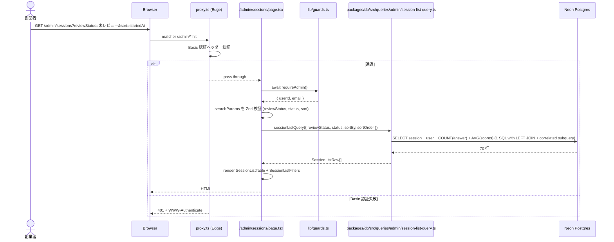
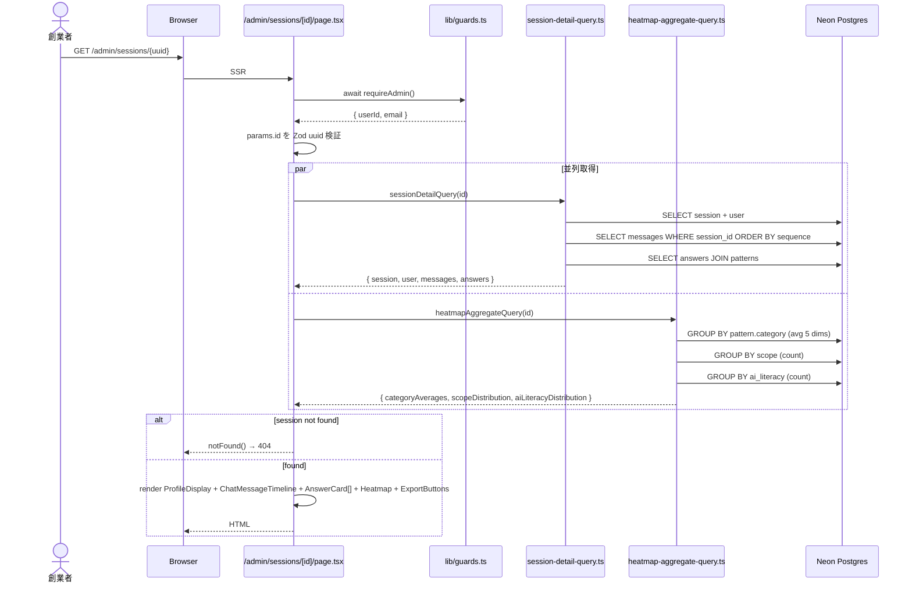
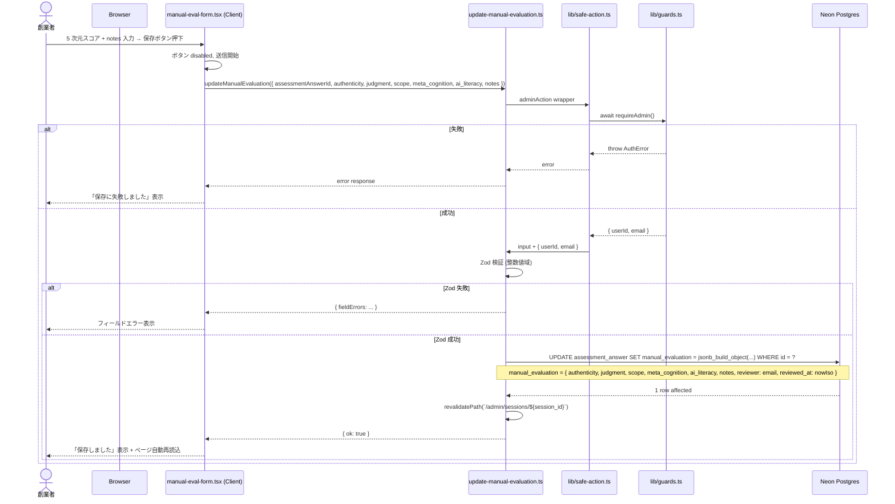

# Design Document: admin-review-panel

## Overview

**Purpose**: bulr Stage 1 の検証ゴール「70 セッション × LLM 評価と手動評価の相関分析」を達成するための管理画面 UI を、`apps/web` 同居の `/admin/sessions/` 配下に最小機能で構築する。創業者は本画面で (1) 全セッション一覧の俯瞰とフィルタ・ソート、(2) セッション詳細での受験プロファイル + 対話履歴 + パターン別 4 段階回答 + LLM 評価の閲覧、(3) 各 `assessment_answer` への 5 次元手動スコア入力（`manual_evaluation` JSONB upsert）、(4) LLM vs 手動の差分ハイライト並列表示、(5) カテゴリ別ヒートマップ（CSS のみで実装）、(6) CSV / JSON データエクスポートを完結できる。

**Users**:
- **創業者（管理者）**: `/admin/login` で Basic 認証 → Magic Link → `/admin/sessions` にアクセス。70 セッションを順次レビューし、各 answer に 5 次元の整数スコアを付与し、最後に CSV をダウンロードして Excel / Python pandas で相関分析を実施する。
- **Stage 2 の `apps/admin` 分離実装者**: 本スペックが `apps/web/app/admin/_components/` および `apps/web/app/admin/_actions/` に閉じて配置したコンポーネント / Server Action と、`packages/db/src/queries/admin/` のクエリを、`apps/admin` にディレクトリごと移動するだけで分離が完了する構造を受け取る。

**Impact**: `assessment-engine` 完了直後の状態（`assessment_session` / `assessment_answer` / `chat_message` / `assessment_pattern` テーブル + 70 セッション分のデータ蓄積開始可能）に対し、(1) `apps/web/app/admin/sessions/page.tsx` と `apps/web/app/admin/sessions/[id]/page.tsx` と `apps/web/app/admin/sessions/[id]/export/route.ts` を新規追加、(2) `apps/web/app/admin/_components/` 配下に 8 コンポーネントを新規追加、(3) `apps/web/app/admin/_actions/update-manual-evaluation.ts` を新規追加、(4) `packages/db/src/queries/admin/` 配下に 4 クエリ関数を新規追加、(5) `apps/web/app/admin/_health/` を削除（`authentication` spec の smoke test ページ撤去）、(6) `apps/web/package.json` に `react-markdown` が既存（assessment-engine 由来）であれば追加不要、なければ追加。DB スキーマ変更なし（既存 `manual_evaluation` JSONB カラムへの書き込みのみ）。

### Goals

- `requireAdmin` を全管理画面ページ / Route Handler の最初に呼ぶ多層認証を貫徹し、proxy.ts Basic 認証だけに依存しない（CVE-2025-29927 教訓）
- 手動評価入力を `adminAction` ラッパー + Zod 整数値域検証で安全に upsert
- LLM 評価 vs 手動評価の差分を 1 行 3 列（LLM / 手動 / 差分）で並列表示し、差分が `0` でない次元を視覚的にハイライト
- カテゴリ別平均スコア + 射程分布 + AI リテラシー分布をカテゴリ単位で集約し、CSS のみの横棒グラフで表示（Recharts / D3 等のチャートライブラリは Stage 2）
- CSV / JSON 両形式で 1 セッション単位のデータエクスポート（CSV は 1 行 1 answer、JSON は session + messages + answers の 3 トップレベル）を `/admin/sessions/[id]/export?format=csv|json` で提供
- コンポーネント / Server Action を `apps/web/app/admin/_components/` および `_actions/` に閉じて配置し、Stage 2 で `apps/admin` 分離時にディレクトリごと移動可能な構造を保つ
- 集約クエリを `packages/db/src/queries/admin/` に集約し、Server Component / Route Handler は薄く保つ
- `authentication` spec が一時設置した `/admin/_health/` smoke test ページを撤去する

### Non-Goals

- `apps/admin` への分離（Stage 2）
- フル機能のヒートマップ可視化（D3.js / Recharts 等のチャートライブラリ、Stage 2）
- 受験者管理（招待・削除・停止、Stage 2）
- パターン管理 UI（Stage 2、Stage 1 は TypeScript ファイル編集 + シード再実行で運用）
- LLM 評価の手動再実行・部分再実行（Stage 2）
- レビュー履歴・監査ログ（誰がいつどの値で更新したかの差分追跡、Stage 2）
- 複数管理者の権限分離（Stage 1 は `ADMIN_ALLOWED_EMAILS` でフラットに許可）
- リアルタイム通知（受験完了通知等、Stage 2）
- 統計ダッシュボード（受験率・完走率トレンド、Stage 2）
- 自動 E2E テスト（Playwright、Stage 2）。Stage 1 は手動 smoke test のみ
- ページネーション（Stage 1 は最大 70 件で全件取得で十分）

## Boundary Commitments

### This Spec Owns

- **管理画面ページ**:
  - `apps/web/app/admin/sessions/page.tsx`（セッション一覧、Server Component、`requireAdmin` 必須）
  - `apps/web/app/admin/sessions/[id]/page.tsx`（セッション詳細、Server Component、`requireAdmin` 必須）
  - `apps/web/app/admin/sessions/[id]/export/route.ts`（CSV / JSON エクスポート Route Handler、`requireAdmin` 必須）
- **管理画面専用コンポーネント**（すべて `apps/web/app/admin/_components/`）:
  - `session-list-table.tsx`（一覧テーブル、Server Component）
  - `session-list-filters.tsx`（フィルタ + ソート UI、Client Component、URL クエリパラメータ更新）
  - `profile-display.tsx`（受験プロファイル表示、Server Component）
  - `chat-message-timeline.tsx`（対話履歴タイムライン、Server Component）
  - `answer-card.tsx`（パターン別 4 段階回答 + LLM 評価 + 手動評価フォーム、Server Component）
  - `manual-eval-form.tsx`（手動評価入力フォーム、Client Component）
  - `eval-comparison.tsx`（LLM vs 手動の並列表示 + 差分ハイライト、Server Component）
  - `heatmap.tsx`（CSS のみの横棒グラフによるヒートマップ、Server Component）
- **管理画面専用 Server Action**:
  - `apps/web/app/admin/_actions/update-manual-evaluation.ts`（`adminAction` ラッパー、Zod 検証、`assessment_answer.manual_evaluation` upsert）
- **集約クエリ**（すべて `packages/db/src/queries/admin/`）:
  - `session-list-query.ts`（一覧 + 件数集計 + 平均スコア集計）
  - `session-detail-query.ts`（session + user + answers + messages + patterns）
  - `heatmap-aggregate-query.ts`（カテゴリ別平均 + 射程分布 + AI リテラシー分布）
  - `session-export-query.ts`（CSV / JSON 用の全データ取得）
  - `index.ts`（バレル export）
- **Zod スキーマ**: `apps/web/app/admin/_actions/schemas.ts`（`manualEvaluationInputSchema`、`exportFormatSchema`）
- **`apps/web/app/admin/_health/` の削除**: ディレクトリと `page.tsx` をコミットで削除

### Out of Boundary

- **`assessment_session` / `assessment_answer` / `chat_message` テーブルの構造変更**: `assessment-engine` spec の責務、本スペックは読み取り + `manual_evaluation` JSONB への書き込みのみ
- **`assessment_pattern` テーブルの構造変更**: `assessment-pattern-seed` spec の責務
- **`requireAdmin` / `adminAction` / `AuthError` の実装**: `authentication` spec が提供済み、本スペックは import するのみ
- **proxy.ts の構造変更**: `authentication` spec の責務、本スペックは触らない
- **`/admin/login` ページ**: `authentication` spec が実装済み
- **`packages/db/src/client.ts` および `drizzle.config.ts`**: `monorepo-foundation` 完了済み
- **受験者向け UI（`/assessments/*`）**: `assessment-engine` spec
- **LLM Tool 実装、システムプロンプト**: `assessment-engine` spec
- **環境変数の追加・変更**: `multi-env-infrastructure` 完了済み、本スペックは追加しない
- **CI ワークフロー**: 既存を継承
- **`apps/admin` への分離 + `packages/auth` 切り出し**: Stage 2

### Allowed Dependencies

- **新規 npm パッケージ**: なし（`react-markdown` は `assessment-engine` 完了時点で `apps/web` に追加済みのため再利用、追加が必要な場合のみ `react-markdown@^10` + `remark-gfm@^4` を追加）
- **既存パッケージ**:
  - `@bulr/db` workspace 依存（DB アクセス、Drizzle ORM）
  - `next@^16` / `react@^19`（既存）
  - `zod@^4`（既存、Server Action 入力検証）
  - `drizzle-orm@^0.45`（既存）
  - `react-markdown@^10` + `remark-gfm@^4`（assessment-engine で apps/web に追加済み、本スペックでは対話履歴の assistant メッセージ render に再利用）
- **環境変数**:
  - `ADMIN_ALLOWED_EMAILS`（既存、`requireAdmin` 経由）
  - `ADMIN_BASIC_AUTH_USER` / `ADMIN_BASIC_AUTH_PASSWORD`（既存、proxy.ts 経由）
  - `DATABASE_URL`（既存、Drizzle 経由）
- **ホスト環境**: Node.js 22 LTS+、Vercel Hobby（Node.js Runtime、Edge Runtime は本スペックでは使わない、proxy.ts のみ Edge）

### Revalidation Triggers

以下が発生した場合、本スペックの整合性を再検証する必要がある（または依存元 spec の変更を吸収する追加タスクが発生する）:

- `assessment_session` / `assessment_answer` / `chat_message` のカラム追加・削除・rename
- `llm_evaluation` JSONB のキー名・構造変更（5 次元のキー名 / `notes` 形式 / `evaluated_at` の有無）
- `manual_evaluation` JSONB の本スペック自身の合意構造（`{ authenticity, judgment, scope, meta_cognition, ai_literacy, notes, reviewer, reviewed_at }`）の変更（→ `assessment-engine` の Revalidation も誘発）
- `assessment_pattern.category` の値域変更（現行 `D` / `T` / `P` / `S` / `O` / `A`）
- `requireAdmin` / `adminAction` / `AuthError` の戻り値型 / 例外仕様の変更
- proxy.ts の matcher 範囲変更（`/admin/*` の保護解除など）
- 5 次元スコアの値域変更（`evaluation-rubric.md` の整合）
- Stage 2 で `apps/admin` 分離時の import パス変更
- `react-markdown` のメジャーバージョン変更

## Architecture

### Existing Architecture Analysis

- **`monorepo-foundation` で確立済み**: `apps/web` (Next.js 16 + React 19 + Tailwind 4 + shadcn/ui ベース) スケルトン、`packages/db` (Drizzle ORM + `pg` Pool client + `casing: 'snake_case'`)、`tsconfig.base.json` strict mode、`@bulr/db` バレル import 解決。
- **`multi-env-infrastructure` で確立済み**: `DATABASE_URL` / `ADMIN_*` 環境変数、Vercel Production / Preview スコープ、Neon dev / production 2 ブランチ。
- **`authentication` で確立済み**: `apps/web/lib/guards.ts`（`requireUser` / `requireAdmin` / `requireSessionOwnership` / `AuthError`）、`apps/web/lib/safe-action.ts`（`authedAction` / `adminAction`）、`apps/web/proxy.ts`（`/admin/*` Basic 認証）、`apps/web/app/admin/login/page.tsx`、`apps/web/app/admin/_health/page.tsx`（smoke test 専用、本スペックで削除）、Better Auth + `user` テーブル + `user_profile`。
- **`assessment-pattern-seed` で確立済み**: `assessment_pattern` テーブル（`code` / `category` / `title` 等）、57 パターン投入済み。
- **`assessment-engine` で確立済み**: `assessment_session` / `assessment_answer` / `chat_message` テーブル、`llm_evaluation` JSONB の構造（`{ authenticity, judgment, scope, meta_cognition, ai_literacy, notes, evaluated_at }`）、受験者フロー、Tool 5 種、`react-markdown` + `remark-gfm` 依存追加済み。
- **本スペックが踏襲するパターン**: `'server-only'` 不要（`packages/db` は元々サーバー専用、`apps/web/app/admin/_components/` の Server Component は SSR される）、Drizzle ORM 経由（生 SQL 禁止）、Zod で全外部入力検証、Server Component first / Client Component 最小化、kebab-case ファイル名、PascalCase コンポーネント、camelCase 関数、snake_case DB。
- **本スペックが導入する新パターン**: `_components/` および `_actions/` プレフィックス（Next.js App Router の private folder 規約により URL ルーティング対象外）による「閉じた」コンポーネント配置、CSS のみの横棒グラフ実装（Tailwind の `width-[N%]` または inline style）、CSV 出力の手書き整形（外部ライブラリ不使用）、Drizzle の `sql` テンプレート + jsonb 演算子による集約クエリ。

### Architecture Pattern & Boundary Map

```mermaid
graph TB
    subgraph Browser["創業者ブラウザ"]
        AdminUI[/admin/sessions 一覧 UI/]
        DetailUI[/admin/sessions/&#91;id&#93; 詳細 UI/]
        ExportBtn[CSV / JSON ダウンロードボタン]
    end

    subgraph EdgeProxy["Edge Runtime"]
        Proxy[apps/web/proxy.ts<br/>Basic 認証 + UX redirect<br/>(authentication spec)]
    end

    subgraph NextApp["apps/web Next.js 16 (Node.js Runtime)"]
        ListPage[app/admin/sessions/page.tsx<br/>Server Component<br/>requireAdmin]
        DetailPage[app/admin/sessions/&#91;id&#93;/page.tsx<br/>Server Component<br/>requireAdmin]
        ExportRoute[app/admin/sessions/&#91;id&#93;/export/route.ts<br/>Route Handler<br/>requireAdmin]

        subgraph AdminComps["app/admin/_components/ (closed)"]
            SLT[session-list-table.tsx]
            SLF[session-list-filters.tsx]
            PD[profile-display.tsx]
            CMT[chat-message-timeline.tsx]
            AC[answer-card.tsx]
            MEF[manual-eval-form.tsx<br/>(Client Component)]
            EC[eval-comparison.tsx]
            HM[heatmap.tsx<br/>(CSS only)]
        end

        subgraph AdminActions["app/admin/_actions/ (closed)"]
            UpdateAction[update-manual-evaluation.ts<br/>adminAction wrapper]
            ActionSchemas[schemas.ts]
        end

        subgraph LibAuth["lib/ (既存)"]
            Guards[guards.ts<br/>requireAdmin]
            SafeAction[safe-action.ts<br/>adminAction]
        end
    end

    subgraph PkgDb["packages/db"]
        QSessionList[src/queries/admin/session-list-query.ts]
        QSessionDetail[src/queries/admin/session-detail-query.ts]
        QHeatmap[src/queries/admin/heatmap-aggregate-query.ts]
        QExport[src/queries/admin/session-export-query.ts]
        DbClient[src/client.ts (既存)]
        SchemaSession[(既存) assessment_session]
        SchemaAnswer[(既存) assessment_answer]
        SchemaMessage[(既存) chat_message]
        SchemaPattern[(既存) assessment_pattern]
        SchemaUser[(既存) user]
    end

    subgraph DB["Neon Postgres"]
        TblSession[(assessment_session)]
        TblAnswer[(assessment_answer)]
        TblMessage[(chat_message)]
        TblPattern[(assessment_pattern)]
        TblUser[(user)]
    end

    Browser -->|HTTPS| Proxy
    Proxy -->|/admin/* Basic auth ok| ListPage
    Proxy -->|/admin/* Basic auth ok| DetailPage
    Proxy -->|/admin/* Basic auth ok| ExportRoute

    ListPage -->|requireAdmin| Guards
    DetailPage -->|requireAdmin| Guards
    ExportRoute -->|requireAdmin| Guards

    ListPage --> QSessionList
    ListPage --> SLT
    ListPage --> SLF
    DetailPage --> QSessionDetail
    DetailPage --> QHeatmap
    DetailPage --> PD
    DetailPage --> CMT
    DetailPage --> AC
    DetailPage --> HM
    AC --> EC
    AC --> MEF
    MEF -->|on submit| UpdateAction
    UpdateAction -->|adminAction wrapper| SafeAction
    UpdateAction --> ActionSchemas
    UpdateAction --> SchemaAnswer

    ExportRoute --> QExport

    QSessionList --> SchemaSession
    QSessionList --> SchemaAnswer
    QSessionList --> SchemaUser
    QSessionDetail --> SchemaSession
    QSessionDetail --> SchemaAnswer
    QSessionDetail --> SchemaMessage
    QSessionDetail --> SchemaPattern
    QHeatmap --> SchemaAnswer
    QHeatmap --> SchemaPattern
    QExport --> SchemaSession
    QExport --> SchemaAnswer
    QExport --> SchemaMessage
    QExport --> SchemaPattern
    QExport --> SchemaUser

    SchemaSession --> DbClient
    DbClient --> TblSession
    DbClient --> TblAnswer
    DbClient --> TblMessage
    DbClient --> TblPattern
    DbClient --> TblUser

    style EdgeProxy fill:#fde
    style DB fill:#def
    style PkgDb fill:#dff
    style AdminComps fill:#ffd
    style AdminActions fill:#ffd
```

**Architecture Integration**:

- **Selected pattern**: Server-First 多層認証 + 閉じた _components/_actions/ パターン。proxy.ts (Edge) の Basic 認証 + Server Component の `requireAdmin()` の二段が独立に効く。各管理画面ページは Server Component として SSR で集約クエリを実行し、結果を `_components/` 配下のコンポーネントに props で渡す。Client Component は手動評価フォーム（`manual-eval-form.tsx`）と一覧フィルタ（`session-list-filters.tsx`）の 2 つに限定する。集約クエリは `packages/db/src/queries/admin/` に集約し、Stage 2 で `apps/admin` 分離時にそのまま再利用可能。
- **Domain/feature boundaries**: `apps/web/app/admin/_components/` が UI コンポーネント、`apps/web/app/admin/_actions/` が mutation、`packages/db/src/queries/admin/` が DB クエリ、`apps/web/lib/guards.ts` + `apps/web/lib/safe-action.ts` が認証境界（既存）。本スペックは「読み取り全般 + `manual_evaluation` JSONB への書き込み」だけを担当し、スキーマ変更権を持たない。
- **Existing patterns preserved**: Server Component first、Drizzle ORM のみ、Zod 全入力検証、`requireAdmin` / `adminAction` 必須、kebab-case ファイル名、PascalCase コンポーネント、snake_case DB、`react-markdown` で XSS 防御。
- **New components rationale**:
  - **`_components/` プレフィックス**: Next.js App Router の private folder 規約により URL ルーティング対象外となる（`/admin/_components/...` URL は 404）。これにより、コンポーネントを安全に admin 配下に閉じて配置できる。
  - **CSS のみのヒートマップ**: Tailwind の `width-[${pct}%]` または inline style で横棒幅を計算。Stage 1 では Recharts / D3 不要。Stage 2 で本格可視化に置換予定。
  - **集約クエリの packages/db 配置**: Stage 2 で `apps/admin` を分離した時点で、admin app からも `@bulr/db` バレル経由でそのまま import できる（移動コスト 0）。
  - **CSV 出力の手書き整形**: 外部ライブラリ（`papaparse` / `csv-stringify` 等）を導入せず、`escapeCsvField()` 純関数 + 配列 join で実装。70 セッション規模では十分。UTF-8 BOM + CRLF で Excel 互換。
  - **`adminAction` ラッパーの再利用**: `authentication` spec が既に提供。本スペックは `update-manual-evaluation.ts` で `adminAction(schema, async (input, { userId, email }) => { ... })` 形式で消費。
- **Steering compliance**:
  - `tech.md`: Next.js 16 App Router、Server Component first、Tailwind 4、shadcn/ui ベース、Drizzle ORM、Zod、`react-markdown` で XSS 防御 → 遵守
  - `security.md`: 多層認証（proxy + `requireAdmin` + `adminAction`）、Zod 全入力検証、Drizzle のみ、個人情報をログに出さない、`reviewer` をサーバー側で取得 → 遵守
  - `structure.md`: `apps/web/app/admin/_components/` で閉じて配置、kebab-case / PascalCase 命名、`packages/db` がスキーマと集約クエリの単一の真実、Stage 2 で `apps/admin` 分離可能な構造 → 遵守
  - `evaluation-rubric.md`: 5 次元スコアの整数値域（authenticity / judgment / meta_cognition / ai_literacy 0-3、scope 1-5）、`manual_evaluation` JSONB の構造（5 次元 + notes + reviewer + reviewed_at）、LLM vs 手動の二重スキーム → 遵守

### Technology Stack

| Layer | Choice / Version | Role in Feature | Notes |
|-------|------------------|-----------------|-------|
| Framework | Next.js 16 App Router（既存） | Server Component / Route Handler / Server Action | App Router 安定 |
| UI | React 19（既存）+ Tailwind 4 + shadcn/ui ベース | 管理画面 UI、shadcn/ui の Button / Input / Select / Table を再利用 | Stage 1 はデザイン最小限 |
| Markdown | `react-markdown@^10` + `remark-gfm@^4`（assessment-engine 由来） | 対話履歴の assistant メッセージレンダリング | `dangerouslySetInnerHTML` 不使用 |
| Server Action | 自前 `adminAction` ラッパー（`authentication` 既存） | 手動評価 upsert | `apps/web/lib/safe-action.ts` |
| Auth | Better Auth（`requireAdmin` 経由） | 多層認証 | `apps/web/lib/guards.ts` |
| ORM | Drizzle ORM 0.45.x（既存） | 集約クエリ + JSONB 演算子 + GROUP BY | `packages/db/src/queries/admin/` |
| DB | Neon Postgres（既存） | 全データ読み取り + `manual_evaluation` 書き込み | dev / production 2 ブランチ |
| Validation | Zod 4.x（既存） | Server Action 入力 + Route Handler クエリパラメータ | 整数値域 + format enum |
| Type Safety | TypeScript 5.4+ strict（既存） | 集約クエリ戻り値型、コンポーネント props | no `any` |
| Charts | なし（CSS のみで横棒グラフ） | ヒートマップ表示 | Stage 2 で Recharts / D3 検討 |
| CSV | 自前 `escapeCsvField` + 配列 join | エクスポート | 外部ライブラリ不使用 |

> Stage 2 移行時に Recharts / D3 を `apps/admin` に追加する想定。Stage 1 では CSS 横棒で十分。

## File Structure Plan

### Directory Structure

```
bulr-app-mvp/
├── apps/
│   └── web/
│       ├── app/
│       │   └── admin/
│       │       ├── _health/                                    # ★ DELETE: authentication spec の smoke test 撤去
│       │       │   └── page.tsx                                # ★ DELETE
│       │       ├── _components/                                # ★ NEW: 管理画面専用コンポーネント (closed)
│       │       │   ├── session-list-table.tsx                  # ★ NEW: 一覧テーブル (Server Component)
│       │       │   ├── session-list-filters.tsx                # ★ NEW: フィルタ + ソート (Client Component)
│       │       │   ├── profile-display.tsx                     # ★ NEW: 受験プロファイル表示 (Server Component)
│       │       │   ├── chat-message-timeline.tsx               # ★ NEW: 対話履歴タイムライン (Server Component, react-markdown 利用)
│       │       │   ├── answer-card.tsx                         # ★ NEW: パターン別カード (Server Component, AnswerCard)
│       │       │   ├── manual-eval-form.tsx                    # ★ NEW: 手動評価入力フォーム (Client Component, 'use client')
│       │       │   ├── eval-comparison.tsx                     # ★ NEW: LLM vs 手動の並列表示 + 差分ハイライト (Server Component)
│       │       │   └── heatmap.tsx                             # ★ NEW: CSS のみの横棒グラフ (Server Component)
│       │       ├── _actions/                                   # ★ NEW: 管理画面専用 Server Action (closed)
│       │       │   ├── update-manual-evaluation.ts             # ★ NEW: adminAction wrapper, Zod 検証, upsert
│       │       │   └── schemas.ts                              # ★ NEW: manualEvaluationInputSchema, exportFormatSchema
│       │       ├── login/
│       │       │   └── page.tsx                                # 既存 (authentication spec)
│       │       └── sessions/
│       │           ├── page.tsx                                # ★ NEW: 一覧ページ (Server Component, requireAdmin)
│       │           └── [id]/
│       │               ├── page.tsx                            # ★ NEW: 詳細ページ (Server Component, requireAdmin)
│       │               └── export/
│       │                   └── route.ts                        # ★ NEW: CSV / JSON エクスポート (Route Handler, requireAdmin)
│       ├── lib/
│       │   ├── guards.ts                                       # 既存 (authentication spec, requireAdmin)
│       │   └── safe-action.ts                                  # 既存 (authentication spec, adminAction)
│       └── package.json                                        # 変更なし (react-markdown は assessment-engine で追加済み)
└── packages/
    └── db/
        └── src/
            └── queries/
                └── admin/                                      # ★ NEW: 管理画面集約クエリ
                    ├── index.ts                                # ★ NEW: バレル export
                    ├── session-list-query.ts                   # ★ NEW: 一覧 + 件数 + 平均スコア集計
                    ├── session-detail-query.ts                 # ★ NEW: session + user + answers + messages + patterns
                    ├── heatmap-aggregate-query.ts              # ★ NEW: カテゴリ別平均 + 射程分布 + AI リテラシー分布
                    └── session-export-query.ts                 # ★ NEW: CSV / JSON 用全データ取得
```

### Modified Files

- `apps/web/package.json` — 変更なし（`react-markdown` / `remark-gfm` は `assessment-engine` 完了時点で追加済み）。本スペックで未追加の場合のみ追加。
- `packages/db/src/queries/index.ts` — 既存になければ作成、`export * from './admin';` を追加。`packages/db/src/index.ts` バレルから `queries` も再 export する場合は同様に追記（既存パターンに合わせる）。

> **`packages/db/src/queries/` サブディレクトリのオーナーシップ**: 本 spec が `packages/db/src/queries/` サブディレクトリを最初に導入する（先行 spec の `monorepo-foundation` / `assessment-engine` / `assessment-pattern-seed` のいずれも `queries/` を作成していない）。したがって本 spec は (1) `packages/db/src/queries/admin/` 配下の 4 クエリファイルに加え、(2) `packages/db/src/queries/index.ts` を新規作成して `export * from './admin/index';` を含め、(3) `packages/db` のバレル export (`packages/db/src/index.ts`) に `export * from './queries/index';` を追加する。これにより `apps/web` 側から `import { sessionListQuery, sessionDetailQuery, heatmapAggregateQuery, sessionExportQuery } from '@bulr/db'` で利用可能となる（`@bulr/db/queries/admin` 経由の subpath import も後方互換のため有効）。

### Files NOT Created

- **チャートライブラリ**: `recharts` / `d3` は導入しない（Stage 2）
- **CSV パーサー**: `papaparse` / `csv-stringify` は導入しない（70 セッション規模では自前整形で十分）
- **`apps/web/components/admin-*.tsx`**: コンポーネントは全て `apps/web/app/admin/_components/` に閉じて配置（structure.md の Stage 2 移行容易性方針）
- **`apps/web/lib/admin/*.ts`**: ロジックは集約クエリ（packages/db）と Server Action（_actions/）に分離、`apps/web/lib/admin/` 配下は作らない
- **新規 npm パッケージ**: なし（既存依存のみ）
- **テストファイル**: Stage 1 は手動 smoke test のみ。Server Action の Zod 検証は型レベルで担保（必要であれば後で簡易な vitest を追加可能だが、本スペックでは新規導入しない）

> 各ファイルは「責務 1 つ」の原則を守る。Stage 2 で `apps/admin` 分離時は、`apps/web/app/admin/` ディレクトリを `apps/admin/app/` に移動 + `packages/db/src/queries/admin/` の import path 維持で完了する。

## System Flows

### フロー 1: セッション一覧ページの表示



### フロー 2: セッション詳細ページの表示



### フロー 3: 手動評価入力 → 保存



### フロー 4: CSV / JSON エクスポート

```mermaid
sequenceDiagram
    actor Admin as 創業者
    participant Browser
    participant ExportRoute as /admin/sessions/[id]/export/route.ts
    participant Guards as lib/guards.ts
    participant ExportQuery as session-export-query.ts
    participant DB as Neon Postgres

    Admin->>Browser: クリック「CSV ダウンロード」
    Browser->>ExportRoute: GET /admin/sessions/{uuid}/export?format=csv
    ExportRoute->>Guards: await requireAdmin()
    alt 失敗
        Guards-->>ExportRoute: throw AuthError
        ExportRoute-->>Browser: 401 / 403
    else 成功
        ExportRoute->>ExportRoute: format を Zod enum(['csv', 'json']) 検証
        ExportRoute->>ExportRoute: params.id を Zod uuid 検証
        ExportRoute->>ExportQuery: sessionExportQuery(id)
        ExportQuery->>DB: SELECT session + user + answers JOIN pattern + messages
        DB-->>ExportQuery: 全データ
        ExportQuery-->>ExportRoute: SessionExportData
        alt format = csv
            ExportRoute->>ExportRoute: rows.map(answer → CSV 行) + header + UTF-8 BOM + CRLF
            ExportRoute-->>Browser: 200 + Content-Type: text/csv; charset=utf-8 + Content-Disposition: attachment
        else format = json
            ExportRoute->>ExportRoute: { session, messages, answers } を JSON.stringify(_, null, 2)
            ExportRoute-->>Browser: 200 + Content-Type: application/json + Content-Disposition: attachment
        end
        Browser->>Admin: ダウンロード開始
    end
```

## Requirements Traceability

| Requirement | Summary | Components | Interfaces | Flows |
|-------------|---------|------------|------------|-------|
| 1.1-1.5 | 多層認証 | ListPage, DetailPage, ExportRoute, UpdateAction | requireAdmin, adminAction | フロー 1, 2, 3, 4 |
| 2.1-2.9 | セッション一覧 | ListPage, SessionListTable, SessionListFilters | sessionListQuery | フロー 1 |
| 3.1-3.7 | プロファイル + 対話履歴 | DetailPage, ProfileDisplay, ChatMessageTimeline | sessionDetailQuery | フロー 2 |
| 4.1-4.5 | パターン別カード + LLM 表示 | DetailPage, AnswerCard, EvalComparison | sessionDetailQuery | フロー 2 |
| 5.1-5.8 | 手動評価フォーム + Server Action | ManualEvalForm, UpdateAction | updateManualEvaluation, manualEvaluationInputSchema | フロー 3 |
| 6.1-6.7 | ヒートマップ | DetailPage, Heatmap | heatmapAggregateQuery | フロー 2 |
| 7.1-7.8 | CSV / JSON エクスポート | ExportRoute | sessionExportQuery, exportFormatSchema | フロー 4 |
| 8.1-8.7 | 集約クエリのモジュール化 | sessionListQuery, sessionDetailQuery, heatmapAggregateQuery, sessionExportQuery | (上記) | フロー 1, 2, 4 |
| 9.1-9.5 | 閉じた配置 | _components/, _actions/, packages/db/queries/admin/ | (構造制約) | — |
| 10.1-10.3 | smoke test ページ撤去 | (削除) | — | — |
| 11.1-11.6 | 入力検証とセキュリティ | UpdateAction, ExportRoute, ActionSchemas | manualEvaluationInputSchema, exportFormatSchema | フロー 3, 4 |
| 12.1-12.6 | 操作性とエラーハンドリング | ManualEvalForm, ListPage, DetailPage | (UI 規約) | フロー 1, 2, 3 |

## Components and Interfaces

### Pages (apps/web/app/admin/sessions/)

#### SessionListPage

| Field | Detail |
|---|---|
| Intent | `/admin/sessions` 一覧ページ。`requireAdmin` 通過後、searchParams を Zod 検証し集約クエリを呼んで一覧テーブル + フィルタを描画 |
| Requirements | 1.1, 1.2, 2.1-2.9, 8.1, 8.2, 12.3 |

**Responsibilities & Constraints**
- Server Component（`'use client'` なし）
- 最初に `await requireAdmin()` を呼ぶ
- searchParams `reviewStatus` / `status` / `sortBy` / `sortOrder` を Zod 検証
- `sessionListQuery(filters)` を呼び、結果を `SessionListTable` に props で渡す
- `SessionListFilters` を render（URL クエリパラメータ更新は Client 側で実施）

##### Service Interface

```typescript
// apps/web/app/admin/sessions/page.tsx
export default async function SessionListPage({
  searchParams,
}: {
  searchParams: Promise<Record<string, string | string[] | undefined>>;
}) {
  await requireAdmin(); // throws AuthError on fail
  const sp = await searchParams;
  const filters = sessionListFiltersSchema.parse({
    reviewStatus: sp.reviewStatus,
    status: sp.status,
    sortBy: sp.sortBy,
    sortOrder: sp.sortOrder,
  });
  const rows = await sessionListQuery(filters);
  return (
    <main>
      <SessionListFilters initial={filters} />
      <SessionListTable rows={rows} />
    </main>
  );
}
```

**Implementation Notes**
- `sessionListFiltersSchema` は本ファイル内（または `_components/session-list-filters.tsx` 同居）で定義: `{ reviewStatus: z.enum([...]).optional(), status: z.enum([...]).optional(), sortBy: z.enum(['startedAt','email','avgScore']).default('startedAt'), sortOrder: z.enum(['asc','desc']).default('desc') }`
- ページネーションなし（70 件以下を全件取得）

---

#### SessionDetailPage

| Field | Detail |
|---|---|
| Intent | `/admin/sessions/[id]` 詳細ページ。`requireAdmin` 通過後、`params.id` を Zod uuid 検証し、session + 詳細クエリ + ヒートマップ集約を並列取得して全コンポーネントを render |
| Requirements | 1.1, 1.2, 3.1-3.7, 4.1-4.5, 6.1-6.7, 8.3, 8.4, 12.4 |

**Responsibilities & Constraints**
- Server Component
- 最初に `await requireAdmin()` を呼ぶ
- `params.id` を `z.string().uuid()` で検証
- `sessionDetailQuery(id)` と `heatmapAggregateQuery(id)` を `Promise.all` で並列取得
- session が null なら `notFound()` で 404
- `ProfileDisplay` / `ChatMessageTimeline` / `AnswerCard[]` / `Heatmap` / Export ボタン群を render

##### Service Interface

```typescript
// apps/web/app/admin/sessions/[id]/page.tsx
export default async function SessionDetailPage({
  params,
}: {
  params: Promise<{ id: string }>;
}) {
  await requireAdmin();
  const { id } = await params;
  const parsedId = z.string().uuid().safeParse(id);
  if (!parsedId.success) notFound();
  const [detail, heatmap] = await Promise.all([
    sessionDetailQuery(parsedId.data),
    heatmapAggregateQuery(parsedId.data),
  ]);
  if (!detail) notFound();
  return (
    <main>
      <SessionMetaHeader session={detail.session} user={detail.user} reviewStatus={detail.reviewStatus} />
      <ProfileDisplay profileInput={detail.session.profileInput} />
      <ExportButtons sessionId={parsedId.data} />
      <Heatmap data={heatmap} />
      <ChatMessageTimeline messages={detail.messages} />
      <section>
        {detail.answers.map((a) => (
          <AnswerCard key={a.id} answer={a} pattern={a.pattern} />
        ))}
      </section>
    </main>
  );
}
```

**Implementation Notes**
- `SessionMetaHeader` と `ExportButtons` は内部に小さな関数として page.tsx 内に定義してもよい（軽量）
- `ProfileDisplay` は profile_input が `{}` でも壊れない（フィールドごとに `??` 'なし'）

---

#### SessionExportRoute

| Field | Detail |
|---|---|
| Intent | `/admin/sessions/[id]/export?format=csv|json` Route Handler。`requireAdmin` 通過後、CSV / JSON を生成してダウンロード形式で返す |
| Requirements | 1.4, 7.1-7.8, 8.5, 11.3, 11.4 |

**Responsibilities & Constraints**
- `apps/web/app/admin/sessions/[id]/export/route.ts` に配置
- `GET` ハンドラのみ
- 最初に `await requireAdmin()` を呼ぶ
- `params.id` を Zod uuid 検証、`format` を Zod enum 検証
- `sessionExportQuery(id)` を呼び、format に応じて CSV または JSON を生成
- `Content-Type` + `Content-Disposition: attachment; filename="session-{id}.csv|json"` ヘッダー設定
- session not found は 404 を返す

##### API Contract

| Method | Endpoint | Query | Response | Errors |
|--------|----------|-------|----------|--------|
| GET | /admin/sessions/[id]/export | `format=csv|json` | text/csv または application/json (attachment) | 400 (format / id 不正), 401 (未認証), 403 (権限なし), 404 (session not found) |

##### Service Interface

```typescript
// apps/web/app/admin/sessions/[id]/export/route.ts
export async function GET(
  request: Request,
  { params }: { params: Promise<{ id: string }> }
) {
  await requireAdmin();
  const { id } = await params;
  const parsedId = z.string().uuid().safeParse(id);
  if (!parsedId.success) return new Response(JSON.stringify({ error: 'invalid id' }), { status: 400 });
  const url = new URL(request.url);
  const parsedFormat = exportFormatSchema.safeParse(url.searchParams.get('format'));
  if (!parsedFormat.success) return new Response(JSON.stringify({ error: 'format must be csv or json' }), { status: 400 });
  const data = await sessionExportQuery(parsedId.data);
  if (!data) return new Response(JSON.stringify({ error: 'session not found' }), { status: 404 });
  if (parsedFormat.data === 'csv') {
    const csv = buildCsv(data); // UTF-8 BOM + CRLF
    return new Response('' + csv, {
      headers: {
        'Content-Type': 'text/csv; charset=utf-8',
        'Content-Disposition': `attachment; filename="session-${parsedId.data}.csv"`,
      },
    });
  }
  return new Response(JSON.stringify(data, null, 2), {
    headers: {
      'Content-Type': 'application/json; charset=utf-8',
      'Content-Disposition': `attachment; filename="session-${parsedId.data}.json"`,
    },
  });
}
```

**Implementation Notes**
- `buildCsv(data)` は同ファイル内（または `_components/` ではなく Route Handler 内）に純関数として定義: header 行 + 各 answer 行を `escapeCsvField()` でエスケープ + `\r\n` 結合
- `escapeCsvField(s)`: 値に `,` / `"` / `\r` / `\n` を含む場合のみ全体を `"` で囲み、内部 `"` を `""` にエスケープ
- CSV は 1 行 1 answer。session メタは各行に冗長に展開（pandas で扱いやすい形式）
- JSON は `{ session: {...}, messages: [...], answers: [...] }` 構造、`llm_evaluation` / `manual_evaluation` は JSONB そのまま

---

### Components (apps/web/app/admin/_components/)

#### SessionListTable

| Field | Detail |
|---|---|
| Intent | セッション一覧テーブル本体（行: session + user + 集約値）を render |
| Requirements | 2.1, 2.2, 2.3, 2.7, 2.8 |

**Responsibilities & Constraints**
- Server Component
- props: `rows: SessionListRow[]`
- `SessionListRow` 型: `{ id, examineeEmail, status, startedAt, completedAt, messageCount, answerCount, avgScore, reviewStatus }`
- レビューステータス（`未レビュー` / `一部レビュー` / `レビュー済み` / `回答なし`）はクエリ側で計算済みの enum を表示
- 各行末尾に `/admin/sessions/[id]` への Link
- `rows.length === 0` なら空メッセージ表示

##### Service Interface

```typescript
// apps/web/app/admin/_components/session-list-table.tsx
export type SessionListRow = {
  id: string;
  examineeEmail: string;
  status: 'in_progress' | 'completed' | 'abandoned';
  startedAt: Date;
  completedAt: Date | null;
  messageCount: number;
  answerCount: number;
  avgScore: number | null;
  reviewStatus: '未レビュー' | '一部レビュー' | 'レビュー済み' | '回答なし';
};

export function SessionListTable({ rows }: { rows: SessionListRow[] }): JSX.Element;
```

**Implementation Notes**
- shadcn/ui の `<Table>` コンポーネントを使用（apps/web 既存 UI に同梱）
- 日付フォーマット: `YYYY-MM-DD HH:mm`（`Intl.DateTimeFormat('ja-JP', ...)`）
- レビューステータスはバッジ風表示（`未レビュー` 赤、`一部レビュー` 黄、`レビュー済み` 緑、`回答なし` 灰）

---

#### SessionListFilters

| Field | Detail |
|---|---|
| Intent | フィルタ + ソートコントロール。URL クエリパラメータを更新して再読み込み |
| Requirements | 2.4, 2.5, 2.6 |

**Responsibilities & Constraints**
- Client Component（`'use client'`）
- props: `initial: { reviewStatus?, status?, sortBy, sortOrder }`
- `<Select>` でフィルタ選択 → `router.push(`?...`)` で URL 更新
- ソートはテーブルヘッダーのクリックで切替するので、本コンポーネントには含めない（必要なら統合）

##### Service Interface

```typescript
// apps/web/app/admin/_components/session-list-filters.tsx
'use client';
export function SessionListFilters({
  initial,
}: {
  initial: { reviewStatus?: string; status?: string; sortBy: string; sortOrder: string };
}): JSX.Element;
```

**Implementation Notes**
- `useRouter` + `useSearchParams` で現在の状態取得 + 更新
- 変更時に `router.push(`?${new URLSearchParams({...}).toString()}`)` でナビゲーション

---

#### ProfileDisplay

| Field | Detail |
|---|---|
| Intent | 受験プロファイル（経験年数 / 言語 / システム種別）を整形表示 |
| Requirements | 3.3 |

**Responsibilities & Constraints**
- Server Component
- props: `profileInput: unknown`（JSONB はキー欠落の可能性あり、フィールドごとに `??` 'なし'）
- 安全に取り出すため内部で軽量な型ガード（または zod safeParse）。期待する型は `assessment-engine` spec で `packages/types/src/profile.ts` に定義された正準 `ProfileInput`（`@bulr/types/profile` から import）

##### Service Interface

```typescript
// apps/web/app/admin/_components/profile-display.tsx
import type { ProfileInput } from '@bulr/types/profile';

export function ProfileDisplay({ profileInput }: { profileInput: unknown }): JSX.Element;
```

**Implementation Notes**
- `profileInput` の正準型は `@bulr/types/profile` の `ProfileInput`（`{ yearsOfExperience: number; languages: Language[]; systemTypes: SystemType[] }`）。JSONB 由来で全フィールド欠落の可能性があるため、内部の型ガードでは `Partial<ProfileInput>` 相当として扱う
- フィールド名は `systemTypes`（`systems` ではない）。`assessment-engine` の `profileInputSchema` および `packages/types/src/profile.ts` の正準型と一致させる
- 欠落時のフォールバック: `経験年数: -`、`言語: -`、`システム種別: -`

---

#### ChatMessageTimeline

| Field | Detail |
|---|---|
| Intent | `chat_message` を `sequence` 昇順で render し、role ごとに視覚区別 |
| Requirements | 3.4, 3.5, 3.6 |

**Responsibilities & Constraints**
- Server Component
- props: `messages: ChatMessage[]`（既に sequence 昇順でソート済み）
- `role='user'`: 右寄せ青、テキスト表示（プレーン）
- `role='assistant'`: 左寄せ灰、`react-markdown` + `remark-gfm` で render
- `role='tool'`: 左寄せ緑バッジ + `tool_calls` JSONB を `<pre>` で整形表示（`JSON.stringify(_, null, 2)`）

##### Service Interface

```typescript
// apps/web/app/admin/_components/chat-message-timeline.tsx
export function ChatMessageTimeline({ messages }: { messages: ChatMessage[] }): JSX.Element;
```

**Implementation Notes**
- `react-markdown` の component override で、`a` タグに `target='_blank'` + `rel='noopener noreferrer'` を付ける（自動リンク化された場合の安全策）
- 200 メッセージまで表示しても問題ない（CSS の `overflow-y-auto` で長いタイムラインに対応）

---

#### AnswerCard

| Field | Detail |
|---|---|
| Intent | パターン 1 つ分のカード（4 段階回答 + LLM 評価 + 手動評価フォーム） |
| Requirements | 4.1, 4.2, 4.3, 4.4 |

**Responsibilities & Constraints**
- Server Component
- props: `answer: AssessmentAnswer & { pattern: AssessmentPattern }`
- 上部: パターンコード + カテゴリバッジ + タイトル + level_reached + stuck_type
- 中央: 4 段階回答（`level_1_answer` 〜 `level_4_answer`）を縦に表示、各段階のタイトル付き、改行保持 + scrollable
- 下部: `<EvalComparison>`（LLM vs 手動）+ `<ManualEvalForm>`

##### Service Interface

```typescript
// apps/web/app/admin/_components/answer-card.tsx
export function AnswerCard({
  answer,
  pattern,
}: {
  answer: AssessmentAnswer;
  pattern: AssessmentPattern;
}): JSX.Element;
```

---

#### ManualEvalForm

| Field | Detail |
|---|---|
| Intent | 手動評価入力フォーム（5 次元整数 + notes）。Server Action 呼び出し + 状態管理 |
| Requirements | 5.1, 5.2, 5.3, 5.5, 5.6, 12.1, 12.2 |

**Responsibilities & Constraints**
- Client Component（`'use client'`）
- props: `assessmentAnswerId: string; initial?: ManualEvaluation`
- `useFormState` または `useTransition` で送信中状態管理
- 送信中はボタン disabled、エラー時は入力値保持

##### Service Interface

```typescript
// apps/web/app/admin/_components/manual-eval-form.tsx
'use client';
export type ManualEvaluation = {
  authenticity: number;
  judgment: number;
  scope: number;
  meta_cognition: number;
  ai_literacy: number;
  notes: string;
  reviewer?: string;
  reviewed_at?: string;
};
export function ManualEvalForm({
  assessmentAnswerId,
  initial,
}: {
  assessmentAnswerId: string;
  initial?: ManualEvaluation;
}): JSX.Element;
```

**Implementation Notes**
- Number input の `min` / `max` / `step=1` を HTML 属性で表現（クライアント側のヒント、サーバー側 Zod が authoritative）
- notes は `<textarea maxLength={2000}>`
- 保存ボタン: `<button disabled={isPending}>{isPending ? '保存中...' : '保存'}</button>`
- 成功時: `revalidatePath` が Server Action 内で呼ばれるため、ページが自動再読込される

---

#### EvalComparison

| Field | Detail |
|---|---|
| Intent | LLM 評価 vs 手動評価の並列表示 + 差分ハイライト |
| Requirements | 4.5 |

**Responsibilities & Constraints**
- Server Component
- props: `llm: LlmEvaluation | null; manual: ManualEvaluation | null`
- 5 次元それぞれを 1 行 3 列（LLM / 手動 / 差分）で表示
- 差分が `0` でない次元はその行の背景色を変更（Tailwind `bg-yellow-50` 等）
- どちらかが null なら未評価表示

##### Service Interface

```typescript
// apps/web/app/admin/_components/eval-comparison.tsx
export function EvalComparison({
  llm,
  manual,
}: {
  llm: LlmEvaluation | null;
  manual: ManualEvaluation | null;
}): JSX.Element;
```

**Implementation Notes**
- 表構造:
  | 次元 | LLM | 手動 | 差分 |
  |---|---|---|---|
  | authenticity | 2 | 3 | +1（背景色変更） |
  | judgment | 1 | 1 | 0 |
  | scope | 4 | 4 | 0 |
  | meta_cognition | 2 | 1 | -1（背景色変更） |
  | ai_literacy | 0 | 1 | +1（背景色変更） |
- 差分 = 手動 - LLM（正なら手動が高い、負なら手動が低い）

---

#### Heatmap

| Field | Detail |
|---|---|
| Intent | カテゴリ別平均 + 射程分布 + AI リテラシー分布を CSS 横棒で表示 |
| Requirements | 6.1-6.7 |

**Responsibilities & Constraints**
- Server Component
- props: `data: HeatmapAggregate`
- `data` 構造: `{ categoryAverages: { [category]: { authenticity, judgment, scope, meta_cognition, ai_literacy } }, scopeDistribution: { [scope]: count }, aiLiteracyDistribution: { [literacy]: count } }`
- カテゴリ別: 6 カテゴリ × 5 次元の格子状表示（各セルに値 + CSS 横棒）
- 射程分布: scope 1-5 の 5 行のヒストグラム
- AI リテラシー分布: ai_literacy 0-3 の 4 行のヒストグラム
- データなし時は「集計可能なデータがありません」表示

##### Service Interface

```typescript
// apps/web/app/admin/_components/heatmap.tsx
export type HeatmapCategoryKey = 'design' | 'trouble' | 'performance' | 'security' | 'organization' | 'ai';

export type HeatmapAggregate = {
  categoryAverages: Record<HeatmapCategoryKey, {
    authenticity: number | null;
    judgment: number | null;
    scope: number | null;
    meta_cognition: number | null;
    ai_literacy: number | null;
    answerCount: number;
  }>;
  scopeDistribution: Record<'1' | '2' | '3' | '4' | '5', number>;
  aiLiteracyDistribution: Record<'0' | '1' | '2' | '3', number>;
};

export function Heatmap({ data }: { data: HeatmapAggregate }): JSX.Element;
```

**Implementation Notes**
- CSS 横棒: `<div style={{ width: `${(value / maxValue) * 100}%`, height: '12px', background: 'currentColor' }} />`
- `maxValue` は次元ごとに固定（authenticity: 3、scope: 5 等）
- カラーは Tailwind の hue（カテゴリごとに変える）
- レイアウトは grid（6 行 × 5 列の格子）
- **カテゴリキーは DB の `assessment_pattern.category` カラムが保持するフルストリング (`design` / `trouble` / `performance` / `security` / `organization` / `ai`) をそのまま型キーに採用**。`heatmapAggregateQuery` が返す `GROUP BY pattern.category` の結果と一致させ、Page 側での再マッピングを不要にする
- 表示時の単一文字ラベル (`D` / `T` / `P` / `S` / `O` / `A`) は純粋に presentational であり、render 時に `const CATEGORY_LABELS: Record<HeatmapCategoryKey, string> = { design: 'D', trouble: 'T', performance: 'P', security: 'S', organization: 'O', ai: 'A' };` 等の map で変換する（型レイヤーには持ち込まない）

---

### Server Actions (apps/web/app/admin/_actions/)

#### UpdateManualEvaluationAction

| Field | Detail |
|---|---|
| Intent | `assessment_answer.manual_evaluation` JSONB upsert。`adminAction` ラッパー + Zod 検証 + reviewer/reviewed_at 自動設定 + revalidatePath |
| Requirements | 5.3, 5.4, 5.7, 5.8, 11.1, 11.6, 12.1 |

**Responsibilities & Constraints**
- `adminAction(schema, async (input, { userId, email }) => { ... })` 形式
- 入力 Zod 検証（5 次元整数値域 + notes 最大 2000 + assessmentAnswerId UUID）
- DB UPDATE: `manual_evaluation = jsonb_build_object(...)` または Drizzle の `set({ manualEvaluation: {...} })`
- `reviewer` は引数 `email` を使用（フォーム入力から取得しない）
- `reviewed_at` は `new Date().toISOString()`
- 対象 `assessment_answer.id` が存在しない場合は 404 相当のエラー（`{ ok: false, error: 'not_found' }`）を返す
- 成功時に `revalidatePath('/admin/sessions/' + session_id)` を呼ぶ

##### Service Interface

```typescript
// apps/web/app/admin/_actions/update-manual-evaluation.ts
'use server';
import { adminAction } from '@/lib/safe-action';
import { manualEvaluationInputSchema } from './schemas';

export const updateManualEvaluation = adminAction(
  manualEvaluationInputSchema,
  async ({ assessmentAnswerId, ...scores }, { userId, email }) => {
    const existing = await db.query.assessmentAnswer.findFirst({
      where: eq(assessmentAnswer.id, assessmentAnswerId),
      columns: { id: true, sessionId: true },
    });
    if (!existing) return { ok: false, error: 'not_found' as const };
    await db.update(assessmentAnswer)
      .set({
        manualEvaluation: {
          ...scores,
          reviewer: email,
          reviewed_at: new Date().toISOString(),
        },
        updatedAt: new Date(),
      })
      .where(eq(assessmentAnswer.id, assessmentAnswerId));
    revalidatePath(`/admin/sessions/${existing.sessionId}`);
    return { ok: true as const };
  }
);
```

##### Schema

```typescript
// apps/web/app/admin/_actions/schemas.ts
import { z } from 'zod';

export const manualEvaluationInputSchema = z.object({
  assessmentAnswerId: z.string().uuid(),
  authenticity: z.number().int().min(0).max(3),
  judgment: z.number().int().min(0).max(3),
  scope: z.number().int().min(1).max(5),
  meta_cognition: z.number().int().min(0).max(3),
  ai_literacy: z.number().int().min(0).max(3),
  notes: z.string().max(2000),
});

export const exportFormatSchema = z.enum(['csv', 'json']);
```

**Implementation Notes**
- `email` は `adminAction` ラッパーが `requireAdmin()` 戻り値の `email` を第 2 引数で渡す（`authentication` spec の契約）
- `revalidatePath` で詳細ページが再生成される
- `manual_evaluation` JSONB 構造の権威定義は本スペックが行う（assessment-engine は構造未定義のままにしている）

---

### DB Queries (packages/db/src/queries/admin/)

#### sessionListQuery

| Field | Detail |
|---|---|
| Intent | セッション一覧 + 件数 + 平均スコア + レビューステータスを 1 クエリで取得 |
| Requirements | 2.1, 2.2, 2.3, 8.1, 8.2 |

**Responsibilities & Constraints**
- 入力: `{ reviewStatus?, status?, sortBy, sortOrder }`
- 出力: `SessionListRow[]`
- LEFT JOIN `user` で email 取得
- 相関サブクエリまたは LEFT JOIN GROUP BY で `assessment_answer` の件数 + 平均スコアを集計
- レビューステータスは SQL CASE 式で計算（`null_count = total_count` → `未レビュー`、等）
- ソート: `sortBy` に応じて ORDER BY、`sortOrder` で `asc/desc`

##### Service Interface

```typescript
// packages/db/src/queries/admin/session-list-query.ts
export type SessionListFilters = {
  reviewStatus?: '未レビュー' | '一部レビュー' | 'レビュー済み' | '回答なし';
  status?: 'in_progress' | 'completed' | 'abandoned';
  sortBy?: 'startedAt' | 'email' | 'avgScore';
  sortOrder?: 'asc' | 'desc';
};

export type SessionListRow = {
  id: string;
  examineeEmail: string;
  status: 'in_progress' | 'completed' | 'abandoned';
  startedAt: Date;
  completedAt: Date | null;
  messageCount: number;
  answerCount: number;
  avgScore: number | null;
  reviewStatus: '未レビュー' | '一部レビュー' | 'レビュー済み' | '回答なし';
};

export async function sessionListQuery(filters: SessionListFilters): Promise<SessionListRow[]>;
```

**Implementation Notes**
- 1 クエリで `assessment_session` + `user` + 集約 `assessment_answer`（COUNT、COUNT FILTER (WHERE manual_evaluation IS NULL)、AVG）を取得
- 平均スコアは 5 次元の値の平均をさらに横断平均（`(authenticity + judgment + scope + meta_cognition + ai_literacy) / 5` のセッション平均）
- `llm_evaluation` JSONB から値抽出は Drizzle の `sql` テンプレート + `(llm_evaluation->>'authenticity')::int` 等
- 70 セッション規模では COUNT サブクエリで十分高速

---

#### sessionDetailQuery

| Field | Detail |
|---|---|
| Intent | セッション 1 件分の全情報（session + user + messages + answers JOIN patterns）を取得 |
| Requirements | 3.1-3.6, 4.1-4.4, 8.3 |

##### Service Interface

```typescript
// packages/db/src/queries/admin/session-detail-query.ts
export type SessionDetail = {
  session: AssessmentSession;
  user: { id: string; email: string };
  messages: ChatMessage[];
  answers: Array<AssessmentAnswer & { pattern: AssessmentPattern }>;
  reviewStatus: '未レビュー' | '一部レビュー' | 'レビュー済み' | '回答なし';
};

export async function sessionDetailQuery(sessionId: string): Promise<SessionDetail | null>;
```

**Implementation Notes**
- 3 クエリ（session+user / messages / answers+patterns）を `Promise.all` で並列、または 1 トランザクション
- session 不在なら null を返し、Page 側で `notFound()`

---

#### heatmapAggregateQuery

| Field | Detail |
|---|---|
| Intent | カテゴリ別平均 + 射程分布 + AI リテラシー分布を集約 |
| Requirements | 6.1-6.6, 8.4 |

##### Service Interface

```typescript
// packages/db/src/queries/admin/heatmap-aggregate-query.ts
export type HeatmapCategoryKey = 'design' | 'trouble' | 'performance' | 'security' | 'organization' | 'ai';

export type HeatmapAggregate = {
  categoryAverages: Record<HeatmapCategoryKey, {
    authenticity: number | null;
    judgment: number | null;
    scope: number | null;
    meta_cognition: number | null;
    ai_literacy: number | null;
    answerCount: number;
  }>;
  scopeDistribution: Record<'1' | '2' | '3' | '4' | '5', number>;
  aiLiteracyDistribution: Record<'0' | '1' | '2' | '3', number>;
};

export async function heatmapAggregateQuery(sessionId: string): Promise<HeatmapAggregate>;
```

**Implementation Notes**
- 3 SQL を `Promise.all`:
  1. `SELECT pattern.category, AVG((llm_evaluation->>'authenticity')::int)::numeric, ..., COUNT(*) FROM assessment_answer JOIN assessment_pattern ... WHERE session_id=? AND llm_evaluation IS NOT NULL GROUP BY pattern.category`
  2. `SELECT (llm_evaluation->>'scope')::int AS scope, COUNT(*) FROM assessment_answer WHERE session_id=? AND llm_evaluation IS NOT NULL GROUP BY scope`
  3. `SELECT (llm_evaluation->>'ai_literacy')::int AS literacy, COUNT(*) FROM assessment_answer WHERE session_id=? AND llm_evaluation IS NOT NULL GROUP BY literacy`
- 6 カテゴリ × 5 次元 + 5 scope + 4 literacy のすべてのキーを 0 / null で初期化してから上書き（presence guarantee）
- **`pattern.category` カラムが返すフルストリング (`design` / `trouble` / `performance` / `security` / `organization` / `ai`) をそのまま `categoryAverages` のキーに採用**。`assessment_pattern.category` の DB 上の値と `HeatmapCategoryKey` 型を一致させ、変換層を持たない設計とする（単一文字 `D` / `T` / `P` / `S` / `O` / `A` は Heatmap component 側で render 時のラベル変換のみに利用）
- `Heatmap` component と `heatmapAggregateQuery` の `HeatmapAggregate` / `HeatmapCategoryKey` 型は同一の構造定義を持つ（実装時はどちらか一方で定義し、もう一方は import して利用する）

---

#### sessionExportQuery

| Field | Detail |
|---|---|
| Intent | CSV / JSON 出力に必要な全データ（session + user + messages + answers + patterns）を取得 |
| Requirements | 7.4, 7.6, 8.5 |

##### Service Interface

```typescript
// packages/db/src/queries/admin/session-export-query.ts
export type SessionExportData = {
  session: AssessmentSession;
  user: { id: string; email: string };
  messages: ChatMessage[];
  answers: Array<AssessmentAnswer & { pattern: AssessmentPattern }>;
};

export async function sessionExportQuery(sessionId: string): Promise<SessionExportData | null>;
```

**Implementation Notes**
- 実装上 `sessionDetailQuery` と大半重複するため、内部で再利用してもよい（reviewStatus を含めない版）
- session 不在なら null

---

## Data Models

本スペックは新規テーブルを作成しない。既存テーブル（`assessment_session` / `assessment_answer` / `chat_message` / `assessment_pattern` / `user`）を読み取り、`assessment_answer.manual_evaluation` JSONB のみに書き込む。

### `manual_evaluation` JSONB 構造（本スペックが権威定義）

```typescript
type ManualEvaluation = {
  authenticity: number;       // 0-3 整数
  judgment: number;           // 0-3 整数
  scope: number;              // 1-5 整数
  meta_cognition: number;     // 0-3 整数
  ai_literacy: number;        // 0-3 整数
  notes: string;              // 0-2000 文字
  reviewer: string;           // 管理者メール（requireAdmin から取得）
  reviewed_at: string;        // ISO 8601 タイムスタンプ
};
```

- `reviewer` および `reviewed_at` は **必須** フィールド。フォームから取得せず、Server Action 内でサーバー側設定。
- 5 次元スコアと notes は `evaluation-rubric.md` の定義に準拠。
- `llm_evaluation` JSONB 構造（assessment-engine 由来）と「キー名 5 次元 + notes」が共通だが、`llm_evaluation` には `evaluated_at` があり、`manual_evaluation` には `reviewer` + `reviewed_at` がある（評価主体の違いを表現）。

## Error Handling

### Error Strategy

- **認証失敗**: `requireAdmin()` が `AuthError('UNAUTHORIZED')` または `AuthError('FORBIDDEN')` を投げる → Next.js のエラーバウンダリ（`error.tsx`）または `redirect('/admin/login')` で処理。Route Handler は `try/catch` で 401 / 403 レスポンスに変換。
- **入力検証失敗（Zod）**: Server Action は `{ ok: false, fieldErrors: ZodFlattenedErrors }` を返却、フォームがフィールドごとに表示。Route Handler は 400 + `{ error }` レスポンス。
- **DB エラー**: Server Action は `{ ok: false, error: 'db_error' }` を返却、フォームが「保存に失敗しました」表示。Route Handler は 500 + `{ error: 'internal' }`。Vercel ログに `console.error` でスタックトレース記録（個人情報を含めない）。
- **対象 not found**: Page は `notFound()` で 404、Route Handler / Server Action は明示エラー応答。
- **二重送信**: フォーム送信中はボタン disabled、`useTransition` で isPending 管理。

### Error Categories and Responses

**User Errors (4xx)**
- 401: 未認証 → `/admin/login` へリダイレクト（Page）または JSON 401（Route Handler）
- 403: `ADMIN_ALLOWED_EMAILS` に含まれない → 403 ページ表示
- 400: Zod 検証失敗 → フィールドエラー表示 / JSON 400
- 404: session not found → notFound() / JSON 404

**System Errors (5xx)**
- 500: DB 接続エラー、Drizzle 実行エラー → エラーバウンダリで「読み込みに失敗しました」表示、Vercel ログに記録

### Monitoring

Stage 1 は Vercel 標準ダッシュボードのみ。500 エラー発生時は Vercel ログで原因確認。Stage 2 で Sentry 統合。

## Testing Strategy

### Stage 1 は手動 smoke test のみ（自動 E2E なし）

**手動 smoke test 手順**:
1. `pnpm dev` 起動 → `http://localhost:3000/admin/sessions` にアクセス → Basic 認証ダイアログが出る
2. `ADMIN_BASIC_AUTH_USER` / `ADMIN_BASIC_AUTH_PASSWORD` を入力 → `/admin/login` または直接 `/admin/sessions` に到達
3. Magic Link で管理者メール（`ADMIN_ALLOWED_EMAILS` 含む）でサインイン
4. `/admin/sessions` 一覧表示 → 列とフィルタが機能することを確認
5. 任意のセッション行をクリック → `/admin/sessions/[id]` に遷移
6. プロファイル / 対話履歴 / 回答カード / ヒートマップ / エクスポートボタンが表示される
7. 1 つの answer に対し 5 次元スコア入力 → 保存 → 「保存しました」表示 + 再読込で値反映確認
8. EvalComparison で差分ハイライトが効くことを確認
9. 「CSV ダウンロード」クリック → `session-{id}.csv` ダウンロード → Excel で開いて文字化けなしを確認
10. 「JSON ダウンロード」クリック → `session-{id}.json` ダウンロード → `jq .` で整形できることを確認
11. `ADMIN_ALLOWED_EMAILS` に含まれないメールでサインインした場合 → `/admin/sessions` で 403 ページ表示
12. 未認証で `/admin/sessions/[id]/export?format=csv` 直 URL アクセス → 401 / 403 で拒否されることを確認

### Server Action の Zod 検証は型レベルで担保

Stage 1 では `manualEvaluationInputSchema` の Zod 定義と型推論で integer 値域を強制。実装時は型エラーが出れば修正、出なければ runtime で `safeParse` が拒否する。単体 vitest を導入する判断は実装後に行う（必須ではない）。

## Security Considerations

- **多層認証の徹底**: proxy.ts (Edge, Basic 認証) + Server Component の `requireAdmin()` + Server Action の `adminAction` の 3 層が独立に効く。CVE-2025-29927 対策。
- **`reviewer` のサーバー側固定**: フォーム / hidden input から取得せず、必ず `requireAdmin()` 戻り値の `email` を使用。
- **個人情報のログ非出力**: `console.log(user.email)` 禁止。`security.md` 準拠。
- **Drizzle ORM のみ**: 生 SQL の文字列結合禁止。集約クエリも Drizzle の `sql` テンプレート（パラメータ化済み）で記述。
- **Zod 全入力検証**: Server Action 入力、Route Handler クエリパラメータ、searchParams すべて Zod 検証。
- **エクスポート URL の保護**: 直 URL アクセスでも `requireAdmin()` を必ず通る。Route Handler の最初に呼ぶ。
- **XSS 防御**: `react-markdown` + `remark-gfm` で安全に render、`dangerouslySetInnerHTML` 不使用。
- **`assessment_answer.id` の所有性チェック**: Stage 1 はフラット権限（`requireAdmin` 通過者は全 answer 編集可）のため、所有性チェックは行わない（`security.md` の `requireSessionOwnership` は受験者向け、admin は全件アクセス前提）。

## Migration Strategy

DB スキーマ変更なし、データ移行なし。本スペックの実装デプロイ後、即座に管理画面が利用可能。

`apps/web/app/admin/_health/` の削除は通常コミットで実施（マイグレーション不要）。

## Stage 2 移行計画（参考）

本スペック完了時点で、Stage 2 で `apps/admin` を分離する際の手順は以下:

1. `apps/admin/` ディレクトリを新規作成（pnpm workspace に追加）
2. `apps/web/app/admin/` を `apps/admin/app/` に移動（パス維持）
3. `apps/admin` の `next.config.js` / `tsconfig.json` を作成
4. `packages/db/src/queries/admin/` はそのまま再利用（移動不要）
5. `apps/admin` で `requireAdmin` / `adminAction` を再実装または `packages/auth` に切り出し（structure.md の Stage 2 計画）
6. `apps/web/proxy.ts` の `/admin/*` matcher を削除（apps/admin が独立サブドメイン `admin.bulr.net` で運用される）
7. `apps/web` から admin 関連のすべてが消え、受験者向け UI に純化

本スペックの「閉じた配置」設計により、上記移行は機械的な作業のみで完了する（コードロジックの書き換え不要）。

## Supporting References

- `evaluation-rubric.md`: 5 次元スコアの値域、二重評価スキーム、`manual_evaluation` JSONB の根拠
- `security.md`: 多層認証、Zod 検証、XSS 防御、個人情報保護
- `structure.md`: `apps/web/app/admin/_components/` 配置、Stage 2 移行容易性、kebab-case / PascalCase 命名
- `tech.md`: Next.js 16 App Router、Server Component first、Tailwind 4、shadcn/ui
- `assessment-engine` design.md: `assessment_session` / `assessment_answer` / `chat_message` スキーマ、`llm_evaluation` JSONB 構造
- `authentication` design.md: `requireAdmin` / `adminAction` / proxy.ts / `/admin/_health/` smoke test page（本スペックで撤去）
