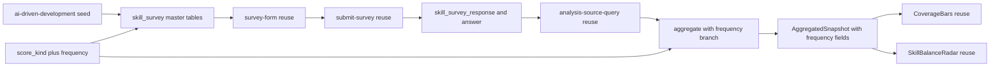
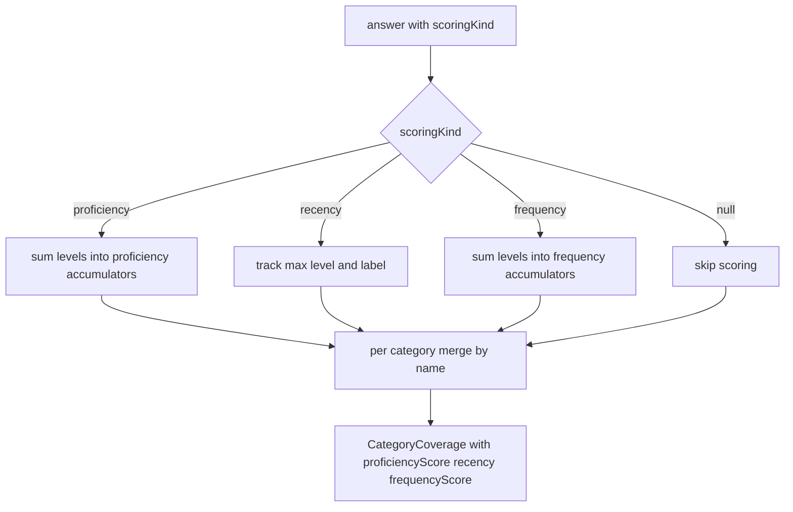
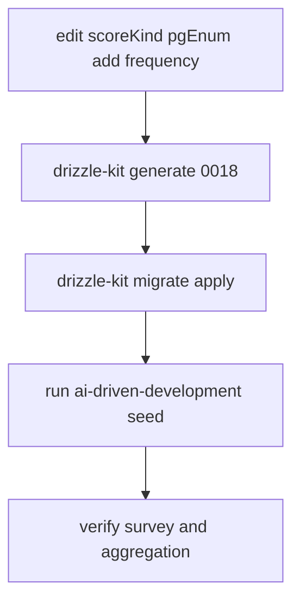

# Design Document — ai-driven-development-survey

## Overview

**Purpose**: AI 駆動開発に特化した独立スキルアンケート（`jobType='ai-driven-development'`）を新設し、候補者本人の AI 活用スキルバランスの理解と、採用側の一次フィルタ（必要スキルの濃淡判定）を可能にする。

**Users**: 候補者（エンジニア）が回答し自己分析で結果を確認する。採用担当者は回答カバレッジを一次フィルタとして利用する。

**Impact**: 既存 skill-survey / self-analysis 基盤は survey 非依存に動作するため、新 survey は **seed 追加**で一覧・回答・自己分析に出現する。コード変更は ①`score_kind` enum への `'frequency'` 追加とマイグレーション ②集計純関数 `aggregate()` の frequency 分岐 ③`CategoryCoverage` 型への frequency フィールド（任意・後方互換）追加 に限定される。フォーム描画・送信・必須判定・クールダウン・履歴・可視化コンポーネントは無変更。

### Goals

- `jobType='ai-driven-development'` の独立 survey を seed で提供し、4 軸（AI を使う開発／AI 機能を作る開発／チーム・ガバナンス／リテラシー・学習姿勢）を 6 カテゴリで多角的にカバーする（Req 1, 2）。
- ハイブリッド設問形式（multi_choice / single_choice+level / free_text）と標準習熟度ラベルを既存描画で表示する（Req 3）。
- 頻度系設問を熟練度と独立した系統で集計し、proficiency 指標へ混入させない（Req 4）。
- 既存の回答保存・クールダウン・自己分析・版履歴・可視化を改修なしで再利用する（Req 6, 7）。
- 既存職種アンケートと既存集計結果の非回帰を担保する（Req 9）。

### Non-Goals

- 新規フォーム描画／可視化コンポーネントの実装（既存を再利用）。
- 既存 backend アンケート内容の変更。
- 頻度スコア専用の新規ビジュアル（snapshot に保持するが当面 UI 追加はしない）。
- 面接（assessment/interview）・スカウト連携、複数 survey 横断の合成スコア。
- 自己分析 LLM ナラティブ生成ロジックの変更。

## Boundary Commitments

### This Spec Owns

- `jobType='ai-driven-development'` の survey マスタ定義（カテゴリ／設問／選択肢／level／scoringKind／isRequired）と、その冪等 seed・登録。
- `score_kind` enum への `'frequency'` 追加と対応マイグレーション。
- `aggregate()` における frequency 系統の独立集計、および `CategoryCoverage` への frequency フィールド追加（optional・後方互換）。

### Out of Boundary

- フォーム描画（`survey-form.tsx`）、回答送信・必須検証・クールダウン（`submit-survey.ts` ほか）、自己分析の検出・生成・可視化（`coverage-bars.tsx` / `skill-balance-radar.tsx`）、版履歴 — いずれも survey 非依存のため**無変更で再利用**し、本 spec は手を入れない。
- 既存 backend アンケートの内容・必須判定。
- proficiency / recency の既存集計ロジック（frequency 追加で挙動を変えない）。

### Allowed Dependencies

- 前提依存（マージ済み）: `skill-survey-proficiency-scale`（`choice.level` / `question.scoring_kind` / `aggregate()` の proficiency・recency 拡張 / 熟練度レーダー）。
- 既存テーブル: `skill_survey_response` / `skill_survey_answer`（回答保存）、`self_analysis`（スナップショット／版履歴）。
- 既存設定: 再回答クールダウン設定（既定 30 日）。
- 依存制約: パッケージ依存方向 `apps → packages` を守る。集計純関数は `@bulr/db` の型のみ参照し I/O を持たない。

### Revalidation Triggers

- `CategoryCoverage` / `AggregatedSnapshot` の形状変更（自己分析の消費側に影響）。
- `score_kind` enum 値の追加・改名（集計分岐・seed に影響）。
- seed 登録経路（`seeds/index.ts`）の構造変更。
- 必須設問セットの変更（送信バリデーションの結果が変わる）。

## Architecture

### Existing Architecture Analysis

- **マスタ 4 階層**: `skill_survey`(jobType 一意) → `skill_survey_category`((surveyId,name,subcategory) 一意) → `skill_survey_question`((categoryId,body) 一意, `questionType`/`scoringKind`/`isRequired`) → `skill_survey_choice`((questionId,label) 一意, `level`)。
- **回答**: `skill_survey_response`（追記型・版）＋ `skill_survey_answer`（`selectedChoiceIds[]` / `freeText`）。survey 非依存。
- **自己分析**: `analysis-source-query.ts` が回答を `SurveyResponseForAnalysis` に解決（`scoringKind` を透過）→ `aggregate()` が `AggregatedSnapshot` を生成 → `self_analysis.aggregated_snapshot`(jsonb) に保存 → `CoverageBars` / `SkillBalanceRadar` が表示。survey 単位で自動検出・独立スナップショット。
- **保持すべき不変点**: survey 非依存性、集計純関数性（同一入力→同一出力・I/O なし）、optional フィールドによる後方互換、依存方向 `apps → packages`。

### Architecture Pattern & Boundary Map



**Architecture Integration**:

- Selected pattern: 既存パイプラインへの**データ駆動拡張**（seed 中心）＋集計の最小分岐追加。
- 境界分離: 新規所有は seed・enum・集計分岐・型拡張のみ。描画/送信/可視化は再利用境界として不可侵。
- 保持パターン: 冪等 upsert、`questionType` 駆動描画、independent scoring 系統、optional 後方互換、依存方向。
- 新規理由: frequency を proficiency と混在させない要件（Req 4）が enum 値追加と集計分岐を必須にする。

### Technology Stack

| Layer | Choice / Version | Role in Feature | Notes |
| --- | --- | --- | --- |
| Data / Storage | PostgreSQL + Drizzle ORM 0.45 | `score_kind` enum 値追加・seed 投入 | `drizzle-kit generate/migrate`（DIRECT_URL>DATABASE_URL） |
| Backend / Services | TypeScript 集計純関数 | `aggregate()` frequency 分岐 | I/O なし・決定論的 |
| Frontend / UI | 既存 Next.js コンポーネント | 表示は再利用（変更なし） | 新規 viz なし |

## File Structure Plan

### New Files

```
packages/db/src/seeds/skill-surveys/
└── ai-driven-development.ts   # 新 survey 定義データ + runAiDrivenDevelopmentSkillSurveySeed(db)（冪等 upsert, backend.ts に準拠）

packages/db/drizzle/
└── 0018_*.sql                 # drizzle-kit generate 生成: ALTER TYPE score_kind ADD VALUE 'frequency'
```

### Modified Files

- `packages/db/src/schema/skill-survey.ts` — `scoreKind` pgEnum に `'frequency'` を追加（`['proficiency','recency','frequency']`）。派生型 `ScoreKind` が自動的に広がる。
- `packages/db/src/seeds/index.ts` — barrel export と `main()` に `runAiDrivenDevelopmentSkillSurveySeed` を登録（backend に続けて実行）。
- `packages/db/src/schema/self-analysis.ts` — `CategoryCoverage` に `frequencyScore?: number | null` と `answeredFrequencyCount?: number` を追加（optional・後方互換）。
- `apps/candidate/app/self-analysis/_lib/aggregate.ts` — frequency 系統の集計分岐と `frequencyScore`/`answeredFrequencyCount` 算出を追加。proficiency/recency 経路は不変。

### Unchanged (Reused) — 明示的に手を入れないファイル

- `apps/candidate/app/skill-survey/_components/survey-form.tsx`（描画）
- `apps/candidate/app/skill-survey/[surveyId]/_actions/submit-survey.ts`（送信・必須検証・クールダウン）
- `packages/db/src/queries/self-analysis/analysis-source-query.ts`（scoringKind 透過のため無変更）
- `apps/candidate/app/self-analysis/_components/coverage-bars.tsx` / `skill-balance-radar.tsx`（可視化）

## Survey Content Blueprint（確定版）

> 凡例: `[multi]`=multi_choice / `[scale:proficiency]`=single_choice+level(0-3) 熟練度 / `[scale:frequency]`=single_choice+level(0-3) 頻度 / `[free]`=free_text(任意)。標準習熟度ラベル＝L0 未経験・知識なし / L1 学習・理解はある（実務経験なし）/ L2 実務で実装・運用したことがある / L3 設計・改善を主導／チームへ展開・標準化した。必須は ★。

### カテゴリ1: AI支援開発ツール（射程①）

| # | 設問 | 形式 | scoringKind | level ラベル |
| --- | --- | --- | --- | --- |
| 1 ★ | 日常的に利用しているAIコーディング支援ツールを選択してください。 | [multi] | — | — |
| 2 | 利用しているAIチャット/アシスタントを選択してください。 | [multi] | — | — |
| 3 | AI支援ツールの利用頻度を選択してください。 | [scale:frequency] | frequency | 0 使っていない / 1 たまに / 2 日常的に / 3 開発ワークフローの中心 |

- Q1 選択肢: GitHub Copilot / Cursor / Claude Code / Windsurf / Cline・Roo Code / Codeium / Tabnine / JetBrains AI Assistant / Amazon Q Developer / Gemini Code Assist / v0 / bolt.new / その他
- Q2 選択肢: ChatGPT / Claude / Gemini / Perplexity / GitHub Copilot Chat / ローカルLLM（Ollama 等）/ その他

### カテゴリ2: 開発スタイル・ワークフロー（射程①）

| # | 設問 | 形式 | scoringKind | level ラベル |
| --- | --- | --- | --- | --- |
| 4 ★ | AI活用の深度として最も近いものを選択してください。 | [scale:proficiency] | proficiency | 0 ほぼ使わない / 1 補完中心 / 2 チャットで相談しながら実装 / 3 エージェントに委譲・仕様駆動で運用 |
| 5 | AIを活用しているSDLCフェーズを選択してください。 | [multi] | — | — |
| 6 | エージェント型開発（タスクを委譲し自律実行させる開発）の習熟度を選択してください。 | [scale:proficiency] | proficiency | 標準習熟度ラベル |

- Q5 選択肢: 要件整理 / 設計 / 実装 / テスト生成 / コードレビュー / デバッグ / リファクタリング / ドキュメント作成 / 技術調査・学習 / データ移行・スクリプト

### カテゴリ3: テクニック（射程①）

| # | 設問 | 形式 | scoringKind | level ラベル |
| --- | --- | --- | --- | --- |
| 7 | 実践しているテクニックを選択してください。 | [multi] | — | — |
| 8 | プロンプト/コンテキスト設計の習熟度を選択してください。 | [scale:proficiency] | proficiency | 標準習熟度ラベル |
| 9 | AI活用で生産性・品質を上げた具体的な工夫、または失敗から学んだことを記述してください。 | [free] | — | 任意 |

- Q7 選択肢: プロンプト設計の工夫 / 関連ファイル・仕様をコンテキストとして与える / カスタムルール・指示ファイル整備（.cursorrules, CLAUDE.md, AGENTS.md 等）/ MCP・ツール連携 / サブエージェント・マルチエージェント / コードベースを参照させる（RAG的活用）/ テスト駆動でAIに実装させる / AI出力を差分レビューして取り込む

### カテゴリ4: 品質・ガバナンス（射程③）

| # | 設問 | 形式 | scoringKind | level ラベル |
| --- | --- | --- | --- | --- |
| 10 ★ | AI生成コードの検証レベルとして最も近いものを選択してください。 | [scale:proficiency] | proficiency | 0 そのまま使う / 1 目視で確認 / 2 テストで検証 / 3 レビュー基準を整備しチームで運用 |
| 11 | AI利用で意識しているリスク対策を選択してください。 | [multi] | — | — |
| 12 | チーム/組織でAI活用のルール策定・ガイドライン整備に関与した経験を選択してください。 | [scale:proficiency] | proficiency | 標準習熟度ラベル |

- Q11 選択肢: 機密情報をプロンプトに入れない / ライセンス・著作権の確認 / 幻覚した依存パッケージの検証 / 生成コードのセキュリティレビュー / 社内のAI利用ポリシー遵守 / 監査ログ・利用範囲の管理

### カテゴリ5: AI機能の開発経験（LLMアプリ）（射程②）

| # | 設問 | 形式 | scoringKind | level ラベル |
| --- | --- | --- | --- | --- |
| 13 | 経験のあるAI/LLM開発要素を選択してください。 | [multi] | — | — |
| 14 | 利用したAI開発フレームワーク/基盤を選択してください。 | [multi] | — | — |
| 15 | LLMアプリ開発の習熟度を選択してください。 | [scale:proficiency] | proficiency | 標準習熟度ラベル |

- Q13 選択肢: LLM API連携（OpenAI/Anthropic/Google 等）/ 本番でのプロンプトエンジニアリング / RAG / ベクトルDB・埋め込み / エージェント・ツール呼び出し / MCPサーバ実装 / 評価(eval)パイプライン / ガードレール・安全対策 / ファインチューニング / コスト・レイテンシ最適化 / ストリーミングUX
- Q14 選択肢: LangChain / LlamaIndex / Vercel AI SDK / Semantic Kernel / DSPy / OpenAI SDK / Anthropic SDK / Amazon Bedrock / Google Vertex AI / その他

### カテゴリ6: AIリテラシー・学習姿勢（射程④）

| # | 設問 | 形式 | scoringKind | level ラベル |
| --- | --- | --- | --- | --- |
| 16 | 新しいAIツール・手法のキャッチアップ頻度を選択してください。 | [scale:frequency] | frequency | 0 ほぼしない / 1 ときどき / 2 定期的に / 3 常に最新を追い試す |
| 17 | モデル特性（コンテキスト長・幻覚・得手不得手）の理解度を選択してください。 | [scale:proficiency] | proficiency | 標準習熟度ラベル |
| 18 | AIをどこまで信頼し、どのように検証しているか、あなたの考え方を記述してください。 | [free] | — | 任意 |

**集計**: 計 6 カテゴリ / 18 設問。必須 3 問（#1 利用ツール・#4 活用深度・#10 検証レベル）。proficiency 設問 7 問、frequency 設問 2 問、multi 6 問、free 2 問。

**カテゴリ `subcategory` は非 null の安定識別子を付与する**（冪等性のため必須。下表）。カテゴリ一意インデックス `(skillSurveyId, name, subcategory)` は標準 unique index（NULL 同士を非等価に扱う）であり、`subcategory=null` だと `onConflictDoUpdate` の conflict target が既存行にヒットせず seed 再実行で重複 INSERT され冪等性（Req 8.2）を壊す。既存 backend は subcategory が常に非 null のため顕在化していない。

| カテゴリ name | subcategory |
| --- | --- |
| AI支援開発ツール | ツール利用 |
| 開発スタイル・ワークフロー | ワークフロー |
| テクニック | テクニック |
| 品質・ガバナンス | 品質・ガバナンス |
| AI機能の開発経験 | LLMアプリ開発 |
| AIリテラシー・学習姿勢 | リテラシー・学習姿勢 |

## System Flows

頻度系統の集計分岐のみ非自明なため、集計純関数内の分類フローを示す。



- frequency は proficiency と同じ「level 平均→0..100 正規化」だが**独立アキュムレータ**で集計し、proficiency 指標へ加算しない（Req 4.3）。寄与 0 件なら `frequencyScore=null`。`selectedLevels` 欠落の旧データは null 安全にスキップ（Req 4.4）。

## Requirements Traceability

| Requirement | Summary | Components | Interfaces | Flows |
| --- | --- | --- | --- | --- |
| 1.1, 1.2, 1.3, 1.4 | 独立 survey 提供・一覧表示・既存非干渉・独立履歴 | AI survey seed, 既存一覧/自己分析（再利用） | seed data / `runAiDrivenDevelopmentSkillSurveySeed` | Boundary Map |
| 2.1, 2.2, 2.3, 2.4 | 6 カテゴリ・形式配置・4 軸網羅・適量 | AI survey seed（Survey Content Blueprint） | seed data | — |
| 3.1, 3.2, 3.3, 3.4, 3.5 | ハイブリッド形式・標準ラベル・既存描画 | AI survey seed, survey-form（再利用） | `questionType`/`scoringKind`/`level` 付与 | — |
| 4.1 | 頻度設問に level 付与 | AI survey seed（frequency 設問） | choice.level | — |
| 4.2, 4.3, 4.4 | 頻度独立集計・非混入・後方互換 | aggregate frequency 分岐, CategoryCoverage 型 | `aggregate()` / `CategoryCoverage` | 集計フロー |
| 5.1 | 必須3問設定 | AI survey seed（isRequired） | question.isRequired | — |
| 5.2, 5.3, 5.4 | 必須未回答拒否・自由記述任意・受理 | submit-survey（再利用） | 既存バリデーション | — |
| 6.1, 6.2, 6.3, 6.4 | 永続化・クールダウン・追記版 | 既存回答保存・クールダウン（再利用） | 既存 server action | — |
| 7.1, 7.2, 7.3, 7.4 | 独立スナップショット・既存可視化・併存・独立版 | 既存自己分析・可視化（再利用） | `AggregatedSnapshot` | Boundary Map |
| 7.5 | 熟練度なしカテゴリは radar 除外・カバレッジ表示 | SkillBalanceRadar（既存: null 除外） | `proficiencyScore===null` | — |
| 8.1, 8.2, 8.3, 8.4 | seed 定義・冪等 upsert・規約準拠・level/scoringKind 付与 | AI survey seed, seeds/index | `runAiDrivenDevelopmentSkillSurveySeed` | — |
| 9.1, 9.2, 9.3 | 既存挙動非回帰 | enum 追加・aggregate 分岐（最小） | 既存テスト＋追補 | — |

## Components and Interfaces

| Component | Domain/Layer | Intent | Req Coverage | Key Dependencies | Contracts |
| --- | --- | --- | --- | --- | --- |
| AI survey seed | Data/Seed | 新 survey 定義と冪等投入 | 1, 2, 3, 4.1, 5.1, 8 | skill-survey schema (P0) | Batch |
| score_kind enum + migration | Data/Schema | frequency 集計分類を追加 | 4.1 | drizzle-kit (P0) | State |
| aggregate frequency 拡張 | Backend/Pure | 頻度独立集計 | 4.2, 4.3, 4.4, 7.5 | CategoryCoverage 型 (P0) | Service |
| CategoryCoverage 型拡張 | Data/Types | frequency フィールド保持 | 4.2 | — | State |

### Data / Seed

#### AI survey seed

| Field | Detail |
| --- | --- |
| Intent | `jobType='ai-driven-development'` の survey/カテゴリ/設問/選択肢を定義し冪等投入する |
| Requirements | 1.1, 2.1-2.4, 3.1-3.4, 4.1, 5.1, 8.1-8.4 |

**Responsibilities & Constraints**

- Survey Content Blueprint を型付きデータ `AiDrivenDevelopmentSurveySeedData` として表現。
- `runAiDrivenDevelopmentSkillSurveySeed(db)` は backend.ts と同じ冪等 upsert 規約（survey: jobType / category: (surveyId,name,subcategory) / question: (categoryId,body) / choice: (questionId,label) を `onConflictDoUpdate`）に従う。
- **全カテゴリに非 null の `subcategory` を付与**する（Survey Content Blueprint の対応表参照）。`subcategory=null` は category 一意インデックス上で NULL 非等価のため重複 INSERT を招き冪等性を壊す（Req 8.2）。
- frequency 設問の `scoringKind='frequency'`、各スケール選択肢に `level`（0-3）、必須3問に `isRequired:true` を付与。

**Dependencies**

- Outbound: `skill_survey*` テーブル — 投入先（P0）
- Inbound: `seeds/index.ts` `main()` — 実行起点（P0）

**Contracts**: Batch [x]

##### Batch / Job Contract

- Trigger: `tsx packages/db/src/seeds/index.ts`（backend に続けて実行）。
- Input / validation: 静的データ。型 `AiDrivenDevelopmentSurveySeedData`（`scoringKind?: 'proficiency' | 'recency' | 'frequency'`）。
- Output / destination: `skill_survey` 4 階層テーブル。
- Idempotency & recovery: 全段 `onConflictDoUpdate`。再実行で重複ゼロ・既存定義を更新。

**Implementation Notes**

- Integration: `index.ts` の barrel export と `main()` に追加。
- Validation: 設問数・必須3問・level/scoringKind 付与を seed テストで確認（Req 8.4）。
- Risks: enum 値追加マイグレーション適用前に frequency 設問を含む seed を投入すると失敗 → タスク順で「マイグレーション→seed」を固定。

### Data / Schema

#### score_kind enum + migration

| Field | Detail |
| --- | --- |
| Intent | `score_kind` に `'frequency'` を追加し頻度を独立集計分類として表現可能にする |
| Requirements | 4.1 |

**Responsibilities & Constraints**

- `scoreKind = pgEnum('score_kind', ['proficiency','recency','frequency'])` に変更。派生型 `ScoreKind` が自動拡張され、`AnswerForAnalysis.scoringKind` も無変更で広がる。
- `drizzle-kit generate` で `ALTER TYPE "public"."score_kind" ADD VALUE 'frequency';` を生成・適用。

**Contracts**: State [x]

##### State Management

- State model: PostgreSQL enum 型に値を追記（既存値・既存データ不変）。
- Persistence & consistency: 追加のみ。使用は後続 seed（別トランザクション）で行うため安全。
- Concurrency strategy: 単一マイグレーション。

### Backend / Pure

#### aggregate frequency 拡張

| Field | Detail |
| --- | --- |
| Intent | 頻度系統を proficiency と独立して集計する |
| Requirements | 4.2, 4.3, 4.4, 7.5 |

**Responsibilities & Constraints**

- `MergedCategory` に `frequencyLevelSum` / `frequencyLevelCount` / `answeredFrequencyCount` を追加。
- ループに `else if (answer.scoringKind === 'frequency')` 分岐を追加し、`selectedLevels` を独立アキュムレータへ加算。proficiency アキュムレータには触れない。
- 出力 `CategoryCoverage` に `frequencyScore`（`count>0 ? round(sum/count/MAX_LEVEL*100) : null`）と `answeredFrequencyCount` を付与。
- 純関数性維持（I/O・乱数・時刻参照なし、同一入力→同一出力）。

**Contracts**: Service [x]

##### Service Interface

```typescript
// 既存シグネチャを維持（出力型のみ optional 拡張）
export function aggregate(source: SurveyResponseForAnalysis): AggregatedSnapshot;
```

- Preconditions: `source.categories[].answers[].scoringKind` は `ScoreKind | null`。
- Postconditions: frequency 回答は `frequencyScore`/`answeredFrequencyCount` にのみ反映。proficiency/recency 出力は frequency 追加前と完全一致。
- Invariants: 旧スナップショット（frequency フィールド欠落）と後方互換。

#### CategoryCoverage 型拡張

| Field | Detail |
| --- | --- |
| Intent | frequency 指標をスナップショットに保持 |
| Requirements | 4.2 |

**Responsibilities & Constraints**

- `frequencyScore?: number | null`、`answeredFrequencyCount?: number` を optional 追加（既存 proficiency/recency フィールドと同じ後方互換方針）。

**Contracts**: State [x]

## Data Models

### Logical Data Model

- マスタ／回答テーブルは**新規追加なし**。新 survey は既存テーブルへの行追加（seed）で表現。
- `score_kind` enum: `['proficiency','recency']` → `['proficiency','recency','frequency']`。
- `CategoryCoverage`（jsonb 内・型のみ）: `frequencyScore?`, `answeredFrequencyCount?` を追加。`AggregatedSnapshot` 形状は categories 要素の optional 拡張のみで後方互換。

## Error Handling

- **Seed 失敗**: いずれかの upsert 失敗時はトランザクションロールバック（backend と同じ `db.transaction`）。エラーは設問/カテゴリ識別子付きで throw。
- **マイグレーション順序エラー**: enum 未適用で frequency 設問 seed を実行すると enum 値不正で失敗 → タスク順序と手順書で防止。
- **旧データ集計**: `scoringKind`/`selectedLevels` 欠落は null 安全にスキップ（Req 4.4）。

## Testing Strategy

### Unit Tests（`aggregate.test.ts` 追補）

- frequency 回答が `frequencyScore`（level 平均→0..100）と `answeredFrequencyCount` に正しく反映される。
- frequency が proficiency/recency スコアに混入しない（同一入力で proficiency 出力が frequency 追加前と一致）。
- 寄与0件カテゴリの `frequencyScore` が null になる。
- 旧スナップショット相当（scoringKind=null / selectedLevels 欠落）でエラーなく後方互換（Req 4.4, 9.3）。

### Integration Tests（seed / query）

- `runAiDrivenDevelopmentSkillSurveySeed` 実行後、`jobType='ai-driven-development'` survey が 6 カテゴリ / 18 設問 / 必須3問 / frequency 2 問・各 level 付与で投入される（Req 8.4）。
- 二重実行で重複レコードが生成されない（冪等, Req 8.2）。
- 回答→`analysis-source-query`→`aggregate` で frequency 設問が `frequencyScore` に反映される（経路結合）。

### E2E/UI Tests（クリティカルパス・既存再利用の確認）

- 候補者が AI 駆動開発アンケートを一覧から開き、必須3問未回答で送信が拒否され、全必須回答で受理される（Req 1.2, 5.2, 5.4 — 既存フォームで動作）。
- 自己分析に AI アンケートの独立カードが出現し、カバレッジ＋熟練度レーダーが表示され、頻度のみカテゴリが radar から除外される（Req 7.2, 7.5）。

### 非回帰

- 既存 backend アンケートの一覧・回答・必須判定・クールダウン・自己分析・既存スナップショットが不変（Req 9.1-9.3）。

## Migration Strategy



- ロールバックトリガー: マイグレーション適用失敗、seed 冪等性違反、既存集計の差分検出。
- 検証チェックポイント: enum 値存在確認 → seed 件数確認 → aggregate ユニット/結合テスト緑 → 既存テスト緑。
- 運用注意: drizzle-kit は `DIRECT_URL > DATABASE_URL`。ローカルは `.env.local` の例 URL 誤検出を避けるため DIRECT_URL+DATABASE_URL を inline 上書きで実行。
