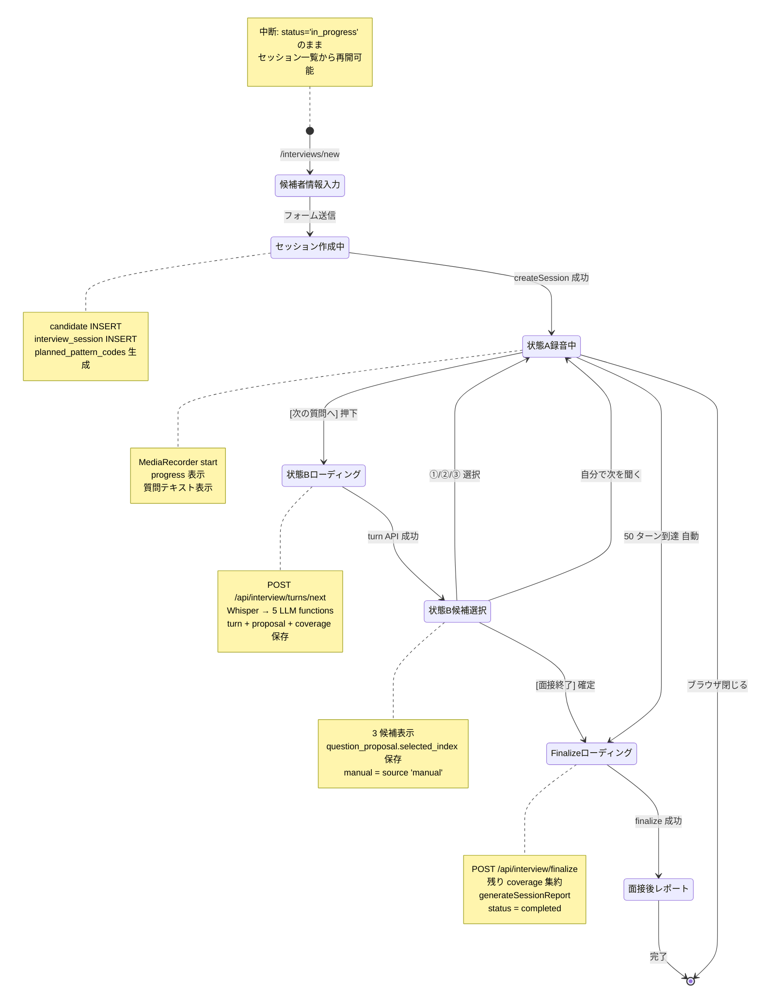
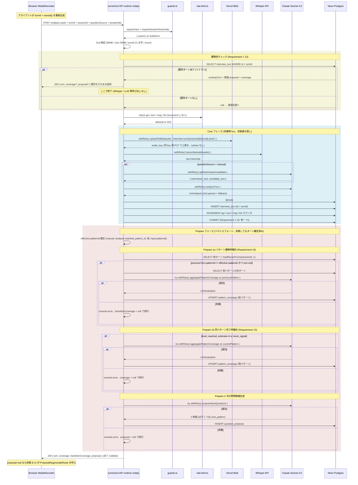
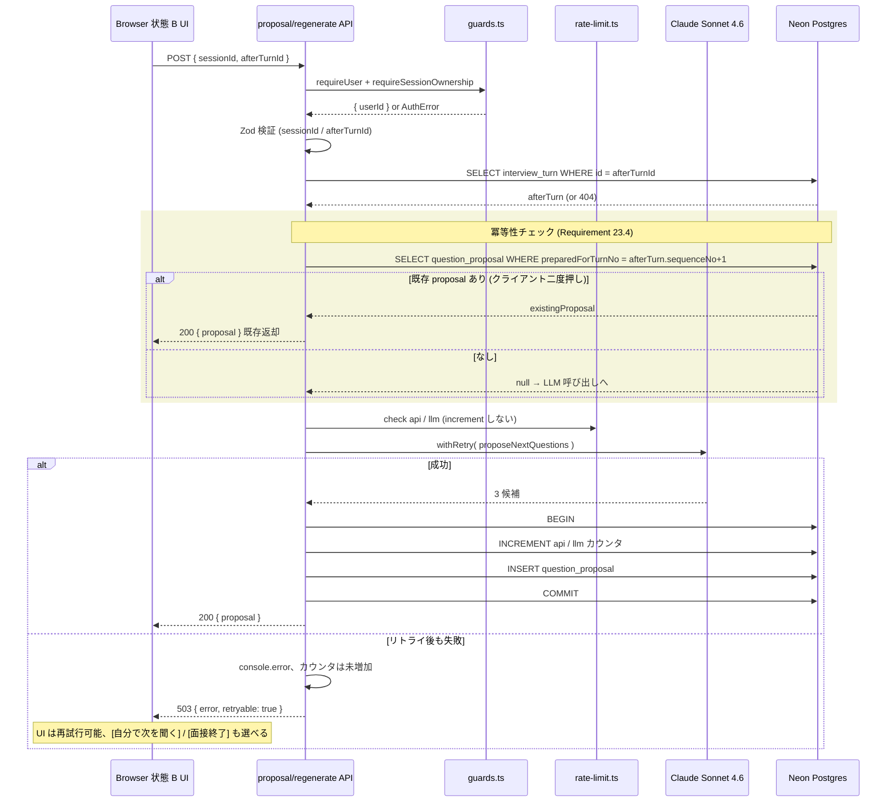
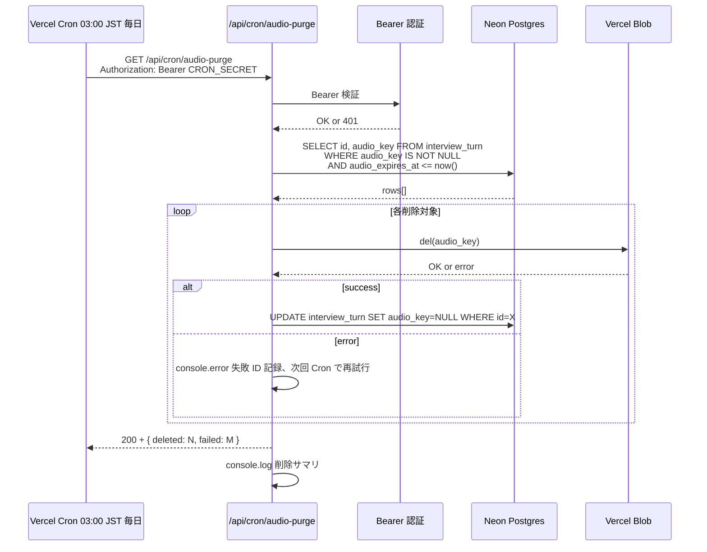
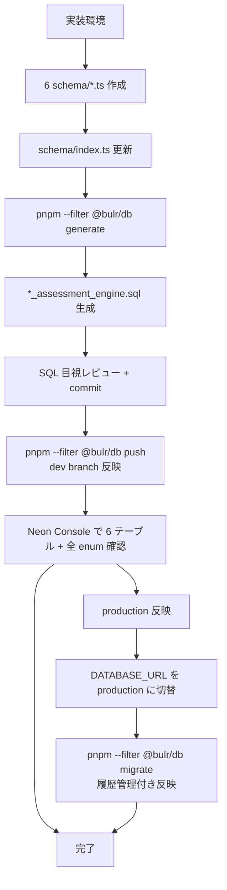

# Design Document — assessment-engine

## Overview

**Purpose**: 本機能は bulr Stage 1 MVP プロトタイプ（AI 面接アシスタント型）の **中核** を実装する。`monorepo-foundation` で構築されたモノレポ基盤、`multi-env-infrastructure` で整備された 12 環境変数と Vercel Cron スケジュール、`authentication` で確立された認証境界（`requireUser` / `authedAction` / `requireSessionOwnership` / `user_profile` / `rate_limit`）、`assessment-pattern-seed` で投入された 57 パターン × 4 段階質問テンプレを土台に、音声録音 + Whisper 文字起こし + 5 LLM 関数 + 状態 A/B UI + 面接後レポート + Vercel Cron 音声削除 + フリー質問の許容 を **全面書き直し** で実装する。

**Users**: 面接官（VPoE / EM / CTO / 採用責任者）が直接利用する。候補者は bulr に直接ログインしない。後続 `admin-review-panel` spec の実装者が本スペックの定義する 6 テーブル + `LlmEvaluation` 型 + `pattern_coverage.manual_evaluation` JSONB nullable カラムを利用して管理画面を構築する。

**Impact**: `authentication` 完了時点では面接官の Magic Link サインインのみが可能で、`/interviews/*` ルート未実装、`packages/types/src/{profile,evaluation}.ts` 空ファイル、`packages/ai/src/{functions,prompts,whisper}/` 空ディレクトリ、`packages/db/src/queries/` 空バレル、`/api/cron/audio-purge` route handler 未実装（vercel.json の Cron 定義だけ存在し 404 を返す）、`/admin/_health/` smoke test ページが残っている状態。本スペック完了で、面接官が Magic Link サインイン → セッション作成 → 状態 A/B ループ → 面接終了 → 面接後レポートまでの完全フローを実行でき、Vercel Cron が音声を毎日削除し、`/admin/_health/` smoke test が削除される。

### Goals

- `packages/types/src/profile.ts` と `packages/types/src/evaluation.ts` に実体の型定義を追加（`monorepo-foundation` で予約済みの exports map を実体化）
- `packages/db/src/schema/` に 6 テーブル（`candidate` / `interview_session` / `question_proposal` / `interview_turn` / `pattern_coverage` / `session_report`）の Drizzle pgTable + pgEnum 定義を追加し、drizzle-kit migration を生成
- `packages/db/src/queries/interview/` サブディレクトリに `loadSessionWithTurns` / `loadCompletedPatternCodes` / `loadRecentTurns` を実装
- `packages/ai/src/functions/` に 5 LLM 関数（`analyzeTurn` / `splitInterviewerCandidate` / `proposeNextQuestions` / `aggregatePatternCoverage` / `generateSessionReport`）を `generateObject` + Zod スキーマで実装
- `packages/ai/src/prompts/system-prompt.ts` に `buildSystemPrompt(ctx)` 純関数を 13 セクション構造で実装
- `packages/ai/src/lib/create-llm-context.ts` に `createLlmContext(ctx)` クロージャパターンを実装
- `packages/ai/src/lib/validate-llm-output.ts` に `validateAndFallback` 安全側フォールバックヘルパーを実装
- `packages/ai/src/whisper/transcribe.ts` に OpenAI Whisper API ラッパーを実装
- `apps/web/lib/audio/recorder.ts` に MediaRecorder ラッパー、`apps/web/lib/audio/blob-client.ts` に Vercel Blob ヘルパーを実装
- `apps/web/lib/actions/create-session.ts` にセッション作成 Server Action を実装
- `apps/web/app/(interviewer)/interviews/` 配下に 4 ページ（一覧 / 新規 / 面接中 / 面接後レポート）を実装
- `apps/web/app/api/interview/turns/next/route.ts` に 1 ターン処理 API を実装（Core/Prepare 分離 + クライアント生成 turnId 冪等性、runtime: 'nodejs'）
- `apps/web/app/api/interview/proposal/regenerate/route.ts` に Prepare-2 失敗時の提案再生成 API を実装（runtime: 'nodejs'）
- `apps/web/app/api/interview/finalize/route.ts` にセッション終了 API を実装
- `apps/web/app/api/cron/audio-purge/route.ts` に Vercel Cron 音声削除を実装
- `apps/web/next.config.ts` に `Permissions-Policy: microphone=(self)` を含むセキュリティヘッダーを追加
- `apps/web/app/admin/_health/` の smoke test ページを物理削除
- 自己面接 1 件完走（手動 E2E）を完了条件とする

### Non-Goals

- 管理画面 UI（`/admin/sessions/*`、創業者の手動評価入力 UI、CSV/JSON エクスポート）→ `admin-review-panel` spec
- `pattern_coverage.manual_evaluation` JSONB への書き込み → `admin-review-panel` spec
- チャートライブラリベースの高機能ヒートマップ → `admin-review-panel` spec の簡易表示で対応 + 本スペックは CSS 横棒の Stage 1 簡易版を面接官向けレポートに表示
- 候補者向け UI、候補者直接対話型 → Stage 3
- フリー質問の新パターン昇格 UI → Stage 2
- 複数職種対応（フロントエンド / SRE / PdM）→ Stage 2
- 多言語対応（next-intl）→ Stage 2
- リアルタイム文字起こし、話者分離 API、先読み質問生成 → Stage 2
- パターン編集 UI → Stage 2
- 音声再生 UI（Stage 1 では Blob URL を Client Component に返さない）
- Vitest / Playwright 等の自動テストフレームワーク導入 → Stage 1 では手動 E2E
- `useChat` / `streamText` / Tool Use ループ → 使わない（`tech.md` L53 準拠）
- `packages/db/src/queries/admin/` サブディレクトリ → `admin-review-panel` spec が初導入
- LangChain / LangGraph / MCP サーバー / Redis キャッシュ → 使わない

## Boundary Commitments

### This Spec Owns

- `packages/types/src/profile.ts`（`SystemType` / `InterviewerProfile` / `CandidateInfo` 型実体）
- `packages/types/src/evaluation.ts`（`StuckType` / `PatternMatchConfidence` / `QuestionIntent` / `LlmAnalysis` / `LlmEvaluation` / `ManualEvaluation` / `HeatmapData` 型実体）
- `packages/types/src/index.ts` 更新（バレルの `./profile` `./evaluation` 再エクスポート追加）
- `packages/db/src/schema/candidate.ts`、`interview-session.ts`、`question-proposal.ts`、`interview-turn.ts`、`pattern-coverage.ts`、`session-report.ts`（6 テーブル Drizzle 定義）
- `packages/db/src/schema/index.ts` 更新（6 テーブルのバレル再エクスポート追加）
- drizzle-kit migration ファイル `packages/db/drizzle/*_assessment_engine.sql`（ファイル名は drizzle-kit 決定、ハードコードしない）
- `packages/db/src/queries/interview/load-session-with-turns.ts`、`load-completed-pattern-codes.ts`、`load-recent-turns.ts`
- `packages/db/src/queries/index.ts` 更新（`./interview/*` サブディレクトリの再エクスポート追加）
- `packages/ai/src/client.ts` 更新（Anthropic Claude Sonnet 4.6 モデル定義）
- `packages/ai/src/functions/analyze-turn.ts`、`split-interviewer-candidate.ts`、`propose-next-questions.ts`、`aggregate-pattern-coverage.ts`、`generate-session-report.ts`
- `packages/ai/src/prompts/system-prompt.ts`（`buildSystemPrompt(ctx)` 純関数 + 13 セクション）
- `packages/ai/src/lib/create-llm-context.ts`（`createLlmContext(ctx)` クロージャ）
- `packages/ai/src/lib/validate-llm-output.ts`（`validateAndFallback` ヘルパー + フォールバック値定数）
- `packages/ai/src/whisper/transcribe.ts`（OpenAI Whisper API ラッパー）
- `packages/ai/src/index.ts` 更新（5 関数 + transcribeAudio + buildSystemPrompt + createLlmContext + validateAndFallback の再エクスポート）
- `apps/web/lib/audio/recorder.ts`（'use client' MediaRecorder ラッパー）
- `apps/web/lib/audio/blob-client.ts`（サーバーサイドのみ Vercel Blob ヘルパー）
- `apps/web/lib/actions/create-session.ts`（`createSession` Server Action、`authedAction` ラップ）
- `apps/web/lib/queries/select-planned-patterns.ts`（`assessment_pattern` から 8-12 件選定する純関数、`background_summary` 入力）
- `apps/web/app/(interviewer)/interviews/page.tsx`（セッション一覧、Server Component）
- `apps/web/app/(interviewer)/interviews/new/page.tsx`（候補者情報入力フォーム、Server Component + Client Form）
- `apps/web/app/(interviewer)/interviews/[sessionId]/page.tsx`（面接中 UI、`'use client'` 状態 A/B Component）
- `apps/web/app/(interviewer)/interviews/[sessionId]/report/page.tsx`（面接後レポート、Server Component）
- `apps/web/app/api/interview/turns/next/route.ts`（1 ターン処理 API、Core/Prepare 分離 + クライアント生成 turnId 冪等性、`runtime: 'nodejs'`）
- `apps/web/app/api/interview/proposal/regenerate/route.ts`（Prepare-2 失敗時の提案再生成 API、`runtime: 'nodejs'`）
- `apps/web/app/api/interview/finalize/route.ts`（セッション終了 API、`runtime: 'nodejs'`）
- `apps/web/app/api/cron/audio-purge/route.ts`（Vercel Cron 音声削除、`runtime: 'nodejs'`）
- `apps/web/next.config.ts` 更新（`Permissions-Policy: microphone=(self)` 等のセキュリティヘッダー追加）
- `apps/web/package.json` 更新（`@vercel/blob` ^0.x、`nanoid` ^5、`react-markdown` ^9 等の依存追加）
- `apps/web/app/admin/_health/` ディレクトリ + `page.tsx` 削除

### Out of Boundary

- `/admin/sessions/*` ページ実装 → `admin-review-panel` spec
- `pattern_coverage.manual_evaluation` への書き込み Server Action → `admin-review-panel` spec
- `packages/db/src/queries/admin/` サブディレクトリ作成 → `admin-review-panel` spec
- 創業者向け CSV/JSON エクスポート → `admin-review-panel` spec
- 音声再生 UI（署名付き URL 発行を含む）→ Stage 1 では持たない（admin spec で必要時に追加）
- パターン選定アルゴリズムの高度化（候補者経歴の埋め込みベクトル類似度等）→ Stage 2、Stage 1 はカテゴリ多様性のみを意識した単純選定
- LLM 評価精度の数値計測（手動評価との一致度 KPI 計算）→ Stage 1 はデータ収集まで、Stage 2 でダッシュボード
- 監査ログ → Stage 2
- 認証ヘルパー（`requireUser` / `authedAction` / `requireSessionOwnership`）の実装 → `authentication` spec で既設、本スペックは再利用のみ
- 環境変数定義、Vercel 環境セットアップ → `multi-env-infrastructure` spec
- 57 パターンの内容 → `assessment-pattern-seed` spec
- `assessment_pattern` テーブルへの書き込み → 本スペックでは読み取り専用

### Allowed Dependencies

- **External libraries** (新規追加):
  - `@vercel/blob` ^0.27.0（apps/web、音声アップロード / 削除）
  - `react-markdown` ^9.0.0（apps/web、面接後レポートの summary_text 表示）
  - `nanoid` ^5（apps/web、Server Action / API ルートで ID 生成。`packages/db` で同バージョン既存のため互換）
- **Existing dependencies**（既設）:
  - `ai` ^6（Vercel AI SDK 6、`generateObject`）
  - `@ai-sdk/anthropic` ^3（Claude Sonnet 4.6）
  - `openai` ^4（Whisper API）
  - `zod` ^4
  - `drizzle-orm` ^0.45、`pg` ^8、`drizzle-kit` ^0.31
  - `better-auth` ^1.6（authentication spec、`requireUser` 経由でのみ参照）
  - Next.js 16、React 19、Tailwind CSS 4
- **Environment variables**（既設、`multi-env-infrastructure`）:
  - `ANTHROPIC_API_KEY`、`OPENAI_API_KEY`、`BLOB_READ_WRITE_TOKEN`、`CRON_SECRET`、`DATABASE_URL`、`BETTER_AUTH_SECRET`、`BETTER_AUTH_URL`
- **制約**:
  - `useChat` / `streamText` / Tool Use ループは使わない（`tech.md` L53）
  - LangChain / LangGraph / MCP / Redis は使わない
  - 自動テストフレームワーク（Vitest / Playwright）は本スペックで導入しない
  - `packages/types` には runtime 依存（Zod 含む）を追加しない（`structure.md` L245 準拠）
  - Zod スキーマは `apps/web/lib/` / `packages/ai/src/lib/` / `packages/ai/src/functions/` / `apps/web/lib/actions/` 等の runtime 許容レイヤに置く
  - 6 テーブルの FK target は `user`（authentication spec）、`candidate`（本 spec）、`interview_session`（本 spec）、`assessment_pattern`（assessment-pattern-seed spec）

### Revalidation Triggers

- `LlmEvaluation` JSONB 構造（5 次元スコア整数制約）の変更 → `admin-review-panel` spec の `manual_evaluation` 編集 UI、本スペックの `aggregatePatternCoverage` Zod スキーマ、`generateSessionReport` Zod スキーマすべてを更新
- `HeatmapData` 構造の変更 → `generateSessionReport`、面接後レポート画面、admin spec の同等画面（あれば）を更新
- 6 テーブルのスキーマ変更（カラム追加 / 型変更 / enum 値変更）→ 本スペックの該当 API・UI、admin spec の読み取りを更新
- 5 LLM 関数のシグネチャ変更 → API ルート オーケストレーション全体を更新
- `pattern_match_confidence` enum 値の追加 → `analyzeTurn` 出力 Zod、`interview_turn` テーブル enum、Free Question 集約ロジックを更新
- `stuck_type` enum 値の追加 → `aggregatePatternCoverage` Zod、`pattern_coverage` テーブル enum、ヒートマップ表示を更新
- `question_proposal.candidate_*_intent` の値追加 → `proposeNextQuestions` Zod、状態 B UI ラベルを更新
- Vercel Blob から R2 への移行 → `apps/web/lib/audio/blob-client.ts`、`/api/cron/audio-purge`、`BLOB_READ_WRITE_TOKEN` 環境変数を全面置換
- Anthropic Claude Sonnet バージョン変更（4.6 → 5.x）→ `packages/ai/src/client.ts` のモデル定義、コスト計算、性能ベンチマーク再確認
- OpenAI Whisper モデル変更（`whisper-1` → 次世代モデル）→ `packages/ai/src/whisper/transcribe.ts` を更新
- 音声 30 日保持期間の変更 → `interview_turn.audio_expires_at` のデフォルト計算、Cron スケジュール、同意文を更新
- レート制限値の変更（1 日 5 セッション、API 30/分、LLM 100/セッション、ターン 50、メッセージ 200）→ `apps/web/lib/rate-limit.ts` 呼び出し全件、`security.md` 同期
- 4 段階深掘り構造の変更（5 段化等）→ `assessment_pattern` スキーマ + 本スペック全 LLM 関数 + システムプロンプトを全面書き直し
- 6 カテゴリ enum の値追加（`'frontend'` 等）→ `HeatmapData.by_category`、`generateSessionReport` 出力、面接後レポート UI を更新

## Architecture

### Existing Architecture Analysis

`monorepo-foundation` 完了時点で apps/web の Next.js 16 + React 19 + Tailwind CSS 4 スケルトンと、`packages/{db, types, lib, ai}` の 4 パッケージスケルトンが整備済み。`packages/ai` には Vercel AI SDK 6 + `@ai-sdk/anthropic` + `openai` + `zod` の依存追加済み、`functions/` `prompts/` `whisper/` ディレクトリは `.gitkeep` 予約のみで実体なし。`packages/types/src/{profile,evaluation}.ts` は空ファイル、`exports` map に `./profile` / `./evaluation` サブパスが予約済み。`packages/db/src/queries/` は空バレル。

`multi-env-infrastructure` で `apps/web/vercel.json` に Cron スケジュール `0 18 * * *` UTC = 03:00 JST 毎日が定義済み（`/api/cron/audio-purge` を呼ぶ）、ただし route handler は未実装で 404。`ANTHROPIC_API_KEY` / `OPENAI_API_KEY` / `BLOB_READ_WRITE_TOKEN` / `CRON_SECRET` の 4 環境変数も登録済み。`docs/setup/cron.md` / `vercel-blob.md` で外部サービス手順が整備済み。

`authentication` で `requireUser` / `authedAction` / `requireSessionOwnership` / `user_profile` / `rate_limit` テーブルが実装済み。`packages/db/src/schema/` に `auth.ts`（Better Auth テーブル）、`user-profile.ts`、`rate-limit.ts` が存在。`apps/web/app/admin/_health/page.tsx` smoke test ページが一時設置されている（本スペックで削除）。

`assessment-pattern-seed` で `assessment_pattern` テーブル + `pattern_category` enum + 57 パターン × 4 段階質問テンプレが投入済み。`packages/db/src/seeds/assessment-patterns.ts` から `is_active=true` フィルタで全パターンを取得可能。

参照プロジェクト `dishxdish-app-mvp` に部分的に類似の状態機械 UI とリアルタイム判定があるが、bulr v2 は録音 + Whisper 経由のサーバー側オーケストレーションのため、構造は大幅に異なる。dishxdish のチャット UI (`useChat`) は本スペックで採用しない。

### Architecture Pattern & Boundary Map

```mermaid
graph TB
    subgraph Browser[面接官 Browser]
        SignIn[/sign-in<br/>authentication spec]
        InterviewList[/interviews<br/>セッション一覧]
        InterviewNew[/interviews/new<br/>候補者情報入力]
        InterviewSession[/interviews/sessionId<br/>状態 A 録音中 / 状態 B 候補選択]
        InterviewReport[/interviews/sessionId/report<br/>面接後レポート]
        MR[MediaRecorder API<br/>audio/webm or audio/mp4]
    end

    subgraph ServerComponentLayer[Server Components]
        ListSC[interviews/page.tsx<br/>requireUser + scope by userId]
        NewSC[interviews/new/page.tsx<br/>requireUser + 候補者入力フォーム]
        SessionSC[interviews/sessionId/page.tsx<br/>requireUser + ownership + use client wrap]
        ReportSC[interviews/sessionId/report/page.tsx<br/>requireUser + ownership]
    end

    subgraph ServerActionLayer[Server Actions]
        CreateSession[lib/actions/create-session.ts<br/>authedAction + planned_pattern_codes 生成]
        SelectChoice[lib/actions/select-proposal-choice.ts<br/>selected_index 保存]
    end

    subgraph ApiLayer[API Routes runtime nodejs]
        TurnsNext[/api/interview/turns/next<br/>Core/Prepare 分離 + client turnId 冪等性]
        ProposalRegen[/api/interview/proposal/regenerate<br/>Prepare-2 失敗時の提案再生成]
        Finalize[/api/interview/finalize<br/>残り coverage + report 生成]
        AudioPurge[/api/cron/audio-purge<br/>CRON_SECRET Bearer + Blob 削除]
    end

    subgraph AILayer[packages/ai LLM functions]
        BuildSystem[prompts/system-prompt.ts<br/>buildSystemPrompt ctx 13 sections]
        CreateCtx[lib/create-llm-context.ts<br/>クロージャ束縛 sessionId/userId]
        AnalyzeTurn[functions/analyze-turn.ts<br/>generateObject + Zod]
        SplitIC[functions/split-interviewer-candidate.ts]
        ProposeQ[functions/propose-next-questions.ts<br/>3 候補 必ず 1 つは next_pattern]
        AggCov[functions/aggregate-pattern-coverage.ts<br/>5 次元最終スコア]
        GenReport[functions/generate-session-report.ts<br/>HeatmapData + summary]
        Validate[lib/validate-llm-output.ts<br/>safeParse + fallback]
        Transcribe[whisper/transcribe.ts<br/>OpenAI Whisper API]
    end

    subgraph DataLayer[packages/db queries]
        LoadST[queries/interview/load-session-with-turns.ts]
        LoadCC[queries/interview/load-completed-pattern-codes.ts]
        LoadRT[queries/interview/load-recent-turns.ts]
    end

    subgraph DB[Neon Postgres]
        Candidate[candidate]
        Session[interview_session]
        Proposal[question_proposal]
        Turn[interview_turn]
        Coverage[pattern_coverage]
        Report[session_report]
        Pattern[assessment_pattern<br/>seed spec]
        User[user<br/>auth spec]
        UserProfile[user_profile<br/>auth spec]
        RateLimit[rate_limit<br/>auth spec]
    end

    subgraph External[外部サービス]
        Anthropic[Anthropic Claude Sonnet 4.6]
        OpenAI[OpenAI Whisper API]
        Blob[Vercel Blob<br/>30 day TTL]
    end

    SignIn -.認証.-> InterviewList
    InterviewList --> ListSC
    InterviewNew --> NewSC
    InterviewSession --> SessionSC
    InterviewReport --> ReportSC

    NewSC --> CreateSession
    CreateSession --> Candidate
    CreateSession --> Session

    MR -.録音 audio Blob.-> InterviewSession
    InterviewSession -.multipart POST.-> TurnsNext
    InterviewSession -.regenerate POST.-> ProposalRegen
    ProposalRegen --> CreateCtx
    ProposalRegen --> Proposal
    ProposalRegen --> RateLimit
    InterviewSession -.select choice.-> SelectChoice

    TurnsNext --> CreateCtx
    CreateCtx --> AnalyzeTurn
    CreateCtx --> SplitIC
    CreateCtx --> ProposeQ
    CreateCtx --> AggCov
    AnalyzeTurn --> BuildSystem
    SplitIC --> BuildSystem
    ProposeQ --> BuildSystem
    AggCov --> BuildSystem
    GenReport --> BuildSystem
    AnalyzeTurn -.Zod 検証.-> Validate
    AggCov -.Zod 検証.-> Validate
    ProposeQ -.Zod 検証.-> Validate
    GenReport -.Zod 検証.-> Validate

    TurnsNext --> Transcribe
    Transcribe --> OpenAI
    AnalyzeTurn --> Anthropic
    SplitIC --> Anthropic
    ProposeQ --> Anthropic
    AggCov --> Anthropic
    GenReport --> Anthropic

    TurnsNext --> Blob
    AudioPurge --> Blob

    TurnsNext --> Turn
    TurnsNext --> Coverage
    TurnsNext --> Proposal
    TurnsNext --> RateLimit
    Finalize --> Coverage
    Finalize --> Report
    Finalize --> Session
    AudioPurge --> Turn

    ListSC --> Session
    SessionSC --> LoadST
    LoadST --> Session
    LoadST --> Turn
    LoadST --> Proposal
    LoadST --> Candidate
    ReportSC --> Report
    ReportSC --> Coverage
    ReportSC --> Session
    ReportSC --> Candidate

    ProposeQ --> LoadCC
    ProposeQ --> LoadRT
    AnalyzeTurn --> LoadRT
    LoadCC --> Coverage
    LoadRT --> Turn

    AnalyzeTurn --> Pattern
    ProposeQ --> Pattern
    AggCov --> Pattern
```

**Architecture Integration**:

- **Selected pattern**: 「ブラウザ MediaRecorder → multipart/form-data → 1 ターン API（runtime: nodejs）→ サーバー側オーケストレーション（決定論的）」のシンプル多段パイプライン。サーバーは Whisper → 5 LLM 関数を順次呼び、各関数の出力を Zod 検証してから DB 書き込み。クライアントは状態 A/B の 2 状態のみを管理。
- **Domain/feature boundaries**: LLM 関数は `packages/ai` に閉じ、外部からは `@bulr/ai` 経由でしか呼ばない。DB アクセスは LLM 関数の中ではなく、`packages/db/src/queries/interview/` 経由でサーバー側オーケストレーションから渡す（hallucination 防止）。Server Component はデータ取得 + 認証、Client Component は MediaRecorder + 状態管理のみ。
- **Existing patterns preserved**: `authentication` spec の 4 層多層認証（proxy.ts → Server Component → Server Action → API Route）、`safe-action.ts` ラッパー、`rate-limit.ts` ユーティリティ、`requireSessionOwnership` ガードを再利用。`packages/db` の Drizzle スキーマ配置、`packages/types` exports map サブパス、`packages/ai` 構造をすべて踏襲。
- **New components rationale**: `createLlmContext(ctx)` クロージャパターンは LLM の hallucination 攻撃（出力で別 sessionId を指定する等）に対する構造的防御。Zod スキーマ + `validateAndFallback` は LLM 出力の信頼境界の物理的な分離。`packages/db/src/queries/interview/` サブディレクトリ初導入は `admin-review-panel` が `queries/admin/` を初導入する想定に合わせ、boundary を明確にする狙い。
- **Steering compliance**:
  - `tech.md` L42-53（Vercel AI SDK 6 generateObject、Claude Sonnet 4.6、OpenAI Whisper、Vercel Blob、Drizzle、no useChat/streamText/Tool Use）
  - `assessment-design.md`（面接アシスタント型、4 段階深掘り、AI 横断軸、詰まり判定 4 種、フリー質問の許容、自然対話指針、AI は黒子）
  - `evaluation-rubric.md`（2 段評価構成 turn analysis + pattern coverage、5 次元整数、dual evaluation スキーマ、採用推奨禁止）
  - `security.md`（LLM trust boundary、createLlmContext で sessionId 束縛、Zod 入力 + 出力検証、レート制限、Vercel Cron Bearer 認証、microphone CSP、Blob URL を Client に返さない）
  - `structure.md`（apps/web/app/(interviewer)/ layout、packages/ai 構造、packages/db queries サブディレクトリ初導入）

### Technology Stack

| Layer | Choice / Version | Role in Feature | Notes |
|-------|------------------|-----------------|-------|
| Frontend | Next.js 16 App Router + React 19 + Tailwind CSS 4 | 面接官 4 ページ、状態 A/B Client Component | `monorepo-foundation` 既設 |
| 録音 | MediaRecorder API（ブラウザ標準）| `audio/webm; codecs=opus` 優先 + `audio/mp4` フォールバック | `apps/web/lib/audio/recorder.ts` |
| 音声ストレージ | Vercel Blob ^0.27 | `interview-turn/{session_id}/{turn_id}.{ext}` 構造化命名、30 日 TTL | サーバーサイドのみ、Blob URL を Client に返さない |
| 文字起こし | OpenAI Whisper API（`whisper-1`、`openai` SDK ^4）| 音声 → 生 transcript | 50MB / 10 分上限 |
| LLM | Anthropic Claude Sonnet 4.6（`@ai-sdk/anthropic` ^3、Vercel AI SDK 6）| 5 関数すべて | `generateObject` 中心、maxRetries=2 |
| 構造化出力 | Vercel AI SDK 6 `generateObject` + Zod ^4 | Zod スキーマで LLM 出力強制 + DB 書き込み前再検証 | `useChat` / `streamText` / Tool Use ループ未使用 |
| ORM | Drizzle ORM ^0.45 + drizzle-kit ^0.31 + `pg` ^8 | 6 テーブル定義 + マイグレーション | `monorepo-foundation` 既設 |
| Markdown rendering | `react-markdown` ^9 | 面接後レポートの `summary_text` 表示 | XSS 防止、`dangerouslySetInnerHTML` 不使用 |
| 認証 | Better Auth 1.6 + Magic Link + 認証ヘルパー | `requireUser` / `authedAction` / `requireSessionOwnership` 再利用 | `authentication` 既設 |
| レート制限 | DB ベース `rate_limit` テーブル + `apps/web/lib/rate-limit.ts` | 1 日 5 セッション / API 30/分 / LLM 100/sess / ターン 50 / メッセージ 200 | `authentication` 既設テーブル + ヘルパー |
| Cron | Vercel Cron（vercel.json 既設）+ `CRON_SECRET` Bearer | 03:00 JST 毎日 audio-purge 実行 | `multi-env-infrastructure` 既設 |
| Runtime | Node.js 22 LTS、`runtime: 'nodejs'` API Routes | Drizzle + pg.Pool 利用のため Edge ではなく Node | 全 API ルートに明示 |
| セキュリティヘッダー | `Permissions-Policy: microphone=(self), camera=(), geolocation=()` 等 | MediaRecorder 利用に必須 | `apps/web/next.config.ts` で全 response に付与 |

## File Structure Plan

### Directory Structure

```
bulr-app-mvp/
├── apps/
│   └── web/
│       ├── next.config.ts                                  # 更新: Permissions-Policy + CSP セキュリティヘッダー追加
│       ├── package.json                                    # 更新: @vercel/blob, react-markdown, nanoid 追加
│       ├── app/
│       │   ├── admin/
│       │   │   └── _health/                                # 削除: smoke test ページ
│       │   ├── (interviewer)/
│       │   │   └── interviews/
│       │   │       ├── page.tsx                            # 新規: セッション一覧 Server Component
│       │   │       ├── new/
│       │   │       │   └── page.tsx                        # 新規: 候補者情報入力 Server Component + Client Form
│       │   │       ├── [sessionId]/
│       │   │       │   ├── page.tsx                        # 新規: 面接中 Server Component + use client wrap
│       │   │       │   └── report/
│       │   │       │       └── page.tsx                    # 新規: 面接後レポート Server Component
│       │   │       └── _components/
│       │   │           ├── interview-session-runner.tsx    # 新規: 'use client' 状態 A/B controller
│       │   │           ├── recording-state.tsx             # 新規: 'use client' 状態 A UI
│       │   │           ├── proposal-choice-state.tsx       # 新規: 'use client' 状態 B UI
│       │   │           ├── heatmap.tsx                     # 新規: CSS 横棒ヒートマップ Server Component
│       │   │           └── candidate-form.tsx              # 新規: 'use client' 候補者情報入力フォーム
│       │   └── api/
│       │       ├── interview/
│       │       │   ├── turns/
│       │       │   │   └── next/
│       │       │   │       └── route.ts                    # 新規: 1 ターン処理 API（Core/Prepare 分離、クライアント生成 turnId 冪等性）
│       │       │   ├── proposal/
│       │       │   │   └── regenerate/
│       │       │   │       └── route.ts                    # 新規: Prepare-2 失敗時の提案再生成 API
│       │       │   └── finalize/
│       │       │       └── route.ts                        # 新規: セッション終了 API
│       │       └── cron/
│       │           └── audio-purge/
│       │               └── route.ts                        # 新規: Vercel Cron 音声削除
│       └── lib/
│           ├── audio/
│           │   ├── recorder.ts                             # 新規: 'use client' MediaRecorder ラッパー
│           │   └── blob-client.ts                          # 新規: サーバーサイドのみ Vercel Blob ヘルパー
│           ├── actions/
│           │   ├── create-session.ts                       # 新規: createSession Server Action
│           │   └── select-proposal-choice.ts               # 新規: selected_index 保存 Server Action
│           └── queries/
│               └── select-planned-patterns.ts              # 新規: assessment_pattern 8-12 件選定純関数
│
└── packages/
    ├── types/
    │   └── src/
    │       ├── profile.ts                                  # 更新: SystemType / InterviewerProfile / CandidateInfo 実体
    │       ├── evaluation.ts                               # 更新: StuckType / PatternMatchConfidence / QuestionIntent / LlmAnalysis / LlmEvaluation / ManualEvaluation / HeatmapData 実体
    │       └── index.ts                                    # 更新: ./profile + ./evaluation 再エクスポート
    ├── db/
    │   ├── drizzle/
    │   │   └── *_assessment_engine.sql                     # 新規: drizzle-kit 自動生成 (連番 + suffix は drizzle-kit 決定)
    │   └── src/
    │       ├── schema/
    │       │   ├── candidate.ts                            # 新規: candidate テーブル定義
    │       │   ├── interview-session.ts                    # 新規: interview_session テーブル + status enum
    │       │   ├── question-proposal.ts                    # 新規: question_proposal テーブル + intent enum
    │       │   ├── interview-turn.ts                       # 新規: interview_turn テーブル + question_source enum + pattern_match_confidence enum
    │       │   ├── pattern-coverage.ts                     # 新規: pattern_coverage テーブル + stuck_type enum + UNIQUE(session_id, pattern_id)
    │       │   ├── session-report.ts                       # 新規: session_report テーブル + session_id UNIQUE
    │       │   └── index.ts                                # 更新: 6 テーブルのバレル再エクスポート追加
    │       └── queries/
    │           ├── interview/
    │           │   ├── load-session-with-turns.ts          # 新規: セッション + 全ターン + 最新 proposal
    │           │   ├── load-completed-pattern-codes.ts     # 新規: 現セッション完了 pattern_code
    │           │   └── load-recent-turns.ts                # 新規: 直近 5-10 ターン取得
    │           └── index.ts                                # 更新: interview/* サブディレクトリの再エクスポート
    └── ai/
        └── src/
            ├── client.ts                                   # 更新: Anthropic Claude Sonnet 4.6 モデル定義 (空ファイル → 実装)
            ├── index.ts                                    # 更新: 5 関数 + transcribeAudio + buildSystemPrompt + createLlmContext + validateAndFallback の再エクスポート
            ├── functions/
            │   ├── analyze-turn.ts                         # 新規: analyzeTurn 関数 + Zod schema
            │   ├── split-interviewer-candidate.ts          # 新規: splitInterviewerCandidate 関数 + Zod schema
            │   ├── propose-next-questions.ts               # 新規: proposeNextQuestions 関数 + Zod schema (必ず 1 つは next_pattern)
            │   ├── aggregate-pattern-coverage.ts           # 新規: aggregatePatternCoverage 関数 + Zod schema
            │   └── generate-session-report.ts              # 新規: generateSessionReport 関数 + Zod schema
            ├── prompts/
            │   └── system-prompt.ts                        # 新規: buildSystemPrompt(ctx) 純関数 + 13 セクション
            ├── lib/
            │   ├── create-llm-context.ts                   # 新規: createLlmContext クロージャパターン
            │   └── validate-llm-output.ts                  # 新規: validateAndFallback + フォールバック値定数
            └── whisper/
                └── transcribe.ts                           # 新規: OpenAI Whisper API ラッパー
```

### Modified Files

- `apps/web/package.json` — `dependencies` に `@vercel/blob` ^0.27、`react-markdown` ^9、`nanoid` ^5 を追加
- `apps/web/next.config.ts` — `headers()` で `Permissions-Policy: microphone=(self), camera=(), geolocation=()` 等を全 response に付与
- `packages/types/src/profile.ts` — 空ファイルから `SystemType` / `InterviewerProfile` / `CandidateInfo` の実体型定義へ
- `packages/types/src/evaluation.ts` — 空ファイルから 7 型の実体定義へ
- `packages/types/src/index.ts` — `./profile` と `./evaluation` の再エクスポート追加
- `packages/db/src/schema/index.ts` — 6 新規テーブル schema の再エクスポート追加
- `packages/db/src/queries/index.ts` — `./interview/load-session-with-turns` 等の再エクスポート追加（または直接 `@bulr/db/queries/interview` サブパスを exports map に追加するかは実装時判断）
- `packages/ai/src/client.ts` — `monorepo-foundation` で空ファイル予約のものに、Anthropic Claude Sonnet 4.6 モデル定義を追加
- `packages/ai/src/index.ts` — 5 LLM 関数 + transcribeAudio + buildSystemPrompt + createLlmContext + validateAndFallback の再エクスポート

### Deleted Files

- `apps/web/app/admin/_health/page.tsx`
- `apps/web/app/admin/_health/`（ディレクトリ）

> 各ファイルは単一責務。新規作成: apps/web 配下 16 ファイル、packages/types 0 新規（既存 2 ファイル更新 + index 更新）、packages/db 8 ファイル（6 schema + 3 queries、index 更新は別カウント）、packages/ai 9 ファイル + drizzle migration（drizzle-kit 自動生成）。更新: apps/web/package.json + next.config.ts、packages/types/src/index.ts、packages/db/src/schema/index.ts、packages/db/src/queries/index.ts、packages/ai/src/client.ts + index.ts。削除: admin/_health ディレクトリ + page.tsx。

## System Flows

### 状態機械: profile input → session start → 状態 A/B ループ → finalize → report



### 1 ターン処理シーケンス（POST /api/interview/turns/next、Core/Prepare 分離 + 冪等性）



### 提案再生成シーケンス（POST /api/interview/proposal/regenerate）

Prepare-2 失敗で `proposal=null` を受け取った状態 B UI が、[再試行] ボタンから呼び出すフロー。



### Vercel Cron 音声削除フロー



## Requirements Traceability

| Requirement | Summary | Components | Interfaces | Flows |
|-------------|---------|------------|------------|-------|
| 1.1-1.12 | 共通型 (profile.ts + evaluation.ts) | TypesProfile, TypesEvaluation | packages/types exports map | typecheck flow |
| 2.1-2.15 | DB 6 テーブル + migration | SchemaCandidate, SchemaInterviewSession, SchemaQuestionProposal, SchemaInterviewTurn, SchemaPatternCoverage, SchemaSessionReport, MigrationFile | Drizzle pgTable | migration flow |
| 3.1-3.9 | 候補者情報入力 + セッション作成 | InterviewsNewPage, CandidateForm, CreateSessionAction, SelectPlannedPatterns | createSession Server Action | state machine 1 |
| 4.1-4.7 | セッション一覧 + 再開 | InterviewsListPage | Server Component | session list flow |
| 5.1-5.12 | 状態 A 録音中 UI | InterviewSessionPage, RecordingState, AudioRecorder | use client component | state machine 2A |
| 6.1-6.8 | 状態 B 候補選択 UI | InterviewSessionPage, ProposalChoiceState, SelectProposalChoiceAction | use client component | state machine 2B |
| 7.1-7.16 | 1 ターン処理 API（Core/Prepare 分離 + 冪等性） | TurnsNextRoute, BlobClient, Transcribe, CreateLlmContext, AnalyzeTurn, SplitIC, ProposeQ, AggCov, ValidateLLMOutput, RateLimit | POST /api/interview/turns/next | 1 turn sequence |
| 23.1-23.7 | 提案再生成 API | ProposalRegenerateRoute, CreateLlmContext, ProposeNextQuestions, ValidateLLMOutput, RateLimit | POST /api/interview/proposal/regenerate | proposal regenerate sequence |
| 24.1-24.5 | パターン遷移時の集約トリガ（Prepare-1a） | TurnsNextRoute, AnalyzeTurn, AggregatePatternCoverage, LoadRecentTurns, SchemaPatternCoverage | TurnsNextRoute Prepare phase | 1 turn sequence (Prepare-1a branch) |
| 8.1-8.12 | 5 LLM 関数 | AnalyzeTurn, SplitInterviewerCandidate, ProposeNextQuestions, AggregatePatternCoverage, GenerateSessionReport, CreateLlmContext, ValidateLLMOutput, ClientPackagesAi | packages/ai functions | LLM orchestration |
| 9.1-9.6 | システムプロンプト | BuildSystemPrompt | packages/ai prompts | LLM orchestration |
| 10.1-10.11 | Whisper + 音声処理 | Transcribe, AudioRecorder, BlobClient, NextConfigCSP | packages/ai whisper + apps/web lib/audio | 1 turn sequence |
| 11.1-11.14 | finalize API + report | FinalizeRoute, GenerateSessionReport, InterviewsReportPage, Heatmap | POST /api/interview/finalize, Server Component | state machine 3 |
| 12.1-12.7 | フリー質問の許容 | SchemaInterviewTurn, AnalyzeTurn, AggregatePatternCoverage, GenerateSessionReport, Heatmap | pattern_id null + pattern_match_confidence off_pattern | LLM orchestration |
| 13.1-13.6 | 詰まり判定 + 4 段階 | AnalyzeTurn, AggregatePatternCoverage, ProposeNextQuestions, BuildSystemPrompt | LlmAnalysis + LlmEvaluation Zod | LLM orchestration |
| 14.1-14.8 | LLM 出力検証 + フォールバック | ValidateLLMOutput | validateAndFallback util | LLM orchestration |
| 15.1-15.7 | レート制限 | RateLimit (auth spec 既設), CreateSessionAction, TurnsNextRoute | rate_limit table key prefix | 1 turn sequence |
| 16.1-16.8 | Vercel Cron 音声削除 | AudioPurgeRoute, BlobClient | GET /api/cron/audio-purge | Cron flow |
| 17.1-17.5 | セキュリティヘッダー | NextConfigCSP | apps/web/next.config.ts headers() | response |
| 18.1-18.5 | プロンプトインジェクション防御 | BuildSystemPrompt, TurnsNextRoute (transcript size limit) | system prompt section 2 | LLM orchestration |
| 19.1-19.5 | smoke test 削除 | AdminHealthDelete | filesystem delete | — |
| 20.1-20.6 | 認証統合 | TurnsNextRoute, FinalizeRoute, AudioPurgeRoute, CreateSessionAction, 全 Server Component | requireUser + requireSessionOwnership + authedAction | each flow |
| 21.1-21.5 | 共通クエリ | LoadSessionWithTurns, LoadCompletedPatternCodes, LoadRecentTurns | packages/db/src/queries/interview | various flows |
| 22.1-22.5 | テスト戦略 | （手動 E2E、フレームワーク非導入）| docs | manual test |

## Components and Interfaces

| Component | Domain/Layer | Intent | Req Coverage | Key Dependencies (P0/P1) | Contracts |
|-----------|--------------|--------|--------------|--------------------------|-----------|
| TypesProfile | packages/types | InterviewerProfile / CandidateInfo / SystemType 型 | 1.1, 1.2, 1.3, 1.11, 1.12 | TypeScript 5.x (P0) | State |
| TypesEvaluation | packages/types | LlmAnalysis / LlmEvaluation / ManualEvaluation / HeatmapData / StuckType / PatternMatchConfidence / QuestionIntent 型 | 1.4-1.11, 1.12 | TypeScript 5.x (P0) | State |
| SchemaCandidate | packages/db/schema | candidate テーブル | 2.1, 2.10 | drizzle-orm (P0), nanoid (P0) | State |
| SchemaInterviewSession | packages/db/schema | interview_session + status enum | 2.2, 2.10, 2.11 | drizzle-orm (P0), SchemaCandidate (P0), auth.user (P0) | State |
| SchemaQuestionProposal | packages/db/schema | question_proposal + intent enum | 2.3, 2.10, 2.12 | SchemaInterviewSession (P0) | State |
| SchemaInterviewTurn | packages/db/schema | interview_turn + 2 enum + jsonb columns | 2.4, 2.10, 2.13, 2.14, 12.1 | SchemaInterviewSession (P0), SchemaAssessmentPattern (P0), SchemaQuestionProposal (P1) | State |
| SchemaPatternCoverage | packages/db/schema | pattern_coverage + UNIQUE + stuck_type enum | 2.5, 2.10, 2.15 | SchemaInterviewSession (P0), SchemaAssessmentPattern (P0) | State |
| SchemaSessionReport | packages/db/schema | session_report + session_id UNIQUE | 2.6, 2.10 | SchemaInterviewSession (P0) | State |
| MigrationFile | packages/db/drizzle | drizzle-kit 生成の DDL | 2.8, 2.9, 2.10 | drizzle-kit (P0), 上記 6 schema (P0) | State |
| LoadSessionWithTurns | packages/db/queries/interview | session + turns + latest proposal + candidate 取得 | 21.1, 21.4 | SchemaInterviewSession + SchemaInterviewTurn + SchemaQuestionProposal + SchemaCandidate (P0) | Service |
| LoadCompletedPatternCodes | packages/db/queries/interview | 完了済み pattern_code リスト | 21.2, 21.4 | SchemaPatternCoverage + SchemaAssessmentPattern (P0) | Service |
| LoadRecentTurns | packages/db/queries/interview | 直近 N ターン + transcript + llm_analysis | 21.3, 21.4 | SchemaInterviewTurn (P0) | Service |
| ClientPackagesAi | packages/ai | Anthropic Claude Sonnet 4.6 モデル定義 | 8.9 | @ai-sdk/anthropic (P0) | State |
| BuildSystemPrompt | packages/ai/prompts | 13 セクション システムプロンプト純関数 | 9.1-9.6, 13.6, 18.1, 18.5 | TypesProfile (P0), TypesEvaluation (P0) | Service (pure function) |
| CreateLlmContext | packages/ai/lib | sessionId / userId 束縛クロージャ | 7.7, 8.8 | TypesEvaluation (P0) | Service |
| ValidateLLMOutput | packages/ai/lib | safeParse + フォールバック | 8.12, 14.1-14.8 | Zod 4.x (P0) | Service |
| AnalyzeTurn | packages/ai/functions | このターン 5 次元シグナル + 到達段階 + match confidence + matched_pattern_id + stuck_signal | 8.1, 8.2, 12.2, 13.1, 13.6, 18.2, 24.1 | BuildSystemPrompt (P0), CreateLlmContext (P0), ValidateLLMOutput (P0), Claude Sonnet 4.6 (P0), assessment_pattern (P0) | Service |
| SplitInterviewerCandidate | packages/ai/functions | manual ターン用、質問+回答分離 | 8.3 | BuildSystemPrompt (P0), Claude Sonnet 4.6 (P0) | Service |
| ProposeNextQuestions | packages/ai/functions | 3 候補 (必ず 1 つは next_pattern) | 8.4, 8.5, 12.7, 13.4 | BuildSystemPrompt (P0), LoadCompletedPatternCodes (P0), LoadRecentTurns (P0), Claude Sonnet 4.6 (P0) | Service |
| AggregatePatternCoverage | packages/ai/functions | 複数ターン統合 5 次元最終スコア | 8.6, 13.2, 13.3, 13.5 | BuildSystemPrompt (P0), ValidateLLMOutput (P0), Claude Sonnet 4.6 (P0) | Service |
| GenerateSessionReport | packages/ai/functions | HeatmapData + summary_text | 8.7, 11.5, 12.5, 13.6 | BuildSystemPrompt (P0), ValidateLLMOutput (P0), Claude Sonnet 4.6 (P0) | Service |
| Transcribe | packages/ai/whisper | OpenAI Whisper API ラッパー | 10.1-10.5 | openai SDK (P0), OPENAI_API_KEY (P0) | Service |
| AudioRecorder | apps/web/lib/audio | 'use client' MediaRecorder ラッパー | 5.4, 5.7, 5.11, 5.12, 10.6, 10.11 | MediaRecorder API (P0) | Service |
| BlobClient | apps/web/lib/audio | サーバーサイドのみ Vercel Blob ヘルパー | 10.7-10.10, 16.4, 16.5 | @vercel/blob (P0), BLOB_READ_WRITE_TOKEN (P0) | Service |
| SelectPlannedPatterns | apps/web/lib/queries | assessment_pattern 8-12 件選定純関数 | 3.5 | assessment_pattern (P0) | Service (pure) |
| CreateSessionAction | apps/web/lib/actions | candidate + interview_session 作成 Server Action | 3.3-3.9, 15.2, 20.4 | authedAction (P0), SchemaCandidate + SchemaInterviewSession (P0), SelectPlannedPatterns (P0), RateLimit (P0) | Service (Server Action) |
| SelectProposalChoiceAction | apps/web/lib/actions | selected_index 保存 Server Action | 6.5, 6.6 | authedAction (P0), SchemaQuestionProposal (P0) | Service (Server Action) |
| InterviewsListPage | apps/web/(interviewer)/interviews | セッション一覧 Server Component | 4.1-4.7, 20.5 | requireUser (P0), SchemaInterviewSession + SchemaCandidate + SchemaInterviewTurn (P0) | State (UI) |
| InterviewsNewPage | apps/web/(interviewer)/interviews/new | 候補者情報入力 Server Component + Client Form | 3.1-3.2, 3.7 | requireUser (P0), CreateSessionAction (P0), CandidateForm (P0) | State (UI) |
| CandidateForm | apps/web/(interviewer)/interviews/_components | 'use client' 候補者情報入力フォーム | 3.1, 3.2 | CreateSessionAction (P0), Zod (P0) | State (UI) |
| InterviewSessionPage | apps/web/(interviewer)/interviews/[sessionId] | 面接中 Server Component + use client wrap | 5.1, 6.1, 20.5 | requireUser + requireSessionOwnership (P0), LoadSessionWithTurns (P0), InterviewSessionRunner (P0) | State (UI) |
| InterviewSessionRunner | apps/web/(interviewer)/interviews/_components | 'use client' 状態 A/B controller | 5.1, 6.1, 6.5-6.8 | RecordingState (P0), ProposalChoiceState (P0), SelectProposalChoiceAction (P0) | State (UI) |
| RecordingState | apps/web/(interviewer)/interviews/_components | 'use client' 状態 A UI | 5.2-5.12 | AudioRecorder (P0) | State (UI) |
| ProposalChoiceState | apps/web/(interviewer)/interviews/_components | 'use client' 状態 B UI | 6.1-6.8 | SelectProposalChoiceAction (P0) | State (UI) |
| InterviewsReportPage | apps/web/(interviewer)/interviews/[sessionId]/report | 面接後レポート Server Component | 11.9-11.14, 20.5 | requireUser + requireSessionOwnership (P0), SchemaSessionReport (P0), SchemaPatternCoverage (P0), Heatmap (P0), react-markdown (P0) | State (UI) |
| Heatmap | apps/web/(interviewer)/interviews/_components | CSS 横棒ヒートマップ Server Component | 11.11, 12.6 | TypesEvaluation (P0), Tailwind (P0) | State (UI) |
| TurnsNextRoute | apps/web/app/api/interview/turns/next | 1 ターン処理 API runtime nodejs、Core/Prepare 分離、クライアント生成 turnId 冪等性、Prepare-1a パターン遷移集約 | 7.1-7.16, 12.3, 15.3-15.6, 18.3, 20.1, 24.1-24.5 | requireUser + requireSessionOwnership (P0), BlobClient (P0), Transcribe (P0), CreateLlmContext (P0), AnalyzeTurn (P0), SplitInterviewerCandidate (P0), ProposeNextQuestions (P0), AggregatePatternCoverage (P0), LoadRecentTurns (P0), ValidateLLMOutput (P0), RateLimit (P0), Schema 6 テーブル (P0) | Service (API) |
| ProposalRegenerateRoute | apps/web/app/api/interview/proposal/regenerate | Prepare-2 失敗時の提案再生成 API runtime nodejs、proposal の冪等性チェックあり | 23.1-23.7, 20.1 | requireUser + requireSessionOwnership (P0), CreateLlmContext (P0), ProposeNextQuestions (P0), ValidateLLMOutput (P0), RateLimit (P0), SchemaInterviewSession + SchemaInterviewTurn + SchemaQuestionProposal (P0), LoadSessionWithTurns (P0), LoadCompletedPatternCodes (P0) | Service (API) |
| FinalizeRoute | apps/web/app/api/interview/finalize | セッション終了 API runtime nodejs | 11.1-11.8, 20.2 | requireUser + requireSessionOwnership (P0), AggregatePatternCoverage (P0), GenerateSessionReport (P0), SchemaPatternCoverage + SchemaSessionReport + SchemaInterviewSession (P0) | Service (API) |
| AudioPurgeRoute | apps/web/app/api/cron/audio-purge | Vercel Cron 音声削除 runtime nodejs | 16.1-16.8, 20.3 | CRON_SECRET (P0), BlobClient (P0), SchemaInterviewTurn (P0) | Service (Cron) |
| NextConfigCSP | apps/web | Permissions-Policy + CSP セキュリティヘッダー | 17.1-17.5 | Next.js 16 headers() (P0) | State |
| AdminHealthDelete | apps/web/app/admin/_health | smoke test ページ削除 | 19.1-19.5 | filesystem (P0) | State |

### Detailed Component Specifications

#### TypesProfile / TypesEvaluation

```typescript
// packages/types/src/profile.ts (概要)
export type SystemType =
  | 'btoc' | 'btob_saas' | 'business' | 'payment' | 'embedded' | 'data_platform';

export interface InterviewerProfile {
  displayName: string;
  roleInOrg?: string;
  yearsOfExperience?: number;
}

export interface CandidateInfo {
  name: string;
  appliedRole: string;
  backgroundSummary: string;
  email?: string;
}

// packages/types/src/evaluation.ts (概要)
// 注: PatternCategory は @bulr/db (assessment-pattern-seed spec) が pgEnum から派生型として export している
// (`export type PatternCategory = (typeof patternCategory.enumValues)[number]`)。
// packages/types -> @bulr/db の逆方向依存を避けるため、本ファイルでは PatternCategory を再定義しない。
// 利用側 (apps/web の Server Component / API Route 等) は `import type { PatternCategory } from '@bulr/db/schema'` する。
// HeatmapData.by_category は string キーで宣言し、ランタイムでは PatternCategory 値のみが入る契約をコメントで示す。
export type StuckType = 'not_experienced' | 'shallow' | 'single_option' | 'rigid';
export type PatternMatchConfidence = 'exact' | 'inferred_high' | 'inferred_low' | 'off_pattern';
export type QuestionIntent = 'deep_dive' | 'meta_cognition' | 'next_pattern';

export interface LlmAnalysis {
  signals: {
    authenticity: 'observed' | 'partial' | 'absent';
    judgment: 'observed' | 'partial' | 'absent';
    meta_cognition: 'observed' | 'partial' | 'absent';
    ai_literacy: 'observed' | 'partial' | 'absent';
  };
  scope_signal: 1 | 2 | 3 | 4 | 5 | null;
  level_reached_estimate: 0 | 1 | 2 | 3 | 4;
  pattern_match_confidence: PatternMatchConfidence;
  nearest_patterns?: string[];
  off_pattern_summary?: string;
  notes: string;
}

export interface LlmEvaluation {
  authenticity: 0 | 1 | 2 | 3;
  judgment: 0 | 1 | 2 | 3;
  scope: 1 | 2 | 3 | 4 | 5;
  meta_cognition: 0 | 1 | 2 | 3;
  ai_literacy: 0 | 1 | 2 | 3;
  level_reached: 0 | 1 | 2 | 3 | 4;
  stuck_type: StuckType | null;
  notes: string;
  evaluated_at: string;  // ISO 8601
}

export interface ManualEvaluation extends Omit<LlmEvaluation, 'evaluated_at'> {
  reviewer: string;  // admin email
  reviewed_at: string;  // ISO 8601
}

export interface HeatmapData {
  // by_category のキーは @bulr/db の PatternCategory 値 ('design'|'trouble'|'performance'|'security'|'organization'|'ai')。
  // packages/types -> @bulr/db の依存を避けるため Record<string, ...> で宣言し、ランタイム契約で保証する。
  by_category: Record<string, {
    avg_authenticity: number;
    avg_judgment: number;
    avg_scope: number;
    avg_meta_cognition: number;
    avg_ai_literacy: number;
    pattern_count: number;
  }>;
  scope_distribution: Record<1 | 2 | 3 | 4 | 5, number>;
  ai_literacy_distribution: Record<0 | 1 | 2 | 3, number>;
  free_question_count: number;
}
```

#### Schema (6 テーブル概要)

```typescript
// packages/db/src/schema/candidate.ts (概要)
// 命名規則: JS プロパティ名 = camelCase、DB カラム名（文字列引数）= snake_case (structure.md)
export const candidate = pgTable('candidate', {
  id: text('id').primaryKey().$defaultFn(() => nanoid()),
  name: text('name').notNull(),
  appliedRole: text('applied_role').notNull(),
  backgroundSummary: text('background_summary').notNull(),
  email: text('email'),
  createdAt: timestamp('created_at', { withTimezone: true }).notNull().defaultNow(),
  updatedAt: timestamp('updated_at', { withTimezone: true }).notNull().defaultNow(),
});

// packages/db/src/schema/interview-session.ts (概要)
export const sessionStatus = pgEnum('interview_session_status',
  ['draft', 'in_progress', 'completed', 'abandoned']);
export const interviewSession = pgTable('interview_session', {
  id: text('id').primaryKey().$defaultFn(() => nanoid()),
  interviewerId: text('interviewer_id').notNull().references(() => user.id),
  candidateId: text('candidate_id').notNull().references(() => candidate.id),
  status: sessionStatus('status').notNull().default('draft'),
  role: text('role').notNull().default('backend'),
  plannedPatternCodes: text('planned_pattern_codes').array().notNull(),
  consentObtainedAt: timestamp('consent_obtained_at', { withTimezone: true }).notNull().defaultNow(),
  consentVersion: text('consent_version').notNull().default('ja-v1'),
  startedAt: timestamp('started_at', { withTimezone: true }),
  completedAt: timestamp('completed_at', { withTimezone: true }),
  createdAt: timestamp('created_at', { withTimezone: true }).notNull().defaultNow(),
  updatedAt: timestamp('updated_at', { withTimezone: true }).notNull().defaultNow(),
});

// packages/db/src/schema/question-proposal.ts (概要)
export const questionIntent = pgEnum('question_intent',
  ['deep_dive', 'meta_cognition', 'next_pattern']);
export const questionProposal = pgTable('question_proposal', {
  id: text('id').primaryKey().$defaultFn(() => nanoid()),
  sessionId: text('session_id').notNull().references(() => interviewSession.id),
  preparedForTurnNo: integer('prepared_for_turn_no').notNull(),
  candidate1Text: text('candidate_1_text').notNull(),
  candidate1Intent: questionIntent('candidate_1_intent').notNull(),
  candidate2Text: text('candidate_2_text').notNull(),
  candidate2Intent: questionIntent('candidate_2_intent').notNull(),
  candidate3Text: text('candidate_3_text').notNull(),
  candidate3Intent: questionIntent('candidate_3_intent').notNull(),
  selectedIndex: integer('selected_index'),  // 1/2/3/null
  generatedAt: timestamp('generated_at', { withTimezone: true }).notNull().defaultNow(),
});

// packages/db/src/schema/interview-turn.ts (概要)
export const questionSource = pgEnum('question_source',
  ['llm_candidate_1', 'llm_candidate_2', 'llm_candidate_3', 'manual']);
export const patternMatchConfidence = pgEnum('pattern_match_confidence',
  ['exact', 'inferred_high', 'inferred_low', 'off_pattern']);
export const interviewTurn = pgTable('interview_turn', {
  id: text('id').primaryKey().$defaultFn(() => nanoid()),
  sessionId: text('session_id').notNull().references(() => interviewSession.id),
  sequenceNo: integer('sequence_no').notNull(),
  patternId: text('pattern_id').references(() => assessmentPattern.id),  // nullable
  proposalId: text('proposal_id').references(() => questionProposal.id),
  questionSource: questionSource('question_source').notNull(),
  questionText: text('question_text').notNull(),
  audioKey: text('audio_key'),
  audioExpiresAt: timestamp('audio_expires_at', { withTimezone: true }),
  transcript: jsonb('transcript').notNull(),  // { interviewer?: string, candidate: string, raw: string }
  llmAnalysis: jsonb('llm_analysis').notNull().$type<LlmAnalysis>(),
  patternMatchConfidence: patternMatchConfidence('pattern_match_confidence').notNull(),
  offPatternSummary: text('off_pattern_summary'),
  durationMs: integer('duration_ms').notNull(),
  createdAt: timestamp('created_at', { withTimezone: true }).notNull().defaultNow(),
});

// packages/db/src/schema/pattern-coverage.ts (概要)
export const stuckType = pgEnum('stuck_type',
  ['not_experienced', 'shallow', 'single_option', 'rigid']);
export const patternCoverage = pgTable('pattern_coverage', {
  id: text('id').primaryKey().$defaultFn(() => nanoid()),
  sessionId: text('session_id').notNull().references(() => interviewSession.id),
  patternId: text('pattern_id').notNull().references(() => assessmentPattern.id),
  levelReached: integer('level_reached').notNull(),  // 0-4
  stuckType: stuckType('stuck_type'),  // nullable
  llmEvaluation: jsonb('llm_evaluation').notNull().$type<LlmEvaluation>(),
  manualEvaluation: jsonb('manual_evaluation').$type<ManualEvaluation>(),  // nullable, admin-review-panel が書く
  turnIds: text('turn_ids').array().notNull(),
  finalizedAt: timestamp('finalized_at', { withTimezone: true }).notNull().defaultNow(),
}, (t) => ({
  sessionPatternUnique: uniqueIndex('pattern_coverage_session_pattern_unique')
    .on(t.sessionId, t.patternId),
}));

// packages/db/src/schema/session-report.ts (概要)
export const sessionReport = pgTable('session_report', {
  id: text('id').primaryKey().$defaultFn(() => nanoid()),
  sessionId: text('session_id').notNull().unique().references(() => interviewSession.id),
  heatmapData: jsonb('heatmap_data').notNull().$type<HeatmapData>(),
  summaryText: text('summary_text').notNull(),
  generatedAt: timestamp('generated_at', { withTimezone: true }).notNull().defaultNow(),
});
```

#### BuildSystemPrompt（13 セクション構造）

```typescript
// packages/ai/src/prompts/system-prompt.ts (概要)
import type { InterviewerProfile, CandidateInfo } from '@bulr/types/profile';
import type { LlmEvaluation } from '@bulr/types/evaluation';

export interface SystemPromptCtx {
  interviewerProfile: InterviewerProfile;
  candidateInfo: CandidateInfo;
  plannedPatterns: Array<{ code: string; title: string; category: string }>;
  currentPattern?: { code: string; title: string; description: string;
    level_1_intro: string; level_2_focus: string; level_3_focus: string; level_4_focus: string;
    signals: string[]; ai_perspective: string };
  completedCoverage: Array<{ pattern_code: string; level_reached: number;
    evaluation: LlmEvaluation }>;
}

export function buildSystemPrompt(ctx: SystemPromptCtx): string {
  return [
    section1_RoleDefinition(),
    section2_PromptInjectionDefense(),
    section3_OutputLanguage(),
    section4_OverallStructure(),
    section5_FourStageDeepening(),
    section6_NaturalDialogue(),
    section7_StuckDetection(),
    section8_ContradictionHeuristics(),
    section9_AIPerspectiveCrossAxis(),
    section10_EvaluationRules(),
    section11_ToolUsage(),
    section12_ProfileInjection(ctx),
    section13_NoHireRecommendation(),
  ].join('\n\n---\n\n');
}
```

#### CreateLlmContext クロージャ

```typescript
// packages/ai/src/lib/create-llm-context.ts (概要)
export interface LlmContext {
  sessionId: string;
  userId: string;
}

export function createLlmContext(ctx: LlmContext) {
  // sessionId / userId をクロージャに束縛
  // 各関数は ctx.sessionId のみを使用し、外部入力からの sessionId を信頼しない
  return {
    analyzeTurn: (input: AnalyzeTurnInput) => analyzeTurn({ ...input, ctx }),
    splitInterviewerCandidate: (input) => splitInterviewerCandidate({ ...input, ctx }),
    proposeNextQuestions: (input) => proposeNextQuestions({ ...input, ctx }),
    aggregatePatternCoverage: (input) => aggregatePatternCoverage({ ...input, ctx }),
    generateSessionReport: (input) => generateSessionReport({ ...input, ctx }),
  };
}
```

#### ValidateAndFallback

```typescript
// packages/ai/src/lib/validate-llm-output.ts (概要)
export function validateAndFallback<T>(
  output: unknown,
  schema: z.ZodSchema<T>,
  fallback: T,
  context: string,
): T {
  const result = schema.safeParse(output);
  if (!result.success) {
    console.error(`[LLM Output Validation Failed] ${context}`, result.error);
    return fallback;
  }
  return result.data;
}

export const SAFE_LLM_EVALUATION_FALLBACK: LlmEvaluation = {
  authenticity: 0,
  judgment: 0,
  scope: 1,
  meta_cognition: 0,
  ai_literacy: 0,
  level_reached: 0,
  stuck_type: null,
  notes: 'LLM 出力検証失敗、安全側フォールバック',
  evaluated_at: new Date().toISOString(),
};

export const SAFE_LLM_ANALYSIS_FALLBACK: LlmAnalysis = {
  signals: { authenticity: 'absent', judgment: 'absent', meta_cognition: 'absent', ai_literacy: 'absent' },
  scope_signal: null,
  level_reached_estimate: 0,
  pattern_match_confidence: 'off_pattern',
  notes: 'LLM 出力検証失敗、安全側フォールバック',
};

export const SAFE_PROPOSAL_FALLBACK = {
  candidates: [
    { text: '他に印象に残った経験はありますか？', intent: 'meta_cognition' as const },
    { text: '今ならどう変えますか？', intent: 'meta_cognition' as const },
    { text: '次のテーマに移りましょうか？', intent: 'next_pattern' as const },
  ],
};

export const SAFE_SESSION_REPORT_FALLBACK: { heatmap_data: HeatmapData; summary_text: string } = {
  summary_text: 'レポート生成失敗、面接官は管理画面で原データを確認してください',
  heatmap_data: { /* 全カテゴリ 0 */ },
};
```

#### AnalyzeTurn (出力 Zod 概要)

```typescript
// packages/ai/src/functions/analyze-turn.ts (概要)
const analyzeTurnOutputSchema = z.object({
  signals: z.object({
    authenticity: z.enum(['observed', 'partial', 'absent']),
    judgment: z.enum(['observed', 'partial', 'absent']),
    meta_cognition: z.enum(['observed', 'partial', 'absent']),
    ai_literacy: z.enum(['observed', 'partial', 'absent']),
  }),
  scope_signal: z.union([z.literal(1), z.literal(2), z.literal(3), z.literal(4), z.literal(5), z.null()]),
  level_reached_estimate: z.union([z.literal(0), z.literal(1), z.literal(2), z.literal(3), z.literal(4)]),
  pattern_match_confidence: z.enum(['exact', 'inferred_high', 'inferred_low', 'off_pattern']),
  nearest_patterns: z.array(z.string()).optional(),
  off_pattern_summary: z.string().max(2000).optional(),
  notes: z.string().max(2000),
});

export async function analyzeTurn(input: { transcript: string; currentPattern?: AssessmentPattern;
  history: TurnHistory[]; ctx: LlmContext }): Promise<LlmAnalysis> {
  const { object } = await generateObject({
    model: anthropic('claude-sonnet-4-6'),
    system: buildSystemPrompt({ ...ctx の構築 }),
    schema: analyzeTurnOutputSchema,
    prompt: `(transcript + history + currentPattern を含む)`,
    maxRetries: 2,
  });
  return validateAndFallback(object, analyzeTurnOutputSchema, SAFE_LLM_ANALYSIS_FALLBACK, 'analyzeTurn');
}
```

#### ProposeNextQuestions (3 候補のうち必ず 1 つは next_pattern)

```typescript
// packages/ai/src/functions/propose-next-questions.ts (概要)
const proposeNextOutputSchema = z.object({
  candidates: z.array(z.object({
    text: z.string().min(1).max(500),
    intent: z.enum(['deep_dive', 'meta_cognition', 'next_pattern']),
    pattern_id: z.string().optional(),
  })).length(3).refine(
    // 必ず 1 つは next_pattern を含む
    (cs) => cs.some(c => c.intent === 'next_pattern'),
    { message: '3 候補のうち最低 1 つは next_pattern intent を含む必要があります' }
  ),
});

export async function proposeNextQuestions(input: { sessionState: ...; plannedPatterns: ...;
  ctx: LlmContext }): Promise<ProposalCandidates> {
  // システムプロンプトで「3 候補のうち 1 つは必ず next_pattern」を明示
  // generateObject + Zod の refine で検証
  // 失敗時は SAFE_PROPOSAL_FALLBACK
}
```

#### TurnsNextRoute (1 ターン処理 API、Core/Prepare 分離 + クライアント生成 turnId による冪等性)

本ルートは Requirement 7.12-7.16 に従い、**Core フェーズ**（必須）と **Prepare フェーズ**（ベストエフォート）に分離する。クライアントが事前生成した `turnId` で冪等性を保証し、Prepare 失敗時は `proposal: null` を返して状態 B UI の再生成フロー（`ProposalRegenerateRoute`）に委ねる。

```typescript
// apps/web/app/api/interview/turns/next/route.ts (概要)
export const runtime = 'nodejs';  // Drizzle + pg.Pool 利用

const inputFormSchema = z.object({
  turnId: z.string().length(21),  // クライアント生成 nanoid（冪等性キー）
  sessionId: z.string(),
  questionSource: z.enum(['llm_candidate_1', 'llm_candidate_2', 'llm_candidate_3', 'manual']),
  questionText: z.string().max(1000).optional(),
  proposalId: z.string().optional(),
  patternId: z.string().optional(),
  durationMs: z.number().int().min(0),
});

// 外部 API 呼び出しを 1 回までリトライするヘルパー（Requirement 7.14）
async function withRetry<T>(fn: () => Promise<T>, label: string): Promise<T> {
  try {
    return await fn();
  } catch (e) {
    console.warn(`[turns/next] ${label} failed, retrying once`, e);
    return await fn();  // 2 回目失敗は throw で上位 catch に流す
  }
}

export async function POST(request: Request) {
  const user = await requireUser();
  const formData = await request.formData();
  const audio = formData.get('audio') as File;

  // ===== Step 1: 入力検証 =====
  if (!['audio/webm', 'audio/mp4', 'audio/wav'].includes(audio.type)) {
    return Response.json({ error: 'unsupported_audio_type' }, { status: 400 });
  }
  if (audio.size > 50 * 1024 * 1024) {
    return Response.json({ error: 'audio_too_large' }, { status: 400 });
  }
  const input = inputFormSchema.parse(/* formData の他フィールド */);

  // ===== Step 2: 認証・所有権 =====
  const session = await db.query.interviewSession.findFirst({ where: eq(interviewSession.id, input.sessionId) });
  await requireSessionOwnership(session, user.id);

  // ===== Step 3: 冪等性チェック（Requirement 7.13）=====
  // クライアントがタイムアウトや NW 切れで同じ turnId で再送した場合、既存ターンをそのまま返す
  const existingTurn = await db.query.interviewTurn.findFirst({
    where: eq(interviewTurn.id, input.turnId),
  });
  if (existingTurn) {
    // 既存ターンに紐づく最新 proposal / coverage を組み立てて返す
    const existingProposal = await db.query.questionProposal.findFirst({
      where: and(
        eq(questionProposal.sessionId, input.sessionId),
        eq(questionProposal.preparedForTurnNo, existingTurn.sequenceNo + 1),
      ),
      orderBy: desc(questionProposal.generatedAt),
    });
    const existingCoverage = existingTurn.patternId ? await db.query.patternCoverage.findFirst({
      where: and(eq(patternCoverage.sessionId, input.sessionId), eq(patternCoverage.patternId, existingTurn.patternId)),
    }) : null;
    return Response.json({ turn: existingTurn, coverage: existingCoverage ?? null, proposal: existingProposal ?? null });
  }

  // ===== Step 4: レート制限「チェックのみ」（Requirement 7.15 Core フェーズ前半）=====
  // ここでは increment せず、Core 成功後（Step 9 の DB トランザクション内）に increment する
  await checkRateLimit('api:' + user.id + ':minute', { limit: 30, windowMs: 60_000 });
  await checkRateLimit('turn:' + input.sessionId, { limit: 50, windowMs: 86_400_000 });
  await checkRateLimit('msg:' + input.sessionId, { limit: 200, windowMs: 86_400_000 });
  await checkRateLimit('llm:' + input.sessionId, { limit: 100, windowMs: 86_400_000 });

  // ============================================================
  // ===== Core フェーズ（Requirement 7.15、失敗時 5xx で全状態巻き戻し）=====
  // ============================================================
  try {
    // ===== Step 5: Blob upload（同 key で再 PUT は上書きされ idempotent）=====
    const audioKey = `interview-turn/${input.sessionId}/${input.turnId}.${ext(audio.type)}`;
    const { audio_key: blobAudioKey } = await withRetry(() => uploadToBlob(audio, audioKey), 'uploadToBlob');
    const audioExpiresAt = new Date(Date.now() + 30 * 24 * 60 * 60 * 1000);

    // ===== Step 6: Whisper（try/catch + 1 リトライ）=====
    const rawTranscript = await withRetry(() => transcribeAudio(audio), 'transcribeAudio');
    let transcript = { candidate: rawTranscript, raw: rawTranscript };

    const llm = createLlmContext({ sessionId: input.sessionId, userId: user.id });

    // ===== Step 7: manual ターンの話者分離（try/catch + 1 リトライ）=====
    if (input.questionSource === 'manual') {
      const split = await withRetry(() => llm.splitInterviewerCandidate({ transcript: rawTranscript }), 'splitIC');
      transcript = { interviewer: split.interviewer_text, candidate: split.candidate_text, raw: rawTranscript };
    }

    // ===== Step 8: analyzeTurn（try/catch + 1 リトライ）=====
    const currentPattern = input.patternId
      ? await db.query.assessmentPattern.findFirst({ where: eq(assessmentPattern.id, input.patternId) })
      : null;
    const history = await loadRecentTurns(input.sessionId, 10);
    const analysis = await withRetry(
      () => llm.analyzeTurn({ transcript: transcript.candidate, currentPattern, history }),
      'analyzeTurn',
    );

    // ===== Step 9: DB トランザクション（Requirement 7.16）=====
    // interview_turn INSERT と rate_limit INCREMENT を単一トランザクションで commit する
    // LLM 呼び出しはトランザクション外（commit 前・後）に置き、長時間保持しない
    const sequenceNo = await getNextSequenceNo(input.sessionId);
    const turn = await db.transaction(async (tx) => {
      const [inserted] = await tx.insert(interviewTurn).values({
        id: input.turnId,  // クライアント生成 turnId（冪等性キー）
        sessionId: input.sessionId,
        sequenceNo,
        patternId: analysis.pattern_match_confidence === 'off_pattern' ? null : (input.patternId ?? null),
        proposalId: input.proposalId ?? null,
        questionSource: input.questionSource,
        questionText: input.questionText ?? '',
        audioKey: blobAudioKey,
        audioExpiresAt,
        transcript,
        llmAnalysis: analysis,
        patternMatchConfidence: analysis.pattern_match_confidence,
        offPatternSummary: analysis.off_pattern_summary ?? null,
        durationMs: input.durationMs,
      }).returning();
      // レート制限カウンタはここで INCREMENT（Requirement 7.15 Core 後半）
      await incrementRateLimit(tx, 'api:' + user.id + ':minute');
      await incrementRateLimit(tx, 'turn:' + input.sessionId);
      await incrementRateLimit(tx, 'msg:' + input.sessionId);
      await incrementRateLimit(tx, 'llm:' + input.sessionId);
      return inserted;
    });

    // ============================================================
    // ===== Prepare フェーズ（Requirement 7.15、失敗してもターンは確定済み）=====
    // ============================================================
    let coverage: PatternCoverage | null = null;
    let transitionCoverage: PatternCoverage | null = null;
    let proposal: QuestionProposal | null = null;

    // ===== effective patternId 確定（Requirement 24.1）=====
    // manual ターンは analysis.matched_pattern_id を採用、それ以外は input.patternId
    // off_pattern 時は null
    const effectivePatternId = (() => {
      if (analysis.pattern_match_confidence === 'off_pattern') return null;
      if (input.questionSource === 'manual') {
        return ['exact', 'inferred_high'].includes(analysis.pattern_match_confidence)
          ? analysis.matched_pattern_id
          : null;
      }
      return input.patternId ?? null;
    })();

    // ===== Step 10a: パターン遷移検出 + 前パターン集約（Prepare-1a、Requirement 24）=====
    // 前ターン (sequenceNo - 1) の patternId と現ターンの effectivePatternId を比較
    // 現ターンは Step 9 で INSERT 済みのため、sequenceNo < 現ターン.sequenceNo で 1 件取得
    try {
      const previousTurn = await db.query.interviewTurn.findFirst({
        where: and(
          eq(interviewTurn.sessionId, input.sessionId),
          lt(interviewTurn.sequenceNo, turn.sequenceNo),
        ),
        orderBy: desc(interviewTurn.sequenceNo),
      });
      const transitionDetected =
        previousTurn &&
        previousTurn.patternId !== null &&  // フリー質問からの遷移は集約不要
        previousTurn.patternId !== effectivePatternId;  // 同パターン継続は対象外

      if (transitionDetected) {
        const previousPattern = await db.query.assessmentPattern.findFirst({
          where: eq(assessmentPattern.id, previousTurn.patternId),
        });
        const previousPatternTurns = await db.query.interviewTurn.findMany({
          where: and(
            eq(interviewTurn.sessionId, input.sessionId),
            eq(interviewTurn.patternId, previousTurn.patternId),
          ),
          orderBy: asc(interviewTurn.sequenceNo),
        });
        const llmEvaluation = await withRetry(
          () => llm.aggregatePatternCoverage({ turns: previousPatternTurns, pattern: previousPattern }),
          'aggregateCov.transition',
        );
        // UPSERT で A→B→A の再訪時も最新ターンを反映
        [transitionCoverage] = await db.insert(patternCoverage).values({
          id: nanoid(),
          sessionId: input.sessionId,
          patternId: previousTurn.patternId,
          levelReached: llmEvaluation.level_reached,
          stuckType: llmEvaluation.stuck_type,
          llmEvaluation,
          manualEvaluation: null,
          turnIds: previousPatternTurns.map(t => t.id),
        }).onConflictDoUpdate({
          target: [patternCoverage.sessionId, patternCoverage.patternId],
          set: {
            levelReached: llmEvaluation.level_reached,
            stuckType: llmEvaluation.stuck_type,
            llmEvaluation,
            turnIds: previousPatternTurns.map(t => t.id),
            finalizedAt: new Date(),
          },
        }).returning();
      }
    } catch (e) {
      console.error(`[turns/next] Prepare-1a transition aggregateCov failed`, e);
      // transitionCoverage は null のまま継続（finalize でカバー）
    }

    // ===== Step 10b: 同パターン完了判定 + 集約（Prepare-1b、Requirement 13）=====
    try {
      if (currentPattern && (analysis.level_reached_estimate === 4 || analysis.stuck_signal)) {
        const turns = await db.query.interviewTurn.findMany({
          where: and(eq(interviewTurn.sessionId, input.sessionId), eq(interviewTurn.patternId, currentPattern.id)),
        });
        const llmEvaluation = await withRetry(
          () => llm.aggregatePatternCoverage({ turns, pattern: currentPattern }),
          'aggregateCov.completion',
        );
        [coverage] = await db.insert(patternCoverage).values({...}).onConflictDoUpdate({...}).returning();
      }
    } catch (e) {
      console.error(`[turns/next] Prepare-1b completion aggregateCov failed for turn=${turn.id}`, e);
      // coverage は null のまま継続（finalize でカバー）
    }

    // ===== Step 11: 次の質問候補生成（Prepare-2）=====
    try {
      const completed = await loadCompletedPatternCodes(input.sessionId);
      const proposalDraft = await withRetry(
        () => llm.proposeNextQuestions({ sessionState: ..., plannedPatterns: ..., completed }),
        'proposeNextQ',
      );
      [proposal] = await db.insert(questionProposal).values({
        id: nanoid(),
        sessionId: input.sessionId,
        preparedForTurnNo: turn.sequenceNo + 1,
        candidate1Text: proposalDraft.candidates[0].text,
        candidate1Intent: proposalDraft.candidates[0].intent,
        candidate2Text: proposalDraft.candidates[1].text,
        candidate2Intent: proposalDraft.candidates[1].intent,
        candidate3Text: proposalDraft.candidates[2].text,
        candidate3Intent: proposalDraft.candidates[2].intent,
        selectedIndex: null,
      }).returning();
    } catch (e) {
      console.error(`[turns/next] Prepare-2 proposeNextQ failed for turn=${turn.id}`, e);
      // proposal は null。クライアントは ProposalRegenerateRoute を呼ぶ（Requirement 23）
    }

    return Response.json({ turn, coverage, transitionCoverage, proposal });
  } catch (e) {
    // Core フェーズ失敗：5xx、rate_limit 未増加、interview_turn 未 INSERT
    // クライアントは同じ turnId で再送可能（Step 3 の冪等性チェックは existingTurn なしのため再実行）
    console.error(`[turns/next] Core phase failed for turnId=${input.turnId}`, e);
    return Response.json({ error: 'core_phase_failed', retryable: true }, { status: 503 });
  }
}
```

**運用上の重要な特性**:

- **冪等性**: 同じ `turnId` での再送は Step 3 で既存ターンを返す。クライアントが Core 失敗後にリトライしても、Whisper/LLM の再課金は **Step 3 をすり抜けた最初の 1 回のみ**
- **Blob 上書き安全性**: `interview-turn/{sessionId}/{turnId}.{ext}` の key は turnId に依存するため、Step 5 のリトライ／クライアント再送ともに同じ key で上書きされ orphan Blob は生まれない
- **レート制限の正確性**: Core 成功時のみカウンタが増えるため、Whisper/LLM 失敗で面接官のクォータが減らない
- **Prepare 部分失敗の UX**: `coverage=null` / `transitionCoverage=null` は次回 turn または `/api/interview/finalize` でカバー、`proposal=null` は状態 B UI が `/api/interview/proposal/regenerate` を呼んで再生成（Requirement 23）
- **パターン遷移時の集約**: Prepare-1a は前パターンを、Prepare-1b は現パターンを集約する独立サブステップ。同一ターンで両方発火することがあるが対象 `patternId` が異なるため衝突しない。A→B→A の往復シナリオでは UPSERT により A の coverage が最新ターンを含む形に更新される（Requirement 24）

#### ProposalRegenerateRoute（Prepare フェーズ失敗時の提案再生成 API）

`TurnsNextRoute` の Prepare-2（`proposeNextQuestions`）が失敗して `proposal: null` で返された時に、状態 B UI から呼ばれる。`proposeNextQuestions` だけを再実行し、新規 turn は作成しない。

```typescript
// apps/web/app/api/interview/proposal/regenerate/route.ts (概要)
export const runtime = 'nodejs';

const inputSchema = z.object({
  sessionId: z.string(),
  afterTurnId: z.string().length(21),  // 提案の起点となる直前ターン ID
});

export async function POST(request: Request) {
  const user = await requireUser();
  const input = inputSchema.parse(await request.json());

  const session = await db.query.interviewSession.findFirst({ where: eq(interviewSession.id, input.sessionId) });
  await requireSessionOwnership(session, user.id);

  const afterTurn = await db.query.interviewTurn.findFirst({ where: eq(interviewTurn.id, input.afterTurnId) });
  if (!afterTurn || afterTurn.sessionId !== input.sessionId) {
    return Response.json({ error: 'turn_not_found' }, { status: 404 });
  }
  const targetTurnNo = afterTurn.sequenceNo + 1;

  // 冪等性: 既に proposal があれば再 LLM 呼び出しせず返す（クライアント二度押し対応、Requirement 23.4）
  const existing = await db.query.questionProposal.findFirst({
    where: and(
      eq(questionProposal.sessionId, input.sessionId),
      eq(questionProposal.preparedForTurnNo, targetTurnNo),
    ),
    orderBy: desc(questionProposal.generatedAt),
  });
  if (existing) {
    return Response.json({ proposal: existing });
  }

  // レート制限（Requirement 23.3）
  await checkRateLimit('api:' + user.id + ':minute', { limit: 30, windowMs: 60_000 });
  await checkRateLimit('llm:' + input.sessionId, { limit: 100, windowMs: 86_400_000 });

  try {
    const llm = createLlmContext({ sessionId: input.sessionId, userId: user.id });
    const completed = await loadCompletedPatternCodes(input.sessionId);
    const sessionState = await loadSessionWithTurns(input.sessionId, user.id);
    const proposalDraft = await withRetry(
      () => llm.proposeNextQuestions({ sessionState, plannedPatterns: session.plannedPatternCodes, completed }),
      'proposeNextQ.regenerate',
    );
    const [proposal] = await db.transaction(async (tx) => {
      // 成功時のみカウンタ INCREMENT
      await incrementRateLimit(tx, 'api:' + user.id + ':minute');
      await incrementRateLimit(tx, 'llm:' + input.sessionId);
      return await tx.insert(questionProposal).values({
        id: nanoid(),
        sessionId: input.sessionId,
        preparedForTurnNo: targetTurnNo,
        candidate1Text: proposalDraft.candidates[0].text,
        candidate1Intent: proposalDraft.candidates[0].intent,
        candidate2Text: proposalDraft.candidates[1].text,
        candidate2Intent: proposalDraft.candidates[1].intent,
        candidate3Text: proposalDraft.candidates[2].text,
        candidate3Intent: proposalDraft.candidates[2].intent,
        selectedIndex: null,
      }).returning();
    });
    return Response.json({ proposal });
  } catch (e) {
    console.error(`[proposal/regenerate] failed sessionId=${input.sessionId} afterTurnId=${input.afterTurnId}`, e);
    return Response.json({ error: 'proposal_generation_failed', retryable: true }, { status: 503 });
  }
}
```

#### AudioPurgeRoute（Vercel Cron）

```typescript
// apps/web/app/api/cron/audio-purge/route.ts (概要)
export const runtime = 'nodejs';

export async function GET(request: Request) {
  const authHeader = request.headers.get('authorization');
  if (authHeader !== `Bearer ${process.env.CRON_SECRET}`) {
    return new Response('Unauthorized', { status: 401 });
  }

  const expired = await db
    .select({ id: interviewTurn.id, audioKey: interviewTurn.audioKey })
    .from(interviewTurn)
    .where(and(
      isNotNull(interviewTurn.audioKey),
      lte(interviewTurn.audioExpiresAt, new Date()),
    ));

  let deleted = 0;
  let failed = 0;
  for (const row of expired) {
    try {
      await del(row.audioKey!);  // @vercel/blob
      await db.update(interviewTurn).set({ audioKey: null }).where(eq(interviewTurn.id, row.id));
      deleted++;
    } catch (err) {
      console.error(`[audio-purge] Failed to delete ${row.audioKey}`, err);
      failed++;
    }
  }
  console.log(`[audio-purge] deleted=${deleted} failed=${failed} total=${expired.length}`);
  return Response.json({ deleted, failed });
}
```

#### NextConfigCSP

```typescript
// apps/web/next.config.ts (概要)
const securityHeaders = [
  {
    key: 'Permissions-Policy',
    value: 'microphone=(self), camera=(), geolocation=()',
  },
  {
    key: 'Content-Security-Policy',
    value: [
      "default-src 'self'",
      "connect-src 'self' https://api.anthropic.com https://api.openai.com https://*.blob.vercel-storage.com",
      "img-src 'self' data: blob:",
      "media-src 'self' blob:",
      "script-src 'self' 'unsafe-inline'",  // Next.js dev で 'unsafe-eval' が必要なら判断
      "style-src 'self' 'unsafe-inline'",
    ].join('; '),
  },
  // 注: assessment-engine spec が Stage 1 における全セキュリティヘッダーの単一所有者
  // (HSTS / X-Frame-Options / X-Content-Type-Options / Referrer-Policy / Permissions-Policy / CSP)。
  // authentication spec は明示的にセキュリティヘッダー設定を本 spec に委譲している (authentication/design.md L74)。
  { key: 'Strict-Transport-Security', value: 'max-age=31536000; includeSubDomains' },
  { key: 'X-Frame-Options', value: 'DENY' },
  { key: 'X-Content-Type-Options', value: 'nosniff' },
  { key: 'Referrer-Policy', value: 'strict-origin-when-cross-origin' },
];

export default {
  async headers() {
    return [{ source: '/(.*)', headers: securityHeaders }];
  },
};
```

## Data Models

### Logical Model

```mermaid
erDiagram
    user ||--o{ interview_session : interviewer_id
    candidate ||--o{ interview_session : candidate_id
    interview_session ||--o{ question_proposal : session_id
    interview_session ||--o{ interview_turn : session_id
    interview_session ||--o{ pattern_coverage : session_id
    interview_session ||--|| session_report : session_id (UNIQUE)
    assessment_pattern ||--o{ interview_turn : pattern_id (nullable)
    assessment_pattern ||--o{ pattern_coverage : pattern_id
    question_proposal ||--o{ interview_turn : proposal_id

    interview_session {
        text id PK
        text interviewer_id FK
        text candidate_id FK
        enum status
        text role
        text_array planned_pattern_codes
        timestamp consent_obtained_at
        text consent_version
        timestamp started_at
        timestamp completed_at
    }

    interview_turn {
        text id PK
        text session_id FK
        int sequence_no
        text pattern_id FK_nullable
        text proposal_id FK_nullable
        enum question_source
        text question_text
        text audio_key_nullable
        timestamp audio_expires_at
        jsonb transcript
        jsonb llm_analysis
        enum pattern_match_confidence
        text off_pattern_summary_nullable
    }

    pattern_coverage {
        text id PK
        text session_id FK
        text pattern_id FK
        int level_reached
        enum stuck_type_nullable
        jsonb llm_evaluation
        jsonb manual_evaluation_nullable
        text_array turn_ids
        timestamp finalized_at
        UNIQUE session_pattern
    }
```

### Data Lifecycle

- **Create**:
  - `candidate`: 面接官が `/interviews/new` でフォーム送信時に `CreateSessionAction` が INSERT
  - `interview_session`: 同上、`status='in_progress'` でスタート
  - `question_proposal`: 1 ターン処理 API がターン処理完了時に次の 3 候補を INSERT
  - `interview_turn`: 1 ターン処理 API が音声解析完了時に INSERT
  - `pattern_coverage`: 1 ターン処理 API がパターン完了判定時に UPSERT、finalize API が残りを集約
  - `session_report`: finalize API が UPSERT
- **Read**:
  - セッション一覧 Server Component: `interview_session` + `candidate` + `interview_turn` 件数 を `interviewer_id` スコープで取得
  - 面接中 Server Component: `LoadSessionWithTurns(sessionId, userId)` で session + turns + 最新 proposal + candidate を取得
  - 面接後レポート Server Component: `session_report` + `pattern_coverage` + `interview_session` + `candidate`
  - LLM 関数: `LoadCompletedPatternCodes`、`LoadRecentTurns`、`assessment_pattern`
- **Update**:
  - `interview_session`: `status` / `completed_at` の更新
  - `interview_turn`: `audio_key=NULL` (Cron 削除時)
  - `question_proposal`: `selected_index` 更新（`SelectProposalChoiceAction`）
  - `pattern_coverage`: `manual_evaluation` 更新（admin-review-panel spec、本スペックでは write しない）
- **Delete**:
  - 物理削除なし。`audio_key` のみ Cron で null クリア（音声物理削除）
  - アカウント削除は Stage 3 で企業側機能として実装

## Migration Strategy



ステップ:
1. 6 schema ファイル + `index.ts` 更新を実装
2. `pnpm --filter @bulr/db generate` でマイグレーション生成（連番は drizzle-kit 決定、`packages/db/drizzle/*_assessment_engine.sql` glob で参照）
3. 生成 SQL レビュー: `CREATE TYPE interview_session_status`、`question_intent`、`question_source`、`pattern_match_confidence`、`stuck_type` の 5 enum + 6 テーブル + 制約（FK、UNIQUE、CHECK）が含まれることを確認
4. dev branch へ `push`
5. Neon Console で `\d candidate` 〜 `\d session_report` を確認
6. production branch へ `migrate` で履歴付き反映

## Error Handling

### Error Strategy

| 失敗モード | 検知 | 対応 |
|-----------|------|------|
| MediaRecorder の取得失敗（マイク権限拒否）| `'use client'` Component で catch | ユーザーに「マイクへのアクセスを許可してください」と表示、再試行ボタン提供 |
| Audio 50MB / 10 分超過 | クライアント側で事前検知 + API でも検証 | クライアントは再録音、API は 400 |
| MIME type 不正（audio/webm 以外）| Zod 入力検証 | API は 400 |
| 認証失敗（cookie 切れ等）| `requireUser` の `AuthError` | Server Component: `/sign-in` redirect、API: 401 |
| セッション所有権違反 | `requireSessionOwnership` | 403 |
| レート制限超過 | `rate_limit.ts` の checkAndIncrement | 429 |
| Vercel Blob upload 失敗 | `@vercel/blob` の throw | 500、ユーザーには「音声の保存に失敗、もう一度お試しください」 |
| Whisper API 失敗（timeout 等）| `transcribeAudio` の throw | 500、ユーザーには「文字起こしに失敗、もう一度お試しください」 |
| LLM 出力 Zod 違反 | `generateObject` の maxRetries=2 後、`validateAndFallback` | 安全側フォールバック値で続行、`console.error` ログ |
| Anthropic API 失敗 | `generateObject` の throw | 500、ユーザーには「分析に失敗、もう一度お試しください」 |
| DB FK 違反 | Drizzle の throw | 500、ユーザーには「保存に失敗」 |
| Cron 認証失敗 | Bearer 検証 | 401 |
| Cron Blob 削除部分失敗 | try/catch 個別 | 成功分だけ DB 更新、失敗分は次回 Cron で再試行可能なまま残す（idempotent）|
| プロンプトインジェクション攻撃 | システムプロンプト + Zod スキーマで構造的に吸収 | 採用推奨等のフリーテキストフィールドを最初から定義しないため、攻撃が成立しない |

### Monitoring

- Vercel ダッシュボードのログ・Functions 実行履歴で 5xx / 429 / 401 を監視
- Anthropic Console と OpenAI Console で API 利用量を監視（月予算アラート設定）
- `console.error` の `[LLM Output Validation Failed]` ログを Vercel ログで検索可能にする
- Stage 2 で Sentry / Helicone / PostHog を導入

## Testing Strategy

本スペックでは Vitest / Playwright 等の自動テストフレームワークを導入しない。代わりに以下の **手動 E2E + 動作確認** を完了条件とする。

### Manual E2E Items

1. **共通型 typecheck**
   - `pnpm typecheck` 全 workspace で成功
   - `import type { LlmEvaluation } from '@bulr/types/evaluation'` が apps/web から解決
   - 検証要件: 1.1-1.12

2. **DB schema + migration**
   - `pnpm --filter @bulr/db generate` でマイグレーション生成
   - dev branch に `push` 成功、Neon Console で 6 テーブル + 5 enum 確認
   - 検証要件: 2.1-2.15

3. **packages/ai typecheck**
   - 5 LLM 関数 + buildSystemPrompt + createLlmContext + validateAndFallback + transcribeAudio が typecheck pass
   - `import { analyzeTurn } from '@bulr/ai'` が apps/web から解決
   - 検証要件: 8.1-8.12, 9.1-9.6, 10.1-10.5, 14.1-14.8

4. **セッション作成フロー**
   - Magic Link サインイン → `/interviews` → 「新規セッション作成」→ `/interviews/new`
   - 候補者情報入力（自分の名前 / "Backend Engineer" / 「Backend 5 年、N+1 経験あり」等）→ 送信
   - `candidate` レコード作成、`interview_session` 作成、`planned_pattern_codes` に 8-12 件、`A-` カテゴリ 1 件以上含まれる
   - `/interviews/[sessionId]` に redirect
   - 検証要件: 3.1-3.9

5. **状態 A 録音中 + 1 ターン処理**
   - マイク権限許可 → 状態 A 表示
   - 質問テキスト読み上げ → 自分で回答（30 秒程度）→ [次の質問へ]
   - ローディング表示 → 状態 B に遷移
   - DB に `interview_turn` 1 行追加、`question_proposal` 1 行追加、`audio_key` 設定済み、`audio_expires_at` = 30 日後
   - 検証要件: 5.1-5.12, 7.1-7.11, 10.6-10.11

6. **状態 B 候補選択**
   - 3 候補表示（intent ラベル付き）+ [① ② ③ 自分で次を聞く] ボタン表示
   - [②] 押下 → `question_proposal.selected_index=2` 更新 → 状態 A 遷移、選択した質問テキストが表示
   - 検証要件: 6.1-6.8

7. **「自分で次を聞く」フロー**
   - 状態 B で [自分で次を聞く] 押下 → 即座に状態 A、録音開始
   - 自分で質問 + 自分で回答 → [次の質問へ]
   - `interview_turn.question_source='manual'`、`splitInterviewerCandidate` で transcript が分離されている
   - 検証要件: 6.6, 6.7, 7.6 (manual ルート)

8. **フリー質問**
   - 57 パターンに該当しない質問（例: 「最近読んだ技術書は？」）を [自分で次を聞く] で投げる
   - `interview_turn.pattern_id=null`、`pattern_match_confidence='off_pattern'`、`off_pattern_summary` 記録
   - 検証要件: 12.1-12.7

9. **パターン完了 + coverage 集約**
   - 同一パターンで 3-4 ターン続ける → `level_reached=4` または `stuck_type` 確定
   - `pattern_coverage` 1 行追加、`llm_evaluation` の 5 次元スコアが整数、`stuck_type` enum 値
   - 検証要件: 8.6, 13.1-13.6

10. **セッション中断 + 再開**
    - 面接中にブラウザを閉じる → `/interviews` を再訪
    - `status='in_progress'` セッションがリストに表示 → クリックで `/interviews/[sessionId]` に戻る
    - 検証要件: 4.4

11. **finalize + 面接後レポート**
    - 状態 B で [面接終了] → 確認 → finalize API 実行 → `/interviews/[sessionId]/report` redirect
    - `session_report` 1 行、`heatmap_data` JSONB に 6 カテゴリ + scope_distribution + ai_literacy_distribution + free_question_count
    - CSS 横棒ヒートマップが描画、summary_text がマークダウン表示
    - `interview_session.status='completed'`、`completed_at` 設定
    - 採用推奨テキストが含まれていないことを目視確認
    - 検証要件: 11.1-11.14, 12.5-12.6

12. **Vercel Cron 音声削除（手動 trigger）**
    - `curl -H "Authorization: Bearer $CRON_SECRET" https://bulr-web.vercel.app/api/cron/audio-purge`
    - 削除対象が 0 件でも 200 を返す
    - Bearer なしで 401
    - 検証要件: 16.1-16.8

13. **レート制限**
    - 1 日 5 セッション作成上限を超えると 6 件目で 429
    - 1 セッション内で 50 ターンを超えると 51 ターン目で 429
    - 検証要件: 15.1-15.7

14. **smoke test 削除**
    - `/admin/_health/` にアクセスして 404
    - 検証要件: 19.1-19.5

15. **セキュリティヘッダー**
    - レスポンスヘッダーに `Permissions-Policy: microphone=(self), camera=(), geolocation=()` が含まれる
    - 検証要件: 17.1-17.5

> 上記 15 項目は手動 E2E。Playwright 自動化は Stage 2。LLM 出力検証ヘルパーの単体動作確認は必要時に `tsx scripts/validate-llm-output-smoke.ts` 等で確認可能。

## Security Considerations

`security.md` の脅威カテゴリに対応した本スペックの設計判断:

- **LLM コスト枯渇攻撃**: レート制限（API 30/分、LLM 100/sess、ターン 50/sess、メッセージ 200/sess、1 日 5 セッション）+ Anthropic / OpenAI Console の予算アラート
- **Whisper API 悪用**: MIME / size / duration 上限、認証 + 所有権チェック、レート制限
- **プロンプトインジェクション**: システムプロンプト セクション 2 + Zod 構造化出力（フリーテキストフィールド最小化）+ transcript サイズ上限 + システム role と user role の分離
- **認証バイパス**: `requireUser` + `requireSessionOwnership` を全 API ルート / Server Action / Server Component で独立呼び出し（CVE-2025-29927 教訓）
- **シークレット漏洩**: 環境変数のみで管理、`NEXT_PUBLIC_` プレフィックスなし、Vercel Blob URL を Client に返さない
- **面接データ漏洩**: `interviewer_id` スコープを全 DB クエリで徹底、`requireSessionOwnership` 独立検査
- **SQL インジェクション**: Drizzle ORM のみ使用、文字列結合の SQL は禁止
- **音声ファイル漏洩**: Blob key を構造化命名（推測困難）、サーバーサイドのみアクセス、30 日後 Cron 削除
- **LLM hallucination**: `createLlmContext(ctx)` でクロージャ束縛、AI 出力からの sessionId 等は内部で使わない、Zod スキーマ + `validateAndFallback`
- **採用推奨を LLM に出させない**: システムプロンプト セクション 13 + 出力 Zod スキーマで「採用推奨」フィールドを最初から定義しない（構造的防御）
- **マイクの不正利用**: `Permissions-Policy: microphone=(self)` で self オリジンのみ許可、`camera=()` `geolocation=()` で他権限を明示拒否
- **CSRF**: Better Auth の SameSite=Lax cookie + Server Action の origin 検証（Next.js 標準）
- **Cron 不正実行**: `Authorization: Bearer $CRON_SECRET` 検証、Vercel Cron が自動付与
- **XSS**: React のデフォルトエスケープ + `react-markdown` で `dangerouslySetInnerHTML` を使わない

## Open Questions / Risks

- **`planned_pattern_codes` の選定アルゴリズム**: Stage 1 では `background_summary` 中のキーワードマッチ + カテゴリ多様性のシンプル選定でよいか、それとも候補者経歴の埋め込みベクトル類似度（Stage 2 候補）を Stage 1 で簡易導入するか。本スペックではキーワードマッチ + カテゴリ多様性で開始、Stage 2 で改善
- **Whisper の話者分離精度**: ベトナム人候補者の英語応答や日本語混在ケースで、`splitInterviewerCandidate` の精度が問題になる可能性 → Stage 1 では LLM プロンプトで吸収、Stage 2 で Deepgram 等の専用 API 導入を検討
- **5 LLM 関数の並列化**: 現在の設計はサーバー側で順次呼ぶ決定論的オーケストレーション。`analyzeTurn` と `proposeNextQuestions` を並列化すれば応答時間短縮できるが、`proposeNextQuestions` が `analyzeTurn` の結果に依存する場合、並列化不可。本スペックは順次実行で開始、性能問題が出たら再検討
- **`packages/db/src/queries/interview/` サブディレクトリの境界**: `admin-review-panel` spec の `queries/admin/` と分離する設計だが、両方から共有したいクエリが出てきた場合に `queries/shared/` か、各サブディレクトリで複製するかが要決定 → 本スペックでは `interview/` のみで完結、admin 側で必要時に判断
- **LLM 出力の温度設定 (temperature)**: `generateObject` でデフォルト温度を使うか、評価系（analyzeTurn / aggregatePatternCoverage）は低温度、提案系（proposeNextQuestions）は中温度に分けるか。Stage 1 はデフォルト、Stage 2 でチューニング
- **`audio_expires_at` のタイムゾーン**: `now() + 30 days` を `timestamp with time zone` で記録、UTC 基準。表示時の JST 変換は UI 側
- **Vercel Cron が Hobby プランで 1 日 1 回まで**: 現在は audio-purge 1 件のみで足りるが、Stage 2 で別 Cron（健全性チェック等）を追加する場合 Pro プラン移行が必要
- **MediaRecorder の Safari 互換性**: `audio/webm` 非対応のため `audio/mp4` フォールバックを実装するが、Safari 旧バージョンでの動作確認が Stage 1 サンプル数で不十分な可能性。検証で問題が出たら docs に既知問題として記載
- **`useChat` / `streamText` を本当に使わないか**: 状態 B の候補表示中にレスポンスを streaming で受けると UX が良くなる可能性、しかし `generateObject` の構造化出力との両立が複雑。Stage 1 は streaming なし、Stage 2 で検討
- **`completedCoverage` の長期記憶肥大化**: 1 セッション最大 50 ターン × 全パターン coverage を毎回プロンプトに注入するとトークン消費が大きい。Stage 1 は完了パターンの code + level_reached のサマリーのみ注入（詳細は省略）、Stage 2 で要約戦略を再検討
