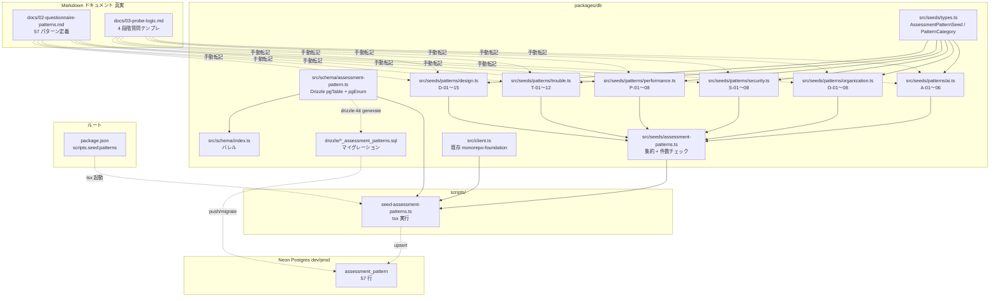
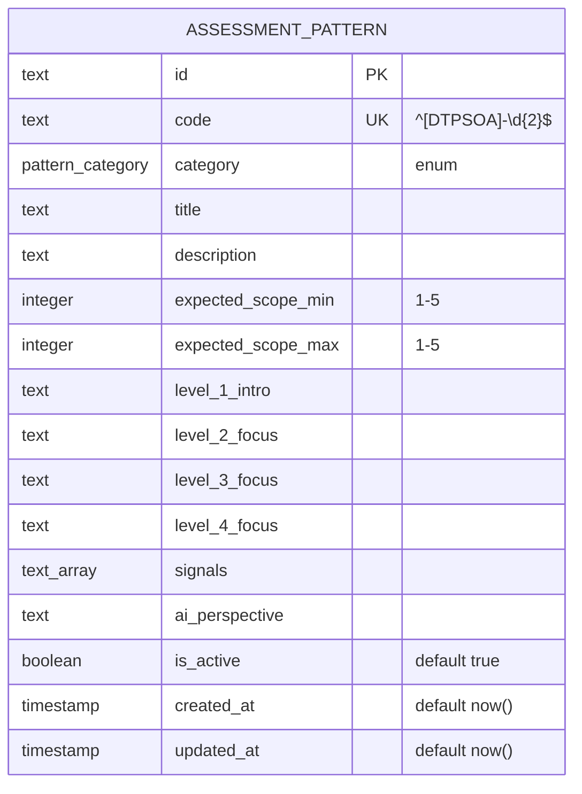
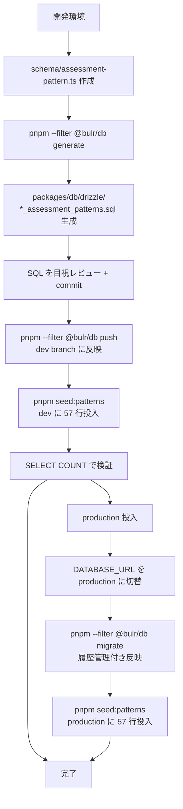

# Design Document — assessment-pattern-seed

## Overview

**Purpose**: 本機能は、bulr Stage 1 MVP（**AI 面接アシスタント型**）における **問診素材データ層** を確立する。具体的には：

1. `assessment_pattern` テーブルの Drizzle スキーマ定義（1 テーブル完結、6 カテゴリ × 57 パターン × 4 段階質問テンプレを単一行で表現）
2. `docs/02-questionnaire-patterns.md` と `docs/03-probe-logic.md` に Markdown で記述済みの 57 パターンを、TypeScript の型安全なシードデータに **手動転記** し、カテゴリ別 6 ファイルに分割配置
3. `pnpm seed:patterns` で dev / production Neon ブランチに **idempotent upsert** 投入できるシードスクリプト

**Users**: 後続 spec `assessment-engine` の実装担当者が利用する。同 spec の LLM 関数（`proposeNextQuestions` / `analyzeTurn` / `aggregatePatternCoverage` / `generateSessionReport`）が `assessment_pattern` テーブルを `is_active=true` フィルタで取得し、4 段階質問テンプレと AI 観点問いを LLM プロンプトに動的注入する。

**v2 移行による役割の変化**: スキーマと内容は v1 と同じ（57 パターンの定義は不変）。ただし用途は **「LLM が候補者に直接質問するための素材」** から **「LLM が面接官に提案する質問候補（3 候補）の素材」** に変わる。本 spec はデータ層のみを所有するため、用途変更は本 spec の境界には影響しない（後続 `assessment-engine` 側の LLM プロンプト設計が変わるのみ）。

**Impact**: `monorepo-foundation` で初期化された空 `packages/db/src/schema/index.ts` に最初の実テーブル（`assessment_pattern`）を追加し、最初のマイグレーションファイルを生成する。`packages/db/src/seeds/` ディレクトリ群は本 spec で新規作成。`scripts/seed-assessment-patterns.ts` は `monorepo-foundation` で予約された `scripts/` ディレクトリに新規追加。

### Goals

- `packages/db/src/schema/assessment-pattern.ts` に Drizzle pgTable + `pg_enum` (category) を実装
- `packages/db/drizzle/*_assessment_patterns.sql` に drizzle-kit 生成のマイグレーションを配置
- `packages/db/src/seeds/types.ts` に `AssessmentPatternSeed` を定義（`PatternCategory` は `schema/assessment-pattern.ts` の pgEnum から派生し `@bulr/db` バレルから export）
- `packages/db/src/seeds/patterns/{design,trouble,performance,security,organization,ai}.ts` の 6 ファイルに 57 件を分割配置
- `packages/db/src/seeds/assessment-patterns.ts` で 6 ファイルを集約 + 件数バリデーション補助
- `scripts/seed-assessment-patterns.ts` で `db.transaction` + `onConflictDoUpdate({ target: code })`（`is_active` を SET から除外）を実装
- ルート `package.json` に `seed:patterns` スクリプトを追加
- `docs/setup/seed.md` に dev / production への投入手順を文書化
- 投入後、ログに `total = 57` と `category: design = 15, trouble = 12, performance = 8, security = 8, organization = 8, ai = 6` を出力

### Non-Goals

- 受験セッション・回答・評価関連テーブル（`candidate` / `interview_session` / `interview_turn` / `pattern_coverage` / `session_report`）→ `assessment-engine` spec
- LLM 関数本体（`proposeNextQuestions` / `analyzeTurn` / `aggregatePatternCoverage` / `splitInterviewerCandidate` / `generateSessionReport`）→ `assessment-engine` spec
- 評価スコアリング（5 次元 × 0-3 / 1-5、`level_reached`、`stuck_type`）→ `assessment-engine` spec
- パターン編集 UI（管理画面でのパターン CRUD）→ Stage 2 以降
- パターン使用統計・ヒートマップ集計 → Stage 2 以降
- フリー質問（`pattern_id=null`）からの新パターン昇格 UI → Stage 2 以降
- 多言語対応（英語、ベトナム語）→ Stage 2 以降（Stage 1 は日本語のみ）
- Better Auth 関連テーブル → `authentication` spec
- 環境変数定義・Vercel 環境セットアップ → `multi-env-infrastructure` spec
- Markdown ドキュメント → TypeScript の **自動変換ツール**（手動転記で運用）

## Boundary Commitments

### This Spec Owns

- `packages/db/src/schema/assessment-pattern.ts`：Drizzle pgTable + `pgEnum('pattern_category', ...)` の定義
- `packages/db/src/schema/index.ts`：本テーブルの export 追加（既存の空バレル更新）
- `packages/db/drizzle/*_assessment_patterns.sql`：drizzle-kit 生成のマイグレーションファイル（連番は drizzle-kit 決定）
- `packages/db/drizzle/meta/*` 配下の drizzle-kit メタファイル（journal、snapshot）
- `packages/db/src/seeds/types.ts`：`AssessmentPatternSeed` 型（`PatternCategory` は `schema/assessment-pattern.ts` で pgEnum 派生として定義し再 export）
- `packages/db/src/seeds/patterns/design.ts`（D-01〜15）
- `packages/db/src/seeds/patterns/trouble.ts`（T-01〜12）
- `packages/db/src/seeds/patterns/performance.ts`（P-01〜08）
- `packages/db/src/seeds/patterns/security.ts`（S-01〜08）
- `packages/db/src/seeds/patterns/organization.ts`（O-01〜08）
- `packages/db/src/seeds/patterns/ai.ts`（A-01〜06）
- `packages/db/src/seeds/assessment-patterns.ts`：集約 index + カテゴリ別件数チェック純関数
- `scripts/seed-assessment-patterns.ts`：tsx 実行、`db.transaction` + `onConflictDoUpdate`
- ルート `package.json` の `scripts.seed:patterns` 追加
- `docs/setup/seed.md`：投入手順（または README へのセクション追加）

### Out of Boundary

- 他テーブル（`candidate` / `interview_session` 等）の schema 定義 → 後続 spec
- LLM 関数による `assessment_pattern` の読み取り → `assessment-engine` spec
- 評価ロジック・スコアリング → `assessment-engine` spec
- パターン編集 UI → Stage 2
- パターンの自動翻訳・多言語化 → Stage 2
- `assessment_pattern` レコードの hard delete 機能 → 永久に out（採番不変原則）
- 57 パターンの内容自体（Markdown ドキュメント側で管理、本 spec は転記のみ）
- `assessment_pattern` を参照する FK（`interview_turn.pattern_id` 等）→ 参照側 spec が定義
- `DATABASE_URL` の値・Neon ブランチ作成 → `multi-env-infrastructure` spec

### Allowed Dependencies

- Drizzle ORM 0.45.x stable（`pgTable`、`pgEnum`、`text`、`integer`、`boolean`、`timestamp`、`uniqueIndex` 等）
- drizzle-kit 0.31.x（generate、push、migrate）
- `nanoid` ^5（`id` カラムの primary key 生成、`packages/db` で `monorepo-foundation` 時に追加済み）
- `pg` 8.x（接続）／将来的に `@neondatabase/serverless` への切替は `multi-env-infrastructure` spec で判断
- `tsx` ^4（シードスクリプト実行、`packages/db` の devDependencies に追加済み）
- TypeScript 5.x strict mode、no `any`
- 制約: 本 spec で **Zod は使わない**（runtime バリデーションが必要なら `packages/lib` 経由で後続 spec が追加。本 spec は TypeScript 型のみで網羅）
- 制約: 本 spec で **新規 npm パッケージを追加しない**（`monorepo-foundation` で揃えた依存のみで完結）

### Revalidation Triggers

- `assessment_pattern` のカラム名・型・enum 値の変更 → `assessment-engine` spec の LLM 関数（`proposeNextQuestions`、`aggregatePatternCoverage` 等）の DB 読み取りコードと Zod スキーマを書き換え
- `category` enum の値追加・削除（例：`'frontend'` 追加）→ `evaluation-rubric.md` の `heatmap_data.by_category` を全面的に書き換え、`assessment-engine` spec の `generateSessionReport` 出力スキーマを更新
- パターンコード regex (`^[DTPSOA]-\d{2}$`) の変更 → 全シードファイル + `assessment-engine` spec の入力検証を更新
- 4 段階質問テンプレのカラム数の変更（例：5 段化）→ Markdown ドキュメント + シードファイル全件 + `assessment-engine` spec のプロンプトテンプレを書き換え
- `is_active` カラムの削除 → 採番不変原則の保証手段が変わる、運用ドキュメント書き換え
- `expected_scope_min` / `expected_scope_max` のレンジ変更（例：1-7 化）→ 評価ルーブリック + 全シードファイル + `assessment-engine` spec の射程スコア検証を更新

## Architecture

### Existing Architecture Analysis

`monorepo-foundation` spec で以下が既に整備済み：

- `packages/db/src/client.ts`：`drizzle(pg.Pool, { schema })` の singleton 初期化
- `packages/db/src/schema/index.ts`：空バレル（コメントのみ）
- `packages/db/drizzle.config.ts`：`schema: './src/schema/*.ts'`、`out: './drizzle'`、`dialect: 'postgresql'`
- `packages/db/package.json` の `scripts.{generate,push,migrate}`
- `packages/db` の `devDependencies` に `drizzle-kit`、`tsx`
- `scripts/` ディレクトリ予約

`multi-env-infrastructure` spec で以下が整備済み（並行完了）：

- `DATABASE_URL` 環境変数（dev / production Neon ブランチ別）
- `.env.local` / Vercel Environment Variables への登録手順

本 spec はこれらの基盤に対して、**最初の実テーブル + 最初のシード + 最初のシードスクリプト** を追加するのみ。新規パッケージ追加・新規依存追加は行わない。

### Architecture Pattern & Boundary Map



**Architecture Integration**:

- **Selected pattern**: 単一テーブル + カテゴリ別シードファイル + idempotent upsert スクリプト。`structure.md` の「DB スキーマの単一の真実は packages/db」原則に準拠
- **Domain/feature boundaries**: スキーマと型 (`packages/db/src/schema/`、`src/seeds/types.ts`) と シードデータ本体 (`src/seeds/patterns/`) と 投入スクリプト (`scripts/`) を物理的に分離。Markdown ドキュメント → TypeScript シードの転記方向は一方通行（ドキュメント正）
- **Existing patterns preserved**: `monorepo-foundation` の `packages/db` 初期化、`drizzle.config.ts`、scripts ディレクトリ規約、命名規則（snake_case テーブル / kebab-case ファイル / camelCase 変数）
- **New components rationale**: 1 テーブルで完結（過剰な正規化を避ける）。4 段階質問テンプレを別テーブル化しない理由：常に 4 段階固定でカラム数も固定、JOIN コスト不要、レビュー容易。`signals` のみ可変長配列で `text[]`
- **Steering compliance**: `assessment-design.md`（57 パターン × 6 カテゴリ × 4 段階深掘り、採番不変、論理休眠）、`evaluation-rubric.md`（射程レンジ 1-5、5 次元評価は別 spec）、`structure.md`（snake_case、enum 値もフル文字列）、`tech.md`（Drizzle 0.45.x、TypeScript strict）

### Technology Stack

| Layer      | Choice / Version                                   | Role in Feature                                 | Notes                                                  |
| ---------- | -------------------------------------------------- | ----------------------------------------------- | ------------------------------------------------------ |
| ORM        | Drizzle ORM 0.45.x stable                          | `pgTable` / `pgEnum` 定義、`onConflictDoUpdate` | `monorepo-foundation` で導入済み                       |
| Migration  | drizzle-kit 0.31.x                                 | `generate` / `push` / `migrate`                 | `packages/db/scripts` で利用                           |
| DB         | Neon Postgres（dev / prod ブランチ）               | `assessment_pattern` 永続化                     | `multi-env-infrastructure` spec で `DATABASE_URL` 提供 |
| Driver     | `pg` 8.x（Pool）                                   | シードスクリプトの DB 接続                      | 将来 `@neondatabase/serverless` 切替は別 spec          |
| ID 生成    | `nanoid` ^5                                        | `id` カラムの 21 文字 ID 生成                   | `monorepo-foundation` で `packages/db` deps に追加済み |
| TS Runtime | `tsx` ^4                                           | `scripts/seed-assessment-patterns.ts` 実行      | `packages/db` devDeps、ルート pnpm scripts から呼ぶ    |
| 型         | TypeScript 5.x strict / `noUncheckedIndexedAccess` | `AssessmentPatternSeed` / `PatternCategory`     | `tsconfig.base.json` 継承                              |

## File Structure Plan

### Directory Structure

```
bulr-app-mvp/
├── package.json                                       # 修正: scripts.seed:patterns 追加
├── docs/
│   └── setup/
│       └── seed.md                                    # 新規: 投入手順 (Neon dev/prod)
├── scripts/
│   └── seed-assessment-patterns.ts                    # 新規: tsx 実行 idempotent upsert
└── packages/
    └── db/
        ├── drizzle/
        │   └── *_assessment_patterns.sql              # 新規 (drizzle-kit 自動生成、連番不定)
        │   └── meta/                                  # 新規 (drizzle-kit 自動生成)
        │       └── _journal.json
        │       └── 0000_snapshot.json (etc)
        └── src/
            ├── schema/
            │   ├── assessment-pattern.ts              # 新規: pgTable + pgEnum
            │   └── index.ts                           # 修正: assessment-pattern を再エクスポート
            └── seeds/
                ├── types.ts                           # 新規: AssessmentPatternSeed / PatternCategory
                ├── assessment-patterns.ts             # 新規: 6 ファイル集約 + 件数チェック関数
                └── patterns/
                    ├── design.ts                      # 新規: D-01〜15 (15 件)
                    ├── trouble.ts                     # 新規: T-01〜12 (12 件)
                    ├── performance.ts                 # 新規: P-01〜08 (8 件)
                    ├── security.ts                    # 新規: S-01〜08 (8 件)
                    ├── organization.ts                # 新規: O-01〜08 (8 件)
                    └── ai.ts                          # 新規: A-01〜06 (6 件)
```

### File Responsibilities

| File                                             | Responsibility                                                                                                                           | Created/Modified |
| ------------------------------------------------ | ---------------------------------------------------------------------------------------------------------------------------------------- | ---------------- |
| `packages/db/src/schema/assessment-pattern.ts`   | `pgEnum('pattern_category', [...])` と `pgTable('assessment_pattern', { ... })` を export。カラム順は brief 準拠                         | Created          |
| `packages/db/src/schema/index.ts`                | `export * from './assessment-pattern';` を追加（既存空バレル更新）                                                                       | Modified         |
| `packages/db/drizzle/*_assessment_patterns.sql`  | drizzle-kit が生成する CREATE TABLE / CREATE TYPE 文                                                                                     | Created (auto)   |
| `packages/db/drizzle/meta/*`                     | drizzle-kit のジャーナル + スナップショット                                                                                              | Created (auto)   |
| `packages/db/src/seeds/types.ts`                 | `AssessmentPatternSeed` 型（`PatternCategory` は `schema/assessment-pattern.ts` で pgEnum 派生として定義し import）                      | Created          |
| `packages/db/src/seeds/patterns/design.ts`       | `designPatterns: readonly AssessmentPatternSeed[] = [{...D-01}, ..., {...D-15}]` を named export                                         | Created          |
| `packages/db/src/seeds/patterns/trouble.ts`      | T-01〜T-12 の 12 件                                                                                                                      | Created          |
| `packages/db/src/seeds/patterns/performance.ts`  | P-01〜P-08 の 8 件                                                                                                                       | Created          |
| `packages/db/src/seeds/patterns/security.ts`     | S-01〜S-08 の 8 件                                                                                                                       | Created          |
| `packages/db/src/seeds/patterns/organization.ts` | O-01〜O-08 の 8 件                                                                                                                       | Created          |
| `packages/db/src/seeds/patterns/ai.ts`           | A-01〜A-06 の 6 件                                                                                                                       | Created          |
| `packages/db/src/seeds/assessment-patterns.ts`   | 6 ファイルを `import` し、`allAssessmentPatterns: readonly AssessmentPatternSeed[]` を export。`countByCategory(patterns)` 純関数 export | Created          |
| `scripts/seed-assessment-patterns.ts`            | `db.transaction` で `onConflictDoUpdate({ target: code, set: ... })`（is_active 除外）を 57 件分実行、件数ログ                           | Created          |
| `package.json` (root)                            | `"seed:patterns": "tsx scripts/seed-assessment-patterns.ts"` を `scripts` に追加                                                         | Modified         |
| `docs/setup/seed.md`                             | dev / production 投入手順、`DATABASE_URL` 切替方法、検証クエリ                                                                           | Created          |

> 各ファイルは単一責務。スキーマ 1 ファイル、型 1 ファイル、シードデータ 7 ファイル（カテゴリ 6 + 集約 1）、スクリプト 1 ファイル、ドキュメント 1 ファイル、修正 2 ファイル（schema/index.ts、root package.json）。シードファイルは 1 ファイルあたり 30〜600 行（D-01 などフルパターンは 30-50 行 × 件数）。

### Modified Files

- `packages/db/src/schema/index.ts`：`export * from './assessment-pattern';` を 1 行追加（既存は空バレルコメントのみ）
- ルート `package.json`：`scripts.seed:patterns` を追加（他フィールドは触らない）

## Requirements Traceability

| Requirement | Summary                                     | Components                        | Interfaces                                     | Flows                  |
| ----------- | ------------------------------------------- | --------------------------------- | ---------------------------------------------- | ---------------------- |
| 1.1         | `assessmentPattern` Drizzle pgTable export  | SchemaModule                      | `packages/db/src/schema/assessment-pattern.ts` | import フロー          |
| 1.2         | 全カラム snake_case 定義                    | SchemaModule                      | pgTable 定義                                   | DDL フロー             |
| 1.3         | category enum フル文字列                    | SchemaModule                      | pgEnum('pattern_category', ...)                | DDL フロー             |
| 1.4         | code regex `^[DTPSOA]-\d{2}$`               | TypesModule + SeedFiles           | TypeScript 型 + 実値                           | typecheck フロー       |
| 1.5         | scope min/max は 1-5                        | TypesModule + SchemaModule        | リテラル型 + integer 列                        | typecheck + DDL フロー |
| 1.6         | code UNIQUE                                 | SchemaModule                      | uniqueIndex / .unique()                        | DDL フロー             |
| 1.7         | is_active default true                      | SchemaModule                      | boolean default                                | DDL フロー             |
| 2.1         | drizzle-kit generate でマイグレーション生成 | MigrationFile                     | `*_assessment_patterns.sql` glob               | generate フロー        |
| 2.2         | dev push 成功                               | MigrationFile + DbPackage scripts | drizzle-kit push                               | push フロー            |
| 2.3         | prod migrate 成功                           | MigrationFile + DbPackage scripts | drizzle-kit migrate                            | migrate フロー         |
| 2.4         | スキーマ差分なしなら追加生成しない          | drizzle-kit 標準                  | drizzle-kit                                    | generate フロー        |
| 2.5         | ドキュメントは番号ハードコードしない        | SetupDoc                          | `docs/setup/seed.md`                           | doc フロー             |
| 3.1         | PatternCategory ユニオン定義（pgEnum 派生） | SchemaModule                      | `packages/db/src/schema/assessment-pattern.ts` | pgEnum 派生フロー      |
| 3.2         | AssessmentPatternSeed 型定義                | TypesModule                       | TypeScript interface/type                      | import フロー          |
| 3.3         | code 型レベル制約                           | TypesModule                       | template literal type 推奨                     | typecheck フロー       |
| 3.4         | signals 配列型                              | TypesModule                       | `readonly string[]`                            | typecheck フロー       |
| 3.5         | scope min/max リテラル型                    | TypesModule                       | `1 \| 2 \| 3 \| 4 \| 5`                        | typecheck フロー       |
| 4.1         | 6 ファイル全存在                            | SeedFiles                         | filesystem                                     | seed 投入フロー        |
| 4.2-4.7     | 各ファイル件数 (15/12/8/8/8/6)              | SeedFiles                         | named export 配列                              | seed 投入フロー        |
| 4.8         | 集約 index 57 件                            | SeedAggregator                    | `assessment-patterns.ts`                       | seed 投入フロー        |
| 4.9         | category とファイル名一致                   | SeedFiles                         | TypeScript 型強制                              | typecheck フロー       |
| 4.10        | code 重複なし + プレフィックス一致          | SeedFiles + SeedAggregator        | runtime 件数チェック                           | seed 投入フロー        |
| 5.1-5.5     | Markdown 内容との一致                       | SeedFiles + 手動レビュー          | PR diff レビュー                               | 転記 + レビューフロー  |
| 5.6         | ドキュメント正の運用                        | SetupDoc                          | `docs/setup/seed.md` 注記                      | doc フロー             |
| 6.1         | tsx で DATABASE_URL 参照                    | SeedScript                        | `scripts/seed-assessment-patterns.ts`          | seed 投入フロー        |
| 6.2         | db.transaction + onConflictDoUpdate         | SeedScript                        | Drizzle API                                    | seed 投入フロー        |
| 6.3         | SET 句に is_active を含まない               | SeedScript                        | onConflictDoUpdate set 構築                    | seed 投入フロー        |
| 6.4         | SET 句に updated_at                         | SeedScript                        | onConflictDoUpdate set 構築                    | seed 投入フロー        |
| 6.5         | 2 回連続実行で件数不変                      | SeedScript                        | idempotent upsert                              | seed 投入フロー        |
| 6.6         | カテゴリ別 + 総数を console.log             | SeedScript                        | `console.log`                                  | seed 投入フロー        |
| 6.7         | 期待件数不一致時に warn                     | SeedScript                        | `console.warn`/`console.error`                 | seed 投入フロー        |
| 6.8         | 本番投入は明示的コマンド                    | SeedScript + SetupDoc             | 環境変数切替手順                               | doc フロー             |
| 7.1         | seed:patterns コマンド                      | RootPackageJson                   | `scripts.seed:patterns`                        | seed 投入フロー        |
| 7.2         | 既存 scripts に影響なし                     | RootPackageJson                   | `package.json` 追記のみ                        | typecheck フロー       |
| 7.3         | tsx 存在                                    | DbPackage devDeps                 | 既存                                           | seed 投入フロー        |
| 8.1         | seed.md 存在                                | SetupDoc                          | `docs/setup/seed.md`                           | doc フロー             |
| 8.2         | DATABASE_URL 切替記載                       | SetupDoc                          | `docs/setup/seed.md`                           | doc フロー             |
| 8.3         | マイグレーション名 glob 表現                | SetupDoc                          | `docs/setup/seed.md`                           | doc フロー             |
| 8.4         | 検証クエリ記載                              | SetupDoc                          | `docs/setup/seed.md`                           | doc フロー             |
| 9.1         | total = 57 ログ                             | SeedScript                        | `console.log`                                  | seed 投入フロー        |
| 9.2         | カテゴリ別件数ログ                          | SeedScript                        | `console.log`                                  | seed 投入フロー        |
| 9.3         | 総数不一致時 warn                           | SeedScript                        | `console.error`                                | seed 投入フロー        |
| 9.4         | 期待値と実測値の両方                        | SeedScript                        | `console.error`                                | seed 投入フロー        |

## Components and Interfaces

| Component       | Domain/Layer                 | Intent                                                                    | Req Coverage                 | Key Dependencies (P0/P1)                                           | Contracts |
| --------------- | ---------------------------- | ------------------------------------------------------------------------- | ---------------------------- | ------------------------------------------------------------------ | --------- |
| SchemaModule    | packages/db (schema)         | `assessment_pattern` テーブル + `pattern_category` enum を Drizzle で定義 | 1.1, 1.2, 1.3, 1.5, 1.6, 1.7 | drizzle-orm 0.45 (P0), nanoid 5 (P0)                               | State     |
| MigrationFile   | packages/db (drizzle)        | drizzle-kit が生成する DDL（CREATE TYPE + CREATE TABLE + UNIQUE INDEX）   | 2.1, 2.2, 2.3, 2.4           | drizzle-kit 0.31 (P0), Postgres 接続 (P0)                          | State     |
| TypesModule     | packages/db (seeds)          | `AssessmentPatternSeed` / `PatternCategory` 型を提供                      | 1.4, 3.1, 3.2, 3.3, 3.4, 3.5 | TypeScript 5.x (P0)                                                | State     |
| SeedFiles       | packages/db (seeds/patterns) | 6 ファイル × 57 件のシードデータ本体                                      | 4.1-4.10, 5.1-5.5            | TypesModule (P0)                                                   | State     |
| SeedAggregator  | packages/db (seeds)          | 6 ファイルを集約 + `countByCategory` 純関数                               | 4.8, 4.10, 9.2               | SeedFiles (P0)                                                     | Service   |
| SeedScript      | scripts                      | `db.transaction` + `onConflictDoUpdate`、件数ログ                         | 6.1-6.8, 9.1-9.4             | SchemaModule (P0), SeedAggregator (P0), `db` client (P0), tsx (P0) | Batch     |
| RootPackageJson | root                         | `pnpm seed:patterns` コマンド登録                                         | 7.1, 7.2, 7.3                | tsx (P0)                                                           | State     |
| SetupDoc        | docs                         | `docs/setup/seed.md`：投入手順 + 検証クエリ + glob 表現                   | 2.5, 5.6, 6.8, 8.1-8.4       | （該当なし）                                                       | State     |

> 全コンポーネントが「スキーマ + データ + スクリプト」中心のため、外部 API contract や複雑な Service interface は不要。SeedScript のみが Batch 契約を持つ（実行 → DB upsert + ログ出力）。

### packages/db (schema)

#### SchemaModule

| Field             | Detail                                                                    |
| ----------------- | ------------------------------------------------------------------------- |
| Intent            | `assessment_pattern` テーブルと `pattern_category` enum を Drizzle で定義 |
| Requirements      | 1.1, 1.2, 1.3, 1.5, 1.6, 1.7                                              |
| Owner / Reviewers | 創業者 + DB スキーマレビュア                                              |

**Responsibilities & Constraints**

- `pgEnum('pattern_category', ['design', 'trouble', 'performance', 'security', 'organization', 'ai'])` を `patternCategory` 名で export（フル文字列、単文字 D/T/P/S/O/A は code に使う）
- `pgTable('assessment_pattern', { ... })` を `assessmentPattern` 名で export
- `export type PatternCategory = (typeof patternCategory.enumValues)[number]` を export（DRY 原則: enum 値の単一の真実を pgEnum 側に置き、後続 spec はここから import）
- カラム定義（snake_case）は brief.md 準拠：
  - `id`：`text('id').primaryKey().$defaultFn(() => nanoid())`
  - `code`：`text('code').notNull().unique()`（unique constraint で onConflict target にも使える）
  - `category`：`patternCategory('category').notNull()`
  - `title`：`text('title').notNull()`
  - `description`：`text('description').notNull()`
  - `expected_scope_min`：`integer('expected_scope_min').notNull()`
  - `expected_scope_max`：`integer('expected_scope_max').notNull()`
  - `level_1_intro`：`text('level_1_intro').notNull()`
  - `level_2_focus`：`text('level_2_focus').notNull()`
  - `level_3_focus`：`text('level_3_focus').notNull()`
  - `level_4_focus`：`text('level_4_focus').notNull()`
  - `signals`：`text('signals').array().notNull()`（Postgres `text[]`）
  - `ai_perspective`：`text('ai_perspective').notNull()`
  - `is_active`：`boolean('is_active').notNull().default(true)`
  - `created_at`：`timestamp('created_at', { withTimezone: true }).notNull().defaultNow()`
  - `updated_at`：`timestamp('updated_at', { withTimezone: true }).notNull().defaultNow()`
- 不変条件：
  - `code` UNIQUE（upsert の conflict target として利用）
  - `category` enum は 6 値のみ
  - `expected_scope_min <= expected_scope_max`（DB CHECK 制約は任意、シード時の TypeScript 型で保証）

**Dependencies**

- Inbound: `packages/db/src/schema/index.ts`（バレル再エクスポート）（P0）、SeedScript（読み取り、insert）（P0）、後続 `assessment-engine` spec の LLM 関数（P0）
- Outbound: drizzle-orm 0.45（P0）、nanoid 5（P0、id 生成）
- External: Postgres 13+（`text[]` 対応）

**Contracts**: State

##### State Management

- State model: テーブル定義（型）+ Drizzle inference 型（`InferSelectModel<typeof assessmentPattern>`）
- Persistence & consistency: マイグレーションで Postgres に作成、`code` UNIQUE で重複防止
- Concurrency strategy: Postgres の標準 ACID

**Implementation Notes**

- Integration: `monorepo-foundation` の空 `schema/index.ts` に `export * from './assessment-pattern';` を 1 行追加。`drizzle.config.ts` の `schema: './src/schema/*.ts'` パターンで自動的に拾われる
- Validation: `pnpm --filter @bulr/db generate` でマイグレーション生成、`pnpm --filter @bulr/db push` で dev branch 適用、`SELECT * FROM information_schema.columns WHERE table_name='assessment_pattern'` でカラム一覧確認
- Risks:
  - `pgEnum` を作る際、Postgres 側に CREATE TYPE が走る → drizzle-kit が自動的に生成
  - `text[]` の配列リテラル投入時のエスケープに注意 → Drizzle が JS 配列を Postgres `text[]` に自動シリアライズ

#### MigrationFile

| Field        | Detail                                       |
| ------------ | -------------------------------------------- |
| Intent       | drizzle-kit generate が出力する DDL ファイル |
| Requirements | 2.1, 2.2, 2.3, 2.4                           |

**Responsibilities & Constraints**

- ファイル名：`packages/db/drizzle/*_assessment_patterns.sql`（連番 + スネークケース、drizzle-kit が決定）
- 内容：`CREATE TYPE pattern_category AS ENUM (...)`、`CREATE TABLE assessment_pattern (...)`、`CREATE UNIQUE INDEX assessment_pattern_code_unique ON assessment_pattern(code)` 等
- 並行作成される drizzle-kit メタ：`packages/db/drizzle/meta/_journal.json`、`packages/db/drizzle/meta/0000_snapshot.json`（番号は drizzle-kit 決定）

**Dependencies**

- Inbound: SeedScript の前提（テーブルが存在）（P0）、後続 spec のすべて（P0）
- Outbound: SchemaModule（差分検出ソース）
- External: drizzle-kit（P0）、Postgres（P0）

**Contracts**: State

**Implementation Notes**

- Integration: 開発フローは `pnpm --filter @bulr/db generate` → 出力された SQL をレビュー（`docs/02` 等の用語と整合性確認）→ git commit。dev branch には `push`、production には `migrate`
- Validation: drizzle-kit が CREATE 文を生成、SQL 内に `assessment_pattern` テーブルと `pattern_category` enum 名が含まれることを目視確認
- Risks:
  - 後続 spec で `assessment_pattern` を FK 参照する際、テーブル名・id 型（text）が固定化される → 本 spec で id を text + nanoid に決定したことを README で明示
  - drizzle-kit の出力 SQL が将来的に変わる可能性（マイナーバージョンアップ）→ `pnpm-lock.yaml` で pin

### packages/db (seeds)

#### TypesModule

| Field        | Detail                               |
| ------------ | ------------------------------------ |
| Intent       | シードデータ用の TypeScript 型を提供 |
| Requirements | 1.4, 3.1, 3.2, 3.3, 3.4, 3.5         |

**Responsibilities & Constraints**

- `PatternCategory` 型：**schema/assessment-pattern.ts の pgEnum から派生**（`export type PatternCategory = (typeof patternCategory.enumValues)[number]`）。リテラル定義の重複を避ける唯一の真実 (DRY)。`packages/db/src/schema/assessment-pattern.ts` で定義し、`packages/db/src/index.ts` バレルから `@bulr/db` として再 export。後続 spec（assessment-engine, admin-review-panel）はここから import するため、`packages/types/src/evaluation.ts` には PatternCategory を再定義しない（packages/types -> @bulr/db の逆方向依存を避けるため）
- `AssessmentPatternCode` 型：可能なら template literal type で `\`${'D'|'T'|'P'|'S'|'O'|'A'}-${string}\`` を表現（runtime regex 検証は SeedScript で実施）
- `AssessmentPatternSeed` 型：DB カラムから `id` / `created_at` / `updated_at` を除いた必須プロパティ。`PatternCategory` は `../schema/assessment-pattern` から import（pgEnum 派生型）
  ```typescript
  import type { PatternCategory } from '../schema/assessment-pattern';
  export type AssessmentPatternSeed = {
    code: AssessmentPatternCode;
    category: PatternCategory;
    title: string;
    description: string;
    expected_scope_min: 1 | 2 | 3 | 4 | 5;
    expected_scope_max: 1 | 2 | 3 | 4 | 5;
    level_1_intro: string;
    level_2_focus: string;
    level_3_focus: string;
    level_4_focus: string;
    signals: readonly string[];
    ai_perspective: string;
    is_active?: boolean; // デフォルト true、INSERT のみ反映
  };
  ```
- snake_case フィールド名を採用（DB カラム名と 1:1、シード投入時にマップ不要）

**Dependencies**

- Inbound: SeedFiles 6 個（P0）、SeedAggregator（P0）、SeedScript（P0）
- Outbound: なし（純粋型）
- External: TypeScript 5.x

**Contracts**: State

**Implementation Notes**

- Integration: `import type { AssessmentPatternSeed } from '@bulr/db/seeds/types'` と `import type { PatternCategory } from '@bulr/db/schema'` の形で他ファイルが参照（`@bulr/db` の package.json exports map にサブパスを追加するか、相対 import で対応。Stage 1 では相対 import で十分）。`PatternCategory` は schema 側 (pgEnum 派生) が単一の真実
- Validation: 各シードファイルで型注釈付きで配列を宣言し、`pnpm typecheck` 通過
- Risks: template literal type で全 57 コードを完全網羅すると型サイズが大きくなる → リテラル型は `\`${string}-${string}\`` 程度に緩く取り、厳密検証は runtime（SeedScript）で実施

#### SeedFiles

| Field        | Detail                                                  |
| ------------ | ------------------------------------------------------- |
| Intent       | カテゴリ別 6 ファイルに 57 件のシードオブジェクトを配置 |
| Requirements | 4.1-4.10, 5.1-5.5                                       |

**Responsibilities & Constraints**

- 各ファイル：`export const designPatterns: readonly AssessmentPatternSeed[] = [{...}, ...] as const;`（`as const` で型推論を厳格化）
- 各オブジェクトのフィールドは TypesModule の型に従う、`category` プロパティはファイル名と一致
- 内容は `docs/02-questionnaire-patterns.md` と `docs/03-probe-logic.md` から **手動転記**
- 1 オブジェクトあたり概ね 30〜50 行（4 段階質問テンプレ + signals 配列が中心）
- ファイルあたり：design 30〜750 行、trouble 30〜600 行、その他 30〜400 行

**Dependencies**

- Inbound: SeedAggregator（P0）
- Outbound: TypesModule（P0）
- External: なし

**Contracts**: State

**Implementation Notes**

- Integration: ファイル名 = カテゴリ名（design.ts → category: 'design'）、export 名は `<category>Patterns`（kebab → camelCase 変換）
- Validation:
  - TypeScript 型による型チェック（カラム漏れ・型不一致が検出される）
  - 件数の手動カウント、または SeedAggregator の `countByCategory` 関数 + SeedScript のログ出力で検証
  - PR レビュー時に Markdown 元と diff を目視確認（`docs/02-questionnaire-patterns.md` の D-01 セクションと `design.ts` の D-01 オブジェクトを横並び確認）
- Risks:
  - 手動転記による typo・抜け漏れ → SeedScript の件数チェック + PR レビュー + 将来的な markdown→TS 一致テストで救済
  - Markdown 側の更新に追従し忘れ → 「ドキュメント正」運用ルールを `docs/setup/seed.md` と本 design に明記、変更時は PR で同時更新

#### SeedAggregator

| Field        | Detail                                       |
| ------------ | -------------------------------------------- |
| Intent       | 6 ファイルを集約し、件数チェック純関数を提供 |
| Requirements | 4.8, 4.10, 9.2                               |

**Responsibilities & Constraints**

- `assessmentPatterns: readonly AssessmentPatternSeed[]` を export（6 ファイルを spread で結合）
- `countByCategory(patterns: readonly AssessmentPatternSeed[]): Record<PatternCategory, number>` を export
- `EXPECTED_COUNTS: Readonly<Record<PatternCategory, number>>` を export（`{ design: 15, trouble: 12, performance: 8, security: 8, organization: 8, ai: 6 }`）

**Dependencies**

- Inbound: SeedScript（P0）
- Outbound: SeedFiles 6 個（P0）、TypesModule（P0）
- External: なし

**Contracts**: Service

##### Service Interface

```typescript
// packages/db/src/seeds/assessment-patterns.ts (概要)
import { designPatterns } from './patterns/design';
import { troublePatterns } from './patterns/trouble';
import { performancePatterns } from './patterns/performance';
import { securityPatterns } from './patterns/security';
import { organizationPatterns } from './patterns/organization';
import { aiPatterns } from './patterns/ai';
import type { AssessmentPatternSeed } from './types';
import type { PatternCategory } from '../schema/assessment-pattern'; // pgEnum 派生型

export const assessmentPatterns: readonly AssessmentPatternSeed[] = [
  ...designPatterns,
  ...troublePatterns,
  ...performancePatterns,
  ...securityPatterns,
  ...organizationPatterns,
  ...aiPatterns,
];

export const EXPECTED_COUNTS: Readonly<Record<PatternCategory, number>> = {
  design: 15,
  trouble: 12,
  performance: 8,
  security: 8,
  organization: 8,
  ai: 6,
} as const;

export function countByCategory(
  patterns: readonly AssessmentPatternSeed[],
): Record<PatternCategory, number> {
  const counts: Record<PatternCategory, number> = {
    design: 0,
    trouble: 0,
    performance: 0,
    security: 0,
    organization: 0,
    ai: 0,
  };
  for (const p of patterns) counts[p.category]++;
  return counts;
}
```

- Preconditions: 6 SeedFiles が型に従って正しく export している
- Postconditions: `assessmentPatterns.length === 57`、`countByCategory(...)` が EXPECTED_COUNTS と一致
- Invariants: `as const` 配列のため、import 後の mutation 不可

**Implementation Notes**

- Integration: SeedScript が `assessmentPatterns` と `countByCategory` / `EXPECTED_COUNTS` を import
- Validation: SeedScript が runtime で `countByCategory(assessmentPatterns)` と `EXPECTED_COUNTS` を比較してログ出力
- Risks: 6 ファイルのうち 1 つが空配列を export してしまっても TypeScript はエラーを出さない → SeedScript のカウント検証で救済

### scripts

#### SeedScript

| Field        | Detail                                                   |
| ------------ | -------------------------------------------------------- |
| Intent       | `db.transaction` で 57 件を idempotent upsert + 件数ログ |
| Requirements | 6.1-6.8, 9.1-9.4                                         |

**Responsibilities & Constraints**

- `tsx scripts/seed-assessment-patterns.ts` で実行
- `process.env.DATABASE_URL` を参照（未定義なら throw）
- `db.transaction(async (tx) => { for (const p of assessmentPatterns) { await tx.insert(assessmentPattern).values({ ...p }).onConflictDoUpdate({ target: assessmentPattern.code, set: { /* is_active を含まない */ ...title, description, ..., updated_at: new Date() } }); } })` のパターン
- SET 句の含まれるカラム：`category`、`title`、`description`、`expected_scope_min`、`expected_scope_max`、`level_1_intro`、`level_2_focus`、`level_3_focus`、`level_4_focus`、`signals`、`ai_perspective`、`updated_at`
- SET 句から **除外** するカラム：`is_active`（手動 deactivate 保護）、`created_at`（INSERT 時のみ）、`code`（conflict target なので不要）、`id`（変更不可）
- 完了後、DB から `SELECT category, COUNT(*) FROM assessment_pattern GROUP BY category` を実行（または投入直後の `assessmentPatterns` 配列に対して `countByCategory`）し、ログ出力
- ログフォーマット：
  ```
  assessment_pattern: total = 57
  category: design = 15, trouble = 12, performance = 8, security = 8, organization = 8, ai = 6
  ```
- 不一致時に `console.error` で `expected = {...}, actual = {...}` を出力（プロセスは正常終了）

**Dependencies**

- Inbound: ルート `package.json` の `scripts.seed:patterns`（P0）、開発者の手動実行（P0）
- Outbound: SchemaModule（P0）、SeedAggregator（P0）、`@bulr/db/client.ts` の `db` インスタンス（P0）
- External: tsx（P0）、Postgres（P0）

**Contracts**: Batch

##### Batch / Job Contract

- Trigger: `pnpm seed:patterns`（手動）
- Input / validation: `process.env.DATABASE_URL`（必須、throw on missing）+ `assessmentPatterns` 配列（57 件、`countByCategory` で検証）
- Output / destination:
  - 主：Postgres `assessment_pattern` テーブル 57 行（upsert）
  - 副：`stdout` に件数ログ、`stderr` に不一致警告
- Idempotency & recovery:
  - `onConflictDoUpdate({ target: code })` により、同一 code に対して 2 回目以降は UPDATE
  - `is_active` は SET から除外、手動 `false` 設定が保護される
  - トランザクション内で実行、途中失敗時は全件ロールバック
- 失敗モード: DB 接続失敗（throw）、code 重複（schema の UNIQUE で防御）、enum 不正値（schema の enum で防御）

**Implementation Notes**

- Integration: `import { db } from '@bulr/db'`（または相対 path）+ `import { assessmentPattern } from '@bulr/db/schema/assessment-pattern'` + `import { assessmentPatterns, EXPECTED_COUNTS, countByCategory } from '@bulr/db/seeds/assessment-patterns'`
- Validation:
  - 1 回目実行：57 行 INSERT、ログに total=57
  - 2 回目実行：57 行 UPDATE、ログに total=57（変わらない）
  - dev branch で 1 件を `is_active=false` に手動 UPDATE → スクリプト再実行 → `is_active=false` のまま
- Risks:
  - 大量の INSERT/UPDATE が 1 transaction に詰まる → 57 件なら数百 ms で完了、問題なし
  - スクリプト実行時に `DATABASE_URL` を本番用に切り替えるミス → `docs/setup/seed.md` で明示的な手順を提示

### root / docs

#### RootPackageJson

| Field        | Detail                              |
| ------------ | ----------------------------------- |
| Intent       | `pnpm seed:patterns` コマンドを提供 |
| Requirements | 7.1, 7.2, 7.3                       |

**Responsibilities & Constraints**

- ルート `package.json` の `scripts` に `"seed:patterns": "tsx scripts/seed-assessment-patterns.ts"` を追加
- 既存 scripts (`dev` / `build` / `typecheck` / `lint`) は変更しない
- `tsx` は `packages/db` の devDependencies に存在するため、ルートからの `tsx` 呼び出しは pnpm が monorepo workspace の bin から解決（または pnpm workspace の `pnpm exec tsx ...` でも可）。よりシンプルにするなら `"seed:patterns": "pnpm --filter @bulr/db exec tsx ../../scripts/seed-assessment-patterns.ts"` も可、実装時に判断

**Dependencies**

- Inbound: 開発者（P0）、CI（任意、Stage 1 では未利用）
- Outbound: SeedScript（P0）、tsx（P0）

**Contracts**: State

**Implementation Notes**

- Integration: 既存 `package.json` の `scripts` セクションに 1 行追加するのみ
- Validation: `pnpm seed:patterns` がリポジトリルートで実行可能、`tsx` が見つかる
- Risks: `tsx` がルート node_modules に存在しない場合がある → `pnpm install --recursive` が完了していれば、`pnpm exec tsx` で workspace の bin が解決される。または `tsx` をルート devDeps に追加する選択肢もあり、実装時に判断

#### SetupDoc

| Field        | Detail                              |
| ------------ | ----------------------------------- |
| Intent       | 投入手順 + 検証クエリのドキュメント |
| Requirements | 2.5, 5.6, 6.8, 8.1-8.4              |

**Responsibilities & Constraints**

- 配置：`docs/setup/seed.md`（新規ファイル、または README にセクション追加でも可。本 design では `docs/setup/seed.md` を採用）
- 内容：
  1. 前提：`DATABASE_URL` が `.env.local` に設定済み（`multi-env-infrastructure` spec 参照）
  2. 初回マイグレーション：`pnpm --filter @bulr/db generate` → `packages/db/drizzle/*_assessment_patterns.sql` glob を確認 → `pnpm --filter @bulr/db push`（dev）
  3. シード投入：`pnpm seed:patterns`
  4. 検証：`SELECT COUNT(*) FROM assessment_pattern;` が 57、`SELECT category, COUNT(*) FROM assessment_pattern GROUP BY category;` が D=15 / T=12 / P=8 / S=8 / O=8 / A=6
  5. production 投入：`DATABASE_URL` を production ブランチ URL に切り替え → `pnpm --filter @bulr/db migrate` → `pnpm seed:patterns`
  6. 注記：マイグレーションファイル名はハードコードしない（`packages/db/drizzle/*_assessment_patterns.sql` glob で参照）、Markdown ドキュメント（`docs/02-questionnaire-patterns.md` / `docs/03-probe-logic.md`）が真実、TypeScript シードは転記物
- 文体：日本語、コード/コマンドはコードブロック

**Dependencies**

- Inbound: 新規参画者（P0）
- Outbound: なし

**Contracts**: State

**Implementation Notes**

- Integration: `docs/` 配下に `setup/` ディレクトリを新設（既存ディレクトリ構造に従う）
- Validation: 新規参画者がドキュメント通りに実行して、dev branch に 57 行投入できることを目視確認
- Risks: `multi-env-infrastructure` spec の進捗で `DATABASE_URL` の取得方法（Vercel CLI 経由 / Neon Console 経由）が変わる可能性 → 「詳細は `multi-env-infrastructure` spec を参照」と書いて DRY を保つ

## Data Models

### Logical Model

`assessment_pattern` 1 テーブルのみ。後続 spec が FK 参照する想定だが、本 spec では FK は持たない（参照側が定義）。



### Physical Schema (Drizzle DSL)

```typescript
// packages/db/src/schema/assessment-pattern.ts (概要)
import { boolean, integer, pgEnum, pgTable, text, timestamp } from 'drizzle-orm/pg-core';
import { nanoid } from 'nanoid';

export const patternCategory = pgEnum('pattern_category', [
  'design',
  'trouble',
  'performance',
  'security',
  'organization',
  'ai',
]);

export const assessmentPattern = pgTable('assessment_pattern', {
  id: text('id')
    .primaryKey()
    .$defaultFn(() => nanoid()),
  code: text('code').notNull().unique(),
  category: patternCategory('category').notNull(),
  title: text('title').notNull(),
  description: text('description').notNull(),
  expected_scope_min: integer('expected_scope_min').notNull(),
  expected_scope_max: integer('expected_scope_max').notNull(),
  level_1_intro: text('level_1_intro').notNull(),
  level_2_focus: text('level_2_focus').notNull(),
  level_3_focus: text('level_3_focus').notNull(),
  level_4_focus: text('level_4_focus').notNull(),
  signals: text('signals').array().notNull(),
  ai_perspective: text('ai_perspective').notNull(),
  is_active: boolean('is_active').notNull().default(true),
  created_at: timestamp('created_at', { withTimezone: true }).notNull().defaultNow(),
  updated_at: timestamp('updated_at', { withTimezone: true }).notNull().defaultNow(),
});

export type AssessmentPattern = typeof assessmentPattern.$inferSelect;
export type NewAssessmentPattern = typeof assessmentPattern.$inferInsert;

// PatternCategory は pgEnum から派生 (DRY 原則: enum 値の単一の真実を pgEnum 側に置く)
// packages/db/src/index.ts のバレルで再 export し、後続 spec は `import type { PatternCategory } from '@bulr/db'` する
export type PatternCategory = (typeof patternCategory.enumValues)[number];
```

### Data Lifecycle

- **Create**: `INSERT` via SeedScript（初回投入）
- **Read**: `SELECT * FROM assessment_pattern WHERE is_active = true`（後続 `assessment-engine` spec の LLM 関数が利用）
- **Update**: SeedScript の `onConflictDoUpdate`（コンテンツ更新）+ 創業者の手動 UPDATE（`is_active=false` 設定など）
- **Delete**: 物理削除なし（`is_active=false` で論理休眠）

## Migration Strategy



ステップ：

1. SchemaModule を実装、`schema/index.ts` を更新
2. `pnpm --filter @bulr/db generate` でマイグレーション生成（連番は drizzle-kit 決定、glob で参照）
3. 生成 SQL をレビュー（テーブル名・カラム名・enum 値の型チェック）
4. dev branch に `push`（drizzle-kit が schema → DB を強制同期）
5. SeedScript を実装、`pnpm seed:patterns` で投入
6. 検証クエリで件数確認
7. production には `migrate` で履歴管理付き反映 → `pnpm seed:patterns`

## Error Handling

### Error Strategy

本 spec は設定 + データ層のため、独自のエラーハンドリングは限定的。SeedScript と drizzle-kit に標準的なエラー対応を委譲：

| 失敗モード                                   | 検知                                                 | 対応                                                                                               |
| -------------------------------------------- | ---------------------------------------------------- | -------------------------------------------------------------------------------------------------- |
| `DATABASE_URL` 未定義                        | SeedScript 起動時                                    | throw `Error('DATABASE_URL is not defined')`                                                       |
| Postgres 接続失敗                            | `pg.Pool` のエラー                                   | throw を伝播、開発者がログを見て対応                                                               |
| `code` UNIQUE 違反（マイグレーション未適用） | DB エラー                                            | throw、`pnpm --filter @bulr/db push` 実行を促す                                                    |
| `enum` 不正値                                | TypeScript 型でブロック → 万一すり抜けたら DB エラー | throw、シードファイルの category を修正                                                            |
| 件数不一致（57 件にならない）                | `countByCategory` 比較                               | `console.error` で `expected = {...}, actual = {...}` を出力（プロセスは正常終了、開発者が気付く） |
| トランザクション内でいずれかの行が失敗       | `db.transaction` のロールバック                      | エラーを throw、全件ロールバック                                                                   |
| マイグレーション差分なし時の generate        | drizzle-kit の標準動作                               | 新規ファイルが生成されないだけ、エラーなし                                                         |

### Monitoring

- Stage 1 は本番投入頻度が低い（57 パターンを投入する初回 + 改廃のみ）ため、専用監視は導入しない
- ログは Vercel ダッシュボードまたはローカル実行時の stdout/stderr で確認
- Stage 2 で Sentry 等を入れる際、SeedScript も対象に含める可能性あり（現時点では out of scope）

## Testing Strategy

本 spec ではテストフレームワーク（Vitest 等）を導入しない（`monorepo-foundation` の方針に準拠、必要時に後続 spec で導入）。代わりに以下の **手動スモークテスト + ログ検証** を完了条件とする。

### Manual Smoke Test Items

1. **スキーマ生成成功**
   - `pnpm --filter @bulr/db generate` がエラーなく完了
   - `packages/db/drizzle/*_assessment_patterns.sql` が 1 ファイル生成
   - 検証要件: 2.1

2. **dev branch 反映成功**
   - `pnpm --filter @bulr/db push` がエラーなく完了
   - Neon Console または `psql` で `\d assessment_pattern` を実行し、カラム一覧が brief.md と一致
   - 検証要件: 2.2

3. **TypeScript typecheck 成功**
   - `pnpm typecheck` 全 workspace で成功
   - シードファイル 6 個 + types.ts + assessment-patterns.ts + script の型エラーなし
   - 検証要件: 1.1, 3.1, 3.2, 3.3, 3.4, 3.5, 4.9

4. **シード投入 1 回目成功**
   - `pnpm seed:patterns` がエラーなく完了
   - stdout に `assessment_pattern: total = 57` が出力
   - stdout に `category: design = 15, trouble = 12, performance = 8, security = 8, organization = 8, ai = 6` が出力
   - 検証要件: 6.1, 6.6, 9.1, 9.2

5. **シード投入の冪等性**
   - 同じデータで `pnpm seed:patterns` を 2 回連続実行
   - 2 回目もエラーなく完了、`SELECT COUNT(*) FROM assessment_pattern` が 57 のまま
   - 検証要件: 6.5

6. **`is_active=false` の保護**
   - dev branch で `UPDATE assessment_pattern SET is_active = false WHERE code = 'D-01'`
   - `pnpm seed:patterns` を実行
   - `SELECT is_active FROM assessment_pattern WHERE code = 'D-01'` が `false` のまま
   - 検証要件: 6.3

7. **DB 内容の確認（カラム）**
   - `SELECT code, category, title, level_1_intro, signals FROM assessment_pattern WHERE code = 'D-01'` が `docs/02` および `docs/03` の D-01 セクションと一致
   - 検証要件: 5.1, 5.2, 5.3, 5.4, 5.5

8. **production 投入手順動作確認**
   - `DATABASE_URL` を production ブランチに切替
   - `pnpm --filter @bulr/db migrate` 成功
   - `pnpm seed:patterns` 成功
   - 検証要件: 2.3, 6.8, 8.2

9. **ドキュメント整合性**
   - `docs/setup/seed.md` の手順に従い、新規環境（クリーンチェックアウト）で 1〜4 を再現
   - 検証要件: 8.1, 8.4

> 上記 9 項目は手動スモーク。CI 化は Stage 2 以降で必要時に導入。

## Security Considerations

- `assessment_pattern` テーブルは **マスタデータのみ**、PII を含まない → セキュリティ脅威カテゴリは限定的
- シードスクリプトは `DATABASE_URL` を直接利用 → 本番投入時にコマンドラインの履歴に URL が残らないよう、`.env.local` を経由する手順を `docs/setup/seed.md` に明示
- `is_active=false` を SET から除外することで、運用中の手動 deactivate を保護（誤って再アクティブ化しない）
- マイグレーション実行は `pnpm --filter @bulr/db migrate` の明示的呼び出しを要求（自動実行しない）
- 本番投入時のクライアント IP・実行者の記録は Stage 1 では out of scope（Stage 2 で audit log 検討）
- `security.md` の他項目（多層認証、Zod 入力検証、LLM スコープ束縛、CSP 等）は本 spec に該当なし

## Open Questions / Risks

- **マイグレーション連番の管理**: drizzle-kit が `0000_xxx.sql`、`0001_xxx.sql` の連番で生成するが、複数 spec が並行で migration を生成する場合に番号衝突が起こる可能性 → 本 spec が最初の migration（番号 0000 想定）、後続 spec が 0001、0002... の順で連番付与される。並行開発時は merge 時に renumber する運用ルールを `docs/setup/seed.md` に追記
- **`tsx` の解決パス**: ルート `package.json` の `scripts.seed:patterns` から `tsx scripts/...` を直接呼ぶ場合、ルートに `tsx` が存在しないと失敗する可能性 → 実装時に `pnpm exec tsx` または `pnpm --filter @bulr/db exec tsx` 形式に変更する判断、または `tsx` をルート devDeps にも追加する
- **`AssessmentPatternCode` 型の厳密度**: template literal type で全 57 コードを完全列挙すると型サイズ肥大化 → `\`${'D'|'T'|'P'|'S'|'O'|'A'}-${string}\``程度の緩い制約 + runtime regex 検証（SeedScript で`code.match(/^[DTPSOA]-\d{2}$/)` を全件チェック）で妥協
- **Markdown と TypeScript の自動同期**: 将来的に Markdown → TypeScript の自動変換ツールがほしくなる可能性 → Stage 2 で検討、Stage 1 では手動転記 + PR レビューで運用
- **`signals` 配列の最小長**: 真贋シグナルが 1 件以上必要かどうか → `docs/03-probe-logic.md` で全パターンに最低 3-5 件のシグナルが定義されているため、空配列にはならない想定。runtime での最小長チェックは out of scope（必要時に SeedScript に追加）
- **v2 用途変更（LLM が面接官に提案する素材）の影響**: 本 spec のスキーマ・シード内容には影響しない（用途変更は `assessment-engine` spec の LLM プロンプト設計の話）。本 design は変更不要
