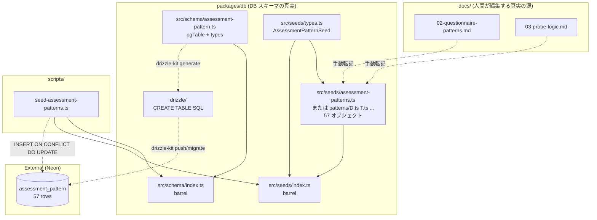
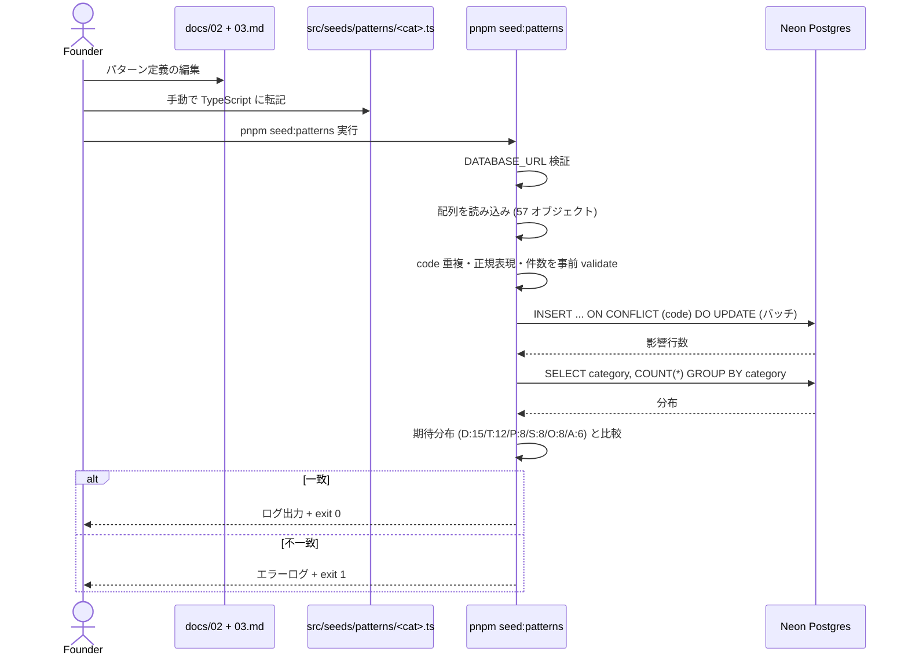
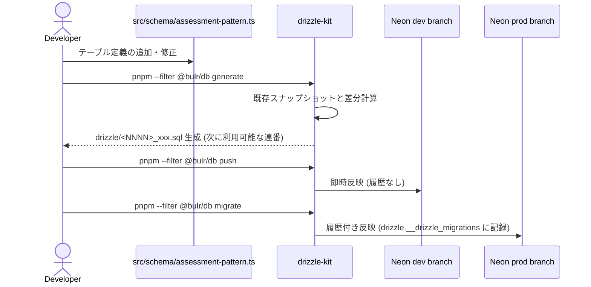
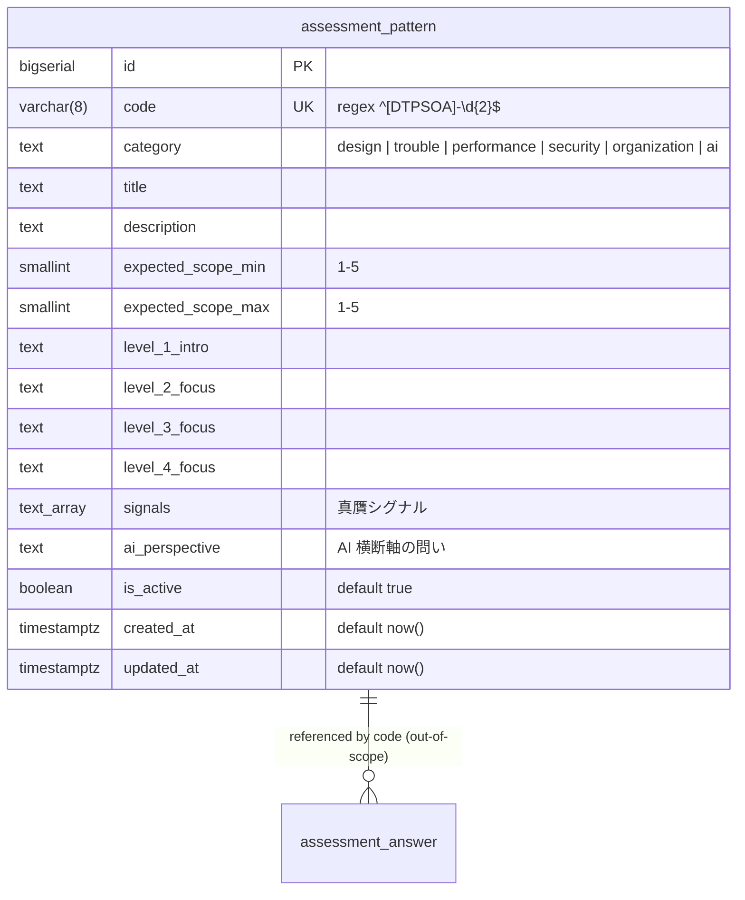

# Design Document: assessment-pattern-seed

## Overview

**Purpose**: bulr の対話型経験問診の中核資産である 6 カテゴリ × 57 状況パターン × 4 段階質問テンプレを、`packages/db` の Drizzle スキーマ + TypeScript シードデータ + 冪等な投入スクリプトとして実体化する。`docs/02-questionnaire-patterns.md` と `docs/03-probe-logic.md` を真実とし、人間がレビュー可能な形で git 管理する。

**Users**:
- bulr 創業者（パターンの追加・改廃を運用する立場）
- `assessment-engine` spec の実装者（`assessment_pattern` テーブルを `selectNextPattern` Tool 経由で読み出す立場）

**Impact**: `monorepo-foundation` で空バレルだった `packages/db/src/schema/index.ts` に最初の実テーブル `assessment_pattern` を追加する。`packages/db/src/seeds/` ディレクトリと `scripts/seed-assessment-patterns.ts` を新設する。ルート `package.json` に `seed:patterns` スクリプトを追加する。

### Goals

- `assessment_pattern` テーブルを Drizzle スキーマで型安全に定義し、`code` をユニークキーとした upsert を可能にする
- 57 パターン（D:15 / T:12 / P:8 / S:8 / O:8 / A:6）の TypeScript シードデータを `AssessmentPatternSeed[]` として保持する
- `pnpm seed:patterns` で dev / production の Neon ブランチへ冪等に投入できる CLI を提供する
- 投入後の件数とカテゴリ分布を assertion し、不一致なら exit code 非ゼロで失敗する
- パターン番号は不変、廃止は `is_active = false` のみで物理削除しない運用ルールをスキーマと運用手順で支える

### Non-Goals

- `assessment_session` / `assessment_answer` / `chat_message` テーブルの定義 → `assessment-engine` spec
- LLM ツール実装（`selectNextPattern` 等）→ `assessment-engine` spec
- 5 次元スコアの評価ロジック → `assessment-engine` spec
- パターン編集 UI、出題統計の可視化 → Stage 2
- 多言語対応（Stage 1 は日本語のみ）
- LLM による Markdown → TypeScript 自動変換（手動転記でレビュー可能性を担保）

## Boundary Commitments

### This Spec Owns

- `packages/db/src/schema/assessment-pattern.ts`: `assessment_pattern` テーブル定義および型 `AssessmentPattern` / `NewAssessmentPattern` のエクスポート
- `packages/db/src/schema/index.ts` への `export * from './assessment-pattern'` 追記
- `packages/db/src/seeds/types.ts`: `AssessmentPatternSeed` 型と `Category` 列挙型および射程列挙
- `packages/db/src/seeds/assessment-patterns.ts`（および分割ファイル `packages/db/src/seeds/patterns/<category>.ts`）: 57 パターンのシードデータ配列
- `packages/db/src/seeds/index.ts`: シードのバレルエクスポート
- `packages/db/drizzle/` 配下に生成される `assessment_pattern` のマイグレーション SQL
- `scripts/seed-assessment-patterns.ts`: tsx で実行する CLI シードスクリプト
- ルート `package.json` の `scripts.seed:patterns` 追加
- `docs/setup/seed.md`: dev / production 投入手順の文書

### Out of Boundary

- `assessment_session` / `assessment_answer` / `chat_message` テーブル → `assessment-engine` spec
- LLM ツール (`selectNextPattern`、`recordAnswer` 等) → `assessment-engine` spec
- `is_active = false` パターンの参照側フィルタロジック → `assessment-engine` spec（本スペックではフラグの保持と運用方針のみ）
- Better Auth 関連テーブル (`user`、`user_profile` 等) → `authentication` spec
- Neon ブランチ作成・接続文字列発行・CI への seed 統合 → `multi-env-infrastructure` spec（本スペックは `DATABASE_URL` を所与とする）
- Markdown ドキュメント (`docs/02-questionnaire-patterns.md`、`docs/03-probe-logic.md`) の編集 → 既存の運用、本スペックでは読むだけ
- `pnpm --filter @bulr/db generate / push / migrate` のコマンド契約自体 → `monorepo-foundation` で確立済み
- パターン編集 UI、出題統計、多言語対応 → Stage 2

### Allowed Dependencies

- 既存 npm パッケージ（`monorepo-foundation` で導入済み）: `drizzle-orm@^0.45`、`drizzle-kit@^0.31`、`pg@^8`、`@types/pg@^8`、`tsx@^4`、`typescript@^5.4`
- 内部 workspace 依存: `@bulr/types`（必要に応じて）
- ホスト環境: Node.js 22 LTS+、pnpm 10+
- 外部サービス: Neon Postgres（`DATABASE_URL` 経由）

### Revalidation Triggers

以下が発生した場合、`assessment-engine` spec は本スペックとの統合を再検証する必要がある:

- `assessment_pattern` のカラム追加・削除・rename（特に `level_1_intro` / `level_2_focus` / `level_3_focus` / `level_4_focus` / `signals` / `ai_perspective` / `expected_scope_min` / `expected_scope_max`）
- `code` の正規表現の変更（現行 `^[DTPSOA]-\d{2}$`）
- カテゴリ分布の変更（現行 D:15 / T:12 / P:8 / S:8 / O:8 / A:6）
- `is_active` のセマンティクス変更（論理休眠 → 物理削除に転換等）
- `signals` カラムのデータ表現変更（text[] vs jsonb vs text）
- シードファイル分割構造の変更（単一ファイル ↔ カテゴリ別分割）
- `pnpm seed:patterns` のコマンド名・引数仕様の変更

## Architecture

### Architecture Pattern & Boundary Map



**Architecture Integration**:

- **Selected pattern**: 「マスタテーブル + TypeScript シード + 冪等 CLI 投入」の標準的なシードパターン。`monorepo-foundation` の `packages/db` 構造をそのまま延長
- **Domain/feature boundaries**: スキーマ定義は `packages/db/src/schema/`、シードデータと型は `packages/db/src/seeds/`、CLI は `scripts/`。三層に分離して責務を明確化
- **Existing patterns preserved**: `monorepo-foundation` の `@bulr/db` バレル構造、snake_case のカラム命名、`drizzle.config.ts` の `casing: 'snake_case'`、scripts ディレクトリの kebab-case 規約を踏襲
- **New components rationale**:
  - `schema/assessment-pattern.ts`: 1 テーブル 1 ファイルの原則。後続 spec で `assessment_session.ts` 等を追加しやすい
  - `seeds/types.ts`: シード形式の型は schema の Drizzle 型と分離する（schema の型は DB 行の表現、シードの型は手書きしやすい正規化形）
  - `seeds/patterns/<category>.ts` 分割: 1 ファイル 2000-3000 行を避け、カテゴリ単位（D / T / P / S / O / A）で分割しレビューを軽量化
  - `scripts/seed-assessment-patterns.ts`: tsx で起動、`@bulr/db` を import して INSERT ... ON CONFLICT を実行
- **Steering compliance**:
  - `tech.md`: Drizzle ORM 0.45.x、TypeScript strict、no `any`、Node.js 22+
  - `structure.md`: snake_case カラム、`assessment_pattern` テーブル名、パターン ID 正規表現 `^[DTPSOA]-\d{2}$`、scripts/ ディレクトリ
  - `assessment-design.md`: 6 カテゴリ × 57 パターン、4 段階深掘り、AI 横断軸、パターン番号不変・論理休眠
  - `evaluation-rubric.md`: 射程は 1-5 の整数、カテゴリ別分布

### Technology Stack

| Layer | Choice / Version | Role in Feature | Notes |
|-------|------------------|-----------------|-------|
| ORM | Drizzle ORM 0.45.x | `pgTable` でテーブル定義、`db.insert().onConflictDoUpdate()` で upsert | `monorepo-foundation` で導入済み |
| Migration | drizzle-kit 0.31.x | `generate` で migration SQL 生成、`push` で dev、`migrate` で prod | `monorepo-foundation` で確立済み |
| Database Driver | pg 8.x (`node-postgres`) | Neon Postgres への接続 | `monorepo-foundation` で導入済み |
| Database | Neon Postgres | dev / production ブランチ | `multi-env-infrastructure` で整備済み |
| Runtime | Node.js 22 LTS+ + tsx 4.x | シードスクリプトの実行 | `monorepo-foundation` で導入済み |
| Type Safety | TypeScript 5.4+（strict、noUncheckedIndexedAccess） | シードデータと CLI の型 | `tsconfig.base.json` 準拠 |
| Validation | （Zod は使わず TypeScript の型と build-time チェックで担保） | シードオブジェクトの形 | Stage 1 では型コンパイル + ランタイム assertion で十分 |

> Zod を runtime 検証に使わない理由: シードは「コードと一緒にコンパイルされる固定データ」であり、TypeScript の型エラーで形不整合は検出可能。runtime 検証は「件数」「カテゴリ分布」「code 重複」「code 正規表現」の数行に絞る。

## File Structure Plan

### Directory Structure

```
bulr-app-mvp/
├── package.json                                       # [MODIFY] scripts.seed:patterns を追加
├── packages/
│   └── db/
│       ├── src/
│       │   ├── schema/
│       │   │   ├── index.ts                           # [MODIFY] export * from './assessment-pattern'
│       │   │   └── assessment-pattern.ts              # [CREATE] pgTable 定義 + types
│       │   ├── seeds/
│       │   │   ├── index.ts                           # [CREATE] barrel
│       │   │   ├── types.ts                           # [CREATE] AssessmentPatternSeed 型
│       │   │   ├── assessment-patterns.ts             # [CREATE] 全 57 を集約 export
│       │   │   └── patterns/
│       │   │       ├── design.ts                      # [CREATE] D-01..D-15 (15 個)
│       │   │       ├── trouble.ts                     # [CREATE] T-01..T-12 (12 個)
│       │   │       ├── performance.ts                 # [CREATE] P-01..P-08 (8 個)
│       │   │       ├── security.ts                    # [CREATE] S-01..S-08 (8 個)
│       │   │       ├── organization.ts                # [CREATE] O-01..O-08 (8 個)
│       │   │       └── ai.ts                          # [CREATE] A-01..A-06 (6 個)
│       │   └── index.ts                               # [MODIFY] export './seeds' を追加
│       └── drizzle/                                   # [GENERATED] drizzle-kit generate の出力
│           ├── <NNNN>_<hash>.sql                      # CREATE TABLE assessment_pattern（次に利用可能な連番、例: 0001 または 0002）
│           └── meta/                                  # snapshot ファイル群
├── scripts/
│   └── seed-assessment-patterns.ts                    # [CREATE] tsx で起動する CLI
└── docs/
    └── setup/
        └── seed.md                                    # [CREATE] dev/prod 投入手順
```

### Modified Files

- `package.json`（ルート）: `scripts.seed:patterns` に `tsx scripts/seed-assessment-patterns.ts` を追加
- `packages/db/src/schema/index.ts`: 既存の空バレル（`export {};`）を `export * from './assessment-pattern';` に置き換え
- `packages/db/src/index.ts`: `export * from './seeds';` を追加（バレル経由で `AssessmentPatternSeed` 型と `assessmentPatternSeeds` 配列に到達可能にする）

> File Structure Plan の各ファイルは「責務 1 つ」の原則を守る。シードファイルはカテゴリ単位で分割し、レビューを「カテゴリ単位の PR」で進められるようにする。

## System Flows

### Markdown → TypeScript → DB のデータフロー



### マイグレーション生成と適用フロー



## Requirements Traceability

| Requirement | Summary | Components | Interfaces | Flows |
|-------------|---------|------------|------------|-------|
| 1.1 | schema ファイル提供 | SchemaPattern | pgTable export | — |
| 1.2 | 全カラム定義 | SchemaPattern | column definitions | — |
| 1.3 | code ユニーク制約 | SchemaPattern | uniqueIndex / .unique() | — |
| 1.4 | code 正規表現の運用前提 | SchemaPattern + SeedTypes + SeedScript | TypeScript型 + ランタイム validate | Markdown → TS → DB |
| 1.5 | is_active デフォルト true | SchemaPattern | boolean('is_active').default(true) | — |
| 1.6 | created_at / updated_at デフォルト now | SchemaPattern | timestamp.defaultNow() | — |
| 1.7 | 型再エクスポート | SchemaIndex + SchemaPattern | barrel export | — |
| 1.8 | snake_case 命名 | SchemaPattern + drizzle.config | casing: 'snake_case' | — |
| 2.1 | generate でマイグレーション生成 | Migration | drizzle-kit generate | マイグレーション生成 |
| 2.2 | 生成 SQL の制約完備 | Migration | CREATE TABLE 文 | — |
| 2.3 | dev に push | Migration | drizzle-kit push | マイグレーション生成 |
| 2.4 | prod に migrate | Migration | drizzle-kit migrate | マイグレーション生成 |
| 2.5 | 冪等な再適用 | Migration | drizzle-kit のスナップショット差分 | マイグレーション生成 |
| 3.1 | AssessmentPatternSeed 型 | SeedTypes | TypeScript type | — |
| 3.2 | 57 オブジェクトの export | SeedAggregate + SeedCategoryFiles | const assessmentPatternSeeds: AssessmentPatternSeed[] | — |
| 3.3 | カテゴリ分布 D:15/T:12/P:8/S:8/O:8/A:6 | SeedCategoryFiles | 各ファイル内オブジェクト数 | — |
| 3.4 | 必須フィールド | SeedTypes + SeedCategoryFiles | type 定義 + データ | — |
| 3.5 | code 正規表現 + 重複なし | SeedScript | 起動時 validate | Markdown → TS → DB |
| 3.6 | code 接頭辞と category 整合 | SeedScript | 起動時 validate | Markdown → TS → DB |
| 3.7 | 射程 min/max 整合 | SeedTypes + SeedScript | type narrowing + validate | Markdown → TS → DB |
| 3.8 | Markdown 忠実転記 | SeedCategoryFiles | 手動転記運用 | Markdown → TS → DB |
| 3.9 | Markdown を正とする運用 | DocSeedSetup | 文書化 | — |
| 3.10 | strict / no any | SeedTypes + SeedCategoryFiles + SeedScript | tsconfig + ESLint | — |
| 4.1 | pnpm seed:patterns | RootPackageJson + SeedScript | scripts エントリ | Markdown → TS → DB |
| 4.2 | DATABASE_URL 検証 | SeedScript | process.env 検証 | Markdown → TS → DB |
| 4.3 | upsert by code | SeedScript | onConflictDoUpdate | Markdown → TS → DB |
| 4.4 | 投入後ログ | SeedScript | console.log + COUNT クエリ | Markdown → TS → DB |
| 4.5 | カテゴリ分布不一致で exit 1 | SeedScript | assertion + process.exit(1) | Markdown → TS → DB |
| 4.6 | 二重実行で同状態 | SeedScript | onConflictDoUpdate | Markdown → TS → DB |
| 4.7 | updated_at 更新 + 上書き | SeedScript | onConflictDoUpdate set 句 | — |
| 4.8 | 削除しない | SeedScript | DELETE を発行しない | — |
| 4.9 | 投入手順の文書化 | DocSeedSetup | docs/setup/seed.md | — |
| 5.1 | 廃止は is_active=false | DocSeedSetup + SchemaPattern | 運用ルール + boolean カラム | — |
| 5.2 | 番号再利用しない | DocSeedSetup | 運用ルール | — |
| 5.3 | オーファンを削除しない | SeedScript | DELETE を発行しない | — |
| 5.4 | オーファン警告 | SeedScript | console.warn | Markdown → TS → DB |
| 5.5 | 参照側フィルタ前提 | （Out of Boundary） | assessment-engine spec が実装 | — |
| 6.1 | @bulr/db バレル import | SchemaIndex + DbIndex | barrel export | — |
| 6.2 | seeds/types バレル import | SeedTypes + SeedIndex + DbIndex | barrel export | — |
| 6.3 | ファイル配置の規約 | （File Structure Plan） | パス配置 | — |
| 6.4 | typecheck 通過 | 全 component | tsconfig + ESLint | — |
| 6.5 | scripts/ 命名 | SeedScript | kebab-case ファイル名 | — |
| 7.1 | 総数 57 を assertion | SeedScript | COUNT(*) 検証 | Markdown → TS → DB |
| 7.2 | カテゴリ別件数 assertion | SeedScript | GROUP BY 検証 | Markdown → TS → DB |
| 7.3 | 不一致で exit 1 | SeedScript | process.exit(1) | Markdown → TS → DB |
| 7.4 | 手動 SELECT で確認可能 | SchemaPattern + SeedCategoryFiles | NOT NULL 列構成 | — |

## Components and Interfaces

### Component Summary

| Component | Domain/Layer | Intent | Req Coverage | Key Dependencies (P0/P1) | Contracts |
|-----------|--------------|--------|--------------|--------------------------|-----------|
| SchemaPattern | DB schema | `assessment_pattern` テーブルの Drizzle 定義と型 | 1.1, 1.2, 1.3, 1.4, 1.5, 1.6, 1.7, 1.8, 2.2 | drizzle-orm@0.45 (P0) | Service |
| SchemaIndex | DB schema barrel | schema を `@bulr/db` から再エクスポート | 1.7, 6.1 | SchemaPattern (P0) | Service |
| Migration | DB migration | `CREATE TABLE assessment_pattern` の SQL | 2.1, 2.2, 2.3, 2.4, 2.5 | drizzle-kit@0.31 (P0)、SchemaPattern (P0) | Batch |
| SeedTypes | Seed types | `AssessmentPatternSeed` 型と関連 enum | 3.1, 3.4, 3.7, 3.10, 6.2 | TypeScript@5.4 (P0) | Service |
| SeedCategoryFiles | Seed data | カテゴリ別のシード配列（D/T/P/S/O/A の 6 ファイル） | 3.2, 3.3, 3.4, 3.8, 3.10 | SeedTypes (P0) | Service |
| SeedAggregate | Seed barrel | 6 カテゴリを連結し `assessmentPatternSeeds` として export | 3.2, 6.2 | SeedCategoryFiles (P0)、SeedTypes (P0) | Service |
| SeedIndex | Seed barrel | `packages/db/src/seeds/index.ts` | 6.1, 6.2 | SeedTypes (P0)、SeedAggregate (P0) | Service |
| DbIndex | Package barrel | `packages/db/src/index.ts` から seeds を再エクスポート | 6.1, 6.2 | SchemaIndex (P0)、SeedIndex (P0) | Service |
| SeedScript | CLI batch | `scripts/seed-assessment-patterns.ts` の冪等投入 | 1.4, 3.5, 3.6, 3.7, 3.10, 4.1, 4.2, 4.3, 4.4, 4.5, 4.6, 4.7, 4.8, 5.3, 5.4, 7.1, 7.2, 7.3 | @bulr/db (P0)、tsx@4 (P0)、drizzle-orm@0.45 (P0) | Batch |
| RootPackageJson | Root config | `scripts.seed:patterns` の追加 | 4.1, 6.5 | tsx@4 (P0) | Service |
| DocSeedSetup | Documentation | dev / prod 投入手順、運用ルール | 3.9, 4.9, 5.1, 5.2 | — | — |

---

### SchemaPattern

| Field | Detail |
|-------|--------|
| Intent | `assessment_pattern` テーブルを Drizzle で定義し、型 `AssessmentPattern` / `NewAssessmentPattern` を export |
| Requirements | 1.1, 1.2, 1.3, 1.4, 1.5, 1.6, 1.7, 1.8, 2.2 |

**Responsibilities & Constraints**

- 主キー `id` は `bigserial` または `uuid` のいずれか。本スペックは `bigserial` を採用（パターンマスタは表示順安定性が重要、UUID は不要、後続 spec の外部キーは `code` を使う）
- `code` は `varchar(8)` 相当 + UNIQUE 制約。値の正規表現 `^[DTPSOA]-\d{2}$` はシード側でランタイム検証
- `category` は Postgres `text` で `'design' | 'trouble' | 'performance' | 'security' | 'organization' | 'ai'` のいずれか（CHECK 制約は drizzle-kit の表現上付与しない、シード側で TypeScript enum で担保）
- `title` は `text NOT NULL`（30〜80 文字想定）
- `description` は `text NOT NULL`（200〜500 文字想定、状況・判断点・見極め・射程をマークダウン風にまとめた本文）
- `expected_scope_min`、`expected_scope_max` は `smallint NOT NULL`、値域 1-5（評価ルーブリックの射程）
- `level_1_intro`、`level_2_focus`、`level_3_focus`、`level_4_focus` は `text NOT NULL`（4 段階の核となる質問テンプレ。複数の質問例を含むため改行を許容）
- `signals` は `text[] NOT NULL`（真贋シグナル文字列の配列。Drizzle の `text('signals').array().notNull().default(sql"'{}'::text[]"`)。1 パターンあたり 3〜10 件想定）
- `ai_perspective` は `text NOT NULL`（AI 横断軸の問い、1〜3 文）
- `is_active` は `boolean NOT NULL DEFAULT true`
- `created_at`、`updated_at` は `timestamptz NOT NULL DEFAULT now()`

**Dependencies**
- External: drizzle-orm@0.45 (P0)
- Outbound: なし（schema は頂点の 1 つ）

**Contracts**: Service [x] / API [ ] / Event [ ] / Batch [ ] / State [ ]

##### Service Interface（Drizzle スキーマ）

```typescript
// packages/db/src/schema/assessment-pattern.ts
import { sql } from 'drizzle-orm';
import {
  pgTable,
  bigserial,
  varchar,
  text,
  smallint,
  boolean,
  timestamp,
} from 'drizzle-orm/pg-core';

export const assessmentPattern = pgTable('assessment_pattern', {
  id: bigserial('id', { mode: 'bigint' }).primaryKey(),
  code: varchar('code', { length: 8 }).notNull().unique(),
  category: text('category').notNull(),
  title: text('title').notNull(),
  description: text('description').notNull(),
  expectedScopeMin: smallint('expected_scope_min').notNull(),
  expectedScopeMax: smallint('expected_scope_max').notNull(),
  level1Intro: text('level_1_intro').notNull(),
  level2Focus: text('level_2_focus').notNull(),
  level3Focus: text('level_3_focus').notNull(),
  level4Focus: text('level_4_focus').notNull(),
  signals: text('signals').array().notNull().default(sql`'{}'::text[]`),
  aiPerspective: text('ai_perspective').notNull(),
  isActive: boolean('is_active').notNull().default(true),
  createdAt: timestamp('created_at', { withTimezone: true }).notNull().defaultNow(),
  updatedAt: timestamp('updated_at', { withTimezone: true }).notNull().defaultNow(),
});

export type AssessmentPattern = typeof assessmentPattern.$inferSelect;
export type NewAssessmentPattern = typeof assessmentPattern.$inferInsert;
```

**Implementation Notes**

- Integration: `monorepo-foundation` の `drizzle.config.ts` の `casing: 'snake_case'` により、TypeScript の camelCase プロパティが SQL の snake_case カラムに自動変換される（drizzle-kit が SQL を生成する際に明示的に snake_case が使われる）
- Validation: `pnpm --filter @bulr/db generate` で生成される SQL が `code VARCHAR(8) NOT NULL UNIQUE`、`is_active BOOLEAN NOT NULL DEFAULT true`、`created_at TIMESTAMPTZ NOT NULL DEFAULT now()` を含むことを確認
- Risks:
  - `text[]` 配列カラムは Postgres 固有。将来 SQLite 等への移植可能性は捨てる（bulr は Neon Postgres 専用）
  - `category` を CHECK 制約付きにすべきか？ → 当面は TypeScript enum + シード時の事前 validate で担保。CHECK 制約を後付けする際は別マイグレーションで対応可

---

### SchemaIndex

| Field | Detail |
|-------|--------|
| Intent | schema バレルから `assessment_pattern` 定義と型を再エクスポート |
| Requirements | 1.7, 6.1 |

**Responsibilities & Constraints**
- 既存の `export {};` を `export * from './assessment-pattern';` に置換
- 後続 spec が新テーブルを追加する際は同様に export を追加していく

##### Service Interface

```typescript
// packages/db/src/schema/index.ts
export * from './assessment-pattern';
```

---

### Migration

| Field | Detail |
|-------|--------|
| Intent | `CREATE TABLE assessment_pattern` を含む SQL を `packages/db/drizzle/` 配下に生成 |
| Requirements | 2.1, 2.2, 2.3, 2.4, 2.5 |

**Responsibilities & Constraints**
- `pnpm --filter @bulr/db generate` で生成される SQL ファイル（`packages/db/drizzle/*_<adjective>_<noun>.sql` の形。連番は drizzle-kit が次に利用可能な番号を採番。例: `0001_<adjective>_<noun>.sql` または `0002_<adjective>_<noun>.sql`）と `meta/_journal.json` および `meta/<n>_snapshot.json` をコミット
- 生成された SQL を **手で書き換えない**（drizzle-kit の差分計算が壊れる）
- 生成後に dev で `push`、production で `migrate` を実行（コマンド契約は `monorepo-foundation` で確立済み）

##### Batch / Job Contract

- Trigger: 開発者の手動実行（`pnpm --filter @bulr/db generate`）
- Input / validation: `packages/db/src/schema/index.ts` の export と既存スナップショット
- Output / destination: `packages/db/drizzle/<seq>_<name>.sql` および `meta/_journal.json`、`meta/<n>_snapshot.json`
- Idempotency & recovery: drizzle-kit が差分計算で冪等。差分なしなら新ファイルを生成しない

**Implementation Notes**

- Validation:
  - 生成 SQL に `code VARCHAR(8) NOT NULL`、`UNIQUE` 制約、`signals TEXT[] NOT NULL DEFAULT '{}'`、`is_active BOOLEAN NOT NULL DEFAULT true`、`created_at TIMESTAMPTZ NOT NULL DEFAULT now()` が含まれること
  - dev ブランチで `push` して `\d assessment_pattern` で構造を目視確認
- Risks: `text[]` 配列のデフォルト値が drizzle-kit のバージョンによって生成 SQL の表現が揺れる可能性 → 必要なら手動マイグレーション SQL を `journal` 経由で追加できるが、本スペックでは drizzle-kit 任せ

---

### SeedTypes

| Field | Detail |
|-------|--------|
| Intent | シードオブジェクトの形（手書きしやすい正規化形）を `AssessmentPatternSeed` として定義 |
| Requirements | 3.1, 3.4, 3.7, 3.10, 6.2 |

**Responsibilities & Constraints**
- 6 カテゴリの判別 union と射程の整数値を型で表現
- DB 行の型 (`AssessmentPattern`) ではなく、シード形式専用の型を独立に定義（`id`、`created_at`、`updated_at` を持たない、`signals` は配列、`is_active` の省略可能）

##### Service Interface

```typescript
// packages/db/src/seeds/types.ts
export const PATTERN_CATEGORIES = [
  'design',
  'trouble',
  'performance',
  'security',
  'organization',
  'ai',
] as const;

export type PatternCategory = (typeof PATTERN_CATEGORIES)[number];

export type ScopeLevel = 1 | 2 | 3 | 4 | 5;

export type AssessmentPatternSeed = {
  code: `${'D' | 'T' | 'P' | 'S' | 'O' | 'A'}-${string}`;
  category: PatternCategory;
  title: string;
  description: string;
  expectedScopeMin: ScopeLevel;
  expectedScopeMax: ScopeLevel;
  level1Intro: string;
  level2Focus: string;
  level3Focus: string;
  level4Focus: string;
  signals: string[];
  aiPerspective: string;
  isActive?: boolean; // default true
};
```

**Implementation Notes**

- Type narrowing: `code` を template literal type で `^[DTP SOA]-\d{2}$` 相当に近づけるが、TypeScript の template literal type では数字の桁数まで強制できないため、シードスクリプトのランタイム検証で正規表現を再チェック
- `isActive` は省略可能。デフォルトは TypeScript レベルでは `undefined`、シードスクリプト側で `?? true` を適用して DB 列の `DEFAULT true` と整合させる

---

### SeedCategoryFiles

| Field | Detail |
|-------|--------|
| Intent | カテゴリ別シード配列（6 ファイル）を提供 |
| Requirements | 3.2, 3.3, 3.4, 3.8, 3.10 |

**Responsibilities & Constraints**
- 1 ファイル 1 カテゴリ、配列をデフォルト export ではなく `export const designSeeds: AssessmentPatternSeed[] = [...]` のような名前付き export
- ファイル名と内容のカテゴリ件数を厳守:
  - `design.ts`: 15 個（D-01..D-15）
  - `trouble.ts`: 12 個（T-01..T-12）
  - `performance.ts`: 8 個（P-01..P-08）
  - `security.ts`: 8 個（S-01..S-08）
  - `organization.ts`: 8 個（O-01..O-08）
  - `ai.ts`: 6 個（A-01..A-06）
- 各オブジェクトは Markdown ドキュメントの該当パターンを忠実に転記
- 1 オブジェクトあたり 30〜50 行を目安、ファイル全体は最大でも 750 行程度（design.ts）

**Implementation Notes**

- 転記の進め方:
  1. `docs/02-questionnaire-patterns.md` から `code` / `title` / `description`（状況・判断点・見極め）/ 射程レンジ（`expectedScopeMin` / `expectedScopeMax`）を取得
  2. `docs/03-probe-logic.md` から `level_1_intro` / `level_2_focus` / `level_3_focus` / `level_4_focus`（各段の核となる質問テンプレ）/ `signals`（真贋シグナル）/ `ai_perspective`（AI 横断軸の問い）を取得
  3. 句読点・改行を保ったまま TypeScript の template literal に転記
- 役割分担: 1 PR で 1 カテゴリ（または最大 2 カテゴリ）を扱うことで、レビューの負荷を分散できる

---

### SeedAggregate

| Field | Detail |
|-------|--------|
| Intent | 6 カテゴリを連結して `assessmentPatternSeeds: AssessmentPatternSeed[]` を提供 |
| Requirements | 3.2, 6.2 |

##### Service Interface

```typescript
// packages/db/src/seeds/assessment-patterns.ts
import type { AssessmentPatternSeed } from './types';
import { designSeeds } from './patterns/design';
import { troubleSeeds } from './patterns/trouble';
import { performanceSeeds } from './patterns/performance';
import { securitySeeds } from './patterns/security';
import { organizationSeeds } from './patterns/organization';
import { aiSeeds } from './patterns/ai';

export const assessmentPatternSeeds: AssessmentPatternSeed[] = [
  ...designSeeds,
  ...troubleSeeds,
  ...performanceSeeds,
  ...securitySeeds,
  ...organizationSeeds,
  ...aiSeeds,
];
```

---

### SeedIndex / DbIndex

| Field | Detail |
|-------|--------|
| Intent | `@bulr/db` から `AssessmentPatternSeed` 型と `assessmentPatternSeeds` 配列に到達可能にする |
| Requirements | 6.1, 6.2 |

##### Service Interface

```typescript
// packages/db/src/seeds/index.ts
export * from './types';
export * from './assessment-patterns';
```

```typescript
// packages/db/src/index.ts
export { db, type DB } from './client';
export * from './schema';
export * from './seeds';
```

---

### SeedScript

| Field | Detail |
|-------|--------|
| Intent | 57 パターンを Neon Postgres に冪等に upsert し、件数とカテゴリ分布を assertion する CLI |
| Requirements | 1.4, 3.5, 3.6, 3.7, 3.10, 4.1, 4.2, 4.3, 4.4, 4.5, 4.6, 4.7, 4.8, 5.3, 5.4, 7.1, 7.2, 7.3 |

**Responsibilities & Constraints**
- tsx で起動（`tsx scripts/seed-assessment-patterns.ts`）
- 起動時に以下を順に実行:
  1. `DATABASE_URL` 環境変数の存在検証（未設定なら exit 1）
  2. `assessmentPatternSeeds` 配列の事前 validate
     - `code` 重複チェック
     - `code` 正規表現 `^[DTPSOA]-\d{2}$` チェック
     - `code` の接頭辞と `category` の整合チェック（D→design / T→trouble / P→performance / S→security / O→organization / A→ai）
     - `expectedScopeMin <= expectedScopeMax` チェック
     - `signals` 非空チェック
  3. 期待件数（合計 57、カテゴリ別 D:15/T:12/P:8/S:8/O:8/A:6）と配列件数の事前 assertion
  4. INSERT ... ON CONFLICT (code) DO UPDATE をバッチ実行
     - `db.insert(assessmentPattern).values(rows).onConflictDoUpdate({...})` を 1 回（または小バッチで分割）
     - `set` 句では `category`、`title`、`description`、`expectedScopeMin`、`expectedScopeMax`、`level1Intro`、`level2Focus`、`level3Focus`、`level4Focus`、`signals`、`aiPerspective`、`updatedAt: new Date()` を更新
     - `is_active` は **更新対象外**（既に `false` に手動設定された運用パターンを再有効化しないため）
  5. 投入後の DB 件数とカテゴリ分布を SELECT で取得
  6. 期待値と一致するか assertion（不一致は exit 1 + ログ）
  7. DB に存在するが配列に存在しない `code`（オーファン）を SELECT で検出 → `WARN: orphan pattern in DB: <code>` を出力（DELETE は実行しない）
  8. 成功なら exit 0、ログに `seeded 57 patterns (D:15, T:12, P:8, S:8, O:8, A:6)` を出力
- DB 接続は `@bulr/db` の `db` インスタンスを再利用（接続プールは終了時に明示 close）

**Dependencies**
- Outbound: @bulr/db (P0)、drizzle-orm@0.45 (P0)
- External: tsx@4 (P0)、Neon Postgres (P0)

**Contracts**: Service [ ] / API [ ] / Event [ ] / Batch [x] / State [ ]

##### Batch / Job Contract

- Trigger: `pnpm seed:patterns` の手動実行（または将来 CI / Vercel postdeploy hook で起動）
- Input / validation: 上記の 8 ステップ
- Output / destination: Neon Postgres `assessment_pattern` テーブル（57 行）と stdout のログ
- Idempotency & recovery:
  - 同一データで複数回実行しても DB 状態は同一（`updated_at` のみ更新）
  - 失敗時は exit code 非ゼロで中断、トランザクション境界は drizzle-orm の `db.transaction()` で 1 つに包む（部分適用を避ける）

##### CLI スケルトン

```typescript
// scripts/seed-assessment-patterns.ts
import { sql } from 'drizzle-orm';
import { db, assessmentPattern, assessmentPatternSeeds } from '@bulr/db';

const EXPECTED_BY_CATEGORY = {
  design: 15,
  trouble: 12,
  performance: 8,
  security: 8,
  organization: 8,
  ai: 6,
} as const;
const EXPECTED_TOTAL = 57;
const CODE_REGEX = /^[DTPSOA]-\d{2}$/;
const CATEGORY_BY_PREFIX = {
  D: 'design',
  T: 'trouble',
  P: 'performance',
  S: 'security',
  O: 'organization',
  A: 'ai',
} as const;

async function main() {
  if (!process.env.DATABASE_URL) {
    console.error('FATAL: DATABASE_URL is required');
    process.exit(1);
  }

  // Step 2-3: pre-validate
  const seen = new Set<string>();
  for (const seed of assessmentPatternSeeds) {
    if (!CODE_REGEX.test(seed.code)) throw new Error(`invalid code: ${seed.code}`);
    if (seen.has(seed.code)) throw new Error(`duplicate code: ${seed.code}`);
    seen.add(seed.code);
    const prefix = seed.code[0] as keyof typeof CATEGORY_BY_PREFIX;
    if (CATEGORY_BY_PREFIX[prefix] !== seed.category) {
      throw new Error(`category/code mismatch: ${seed.code} vs ${seed.category}`);
    }
    if (seed.expectedScopeMin > seed.expectedScopeMax) {
      throw new Error(`scope min>max: ${seed.code}`);
    }
    if (seed.signals.length === 0) {
      throw new Error(`signals empty: ${seed.code}`);
    }
  }
  if (assessmentPatternSeeds.length !== EXPECTED_TOTAL) {
    throw new Error(`seed count ${assessmentPatternSeeds.length} != ${EXPECTED_TOTAL}`);
  }

  // Step 4: upsert in single transaction
  await db.transaction(async (tx) => {
    await tx
      .insert(assessmentPattern)
      .values(
        assessmentPatternSeeds.map((s) => ({
          code: s.code,
          category: s.category,
          title: s.title,
          description: s.description,
          expectedScopeMin: s.expectedScopeMin,
          expectedScopeMax: s.expectedScopeMax,
          level1Intro: s.level1Intro,
          level2Focus: s.level2Focus,
          level3Focus: s.level3Focus,
          level4Focus: s.level4Focus,
          signals: s.signals,
          aiPerspective: s.aiPerspective,
          isActive: s.isActive ?? true,
        }))
      )
      .onConflictDoUpdate({
        target: assessmentPattern.code,
        set: {
          category: sql`excluded.category`,
          title: sql`excluded.title`,
          description: sql`excluded.description`,
          expectedScopeMin: sql`excluded.expected_scope_min`,
          expectedScopeMax: sql`excluded.expected_scope_max`,
          level1Intro: sql`excluded.level_1_intro`,
          level2Focus: sql`excluded.level_2_focus`,
          level3Focus: sql`excluded.level_3_focus`,
          level4Focus: sql`excluded.level_4_focus`,
          signals: sql`excluded.signals`,
          aiPerspective: sql`excluded.ai_perspective`,
          updatedAt: new Date(),
          // is_active は更新しない
        },
      });
  });

  // Step 5-6: post-assertion
  const rows = await db
    .select({ category: assessmentPattern.category, count: sql<number>`count(*)::int` })
    .from(assessmentPattern)
    .groupBy(assessmentPattern.category);
  const dist = Object.fromEntries(rows.map((r) => [r.category, r.count]));
  let ok = true;
  for (const [cat, expected] of Object.entries(EXPECTED_BY_CATEGORY)) {
    if ((dist[cat] ?? 0) !== expected) {
      console.error(`MISMATCH ${cat}: got ${dist[cat] ?? 0}, expected ${expected}`);
      ok = false;
    }
  }
  if (!ok) process.exit(1);

  // Step 7: orphan detection
  const codes = assessmentPatternSeeds.map((s) => s.code);
  const dbCodes = await db.select({ code: assessmentPattern.code }).from(assessmentPattern);
  const orphans = dbCodes.map((r) => r.code).filter((c) => !codes.includes(c));
  for (const o of orphans) console.warn(`WARN: orphan pattern in DB: ${o}`);

  console.log(`seeded ${assessmentPatternSeeds.length} patterns (D:15, T:12, P:8, S:8, O:8, A:6)`);
}

main()
  .then(() => process.exit(0))
  .catch((e) => {
    console.error(e);
    process.exit(1);
  });
```

> 上記はスケルトン。実装時は `@bulr/db` の export と整合させる。

**Implementation Notes**

- Integration: `@bulr/db` から `db` インスタンスと `assessmentPattern` テーブル、`assessmentPatternSeeds` 配列を import。`pg.Pool` の終了は drizzle-orm の暗黙終了に任せる（プロセス終了で OS が回収）
- Validation:
  - dev ブランチで `pnpm seed:patterns` を実行 → 初回 INSERT、2 回目以降 UPDATE のみで件数不変
  - `psql $DATABASE_URL -c 'SELECT category, COUNT(*) FROM assessment_pattern GROUP BY category;'` で D:15/T:12/P:8/S:8/O:8/A:6 を確認
- Risks:
  - `text[]` への INSERT で値のエスケープ漏れ → drizzle-orm が parameterized query で処理するため通常問題なし
  - 大量 INSERT の同期実行で Neon の接続タイムアウトに当たる可能性 → 57 行は十分小さく問題なし。将来パターンが 200+ になった時にバッチ分割を検討

---

### RootPackageJson

| Field | Detail |
|-------|--------|
| Intent | ルート `package.json` に `seed:patterns` スクリプトを追加 |
| Requirements | 4.1, 6.5 |

**Responsibilities & Constraints**
- `scripts.seed:patterns: "tsx scripts/seed-assessment-patterns.ts"` を追加
- ルートの `devDependencies` に `tsx` が無ければ追加（`monorepo-foundation` で `packages/db` 側に入っているはずだが、ルート実行時に必要なら hoisting または明示追加）
- 既存の `dev` / `build` / `typecheck` / `lint` には触れない

##### Service Interface

```jsonc
{
  "scripts": {
    "dev": "turbo run dev",
    "build": "turbo run build",
    "typecheck": "turbo run typecheck",
    "lint": "turbo run lint",
    "seed:patterns": "tsx scripts/seed-assessment-patterns.ts"
  }
}
```

---

### DocSeedSetup

| Field | Detail |
|-------|--------|
| Intent | dev / production 投入手順、Markdown を正とする運用ルール、論理休眠運用を `docs/setup/seed.md` に文書化 |
| Requirements | 3.9, 4.9, 5.1, 5.2 |

**Responsibilities & Constraints**
- セクション構成:
  1. **概要**: assessment_pattern の役割と Markdown ↔ TypeScript の関係
  2. **dev 投入手順**: `.env.local` の `DATABASE_URL` 設定 → `pnpm --filter @bulr/db push` → `pnpm seed:patterns`
  3. **production 投入手順**: 環境変数の切替 → `pnpm --filter @bulr/db migrate` → `pnpm seed:patterns`
  4. **Markdown を正とする運用**: `docs/02-*.md` / `docs/03-*.md` の更新時は同じ PR で TypeScript シードも更新する
  5. **パターン廃止**: `is_active = false` を SQL で手動更新（または将来 admin UI で）。物理削除しない
  6. **新規パターン追加**: 既使用番号は再利用しない。次の連番（例: D-15 まで埋まっていれば D-16）を割り当てる
  7. **トラブルシュート**: カテゴリ件数不一致時の対処、オーファン警告の解釈

---

## Data Models

### Logical Data Model

`assessment_pattern` の 1 テーブルで完結。論理モデル ER（assessment-engine spec で追加されるテーブルとの関係を破線で参考表示）:



### Physical Data Model

- **Storage**: Neon Postgres（dev / production 別ブランチ）
- **Indexes**: `id` PK インデックスと `code` UNIQUE インデックスのみ（57 行のマスタなので追加インデックス不要）
- **Volume**: 57 行 × 平均 2-3 KB = 150 KB 程度。Neon Free プランで余裕
- **Migration**: drizzle-kit が `*_<name>.sql`（次に利用可能な連番、例: `0001` または `0002`）として生成、`packages/db/drizzle/meta/_journal.json` で履歴管理
- **Encoding**: UTF-8（日本語パターン定義のため必須）

### Out of scope（後続 spec で定義）

- `assessment_session.id`、`assessment_answer.pattern_id`（または `pattern_code`）→ `assessment-engine` spec
- `chat_message` → `assessment-engine` spec
- 受験プロファイル別の出題優先度テーブル → 当面は LLM プロンプト + Tool で表現、テーブル化は Stage 2

## Error Handling

### Error Strategy

- **Fail Fast**: シードスクリプトは validation エラーを起動直後に検出して exit 1。トランザクション境界の中で例外が起きれば全体 rollback
- **明示的なログ**: stderr にエラー詳細、stdout に成功サマリ。CI で parse しやすい形式（プレフィックス `FATAL:` `WARN:` `MISMATCH`）
- **冪等性**: upsert + 物理削除なしで何度でも安全に再実行可能

### Error Categories and Responses

- **設定不備（5xx 相当）**: `DATABASE_URL` 未設定 → 起動時 exit 1、`FATAL: DATABASE_URL is required`
- **シードデータ不整合（4xx 相当）**: `code` 重複・正規表現違反・category 不整合・件数不一致 → exit 1、エラーメッセージで該当 code を表示
- **DB 接続失敗**: pg.Pool が接続エラー → 起動時 exit 1、stack trace を出力
- **トランザクション失敗**: upsert 中に制約違反等 → drizzle-orm の例外を catch、rollback、exit 1
- **オーファン検出**: DB に余剰パターンあり → exit 0（成功扱い）+ `WARN:` ログ。手動で `UPDATE assessment_pattern SET is_active=false WHERE code='X-99'` 等の対応を促す

### Monitoring

本スペックでは独立モニタリングを導入しない。`multi-env-infrastructure` で整備された CI / Vercel ログで stdout / stderr を確認する。

## Testing Strategy

### Unit Tests

本スペックでは独立した unit test フレームワークは導入しない（`monorepo-foundation` の方針に準拠）。代わりに以下を「シードスクリプトの起動時 validate」として実装し、それをテストの代替とする:

- `code` 正規表現
- `code` 重複なし
- `code` 接頭辞と `category` の整合
- `expectedScopeMin <= expectedScopeMax`
- `signals` 非空
- 配列件数 === 57

### Integration Tests

シードスクリプト自体が integration test を兼ねる:

- 投入後の `SELECT COUNT(*)` が 57
- 投入後の `SELECT category, COUNT(*) GROUP BY category` が D:15/T:12/P:8/S:8/O:8/A:6
- 二重実行で件数不変、`updated_at` のみ更新

### E2E/UI Tests

UI は本スペックの範囲外のため不要。

### Manual Smoke Tests（本スペックの完了確認）

1. `pnpm --filter @bulr/db generate` でマイグレーションが新規生成され、SQL に `assessment_pattern` の `CREATE TABLE` が含まれる
2. dev ブランチで `pnpm --filter @bulr/db push` 後、`psql $DATABASE_URL -c '\d assessment_pattern'` で全カラムを確認
3. `pnpm seed:patterns` 初回実行で `seeded 57 patterns (D:15, T:12, P:8, S:8, O:8, A:6)` が出力され、exit 0
4. `pnpm seed:patterns` 2 回目実行も exit 0、`SELECT COUNT(*)` が 57 のまま、`updated_at` のみ進む
5. 1 パターンを `UPDATE assessment_pattern SET title = 'tampered' WHERE code = 'D-01';` して再度 `pnpm seed:patterns` を実行 → `title` が元に戻る（上書き挙動の確認）
6. `INSERT INTO assessment_pattern (code, category, ...) VALUES ('D-99', 'design', ...);` でオーファンを作り再実行 → `WARN: orphan pattern in DB: D-99` が出力されるが exit 0
7. 1 パターンの `is_active` を `false` に手動更新後、再度シード実行 → `is_active` が `false` のまま保持される
8. `pnpm --filter @bulr/db typecheck` がエラーなく完了
9. `pnpm --filter @bulr/db lint` がエラーなく完了
10. production ブランチで `pnpm --filter @bulr/db migrate` 後 `pnpm seed:patterns`（環境変数を切り替えて手動実行）

## Security Considerations

- **シークレット管理**: `DATABASE_URL` は `.env.local`（git ignore 済み）または CI / Vercel の環境変数。スクリプト内にハードコードしない
- **SQL injection**: drizzle-orm の parameterized query で根絶。`sql` テンプレートリテラルを使う場面（`excluded.X` 等）は固定文字列のみで動的入力なし
- **データ整合性**: トランザクション境界で 1 つに包むことで、部分投入による中間状態を残さない
- **本番投入の事故防止**: production ブランチへの投入は手動コマンドで明示的に実行する運用（CI 自動投入は Stage 2 で検討）。`docs/setup/seed.md` で「production 投入の前に `\dt assessment_pattern` で既存件数を確認すること」を明記
- **個人情報**: `assessment_pattern` は受験者個人情報を含まない（純粋なマスタデータ）

## Performance & Scalability

- **データ量**: 57 行 × 数 KB = 200 KB 未満。Neon Free プランの容量で十分
- **シード実行時間**: 1 トランザクションで 57 行 INSERT/UPSERT。Neon の往復遅延を含めても 1-2 秒程度を想定
- **将来拡張**: パターン数が数百〜千に増えた場合、シードを 50 件単位のバッチに分割可能。型システムと CLI の構造は変更不要

## Migration Strategy

> **NOTE (連番依存の回避)**: drizzle-kit がインクリメンタルに付ける番号に依存しないよう、本仕様ではファイル名をワイルドカード (`*_<adjective>_<noun>.sql`) で参照する。`authentication` / `assessment-pattern-seed` が並列 wave 2 で実行されるため、最終番号は実行順序に依存する（例: `0001` または `0002`）。`assessment-engine` は Wave 4 のため後発（`0003` または `0004` の可能性）。

- **初回マイグレーション**: `monorepo-foundation` で空スキーマだった状態から本スペックで初の実テーブル `assessment_pattern` を追加。drizzle-kit が `*_<name>.sql`（次に利用可能な連番、例: `0001` または `0002`）として生成
- **既存データなし**: greenfield なので既存データ移行は不要
- **後続 spec との順序**: 本スペックのマイグレーションは `assessment-engine` の `assessment_session` / `assessment_answer` / `chat_message` のマイグレーションより前に適用される（本スペック完了が `assessment-engine` の前提）
- **ロールバック**: drizzle-kit に自動ロールバック機能はないため、必要なら手動で `DROP TABLE assessment_pattern;` を実行（Stage 1 では現実的にロールバックは想定不要）

## Supporting References

- 真実の源: `docs/02-questionnaire-patterns.md`、`docs/03-probe-logic.md`
- steering: `.kiro/steering/assessment-design.md`、`.kiro/steering/evaluation-rubric.md`、`.kiro/steering/structure.md`、`.kiro/steering/tech.md`
- 上流 spec: `.kiro/specs/monorepo-foundation/design.md`、`.kiro/specs/multi-env-infrastructure/design.md`
- brief: `.kiro/specs/assessment-pattern-seed/brief.md`
- 下流 spec（前提）: `assessment-engine`（本スペック完了後に着手）
