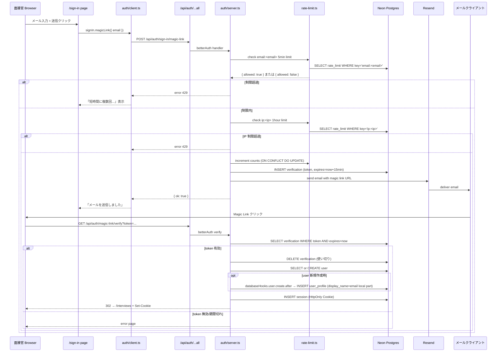
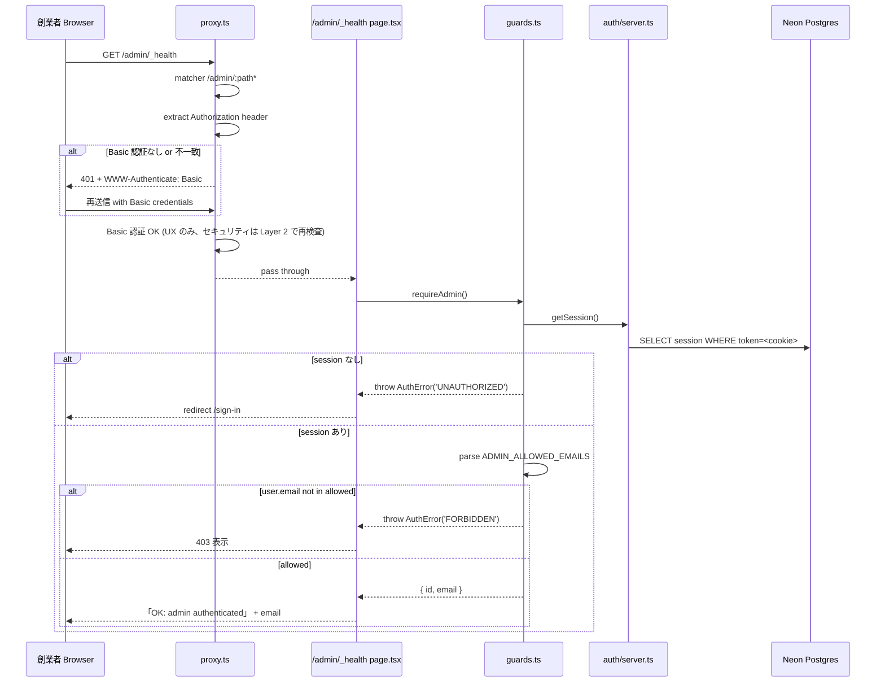
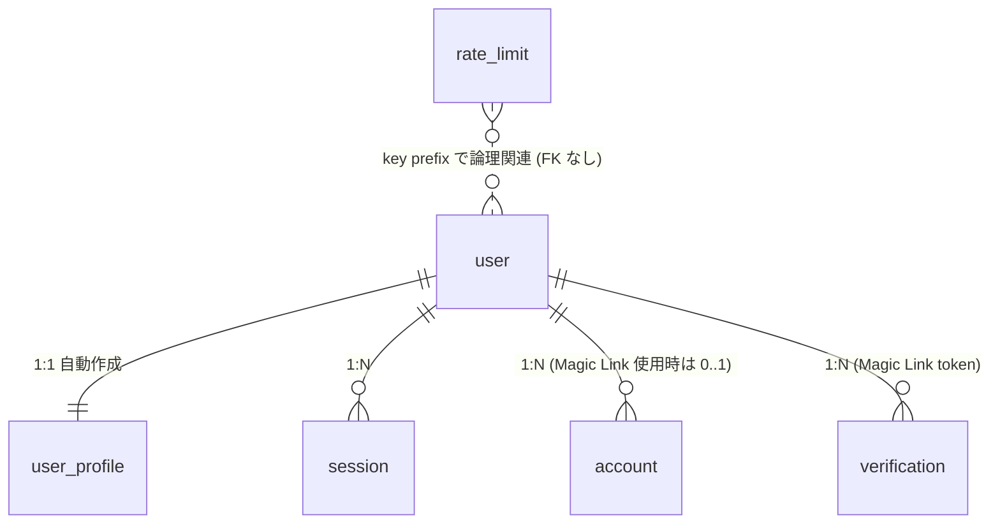

# Design Document — authentication

## Overview

**Purpose**: 本機能は、bulr Stage 1 MVP プロトタイプ（AI 面接アシスタント型）における **2 種類の認証境界** を確立する。Better Auth 1.6.x + Magic Link + Resend で **面接官（interviewer = user）** の Magic Link サインインを提供し、Basic 認証 + `ADMIN_ALLOWED_EMAILS` 二重チェックで **創業者（admin）** の管理画面アクセスを制御する。多層防御（CVE-2025-29927 教訓）に基づき、`proxy.ts` は UX リダイレクトのみを担当し、認可は Server Component / Server Action / API Route の各レイヤーで独立にチェックする。

**Users**: 後続 2 spec（`assessment-engine` / `admin-review-panel`）の実装担当者が利用する。`assessment-engine` は `requireUser()` / `authedAction()` / `requireSessionOwnership()` を使って面接セッション操作の認可を実装し、`user_profile` テーブルから面接官コンテキストを取得する。`admin-review-panel` は `requireAdmin()` / `adminAction()` で管理画面ガードを実装し、本スペックで一時設置する `/admin/_health/` smoke test ページを `/admin/sessions` 実装時に削除する。

**Impact**: `multi-env-infrastructure` 完了時点では認証実装ゼロ・Better Auth 設定なし・proxy.ts なし・Server Action ラッパーなし。本スペックは Better Auth 設定（`apps/web/lib/auth/`）、Resend 統合（`apps/web/lib/email/`）、認証ヘルパー（`apps/web/lib/guards.ts`）、Server Action ラッパー（`apps/web/lib/safe-action.ts`）、proxy.ts、サインイン UI（`/sign-in` / `/admin/login`）、smoke test ページ（`/admin/_health/`）、DB スキーマ（Better Auth テーブル + `user_profile` + `rate_limit`）、Drizzle migration を新規作成する。本スペック完了で、面接官は Magic Link でサインインでき、創業者は Basic 認証 + 許可メール二重チェックで `/admin/*` にアクセスできる状態になる。

### Goals

- Better Auth 1.6.x サーバー / クライアント設定（`apps/web/lib/auth/server.ts` / `client.ts`）を Magic Link プラグイン + 15 分有効期限 + 使い切り + HttpOnly/Secure/SameSite=Lax cookies で確立
- Resend 統合（`apps/web/lib/email/resend.ts`）と日本語+英語並記の Magic Link メールテンプレート（`apps/web/lib/email/templates/magic-link.ts`）を提供
- Better Auth API ルート（`apps/web/app/api/auth/[...all]/route.ts`）を公開
- 認証ヘルパー（`apps/web/lib/guards.ts`）に `AuthError` / `getCurrentUser` / `requireUser` / `requireAdmin` / `requireSessionOwnership` を提供
- Server Action ラッパー（`apps/web/lib/safe-action.ts`）に `authedAction` / `adminAction` を提供（next-safe-action 等のサードパーティ依存なし、自前軽量実装）
- proxy.ts（`apps/web/proxy.ts`）で UX リダイレクト + Basic 認証チェックを実装、JSDoc に CVE-2025-29927 教訓を明記
- サインイン UI（`/sign-in`）と管理画面ログイン UI（`/admin/login`）を提供
- DB スキーマ: Better Auth 管理テーブル（`user` / `session` / `account` / `verification`）+ `user_profile`（面接官プロファイル、user 1:1 FK）+ `rate_limit`（共通レート制限テーブル）
- Better Auth `databaseHooks.user.create.after` で `user_profile` を自動作成
- Magic Link レート制限: メール 3 回/5 分、IP 20 回/時、DB ベース
- Zod 入力検証: メール形式、Basic 認証情報、面接官プロファイル入力
- smoke test ページ `/admin/_health/`（`requireAdmin()` で動作確認、admin-review-panel spec で削除）

### Non-Goals

- 面接セッション作成・進行・完了処理 → `assessment-engine` spec
- 候補者情報入力 UI（`/interviews/new` の本体実装）→ `assessment-engine` spec（本スペックは `/sign-in` までを所有）
- 管理画面の機能 UI（`/admin/sessions`、CSV/JSON エクスポート等）→ `admin-review-panel` spec
- LLM 関数・Whisper 統合 → `assessment-engine` spec
- assessment-engine API レート制限ロジック → `assessment-engine` spec が `rate_limit` テーブルを再利用（key prefix `api:userId:minute` / `turn:sessionId` / `msg:sessionId` / `llm:sessionId`）
- Google OAuth、SSO、Apple Sign-in、パスワード認証 → Stage 2
- 候補者向け認証 → Stage 3
- データエクスポート、アカウント削除フロー → Stage 3
- 監査ログ → Stage 2
- `packages/auth` パッケージ切り出し → Stage 2 で apps/admin 分離時にリファクタ
- Resend カスタムドメイン認証 → Stage 2（Stage 1 は `onboarding@resend.dev` を使用）
- i18n ライブラリ（next-intl 等）→ Stage 2、本スペックは日本語+英語並記単一テンプレート

## Boundary Commitments

### This Spec Owns

- `apps/web/lib/auth/server.ts`（Better Auth サーバー設定 + Magic Link プラグイン + databaseHooks）
- `apps/web/lib/auth/client.ts`（Better Auth クライアント設定）
- `apps/web/lib/auth/schemas.ts`（Zod スキーマ集約: メール、Basic 認証、面接官プロファイル）
- `apps/web/lib/email/resend.ts`（Resend クライアント初期化）
- `apps/web/lib/email/templates/magic-link.ts`（日本語+英語並記の HTML + プレーンテキストメールテンプレート）
- `apps/web/lib/guards.ts`（`AuthError` / `getCurrentUser` / `requireUser` / `requireAdmin` / `requireSessionOwnership`）
- `apps/web/lib/safe-action.ts`（`authedAction` / `adminAction`）
- `apps/web/lib/rate-limit.ts`（DB ベースレート制限ユーティリティ、key prefix で `email:` / `ip:` / `session:` / `api:` / `turn:` / `msg:` / `llm:` を区別）
- `apps/web/app/api/auth/[...all]/route.ts`（Better Auth ハンドラ）
- `apps/web/app/(interviewer)/sign-in/page.tsx`（面接官サインイン UI）
- `apps/web/app/admin/login/page.tsx`（管理画面ログイン案内 UI）
- `apps/web/app/admin/_health/page.tsx`（smoke test ページ、admin-review-panel spec で削除予定）
- `apps/web/proxy.ts`（旧 middleware.ts、UX リダイレクト + Basic 認証チェック、JSDoc に CVE-2025-29927 教訓明記）
- `packages/db/src/schema/auth.ts`（Better Auth 管理テーブル `user` / `session` / `account` / `verification` の Drizzle 定義、独自カラム追加なし）
- `packages/db/src/schema/user-profile.ts`（`user_profile` テーブル定義、user 1:1 FK）
- `packages/db/src/schema/rate-limit.ts`（`rate_limit` テーブル定義、共通レート制限）
- `packages/db/src/schema/index.ts` のバレルエクスポート追加（`auth.ts` / `user-profile.ts` / `rate-limit.ts`）
- Drizzle migration ファイル（`packages/db/drizzle/*_authentication.sql`、ファイル名は drizzle-kit 決定、本スペックでハードコードしない）

### Out of Boundary

- `/interviews/*` ページ本体（一覧 / 新規作成 / 面接中 UI / レポート）→ `assessment-engine` spec
- `/admin/sessions` 等の管理画面機能ページ → `admin-review-panel` spec
- 面接セッション作成 Server Action（`createInterviewSession` 等）→ `assessment-engine` spec が本スペックの `authedAction` を利用
- 面接セッション所有権チェックの実利用（`requireSessionOwnership(session, userId)` の呼び出し側）→ `assessment-engine` spec
- 候補者情報入力フォームと Zod スキーマ → `assessment-engine` spec
- `/api/interview/*` ルートでの認可チェック → `assessment-engine` spec が本スペックの `requireUser()` を利用
- assessment-engine API レート制限の実利用 → `assessment-engine` spec が本スペックの `rate-limit.ts` を `api:` / `turn:` / `msg:` / `llm:` プレフィックスで利用
- 監査ログ → Stage 2
- セキュリティヘッダー（CSP / HSTS / X-Frame-Options 等）の `next.config.ts` 設定 → 関連する後続 spec（`assessment-engine` でマイク CSP 等）
- packages/auth へのリファクタ → Stage 2

### Allowed Dependencies

- **External libraries** (新規追加):
  - `better-auth` ^1.6.0（Magic Link プラグイン同梱）
  - `resend` ^4.0.0（公式 SDK）
  - これらは `apps/web/package.json` の `dependencies` に追加。`packages/auth` は作らないため packages/db 等への横断追加はなし
- **Existing dependencies** (`monorepo-foundation` / `multi-env-infrastructure` 既設):
  - `@bulr/db`（Drizzle ORM 初期化、`db` クライアント）
  - `drizzle-orm` ^0.45.0、`pg` ^8、`drizzle-kit` ^0.31.0
  - `zod` ^4.0.0（Server Action ラッパーと入力検証で利用）
  - `next` 16、`react` 19
- **Environment variables** (`multi-env-infrastructure` 既設):
  - `DATABASE_URL`（Better Auth + Drizzle の DB 接続）
  - `BETTER_AUTH_SECRET`（Better Auth 暗号化キー、必須）
  - `BETTER_AUTH_URL`（Magic Link callback ベース URL）
  - `RESEND_API_KEY`（Resend 配信）
  - `NEXT_PUBLIC_APP_URL`（クライアント側でのベース URL 参照）
  - `ADMIN_ALLOWED_EMAILS`（CSV、許可メールリスト）
  - `ADMIN_BASIC_AUTH_USER` / `ADMIN_BASIC_AUTH_PASSWORD`（Basic 認証情報）
- **制約**: `packages/auth` を作らない（Stage 1）。新規環境変数は追加しない（`multi-env-infrastructure` で確定済みの 12 変数のみ使用）。テストフレームワーク（Vitest 等）は導入しない（手動スモークテストで完了確認）。

### Revalidation Triggers

- Better Auth のメジャーバージョン変更（1.6.x → 2.x 等）→ `apps/web/lib/auth/server.ts` の API 全体を再検証、databaseHooks の API 仕様確認
- Magic Link プラグインの仕様変更（有効期限カスタマイズ方式 / sendMagicLink シグネチャ等）→ サーバー設定とメール送信フローを再検証
- `databaseHooks.user.create.after` のフック仕様変更 → user_profile 自動作成ロジックを再検証
- `user_profile` テーブルにカラム追加（face image / preferences 等）→ `assessment-engine` spec の面接官コンテキスト読み取りを再検証、Drizzle migration を `*_authentication.sql` 後の新 migration で追加
- `rate_limit` テーブルのスキーマ変更（key 構造を変える等）→ `assessment-engine` spec のチャット API レート制限実装を再検証
- proxy.ts → middleware.ts への rename（Next.js 16 → 17 で再変更等）→ `apps/web/proxy.ts` 配置とドキュメント更新
- `ADMIN_ALLOWED_EMAILS` の形式変更（CSV → JSON 配列等）→ `requireAdmin()` の parse ロジックを再検証
- `requireSessionOwnership(session, userId)` の signature 変更 → `assessment-engine` spec の呼び出し全箇所を再検証
- `authedAction` / `adminAction` の戻り値形式変更（`{ ok: false, error }` → 別形式等）→ 全 Server Action 利用側を再検証

## Architecture

### Existing Architecture Analysis

`monorepo-foundation` で apps/web の Next.js 16 + React 19 + Tailwind CSS 4 スケルトンと、`packages/db` の Drizzle ORM クライアント + 空 schema バレルが整備済み。`multi-env-infrastructure` で `.env.example` / `apps/web/.env.local.example` に 12 環境変数が定義済み（本スペック関連: `BETTER_AUTH_SECRET` / `BETTER_AUTH_URL` / `RESEND_API_KEY` / `ADMIN_*`）、`packages/db/drizzle.config.ts` で `DATABASE_URL` 読み取り設定済み、`apps/web/vercel.json` で Cron スケジュール定義済み（本スペックでは触らない）。

`packages/db/src/schema/index.ts` は空バレルで、本スペックが Better Auth テーブル / `user_profile` / `rate_limit` を最初に追加する spec となる（後続 `assessment-pattern-seed` / `assessment-engine` がさらに追加していく）。

参照プロジェクト `dishxdish-app-mvp` が Better Auth 1.6.x + Magic Link + Drizzle で稼働中で、構成を流用可能。ただし dishxdish は匿名セッション + dual-owner CHECK ありで複雑、bulr は Magic Link 必須 + 候補者は別テーブルで管理する v2 構造のため、以下の単純化を適用する:

- 匿名セッション機能（dishxdish の `anon_session`）は **使わない**（候補者は bulr にログインしない、Stage 1 では面接官のみ）
- dual-owner CHECK（`anon_session_id` と `user_id` の片方のみ NOT NULL）は **使わない**（面接官 = user_id 単一スコープ）
- Better Auth の追加プラグイン（OAuth / Apple Sign-in 等）は **使わない**（Magic Link のみ）
- `packages/auth` には **切り出さない**（Stage 1 は apps/web/lib/auth/ に直書き、Stage 2 で apps/admin 分離時にリファクタ）

### Architecture Pattern & Boundary Map

```mermaid
graph TB
    subgraph Browser[面接官 / 創業者の Browser]
        SignInPage[/sign-in<br/>メール入力フォーム]
        AdminLoginPage[/admin/login<br/>Basic 認証案内]
        InterviewerPages[/interviews/*<br/>後続 spec]
        AdminHealthPage[/admin/_health/<br/>本 spec smoke test]
        AdminPages[/admin/sessions/*<br/>後続 spec]
    end

    subgraph ProxyLayer[Layer 1: proxy.ts UX のみ]
        Proxy[apps/web/proxy.ts<br/>Cookie 存在チェック → /sign-in リダイレクト<br/>/admin/* に Basic 認証チェック<br/>JSDoc: CVE-2025-29927 教訓]
    end

    subgraph ServerComponentLayer[Layer 2: Server Component]
        SCPages[各 page.tsx<br/>requireUser / requireAdmin で独立認可]
    end

    subgraph ServerActionLayer[Layer 3: Server Action]
        SAWrappers[safe-action.ts<br/>authedAction / adminAction]
    end

    subgraph APIRouteLayer[Layer 4: API Route]
        BetterAuthAPI[/api/auth/...all<br/>Better Auth handler]
        OtherAPI[他 API Routes<br/>後続 spec が requireUser を呼ぶ]
    end

    subgraph AuthCore[apps/web/lib/auth]
        AuthServer[server.ts<br/>betterAuth init + Magic Link plugin<br/>databaseHooks.user.create.after]
        AuthClient[client.ts<br/>signIn.magicLink / signOut]
        AuthSchemas[schemas.ts<br/>Zod schemas]
    end

    subgraph Guards[apps/web/lib]
        GuardsTs[guards.ts<br/>AuthError / getCurrentUser /<br/>requireUser / requireAdmin /<br/>requireSessionOwnership]
        SafeAction[safe-action.ts<br/>authedAction / adminAction]
        RateLimitTs[rate-limit.ts<br/>checkAndIncrement key prefix]
    end

    subgraph Email[apps/web/lib/email]
        ResendClient[resend.ts<br/>Resend SDK init]
        MagicLinkTpl[templates/magic-link.ts<br/>日本語+英語 HTML+text]
    end

    subgraph DB[packages/db/src/schema]
        AuthTables[auth.ts<br/>user / session / account / verification]
        UserProfile[user-profile.ts<br/>display_name / role_in_org / years_of_experience?]
        RateLimit[rate-limit.ts<br/>key PK / count / window_start]
    end

    subgraph External[外部サービス]
        Resend[Resend Magic Link 配信]
        Neon[Neon Postgres]
    end

    SignInPage --> AuthClient
    AuthClient -->|fetch| BetterAuthAPI
    BetterAuthAPI --> AuthServer
    AuthServer -->|sendMagicLink| ResendClient
    AuthServer -->|databaseHooks| AuthTables
    AuthServer -->|hook| UserProfile
    ResendClient --> MagicLinkTpl
    ResendClient --> Resend

    InterviewerPages -.UX.-> Proxy
    AdminPages -.UX.-> Proxy
    AdminHealthPage -.UX.-> Proxy
    Proxy -->|未認証| SignInPage
    Proxy -->|/admin/* Basic NG| AdminLoginPage

    SCPages --> GuardsTs
    SAWrappers --> GuardsTs
    OtherAPI --> GuardsTs
    GuardsTs --> AuthServer

    AuthServer --> Neon
    AuthTables --> Neon
    UserProfile --> Neon
    RateLimit --> Neon
    RateLimitTs --> RateLimit

    AuthServer -.rate check.-> RateLimitTs
```

**Architecture Integration**:

- **Selected pattern**: 4 層多層認証（proxy.ts → Server Component → Server Action → API Route）。proxy.ts は UX 専任、各 server-side レイヤーで `requireUser` / `requireAdmin` を独立呼び出し。CVE-2025-29927 教訓（middleware の bypass 攻撃）を proxy.ts JSDoc に明記し、認可を proxy.ts に依存しない構造を強制
- **Domain/feature boundaries**: Better Auth は `apps/web/lib/auth/` に閉じ、外部から直接 `auth.api` を呼ばず必ず `lib/guards.ts` 経由で `requireUser` / `requireAdmin` を使う。Server Action は必ず `safe-action.ts` の `authedAction` / `adminAction` でラップ。素の `async function` で Server Action を書かない方針をファイルヘッダコメントで強制
- **Existing patterns preserved**: `monorepo-foundation` の Drizzle スキーマ配置（`packages/db/src/schema/`）、`multi-env-infrastructure` の環境変数規約（12 変数）を維持。`packages/auth` は作らず apps/web/lib/auth/ に直書き
- **New components rationale**: Better Auth は Stage 1 で唯一の認証基盤。Resend は Magic Link 配信に必須。`user_profile` は Better Auth テーブルに独自カラムを追加しない方針の代替（1:1 別テーブル）。`rate_limit` は Vercel Functions のメモリ非共有性に対応する DB ベース実装、後続 spec で再利用するため共通テーブル化
- **Steering compliance**: `tech.md` L73-83（Better Auth 1.6.x + Magic Link + Resend）、`security.md` L25-62（多層認証パターン + 認証ヘルパー + Server Action ラッパー）、`security.md` L237-250（管理画面 Basic + 許可メール二重）、`security.md` L146-152（Magic Link レート制限）、`structure.md` L42-45（apps/web/lib/auth/ 配置 + packages/auth は Stage 1 で作らない）、`structure.md` L181（Better Auth テーブルに独自カラム追加禁止 + user_profile で 1:1 参照）に準拠

### Technology Stack

| Layer              | Choice / Version                               | Role in Feature                                      | Notes                                                                    |
| ------------------ | ---------------------------------------------- | ---------------------------------------------------- | ------------------------------------------------------------------------ |
| Auth Core          | Better Auth 1.6.x                              | Magic Link 認証、セッション管理、databaseHooks       | Magic Link プラグイン同梱、`apps/web/package.json` に追加                |
| Email              | Resend 公式 SDK ^4.0.0                         | Magic Link 配信                                      | `RESEND_API_KEY` 必須、Stage 1 は `onboarding@resend.dev` 送信           |
| Validation         | Zod 4.x（既設）                                | メール / Basic 認証情報 / 面接官プロファイル入力検証 | `apps/web/lib/auth/schemas.ts` に集約                                    |
| DB                 | Drizzle ORM 0.45.x（既設）                     | Better Auth テーブル + user_profile + rate_limit     | `pg` ドライバ、Neon Postgres                                             |
| Migration          | drizzle-kit 0.31.x（既設）                     | スキーマ反映                                         | dev: push、production: generate + migrate、ファイル名は drizzle-kit 決定 |
| Frontend           | Next.js 16 + React 19 + Tailwind CSS 4（既設） | サインイン UI、admin login UI、smoke test ページ     | App Router、Server Components 中心                                       |
| Proxy              | Next.js 16 proxy.ts（旧 middleware.ts）        | UX リダイレクト + Basic 認証チェック                 | `apps/web/proxy.ts`、JSDoc に CVE-2025-29927 教訓明記                    |
| Rate Limit Storage | Neon Postgres（既設）                          | Magic Link メール / IP レート制限                    | DB ベース必須（Vercel Functions メモリ非共有）                           |

## File Structure Plan

### Directory Structure

```
bulr-app-mvp/
├── apps/
│   └── web/
│       ├── proxy.ts                                    # 新規: UX リダイレクト + Basic 認証 + CVE-2025-29927 JSDoc
│       ├── package.json                                # 更新: dependencies に better-auth ^1.6.0, resend ^4.0.0 追加
│       ├── app/
│       │   ├── (interviewer)/
│       │   │   └── sign-in/
│       │   │       └── page.tsx                        # 新規: 面接官サインイン UI
│       │   ├── admin/
│       │   │   ├── login/
│       │   │   │   └── page.tsx                        # 新規: 管理画面ログイン案内 UI
│       │   │   └── _health/
│       │   │       └── page.tsx                        # 新規: smoke test (admin-review-panel spec で削除予定)
│       │   └── api/
│       │       └── auth/
│       │           └── [...all]/
│       │               └── route.ts                    # 新規: Better Auth handler (GET / POST)
│       └── lib/
│           ├── auth/
│           │   ├── server.ts                           # 新規: betterAuth() init + Magic Link plugin + databaseHooks
│           │   ├── client.ts                           # 新規: createAuthClient() + signIn / signOut export
│           │   └── schemas.ts                          # 新規: Zod schemas (email, basicAuth, interviewerProfile)
│           ├── email/
│           │   ├── resend.ts                           # 新規: Resend SDK init
│           │   └── templates/
│           │       └── magic-link.ts                   # 新規: 日本語+英語並記 HTML+plain text
│           ├── guards.ts                               # 新規: AuthError / getCurrentUser / requireUser / requireAdmin / requireSessionOwnership
│           ├── safe-action.ts                          # 新規: authedAction / adminAction
│           └── rate-limit.ts                           # 新規: checkAndIncrement(key, limit, windowMs)
│
└── packages/
    └── db/
        ├── src/
        │   └── schema/
        │       ├── auth.ts                             # 新規: user / session / account / verification (Better Auth 標準スキーマ、独自カラムなし)
        │       ├── user-profile.ts                     # 新規: user_profile テーブル
        │       ├── rate-limit.ts                       # 新規: rate_limit テーブル
        │       └── index.ts                            # 更新: 上記 3 ファイルのバレルエクスポート追加
        └── drizzle/
            └── *_authentication.sql                    # 新規: drizzle-kit generate が決定するファイル名 (例: 0001_<suffix>.sql)
```

### Modified Files

- `apps/web/package.json` — `dependencies` に `better-auth` ^1.6.0 と `resend` ^4.0.0 を追加
- `packages/db/src/schema/index.ts` — `auth.ts` / `user-profile.ts` / `rate-limit.ts` のバレルエクスポート追加
- `packages/db/package.json` — `dependencies` に `nanoid` を追加（Better Auth が user.id 等を生成、`nanoid` を直接使わない場合は省略可、Better Auth デフォルトに従う）

> 各ファイルは単一責務。新規作成: apps/web 配下 11 ファイル + packages/db/src/schema 3 ファイル + drizzle migration（drizzle-kit 自動生成）。更新: `apps/web/package.json`、`packages/db/src/schema/index.ts`。Better Auth 標準スキーマには独自カラムを追加しないため、`auth.ts` は Better Auth が要求する必須カラムのみで構成（drizzle-kit が dishxdish 同等の構造を生成）。

## System Flows

### Magic Link サインインフロー



### 管理画面アクセス（Basic 認証 + 許可メール二重）フロー



## Requirements Traceability

| Requirement | Summary                                               | Components                                          | Interfaces                                  | Flows      |
| ----------- | ----------------------------------------------------- | --------------------------------------------------- | ------------------------------------------- | ---------- |
| 1.1         | Better Auth サーバー設定存在                          | AuthServer                                          | apps/web/lib/auth/server.ts                 | Magic Link |
| 1.2         | Better Auth クライアント設定存在                      | AuthClient                                          | apps/web/lib/auth/client.ts                 | Magic Link |
| 1.3         | Magic Link 15 分有効期限 + 使い切り                   | AuthServer                                          | server.ts plugin config                     | Magic Link |
| 1.4         | HttpOnly + Secure + SameSite=Lax                      | AuthServer                                          | server.ts session config                    | —          |
| 1.5         | BETTER_AUTH_SECRET 必須                               | AuthServer                                          | env var                                     | —          |
| 1.6         | BETTER_AUTH_URL 読み取り                              | AuthServer                                          | env var                                     | Magic Link |
| 1.7         | API ルート公開                                        | BetterAuthApiRoute                                  | apps/web/app/api/auth/[...all]/route.ts     | Magic Link |
| 1.8         | サインイン → Magic Link 送信                          | SignInPage + AuthClient + AuthServer + ResendClient | client.ts                                   | Magic Link |
| 1.9         | リンククリック → セッション開始 + redirect            | AuthServer + BetterAuthApiRoute                     | server.ts                                   | Magic Link |
| 1.10        | 期限切れ/使用済みエラー                               | AuthServer                                          | server.ts                                   | Magic Link |
| 2.1         | Resend クライアント初期化                             | ResendClient                                        | apps/web/lib/email/resend.ts                | Magic Link |
| 2.2         | RESEND_API_KEY 未設定で throw                         | ResendClient                                        | resend.ts                                   | —          |
| 2.3         | 日本語+英語並記テンプレート                           | MagicLinkTemplate                                   | apps/web/lib/email/templates/magic-link.ts  | Magic Link |
| 2.4         | 件名・本文に面接官向けメッセージ + 15 分失効          | MagicLinkTemplate                                   | magic-link.ts                               | —          |
| 2.5         | サインインリンク URL 明示                             | MagicLinkTemplate                                   | magic-link.ts                               | Magic Link |
| 2.6         | 送信元 onboarding@resend.dev (Stage 1)                | ResendClient + MagicLinkTemplate                    | resend.ts                                   | Magic Link |
| 2.7         | sendMagicLink → Resend 配信                           | AuthServer + ResendClient                           | server.ts                                   | Magic Link |
| 2.8         | 個人情報を含まない                                    | MagicLinkTemplate                                   | magic-link.ts                               | —          |
| 3.1         | HttpOnly Cookie                                       | AuthServer                                          | server.ts session config                    | —          |
| 3.2         | Secure 属性 (本番)                                    | AuthServer                                          | server.ts                                   | —          |
| 3.3         | SameSite=Lax                                          | AuthServer                                          | server.ts                                   | —          |
| 3.4         | デフォルト 7 日間                                     | AuthServer                                          | server.ts session.expiresIn                 | —          |
| 3.5         | sliding expiration                                    | AuthServer                                          | server.ts session.updateAge                 | —          |
| 3.6         | サインアウトで cookie 無効化                          | AuthClient + BetterAuthApiRoute                     | client.ts                                   | —          |
| 3.7         | 期限切れ → /sign-in リダイレクト (UX)                 | Proxy                                               | proxy.ts                                    | —          |
| 3.8         | 各レイヤーで requireUser 独立                         | Guards                                              | guards.ts                                   | —          |
| 4.1         | proxy.ts /admin/\* Basic 認証                         | Proxy                                               | proxy.ts                                    | Admin      |
| 4.2         | 401 + WWW-Authenticate                                | Proxy                                               | proxy.ts                                    | Admin      |
| 4.3         | requireAdmin() 二重チェック                           | Guards                                              | guards.ts                                   | Admin      |
| 4.4         | /admin/\* で requireAdmin 必須                        | Guards + 全 admin Server Component                  | guards.ts                                   | Admin      |
| 4.5         | /admin/login UI                                       | AdminLoginPage                                      | apps/web/app/admin/login/page.tsx           | Admin      |
| 4.6         | proxy.ts は session 検証しない                        | Proxy                                               | proxy.ts                                    | —          |
| 4.7         | ADMIN_ALLOWED_EMAILS 未設定で fail secure             | Guards                                              | guards.ts                                   | —          |
| 4.8         | /admin/\_health smoke test                            | AdminHealthPage                                     | apps/web/app/admin/\_health/page.tsx        | Admin      |
| 5.1         | AuthError class                                       | Guards                                              | guards.ts                                   | —          |
| 5.2         | getCurrentUser                                        | Guards                                              | guards.ts                                   | —          |
| 5.3         | requireUser                                           | Guards                                              | guards.ts                                   | —          |
| 5.4         | requireAdmin                                          | Guards                                              | guards.ts                                   | Admin      |
| 5.5         | requireSessionOwnership                               | Guards                                              | guards.ts                                   | —          |
| 5.6         | authedAction                                          | SafeAction                                          | safe-action.ts                              | —          |
| 5.7         | authedAction 内部で requireUser + Zod parse + handler | SafeAction                                          | safe-action.ts                              | —          |
| 5.8         | adminAction                                           | SafeAction                                          | safe-action.ts                              | —          |
| 5.9         | サードパーティ非依存                                  | SafeAction                                          | safe-action.ts                              | —          |
| 5.10        | ファイルヘッダで方針明示                              | SafeAction                                          | safe-action.ts                              | —          |
| 6.1         | proxy.ts ファイル存在                                 | Proxy                                               | apps/web/proxy.ts                           | —          |
| 6.2         | JSDoc に CVE-2025-29927 教訓                          | Proxy                                               | proxy.ts                                    | —          |
| 6.3         | /interviews/\* 未認証で /sign-in                      | Proxy                                               | proxy.ts                                    | —          |
| 6.4         | /admin/\* Basic 認証チェック                          | Proxy                                               | proxy.ts                                    | Admin      |
| 6.5         | /admin/\* Basic NG → 401                              | Proxy                                               | proxy.ts                                    | Admin      |
| 6.6         | /admin/\_health 含めて Basic 必須                     | Proxy                                               | proxy.ts                                    | Admin      |
| 6.7         | matcher 設定                                          | Proxy                                               | proxy.ts config.matcher                     | —          |
| 6.8         | bypass 攻撃でも Layer 2 で防御                        | Guards + 全 Server Component                        | guards.ts                                   | —          |
| 6.9         | proxy.ts は cookie 存在のみ確認                       | Proxy                                               | proxy.ts                                    | —          |
| 7.1         | Better Auth 管理テーブル                              | DbAuthSchema                                        | packages/db/src/schema/auth.ts              | —          |
| 7.2         | user_profile テーブル                                 | DbUserProfileSchema                                 | packages/db/src/schema/user-profile.ts      | —          |
| 7.3         | rate_limit テーブル                                   | DbRateLimitSchema                                   | packages/db/src/schema/rate-limit.ts        | —          |
| 7.4         | バレルエクスポート                                    | DbSchemaIndex                                       | packages/db/src/schema/index.ts             | —          |
| 7.5         | databaseHooks.user.create.after で user_profile 作成  | AuthServer                                          | server.ts                                   | Magic Link |
| 7.6         | hook 失敗時の挙動                                     | AuthServer                                          | server.ts                                   | —          |
| 7.7         | drizzle-kit migration 生成                            | DrizzleMigration                                    | packages/db/drizzle/\*\_authentication.sql  | —          |
| 7.8         | push で 6 テーブル作成                                | DrizzleMigration                                    | drizzle-kit                                 | —          |
| 7.9         | 新規 user で user_profile 自動作成                    | AuthServer                                          | server.ts hook                              | Magic Link |
| 8.1         | email:<email> 5min 3 回チェック                       | RateLimitTs + AuthServer                            | rate-limit.ts                               | Magic Link |
| 8.2         | 制限超過時 UI メッセージ                              | SignInPage + RateLimitTs                            | sign-in/page.tsx                            | Magic Link |
| 8.3         | ip:<ip> 1hour 20 回チェック                           | RateLimitTs + AuthServer                            | rate-limit.ts                               | Magic Link |
| 8.4         | IP 制限超過時 汎用エラー                              | SignInPage + RateLimitTs                            | sign-in/page.tsx                            | Magic Link |
| 8.5         | INSERT ... ON CONFLICT                                | RateLimitTs                                         | rate-limit.ts                               | —          |
| 8.6         | DB ベース必須 (Vercel mem 非共有)                     | RateLimitTs                                         | rate-limit.ts                               | —          |
| 8.7         | クリーンアップ Cron は Stage 2                        | RateLimitTs                                         | コメント                                    | —          |
| 8.8         | 4 回目を Resend に投げない                            | AuthServer + RateLimitTs                            | server.ts                                   | Magic Link |
| 9.1         | メール Zod 検証                                       | AuthSchemas + SafeAction                            | schemas.ts                                  | —          |
| 9.2         | Basic 認証 形式検証                                   | Proxy                                               | proxy.ts                                    | Admin      |
| 9.3         | display_name Zod                                      | AuthSchemas                                         | schemas.ts                                  | —          |
| 9.4         | role_in_org Zod                                       | AuthSchemas                                         | schemas.ts                                  | —          |
| 9.5         | years_of_experience Zod                               | AuthSchemas                                         | schemas.ts                                  | —          |
| 9.6         | Server Action ラッパーで parse                        | SafeAction                                          | safe-action.ts                              | —          |
| 9.7         | スキーマ集約                                          | AuthSchemas                                         | apps/web/lib/auth/schemas.ts                | —          |
| 10.1        | /admin/\_health page.tsx                              | AdminHealthPage                                     | apps/web/app/admin/\_health/page.tsx        | Admin      |
| 10.2        | 成功時に email 表示                                   | AdminHealthPage                                     | page.tsx                                    | Admin      |
| 10.3        | UNAUTHORIZED で /sign-in                              | AdminHealthPage                                     | page.tsx                                    | Admin      |
| 10.4        | FORBIDDEN で 403 表示                                 | AdminHealthPage                                     | page.tsx                                    | Admin      |
| 10.5        | 削除予定コメント                                      | AdminHealthPage                                     | page.tsx                                    | —          |
| 10.6        | 全条件 OK で表示                                      | AdminHealthPage + Guards + Proxy                    | —                                           | Admin      |
| 10.7        | 未サインインで /sign-in                               | AdminHealthPage + Guards                            | guards.ts                                   | Admin      |
| 10.8        | 非許可メールで FORBIDDEN                              | AdminHealthPage + Guards                            | guards.ts                                   | Admin      |
| 11.1        | /sign-in メール入力 UI                                | SignInPage                                          | apps/web/app/(interviewer)/sign-in/page.tsx | Magic Link |
| 11.2        | フォーム送信で signIn.magicLink                       | SignInPage + AuthClient                             | sign-in/page.tsx                            | Magic Link |
| 11.3        | クライアント側 Zod                                    | SignInPage + AuthSchemas                            | sign-in/page.tsx                            | —          |
| 11.4        | レート制限超過 UI                                     | SignInPage                                          | sign-in/page.tsx                            | Magic Link |
| 11.5        | /admin/login UI                                       | AdminLoginPage                                      | apps/web/app/admin/login/page.tsx           | Admin      |
| 11.6        | Basic 後の Magic Link 案内                            | AdminLoginPage                                      | page.tsx                                    | Admin      |
| 11.7        | サインイン済みなら自動 redirect                       | SignInPage + AdminLoginPage                         | client.ts session check                     | —          |

## Components and Interfaces

| Component           | Domain/Layer       | Intent                                                       | Req Coverage                                              | Key Dependencies (P0/P1)                                                                                                          | Contracts      |
| ------------------- | ------------------ | ------------------------------------------------------------ | --------------------------------------------------------- | --------------------------------------------------------------------------------------------------------------------------------- | -------------- |
| AuthServer          | apps/web/lib/auth  | Better Auth サーバー設定 + Magic Link plugin + databaseHooks | 1.1, 1.3-1.10, 2.7, 3.1-3.5, 7.5, 7.6, 7.9, 8.1, 8.3, 8.8 | better-auth ^1.6.0 (P0), DbAuthSchema (P0), ResendClient (P0), MagicLinkTemplate (P0), RateLimitTs (P0), DbUserProfileSchema (P0) | Service, State |
| AuthClient          | apps/web/lib/auth  | Better Auth クライアント                                     | 1.2, 1.8, 3.6, 11.2, 11.7                                 | better-auth client (P0)                                                                                                           | Service        |
| AuthSchemas         | apps/web/lib/auth  | Zod 入力検証集約                                             | 9.1, 9.3-9.5, 9.7, 11.3                                   | zod (P0)                                                                                                                          | State          |
| ResendClient        | apps/web/lib/email | Resend SDK 初期化                                            | 2.1, 2.2, 2.6                                             | resend ^4.0.0 (P0)                                                                                                                | Service        |
| MagicLinkTemplate   | apps/web/lib/email | Magic Link メールテンプレート                                | 2.3, 2.4, 2.5, 2.6, 2.8                                   | (なし、純関数)                                                                                                                    | State          |
| Guards              | apps/web/lib       | 認証ヘルパー全部入り                                         | 3.8, 4.3, 4.7, 5.1-5.5, 6.8, 10.7, 10.8                   | AuthServer (P0)                                                                                                                   | Service        |
| SafeAction          | apps/web/lib       | Server Action ラッパー                                       | 5.6-5.10, 9.6                                             | Guards (P0), zod (P0)                                                                                                             | Service        |
| RateLimitTs         | apps/web/lib       | DB ベースレート制限                                          | 8.1, 8.3, 8.5, 8.6, 8.7                                   | DbRateLimitSchema (P0), drizzle-orm (P0)                                                                                          | Service        |
| BetterAuthApiRoute  | apps/web/app/api   | Better Auth ハンドラ公開                                     | 1.7, 1.9, 1.10, 3.6                                       | AuthServer (P0)                                                                                                                   | API            |
| SignInPage          | apps/web/app       | 面接官サインイン UI                                          | 1.8, 8.2, 8.4, 11.1-11.4, 11.7                            | AuthClient (P0), AuthSchemas (P0)                                                                                                 | State          |
| AdminLoginPage      | apps/web/app/admin | 管理画面ログイン案内                                         | 4.5, 11.5, 11.6, 11.7                                     | (静的ページ)                                                                                                                      | State          |
| AdminHealthPage     | apps/web/app/admin | smoke test ページ                                            | 4.8, 10.1-10.8                                            | Guards (P0)                                                                                                                       | State          |
| Proxy               | apps/web           | UX リダイレクト + Basic 認証                                 | 3.7, 4.1, 4.2, 4.6, 6.1-6.9, 9.2                          | (Next.js proxy.ts API)                                                                                                            | Service        |
| DbAuthSchema        | packages/db        | Better Auth 管理テーブル                                     | 7.1, 7.4, 7.8                                             | drizzle-orm (P0)                                                                                                                  | State          |
| DbUserProfileSchema | packages/db        | user_profile テーブル                                        | 7.2, 7.4, 7.8, 7.9                                        | drizzle-orm (P0), DbAuthSchema (FK) (P0)                                                                                          | State          |
| DbRateLimitSchema   | packages/db        | rate_limit テーブル                                          | 7.3, 7.4, 7.8                                             | drizzle-orm (P0)                                                                                                                  | State          |
| DbSchemaIndex       | packages/db        | バレルエクスポート                                           | 7.4                                                       | DbAuthSchema, DbUserProfileSchema, DbRateLimitSchema (P0)                                                                         | State          |
| DrizzleMigration    | packages/db        | migration ファイル                                           | 7.7, 7.8                                                  | drizzle-kit (P0)                                                                                                                  | Batch          |

### apps/web/lib/auth Layer

#### AuthServer

| Field             | Detail                                                                                                                              |
| ----------------- | ----------------------------------------------------------------------------------------------------------------------------------- |
| Intent            | Better Auth 1.6.x サーバー設定を初期化し、Magic Link プラグイン + databaseHooks + sendMagicLink (Resend) + レート制限を組み合わせる |
| Requirements      | 1.1, 1.3-1.10, 2.7, 3.1-3.5, 7.5, 7.6, 7.9, 8.1, 8.3, 8.8                                                                           |
| Owner / Reviewers | プロジェクトオーナー                                                                                                                |

**Responsibilities & Constraints**

- `betterAuth({ ... })` の initialization 一回のみ、`auth` オブジェクトを singleton として export
- `database` adapter に Drizzle + `db` クライアント（`packages/db`）を渡す
- `secret: process.env.BETTER_AUTH_SECRET`（未設定時は init 時に throw、`security.md` シークレット管理準拠）
- `baseURL: process.env.BETTER_AUTH_URL`
- `session: { expiresIn: 60 * 60 * 24 * 7, updateAge: 60 * 60 * 24, cookieOptions: { httpOnly: true, secure: process.env.NODE_ENV === 'production', sameSite: 'lax' } }`
- `plugins: [magicLink({ expiresIn: 60 * 15, sendMagicLink: async ({ email, url }) => { ... } })]`
- `sendMagicLink` の中でレート制限チェック（`rate-limit.ts` の `checkAndIncrement('email:' + email, { limit: 3, windowMs: 5 * 60 * 1000 })` と `checkAndIncrement('ip:' + ip, { limit: 20, windowMs: 60 * 60 * 1000 })`）。制限超過なら throw（Better Auth が 429 を返す）
- レート制限通過後、`MagicLinkTemplate` でメール内容生成 → `ResendClient.emails.send({ from, to, subject, html, text })`
- `databaseHooks.user.create.after: async ({ user }) => { await db.insert(userProfile).values({ userId: user.id, displayName: user.email.split('@')[0] }) }`
- `auth.api.getSession({ headers })` で Server Component から session 取得可能（Guards から呼ぶ）
- 不変条件: Better Auth 管理テーブルに独自カラムを追加しない、bulr 固有データは `user_profile` 経由

**Dependencies**

- Inbound: `BetterAuthApiRoute` （API handler）（P0）、`Guards` （session 取得）（P0）
- Outbound: `DbAuthSchema` / `DbUserProfileSchema` / `DbRateLimitSchema`（P0）、`ResendClient`（P0）、`MagicLinkTemplate`（P0）、`RateLimitTs`（P0）
- External: `better-auth` ^1.6.0（P0）、Better Auth Magic Link plugin（P0）

**Contracts**: Service, State

##### Service Interface

```typescript
// apps/web/lib/auth/server.ts (概要)
import { betterAuth } from 'better-auth';
import { magicLink } from 'better-auth/plugins';
import { drizzleAdapter } from 'better-auth/adapters/drizzle';
import { db } from '@bulr/db';
import * as authSchema from '@bulr/db/schema/auth';
import { userProfile } from '@bulr/db/schema/user-profile';
import { resend, FROM_ADDRESS } from '../email/resend';
import { renderMagicLinkEmail } from '../email/templates/magic-link';
import { checkAndIncrement } from '../rate-limit';

if (!process.env.BETTER_AUTH_SECRET) throw new Error('BETTER_AUTH_SECRET is not set');
if (!process.env.BETTER_AUTH_URL) throw new Error('BETTER_AUTH_URL is not set');

export const auth = betterAuth({
  secret: process.env.BETTER_AUTH_SECRET,
  baseURL: process.env.BETTER_AUTH_URL,
  database: drizzleAdapter(db, { provider: 'pg', schema: authSchema }),
  session: {
    expiresIn: 60 * 60 * 24 * 7,
    updateAge: 60 * 60 * 24,
    cookieCache: { enabled: true, maxAge: 5 * 60 },
  },
  advanced: {
    cookies: {
      session_token: {
        attributes: {
          httpOnly: true,
          secure: process.env.NODE_ENV === 'production',
          sameSite: 'lax',
        },
      },
    },
  },
  plugins: [
    magicLink({
      expiresIn: 60 * 15,
      sendMagicLink: async ({ email, url }, request) => {
        const ip = request?.headers.get('x-forwarded-for')?.split(',')[0]?.trim() ?? 'unknown';
        await checkAndIncrement('email:' + email, { limit: 3, windowMs: 5 * 60 * 1000 });
        await checkAndIncrement('ip:' + ip, { limit: 20, windowMs: 60 * 60 * 1000 });
        const { html, text, subject } = renderMagicLinkEmail({ url });
        await resend.emails.send({ from: FROM_ADDRESS, to: email, subject, html, text });
      },
    }),
  ],
  databaseHooks: {
    user: {
      create: {
        after: async (user) => {
          await db
            .insert(userProfile)
            .values({
              userId: user.id,
              displayName: user.email.split('@')[0],
            })
            .onConflictDoNothing();
        },
      },
    },
  },
});
```

- Preconditions: `BETTER_AUTH_SECRET` / `BETTER_AUTH_URL` / `RESEND_API_KEY` / `DATABASE_URL` が全て設定済み、DB に Better Auth テーブル + user_profile + rate_limit 反映済み
- Postconditions: `auth` singleton が export され、`/api/auth/[...all]` から利用可能、`auth.api.getSession({ headers })` で session 取得可能
- Invariants: Better Auth 管理テーブルに独自カラムなし、user 作成時に必ず user_profile が作成される（`onConflictDoNothing` で再実行安全）

##### State Management

- State model: Better Auth が user / session / account / verification を管理、bulr 側は user_profile / rate_limit を所有
- Persistence & consistency: Postgres（Neon）。databaseHooks の after は Better Auth のトランザクション境界に従う（Better Auth 1.6.x の仕様確認、失敗時の挙動は research）
- Concurrency strategy: Better Auth 内部のロック / トランザクション。レート制限は `INSERT ... ON CONFLICT` で原子的更新

**Implementation Notes**

- Integration: dishxdish の `apps/web/lib/auth/server.ts` を流用、匿名セッション関連を削除し、databaseHooks に user_profile 作成を追加
- Validation: `pnpm dev` 起動 → `/sign-in` でメール送信 → Resend で受信 → クリック → `/interviews` リダイレクト + DB に user / session / user_profile が作成される
- Risks:
  - Better Auth 1.6.x の `databaseHooks.user.create.after` でエラーが出ると user 作成自体が失敗するか、user は作られて hook だけ失敗するかは Better Auth の仕様確認が必要 → research.md に記録、`onConflictDoNothing` で冪等化して再実行安全に
  - Magic Link plugin の `sendMagicLink` 内で throw した場合、Better Auth は何を返すか → 429 相当のエラーになるか、500 になるか確認

#### AuthClient

| Field        | Detail                                                                 |
| ------------ | ---------------------------------------------------------------------- |
| Intent       | クライアント側の Better Auth 呼び出し（signIn / signOut / useSession） |
| Requirements | 1.2, 1.8, 3.6, 11.2, 11.7                                              |

**Responsibilities & Constraints**

- `createAuthClient({ baseURL: process.env.NEXT_PUBLIC_APP_URL })`
- `magicLinkClient()` プラグイン適用
- `signIn.magicLink({ email, callbackURL: '/interviews' })` を export
- `signOut()` を export
- `useSession()` を export（Client Component 用）

**Dependencies**

- Inbound: `SignInPage`（P0）、`AdminLoginPage`（P0）
- Outbound: `BetterAuthApiRoute`（fetch 経由）（P0）
- External: `better-auth/client`（P0）

**Contracts**: Service

```typescript
// apps/web/lib/auth/client.ts (概要)
import { createAuthClient } from 'better-auth/react';
import { magicLinkClient } from 'better-auth/client/plugins';

export const authClient = createAuthClient({
  baseURL: process.env.NEXT_PUBLIC_APP_URL,
  plugins: [magicLinkClient()],
});

export const { signIn, signOut, useSession } = authClient;
```

**Implementation Notes**

- Integration: dishxdish パターン流用
- Validation: `/sign-in` でフォーム送信 → ブラウザの Network タブで `/api/auth/sign-in/magic-link` への POST が観測される
- Risks: `better-auth/react` の export が 1.6.x で変わる可能性 → ピン止めバージョンを `^1.6.0` で固定

#### AuthSchemas

| Field        | Detail                                               |
| ------------ | ---------------------------------------------------- |
| Intent       | Zod スキーマを `apps/web/lib/auth/schemas.ts` に集約 |
| Requirements | 9.1, 9.3-9.5, 9.7, 11.3                              |

**Responsibilities & Constraints**

- export する schema:
  - `emailSchema = z.string().email().trim().max(254)`
  - `interviewerProfileSchema = z.object({ displayName: z.string().trim().min(1).max(100), roleInOrg: z.string().trim().max(100).optional(), yearsOfExperience: z.number().int().min(0).max(60).optional() })`
- Basic 認証情報の検証は proxy.ts 内のローカル関数（コンポーネント分離する必要なし）

**Contracts**: State (型定義のみ)

### apps/web/lib/email Layer

#### ResendClient

| Field        | Detail                              |
| ------------ | ----------------------------------- |
| Intent       | Resend SDK 初期化と Magic Link 配信 |
| Requirements | 2.1, 2.2, 2.6                       |

**Responsibilities & Constraints**

- `RESEND_API_KEY` を読み取り、未設定なら throw
- `FROM_ADDRESS = 'bulr <onboarding@resend.dev>'` を export（Stage 1、コメントで「Stage 2 でカスタムドメイン」明記）
- `resend = new Resend(process.env.RESEND_API_KEY)` を export

```typescript
// apps/web/lib/email/resend.ts
import { Resend } from 'resend';

if (!process.env.RESEND_API_KEY) {
  throw new Error('RESEND_API_KEY is not set');
}

export const resend = new Resend(process.env.RESEND_API_KEY);

// Stage 1: Resend テストドメイン。Stage 2 でカスタムドメイン認証 (bulr.net) に切り替え
export const FROM_ADDRESS = 'bulr <onboarding@resend.dev>';
```

**Contracts**: Service

#### MagicLinkTemplate

| Field        | Detail                                                                          |
| ------------ | ------------------------------------------------------------------------------- |
| Intent       | 日本語+英語並記の Magic Link メール本文（HTML + プレーンテキスト + 件名）を生成 |
| Requirements | 2.3, 2.4, 2.5, 2.6, 2.8                                                         |

**Responsibilities & Constraints**

- 純関数 `renderMagicLinkEmail({ url }: { url: string }): { subject: string; html: string; text: string }`
- subject: `[bulr] サインインリンク / Sign-in link`
- 日本語ブロックの直後に英語ブロック（`---` 区切り）
- HTML は最低限のインラインスタイル、ボタン要素 `<a href="${url}" style="...">サインイン / Sign in</a>`
- text 版は平文 URL
- 「自分でリクエストしていない場合は無視してください / If you didn't request this, please ignore.」を含む
- 個人情報を含まない（受信者の名前等を埋め込まない、メールアドレスは to: に入るのみ）

**Contracts**: State (純関数、副作用なし)

```typescript
// apps/web/lib/email/templates/magic-link.ts
export function renderMagicLinkEmail({ url }: { url: string }): {
  subject: string;
  html: string;
  text: string;
} {
  const subject = '[bulr] サインインリンク / Sign-in link';
  const text = `bulr へのサインインリンクです（15 分で失効）。

${url}

自分でリクエストしていない場合は、このメールを無視してください。

---

Sign-in link for bulr (expires in 15 minutes).

${url}

If you didn't request this, please ignore this email.
`;
  const html = `<!doctype html><html><body style="font-family: sans-serif; line-height: 1.6;">
    <h2>bulr — AI 面接アシスタント</h2>
    <p>bulr へのサインインリンクです（15 分で失効）。下のボタンをクリックしてサインインしてください。</p>
    <p><a href="${url}" style="display:inline-block; padding:12px 24px; background:#000; color:#fff; text-decoration:none; border-radius:4px;">サインイン</a></p>
    <p>自分でリクエストしていない場合は、このメールを無視してください。</p>
    <hr/>
    <p>Sign-in link for bulr (expires in 15 minutes). Click the button below.</p>
    <p><a href="${url}" style="display:inline-block; padding:12px 24px; background:#000; color:#fff; text-decoration:none; border-radius:4px;">Sign in</a></p>
    <p>If you didn't request this, please ignore this email.</p>
  </body></html>`;
  return { subject, html, text };
}
```

### apps/web/lib Layer (Guards / SafeAction / RateLimit)

#### Guards

| Field        | Detail                                                                                                              |
| ------------ | ------------------------------------------------------------------------------------------------------------------- |
| Intent       | 認証ヘルパー全部入り（`AuthError` / `getCurrentUser` / `requireUser` / `requireAdmin` / `requireSessionOwnership`） |
| Requirements | 3.8, 4.3, 4.7, 5.1-5.5, 6.8, 10.7, 10.8                                                                             |

**Responsibilities & Constraints**

- `AuthError` クラス: `code: 'UNAUTHORIZED' | 'FORBIDDEN' | 'NOT_FOUND'`
- `getCurrentUser()`: `auth.api.getSession({ headers: await headers() })` を呼び、null セーフな `{ id, email } | null` を返す
- `requireUser()`: getCurrentUser で null なら `throw new AuthError('UNAUTHORIZED')`
- `requireAdmin()`: requireUser → email を `ADMIN_ALLOWED_EMAILS?.split(',').map(s => s.trim()).filter(Boolean) ?? []` と比較。配列が空ならすべて拒否（fail secure）
- `requireSessionOwnership(session, userId)`: session が null/undefined なら NOT_FOUND、`session.interviewerId !== userId` なら FORBIDDEN

```typescript
// apps/web/lib/guards.ts (概要)
import { headers } from 'next/headers';
import { auth } from './auth/server';

export class AuthError extends Error {
  constructor(
    public code: 'UNAUTHORIZED' | 'FORBIDDEN' | 'NOT_FOUND',
    message?: string,
  ) {
    super(message ?? code);
  }
}

export async function getCurrentUser(): Promise<{ id: string; email: string } | null> {
  const session = await auth.api.getSession({ headers: await headers() });
  if (!session?.user) return null;
  return { id: session.user.id, email: session.user.email };
}

export async function requireUser() {
  const user = await getCurrentUser();
  if (!user) throw new AuthError('UNAUTHORIZED');
  return user;
}

export async function requireAdmin() {
  const user = await requireUser();
  const allowed =
    process.env.ADMIN_ALLOWED_EMAILS?.split(',')
      .map((s) => s.trim())
      .filter(Boolean) ?? [];
  if (allowed.length === 0 || !allowed.includes(user.email)) {
    throw new AuthError('FORBIDDEN');
  }
  return user;
}

export async function requireSessionOwnership(
  session: { interviewerId: string } | null | undefined,
  userId: string,
) {
  if (!session) throw new AuthError('NOT_FOUND');
  if (session.interviewerId !== userId) throw new AuthError('FORBIDDEN');
}
```

**Contracts**: Service

**Implementation Notes**

- Integration: `security.md` L36-58 の認証ヘルパー仕様にそのまま準拠
- Validation: smoke test ページ `/admin/_health` で `requireAdmin()` を呼び、3 ケース（未サインイン / 非許可メール / 許可メール）で挙動確認
- Risks: `auth.api.getSession` の signature が Better Auth 1.6.x の最新版で変わる可能性 → ピン止めバージョンで固定

#### SafeAction

| Field        | Detail                                                                                       |
| ------------ | -------------------------------------------------------------------------------------------- |
| Intent       | Server Action ラッパー（`authedAction` / `adminAction`）、サードパーティ非依存の自前軽量実装 |
| Requirements | 5.6-5.10, 9.6                                                                                |

**Responsibilities & Constraints**

- `authedAction(schema, handler)`: `requireUser()` → `schema.parse(input)` → `handler(parsed, { userId, email })`、`AuthError` / `ZodError` / `RateLimitError` を捕捉して `{ ok: false, error: { code, message } }` で返す（RateLimitError は `code: 'RATE_LIMITED'`、handler 内で `checkAndIncrement` 呼び出しが throw するため捕捉が必要）
- `adminAction(schema, handler)`: 同様だが `requireAdmin()` を呼ぶ
- 戻り値型: `{ ok: true; data: R } | { ok: false; error: { code: string; message: string } }`
- ファイルヘッダコメントに「すべての mutation はこれらのラッパー経由で実装すること、素の `async function` で Server Action を書かないこと」を明記

```typescript
// apps/web/lib/safe-action.ts (概要)
/**
 * Server Action ラッパー
 *
 * 全ての mutation は authedAction / adminAction でラップすること。
 * 素の `async function` で Server Action を書かない。
 * これは security.md の多層認証パターンに従う標準パターン。
 */
import { ZodError, type ZodSchema } from 'zod';
import { AuthError, requireUser, requireAdmin } from './guards';
import { RateLimitError } from './rate-limit';

type Result<R> = { ok: true; data: R } | { ok: false; error: { code: string; message: string } };

export function authedAction<I, R>(
  schema: ZodSchema<I>,
  handler: (input: I, ctx: { userId: string; email: string }) => Promise<R>,
) {
  return async (rawInput: unknown): Promise<Result<R>> => {
    try {
      const user = await requireUser();
      const input = schema.parse(rawInput);
      const data = await handler(input, { userId: user.id, email: user.email });
      return { ok: true, data };
    } catch (e) {
      if (e instanceof AuthError) return { ok: false, error: { code: e.code, message: e.message } };
      if (e instanceof ZodError)
        return { ok: false, error: { code: 'INVALID_INPUT', message: e.message } };
      if (e instanceof RateLimitError)
        return { ok: false, error: { code: 'RATE_LIMITED', message: e.message } };
      throw e;
    }
  };
}

export function adminAction<I, R>(
  schema: ZodSchema<I>,
  handler: (input: I, ctx: { userId: string; email: string }) => Promise<R>,
) {
  return async (rawInput: unknown): Promise<Result<R>> => {
    try {
      const user = await requireAdmin();
      const input = schema.parse(rawInput);
      const data = await handler(input, { userId: user.id, email: user.email });
      return { ok: true, data };
    } catch (e) {
      if (e instanceof AuthError) return { ok: false, error: { code: e.code, message: e.message } };
      if (e instanceof ZodError)
        return { ok: false, error: { code: 'INVALID_INPUT', message: e.message } };
      if (e instanceof RateLimitError)
        return { ok: false, error: { code: 'RATE_LIMITED', message: e.message } };
      throw e;
    }
  };
}
```

**Contracts**: Service

#### RateLimitTs

| Field        | Detail                                                                                                                 |
| ------------ | ---------------------------------------------------------------------------------------------------------------------- |
| Intent       | DB ベースの汎用レート制限（key prefix で email/ip/session/api/turn/msg/llm を区別、`assessment-engine` spec も再利用） |
| Requirements | 8.1, 8.3, 8.5, 8.6, 8.7                                                                                                |

**Responsibilities & Constraints**

- `checkAndIncrement(key: string, opts: { limit: number; windowMs: number }): Promise<void>` → 制限超過なら throw
- 内部処理: `INSERT ... ON CONFLICT (key) DO UPDATE SET count = CASE WHEN window_start + windowMs > now() THEN count + 1 ELSE 1 END, window_start = CASE WHEN window_start + windowMs > now() THEN window_start ELSE now() END`、その後 SELECT で count を確認、`> limit` なら throw
- key prefix のドキュメント: `email:` / `ip:` / `session:` / `api:` / `turn:` / `msg:` / `llm:` を本ファイルのコメントで列挙、`assessment-engine` spec が `api:` / `turn:` / `msg:` / `llm:` を利用する想定を明記
- in-memory キャッシュは使わない（Vercel Functions メモリ非共有）

```typescript
// apps/web/lib/rate-limit.ts (概要)
/**
 * DB ベースのレート制限。
 *
 * key prefix:
 * - 'email:<email>'           : Magic Link メール送信レート制限 (3/5min) — 本 spec
 * - 'ip:<ip>'                 : Magic Link IP ベースレート制限 (20/hour) — 本 spec
 * - 'session:<userId>:<日付>'   : セッション作成レート制限 (5/day) — assessment-engine spec
 * - 'api:<userId>:minute'     : assessment-engine API レート制限 (30/分)
 * - 'turn:<sessionId>'        : 1 セッション内ターン数 (50, 24h 窓 = 実質セッション累積)
 * - 'msg:<sessionId>'         : 1 セッション内メッセージ数 (200, 24h 窓 = 実質セッション累積)
 * - 'llm:<sessionId>'         : 1 セッション内 LLM 呼び出し数 (100, 24h 窓 = 実質セッション累積)
 *
 * Vercel Functions のメモリ非共有を考慮し、in-memory キャッシュは使わない。
 */
import { db } from '@bulr/db';
import { rateLimit } from '@bulr/db/schema/rate-limit';
import { sql } from 'drizzle-orm';
import { AuthError } from './guards';

export class RateLimitError extends Error {
  constructor(message: string) {
    super(message);
  }
}

export async function checkAndIncrement(
  key: string,
  opts: { limit: number; windowMs: number },
): Promise<void> {
  const result = await db.execute<{ count: number }>(sql`
    INSERT INTO rate_limit (key, count, window_start)
    VALUES (${key}, 1, now())
    ON CONFLICT (key) DO UPDATE SET
      count = CASE
        WHEN rate_limit.window_start + (${opts.windowMs} * INTERVAL '1 millisecond') > now()
        THEN rate_limit.count + 1
        ELSE 1
      END,
      window_start = CASE
        WHEN rate_limit.window_start + (${opts.windowMs} * INTERVAL '1 millisecond') > now()
        THEN rate_limit.window_start
        ELSE now()
      END
    RETURNING count
  `);
  const count = result.rows[0]?.count ?? 0;
  if (count > opts.limit) {
    throw new RateLimitError(`rate limit exceeded for key prefix: ${key.split(':')[0]}`);
  }
}
```

**Contracts**: Service

**Implementation Notes**

- Integration: dishxdish パターンを bulr 用に簡略化
- Validation: `/sign-in` で同じメールに 4 回連続送信 → 4 回目が拒否される、別の IP で同じメールに送信 → IP 制限に達するまで送信可
- Risks: `db.execute` で `INSERT ... ON CONFLICT DO UPDATE ... RETURNING` の構文が Drizzle 0.45.x で動作する形を確認（Drizzle のバージョンによっては `db.execute` の戻り値の型が異なる）

### apps/web/app Layer

#### BetterAuthApiRoute

| Field        | Detail                                             |
| ------------ | -------------------------------------------------- |
| Intent       | Better Auth ハンドラを `/api/auth/[...all]` で公開 |
| Requirements | 1.7, 1.9, 1.10, 3.6                                |

```typescript
// apps/web/app/api/auth/[...all]/route.ts
import { auth } from '@/lib/auth/server';
import { toNextJsHandler } from 'better-auth/next-js';

export const { GET, POST } = toNextJsHandler(auth);
```

**Contracts**: API

#### SignInPage

| Field        | Detail                         |
| ------------ | ------------------------------ |
| Intent       | 面接官サインイン UI            |
| Requirements | 1.8, 8.2, 8.4, 11.1-11.4, 11.7 |

**Responsibilities & Constraints**

- Server Component でサインイン済み（`getCurrentUser()` 非 null）なら `/interviews` へ redirect
- 未サインインならクライアント Component（`'use client'`）でフォーム表示
- フォーム送信時に `signIn.magicLink({ email, callbackURL: '/interviews' })` 呼び出し
- クライアント側で Zod バリデーション（`emailSchema.safeParse(email)`）
- 成功時に「メールを送信しました」表示、失敗時にエラーメッセージ
- レート制限エラー（429 / RateLimitError）を識別して「短時間に複数回...」表示

**Contracts**: State

#### AdminLoginPage

| Field        | Detail                                                         |
| ------------ | -------------------------------------------------------------- |
| Intent       | 管理画面ログイン案内（Basic 認証通過後にアクセスされるページ） |
| Requirements | 4.5, 11.5, 11.6, 11.7                                          |

**Responsibilities & Constraints**

- Basic 認証通過済み（proxy.ts が pass through した）状態のため、Basic 認証ダイアログは出ない
- 「Basic 認証通過 OK。次に管理者メールアドレスで Magic Link サインインしてください」表示
- `/sign-in?redirect=/admin/_health` へのリンク
- サインイン済みなら `/admin/_health` へ自動 redirect

**Contracts**: State

#### AdminHealthPage

| Field        | Detail                                                |
| ------------ | ----------------------------------------------------- |
| Intent       | smoke test ページ、admin-review-panel spec で削除予定 |
| Requirements | 4.8, 10.1-10.8                                        |

**Responsibilities & Constraints**

- ファイル冒頭コメント: 「本ページは authentication spec の smoke test 用に一時設置。admin-review-panel spec で `/admin/sessions` を実装した時点で削除する」
- Server Component で `requireAdmin()` 呼び出し
- 成功時に「OK: admin authenticated」+ `<email>` を `<pre>` で表示
- `AuthError('UNAUTHORIZED')` は `redirect('/sign-in')` で誘導
- `AuthError('FORBIDDEN')` は HTTP 403 相当の表示（カスタム error.tsx でなくページ内で `<p>FORBIDDEN: ...</p>` を返す形でも可）

```typescript
// apps/web/app/admin/_health/page.tsx
/**
 * smoke test (authentication spec).
 * admin-review-panel spec で /admin/sessions を実装した時点で削除する。
 */
import { redirect } from 'next/navigation';
import { AuthError, requireAdmin } from '@/lib/guards';

export default async function AdminHealthPage() {
  try {
    const user = await requireAdmin();
    return (
      <main style={{ padding: 24, fontFamily: 'monospace' }}>
        <h1>OK: admin authenticated</h1>
        <pre>{user.email}</pre>
      </main>
    );
  } catch (e) {
    if (e instanceof AuthError && e.code === 'UNAUTHORIZED') redirect('/sign-in');
    if (e instanceof AuthError && e.code === 'FORBIDDEN') {
      return (
        <main style={{ padding: 24, color: 'crimson' }}>
          <h1>FORBIDDEN</h1>
          <p>あなたのメールアドレスは管理者として登録されていません。</p>
        </main>
      );
    }
    throw e;
  }
}
```

**Contracts**: State

### apps/web/proxy.ts

#### Proxy

| Field        | Detail                                                                   |
| ------------ | ------------------------------------------------------------------------ |
| Intent       | UX リダイレクト + Basic 認証チェック、CVE-2025-29927 教訓を JSDoc に明記 |
| Requirements | 3.7, 4.1, 4.2, 4.6, 6.1-6.9, 9.2                                         |

**Responsibilities & Constraints**

- ファイル冒頭の JSDoc コメント:
  ```
  /**
   * proxy.ts (旧 middleware.ts、Next.js 16 で rename)
   *
   * このファイルは UX リダイレクトと管理画面 Basic 認証チェックのみを担当する。
   *
   * CVE-2025-29927 (2025 年に発覚した Next.js middleware bypass 攻撃) の教訓により、
   * 認可は本ファイルに依存してはならない。各 Server Component / Server Action / API Route で
   * requireUser() / requireAdmin() を独立に呼び出して判定すること。
   *
   * 本ファイルがやること:
   *   - /interviews/* に Cookie が無ければ /sign-in へ UX リダイレクト
   *   - /admin/* に Authorization ヘッダーがなければ 401 + WWW-Authenticate
   *
   * 本ファイルがやらないこと:
   *   - Better Auth セッションの validation (Server Component の requireUser に委ねる)
   *   - ADMIN_ALLOWED_EMAILS の検査 (requireAdmin に委ねる)
   *   - Server Action / API Route の認可
   */
  ```
- `/admin/*` のチェック:
  - `Authorization` header の形式 `^Basic \s+(\S+)$` を検証
  - base64 デコード → `user:password` 形式を検証
  - `ADMIN_BASIC_AUTH_USER` / `ADMIN_BASIC_AUTH_PASSWORD` と timing-safe 比較（簡易には `===` で OK、Stage 1）
  - 不一致なら 401 + `WWW-Authenticate: Basic realm="bulr admin"`
- `/interviews/*` のチェック:
  - Better Auth の session cookie 名（例: `better-auth.session_token`）の存在のみ確認
  - 無ければ `/sign-in` へ redirect（`redirect=` クエリで戻り先保存可、Stage 1 では省略可）
- `config.matcher`:
  ```typescript
  export const config = { matcher: ['/interviews/:path*', '/admin/:path*'] };
  ```
- `/admin/_health/` も `/admin/*` matcher に含まれるため Basic 認証必須

```typescript
// apps/web/proxy.ts (概要)
/**
 * proxy.ts (旧 middleware.ts、Next.js 16 で rename)
 * ... (上記 JSDoc)
 */
import { NextResponse, type NextRequest } from 'next/server';

const SESSION_COOKIE = 'better-auth.session_token'; // Better Auth の cookie 名

export function proxy(request: NextRequest) {
  const { pathname } = request.nextUrl;

  if (pathname.startsWith('/admin')) {
    const auth = request.headers.get('authorization');
    if (!auth?.startsWith('Basic ')) {
      return new NextResponse('Authentication required', {
        status: 401,
        headers: { 'WWW-Authenticate': 'Basic realm="bulr admin"' },
      });
    }
    const decoded = Buffer.from(auth.slice(6), 'base64').toString('utf-8');
    const [user, ...rest] = decoded.split(':');
    const password = rest.join(':');
    if (
      !user ||
      !password ||
      user !== process.env.ADMIN_BASIC_AUTH_USER ||
      password !== process.env.ADMIN_BASIC_AUTH_PASSWORD
    ) {
      return new NextResponse('Invalid credentials', {
        status: 401,
        headers: { 'WWW-Authenticate': 'Basic realm="bulr admin"' },
      });
    }
    return NextResponse.next();
  }

  if (pathname.startsWith('/interviews')) {
    const cookie = request.cookies.get(SESSION_COOKIE);
    if (!cookie) {
      const url = request.nextUrl.clone();
      url.pathname = '/sign-in';
      return NextResponse.redirect(url);
    }
  }

  return NextResponse.next();
}

export const config = { matcher: ['/interviews/:path*', '/admin/:path*'] };
```

> Next.js 16 で middleware の export 名が `middleware` から `proxy` に変わる方針に従う。仮に `middleware` のままの場合は本ファイル名と export 名を `middleware.ts` / `middleware` に戻す（`tech.md` および `structure.md` の表記に従う）。

**Contracts**: Service

### packages/db/src/schema Layer

#### DbAuthSchema

| Field        | Detail                                                                                                   |
| ------------ | -------------------------------------------------------------------------------------------------------- |
| Intent       | Better Auth 管理テーブル（user / session / account / verification）を Drizzle で定義、独自カラム追加なし |
| Requirements | 7.1, 7.4, 7.8                                                                                            |

**Responsibilities & Constraints**

- Better Auth 1.6.x の標準スキーマに従う（公式ドキュメントの schema 例をそのまま流用）
- 主要カラム:
  - `user`: `id text PK`, `email text UNIQUE NOT NULL`, `email_verified boolean DEFAULT false`, `name text`, `image text`, `created_at`, `updated_at`
  - `session`: `id text PK`, `user_id text REFERENCES user(id) ON DELETE CASCADE`, `token text UNIQUE`, `expires_at timestamp`, `created_at`, `updated_at`, `ip_address text`, `user_agent text`
  - `account`: `id text PK`, `user_id text REFERENCES user(id)`, `provider_id text`, `account_id text`, `password text`（Magic Link では未使用、null）, ...
  - `verification`: `id text PK`, `identifier text`, `value text`, `expires_at timestamp`, `created_at`, `updated_at`
- 独自カラムを追加しない（bulr 固有データは user_profile）

**Contracts**: State

> **Note**: 完全なスキーマ定義は Better Auth 1.6.x の公式 [schema docs](https://www.better-auth.com/docs) に従う。実装時に最新の標準スキーマを参照、本デザインで詳細を固めない（Better Auth が schema を定義する側のため）。

#### DbUserProfileSchema

| Field        | Detail                            |
| ------------ | --------------------------------- |
| Intent       | 面接官プロファイル（user 1:1 FK） |
| Requirements | 7.2, 7.4, 7.8, 7.9                |

```typescript
// packages/db/src/schema/user-profile.ts
import { pgTable, text, integer, timestamp } from 'drizzle-orm/pg-core';
import { user } from './auth';

export const userProfile = pgTable('user_profile', {
  userId: text('user_id')
    .primaryKey()
    .references(() => user.id, { onDelete: 'cascade' }),
  displayName: text('display_name').notNull(),
  roleInOrg: text('role_in_org'),
  yearsOfExperience: integer('years_of_experience'),
  createdAt: timestamp('created_at', { withTimezone: true }).notNull().defaultNow(),
  updatedAt: timestamp('updated_at', { withTimezone: true }).notNull().defaultNow(),
});

export type UserProfile = typeof userProfile.$inferSelect;
export type NewUserProfile = typeof userProfile.$inferInsert;
```

**Contracts**: State

#### DbRateLimitSchema

| Field        | Detail                                                             |
| ------------ | ------------------------------------------------------------------ |
| Intent       | 共通レート制限テーブル、key prefix で email/ip/session/chat を区別 |
| Requirements | 7.3, 7.4, 7.8                                                      |

```typescript
// packages/db/src/schema/rate-limit.ts
import { pgTable, text, integer, timestamp } from 'drizzle-orm/pg-core';

export const rateLimit = pgTable('rate_limit', {
  key: text('key').primaryKey(), // 例: 'email:foo@bar.com', 'ip:1.2.3.4', 'api:<userId>:minute', 'turn:<sessionId>'
  count: integer('count').notNull().default(0),
  windowStart: timestamp('window_start', { withTimezone: true }).notNull().defaultNow(),
});

export type RateLimit = typeof rateLimit.$inferSelect;
export type NewRateLimit = typeof rateLimit.$inferInsert;
```

**Contracts**: State

#### DbSchemaIndex

| Field        | Detail                 |
| ------------ | ---------------------- |
| Intent       | バレルエクスポート更新 |
| Requirements | 7.4                    |

```typescript
// packages/db/src/schema/index.ts (本 spec で追加する行)
export * from './auth';
export * from './user-profile';
export * from './rate-limit';
```

**Contracts**: State

#### DrizzleMigration

| Field        | Detail                             |
| ------------ | ---------------------------------- |
| Intent       | drizzle-kit migration ファイル生成 |
| Requirements | 7.7, 7.8                           |

**Responsibilities & Constraints**

- 開発時: `pnpm --filter @bulr/db push`（dev branch DATABASE_URL に対して、スキーマ反映のみ、ファイル生成なし）
- 本番反映時: `pnpm --filter @bulr/db generate` で `packages/db/drizzle/<番号>_<suffix>.sql` を生成 → git コミット → レビュー → `pnpm --filter @bulr/db migrate`（production branch DATABASE_URL）
- 番号 `<番号>` は drizzle-kit が決定（例: `0001_<suffix>.sql`）。本スペックでハードコードしない、`packages/db/drizzle/*_authentication.sql` の glob で参照
- 6 テーブル（user / session / account / verification / user_profile / rate_limit）が一括で 1 ファイル（または複数ファイル）に生成される、実際の構成は drizzle-kit に委ねる

**Contracts**: Batch

## Data Models

### Domain Model



- **`user` (Better Auth 所有)**: 面接官のアイデンティティ。email がユニーク。Magic Link サインインの主体
- **`user_profile` (bulr 所有)**: 面接官固有データ。user_id 1:1 FK、`databaseHooks.user.create.after` で自動作成
- **`session` (Better Auth 所有)**: HttpOnly Cookie に入る session token
- **`account` (Better Auth 所有)**: Magic Link では provider='magic-link' で 1 件作成（または passwordless で 0 件、Better Auth 仕様に従う）
- **`verification` (Better Auth 所有)**: Magic Link token、15 分有効、使用後即削除
- **`rate_limit` (bulr 所有)**: key (PK) + count + window_start。FK は持たない。key prefix で email/ip/session/chat を論理区別

### Logical Data Model

| Table        | Owner       | Key                                            | Notes                                                                                                   |
| ------------ | ----------- | ---------------------------------------------- | ------------------------------------------------------------------------------------------------------- |
| user         | Better Auth | id (PK), email (UNIQUE)                        | bulr で独自カラム追加禁止                                                                               |
| session      | Better Auth | id (PK), user_id (FK), token (UNIQUE)          | HttpOnly Cookie 名: `better-auth.session_token`                                                         |
| account      | Better Auth | id (PK), user_id (FK), provider_id, account_id | Magic Link は password 不要                                                                             |
| verification | Better Auth | id (PK), identifier, expires_at                | Magic Link token、15 分                                                                                 |
| user_profile | bulr        | user_id (PK + FK to user.id ON DELETE CASCADE) | display_name (NOT NULL), role_in_org? (NULL OK), years_of_experience? (NULL OK), created_at, updated_at |
| rate_limit   | bulr        | key (PK)                                       | count (default 0), window_start (default now())                                                         |

### Physical Data Model (Postgres)

- 全テーブルが Neon Postgres の `dev` / `production` ブランチに存在
- インデックス: Better Auth 標準（user.email UNIQUE は自動）、user_profile.user_id PK は自動、rate_limit.key PK は自動。追加インデックスは Stage 1 では作らない
- 制約:
  - `user_profile.user_id` → `user.id` ON DELETE CASCADE（user 削除時に profile も削除）
  - `session.user_id` → `user.id` ON DELETE CASCADE
- パーティショニング: なし（Stage 1 規模では不要）

### Data Contracts & Integration

- **Better Auth API レスポンス**: Better Auth 1.6.x 仕様に従う、本スペックでカスタム DTO を定義しない
- **Server Action 戻り値型**: `{ ok: true; data: R } | { ok: false; error: { code: string; message: string } }`（`safe-action.ts` で統一）
- **`requireSessionOwnership` 入力型**: `{ interviewerId: string } | null | undefined`（`assessment-engine` spec の `interview_session` レコードの構造に合わせる、本スペックでは構造的型として受け取る）

## Error Handling

### Error Strategy

- **`AuthError`** (`UNAUTHORIZED` / `FORBIDDEN` / `NOT_FOUND`): Server Component / Server Action / API Route 内で throw、Server Action ラッパーが捕捉して `{ ok: false, error }` 形式で返す。Server Component では呼び出し側（`/admin/_health/page.tsx` など）が try/catch して redirect or 表示
- **`RateLimitError`** (`apps/web/lib/rate-limit.ts`): Magic Link 送信時の超過。Better Auth の `sendMagicLink` 内で throw → Better Auth が 429 相当の HTTP レスポンスを返す → クライアント側が認識して UI 表示
- **`ZodError`**: 入力検証失敗。Server Action ラッパーが捕捉して `{ ok: false, error: { code: 'INVALID_INPUT' } }` で返す
- **Better Auth 内部エラー**: Better Auth が標準的な HTTP ステータス（400 / 401 / 429 / 500）を返す。本スペックではカスタムハンドリングしない

### Error Categories and Responses

- **User Errors (4xx)**:
  - `401`: proxy.ts の Basic 認証失敗、Better Auth の未認証 API
  - `403`: requireAdmin で許可メール外
  - `429`: Magic Link レート制限超過
- **System Errors (5xx)**:
  - `500`: Better Auth 内部エラー、DB 接続失敗、Resend 配信失敗
  - 本スペックではログのみ（Vercel ダッシュボード）、Stage 2 で Sentry 統合
- **Business Logic Errors**:
  - 期限切れ Magic Link → Better Auth 標準エラーページ（カスタムなし）
  - 使用済み Magic Link → 同上

### Monitoring

- Stage 1 は Vercel ダッシュボード（Logs）で手動確認
- Better Auth のログは `console.log` で出力、Vercel が capture
- レート制限の発火頻度は `rate_limit` テーブルの `count` を SQL で確認（Stage 1 は手動、Stage 2 で監視ダッシュボード）

## Testing Strategy

### Manual Smoke Test Items

1. **`pnpm dev` 起動 + `/sign-in` 表示**
   - `pnpm dev` 後、`http://localhost:3000/sign-in` でメール入力フォームが表示される
   - Requirements: 1.1, 1.2, 11.1

2. **Magic Link 送信 → 受信 → クリック → サインイン成功**
   - 自分のメールアドレスを入力して送信 → Resend からメール受信（送信元 `onboarding@resend.dev`、件名 `[bulr] サインインリンク / Sign-in link`、日本語+英語並記）→ リンクをクリック → `/interviews` にリダイレクト
   - DB 確認: `SELECT * FROM user`、`SELECT * FROM session`、`SELECT * FROM user_profile WHERE user_id=...` で 3 レコードが作成されている
   - Requirements: 1.3, 1.7-1.9, 2.3-2.7, 7.5, 7.9

3. **Magic Link 期限切れ**
   - 16 分後にリンククリック → エラー表示
   - Requirements: 1.10

4. **Magic Link 使い切り**
   - 同じリンクを 2 回クリック → 2 回目はエラー
   - Requirements: 1.3, 1.10

5. **メール 5 分間 3 回制限**
   - 同じメールに 4 回連続送信 → 4 回目で「短時間に複数回...」表示、Resend に呼び出されない
   - Requirements: 8.1, 8.2, 8.8

6. **IP 1 時間 20 回制限**
   - 同じ IP から異なる 21 メールに送信 → 21 回目で「現在ご利用が混み合っています」表示
   - Requirements: 8.3, 8.4

7. **proxy.ts /interviews/\* 未認証リダイレクト**
   - サインアウト状態で `/interviews` 訪問 → `/sign-in` にリダイレクト
   - Requirements: 6.3

8. **proxy.ts /admin/\* Basic 認証要求**
   - `/admin/_health` 訪問 → ブラウザに Basic 認証ダイアログ → 不正な credentials で 401、正しい credentials で pass through
   - Requirements: 4.1, 4.2, 6.4, 6.5

9. **`/admin/_health` 3 ケース**
   - (a) Basic 認証通過 + 未サインイン → `/sign-in` リダイレクト
   - (b) Basic 認証通過 + サインイン済み + メール非許可 → 「FORBIDDEN」表示
   - (c) Basic 認証通過 + サインイン済み + メール許可 → 「OK: admin authenticated」+ email 表示
   - Requirements: 4.3, 4.7, 4.8, 10.1-10.8

10. **多層防御（CVE-2025-29927 シミュレーション）**
    - proxy.ts を一時的に無効化（matcher を空に）して `/admin/_health` にアクセス → Server Component の `requireAdmin()` が独立に弾く（401 / 403 表示）
    - 検証後 proxy.ts を元に戻す
    - Requirements: 6.8, 4.4, 3.8

11. **`pnpm --filter @bulr/db generate` で migration 生成**
    - migration ファイルが `packages/db/drizzle/*_authentication.sql`（または複数ファイル）として生成される
    - Requirements: 7.7

12. **`pnpm --filter @bulr/db push` で 6 テーブル作成**
    - dev branch DATABASE_URL に対して push → `\dt` で `user` / `session` / `account` / `verification` / `user_profile` / `rate_limit` の 6 テーブルが存在
    - Requirements: 7.8

> 上記 12 項目は手動スモークテスト。CI 化は Stage 2。

## Security Considerations

- **多層認証 (`security.md` L25-62)**: proxy.ts は UX のみ、Server Component / Server Action / API Route で `requireUser` / `requireAdmin` を独立呼び出し。proxy.ts JSDoc に CVE-2025-29927 教訓明記
- **Better Auth テーブルへの独自カラム追加禁止 (`structure.md` L181)**: bulr 固有データは `user_profile` 1:1 FK、`databaseHooks.user.create.after` で自動作成
- **Magic Link レート制限 (`security.md` L146-152)**: メール 3/5min、IP 20/hour、DB ベース（Vercel メモリ非共有）
- **管理画面 Basic + 許可メール二重 (`security.md` L237-250)**: 単一防御層に依存しない
- **Zod 入力検証 (`security.md` L66-83)**: メール (`.email().trim().max(254)`), display_name (`.trim().min(1).max(100)`), role_in_org (`.trim().max(100).optional()`)
- **HttpOnly + Secure + SameSite=Lax cookies (`security.md` L184-188)**: CSRF / XSS のベースライン防御
- **シークレット管理 (`security.md` L203-216)**: BETTER*AUTH_SECRET / RESEND_API_KEY / ADMIN*\* はサーバー専用、`NEXT_PUBLIC_` プレフィックスなし
- **fail secure**: ADMIN_ALLOWED_EMAILS が未設定 / 空ならすべての admin アクセスを拒否

## Open Questions / Risks

- **Better Auth 1.6.x の `databaseHooks.user.create.after` の失敗時挙動**: hook 内で throw した場合に Better Auth が user 作成自体をロールバックするか、user は作られて hook だけ失敗するかは Better Auth ドキュメントで要確認。本スペックでは `onConflictDoNothing` を user_profile insert に付けて再実行安全にし、最悪 hook が失敗しても次回サインイン時に補完される設計（後続 spec で必要なら明示的な補完処理を追加）
- **Better Auth 1.6.x の Magic Link plugin の `sendMagicLink` 内で throw した場合のレスポンス**: 429 相当か 500 相当か、クライアントの認識方法を要確認。Stage 1 ではエラーメッセージ文字列の include 判定（`error.includes('rate limit')` 等）で対応、Stage 2 で Better Auth の error code 体系を活用
- **Resend Free 100 通/日**: Stage 1 規模（70 セッション）では 1 セッション 1-2 通の Magic Link 想定で 100-200 通/月 = 7 通/日以下。十分余裕。テスト試行で日 100 通超えそうなら Resend の dashboard で確認
- **`onboarding@resend.dev` 送信ドメイン**: 受信側のスパム判定で「迷惑メールに分類される」リスクあり。Stage 1 開始時に各面接官に「迷惑メールフォルダも確認」を案内、Stage 2 でカスタムドメイン認証
- **proxy.ts の export 名 (`proxy` vs `middleware`)**: Next.js 16 で middleware → proxy への rename が確定したか要確認。確定していれば `proxy.ts` に export `function proxy`、未確定なら `middleware.ts` に export `function middleware`。本デザインでは `proxy.ts` で記述、実装時に Next.js 16 の最終仕様に合わせる
- **Better Auth の cookie 名**: `better-auth.session_token` がデフォルトかは要確認、Better Auth の `advanced.cookiePrefix` で変えられる場合は proxy.ts の `SESSION_COOKIE` 定数も同期
- **`db.execute` の Drizzle 0.45.x での戻り値型**: `RETURNING count` の取り出し方が DB ドライバ（pg）と Drizzle のバージョン組合せで異なる場合がある。実装時に試行して `result.rows[0]?.count` か `result[0]?.count` か確認
