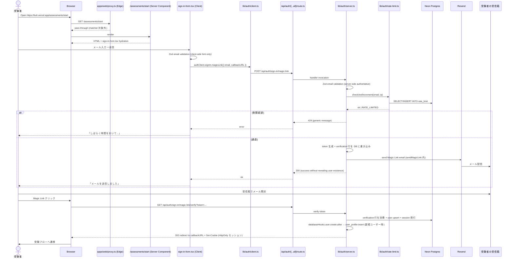
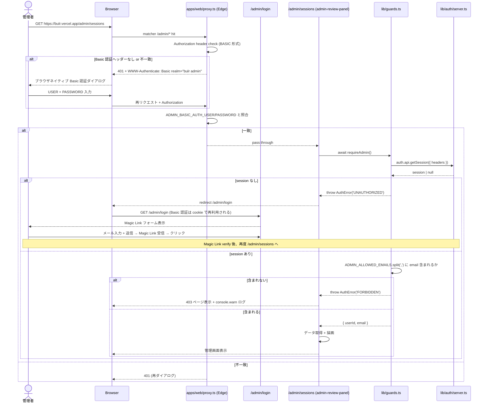
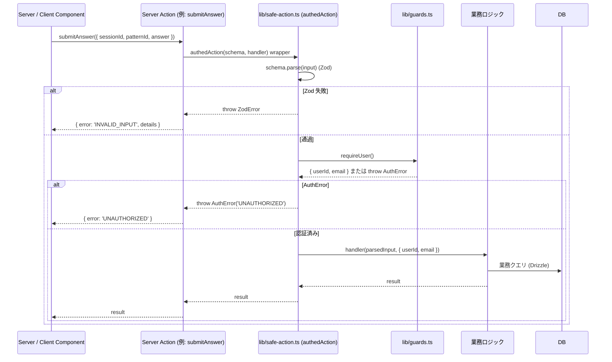

# Design Document: authentication

## Overview

**Purpose**: bulr Stage 1 MVP プロトタイプの認証境界 2 種（受験者 = Magic Link、創業者/管理者 = Basic 認証 + 許可メール二重チェック）を、Better Auth 1.6.x + Resend + Drizzle ORM + Next.js 16 (App Router、Server Components) で実装する。`security.md` の「多層認証パターン（CVE-2025-29927 教訓）」を貫徹し、`requireUser()` / `requireAdmin()` / `requireSessionOwnership()` を Server Component / Server Action / API Route の各層で独立に呼び出す構造を契約として確立する。本スペック完了をもって、後続の `assessment-engine` と `admin-review-panel` は認証ヘルパーと Server Action ラッパーをそのまま使い、認証ロジックを再実装しない。

**Users**:
- **受験者（ベトナム人 50 名 + 日本人 20 名）**: `/assessments/start` でメール入力 → Magic Link 受信 → クリックでサインイン → 受験フローへ進む。
- **創業者（管理者）**: `/admin/login` で Basic 認証ダイアログを通過した後、Magic Link でサインインして `/admin/*` にアクセスする。`ADMIN_ALLOWED_EMAILS` に列挙された自身のメールアドレスがあれば通過、なければ 403。
- **後続 spec の実装者**: `requireUser()` / `requireAdmin()` / `requireSessionOwnership()` を Server Component から、`authedAction()` / `adminAction()` を Server Action から呼ぶことで、認証チェックを毎回書き直さずに mutation を保護できる。

**Impact**: `monorepo-foundation` と `multi-env-infrastructure` 完了直後の状態（apps/web スケルトン + 4 packages + 環境変数規約 + CI）に対し、(1) `apps/web/lib/auth/` 配下に Better Auth サーバー/クライアント設定を新規追加、(2) `apps/web/lib/email/`、`apps/web/lib/guards.ts`、`apps/web/lib/safe-action.ts` を新規追加、(3) `apps/web/proxy.ts` を新規追加、(4) `apps/web/app/api/auth/[...all]/route.ts`、`apps/web/app/(assessment)/assessments/start/page.tsx`、`apps/web/app/admin/login/page.tsx` を新規追加、(5) `packages/db/src/schema/` 配下に Better Auth 4 テーブル + `user_profile` + (Stage 1 採用なら) `rate_limit` の Drizzle 定義を追加、(6) Drizzle migration ファイルを生成する。後続 spec が認証で困らないための土台。

### Goals

- Better Auth 1.6.x を `apps/web/lib/auth/server.ts` にシングルトン構成し、Magic Link プラグイン（有効期限 15 分、使い切り、Resend 配信）を統合する
- Better Auth 管理 4 テーブル（`user`、`session`、`account`、`verification`）と bulr 固有の `user_profile` テーブルを `packages/db/src/schema/auth.ts` および `packages/db/src/schema/user-profile.ts` に Drizzle スキーマで定義する
- `apps/web/lib/guards.ts` に `getCurrentUser` / `requireUser` / `requireAdmin` / `requireSessionOwnership` / `AuthError` を実装し、`'server-only'` で保護する
- `apps/web/lib/safe-action.ts` に `authedAction` / `adminAction` の自前軽量ラッパーを実装する（`next-safe-action` は導入しない）
- `apps/web/proxy.ts` で `/admin/*` の Basic 認証ヘッダーチェックと `/assessments/[sessionId]` の UX redirect を担う
- 受験者向け `/assessments/start`、管理者向け `/admin/login` のサインイン UI を最小実装する
- Magic Link 送信のレート制限（per-email 3/5min、per-IP 20/hour）を Stage 1 に適した方式（DB ベース `rate_limit` テーブルを採用）で実装する
- Magic Link メールテンプレート（日本語+英語並記、HTML+text の単一テンプレート）を `apps/web/lib/email/magic-link-template.ts` に実装する
- Drizzle migration を `pnpm --filter @bulr/db generate` で 1 ファイル生成し、Vercel Preview で動作確認可能な状態にする

### Non-Goals

- 受験セッション、回答記録、対話 API → `assessment-engine` spec
- 管理画面の機能 UI（セッション一覧、回答詳細、ヒートマップ）→ `admin-review-panel` spec
- 状況パターンマスタの定義とシード → `assessment-pattern-seed` spec
- Google OAuth、SSO、Apple Sign-in → Stage 2
- パスワード認証、匿名セッション、dual-owner CHECK → bulr Stage 1 では不要
- `packages/auth` への切り出し → Stage 2 で `apps/admin` 分離時に実施
- メールカスタムドメイン認証（DNS SPF/DKIM）→ Stage 2、Stage 1 は Resend テストドメイン `onboarding@resend.dev`
- 受験プロファイル入力フォームの UI 実装 → 本スペックは `user_profile` 行の作成と JSONB の構造非定義のみ、フォーム本体は `assessment-engine` spec
- Better Auth の admin role plugin 採用 → Stage 1 は環境変数 CSV のみ
- 監査ログ、データエクスポート、アカウント削除フロー → Stage 2

## Boundary Commitments

### This Spec Owns

- **Better Auth サーバー設定**: `apps/web/lib/auth/server.ts`（drizzleAdapter で `@bulr/db`、magicLink plugin、databaseHooks、trustedOrigins、cookie 設定を一括）
- **Better Auth クライアント設定**: `apps/web/lib/auth/client.ts`（サインイン UI から呼ぶ最小の `authClient`）
- **Better Auth API ルート**: `apps/web/app/api/auth/[...all]/route.ts`（`toNextJsHandler(auth)` で公開）
- **Resend クライアント**: `apps/web/lib/email/resend.ts`（`new Resend(process.env.RESEND_API_KEY)` のシングルトン）
- **Magic Link メールテンプレート**: `apps/web/lib/email/magic-link-template.ts`（日本語+英語並記、`{ subject, text, html }` を返す純関数）
- **認証ヘルパー**: `apps/web/lib/guards.ts`（`getCurrentUser` / `requireUser` / `requireAdmin` / `requireSessionOwnership` / `AuthError`）
- **Server Action ラッパー**: `apps/web/lib/safe-action.ts`（`authedAction` / `adminAction`）
- **proxy.ts**: `apps/web/proxy.ts`（Basic 認証ヘッダーチェック + UX redirect、Edge Runtime 対応）
- **受験者サインイン UI**: `apps/web/app/(assessment)/assessments/start/page.tsx`（Server Component shell + Client Component フォーム）
- **管理者サインイン UI**: `apps/web/app/admin/login/page.tsx`（Server Component shell + Client Component フォーム）
- **DB スキーマ追加**: `packages/db/src/schema/auth.ts`（Better Auth 管理 4 テーブル: `user` / `session` / `account` / `verification`）
- **DB スキーマ追加**: `packages/db/src/schema/user-profile.ts`（`user_profile` テーブル）
- **DB スキーマ追加**: `packages/db/src/schema/rate-limit.ts`（Magic Link レート制限用、Stage 1 で採用）
- **schema barrel 更新**: `packages/db/src/schema/index.ts` から上記 3 ファイルを export
- **レート制限ロジック**: `apps/web/lib/auth/rate-limit.ts`（`rate_limit` テーブルに対する DB ベースカウンタ）
- **環境変数バリデーション**: Better Auth サーバー初期化時の Fail Fast チェック（`RESEND_API_KEY` / `BETTER_AUTH_SECRET` / `BETTER_AUTH_URL` / `ADMIN_*` の存在検証）
- **Drizzle migration**: `packages/db/drizzle/*_authentication.sql`（drizzle-kit generate が次に利用可能な番号で出力。例: `0001_authentication.sql` または `0002_authentication.sql`、auto-generated）

### Out of Boundary

- **`packages/db/src/client.ts` の構造変更**: `monorepo-foundation` で実装済み、本スペックは触らない
- **`packages/db/drizzle.config.ts` の構造変更**: 同上
- **環境変数キーの再定義**: `multi-env-infrastructure` の `.env.example` を信頼し、本スペックは追加しない（ただし `RESEND_REPLY_TO_EMAIL` のみ Stage 1 でオプショナル追加するかは下記「Revalidation Triggers」で言及）
- **Vercel / Neon / Resend のアカウント設定**: `multi-env-infrastructure` の `docs/setup/` に従い Owner が手動実施済み前提
- **CI ワークフローの追加**: `multi-env-infrastructure` の `.github/workflows/ci.yml` を継承、本スペックは変更しない
- **後続 spec が定義するテーブル**: `assessment_session` / `assessment_answer` / `assessment_pattern` / `chat_message` の Drizzle 定義は本スペック範囲外
- **管理画面の機能ページ**: `/admin/sessions`、`/admin/sessions/[id]` などは `admin-review-panel` spec
- **対話 API、Tool 実装、システムプロンプト**: `assessment-engine` spec
- **`assessment-engine` が `user_profile.profile_input` JSONB の Zod スキーマを定義する**: 本スペックは構造非定義（`{}` ベース）のみ提供、後続 spec が読み書き時に Zod 検証する
- **Stage 2 の `packages/auth` 分離**: 構造変更は将来の別 spec
- **メールテンプレートの React Email 採用**: Stage 1 はシンプルな TS 関数で `{ subject, text, html }` を組み立てる方針（`@react-email/components` は非導入）

### Allowed Dependencies

- **新規 npm パッケージ**:
  - `better-auth@^1.6.0` (apps/web 直接依存)
  - `resend@^4.0.0` (apps/web 直接依存)
- **既存パッケージ**:
  - `@bulr/db` workspace 依存（drizzleAdapter に渡す）
  - `zod@^4` (`@bulr/ai` の依存に追加済み、`apps/web` でも直接使用)
  - `next@^16`、`react@^19`、`drizzle-orm@^0.45`（既存）
- **環境変数（multi-env-infrastructure 由来）**:
  - `BETTER_AUTH_SECRET`（Better Auth クッキー暗号化）
  - `BETTER_AUTH_URL`（コールバック URL ベース、未設定時は `NEXT_PUBLIC_APP_URL` を fallback）
  - `RESEND_API_KEY`（Magic Link 配信）
  - `NEXT_PUBLIC_APP_URL`（Magic Link URL 構築のベース）
  - `ADMIN_ALLOWED_EMAILS`（CSV、`requireAdmin` で使用）
  - `ADMIN_BASIC_AUTH_USER` / `ADMIN_BASIC_AUTH_PASSWORD`（proxy.ts で使用）
  - `DATABASE_URL`（既存、Better Auth が drizzleAdapter 経由で利用）
- **新規環境変数候補（オプショナル、デフォルト未設定で動作）**:
  - `RESEND_REPLY_TO_EMAIL`（Magic Link メールの Reply-To、未設定なら省略）
- **ホスト環境**: Node.js 22 LTS+、pnpm 10+、Vercel Hobby (Node.js Runtime + Edge Runtime for proxy.ts)

### Revalidation Triggers

以下が発生した場合、後続 spec は本スペックとの統合を再検証する必要がある:

- Better Auth のメジャーバージョン変更（1.x → 2.x）
- Better Auth 管理テーブル名 / カラム名の変更（dishxdish 案件で発生例あり）
- `user_profile` テーブル構造の変更（カラム追加、リネーム）
- `requireUser` / `requireAdmin` / `requireSessionOwnership` の戻り値型または例外仕様の変更
- `authedAction` / `adminAction` の引数 / 戻り値シグネチャ変更
- proxy.ts の matcher 範囲変更（保護パスの追加・削除）
- レート制限の方式変更（DB → Redis、上限値の変更）
- Magic Link 有効期限の変更（15 分以外）
- Stage 2 で `packages/auth` 切り出し時の import パス変更
- Resend カスタムドメイン認証完了時の `from` アドレス変更

## Architecture

### Existing Architecture Analysis

- **`monorepo-foundation` で確立済み**: `apps/web` (Next.js 16 + React 19 + Tailwind 4) スケルトン、`packages/db` (Drizzle ORM + 空スキーマバレル + `pg` Pool client + `drizzle.config.ts` で `.env.local` 自動読込)、`tsconfig.base.json` strict mode、ESLint flat config。
- **`multi-env-infrastructure` で確立済み**: `.env.example` の 9 環境変数、Vercel Production / Preview スコープ運用、Neon dev/production 2 ブランチ運用、`.github/workflows/ci.yml` の typecheck + lint + audit。
- **本スペックが踏襲するパターン**: `'server-only'` import marker、Drizzle ORM Pure SQL なし、Zod での全外部入力検証、`process.env` 起動時 Fail Fast、Server Component で `await requireUser()` を直接呼ぶ。
- **本スペックが導入する新パターン**: Better Auth の databaseHooks による `user_profile` 行の自動作成、proxy.ts の Edge Runtime 制約（DB クエリなしで Cookie/Header のみ判定）、`AuthError` クラスによる例外駆動の認可制御。

### Architecture Pattern & Boundary Map

```mermaid
graph TB
    subgraph Browser["受験者 / 管理者ブラウザ"]
        ExamineeUI[/assessments/start サインイン UI/]
        AdminUI[/admin/login サインイン UI/]
        Email[受信箱: Magic Link メール]
    end

    subgraph EdgeProxy["Edge Runtime"]
        Proxy[apps/web/proxy.ts<br/>Basic 認証ヘッダーチェック<br/>UX redirect]
    end

    subgraph NextApp["apps/web Next.js 16 (Node.js Runtime)"]
        AuthRoute[app/api/auth/&#91;...all&#93;/route.ts<br/>Better Auth handler]
        SignInPage[app/&#40;assessment&#41;/assessments/start/page.tsx]
        AdminLoginPage[app/admin/login/page.tsx]

        subgraph LibAuth["lib/auth/"]
            ServerCfg[server.ts<br/>Better Auth instance<br/>magicLink plugin<br/>drizzleAdapter]
            ClientCfg[client.ts<br/>authClient]
            RateLimitMod[rate-limit.ts<br/>per-email + per-IP]
        end

        subgraph LibEmail["lib/email/"]
            ResendCli[resend.ts<br/>Resend singleton]
            EmailTpl[magic-link-template.ts<br/>JP+EN bilingual]
        end

        Guards[lib/guards.ts<br/>requireUser / requireAdmin<br/>requireSessionOwnership<br/>AuthError]
        SafeAction[lib/safe-action.ts<br/>authedAction / adminAction]
    end

    subgraph DB["Neon Postgres (packages/db)"]
        BetterAuthTables[user / session<br/>account / verification]
        UserProfile[user_profile<br/>1:1 with user]
        RateLimitTbl[rate_limit<br/>per-email + per-IP counters]
    end

    subgraph External["外部サービス"]
        Resend[Resend API]
    end

    ExamineeUI -->|POST /api/auth/sign-in/magic-link| AuthRoute
    AdminUI -->|POST /api/auth/sign-in/magic-link| AuthRoute
    Email -->|Click Magic Link| AuthRoute
    AuthRoute --> ServerCfg
    ServerCfg -->|drizzleAdapter| BetterAuthTables
    ServerCfg -->|sendMagicLink| ResendCli
    ResendCli --> EmailTpl
    ResendCli -->|API| Resend
    Resend -->|Deliver| Email
    ServerCfg -->|databaseHooks.user.create.after| UserProfile
    ServerCfg -->|rate limit check| RateLimitMod
    RateLimitMod --> RateLimitTbl

    Browser -->|HTTPS| Proxy
    Proxy -->|/admin/* w/o Basic auth| Browser
    Proxy -->|pass through| NextApp
    SignInPage -->|optional getCurrentUser| Guards
    AdminLoginPage --> Guards
    Guards -->|auth.api.getSession| ServerCfg

    style EdgeProxy fill:#fde
    style DB fill:#def
    style External fill:#dfe
```



**Architecture Integration**:

- **Selected pattern**: Server-First 多層認証アーキテクチャ。proxy.ts (Edge) は Cookie 存在 / Authorization ヘッダーのみで早期 reject、各 Server Component / Server Action / API Route が `requireUser` / `requireAdmin` を独立に呼んで Better Auth セッションを検証する。Better Auth 自身は drizzleAdapter で `packages/db` を参照するため、認証データベースは bulr の通常 DB と一体化する。
- **Domain/feature boundaries**: `apps/web/lib/auth/` が Better Auth 統合層、`apps/web/lib/email/` が Resend 配信層、`apps/web/lib/guards.ts` と `apps/web/lib/safe-action.ts` が認可契約層、`apps/web/proxy.ts` が UX レイヤー。後続 spec は guards / safe-action のみを import する（auth/email は内部詳細）。
- **Existing patterns preserved**: `monorepo-foundation` の `'server-only'` 慣習、`packages/db` の Drizzle Schema 集中管理、`packages/db/src/client.ts` の `db` シングルトン、`tsconfig.base.json` の strict mode を維持。
- **New components rationale**:
  - Better Auth: 自前で Magic Link / セッション管理を組むより低リスク。dishxdish で動作実績あり。
  - 自前 Server Action ラッパー: `next-safe-action` を使うほどの規模ではなく、`security.md` のサンプルコードに合わせた最小実装で十分。
  - DB ベースレート制限: Stage 1 は Vercel Function ごとにメモリが分散するためメモリベース不可、Redis 導入は Stage 2 までスキップ、`pg` で軽量な `rate_limit` テーブルが現実解。
  - proxy.ts の Edge Runtime 採用: Vercel デフォルト、Cookie / Header のみで判定するため DB 接続不要。
- **Steering compliance**:
  - `tech.md`: Better Auth 1.6.x、Resend、Magic Link 15 分使い切り、HttpOnly+Secure+SameSite=Lax cookie、Better Auth 管理テーブルに独自カラム追加禁止 → すべて遵守
  - `security.md`: 多層認証（proxy.ts は UX のみ、各層で独立チェック）、Zod 全入力検証、no SQL injection（Drizzle のみ）、Magic Link レート制限（per-email 3/5min、per-IP 20/hour）、no `any`、`server-only` import marker → すべて遵守
  - `structure.md`: `packages/auth` 切り出さず `apps/web/lib/auth/` 直書き、Better Auth 管理テーブル + bulr 固有 `user_profile` 1:1、命名規則（kebab-case file、PascalCase component、snake_case table/column） → すべて遵守

### Technology Stack

| Layer | Choice / Version | Role in Feature | Notes |
|-------|------------------|-----------------|-------|
| Auth Framework | Better Auth 1.6.x | Magic Link、セッション管理、Drizzle adapter | dishxdish 実績あり、bulr 簡素化版 |
| Email Delivery | Resend SDK 4.x | Magic Link メール送信 | Free プラン 100/日、Stage 1 で十分 |
| Email Template | プレーン TypeScript 関数 | `{ subject, text, html }` を返す純関数 | React Email は導入しない（Stage 1 シンプル方針） |
| ORM | Drizzle ORM 0.45.x（既存） | Better Auth drizzleAdapter + `user_profile` / `rate_limit` 定義 | `packages/db` 経由 |
| Validation | Zod 4.x（既存、apps/web 直接 import） | メール形式、Authorization ヘッダー、入力検証 | Server Action wrapper の schema 引数 |
| Server Component | Next.js 16 App Router | `requireUser()` を Server Component から呼ぶ | React 19 対応 |
| Edge Runtime | Next.js 16 proxy.ts | Basic 認証ヘッダーチェック + UX redirect | DB クエリ禁止、Cookie/Header のみ |
| Session Storage | Better Auth デフォルト (DB ベース、`session` テーブル) | サーバー検証可能なセッション | Redis 不要 |
| Rate Limit Storage | `rate_limit` テーブル (`packages/db`) | per-email、per-IP カウンタ | Stage 1 は DB、Stage 2 で Redis 検討 |
| Type Safety | TypeScript 5.4+ strict（既存） | 認証ヘルパーの戻り値型 | no `any`、`AuthError` のコード union 型 |

> 詳細な代替案検討（Better Auth vs NextAuth vs Lucia、React Email vs プレーン、Redis vs DB rate limit、Edge vs Node.js proxy、admin role plugin vs CSV）は `research.md` に格納する。

## File Structure Plan

### Directory Structure

```
bulr-app-mvp/
├── apps/
│   └── web/
│       ├── proxy.ts                                       # ★ NEW: Edge Runtime、Basic 認証 + UX redirect
│       ├── package.json                                   # MOD: better-auth ^1.6.0, resend ^4.0.0 追加
│       ├── app/
│       │   ├── api/
│       │   │   └── auth/
│       │   │       └── [...all]/
│       │   │           └── route.ts                       # ★ NEW: toNextJsHandler(auth) で Better Auth 公開
│       │   ├── (assessment)/
│       │   │   └── assessments/
│       │   │       └── start/
│       │   │           ├── page.tsx                       # ★ NEW: Server Component shell
│       │   │           └── sign-in-form.tsx               # ★ NEW: Client Component (use client)、authClient.signIn.magicLink
│       │   └── admin/
│       │       └── login/
│       │           ├── page.tsx                           # ★ NEW: Server Component shell（Basic 認証通過後の Magic Link 入口）
│       │           └── admin-sign-in-form.tsx             # ★ NEW: Client Component
│       ├── lib/
│       │   ├── auth/
│       │   │   ├── server.ts                              # ★ NEW: Better Auth instance + magicLink plugin + databaseHooks
│       │   │   ├── client.ts                              # ★ NEW: createAuthClient (better-auth/react)
│       │   │   └── rate-limit.ts                          # ★ NEW: per-email + per-IP DB ベースカウンタ
│       │   ├── email/
│       │   │   ├── resend.ts                              # ★ NEW: new Resend(env.RESEND_API_KEY) シングルトン
│       │   │   └── magic-link-template.ts                 # ★ NEW: JP+EN bilingual テンプレート純関数
│       │   ├── guards.ts                                  # ★ NEW: getCurrentUser / requireUser / requireAdmin / requireSessionOwnership / AuthError
│       │   └── safe-action.ts                             # ★ NEW: authedAction / adminAction ラッパー
│       └── components/
│           └── (本スペックでは追加なし; サインインフォームは page 配下に同居)
│
└── packages/
    └── db/
        ├── package.json                                   # 変更なし (drizzle-orm 既存)
        └── src/
            ├── schema/
            │   ├── index.ts                               # MOD: auth / user-profile / rate-limit を export 追加
            │   ├── auth.ts                                # ★ NEW: Better Auth 4 テーブル (user / session / account / verification)
            │   ├── user-profile.ts                        # ★ NEW: user_profile テーブル
            │   └── rate-limit.ts                          # ★ NEW: rate_limit テーブル
            └── drizzle/
                └── <NNNN>_authentication.sql              # ★ NEW: drizzle-kit generate で自動生成（次に利用可能な番号、例: 0001 または 0002）
```

### Modified Files

- `apps/web/package.json` — `dependencies` に `better-auth: "^1.6.0"`、`resend: "^4.0.0"` を追加。devDependencies は変更なし。
- `packages/db/src/schema/index.ts` — 既存の空バレル `export {};` を `export * from './auth'; export * from './user-profile'; export * from './rate-limit';` に置換。
- （オプション）`.env.example` および `apps/web/.env.local.example` — `RESEND_REPLY_TO_EMAIL` を追加するかは `multi-env-infrastructure` 規約上、本スペックが追加してよい（コメント明記）。Stage 1 では追加しない判断も可。タスク段階で確定する。

### Files NOT Created

- `apps/web/lib/auth/index.ts` — barrel は不要、各モジュールから直接 import する（Server / Client 境界を明示するため）
- `packages/auth/` — Stage 1 では切り出さない（structure.md 準拠）
- `apps/web/components/sign-in-form.tsx` — 共通化は不要、各 page 配下に専用 Client Component を配置（受験者用と管理者用で文言が異なるため）
- `apps/web/app/admin/page.tsx` — 管理画面 top は `admin-review-panel` spec の責務、本スペックでは不要
- React Email テンプレート（`*.tsx` 形式）— Stage 1 はプレーン TS 関数で十分
- `apps/web/lib/auth/types.ts` — Better Auth が型を提供するため独自型ファイル不要

> File Structure Plan の各ファイルは「責務 1 つ」の原則を守る。後続 spec は `apps/web/lib/guards.ts` と `apps/web/lib/safe-action.ts` のみを import すれば認証境界に到達できる。

## System Flows

### フロー 1: 受験者の Magic Link サインイン



### フロー 2: 管理者の Basic 認証 + Magic Link



### フロー 3: Server Action 経由の認証された mutation



## Requirements Traceability

| Requirement | Summary | Components | Interfaces | Flows |
|-------------|---------|------------|------------|-------|
| 1.1 | `/assessments/start` サインイン UI | SignInPage、SignInForm | Server + Client Component | フロー 1 |
| 1.2 | メール送信 + Resend 配信 | AuthServer、ResendClient、EmailTemplate、RateLimitMod | sendMagicLink hook | フロー 1 |
| 1.3 | 送信成功確認メッセージ（情報漏洩なし） | SignInForm | UI message | フロー 1 |
| 1.4 | メール形式無効時のエラー表示 | SignInForm、AuthServer | Zod email | フロー 1 |
| 1.5 | Magic Link 15 分有効期限 | AuthServer (magicLink plugin) | expiresIn config | フロー 1 |
| 1.6 | Magic Link 使い切り | AuthServer (magicLink plugin) | Better Auth default | フロー 1 |
| 1.7 | Magic Link 検証成功後の session + redirect | AuthRoute、AuthServer | toNextJsHandler | フロー 1 |
| 1.8 | 新規ユーザー時の user_profile 自動作成 | AuthServer (databaseHooks) | databaseHooks.user.create.after | フロー 1 |
| 1.9 | サインイン UI のベータ説明 | SignInPage | static text | — |
| 2.1 | HttpOnly+Secure+SameSite=Lax cookie | AuthServer | cookie config | — |
| 2.2 | session token を JS から非公開 | AuthServer | HttpOnly | — |
| 2.3 | サインアウト | AuthRoute | POST /api/auth/sign-out | — |
| 2.4 | 期限切れ session の AuthError | Guards | requireUser throw | — |
| 2.5 | getCurrentUser の一貫性 | Guards | リクエストスコープ | — |
| 3.1 | proxy.ts Basic 認証 | Proxy | Authorization parse | フロー 2 |
| 3.2 | 401 + WWW-Authenticate | Proxy | response | フロー 2 |
| 3.3 | requireAdmin Server Component 呼び出し | Guards | requireAdmin | フロー 2 |
| 3.4 | requireAdmin が requireUser を呼ぶ | Guards | composition | フロー 2 |
| 3.5 | ADMIN_ALLOWED_EMAILS 比較 | Guards | env CSV split | フロー 2 |
| 3.6 | /admin/login 公開 | AdminLoginPage、Proxy matcher exception | route accessibility | フロー 2 |
| 3.7 | proxy.ts 単独依存しない | Guards (called in every layer) | 多層防御 | フロー 2 |
| 3.8 | 不正アクセス試行ログ | Guards | console.warn | フロー 2 |
| 4.1 | guards.ts のエクスポート群 | Guards | barrel | — |
| 4.2 | getCurrentUser 戻り値 | Guards | TypeScript signature | — |
| 4.3 | requireUser 例外 | Guards | AuthError('UNAUTHORIZED') | — |
| 4.4 | requireAdmin 例外 | Guards | AuthError('FORBIDDEN') | — |
| 4.5 | requireSessionOwnership 例外 | Guards | AuthError('NOT_FOUND_OR_FORBIDDEN') | — |
| 4.6 | AuthError class 構造 | Guards | code property | — |
| 4.7 | guards.ts に server-only marker | Guards | import 'server-only' | — |
| 4.8 | コスト O(1) | Guards、AuthServer | request-scope cache | — |
| 5.1 | safe-action.ts のエクスポート | SafeAction | factory | フロー 3 |
| 5.2 | authedAction の Zod + requireUser | SafeAction、Guards | wrapper | フロー 3 |
| 5.3 | adminAction の Zod + requireAdmin | SafeAction、Guards | wrapper | フロー 3 |
| 5.4 | エラー serialization | SafeAction | error mapping | フロー 3 |
| 5.5 | safe-action.ts に server-only | SafeAction | import 'server-only' | — |
| 5.6 | JSDoc で「素の async function 禁止」明記 | SafeAction | doc comment | — |
| 6.1 | proxy.ts のパス | Proxy | apps/web/proxy.ts | フロー 2 |
| 6.2 | /admin/* Basic 認証 | Proxy | matcher + check | フロー 2 |
| 6.3 | /assessments/[sessionId] 未認証 redirect | Proxy | cookie check + redirect | — |
| 6.4 | proxy.ts は DB クエリ禁止 | Proxy | Edge Runtime constraint | — |
| 6.5 | proxy.ts JSDoc に UX レイヤー明記 | Proxy | doc comment | — |
| 6.6 | matcher が静的アセットを除外 | Proxy | config.matcher | — |
| 7.1 | Better Auth テーブルに独自カラム追加禁止 | AuthSchema | drizzle definition | — |
| 7.2 | user_profile テーブル定義 | UserProfileSchema | drizzle table | — |
| 7.3 | 1:1 関係 | UserProfileSchema、AuthSchema | FK + PK | — |
| 7.4 | 新規 user 時に user_profile 自動作成 | AuthServer (databaseHooks) | databaseHooks.user.create.after | フロー 1 |
| 7.5 | profile_input JSONB 構造非定義 | UserProfileSchema | jsonb default '{}' | — |
| 7.6 | Drizzle migration 生成 | DB Migration | `*_authentication.sql`（次の連番） | — |
| 7.7 | ON DELETE CASCADE | UserProfileSchema | FK 設定 | — |
| 8.1 | JP+EN 単一テンプレート | EmailTemplate | pure function | フロー 1 |
| 8.2 | Subject 形式 | EmailTemplate | const string | — |
| 8.3 | Body 構成 | EmailTemplate | template literal | — |
| 8.4 | text + html 両方 | EmailTemplate | { subject, text, html } | — |
| 8.5 | from = Resend テストドメイン | ResendClient | from address | — |
| 8.6 | Reply-To オプショナル | ResendClient | env 参照 | — |
| 8.7 | 送信ログ | ResendClient | console.info + hash | — |
| 9.1 | per-email 3/5min | RateLimitMod | DB counter | フロー 1 |
| 9.2 | per-IP 20/hour | RateLimitMod | DB counter | フロー 1 |
| 9.3 | 制限超過時の generic メッセージ | RateLimitMod、AuthServer | response | フロー 1 |
| 9.4 | rate_limit テーブル採用 | RateLimitSchema、RateLimitMod | drizzle table | — |
| 9.5 | window 期限切れの除外 | RateLimitMod | expires_at filter | — |
| 9.6 | session 系エンドポイントは制限対象外 | RateLimitMod | scope限定 | — |
| 9.7 | 制限トリガーログ | RateLimitMod | console.warn + hash | — |
| 10.1 | email Zod 検証 | AuthServer、SignInForm | z.string().email() | フロー 1 |
| 10.2 | Authorization Zod 検証 | Proxy | regex / Zod | フロー 2 |
| 10.3 | Magic Link token 形式検証 | AuthServer | additional check | フロー 1 |
| 10.4 | Zod 失敗時の副作用なし | SafeAction、AuthServer | early return | フロー 3 |
| 10.5 | wrapper handler は Zod parsed のみ受け取る | SafeAction | TypeScript inference | フロー 3 |
| 11.1 | /admin/* Server Component に requireAdmin | (downstream specs apply) | contract | フロー 2 |
| 11.2 | /assessments/[sessionId] に requireUser | (downstream specs apply) | contract | — |
| 11.3 | /api/admin/* に requireAdmin | (downstream specs apply) | contract | — |
| 11.4 | /api/sessions/* /api/chat に requireUser+ownership | (downstream specs apply) | contract | フロー 3 |
| 11.5 | 全 mutation は wrapper 経由 | SafeAction、(downstream specs) | PR review checklist | フロー 3 |
| 11.6 | request-scope のみキャッシュ | Guards、AuthServer | no Redis | — |
| 11.7 | proxy.ts JSDoc | Proxy | doc | フロー 2 |
| 12.1 | RESEND_API_KEY 利用 | ResendClient | env | — |
| 12.2 | RESEND_API_KEY 未設定 Fail Fast | AuthServer、ResendClient | startup throw | — |
| 12.3 | BETTER_AUTH_SECRET 未設定 Fail Fast | AuthServer | startup throw | — |
| 12.4 | BETTER_AUTH_URL fallback to NEXT_PUBLIC_APP_URL | AuthServer | env precedence | — |
| 12.5 | ADMIN_ALLOWED_EMAILS 空時に reject | Guards | empty array fallback | — |
| 12.6 | ADMIN_BASIC_AUTH_* 未設定で 503 | Proxy | startup-time check | — |
| 12.7 | Drizzle migration 生成 | DB Migration | drizzle-kit generate | — |
| 12.8 | Vercel Preview で動作 | (deployment) | dev branch URL | — |

## Components and Interfaces

### Component Summary

| Component | Domain/Layer | Intent | Req Coverage | Key Dependencies (P0/P1) | Contracts |
|-----------|--------------|--------|--------------|--------------------------|-----------|
| AuthServer | apps/web/lib/auth | Better Auth singleton + magicLink + databaseHooks | 1.2, 1.5, 1.6, 1.7, 1.8, 2.1, 2.2, 2.3, 2.4, 7.1, 7.4, 8.1, 10.1, 10.3, 12.2, 12.3, 12.4 | better-auth (P0), @bulr/db (P0), ResendClient (P0), EmailTemplate (P0), RateLimitMod (P0) | Service [x] / API [x] |
| AuthClient | apps/web/lib/auth | createAuthClient (better-auth/react) | 1.1, 3.6 | better-auth/react (P0) | Service [x] |
| RateLimitMod | apps/web/lib/auth | per-email + per-IP DB counter | 9.1, 9.2, 9.3, 9.4, 9.5, 9.6, 9.7 | @bulr/db (P0), RateLimitSchema (P0) | Service [x] |
| ResendClient | apps/web/lib/email | Resend SDK singleton + send wrapper | 1.2, 8.5, 8.6, 8.7, 12.1, 12.2 | resend (P0), EmailTemplate (P0) | Service [x] |
| EmailTemplate | apps/web/lib/email | JP+EN bilingual テンプレート純関数 | 8.1, 8.2, 8.3, 8.4 | (none) | Service [x] |
| Guards | apps/web/lib | requireUser / requireAdmin / requireSessionOwnership / AuthError | 2.4, 2.5, 3.3, 3.4, 3.5, 3.7, 3.8, 4.1, 4.2, 4.3, 4.4, 4.5, 4.6, 4.7, 4.8, 11.6, 12.5 | AuthServer (P0) | Service [x] |
| SafeAction | apps/web/lib | authedAction / adminAction wrappers | 5.1, 5.2, 5.3, 5.4, 5.5, 5.6, 10.4, 10.5, 11.5 | Guards (P0), zod (P0) | Service [x] |
| Proxy | apps/web | Edge Runtime: Basic 認証 + UX redirect | 3.1, 3.2, 6.1, 6.2, 6.3, 6.4, 6.5, 6.6, 10.2, 11.7, 12.6 | (env vars) | Service [x] |
| AuthRoute | apps/web/app/api/auth | toNextJsHandler 公開 | 1.7, 2.3 | AuthServer (P0) | API [x] |
| SignInPage | apps/web/app/(assessment)/assessments/start | Server Component shell | 1.1, 1.9 | (none) | Service [x] |
| SignInForm | apps/web/app/(assessment)/assessments/start | Client Component (use client) | 1.1, 1.3, 1.4 | AuthClient (P0) | Service [x] |
| AdminLoginPage | apps/web/app/admin/login | Server Component shell | 3.6 | (none) | Service [x] |
| AdminSignInForm | apps/web/app/admin/login | Client Component | 3.6 | AuthClient (P0) | Service [x] |
| AuthSchema | packages/db/src/schema | Better Auth 4 テーブル Drizzle 定義 | 7.1 | drizzle-orm (P0) | Service [x] |
| UserProfileSchema | packages/db/src/schema | user_profile Drizzle 定義 | 7.2, 7.3, 7.5, 7.7 | drizzle-orm (P0), AuthSchema (P0) | Service [x] |
| RateLimitSchema | packages/db/src/schema | rate_limit Drizzle 定義 | 9.4 | drizzle-orm (P0) | Service [x] |
| DBMigration | packages/db/drizzle | drizzle-kit 生成 SQL | 7.6, 12.7 | AuthSchema, UserProfileSchema, RateLimitSchema (P0) | Batch [x] |

### apps/web/lib/auth: AuthServer

| Field | Detail |
|---|---|
| Intent | Better Auth 1.6.x のシングルトンインスタンス。drizzleAdapter で `@bulr/db` を、magicLink plugin で送信処理を、databaseHooks で `user_profile` 行作成を、environment-variable Fail Fast で起動時不備を検知する |
| Requirements | 1.2, 1.5, 1.6, 1.7, 1.8, 2.1, 2.2, 2.3, 2.4, 7.1, 7.4, 8.1, 10.1, 10.3, 12.2, 12.3, 12.4 |

**Responsibilities & Constraints**

- `apps/web/lib/auth/server.ts` で `'server-only'` をマーキング
- 起動時に `BETTER_AUTH_SECRET` / `RESEND_API_KEY` の存在を検証、未設定なら `throw new Error(...)` (Fail Fast)
- `BETTER_AUTH_URL` 未設定なら `NEXT_PUBLIC_APP_URL` を fallback
- `trustedOrigins` に `NEXT_PUBLIC_APP_URL` を含める
- session cookie: `HttpOnly`、`Secure`（NODE_ENV=production）、`SameSite=Lax`、有効期限 7 日（sliding refresh）
- magicLink plugin:
  - `expiresIn: 60 * 15`（15 分）
  - `disableSignUp: false`（新規メールでも user 作成）
  - `sendMagicLink({ email, url })`: RateLimitMod で per-email + per-IP チェック → 通過なら ResendClient.send で配信、失敗なら `throw RateLimitError`
- databaseHooks:
  - `user.create.after`: 同一トランザクション内で `user_profile` 行を `{ user_id, profile_input: {} }` で insert
- `drizzleAdapter(db, { provider: 'pg' })` で `@bulr/db` の `db` インスタンスを渡す
- `auth.api.getSession({ headers })` がリクエストスコープでキャッシュされる（Better Auth デフォルト）

**Dependencies**

- Outbound: ResendClient.send（P0）、EmailTemplate.buildMagicLinkEmail（P0）、RateLimitMod.checkAndIncrement（P0）、`@bulr/db` の `db`（P0）
- External: `better-auth@^1.6.0`（P0）

**Contracts**: Service [x] / API [x] （Better Auth が `/api/auth/*` 配下を自動公開）

##### Service Interface

```typescript
// apps/web/lib/auth/server.ts (excerpt)
import 'server-only';
import { betterAuth } from 'better-auth';
import { drizzleAdapter } from 'better-auth/adapters/drizzle';
import { magicLink } from 'better-auth/plugins';
import { db } from '@bulr/db';
import { resendClient } from '@/lib/email/resend';
import { buildMagicLinkEmail } from '@/lib/email/magic-link-template';
import { checkAndIncrement } from '@/lib/auth/rate-limit';

if (!process.env.BETTER_AUTH_SECRET) {
  throw new Error('BETTER_AUTH_SECRET is required');
}
if (!process.env.RESEND_API_KEY) {
  throw new Error('RESEND_API_KEY is required');
}

const baseURL =
  process.env.BETTER_AUTH_URL ?? process.env.NEXT_PUBLIC_APP_URL;
if (!baseURL) {
  throw new Error('BETTER_AUTH_URL or NEXT_PUBLIC_APP_URL is required');
}

export const auth = betterAuth({
  baseURL,
  secret: process.env.BETTER_AUTH_SECRET,
  trustedOrigins: [baseURL],
  database: drizzleAdapter(db, { provider: 'pg' }),
  session: {
    expiresIn: 60 * 60 * 24 * 7, // 7 日
    updateAge: 60 * 60 * 24,     // 1 日ごとに sliding refresh
    cookieCache: { enabled: true, maxAge: 60 * 5 },
  },
  advanced: {
    cookies: {
      session_token: { attributes: { sameSite: 'lax', secure: process.env.NODE_ENV === 'production', httpOnly: true } },
    },
  },
  plugins: [
    magicLink({
      expiresIn: 60 * 15, // 15 分
      sendMagicLink: async ({ email, url }, request) => {
        const ip = getClientIp(request); // x-forwarded-for から取得
        await checkAndIncrement({ email, ip });
        const tpl = buildMagicLinkEmail({ url });
        await resendClient.send({
          to: email,
          subject: tpl.subject,
          text: tpl.text,
          html: tpl.html,
        });
      },
    }),
  ],
  databaseHooks: {
    user: {
      create: {
        after: async (user) => {
          await db.insert(userProfile).values({ userId: user.id, profileInput: {} }).onConflictDoNothing();
        },
      },
    },
  },
});

export type AuthInstance = typeof auth;
```

**Implementation Notes**

- Integration: `apps/web/app/api/auth/[...all]/route.ts` から `toNextJsHandler(auth)` で公開
- Validation: `apps/web/lib/auth/server.ts` の import が成立し、`BETTER_AUTH_SECRET` 未設定で throw が発火することを起動時に確認
- Risks: Better Auth 1.6.x の `databaseHooks` が型変更される可能性 → `research.md` で公式ドキュメント参照記録、実装着手時に再確認

### apps/web/lib/auth: AuthClient

| Field | Detail |
|---|---|
| Intent | サインイン UI から呼ぶ最小の Better Auth React クライアント |
| Requirements | 1.1, 3.6 |

**Service Interface**

```typescript
// apps/web/lib/auth/client.ts
'use client';
import { createAuthClient } from 'better-auth/react';
import { magicLinkClient } from 'better-auth/client/plugins';

export const authClient = createAuthClient({
  baseURL: process.env.NEXT_PUBLIC_APP_URL,
  plugins: [magicLinkClient()],
});
```

**Implementation Notes**

- 受験者用 `sign-in-form.tsx` と管理者用 `admin-sign-in-form.tsx` から `authClient.signIn.magicLink({ email, callbackURL })` を呼ぶ
- `'use client'` 必須、`'server-only'` は使わない

### apps/web/lib/auth: RateLimitMod

| Field | Detail |
|---|---|
| Intent | Magic Link 送信エンドポイントへの per-email (3/5min) + per-IP (20/hour) レート制限 |
| Requirements | 9.1, 9.2, 9.3, 9.4, 9.5, 9.6, 9.7 |

**Responsibilities & Constraints**

- `apps/web/lib/auth/rate-limit.ts` で `'server-only'`
- 入力: `{ email: string, ip: string | null }`
- DB の `rate_limit` テーブルに対して `key = 'email:<lower(email)>'` と `key = 'ip:<ip>'` の 2 行を upsert / select
- 各 key について `count` と `window_start` を保持、現在時刻が `window_start + window_duration` を超えていたらカウンタリセット
- per-email window: 5 分、上限 3
- per-IP window: 60 分、上限 20
- 制限超過時は `throw new AuthError('RATE_LIMITED', 'Too many requests')`
- `ip` が取れない場合は per-IP チェックをスキップ（per-email のみ）
- 古い行のクリーンアップ: 各リクエストで `expires_at < now()` を opportunistic DELETE（負荷低い限り）
- 制限トリガー時に `console.warn({ limit_type, identifier_hash: sha256(email|ip).slice(0, 8), timestamp })` でログ出力

##### Service Interface

```typescript
// apps/web/lib/auth/rate-limit.ts
import 'server-only';
import { AuthError } from '@/lib/guards';

export async function checkAndIncrement(input: {
  email: string;
  ip: string | null;
}): Promise<void>;

export function getClientIp(request: Request): string | null;
```

**Implementation Notes**

- `getClientIp(request)`: `x-forwarded-for` の最初の値、無ければ null
- DB 排他制御は `INSERT ... ON CONFLICT (key) DO UPDATE SET count = count + 1, ...` の atomic upsert で十分
- Stage 2 で Redis 採用時はこのモジュールごと差し替える（`packages/auth` 切り出し時に再評価）

### apps/web/lib/email: ResendClient

| Field | Detail |
|---|---|
| Intent | Resend SDK のシングルトン化と `send` ラッパー |
| Requirements | 1.2, 8.5, 8.6, 8.7, 12.1, 12.2 |

##### Service Interface

```typescript
// apps/web/lib/email/resend.ts
import 'server-only';
import { Resend } from 'resend';

if (!process.env.RESEND_API_KEY) {
  throw new Error('RESEND_API_KEY is required');
}

const resend = new Resend(process.env.RESEND_API_KEY);

export const resendClient = {
  async send(input: { to: string; subject: string; text: string; html: string }): Promise<void> {
    const replyTo = process.env.RESEND_REPLY_TO_EMAIL;
    const result = await resend.emails.send({
      from: 'bulr <onboarding@resend.dev>', // Stage 1: Resend テストドメイン
      to: input.to,
      subject: input.subject,
      text: input.text,
      html: input.html,
      ...(replyTo ? { reply_to: replyTo } : {}),
    });
    const toHash = await sha256Hash(input.to);
    console.info({ event: 'magic_link_send', to_hash: toHash, success: !result.error, timestamp: new Date().toISOString() });
    if (result.error) throw new Error(`Resend send failed: ${result.error.message}`);
  },
};
```

### apps/web/lib/email: EmailTemplate

| Field | Detail |
|---|---|
| Intent | Magic Link メールの日本語+英語並記テンプレートを `{ subject, text, html }` で返す純関数 |
| Requirements | 8.1, 8.2, 8.3, 8.4 |

##### Service Interface

```typescript
// apps/web/lib/email/magic-link-template.ts
export function buildMagicLinkEmail(input: { url: string }): {
  subject: string;
  text: string;
  html: string;
};
```

**Template Content**

- subject: `[bulr] サインインリンク / Sign-in link`
- text: 改行で日本語ブロック → 英語ブロック → bulr フッター
- html: 同じ内容を `<p>` と `<a>` で構成、装飾なし
- 日本語ブロック例:
  ```
  bulr のサインインリンクです。下のリンクをクリックしてサインインしてください。
  {url}
  このリンクは 15 分で失効します。
  心当たりがない場合は、このメールを無視してください。
  ```
- 英語ブロック例:
  ```
  Click the link below to sign in to bulr.
  {url}
  This link expires in 15 minutes.
  If you did not request this, please ignore this email.
  ```

### apps/web/lib: Guards

| Field | Detail |
|---|---|
| Intent | 認証ガードと所有権ガードを提供。proxy / Server Component / Server Action / API Route の各層で再利用される |
| Requirements | 2.4, 2.5, 3.3, 3.4, 3.5, 3.7, 3.8, 4.1, 4.2, 4.3, 4.4, 4.5, 4.6, 4.7, 4.8, 11.6, 12.5 |

##### Service Interface

```typescript
// apps/web/lib/guards.ts
import 'server-only';
import { headers } from 'next/headers';
import { auth } from '@/lib/auth/server';

export type AuthErrorCode =
  | 'UNAUTHORIZED'
  | 'FORBIDDEN'
  | 'NOT_FOUND_OR_FORBIDDEN'
  | 'RATE_LIMITED';

export class AuthError extends Error {
  readonly code: AuthErrorCode;
  constructor(code: AuthErrorCode, message?: string) {
    super(message ?? code);
    this.code = code;
    this.name = 'AuthError';
  }
}

export type CurrentUser = { userId: string; email: string };

export async function getCurrentUser(): Promise<CurrentUser | null> {
  const session = await auth.api.getSession({ headers: await headers() });
  if (!session?.user) return null;
  return { userId: session.user.id, email: session.user.email };
}

export async function requireUser(): Promise<CurrentUser> {
  const user = await getCurrentUser();
  if (!user) throw new AuthError('UNAUTHORIZED');
  return user;
}

export async function requireAdmin(): Promise<CurrentUser> {
  const user = await requireUser();
  const allowed = (process.env.ADMIN_ALLOWED_EMAILS ?? '')
    .split(',')
    .map((e) => e.trim().toLowerCase())
    .filter(Boolean);
  if (allowed.length === 0 || !allowed.includes(user.email.toLowerCase())) {
    console.warn({
      event: 'admin_access_denied',
      email: user.email,
      timestamp: new Date().toISOString(),
    });
    throw new AuthError('FORBIDDEN');
  }
  return user;
}

export function requireSessionOwnership<T extends { userId: string }>(
  resource: T | null | undefined,
  userId: string,
): asserts resource is T {
  if (!resource || resource.userId !== userId) {
    throw new AuthError('NOT_FOUND_OR_FORBIDDEN');
  }
}
```

**Implementation Notes**

- `auth.api.getSession({ headers })` は Better Auth の cookieCache でリクエストスコープにキャッシュされる
- `requireSessionOwnership` は `assessment_session` 等の DB レコードに対して使用、後続 spec で `await db.query.assessmentSession.findFirst({...})` の戻り値に適用される

### apps/web/lib: SafeAction

| Field | Detail |
|---|---|
| Intent | Server Action のための Zod 検証 + 認証ガード一体化ラッパー。`security.md` の規約「全 mutation はラッパー経由」を機械的に遵守 |
| Requirements | 5.1, 5.2, 5.3, 5.4, 5.5, 5.6, 10.4, 10.5, 11.5 |

##### Service Interface

```typescript
// apps/web/lib/safe-action.ts
import 'server-only';
import type { z } from 'zod';
import { requireUser, requireAdmin, AuthError, type CurrentUser } from '@/lib/guards';

/**
 * 受験者認証必須の Server Action ラッパー。
 *
 * 全ての mutation は authedAction または adminAction を必ず経由すること。
 * 素の `async function` で Server Action を書かない (security.md 規約)。
 */
export function authedAction<S extends z.ZodTypeAny, R>(
  schema: S,
  handler: (input: z.infer<S>, ctx: CurrentUser) => Promise<R>,
): (input: unknown) => Promise<R> {
  return async (input) => {
    const parsed = schema.parse(input);
    const ctx = await requireUser();
    return handler(parsed, ctx);
  };
}

export function adminAction<S extends z.ZodTypeAny, R>(
  schema: S,
  handler: (input: z.infer<S>, ctx: CurrentUser) => Promise<R>,
): (input: unknown) => Promise<R> {
  return async (input) => {
    const parsed = schema.parse(input);
    const ctx = await requireAdmin();
    return handler(parsed, ctx);
  };
}

export { AuthError };
```

**Error Serialization**

- `AuthError` と `ZodError` は呼び出し側 (Client Component) で `try { await action(input) } catch (e) { ... }` で捕捉
- Next.js 16 の Server Action は throw された Error をクライアントに `{ message }` として serialize する。本スペックは追加の serialize ヘルパーは提供せず、後続 spec が必要に応じて `{ error: code }` 形式に変換する規約

### apps/web: Proxy

| Field | Detail |
|---|---|
| Intent | Edge Runtime で `/admin/*` の Basic 認証ヘッダーチェックと `/assessments/[sessionId]` の UX redirect を担う。DB クエリは行わない |
| Requirements | 3.1, 3.2, 6.1, 6.2, 6.3, 6.4, 6.5, 6.6, 10.2, 11.7, 12.6 |

##### Service Interface

```typescript
// apps/web/proxy.ts
/**
 * Next.js 16 proxy.ts (旧 middleware.ts)
 *
 * このファイルは UX レイヤーであり、認可境界ではない。
 * 認可は各 Server Component / Server Action / API Route で
 * requireUser() / requireAdmin() を呼ぶことで担保すること
 * (CVE-2025-29927 教訓 / security.md 多層認証パターン)。
 */
import { NextResponse, type NextRequest } from 'next/server';

const BASIC_AUTH_REGEX = /^Basic [A-Za-z0-9+/=]+$/;

export function middleware(request: NextRequest) {
  const { pathname } = request.nextUrl;

  // /admin/* の Basic 認証チェック (/admin/login も含む。Basic 認証が通らないと login 画面にも行けない)
  if (pathname.startsWith('/admin')) {
    const user = process.env.ADMIN_BASIC_AUTH_USER;
    const pass = process.env.ADMIN_BASIC_AUTH_PASSWORD;
    if (!user || !pass) {
      return new NextResponse('admin auth not configured', { status: 503 });
    }
    const header = request.headers.get('authorization');
    if (!header || !BASIC_AUTH_REGEX.test(header)) {
      return new NextResponse('Unauthorized', {
        status: 401,
        headers: { 'WWW-Authenticate': 'Basic realm="bulr admin"' },
      });
    }
    const [, b64] = header.split(' ');
    const decoded = atob(b64);
    const sep = decoded.indexOf(':');
    const u = decoded.slice(0, sep);
    const p = decoded.slice(sep + 1);
    if (u !== user || p !== pass) {
      return new NextResponse('Unauthorized', {
        status: 401,
        headers: { 'WWW-Authenticate': 'Basic realm="bulr admin"' },
      });
    }
    return NextResponse.next();
  }

  // /assessments/[sessionId] の未認証 UX redirect (cookie 存在チェックのみ、検証は Server Component)
  if (pathname.startsWith('/assessments/') && pathname !== '/assessments/start' && pathname !== '/assessments/done') {
    const cookie = request.cookies.get('better-auth.session_token');
    if (!cookie) {
      const url = request.nextUrl.clone();
      url.pathname = '/assessments/start';
      return NextResponse.redirect(url);
    }
  }

  return NextResponse.next();
}

export const config = {
  matcher: [
    /*
     * すべての req にマッチさせるが、_next/static、_next/image、favicon、
     * /api/auth (Better Auth handler は触らない) を除外する
     */
    '/((?!_next/static|_next/image|favicon.ico|api/auth).*)',
  ],
};
```

**Implementation Notes**

- Better Auth のセッション cookie 名は `better-auth.session_token`（v1.6.x のデフォルト、`research.md` で実測確認）
- Edge Runtime での `atob` は標準 API
- 起動時に環境変数を検証する代わりに、リクエスト時に未設定なら 503 を返す（Edge では起動時 throw が制限される）
- proxy.ts は `getCurrentUser()` を呼ばない（Edge から DB 接続不可 + Better Auth は Node Runtime 想定）

### apps/web/app/api/auth/[...all]: AuthRoute

| Field | Detail |
|---|---|
| Intent | Better Auth の handler を Next.js App Router の Route Handler として公開 |
| Requirements | 1.7, 2.3 |

##### Service Interface

```typescript
// apps/web/app/api/auth/[...all]/route.ts
import { toNextJsHandler } from 'better-auth/next-js';
import { auth } from '@/lib/auth/server';

export const { POST, GET } = toNextJsHandler(auth);
```

**API Endpoints (Better Auth が自動公開)**

| Method | Endpoint | 用途 | エラー |
|---|---|---|---|
| POST | `/api/auth/sign-in/magic-link` | Magic Link 送信 | 400 (invalid email)、429 (RateLimitError)、500 |
| GET | `/api/auth/sign-in/magic-link/verify?token=...` | リンク検証 + session 発行 | 302 redirect (expired/used 時はエラーパラメータ付き) |
| POST | `/api/auth/sign-out` | サインアウト | 200 |
| GET | `/api/auth/get-session` | 現在のセッション取得 | 200 (session or null) |

### apps/web/app/(assessment)/assessments/start: SignInPage / SignInForm

**SignInPage** (Server Component, `page.tsx`)

- 静的レンダリング、サインインフォームを Client Component として読み込む
- 「bulr ベータです。入力したメールはサインイン目的のみで利用します」 の日本語短文 + 英語短文を表示

**SignInForm** (`'use client'`, `sign-in-form.tsx`)

- メール入力 + 送信ボタン
- 送信時に Zod `z.string().trim().toLowerCase().email().max(254)` でクライアント側バリデーション（ヒント）
- `await authClient.signIn.magicLink({ email, callbackURL: '/assessments/done' })`
- 成功時に「メールを送信しました。受信ボックスをご確認ください」 表示
- エラー時に generic message 表示（per-email/per-IP の区別はしない）

### apps/web/app/admin/login: AdminLoginPage / AdminSignInForm

**AdminLoginPage** (Server Component, `page.tsx`)

- Basic 認証は proxy.ts で既に通過している前提
- 管理者向け Magic Link フォームを表示
- callbackURL は `/admin/sessions` （admin-review-panel が実装するパス）

**AdminSignInForm** (`'use client'`, `admin-sign-in-form.tsx`)

- 構造は SignInForm と同じだが、文言が管理者向け（「管理者メールアドレスを入力してください」 等）

## Data Models

### Logical Data Model

#### Better Auth 管理 4 テーブル（独自カラム追加禁止）

| Table | 主要カラム | 用途 |
|---|---|---|
| `user` | `id` (text PK)、`email` (text UK)、`email_verified` (bool)、`name` (text nullable)、`image` (text nullable)、`created_at`、`updated_at` | Better Auth ユーザー |
| `session` | `id` (text PK)、`user_id` (text FK)、`token` (text UK)、`expires_at` (timestamp)、`ip_address` (text)、`user_agent` (text)、`created_at`、`updated_at` | アクティブセッション |
| `account` | `id` (text PK)、`user_id` (text FK)、`provider_id` (text)、`account_id` (text)、`access_token` (text nullable) etc. | OAuth / 認証プロバイダ連携 (Magic Link は使用しないが Better Auth スキーマで必須) |
| `verification` | `id` (text PK)、`identifier` (text)、`value` (text)、`expires_at` (timestamp)、`created_at`、`updated_at` | Magic Link token を含む 1 度きりトークン |

カラム定義は Better Auth 1.6.x の公式ドキュメント / CLI の `npx @better-auth/cli generate` 出力に従う。本スペックでは Drizzle Schema を `packages/db/src/schema/auth.ts` に手動転記し、変更は CLI 出力との同期で運用する。

#### user_profile（本スペック新規）

```typescript
// packages/db/src/schema/user-profile.ts
import { pgTable, text, jsonb, timestamp } from 'drizzle-orm/pg-core';
import { user } from './auth';

export const userProfile = pgTable('user_profile', {
  userId: text('user_id')
    .primaryKey()
    .references(() => user.id, { onDelete: 'cascade' }),
  profileInput: jsonb('profile_input').$type<Record<string, unknown>>().notNull().default({}),
  createdAt: timestamp('created_at', { withTimezone: true }).notNull().defaultNow(),
  updatedAt: timestamp('updated_at', { withTimezone: true }).notNull().defaultNow(),
});

export type UserProfile = typeof userProfile.$inferSelect;
export type NewUserProfile = typeof userProfile.$inferInsert;
```

- 1:1 with `user` (PK = FK)
- `profile_input` の型は `Record<string, unknown>`、Zod 検証は後続 spec の責務
- `updated_at` の手動更新は呼び出し側で `set({ updatedAt: new Date() })` を渡す（Drizzle の `$onUpdate` は Stage 1 では使わない、シンプルさ優先）

#### rate_limit（本スペック新規、Stage 1 採用）

```typescript
// packages/db/src/schema/rate-limit.ts
import { pgTable, text, integer, timestamp, primaryKey } from 'drizzle-orm/pg-core';

export const rateLimit = pgTable('rate_limit', {
  key: text('key').primaryKey(), // 'email:<lower(email)>' or 'ip:<ip>'
  count: integer('count').notNull().default(0),
  windowStart: timestamp('window_start', { withTimezone: true }).notNull().defaultNow(),
  expiresAt: timestamp('expires_at', { withTimezone: true }).notNull(),
});

export type RateLimitRow = typeof rateLimit.$inferSelect;
```

- `key` の prefix で per-email / per-IP を識別
- `expires_at` を index とすることで opportunistic クリーンアップを高速化（Stage 1 はインデックス追加せず、量が少ないため WHERE で十分）

### Migration Plan

> **NOTE (連番依存の回避)**: drizzle-kit がインクリメンタルに付ける番号に依存しないよう、本仕様ではファイル名をワイルドカード (`*_authentication.sql`) で参照する。`authentication` / `assessment-pattern-seed` が並列 wave 2 で実行されるため、最終番号は実行順序に依存する（例: `0001` または `0002`）。`assessment-engine` は Wave 4 のため後発（`0003` または `0004` の可能性）。

- 本スペック完了時に `pnpm --filter @bulr/db generate` を実行し、`packages/db/drizzle/*_authentication.sql`（次に利用可能な連番で生成）を 1 ファイル生成
- ローカル開発: `pnpm --filter @bulr/db push` で Neon dev branch に反映
- Vercel Production: Owner が手動で `pnpm --filter @bulr/db migrate` を実行（`multi-env-infrastructure` の運用ルール）
- Better Auth テーブル定義の手動転記を避けたい場合は `npx @better-auth/cli generate` を `pnpm --filter @bulr/db better-auth:generate` script で wrap し、出力を `auth.ts` に上書きする運用を選択可能（タスク段階で確定）

### Migration Generation Approach

Stage 1 は次の方針を採用:

1. `apps/web/lib/auth/server.ts` で `betterAuth({...})` を初期化
2. Better Auth CLI (`npx @better-auth/cli generate --output packages/db/src/schema/auth.ts`) を 1 度実行して Drizzle schema を生成 → 手動レビュー
3. `packages/db/src/schema/index.ts` から re-export
4. `pnpm --filter @bulr/db generate` で migration SQL を生成

CLI 出力が壊れた場合のフォールバックとして、`research.md` に手動 schema 定義例を記録する。

## Error Handling

### Error Strategy

- **Fail Fast (起動時)**: `BETTER_AUTH_SECRET` / `RESEND_API_KEY` / `BETTER_AUTH_URL`(or `NEXT_PUBLIC_APP_URL`) 未設定で `apps/web/lib/auth/server.ts` import 時に `throw`
- **Fail Closed (リクエスト時)**: `requireUser` / `requireAdmin` / `requireSessionOwnership` が条件不成立で `AuthError` を throw、catch されない場合は Next.js が 500 を返すが、UI 側で error.tsx を実装して安全側へ
- **Fail Quiet (情報漏洩防止)**: Magic Link 送信成功 / 失敗のクライアント応答は generic message、ユーザー存在の有無を露呈しない
- **Fail Soft (Resend 失敗)**: Resend API がエラーを返した場合は `throw new Error(...)` で Better Auth にバブルアップ、Better Auth が 500 をクライアントに返す（リトライ機構は Stage 1 では入れない）
- **Fail Fast (proxy.ts)**: `ADMIN_BASIC_AUTH_USER` / `ADMIN_BASIC_AUTH_PASSWORD` 未設定リクエスト時に 503

### Error Categories and Responses

| カテゴリ | 例 | レスポンス |
|---|---|---|
| 設定不備（起動時） | `BETTER_AUTH_SECRET` 未設定 | アプリ起動失敗、stack trace で `apps/web/lib/auth/server.ts` を指す |
| 設定不備（リクエスト時、proxy.ts） | `ADMIN_BASIC_AUTH_USER` 未設定 | 503 + ログ |
| 認証失敗 | `getCurrentUser` が null | `requireUser` が `AuthError('UNAUTHORIZED')` throw → Server Component catch して redirect |
| 認可失敗 | `ADMIN_ALLOWED_EMAILS` 不該当 | `AuthError('FORBIDDEN')` throw + `console.warn` ログ |
| 所有権違反 | `assessment_session.userId !== currentUser.userId` | `AuthError('NOT_FOUND_OR_FORBIDDEN')` throw |
| レート制限 | per-email 4 回目 | `AuthError('RATE_LIMITED')` throw → Better Auth が 429 / 500 |
| 入力検証失敗 | メール形式不正 | `ZodError` throw → SafeAction wrapper が伝播 → クライアントが catch |
| Magic Link 期限切れ / 使用済み | token verify 失敗 | Better Auth が 302 redirect to error page |

### Monitoring

- Stage 1: Vercel ログ + `console.info` / `console.warn` での記録のみ
- 重要イベント: `magic_link_send` (info)、`rate_limit_triggered` (warn)、`admin_access_denied` (warn)
- Stage 2 で Sentry / PostHog 統合時に構造化ログを Helicone-like なツールへ転送

## Testing Strategy

`monorepo-foundation` で Vitest / Playwright は導入していない。本スペックでもテストフレームワークは導入せず、**Manual Smoke Test と Code Review チェックリスト**で品質を担保する。Stage 2 で Vitest / Playwright 導入時に本スペック対象の自動テストを追加する想定。

### Unit Tests（Stage 1 では導入しない）

将来的に Vitest 導入時のターゲット:
- `Guards.requireUser` / `requireAdmin` / `requireSessionOwnership` の例外パターン
- `RateLimitMod.checkAndIncrement` の境界値（3 回目 OK、4 回目 throw、5 分後リセット）
- `EmailTemplate.buildMagicLinkEmail` のスナップショット
- `SafeAction.authedAction` の Zod 失敗 / 認証失敗の伝播

### Integration Tests（Stage 1 では導入しない）

将来的なターゲット:
- Magic Link 送信 → DB の verification 行作成 → token verify → session 発行 → user_profile 行作成 までの一連フロー
- proxy.ts の Basic 認証通過 → Server Component で requireAdmin 通過

### E2E Tests（Stage 1 では導入しない）

将来的なターゲット (Playwright):
- 受験者: メール入力 → Magic Link クリック (Mailpit / Inbucket 経由) → /assessments/done 到達
- 管理者: Basic 認証 → /admin/login → Magic Link → /admin/sessions 到達

### Manual Smoke Tests（本スペック完了確認）

1. ローカル `pnpm --filter @bulr/db push` で Better Auth 4 テーブル + user_profile + rate_limit が dev branch に作成される
2. `pnpm dev` 起動、ブラウザで `/assessments/start` にアクセス、メール入力で実際に Magic Link を受信できる
3. 受信したリンクをクリックすると session cookie がセットされ、`getCurrentUser` が `{ userId, email }` を返す
4. 同じメールに対して 5 分以内に 4 回目の送信を試みると 429 / generic error が返る
5. `/admin/sessions` (まだ存在しないが proxy.ts のテスト用に `app/admin/test/page.tsx` を一時作成) にアクセス、Basic 認証ダイアログが出る
6. Basic 認証通過後、`requireAdmin()` で `ADMIN_ALLOWED_EMAILS` に含まれないメールでサインインすると 403、含まれるメールなら通過
7. proxy.ts の matcher が `/_next/static/*` と `/api/auth/*` を除外していることを確認（Magic Link callback が proxy 401 で阻害されない）
8. Vercel Preview デプロイ後、PR コメントの Preview URL で同等のフローが動作する

> Manual Smoke Tests は `tasks.md` の「Validation」フェーズで実施項目として配置する。

## Security Considerations

- **多層認証**: proxy.ts (UX) + 各層 `requireUser`/`requireAdmin` (認可) の二段。CVE-2025-29927 教訓を `proxy.ts` JSDoc に明記
- **シークレット管理**: `BETTER_AUTH_SECRET` / `RESEND_API_KEY` / `ADMIN_BASIC_AUTH_PASSWORD` は `NEXT_PUBLIC_` 非プレフィックス、Vercel 環境変数 + ローカル `.env.local`、`.gitignore` 済み
- **Cookie**: HttpOnly + Secure (production) + SameSite=Lax、Better Auth デフォルト
- **CSRF**: Better Auth が SameSite=Lax + token-based で対応、追加実装不要
- **Magic Link**: 15 分使い切り、verification 行を atomic に消費
- **レート制限**: per-email 3/5min、per-IP 20/hour、DB ベースで Vercel Function 分散時も整合
- **情報漏洩防止**: サインイン送信成功 / 失敗で挙動を変えない、レート制限超過時の generic message
- **PII 最小化**: メール送信ログは hash のみ、本文は記録しない
- **Zod 全入力検証**: SafeAction wrapper で Zod schema を必須化、proxy.ts で Authorization 形式を regex 検証
- **Drizzle ORM のみ**: SQL injection 不可
- **`server-only` import marker**: guards.ts / safe-action.ts / auth/server.ts / email/* に必須

## Performance & Scalability

- Stage 1 の規模（70 セッション）では特別な最適化不要
- Better Auth の `cookieCache: { enabled: true, maxAge: 5 * 60 }` で session lookup を 5 分間 cookie キャッシュ → DB 負荷削減
- レート制限は `rate_limit` テーブルへの 1 リクエスト 1〜2 SQL のみ、Neon Free プランで十分
- proxy.ts は Edge Runtime、平均レイテンシ 10ms 以下を期待（DB なし）
- Stage 2 で Redis / Upstash 採用時はレート制限とセッションキャッシュを移行

## Migration Strategy

- 本スペックは greenfield 追加（既存コードなし）。`monorepo-foundation` の空スキーマバレルを置換するのみ
- 後方互換: `packages/db/src/schema/index.ts` から既存の `export {};` を `export * from './auth'; export * from './user-profile'; export * from './rate-limit';` に置換 → 既存の `import {} from '@bulr/db'` 呼び出しは存在しないため影響なし
- ロールバック: 失敗時は migration SQL を手動 reverse、`apps/web/lib/auth/` を削除すれば monorepo-foundation 状態に戻る

## Supporting References

- 参照プロジェクト: `/Users/takaaki.tanno/Documents/workspace/github/dishxdish-app-mvp/.kiro/specs/authentication/`（Better Auth 1.6.x + Magic Link の実装パターン、ただし匿名セッションと dual-owner CHECK は bulr では採用しない）
- steering: `.kiro/steering/tech.md`（Better Auth 1.6.x、Resend、Magic Link 15 分使い切り）、`.kiro/steering/security.md`（多層認証、Zod、Magic Link レート制限、Server Action ラッパー）、`.kiro/steering/structure.md`（packages/auth は Stage 2、apps/web/lib/auth 直書き、Better Auth 管理テーブルに独自カラム追加禁止）
- brief: `.kiro/specs/authentication/brief.md`
- 上流 spec: `.kiro/specs/monorepo-foundation/design.md`、`.kiro/specs/multi-env-infrastructure/design.md`
- Better Auth 公式: https://better-auth.com/docs (1.6.x)
- Resend 公式: https://resend.com/docs
