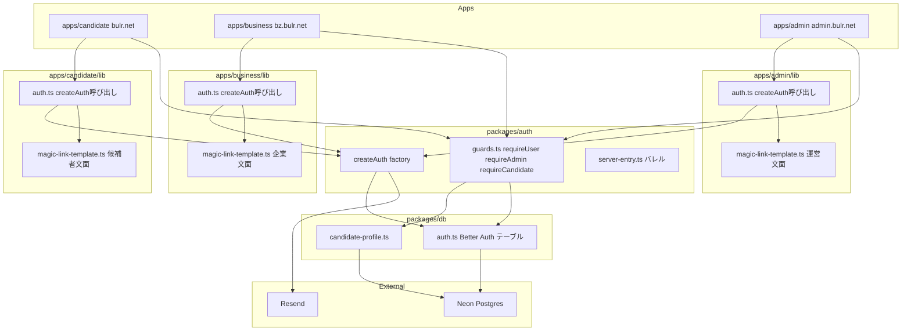
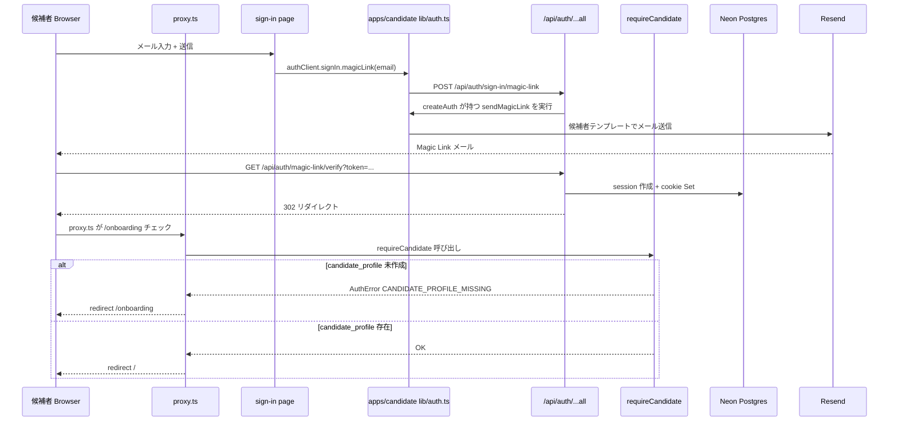
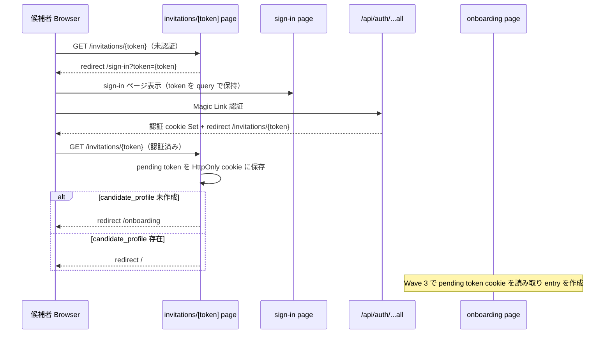

# Design Document — candidate-auth-onboarding

## Overview

本 spec は Wave 2 の起点となる feature で、候補者向けアプリ `apps/candidate`（bulr.net）に Magic Link サインインと初回オンボーディング動線を確立する。合わせて `packages/auth` を singleton から `createAuth({ sendMagicLink, ...overrides })` factory に refactor し、3 アプリが独自のメールテンプレートを注入できるよう再設計する。

**Users**: 候補者（bulr.net を利用するエンジニア求職者）が直接の受益者。開発者（後続 Wave 2 spec の実装者）は `requireCandidate` ガードと `candidate_profile` テーブルを利用する。

**Impact**: Wave 1 完了時点の `packages/auth` singleton を factory に切り替え、`apps/business` / `apps/admin` の既存動線は後方互換で維持する。`packages/db` に `candidate_profile` テーブルを新設し、`apps/candidate` にオンボーディング・招待トークン受け取りルートを追加する。

### Goals

- `packages/auth` を `createAuth({ sendMagicLink })` factory に refactor し、3 アプリが独自テンプレートを注入できるようにする
- 候補者が `bulr.net/sign-in` で Magic Link サインインでき、候補者向け文面のメールが届く
- 初回サインイン後に `/onboarding` で `candidate_profile` を 1 ステップで作成できる
- `requireCandidate` ガードが `packages/auth/server` から提供され、後続 spec が利用できる
- 招待リンク `/invitations/{token}` のトークン受け取り口（seam）が動作する
- `apps/business` / `apps/admin` の既存サインイン動線が factory 移行後も回帰しない

### Non-Goals

- `invitation` / `opening` / `entry` エンティティの実体作成（Wave 3 `company-and-opening` / `entry-flow`）
- 履歴書アップロード（`resume-registration`）・スキルアンケート（`skill-survey`）
- Stage 1 `candidate` テーブルの削除（Wave 3 `session-from-entry`）
- SSO・クロスドメイン cookie 共有（設計メモ §7 で明示的に却下済み）
- 候補者向け RBAC・プール管理 UI

---

## Boundary Commitments

### This Spec Owns

- `packages/auth` の `createAuth` factory 実装（`server.ts` の singleton 廃止と factory 化）
- `packages/auth/src/guards.ts` への `requireCandidate` 追加
- 3 アプリ別 `lib/magic-link-template.ts`（`apps/candidate` / `apps/business` / `apps/admin`）の新設と移設
- `packages/db/src/schema/candidate-profile.ts` 新設 + Drizzle migration
- `apps/candidate/app/sign-in` の候補者向け文言・UI 更新
- `apps/candidate/app/onboarding/page.tsx` 新設（`candidate_profile` 作成 1 ステップ）
- `apps/candidate/app/invitations/[token]/page.tsx` 新設（トークン受け取り口 + pending state 保持）
- `apps/candidate/lib/auth.ts` — `createAuth` を候補者テンプレートで呼び出す auth インスタンス
- `apps/candidate/proxy.ts` — `/onboarding` / `/invitations/*` を含む middleware リダイレクトルール
- Turborepo `turbo.json` の `build.env` 更新（候補者アプリ新規 env 追加）

### Out of Boundary

- `invitation` トークンの DB エンティティ・検証ロジック（Wave 3 `company-and-opening`）
- `entry` の作成（Wave 3 `entry-flow`）
- Stage 1 `candidate` テーブルの変更・廃止（Wave 3 `session-from-entry`）
- 候補者プロファイルの詳細編集 UI（Wave 2 後続 spec で段階的に拡張）
- 履歴書・スキルアンケート（後続 Wave 2 spec）

### Allowed Dependencies

- `packages/auth` → `packages/db`（`candidate_profile` クエリのため）
- `packages/auth` → Resend SDK、Better Auth 1.6.x（既存）
- `apps/candidate` → `@bulr/auth`、`@bulr/db`、`@bulr/ui`、`@bulr/types`（既存）
- 依存方向: `apps/* → packages/*` の単方向（`packages/*` から `apps/*` への参照は禁止）

### Revalidation Triggers

- `createAuth` シグネチャの変更（`sendMagicLink` 以外のオプション追加等）→ 3 アプリの `lib/auth.ts` を再確認
- `requireCandidate` の戻り値型変更 → `resume-registration` / `skill-survey` / `entry-flow` の全利用箇所を再確認
- `candidate_profile` スキーマへのカラム追加 → 後続 Wave 2/3/4 spec の `candidate_profile` 利用を再確認
- `apps/candidate` の `BETTER_AUTH_URL` 変更 → Magic Link コールバック URL を再確認

---

## Architecture

### Existing Architecture Analysis

Wave 1 完了時点の構成:

- `packages/auth/src/server.ts`: `export const auth = betterAuth(...)` という singleton。`sendMagicLink` 内でハードコードされた `apps/web/lib/email/templates/magic-link.ts` 相当の内容を使用（Wave 1 で `packages/auth/src/email/templates/magic-link.ts` に移管済み）。
- `packages/auth/src/guards.ts`: `requireUser` / `requireAdmin` / `requireSessionOwnership` を公開。`requireCandidate` は未実装。
- `packages/auth/src/server-entry.ts` (`@bulr/auth/server` subpath): `auth`・guard 関数・`authedAction`・`adminAction` を re-export。
- `apps/candidate`: サインインページとプレースホルダのみ。`lib/auth.ts` は `@bulr/auth/server` の `auth` singleton を直接 import している。

**変更点**:

1. `packages/auth/src/server.ts` の singleton を廃止し、`createAuth(config)` factory に置き換える
2. 既存の `packages/auth/src/email/templates/magic-link.ts`（business 文面）は `apps/business/lib/magic-link-template.ts` に移設し、`packages/auth` 内の shared template を削除する
3. 各アプリの `lib/auth.ts` が `createAuth` を呼び出し、独自の `sendMagicLink` 実装（各 `lib/magic-link-template.ts` を利用）を注入する

### Architecture Pattern & Boundary Map



**Key Decisions**:

- **Factory pattern**: `createAuth({ sendMagicLink, ...overrides })` を `packages/auth/src/server.ts` に実装。singleton export を廃止し、各アプリが自前の auth インスタンスを生成する。デフォルト値（cookie 属性・session 有効期限・DB アダプタ設定）は factory 内部で維持し、後方互換を保証する。
- **テンプレート所有権**: `packages/auth/src/email/templates/magic-link.ts`（Wave 1 で集約された shared template）を廃止し、各アプリが `lib/magic-link-template.ts` を所有する。`packages/auth` はテンプレート実体を持たない。
- **`requireCandidate` の実装位置**: `packages/auth/src/guards.ts` に追加。`candidate_profile` テーブルへのアクセスが必要なため、`packages/auth` が `packages/db` に依存する（既存の依存関係を維持）。
- **`__Secure-` cookie プレフィックス**: 本番 HTTPS 環境で Better Auth が自動付与する。`proxy.ts` の cookie 検査は `__Secure-` プレフィックス付き名と両方にフォールバックする（`feedback_better_auth_secure_cookie_prefix.md` の既存 convention に合わせる）。
- **招待トークン pending state**: サインイン前のトークンを `?token=` query で `/sign-in` に持ち回り、サインイン後は `Set-Cookie` でサーバー側 HttpOnly cookie に保存。クライアント JS からは読めない。Wave 3 の `entry-flow` がこの cookie を読み取って `entry` を作成する。

### Technology Stack

| Layer | 選択 / バージョン | 本 spec での役割 | 備考 |
|-------|-----------------|----------------|------|
| Auth | Better Auth 1.6.x | `createAuth` factory の基盤 | 既存バージョン、Magic Link plugin 同梱 |
| Email | Resend SDK ^4.0.0 | Magic Link 配信 | 各アプリの `sendMagicLink` から呼び出す |
| DB / ORM | Drizzle ORM 0.45.x + Neon Postgres | `candidate_profile` スキーマ追加 | 既存 DB 接続を継続利用 |
| Migration | drizzle-kit 0.31.x | `candidate_profile` migration 生成 | dev: push、prod: generate + migrate |
| Frontend | Next.js 16 App Router + React 19 | onboarding / invitations ページ | 既存バージョン |
| Validation | Zod 4.x | フォーム入力・Server Action 検証 | 既存 |
| Build | Turborepo + pnpm | `turbo.json` `build.env` 更新 | 既存 |

---

## File Structure Plan

### Directory Structure

```
bulr-app-mvp/
├── packages/
│   ├── auth/
│   │   └── src/
│   │       ├── server.ts                        # ★変更: singleton → createAuth factory
│   │       ├── guards.ts                        # ★変更: requireCandidate 追加
│   │       ├── server-entry.ts                  # ★変更: requireCandidate を re-export
│   │       └── email/
│   │           └── templates/
│   │               └── magic-link.ts            # ★削除: 各アプリに移設
│   └── db/
│       └── src/
│           └── schema/
│               ├── candidate-profile.ts         # ★新規: candidate_profile テーブル
│               └── index.ts                     # ★変更: candidate-profile の barrel export 追加
│
├── apps/
│   ├── candidate/
│   │   ├── proxy.ts                             # ★変更: /onboarding / /invitations/* リダイレクトルール追加
│   │   ├── lib/
│   │   │   ├── auth.ts                          # ★変更: createAuth を候補者テンプレートで呼び出す
│   │   │   └── magic-link-template.ts           # ★新規: 候補者向け Magic Link メールテンプレート
│   │   └── app/
│   │       ├── sign-in/
│   │       │   └── page.tsx                     # ★変更: 候補者向け文言・コピーに更新
│   │       ├── onboarding/
│   │       │   ├── page.tsx                     # ★新規: display_name 入力フォーム
│   │       │   └── _actions/
│   │       │       └── create-profile.ts        # ★新規: candidate_profile 作成 Server Action
│   │       └── invitations/
│   │           └── [token]/
│   │               └── page.tsx                 # ★新規: トークン受け取り口 + pending state 保持
│   │
│   ├── business/
│   │   └── lib/
│   │       ├── auth.ts                          # ★変更: createAuth を企業テンプレートで呼び出す
│   │       └── magic-link-template.ts           # ★新規: 企業向け Magic Link メールテンプレート（既存内容を移設）
│   │
│   └── admin/
│       └── lib/
│           ├── auth.ts                          # ★変更: createAuth を運営テンプレートで呼び出す
│           └── magic-link-template.ts           # ★新規: 運営向け Magic Link メールテンプレート
│
└── turbo.json                                   # ★変更: build.env に候補者アプリ用環境変数を追加
```

### Modified Files

- `packages/auth/src/server.ts` — singleton `export const auth = betterAuth(...)` を廃止し、`export function createAuth(config: CreateAuthConfig): Auth` を実装。`CreateAuthConfig` は `sendMagicLink` callback を必須とし、`overrides` を optional とする
- `packages/auth/src/guards.ts` — `requireCandidate` を追加。`candidate_profile` テーブルを `packages/db` から import してクエリする
- `packages/auth/src/server-entry.ts` — `requireCandidate` の re-export を追加
- `packages/auth/src/email/templates/magic-link.ts` — 削除（各アプリに移設）
- `packages/db/src/schema/index.ts` — `candidate-profile.ts` の barrel export を追加
- `apps/candidate/lib/auth.ts` — `createAuth` を import し、`candidateMagicLinkTemplate` を `sendMagicLink` として注入してインスタンスを export
- `apps/business/lib/auth.ts` — 同様に `createAuth` + `businessMagicLinkTemplate` でインスタンスを export
- `apps/admin/lib/auth.ts` — 同様に `createAuth` + `adminMagicLinkTemplate` でインスタンスを export
- `apps/candidate/proxy.ts` — matcher に `/onboarding` / `/invitations/:token*` を追加し、未認証時リダイレクトルールを更新
- `turbo.json` — `build.env` に `NEXT_PUBLIC_APP_URL`（apps/candidate 用）等を追加

---

## System Flows

### Magic Link サインインフロー（候補者）



### 招待トークン受け取りフロー



---

## Requirements Traceability

| 要件 | サマリー | コンポーネント | インターフェース | フロー |
|------|---------|--------------|--------------|------|
| 1.1〜1.6 | packages/auth factory 化 | `CreateAuthFactory`, `AuthServerEntry` | `createAuth(config)` | — |
| 2.1〜2.5 | アプリ別テンプレート | `CandidateMagicLinkTemplate`, `BusinessMagicLinkTemplate`, `AdminMagicLinkTemplate` | `renderMagicLinkEmail(url)` | Magic Link |
| 3.1〜3.5 | candidate_profile スキーマ | `CandidateProfileSchema`, `DrizzleMigration` | DB テーブル | — |
| 4.1〜4.6 | 候補者サインイン動線 | `CandidateSignInPage`, `CandidateAuthClient`, `CandidateProxy` | `/sign-in` | Magic Link |
| 5.1〜5.5 | 候補者オンボーディング | `OnboardingPage`, `CreateProfileAction`, `RequireCandidate` | `/onboarding` | — |
| 6.1〜6.5 | 招待トークン受け取り | `InvitationTokenPage` | `/invitations/[token]` | 招待トークン |
| 7.1〜7.5 | requireCandidate ガード | `RequireCandidate`, `AuthServerEntry` | `requireCandidate()` | — |
| 8.1〜8.4 | Turborepo build.env + 後方互換 | `TurboConfig`, 全 3 アプリ `lib/auth.ts` | `turbo.json` | — |

---

## Components and Interfaces

### コンポーネント一覧

| コンポーネント | ドメイン/レイヤー | 意図 | 要件カバレッジ | キー依存 | コントラクト |
|-------------|----------------|------|-------------|---------|------------|
| `CreateAuthFactory` | packages/auth | createAuth factory | 1.1〜1.6, 8.2, 8.4 | Better Auth, Resend | Service |
| `RequireCandidate` | packages/auth | requireCandidate ガード | 5.5, 7.1〜7.5 | packages/db | Service |
| `AuthServerEntry` | packages/auth | @bulr/auth/server バレル | 1.3, 7.3, 7.4 | CreateAuthFactory, RequireCandidate | Service |
| `CandidateMagicLinkTemplate` | apps/candidate/lib | 候補者向けメールテンプレート | 2.1, 2.4 | — | State |
| `BusinessMagicLinkTemplate` | apps/business/lib | 企業向けメールテンプレート（移設） | 2.2 | — | State |
| `AdminMagicLinkTemplate` | apps/admin/lib | 運営向けメールテンプレート | 2.3 | — | State |
| `CandidateProfileSchema` | packages/db | candidate_profile テーブル定義 | 3.1〜3.5 | Drizzle ORM | State |
| `CandidateSignInPage` | apps/candidate | 候補者サインイン UI | 4.1, 4.5, 4.6 | authClient | State |
| `OnboardingPage` | apps/candidate | プロフィール作成 UI | 5.1〜5.4 | CreateProfileAction | State |
| `CreateProfileAction` | apps/candidate | candidate_profile 作成 Server Action | 5.2, 5.3 | requireCandidate, packages/db | Service |
| `CandidateProxy` | apps/candidate | middleware リダイレクトルール | 4.3, 4.4, 5.1, 5.4, 6.1 | — | Service |
| `InvitationTokenPage` | apps/candidate | トークン受け取り口 | 6.1〜6.5 | authClient, pending cookie | State |
| `TurboConfig` | ルート | build.env 更新 | 8.1 | — | — |

### packages/auth

#### CreateAuthFactory

| フィールド | 詳細 |
|----------|------|
| Intent | `createAuth({ sendMagicLink, ...overrides })` factory を公開し、Better Auth インスタンスと型安全な auth オブジェクトを返す |
| Requirements | 1.1, 1.2, 1.4, 1.6, 8.2, 8.4 |

**Responsibilities & Constraints**

- `packages/auth/src/server.ts` で `export function createAuth(config: CreateAuthConfig)` として実装
- デフォルト設定（session.expiresIn: 7日、cookieOptions: HttpOnly/Secure/SameSite=Lax、drizzleAdapter）を内部で適用
- `config.sendMagicLink` を magicLink plugin の `sendMagicLink` オプションとして注入
- `BETTER_AUTH_SECRET` / `DATABASE_URL` が未設定なら初期化時に throw
- 既存 `export const auth = betterAuth(...)` singleton は廃止し、各アプリの `lib/auth.ts` が `createAuth` を呼び出す

**Dependencies**

- Inbound: 各アプリの `lib/auth.ts` (P0)
- Outbound: `packages/db` drizzleAdapter (P0), Better Auth 1.6.x (P0), `packages/db/schema/auth.ts` (P0)
- External: Resend SDK via `sendMagicLink` callback (P0)

**Contracts**: Service [x]

##### Service Interface

```typescript
// packages/auth/src/server.ts
type SendMagicLinkFn = (params: { email: string; url: string }, request?: Request) => Promise<void>;

interface CreateAuthConfig {
  sendMagicLink: SendMagicLinkFn;
  overrides?: Partial<BetterAuthOptions>;
}

export function createAuth(config: CreateAuthConfig): ReturnType<typeof betterAuth>;
```

- Preconditions: `BETTER_AUTH_SECRET` と `DATABASE_URL` が設定されていること
- Postconditions: 返却された auth インスタンスは Better Auth の全 API を提供する
- Invariants: Better Auth 管理テーブル（`user`/`session`/`account`/`verification`）に独自カラムを追加しない

**Implementation Notes**

- Integration: 各アプリの `lib/auth.ts` が `createAuth` を呼び出し、export した `auth` を `app/api/auth/[...all]/route.ts` でマウント
- Validation: 3 アプリの `pnpm typecheck` が通ること。`BETTER_AUTH_SECRET` 未設定時に実行時 throw が発生すること
- Risks: factory 移行後に既存 singleton import（`import { auth } from '@bulr/auth/server'` 等）が残っていると型エラーになる。grep で確認が必要

#### RequireCandidate

| フィールド | 詳細 |
|----------|------|
| Intent | 認証済み かつ `candidate_profile` 存在を確認する guard 関数 |
| Requirements | 5.5, 7.1, 7.2, 7.3, 7.4, 7.5 |

**Responsibilities & Constraints**

- `packages/auth/src/guards.ts` に `requireCandidate` を追加
- `requireUser()` を内部で呼び出し（`UNAUTHORIZED` の throw はそこに委譲）
- `candidate_profile` を user_id でクエリし、存在しない場合は `AuthError('CANDIDATE_PROFILE_MISSING')` を throw
- `import 'server-only'` を持つ server-only 関数
- `packages/db` の `candidateProfile` テーブルを直接 import（`packages/auth → packages/db` の既存依存方向を維持）

**Dependencies**

- Inbound: Server Component / Server Action / API Route Handler (P0)
- Outbound: `requireUser` (P0), `packages/db/schema/candidate-profile` (P0)

**Contracts**: Service [x]

##### Service Interface

```typescript
// packages/auth/src/guards.ts
export async function requireCandidate(): Promise<{
  user: User;
  session: Session;
  candidateProfile: CandidateProfile;
}>;

// throws:
//   AuthError('UNAUTHORIZED')         — session なし
//   AuthError('CANDIDATE_PROFILE_MISSING') — candidate_profile 未作成
```

### packages/db

#### CandidateProfileSchema

| フィールド | 詳細 |
|----------|------|
| Intent | `candidate_profile` テーブルの Drizzle スキーマ定義 |
| Requirements | 3.1, 3.2, 3.3, 3.5 |

**Responsibilities & Constraints**

- `packages/db/src/schema/candidate-profile.ts` に定義
- `user_id` に UNIQUE 制約（1:1 FK to `user.id`）
- Better Auth `user` テーブルに独自カラムを追加しない（既存方針を継続）
- Stage 1 `candidate` テーブルは触らない

**Physical Data Model**

```sql
candidate_profile (
  id           text        PRIMARY KEY,       -- nanoid
  user_id      text        NOT NULL UNIQUE,   -- FK to user.id
  display_name text        NOT NULL,
  headline     text,
  created_at   timestamp   NOT NULL DEFAULT now(),
  updated_at   timestamp   NOT NULL DEFAULT now()
)
```

```typescript
// packages/db/src/schema/candidate-profile.ts（概要）
import { pgTable, text, timestamp, uniqueIndex } from 'drizzle-orm/pg-core';
import { user } from './auth';

export const candidateProfile = pgTable('candidate_profile', {
  id: text('id').primaryKey(),
  userId: text('user_id').notNull().references(() => user.id).unique(),
  displayName: text('display_name').notNull(),
  headline: text('headline'),
  createdAt: timestamp('created_at').notNull().defaultNow(),
  updatedAt: timestamp('updated_at').notNull().defaultNow(),
});

export type CandidateProfile = typeof candidateProfile.$inferSelect;
export type NewCandidateProfile = typeof candidateProfile.$inferInsert;
```

### apps/candidate

#### OnboardingPage + CreateProfileAction

| フィールド | 詳細 |
|----------|------|
| Intent | 初回サインイン後に `display_name` を入力して `candidate_profile` を作成する 1 ステップフォーム |
| Requirements | 5.1, 5.2, 5.3, 5.4 |

**Responsibilities & Constraints**

- `apps/candidate/app/onboarding/page.tsx`: Server Component として `requireCandidate` を **呼ばず**（`candidate_profile` が未作成の状態でアクセスされる）、代わりに `requireUser` だけを呼ぶ
- `apps/candidate/app/onboarding/_actions/create-profile.ts`: `authedAction` でラップした Server Action。`display_name` を Zod で検証し `candidate_profile` を INSERT
- 作成後は `/` にリダイレクト

**Dependencies**

- Inbound: 認証済みユーザー（候補者）(P0)
- Outbound: `requireUser` (P0), `db.insert(candidateProfile)` (P0)

**Contracts**: Service [x]

##### Service Interface

```typescript
// apps/candidate/app/onboarding/_actions/create-profile.ts
const createCandidateProfileSchema = z.object({
  displayName: z.string().min(1).max(100).trim(),
});

export const createCandidateProfile = authedAction(
  createCandidateProfileSchema,
  async ({ displayName }, { userId }) => {
    await db.insert(candidateProfile).values({ id: nanoid(), userId, displayName });
    redirect('/');
  }
);
```

#### InvitationTokenPage

| フィールド | 詳細 |
|----------|------|
| Intent | `/invitations/{token}` にアクセスした候補者のトークンを pending state に保存し、適切な画面にリダイレクトする受け取り口 |
| Requirements | 6.1, 6.2, 6.3, 6.4, 6.5 |

**Responsibilities & Constraints**

- `apps/candidate/app/invitations/[token]/page.tsx`: Server Component
- 未認証の場合: `redirect('/sign-in?token=' + params.token)` で sign-in にトークンを引き継ぐ
- 認証済みの場合: `Set-Cookie` で `pending_invitation_token` を HttpOnly cookie に保存（Max-Age: 1時間）。その後 `candidate_profile` の有無に応じて `/onboarding` か `/` にリダイレクト
- トークンのフォーマット検証のみ行う（DB 照合なし）。Wave 3 の `entry-flow` が実際のトークン検証を行う

**Dependencies**

- Inbound: URL param `token` (P0)
- Outbound: `requireUser` または session 確認 (P0), HTTP `Set-Cookie` ヘッダー (P0)

**Contracts**: State [x]

#### candidateAction — Wave 2 スコープ外の明示

> **Wave 2 スコープ外**: `candidateAction`（`ctx` に `candidateProfileId` を公開する safe-action ラッパー）は Wave 2 では**導入しない**。
>
> 候補者向けアプリの Server Action で `candidate_profile.id` が必要な場合は、次のパターンを使うこと:
> 1. `authedAction` をバウンダリとして使用する（`ctx.userId` を取得）
> 2. action body 内で `requireCandidate()` を呼び出して `candidateProfile` を取得する
>
> ```typescript
> // 正しいパターン（Wave 2）
> export const createCandidateProfile = authedAction(
>   schema,
>   async (input, { userId }) => {
>     // userId は authedAction が提供
>     // candidateProfileId が必要な場合は requireCandidate() を呼ぶ
>     const { candidateProfile } = await requireCandidate();
>     // ...
>   }
> );
> ```
>
> **この決定の理由**: factory refactor を最小限に抑え、safe-action サーフェス領域を後続 spec（resume-registration / skill-survey / mock-interview）のニーズが固まる前に広げない。3 つ以上の Server Action が同一パターンを共有するようになった時点で、後続 Wave で `candidateAction` ラッパーを導入することを検討する。

#### CandidateProxy

| フィールド | 詳細 |
|----------|------|
| Intent | `apps/candidate/proxy.ts` の matcher とリダイレクトルールを拡張し、未認証 + `candidate_profile` 未作成のリダイレクトを処理する |
| Requirements | 4.3, 4.4, 5.1, 5.4, 6.1 |

**Responsibilities & Constraints**

- cookie 存在チェック（UX 用途、セキュリティは各 Server Component の guard 層に委譲。CVE-2025-29927 教訓）
- `/onboarding`: 未認証なら `/sign-in` にリダイレクト
- `/invitations/:token*`: 未認証なら `/sign-in?token={token}` にリダイレクト（Server Component でも同一処理を行う多層防御）
- `__Secure-` プレフィックス対応: session cookie 名を `better-auth.session_token` と `__Secure-better-auth.session_token` の両方でチェックする

---

## Error Handling

### Error Strategy

- 認証エラーは多層防御（proxy.ts → Server Component → Server Action）の各レイヤーで独立に処理
- `requireCandidate` が throw する `AuthError('CANDIDATE_PROFILE_MISSING')` は onboarding ページへの redirect でハンドリング
- `authedAction` ラッパーが `UNAUTHORIZED` を catch して redirect

### Error Categories and Responses

- **未認証アクセス** (UNAUTHORIZED): proxy.ts が `/sign-in` にリダイレクト
- **candidate_profile 未作成** (CANDIDATE_PROFILE_MISSING): middleware / Server Component が `/onboarding` にリダイレクト
- **フォーム検証エラー**: Zod parse 失敗時はフィールドエラーをクライアントに返す
- **レート制限超過**: Magic Link 送信時に `429` 相当の UI メッセージを表示

---

## Testing Strategy

### 手動 Smoke Test（Stage 1 方針）

本 spec は Stage 1 方針に沿い自動テストフレームワークを導入しない。完了確認は以下の手動 smoke test で行う。

1. **factory refactor の後方互換**
   - `pnpm --filter @bulr/business dev` を起動し、既存の面接官サインイン → セッション一覧 → 面接中 UI が動作すること
   - `pnpm --filter @bulr/admin dev` を起動し、管理者サインイン → セッション一覧が動作すること

2. **候補者サインイン**
   - `pnpm --filter @bulr/candidate dev` で候補者アプリを起動
   - `/sign-in` でメール送信 → 受信メールに候補者向け文面が含まれること
   - Magic Link クリック → 初回は `/onboarding` にリダイレクトされること

3. **オンボーディング**
   - `/onboarding` で `display_name` を入力して送信 → `candidate_profile` が作成され `/` にリダイレクトされること
   - 2 回目のサインイン → `/onboarding` をスキップして `/` に到達すること

4. **招待トークン受け取り**
   - 未認証状態で `/invitations/test-token-123` にアクセス → `/sign-in?token=test-token-123` にリダイレクトされること
   - サインイン後に `pending_invitation_token` cookie が設定されること

5. **ビルドとタイプチェック**
   - `pnpm build` が3アプリと全 packages で成功すること
   - `pnpm typecheck` が全 workspace で成功すること

---

## Security Considerations

- `requireCandidate` は多層防御の一部として実装し、proxy.ts のみに依存しない（CVE-2025-29927 教訓）
- 招待トークンを pending state に保存する cookie は `HttpOnly: true, Secure: true, SameSite: Lax, Path: /, Max-Age: 3600` を設定
- `__Secure-` プレフィックス付き cookie の扱いは既存 convention（`feedback_better_auth_secure_cookie_prefix.md`）に従う
- factory refactor 後も Magic Link のレート制限（email: 3回/5分、IP: 20回/時）は維持
- `packages/auth` の `createAuth` は `BETTER_AUTH_SECRET` 未設定時に即時 throw（Fail Secure）

---

## Migration Strategy

Factory refactor は段階的に実施する。

### Migration 命名規約（共存期の名前衝突回避）

- **Phase A（factory 導入、singleton 存続）**: factory は `createAuth` という**新しい名前**で export する。既存の `export const auth = betterAuth(...)` singleton は**そのまま変更しない**。2 つの名前は別物なので衝突しない。
- **Phase B（アプリ順次移行）**: 各アプリの `lib/auth.ts` が `import { auth } from '@bulr/auth/server'`（singleton）から `createAuth({ sendMagicLink })` 呼び出しに切り替える。移行順は business → admin → candidate。
- **Phase C（singleton 削除）**: 全アプリが `createAuth` 経由になった時点で、`packages/auth/src/server.ts` の `export const auth = ...` 行を**1 つのコミットで削除**する。削除コミットには 3 アプリの typecheck / build が通ることをスモークテストで確認してから merge する。

### 移行手順

1. `packages/auth/src/server.ts` に `createAuth` factory を追加（まず singleton と共存させる）
2. `apps/business/lib/auth.ts` を `createAuth` ベースに更新し、`pnpm --filter @bulr/business typecheck` で確認
3. `apps/admin/lib/auth.ts` を `createAuth` ベースに更新し、確認
4. `apps/candidate/lib/auth.ts` を `createAuth` ベースに更新し、確認
5. `packages/auth/src/server.ts` から旧 singleton export を削除
6. `packages/auth/src/email/templates/magic-link.ts` を削除（各アプリへの移設完了後）

### Rollback Triggers

- Phase 2〜4 でいずれかのアプリの typecheck が通らない → factory シグネチャ / デフォルト値設計を再確認
- 本番デプロイ後に Magic Link が届かない → `sendMagicLink` callback の環境変数（`RESEND_API_KEY`）を確認
