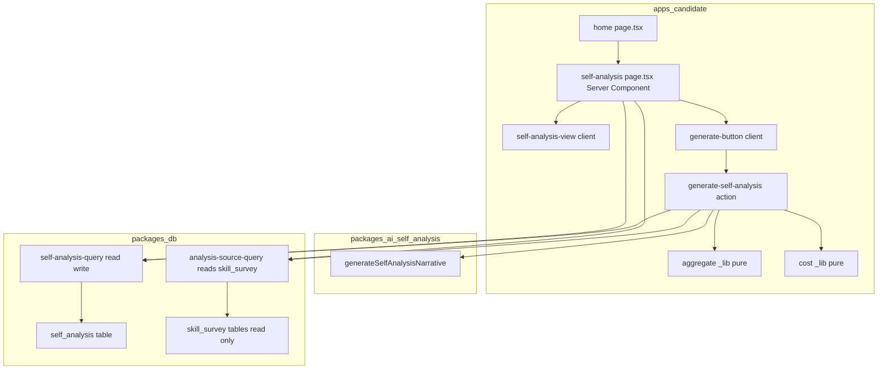
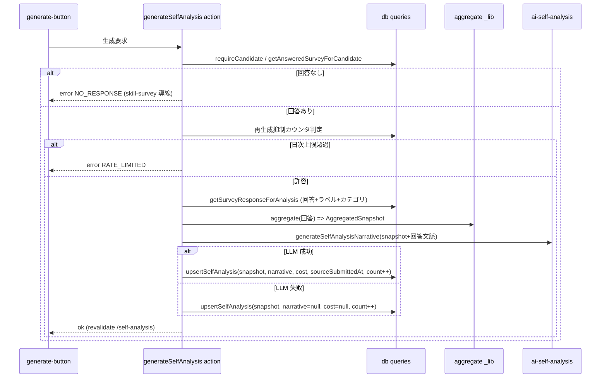
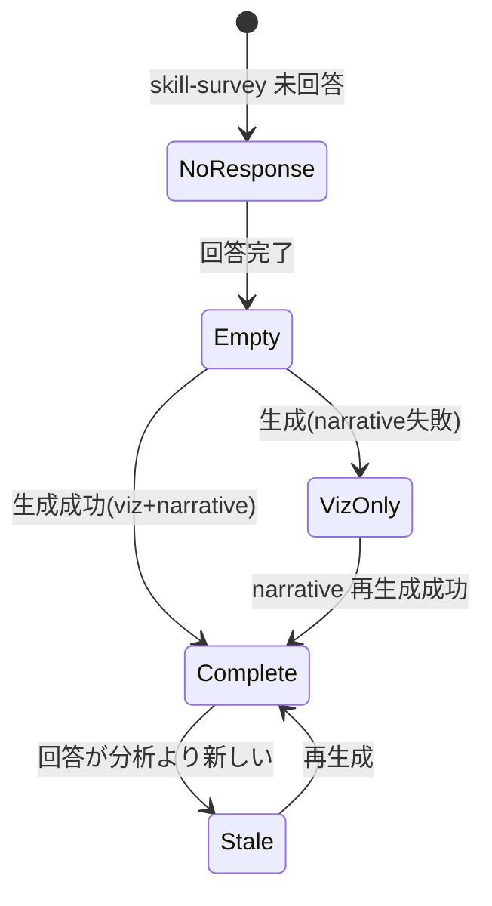

# Design Document — candidate-self-analysis

## Overview

**Purpose**: 候補者が skill-survey に入力した回答をもとに、強み・弱みの構造化された自己像（自己分析）を返し、自己成長の起点を提供する。可視化の素地は回答からの**決定論的集計**（網羅度・選択の広さ・自由記述の有無）、強み・弱みの自然言語サマリと成長アクション提案は**自然言語生成（LLM）**で作るハイブリッド方式。

**Users**: 候補者（`bulr.net`）が、skill-survey 回答後に `/self-analysis` で自分の自己分析を生成・閲覧・再生成する。

**Impact**: 候補者プロダクトに「自己診断」サーフェスを新設する。既存の skill-survey（回答データ）を**読み取り専用**で消費し、新規 `self_analysis` テーブル・新規 LLM パッケージ `@bulr/ai-self-analysis`・自己分析 UI を追加する。skill-survey のスキーマ・回答フォーム・結果 UI は変更しない。

### Goals

- 候補者の最新 skill-survey 回答から、網羅度の可視化＋強み弱みサマリ＋成長アクション提案を生成・永続化・再表示する
- 自然言語生成が失敗しても決定論的可視化は提供する（ハイブリッドの頑健性）
- 回答更新時の陳腐化提示と再生成、候補者所有・本人限定アクセス、コスト記録と再生成抑制を満たす

### Non-Goals

- mock-interview の形成的フィードバック・面接/entry 履歴を入力に含める統合（survey-only）
- 数値スコア化・偏差値・他者比較・ランキング
- L3 年収査定・キャリアパス/職種適性の本格診断
- skill-survey 回答フォーム・回答スキーマ・結果 UI の UX 洗練（skill-survey 拡張側）
- 運営（admin）向け自己分析監視 UI／admin `/monitoring` への自己分析コスト合流（admin-operations の downstream）
- 複数職種 survey の横断分析

## Boundary Commitments

### This Spec Owns

- `self_analysis` テーブル（スキーマ・マイグレーション・読み書きクエリ）と、その上の候補者所有データ
- skill-survey 回答を**自己分析用に読み出す consumer クエリ**（回答＋設問＋カテゴリ名＋選択肢ラベルの束ね。skill-survey テーブルを読むのみ）
- skill-survey 回答 → 強み弱み素地への**決定論的集計ロジック**（網羅度・選択の広さ・自由記述の有無）
- 強み弱みサマリ＋成長アクションの**自然言語生成**（新パッケージ `@bulr/ai-self-analysis`）
- 自己分析の生成・再生成オーケストレーション（Server Action）、陳腐化判定、再生成抑制（行内日次カウンタ）
- 自己分析 UI（網羅度可視化＋サマリ＋成長アクション＋再生成＋ローディング）と候補者ホームの導線（プレースホルダ解消）
- 自己分析の LLM コスト記録（`self_analysis.metadata.llm_cost_estimate`、既存形式と同形）

### Out of Boundary

- skill-survey のマスタ/回答スキーマ・回答フォーム・結果 UI（読み取りのみ。変更しない）
- mock-interview の `FormativeFeedback`・クォータ enforcement・`candidate_profile.quota_reset_at`（流用しない）
- admin `/monitoring` への自己分析コストの集計表示（admin-operations の downstream 変更）
- `skill_survey_choice` への習熟度/重みフィールド追加（採用しない。決定論層は網羅度に限定）

### Allowed Dependencies

- `packages/db`: skill-survey 読み出し（`getLatestResponseByCandidateProfileId` 等の既存資産・テーブル参照）、`candidate_profile` 参照、`self_analysis` 永続化
- `@bulr/auth`: `requireCandidate` / `authedAction`
- `packages/ai`（`claudeSonnet46` クライアント）を介した LLM 呼び出し。新パッケージ `@bulr/ai-self-analysis` は **`@bulr/db` に依存しない**（データは呼び出し側が DI）
- `@bulr/ui` / Tailwind（可視化は Tailwind ベース、charting lib は追加しない）
- 依存方向: `db schema → db queries → @bulr/ai-self-analysis(LLM, db非依存) → apps/candidate(action/page) → UI components`。上位（apps）→下位（packages）の単方向のみ。`@bulr/ai-self-analysis` から `@bulr/db` への逆流は禁止。

### Revalidation Triggers

- **skill-survey の回答スキーマ／読み出し query の形が変わる**（`skill_survey_response` / `skill_survey_answer` / 選択肢・カテゴリ構造、または `getLatestResponseByCandidateProfileId` の戻り形）→ consumer クエリと集計ロジックの再検証
- **`self_analysis` の `metadata.llm_cost_estimate` 形を変える** → admin-operations のコスト監視（将来合流時）の再検証
- **`@bulr/ai-self-analysis` の入出力契約を変える** → 呼び出し側 Server Action の再検証
- **コスト pricing 定数（$3/$15 per M）やモデル（`claude-sonnet-4-6`）を変える** → コスト記録・admin 集計の再検証

## Architecture

### Existing Architecture Analysis

- **skill-survey 読み出し**: `getLatestResponseByCandidateProfileId(candidateProfileId, surveyId): Promise<SkillSurveyResponseWithAnswers | null>`。戻りは回答＋設問（`questionType`/`categoryId`/`displayOrder`）。**カテゴリ名・選択肢ラベルは含まれない**ため別途 join が必要。回答は `(candidate, survey)` 一意・再回答で上書き（履歴なし、`submittedAt`/`updatedAt` のみ）。`skill_survey_choice` に習熟度フィールドは無い。
- **LLM パターン**: `@bulr/ai-mock`（deps: `ai@6`/`@ai-sdk/anthropic@3`/`zod@4`/`@bulr/ai`、`@bulr/db` 非依存）。`generateXxx(input): Promise<{output, usage:{input_tokens,output_tokens}}>`、`generateObject({model: claudeSonnet46, schema, system, prompt, maxRetries:2})`。`claudeSonnet46 = anthropic('claude-sonnet-4-6')`（`packages/ai/src/client.ts`、`ANTHROPIC_API_KEY`）。
- **コスト記録**: `estimated_usd = (input*3 + output*15)/1_000_000`、`metadata.llm_cost_estimate = {input_tokens, output_tokens, estimated_usd}`。
- **候補者規約**: `requireCandidate(): {user, session, candidateProfile}`（UNAUTHORIZED→/sign-in、CANDIDATE_PROFILE_MISSING→/onboarding）。`authedAction(schema, handler): (raw)=>Promise<{ok:true,data}|{ok:false,error:{code,message}}>`。ページ規約 `page.tsx`(Server,guard)＋`_components/`＋`_actions/`。
- **UI**: `@bulr/ui`（Card*/Button/...）＋ Tailwind v4。charting lib 無し。home の「Wave 2 以降で…自己診断…追加予定」プレースホルダ（`apps/candidate/app/page.tsx`）。

### Architecture Pattern & Boundary Map

**Selected pattern**: 層分離オーケストレーション。Server Action が「読み出し（db）→ 決定論的集計（純関数）→ LLM 生成（db 非依存パッケージ）→ 永続化（db）」を束ねる。決定論層と LLM 層を分離し、LLM 失敗時も決定論結果を保持する（R4）。



**Boundary**: `@bulr/ai-self-analysis` は受け取ったデータだけで生成し DB を見ない（DI）。集計（`aggregate`）は純関数で apps 内に置く（DB 非依存・テスト容易）。skill-survey テーブルへの書き込みは行わない。

### Technology Stack

| Layer | Choice / Version | Role in Feature | Notes |
| --- | --- | --- | --- |
| Frontend | Next.js 16 App Router / React 19 / Tailwind v4 / `@bulr/ui` | 自己分析ページ・可視化（Tailwind バー）・生成/再生成 UI | charting lib は追加しない |
| Backend | Next.js Server Actions（`authedAction`）＋純関数集計 | 生成オーケストレーション・陳腐化・再生成抑制 | LLM は単発呼び出し、inline await |
| AI | `@bulr/ai-self-analysis`（新規）＝ `ai@6` + `@ai-sdk/anthropic@3` + `zod@4` + `@bulr/ai`（`claude-sonnet-4-6`） | 強み弱みサマリ＋成長アクション生成（structured output） | `@bulr/db` 非依存・DI |
| Data | Drizzle ORM 0.45 / Postgres（`self_analysis` 新規） | 自己分析の永続化・候補者所有・再生成抑制カウンタ | skill-survey は read-only 参照 |

## File Structure Plan

### Directory Structure

```
packages/db/src/schema/
└── self-analysis.ts                 # NEW: self_analysis テーブル + 型(AggregatedSnapshot/SelfAnalysisNarrative/Metadata)
packages/db/drizzle/
└── 00NN_<name>.sql                  # NEW: self_analysis マイグレーション
packages/db/src/queries/self-analysis/
├── index.ts                         # NEW: barrel
├── analysis-source-query.ts         # NEW: getAnsweredSurveyForCandidate / getSurveyResponseForAnalysis (skill_survey を read-only join、カテゴリ名+選択肢ラベル束ね)
└── self-analysis-query.ts           # NEW: getSelfAnalysis / upsertSelfAnalysis / updateNarrative / 再生成抑制カウンタ判定

packages/ai/self-analysis/           # NEW package: @bulr/ai-self-analysis (db非依存)
├── package.json
├── tsconfig.json
└── src/
    ├── index.ts                     # barrel
    ├── schema.ts                    # Zod 出力スキーマ + 入出力型
    └── generate-self-analysis.ts    # generateSelfAnalysisNarrative(input): {output, usage}

apps/candidate/app/self-analysis/
├── page.tsx                         # NEW: Server Component (requireCandidate, 状態分岐)
├── _lib/
│   ├── aggregate.ts                 # NEW: 決定論的集計(純関数)
│   └── cost.ts                      # NEW: estimated_usd 計算(純関数, pricing定数)
├── _actions/
│   └── generate-self-analysis.ts    # NEW: generateSelfAnalysis / regenerateNarrative (authedAction)
└── _components/
    ├── self-analysis-view.tsx       # NEW: 網羅度可視化+サマリ+成長アクション表示
    ├── coverage-bars.tsx            # NEW: Tailwind 網羅度バー(決定論スナップショット描画)
    └── generate-button.tsx          # NEW: 生成/再生成 CTA(client, pending/エラー表示)
```

### Modified Files

- `apps/candidate/app/page.tsx` — 「Wave 2 以降で…自己診断…予定」プレースホルダを `/self-analysis` への導線（タイル/リンク。前提として skill-survey 回答が必要な旨）に置換
- `packages/db/src/schema/index.ts` — `self-analysis` スキーマを export
- `packages/db/src/queries/index.ts` — `queries/self-analysis` を export（既存 export は保持・APPEND-ONLY）

## System Flows

### 生成フロー（Server Action）



決定論集計を先に確定・永続化し、LLM 失敗時も `aggregated_snapshot` は残す（R4.1）。`regenerateNarrative` は保存済み `aggregated_snapshot` を入力に LLM のみ再実行し `llm_output`/`metadata` を更新（R4.3）。

### 表示状態（陳腐化・部分失敗）



陳腐化判定: 最新 `response.submittedAt` > `self_analysis.source_submitted_at`（R5.1）。

## Requirements Traceability

| Requirement | Summary | Components | Interfaces | Flows |
| --- | --- | --- | --- | --- |
| 1.1, 1.4, 1.5 | 最新回答入力で生成・生成中表示・版記録 | generate action / page / generate-button | `generateSelfAnalysis` / `getAnsweredSurveyForCandidate` | 生成フロー |
| 1.2 | 入力は当該候補者の survey 回答のみ | analysis-source-query / generate action | `getSurveyResponseForAnalysis` | 生成フロー |
| 1.3 | 未回答時は skill-survey 導線 | page / generate action | error `NO_RESPONSE` | 生成フロー(分岐) |
| 2.1, 2.2, 2.3 | 決定論的網羅度可視化・同一入力→同一・スコア/比較なし | aggregate _lib / coverage-bars | `aggregate(): AggregatedSnapshot` | 表示状態 |
| 3.1, 3.2, 3.3, 3.4 | 強み弱みサマリ＋成長アクション・スコア/比較なし | ai-self-analysis / self-analysis-view | `generateSelfAnalysisNarrative` / Zod schema | 生成フロー |
| 4.1, 4.2, 4.3 | LLM 失敗時も可視化保持・部分再試行 | generate/regenerate action / self-analysis-view | `regenerateNarrative` / `upsertSelfAnalysis(narrative=null)` | 生成フロー / 表示状態 |
| 5.1, 5.2, 5.3 | 陳腐化提示・再生成・直近表示 | page / self-analysis-query | `getSelfAnalysis` / staleness 比較 | 表示状態 |
| 6.1, 6.2, 6.3 | 候補者紐付け永続化・所有・再訪表示 | self_analysis table / self-analysis-query | `upsertSelfAnalysis` / `getSelfAnalysis` | — |
| 7.1, 7.2 | 未認証拒否・本人限定 | page / generate action | `requireCandidate` / ownership filter | — |
| 8.1, 8.2 | ナビ導線・未生成時案内 | home page / page | `<Link href="/self-analysis">` | — |
| 9.1, 9.2, 9.3 | コスト記録・形式整合・再生成抑制 | cost _lib / self-analysis-query | `llm_cost_estimate` / 日次カウンタ | 生成フロー(分岐) |

## Components and Interfaces

| Component | Layer | Intent | Req | Key Dependencies | Contracts |
| --- | --- | --- | --- | --- | --- |
| analysis-source-query | db/queries | 自己分析用に skill-survey 回答を read-only 束ね | 1.2, 2.x | skill_survey* (P0) | Service |
| self-analysis-query | db/queries | self_analysis 読み書き・抑制カウンタ | 5.x,6.x,9.3 | self_analysis (P0) | Service, State |
| self_analysis (schema) | db/schema | 自己分析の永続化形 | 6.x,9.1 | candidate_profile (P0) | State |
| @bulr/ai-self-analysis | packages/ai | 強み弱みサマリ＋成長アクション生成 | 3.x | @bulr/ai (P0) | Service |
| aggregate _lib | apps/candidate | 決定論的集計(純関数) | 2.x | — | Service |
| cost _lib | apps/candidate | estimated_usd 計算(純関数) | 9.1 | — | Service |
| generate-self-analysis action | apps/candidate | 生成/再生成オーケストレーション | 1.x,4.x,9.3 | 上記全て (P0) | Service |
| self-analysis page | apps/candidate | 状態分岐表示・guard | 1.3,5.x,7.x,8.2 | self-analysis-query (P0) | — |
| self-analysis-view / coverage-bars / generate-button | apps/candidate UI | 可視化・サマリ・CTA | 2.x,3.x,4.x,8.x | — | State |

### db/queries

#### analysis-source-query

| Field | Detail |
| --- | --- |
| Intent | skill-survey の最新回答を、カテゴリ名・選択肢ラベル付きで自己分析用に束ねて返す（read-only） |
| Requirements | 1.2, 2.1 |

**Responsibilities & Constraints**: skill_survey 系テーブルを **読むだけ**（書き込み禁止＝boundary）。`getLatestResponseByCandidateProfileId` の結果に `skill_survey_category.name` と `skill_survey_choice.label` を join して付与。`getAnsweredSurveyForCandidate` は候補者が回答済みの survey を1件特定（複数回答時は最新 `submittedAt`）。

**Dependencies**: Outbound: skill_survey/category/question/choice/response/answer テーブル（P0, read-only）

**Contracts**: Service ✓

##### Service Interface

```typescript
interface AnswerForAnalysis {
  questionId: string;
  categoryName: string;
  questionBody: string;
  questionType: 'single_choice' | 'multi_choice' | 'free_text';
  selectedLabels: string[]; // selectedChoiceIds をラベル解決した結果
  freeText: string | null;
}

interface SurveyResponseForAnalysis {
  surveyId: string;
  jobType: string;
  responseId: string;
  submittedAt: Date;
  categories: Array<{ categoryName: string; totalQuestions: number; answers: AnswerForAnalysis[] }>;
}

interface AnalysisSourceQuery {
  getAnsweredSurveyForCandidate(candidateProfileId: string): Promise<{ surveyId: string; jobType: string; submittedAt: Date } | null>;
  getSurveyResponseForAnalysis(candidateProfileId: string, surveyId: string): Promise<SurveyResponseForAnalysis | null>;
}
```

- Preconditions: `candidateProfileId` は認証済み候補者のもの
- Postconditions: skill-survey データは不変（read-only）
- Invariants: 戻り値は当該候補者の回答のみ

#### self-analysis-query

**Responsibilities & Constraints**: `self_analysis` の read/write、`(candidate_profile_id, skill_survey_id)` 一意での upsert（再生成は上書き）、再生成抑制の行内日次カウンタ判定（mock の `quota_reset_at` は使わない）。本人所有フィルタ。

**Contracts**: Service ✓ / State ✓

##### Service Interface

```typescript
interface SelfAnalysisRecord {
  id: string;
  candidateProfileId: string;
  skillSurveyId: string;
  sourceResponseId: string;
  sourceSubmittedAt: Date;       // 陳腐化判定用スナップショット
  aggregatedSnapshot: AggregatedSnapshot;
  llmOutput: SelfAnalysisNarrative | null; // null = 自然言語部分が未生成/失敗
  metadata: SelfAnalysisMetadata | null;   // llm_cost_estimate
  regenerationCount: number;
  regenerationWindowStart: Date;
  createdAt: Date;
  updatedAt: Date;
}

type RateLimitVerdict = { allowed: true; nextCount: number; windowStart: Date } | { allowed: false };

interface SelfAnalysisQuery {
  getSelfAnalysis(candidateProfileId: string, skillSurveyId: string): Promise<SelfAnalysisRecord | null>;
  // 日次上限判定（現在の行状態から）。行が無ければ allowed:true, nextCount:1
  checkRegenerationAllowed(candidateProfileId: string, skillSurveyId: string): Promise<RateLimitVerdict>;
  upsertSelfAnalysis(input: {
    candidateProfileId: string; skillSurveyId: string; sourceResponseId: string; sourceSubmittedAt: Date;
    aggregatedSnapshot: AggregatedSnapshot; llmOutput: SelfAnalysisNarrative | null;
    metadata: SelfAnalysisMetadata | null; regenerationCount: number; regenerationWindowStart: Date;
  }): Promise<SelfAnalysisRecord>;
  // narrative のみ再生成（aggregated_snapshot は保持）
  updateNarrative(id: string, llmOutput: SelfAnalysisNarrative, metadata: SelfAnalysisMetadata): Promise<void>;
}
```

- Invariants: 1 候補者 × 1 survey につき最新 1 件。`updateNarrative` は `aggregated_snapshot`/`source_submitted_at` を変更しない

### packages/ai — @bulr/ai-self-analysis

**Responsibilities & Constraints**: 渡された集計スナップショット＋回答文脈から強み・弱みサマリと成長アクションを `generateObject` で生成。**DB に触れない**（DI）。数値スコア・他者比較を出力に含めない。`{output, usage}` を返す。

**Grounding（回答内容への限定・R3.3）**:
- LLM への入力は**当該候補者の回答由来データのみ**（`aggregated` の網羅度＋`answers` の選択ラベル/自由記述）。職種一般論・外部知識・他候補者データは入力に含めない。
- system プロンプトで次を明示制約: (a) 強みは**入力に存在する選択ラベル/自由記述に紐づけて**言及し、回答に無いスキル・経験を断定しない、(b) 弱み/手薄領域は「未選択・低網羅・自由記述の薄さ」として記述し憶測の断定をしない、(c) 数値スコア・偏差値・他者比較・順位付けを出力しない。
- 出力の根拠が入力に見当たらない場合は、断定を避け一般的な次の一歩として `growthActions` 側に寄せる（強みの捏造より保守的に倒す）。
- Zod はあくまで形（`strengths/weaknesses/growthActions: string[]`）の保証であり、根拠づけはプロンプト制約と入力限定で担保する（モデルが根拠不明な強みを返した場合のリスクは残存＝Open Risk、本 spec では入力限定＋プロンプトで緩和）。

**Dependencies**: Outbound: `@bulr/ai`(`claudeSonnet46`) (P0) / External: `ai`,`@ai-sdk/anthropic`,`zod`

**Contracts**: Service ✓

##### Service Interface

```typescript
interface SelfAnalysisGenInput {
  jobType: string;
  aggregated: AggregatedSnapshot;          // 網羅度等（決定論結果）
  answers: Array<{ categoryName: string; questionBody: string; selectedLabels: string[]; freeText: string | null }>;
}
interface SelfAnalysisNarrative {
  strengths: string[];        // 強み（各 max ~300 字）
  weaknesses: string[];       // 弱み/手薄な領域
  growthActions: string[];    // 次に伸ばすべき点・具体的な次の一歩
}
interface SelfAnalysisGenResult {
  output: SelfAnalysisNarrative;
  usage: { input_tokens: number; output_tokens: number };
}
function generateSelfAnalysisNarrative(input: SelfAnalysisGenInput): Promise<SelfAnalysisGenResult>;
```

- Postconditions: `output` は入力回答に根拠づけられ（R3.3、上記 Grounding）、数値スコア・順位・他者比較を含めない（Zod は文字列配列のみ）
- Implementation Notes: `generateObject({ model: claudeSonnet46, schema, system, prompt, maxRetries: 2 })`、`@bulr/ai-mock` 踏襲。`system` プロンプトに Grounding 制約を組み込む

### apps/candidate

#### aggregate _lib（決定論的集計）

```typescript
interface CategoryCoverage {
  categoryName: string;
  answeredQuestions: number;
  totalQuestions: number;
  coverageRatio: number;           // answered/total（0..1、可視化用）
  selectedBreadth: number;         // 選択肢選択の総数（広さ）
  freeTextPresence: boolean;       // 自由記述の有無
}
interface AggregatedSnapshot {
  jobType: string;
  categories: CategoryCoverage[];
  overallCoverageRatio: number;
}
function aggregate(source: SurveyResponseForAnalysis): AggregatedSnapshot; // 純関数・同一入力→同一出力(2.2)
```

- スコア化・他者比較を含めない（カバレッジ比率は自己内の網羅度であり序列化でない、2.3）

#### cost _lib

```typescript
const SELF_ANALYSIS_INPUT_USD_PER_M = 3;   // claude-sonnet-4-6
const SELF_ANALYSIS_OUTPUT_USD_PER_M = 15;
function estimateUsd(usage: { input_tokens: number; output_tokens: number }): number; // (in*3+out*15)/1e6
```

#### generate-self-analysis action

**Contracts**: Service ✓

```typescript
// authedAction でラップ。handler 冒頭で requireCandidate()。
const generateSelfAnalysis: (raw: unknown) => Promise<Result<{ status: 'complete' | 'viz_only' }>>;
const regenerateNarrative: (raw: { /* skillSurveyId */ }) => Promise<Result<{ status: 'complete' | 'viz_only' }>>;
```

- 抑制: `checkRegenerationAllowed` → `allowed:false` なら `RATE_LIMITED`（9.3）
- 未回答: `getAnsweredSurveyForCandidate` が null → `NO_RESPONSE`（1.3）
- LLM 失敗: try/catch で `llmOutput=null, metadata=null` で upsert（4.1/4.2）、`status: 'viz_only'`
- 成功時 `revalidatePath('/self-analysis')`

#### self-analysis page / UI components（summary-only）

- `page.tsx`: `requireCandidate`（7.1/7.2、AuthError→/sign-in,/onboarding）。`getAnsweredSurveyForCandidate` / `getSelfAnalysis` / 最新 `submittedAt` を取得し状態分岐（NoResponse / Empty / Complete / VizOnly / Stale）。
- `coverage-bars.tsx`: `AggregatedSnapshot.categories` を Tailwind バーで描画（網羅度・広さ・自由記述有無）。数値スコア/比較は出さない（2.3）。
- `self-analysis-view.tsx`: 可視化＋強み/弱み/成長アクション（`llmOutput`）。`llmOutput===null` のとき viz＋「サマリ再生成」。Stale バナー＋再生成。
- `generate-button.tsx`: `generateSelfAnalysis`/`regenerateNarrative` を呼ぶ client。pending 表示（mock の「準備中」相当）、`Result` を2段階で読む（`result.ok` → `result.data`）。

## Data Models

### Logical Data Model

`self_analysis` (1) ── (N は持たない、最新1件) ── `candidate_profile`。`source_response_id` → `skill_survey_response`、`skill_survey_id` → `skill_survey`。一意制約 `(candidate_profile_id, skill_survey_id)`。`candidate_profile` 削除で cascade。

### Physical Data Model

```sql
CREATE TABLE self_analysis (
  id                         text PRIMARY KEY,
  candidate_profile_id       text NOT NULL REFERENCES candidate_profile(id) ON DELETE CASCADE,
  skill_survey_id            text NOT NULL REFERENCES skill_survey(id),
  source_response_id         text NOT NULL REFERENCES skill_survey_response(id),
  source_submitted_at        timestamptz NOT NULL,            -- 陳腐化判定(5.1)
  aggregated_snapshot        jsonb NOT NULL,                  -- AggregatedSnapshot(2.x,4.1で保持)
  llm_output                 jsonb,                           -- SelfAnalysisNarrative | null(4.x)
  metadata                   jsonb,                           -- { llm_cost_estimate }(9.1) | null
  regeneration_count         integer NOT NULL DEFAULT 0,      -- 抑制(9.3)
  regeneration_window_start  timestamptz NOT NULL DEFAULT now(),
  created_at                 timestamptz NOT NULL DEFAULT now(),
  updated_at                 timestamptz NOT NULL DEFAULT now()
);
CREATE UNIQUE INDEX self_analysis_candidate_survey_idx ON self_analysis (candidate_profile_id, skill_survey_id);
```

`metadata` 形（admin 監視と同形・形式整合 9.2）:

```typescript
interface SelfAnalysisMetadata { llm_cost_estimate: { input_tokens: number; output_tokens: number; estimated_usd: number } }
```

## Error Handling

### Error Strategy

`authedAction` の `Result` でユーザーエラーを返し、UI が2段階読みで分岐。LLM 失敗は決定論結果を保持する graceful degradation。

### Error Categories and Responses

- **User Errors**: `NO_RESPONSE`（未回答→skill-survey 導線, 1.3）／`RATE_LIMITED`（日次上限→時間を置く案内, 9.3）／未認証（7.1, page で redirect）
- **System Errors**: LLM 生成失敗 → `viz_only`（可視化保持＋再試行, 4.1/4.2）。集計（決定論）は DB read のみで失敗は通常の DB エラーとして扱う
- **Business Logic Errors**: 本人以外の自己分析アクセス不可（7.2、クエリは candidate_profile_id 固定）

### Monitoring

`self_analysis.metadata.llm_cost_estimate` にコスト記録（9.1）。admin `/monitoring` への集計表示は admin-operations の downstream（本 spec では記録のみ）。

## Testing Strategy

> 本リポジトリはテストフレームワーク未導入。検証は `pnpm typecheck` + `pnpm build` + 手動スモークで行う（既存 spec 踏襲）。下記は手動検証項目として実施。

- **Unit（純関数・手動/型）**: `aggregate()` が同一入力→同一出力（2.2）／カバレッジ比率・広さ・自由記述有無の算出が正しい／`estimateUsd()` が $3/$15 式に一致（9.1）
- **Integration（手動スモーク）**: 回答あり→生成→viz＋サマリ＋成長アクション表示（1.x,2.x,3.x）／回答なし→`NO_RESPONSE` 導線（1.3）／LLM 失敗注入時に viz_only＋再試行（4.1/4.3）／回答更新後に Stale 表示→再生成（5.x）／再訪で再生成なし表示（6.3）／日次上限で `RATE_LIMITED`（9.3）
- **E2E/UI（手動）**: 未認証アクセス→/sign-in（7.1）／他候補者データ非表示（7.2）／home 導線から到達（8.x）／生成中ローディング表示（1.4）
- **出力検証**: サマリ・成長アクション・可視化に数値スコア/他者比較が出ない（2.3, 3.4）

## Security Considerations

- 候補者所有データ。`page.tsx` と action handler 双方で `requireCandidate`、クエリは `candidate_profile_id` 固定で本人のみ（7.x）。
- `ANTHROPIC_API_KEY` はサーバ側のみ（既存 `@bulr/ai` 経由、クライアントへ露出しない）。
- 入力は zod 検証（`authedAction` schema）。

## Performance & Scalability

- LLM 生成は数秒オーダーの単発呼び出し。`page` 表示は永続化済みデータの即時表示（生成は明示操作）。生成中は pending UI（1.4）。
- 再生成抑制（行内日次カウンタ）でコスト暴走を防止（9.3）。決定論集計は DB read のみで軽量。
