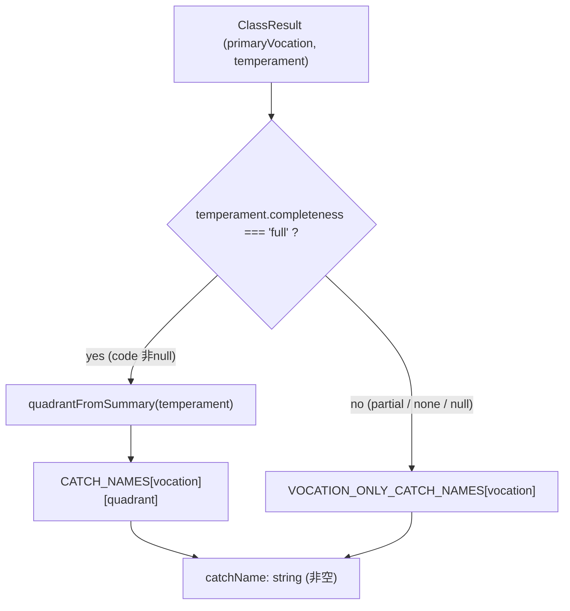

# Design Document — class-catch-names

## Overview

RPGクラス診断の結果に、短くキャッチーな「キャッチ名（異名）」を付与する。主職掌（7）と気質象限（探索⇔深化 × 個人⇔協調 の4）の組み合わせに対応する完全個別 authoring の命名テーブルから、表示時に決定論的に導出する。結果カードと共有テキストではキャッチ名をヒーロー見出しにし、従来の説明的 `className`（例「スペシャリスト・地図職人な前衛」）は副題として残して説明性を維持する。

**Purpose**: 候補者に「クラス名らしい」愛着と共有意欲をもたらす。
**Users**: candidate アプリでクラス診断を閲覧する候補者本人。
**Impact**: 既存 `ClassResult` フィールドのみから表示時に導出するため、契約型・DBスキーマ・既存レコードは変更しない。反映先は `ClassCard`（h2 ヒーロー）と `SharePanel.toShareText`（先頭行）の2箇所のみ。

### Goals

- 確定気質（`completeness==='full'`）で 7×4=28 のキャッチ名を決定論的に付与する。
- 気質未確定（partial/none/null）で職掌単独7名へフォールバックし、常に非空のキャッチ名を返す。
- マイグレーション・型変更・バックフィルなしで既存レコードにも適用する。
- 命名テーブルを1ファイルに集約し、`Record` 型でキー網羅をコンパイル時保証する。

### Non-Goals

- LLM 生成フレーバー（`ClassFlavor` の tagline/description/nextStepHint）の変更。
- `ClassResult` 等の契約型変更・DBマイグレーション。
- business アプリ・Phase2 以降への反映（将来 `resolveCatchName` を再利用可能にするのみ）。
- バックログ #5（vocation-radar の気質2軸可視化）・#6（判定閾値の実データ校正）。

## Boundary Commitments

### This Spec Owns

- キャッチ名の命名テーブル（`CATCH_NAMES` 28 + `VOCATION_ONLY_CATCH_NAMES` 7）と、それを解決する純関数 `resolveCatchName`。
- 気質 code → 気質象限（`TemperamentQuadrant`）の写像。
- `ClassCard`・`SharePanel` におけるキャッチ名の表示位置（ヒーロー／先頭行）と `className` の副題化。

### Out of Boundary

- 気質・職掌・称号の算出ロジック（`_lib/temperament/*`, `class-diagnosis/_lib/{vocation,title,assemble}.ts`）。読み取りのみ。
- LLM フレーバー生成（`@bulr/ai-class-diagnosis`）と Server Action。
- business の `representative-class-section.tsx`（read-only 表示、今回変更しない）。

### Allowed Dependencies

- `@bulr/types`（`Vocation`, `TemperamentSummary`, `TemperamentCode`, `ExplorationPole`, `SocialPole`）— 型のみ。
- app-local `class-diagnosis/_lib/definitions.ts`（`VOCATIONS` 等の再利用は任意）。
- 依存方向は `app → @bulr/types` の単方向のみ。上位（db/ai）へは依存しない。

### Revalidation Triggers

- `Vocation` union の増減（例: 賢者/策士 survey 開放 = バックログ#3）→ `CATCH_NAMES`/`VOCATION_ONLY_CATCH_NAMES` のキーが増え、コンパイルエラーで検出される（対応必須）。
- `TemperamentCode` の軸順・極 union の変更 → 象限写像の再確認。
- `ClassResult.className` の意味変更 → 副題表示の再確認。

## Architecture

### Existing Architecture Analysis

- 判定は純関数パイプライン（`foldVocations → scoreTemperament → resolveTitle → assembleClass`）で `ClassResult` を組成、`className` は `assembleClass`/`composeClassName` が決定論的に生成（R7.2 契約）。
- 表示は Presentational コンポーネント（`ClassCard`/`SharePanel`）が `ClassResult` を受けて描画。数値スコア非表示（R4.4）・共有は PII/数値なし（R5.2）が既存制約。
- 本機能は**判定パイプラインに触れず**、表示層に「導出＋表示」を薄く足すだけ。`className` の生成契約は不変。

### Dependency Direction

```
@bulr/types (Vocation / TemperamentSummary / TemperamentCode)
        │
        ▼
class-diagnosis/_lib/catch-name.ts   ← 新設（純関数・命名テーブル）
        │
        ▼
_components/class-card.tsx , _components/share-panel.tsx  ← 反映先
```

- `catch-name.ts` は型のみを import する純モジュール（`'use client'` 不要・Server 互換）。
- コンポーネントは `catch-name.ts` を import。逆方向依存は禁止。

### Resolution Flow



- ゲート条件は現行 `composeClassName` の full ゲート（気質を className に埋め込む条件）と一致させ、キャッチ名と className の気質反映粒度を揃える。

## File Structure Plan

### New Files

```
apps/candidate/app/class-diagnosis/_lib/
├── catch-name.ts        # 命名テーブル(CATCH_NAMES / VOCATION_ONLY_CATCH_NAMES)、
│                        #   TemperamentQuadrant 型、quadrantFromSummary、resolveCatchName
└── catch-name.test.ts   # 純関数の網羅・決定論・フォールバック検証
```

### Modified Files

- `apps/candidate/app/class-diagnosis/_components/class-card.tsx` — `h2` ヒーローを `resolveCatchName(...)` に変更し、直下に `className` を副題として追加。`result` から `primaryVocation`/`temperament` を渡す。
- `apps/candidate/app/class-diagnosis/_components/class-card.test.tsx` — ヒーロー=キャッチ名／副題=className の検証を追加。
- `apps/candidate/app/class-diagnosis/_components/share-panel.tsx` — `toShareText` の先頭行をキャッチ名に、`className` を補助行へ。
- `apps/candidate/app/class-diagnosis/_components/share-panel.test.tsx` — 共有テキストがキャッチ名を含む検証を追加。

> `className` 生成（`assemble.ts`）・判定純関数・型（`packages/types`）・DB・AI は変更しない。

## Components and Interfaces

| Component | Layer | Intent | Req Coverage | Key Dependencies | Contracts |
|-----------|-------|--------|--------------|------------------|-----------|
| catch-name.ts | app-local lib（純関数） | キャッチ名の命名テーブルと解決関数 | 1, 2, 5, 6 | `@bulr/types`（型のみ） | Service(pure) |
| ClassCard | UI（Presentational） | キャッチ名をヒーロー、className を副題に表示 | 3 | catch-name.ts | State(props) |
| SharePanel / toShareText | UI（Presentational + 純関数） | 共有テキスト先頭にキャッチ名 | 4 | catch-name.ts | State(props) |

### app-local lib

#### catch-name.ts

| Field | Detail |
|-------|--------|
| Intent | 主職掌×気質象限（または職掌単独）からキャッチ名を決定論的に解決する |
| Requirements | 1.1, 1.2, 1.3, 1.4, 2.1, 2.2, 2.3, 5.1, 5.2, 5.3, 6.1, 6.2, 6.3, 6.4, 6.5 |

**Responsibilities & Constraints**

- 命名テーブルの唯一の定義元。`Record` 型でキー網羅をコンパイル時に保証（職掌7、象限4）。
- 純関数のみ。副作用・I/O・乱数・日付なし → 決定論（R1.3）。
- いかなる入力（full/partial/none/null）でも非空文字列を返す（R2.3）。

**Dependencies**

- Inbound: ClassCard, SharePanel（表示時に呼ぶ）(P0)
- Outbound: なし（`@bulr/types` の型のみ）(P0)

**Contracts**: Service [x]（純関数）

##### Service Interface

```typescript
import type {
  Vocation,
  TemperamentSummary,
  ExplorationPole,
  SocialPole,
} from '@bulr/types';

/** 気質象限 — 探索/深化 × 個人/協調 の4値（TemperamentCode の先頭2極）。 */
export type TemperamentQuadrant = `${ExplorationPole}-${SocialPole}`;
// 'explorer-solo' | 'explorer-collab' | 'deepener-solo' | 'deepener-collab'

/** 職掌 × 象限 → キャッチ名（28）。Record で全キー網羅をコンパイル時保証。 */
export const CATCH_NAMES: Record<Vocation, Record<TemperamentQuadrant, string>>;

/** 気質未確定時の職掌単独キャッチ名（7）。 */
export const VOCATION_ONLY_CATCH_NAMES: Record<Vocation, string>;

/**
 * full な気質サマリから象限を取り出す。
 * completeness==='full' 前提で poles.explorationDeepening / soloCollaboration は determined。
 * リテラル絞り込みで安全に写像し、想定外は null（呼び出し側でフォールバック）。
 */
export function quadrantFromSummary(
  temperament: TemperamentSummary,
): TemperamentQuadrant | null;

/**
 * 主職掌と気質サマリからキャッチ名を解決する（決定論・常に非空）。
 * - temperament?.completeness==='full' かつ象限が取れる → CATCH_NAMES[vocation][quadrant]
 * - それ以外（partial / none / null / 象限不明）→ VOCATION_ONLY_CATCH_NAMES[vocation]
 */
export function resolveCatchName(
  primaryVocation: Vocation,
  temperament: TemperamentSummary | null,
): string;
```

- Preconditions: `primaryVocation` は有効な `Vocation`（`ClassResult` が保証）。
- Postconditions: 返り値は常に非空。同一 (vocation, quadrant|null) には常に同一値。
- Invariants: `CATCH_NAMES` と `VOCATION_ONLY_CATCH_NAMES` は全キー非空。

**Implementation Notes**

- `quadrantFromSummary` は `poles.explorationDeepening`/`poles.soloCollaboration` を `=== 'explorer'|'deepener'` / `=== 'solo'|'collab'` で絞り込み、テンプレートリテラルで `${e}-${s}` を構成（`any`／unsafe cast なし）。
- 命名は下記「Data: 命名テーブル」の確定表を転記する。

### UI

#### ClassCard（変更）

| Field | Detail |
|-------|--------|
| Intent | キャッチ名をヒーロー見出し、className を副題として表示 |
| Requirements | 3.1, 3.2, 3.3 |

**Implementation Notes**

- L110 の `<h2>{result.className}</h2>` を `<h2>{resolveCatchName(result.primaryVocation, result.temperament)}</h2>` に変更。
- その直下に副題 `<p data-testid="class-card-classname">{result.className}</p>`（`text-sm text-muted` 等）を追加。
- バッジ列・フレーバー・次の一歩・数値非表示（R4.4）は不変。

#### SharePanel / toShareText（変更）

| Field | Detail |
|-------|--------|
| Intent | 共有テキストの先頭行をキャッチ名にする |
| Requirements | 4.1, 4.2, 4.3 |

**Implementation Notes**

- `toShareText(result)` 内で `const catchName = resolveCatchName(result.primaryVocation, result.temperament)`。
- 先頭行を `私のクラスは「${catchName}」！` に、既存の `私のクラスは「${className}」…` 相当を補助行（例: `（${className}）`）へ。称号/職掌行・ブラーブ・ハッシュタグは維持。PII/数値なし（R5.2）不変。

## Data: 命名テーブル（確定ドラフト・35名）

象限記号: ES=explorer-solo(探索×個人), EC=explorer-collab(探索×協調), DS=deepener-solo(深化×個人), DC=deepener-collab(深化×協調)。語彙は軍事/ドメイン系で統一し、気質16型異名（地図職人・開拓者・放浪者・冒険者・水先案内人・遠征隊長…）と被らせない（`隊長`等は回避, R6.1）。**性別中立**を要件とし、男性像に強く偏る武将系語（将・総帥・総大将・守将・一番槍 等）を避け、文法的にも中立な職業名詞で統一する（R6.4）。単一セットを全ユーザーへ提示し、性別属性は使用しない（R6.5）。

| 職掌 | ES 探索×個人 | EC 探索×協調 | DS 深化×個人 | DC 深化×協調 | 職掌単独（気質なし） |
|---|---|---|---|---|---|
| 前衛 vanguard (FE) | 界面の急先鋒 | 表現の先駆騎士 | 画面の研ぎ師 | 界面の円卓騎士 | 界面の剣士 |
| 後衛 rearguard (BE) | 深層の探鉱士 | 基盤の先駆術師 | 深淵の魔導士 | 基盤の錬成師 | 深層の魔導士 |
| 守護 guardian (infra/SRE/QA/sec) | 辺境の斥候 | 防塁の設計主 | 静寂の門番 | 城壁の守り手 | 城壁の守護者 |
| 賢者 sage (AI/ML) | 秘術の独学者 | 叡智の伝道師 | 静寂の賢者 | 円卓の大賢者 | 叡智の賢者 |
| 指揮 commander (EM) | 先陣の指揮官 | 旗手の采配者 | 練達の統率者 | 円卓の盟主 | 軍団の指揮官 |
| 策士 strategist (PdM) | 独歩の策士 | 盤面の先導者 | 静観の軍師 | 円卓の軍師 | 盤面の軍師 |
| 遊撃 ranger (fullstack/AI駆動) | 風来の遊撃手 | 先駆けの遊撃兵 | 静かな万能戦士 | 連携の万能戦士 | 機動の遊撃手 |

> 命名は実装時に本表を `catch-name.ts` へ転記する。名称は spec 上で自由に差し替え可能（キー構造は固定）。**性別中立の監査で置換した語**: 一番槍→急先鋒 / 守将→守り手 / 将→指揮官 / 総帥→采配者 / 総大将→盟主。`騎士`は日本語RPGで性別中立として許容（女騎士も一般的）。sage/strategist は現状 survey 未整備で主職掌になりにくいが、将来の開放（#3）に備えて命名は用意しておく。

## Requirements Traceability

| Requirement | Summary | Components |
|---|---|---|
| 1.1 | full 気質で職掌×象限のキャッチ名 | catch-name.ts (`resolveCatchName`) |
| 1.2 | 28組すべて非空定義 | catch-name.ts (`CATCH_NAMES`, Record 網羅) |
| 1.3 | 決定論 | catch-name.ts（純関数） |
| 1.4 | 象限は先頭2軸のみ | catch-name.ts (`quadrantFromSummary`) |
| 2.1 | partial/null は職掌単独 | catch-name.ts (`resolveCatchName` フォールバック) |
| 2.2 | 職掌単独7名 | catch-name.ts (`VOCATION_ONLY_CATCH_NAMES`) |
| 2.3 | 常に非空 | catch-name.ts |
| 3.1 | ヒーロー=キャッチ名 | ClassCard |
| 3.2 | 副題=className | ClassCard |
| 3.3 | 数値非表示維持 | ClassCard |
| 4.1 | 共有先頭=キャッチ名 | SharePanel/toShareText |
| 4.2 | className を補助行に保持 | SharePanel/toShareText |
| 4.3 | PII/数値なし維持 | SharePanel/toShareText |
| 5.1 | 既存レコードに移行なし適用 | catch-name.ts（導出） |
| 5.2 | 既存フィールドのみから導出 | catch-name.ts |
| 5.3 | 命名更新は再診断なしで反映 | catch-name.ts（表示時算出） |
| 6.1 | 16型異名と語彙非重複 | Data 命名テーブル |
| 6.2 | 35名トーン統一 | Data 命名テーブル |
| 6.3 | 数字/順位/他者比較なし | Data 命名テーブル |
| 6.4 | 性別中立・単一セット | Data 命名テーブル（中立監査） |
| 6.5 | 性別属性を使用/収集しない | catch-name.ts（入力は vocation/temperament のみ） |

## Error Handling

- 純関数のため実行時エラー面は最小。`Record` 網羅により未定義キー参照はコンパイル時に排除。
- `quadrantFromSummary` が想定外（poles 欠落等）で `null` を返した場合も、`resolveCatchName` は職掌単独へフォールバックし非空を保証（graceful degradation, R2.3）。

## Testing Strategy

### Unit Tests（catch-name.test.ts）

1. `CATCH_NAMES` が全 7×4=28 キーで非空（Record 型の網羅 + ランタイム非空アサート）— R1.2。
2. `VOCATION_ONLY_CATCH_NAMES` が全7職掌で非空 — R2.2。
3. `resolveCatchName` 決定論: 同一 (vocation, full code) で同一値、代表 code に対する期待値一致 — R1.1/1.3。
4. 象限写像: `quadrantFromSummary` が各 full code の先頭2極から正しい象限を返す。process/risk 極違いで象限が同一（R1.4）。
5. フォールバック: `temperament=null` / `completeness='partial'|'none'` で職掌単独名を返す — R2.1/2.3。
6. 命名品質（軽量ガード）: 全35名に数字を含まない、気質16型異名(`TEMPERAMENT_ARCHETYPES[].name`)集合と完全一致しない、性別を含意する語（男・女・王子・姫・将・総帥・総大将 等の禁則リスト）を含まない — R6.1/6.3/6.4。
7. 型シグネチャ保証: `resolveCatchName` の入力が `Vocation` と `TemperamentSummary | null` のみで、性別属性を受け取らない — R6.5。

### Component / Unit Tests（既存テストへ追加）

1. ClassCard: full 結果でヒーロー(h2)=期待キャッチ名、副題(`class-card-classname`)=`result.className` — R3.1/3.2。
2. ClassCard: partial 結果でヒーロー=職掌単独名、数値非表示維持 — R2.1/3.3。
3. toShareText: 出力先頭行にキャッチ名を含み、`className` も本文に残る、PII/数値なし — R4.1/4.2/4.3。

> E2E は不要（表示層の純追加。既存 class-diagnosis E2E データパイプラインに影響なし）。
