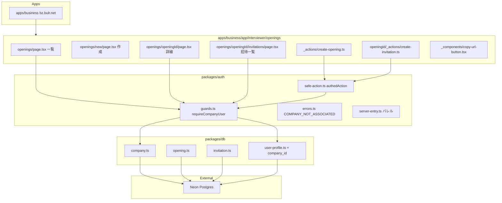
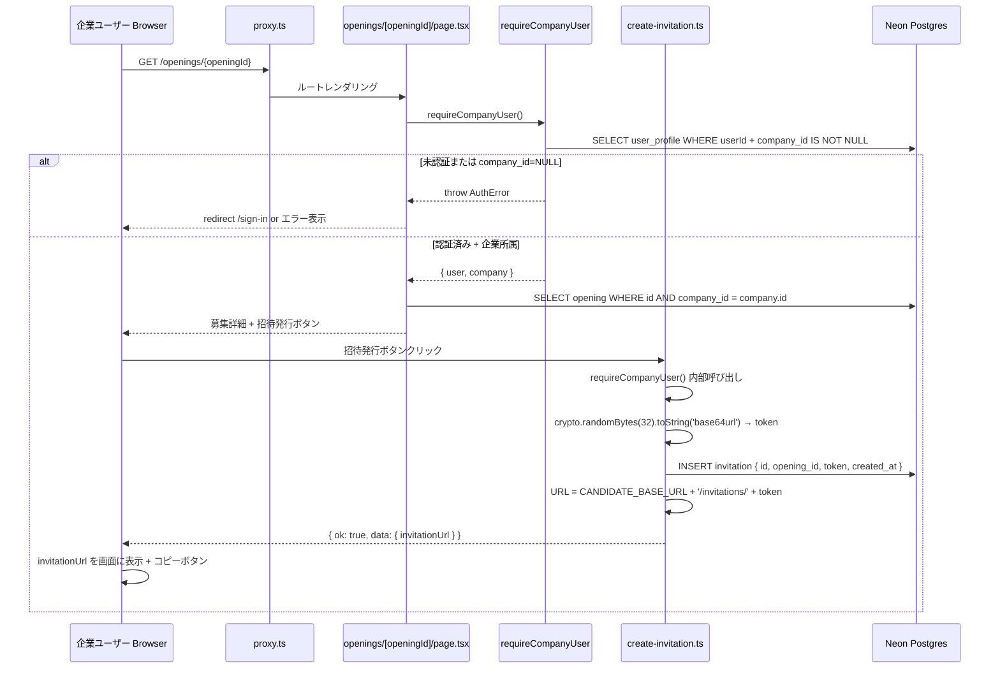
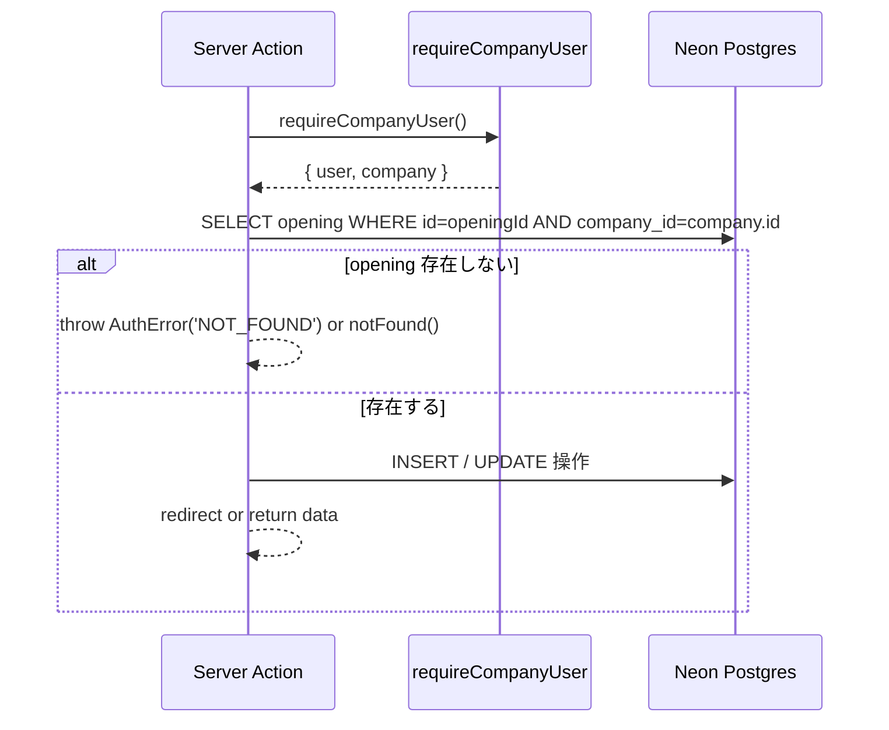

# Design Document — company-and-opening

## Overview

**Purpose**: 本 spec は Wave 3 の起点として、企業側の 3 エンティティ（`company` / `opening` / `invitation`）を Drizzle スキーマとして確立し、企業ユーザーが募集を作成・管理して招待リンクを発行できる UI を `apps/business` に追加する。Wave 2 `candidate-auth-onboarding` が整備した `/invitations/[token]` 受け取り口に対して、本 spec がトークン発行側を担うことで、Wave 3 `entry-flow` が `opening.id × invitation.token` から `entry` を作成する seam が確立される。

**Users**: 企業ユーザー（`apps/business` を利用する面接官 / 採用担当者）が直接の受益者。後続 Wave 3 spec（`entry-flow` / `session-from-entry`）の実装者は `opening.id`、`invitation.token`、`invitation.consumed_at` を参照する seam として利用する。

**Impact**: Wave 2 完了時点で未存在だった `company` / `opening` / `invitation` テーブルを追加し、既存の `user_profile` テーブルに `company_id` nullable FK を追加する。`packages/auth/src/guards.ts` に `requireCompanyUser` を追加する。`apps/business` に `/openings` ルート群を新設する。既存の `requireUser` / `authedAction` パターンは回帰しない。

### Goals

- `packages/db` に `company` / `opening` / `invitation` スキーマを追加し、Drizzle migration を生成する
- `user_profile.company_id` nullable FK を追加し、既存ユーザーへの影響なしに企業所属を表現する
- `requireCompanyUser` ガードを `packages/auth/src/guards.ts` に追加し、`@bulr/auth/server` から re-export する
- `apps/business` の `/openings` ルート群（一覧 / 作成 / 詳細 / 招待発行 / 招待一覧）を実装する
- `CANDIDATE_BASE_URL` 環境変数を追加し、`turbo.json` `build.env` に列挙する

### Non-Goals

- `entry` エンティティの作成・候補者側エントリーフロー → Wave 3 `entry-flow`
- `invitation.consumed_at` の設定ロジック → Wave 3 `entry-flow` が `entry` 作成時に設定
- 公開求人ボード化、複数ユーザー × 1 社 RBAC → Wave 5+
- 招待リンクのメール送信 → UI 上での URL 表示のみ（共有は企業側に委ねる）
- 招待トークンの有効期限切れ判定 UI → MVP は `expires_at=NULL` 運用
- Stage 1 `interview_session` の `candidate_id → entry_id` 移行 → Wave 3 `session-from-entry`

---

## Boundary Commitments

### This Spec Owns

- `packages/db/src/schema/company.ts`（`company` テーブル Drizzle 定義）
- `packages/db/src/schema/opening.ts`（`opening` テーブル Drizzle 定義）
- `packages/db/src/schema/invitation.ts`（`invitation` テーブル Drizzle 定義）
- `user_profile.company_id` カラム追加（`packages/db/src/schema/user-profile.ts` の変更）
- Drizzle migration ファイル（`packages/db/drizzle/*_company_and_opening.sql`）
- `requireCompanyUser` ガード（`packages/auth/src/guards.ts` への追加）
- `@bulr/auth/server` バレルへの `requireCompanyUser` re-export
- `AuthErrorCode` への `'COMPANY_NOT_ASSOCIATED'` 追加
- `apps/business/app/(interviewer)/openings/` 配下の全ルート・Server Actions
- `CANDIDATE_BASE_URL` 環境変数定義と `turbo.json` `build.env` への追加

### Out of Boundary

- `entry` テーブル・エンティティ → Wave 3 `entry-flow`
- `invitation.consumed_at` の更新ロジック → Wave 3 `entry-flow`
- `apps/candidate` 側の invitation 受け取りロジック（`/invitations/[token]`）→ `candidate-auth-onboarding` 実装済み
- Stage 1 `interview_session.candidate_id` の移行 → Wave 3 `session-from-entry`
- 企業ユーザーの登録・サインアップフロー → 当面は手動 DB 操作（Wave 4 `admin-operations` で管理 UI）

### Allowed Dependencies

- `packages/db`（`company` / `opening` / `invitation` / `user_profile` スキーマ）
- `packages/auth`（`requireCompanyUser` 追加、`requireUser` / `authedAction` 再利用）
- Better Auth 1.6.x（既存）
- Drizzle ORM 0.45.x（既存）
- Node.js `crypto` モジュール（`randomBytes` でトークン生成）
- `nanoid`（既存 convention、id 生成）
- `apps/* → packages/*` 単方向依存ルール（`feedback_package_dependency_direction.md`）

### Revalidation Triggers

- `requireCompanyUser` の戻り値型変更 → `entry-flow` / `session-from-entry` の利用箇所を再確認
- `opening` スキーマへのカラム追加（`entry-flow` が `opening` を参照する時点で再確認）
- `invitation.consumed_at` の型・制約変更 → `entry-flow` の消費ロジックを再確認
- `CANDIDATE_BASE_URL` の名前変更 → `apps/business` と `turbo.json` を再確認

---

## Architecture

### Existing Architecture Analysis

Wave 1/2 完了時点の構成:

- `packages/auth/src/guards.ts`: `requireUser` / `requireAdmin` / `requireSessionOwnership` / `requireCandidate` を公開。`requireCompanyUser` は未実装
- `packages/auth/src/errors.ts`: `AuthErrorCode` union 型に `'UNAUTHORIZED'` / `'FORBIDDEN'` / `'NOT_FOUND'` / `'CANDIDATE_PROFILE_MISSING'` を定義済み
- `packages/auth/src/server-entry.ts`（`@bulr/auth/server`）: guard 関数・`authedAction` / `adminAction` を re-export
- `packages/db/src/schema/user-profile.ts`: `userId` / `displayName` / `roleInOrg` / `yearsOfExperience` / `createdAt` / `updatedAt` を定義。`company_id` は未追加
- `apps/business/app/(interviewer)/interviews/`: 面接セッションルートのみ存在。`/openings` は未存在
- `apps/business/lib/auth.ts`: `createAuth` factory を企業テンプレートで呼び出す auth インスタンスを export 済み

**変更点**:
1. `packages/db` に `company.ts` / `opening.ts` / `invitation.ts` を追加し、`user-profile.ts` に `company_id` カラムを追加
2. `packages/auth/src/guards.ts` に `requireCompanyUser` を追加
3. `packages/auth/src/errors.ts` の `AuthErrorCode` に `'COMPANY_NOT_ASSOCIATED'` を追加
4. `packages/auth/src/server-entry.ts` から `requireCompanyUser` を re-export
5. `apps/business/app/(interviewer)/openings/` 配下にルート群を追加
6. `turbo.json` の `build.env` に `CANDIDATE_BASE_URL` を追加

### Architecture Pattern & Boundary Map



**Architecture Integration**:

- **Selected pattern**: `authedAction` + 内部 `requireCompanyUser` パターン。`candidateAction` を導入しなかった Wave 2 の決定と対称的に、`companyAction` も本 spec では導入しない。代わりに `authedAction` を外部バウンダリとして使い、Server Action body 内で `requireCompanyUser()` を呼ぶ
- **Domain/feature boundaries**: `requireCompanyUser` は `packages/auth/src/guards.ts` に集約。DB クエリは Drizzle を直接呼ぶ（`packages/auth → packages/db` の既存依存方向を維持）
- **Existing patterns preserved**: `authedAction` ラッパー / `requireUser` 多層防御 / `{ withTimezone: true }` timestamp convention（Wave 2 確立）/ `feedback_package_dependency_direction.md` の単方向依存
- **New components rationale**: `requireCompanyUser` は `requireUser` + `user_profile.company_id IS NOT NULL` チェックの合成で最小実装。URL 構築は Server Action 内でインライン計算（DB には token のみ保存）
- **Steering compliance**: `security.md` 多層認証パターン（proxy.ts → Server Component → Server Action）、`structure.md` packages/auth → packages/db 依存方向、`tech.md` Drizzle ORM convention

### Technology Stack

| レイヤー | 選択 / バージョン | 本 spec での役割 | 備考 |
|---------|----------------|----------------|------|
| DB / ORM | Drizzle ORM 0.45.x + Neon Postgres | 3 テーブル追加 + user_profile 拡張 | 既存 DB 接続継続。`{ withTimezone: true }` 統一 |
| Migration | drizzle-kit 0.31.x | スキーマ反映 | dev: push（inline env override）、prod: generate + migrate |
| Auth | packages/auth / Better Auth 1.6.x | requireCompanyUser ガード追加 | 既存 createAuth factory を再利用 |
| Token 生成 | Node.js `crypto.randomBytes(32).toString('base64url')` | invitation token 生成 | URL-safe base64、~43 文字、256 bit entropy |
| ID 生成 | nanoid（既存） | company / opening / invitation の PK | 既存 convention |
| Frontend | Next.js 16 App Router + React 19 | openings ルート群 | Server Component 中心、Copy ボタンのみ `'use client'` |
| Validation | Zod 4.x（既存） | フォーム入力・Server Action 検証 | 既存 |
| Build | Turborepo + pnpm | turbo.json build.env 更新 | `CANDIDATE_BASE_URL` 追加 |

---

## File Structure Plan

### Directory Structure

```
bulr-app-mvp/
├── packages/
│   ├── db/
│   │   └── src/
│   │       └── schema/
│   │           ├── company.ts           # ★新規: company テーブル定義
│   │           ├── opening.ts           # ★新規: opening テーブル定義（status enum 含む）
│   │           ├── invitation.ts        # ★新規: invitation テーブル定義（token UNIQUE）
│   │           ├── user-profile.ts      # ★変更: company_id nullable FK カラム追加
│   │           └── index.ts             # ★変更: company / opening / invitation バレル追加
│   │
│   └── auth/
│       └── src/
│           ├── guards.ts                # ★変更: requireCompanyUser 追加
│           ├── errors.ts                # ★変更: 'COMPANY_NOT_ASSOCIATED' を AuthErrorCode に追加
│           └── server-entry.ts          # ★変更: requireCompanyUser を re-export
│
├── apps/
│   └── business/
│       └── app/
│           └── (interviewer)/
│               └── openings/
│                   ├── page.tsx                          # ★新規: 募集一覧（Server Component）
│                   ├── new/
│                   │   └── page.tsx                      # ★新規: 募集作成フォーム（Client Component）
│                   ├── _actions/
│                   │   └── create-opening.ts             # ★新規: 募集作成 Server Action
│                   ├── _components/
│                   │   └── copy-url-button.tsx           # ★新規: クリップボードコピーボタン（'use client'）
│                   └── [openingId]/
│                       ├── page.tsx                      # ★新規: 募集詳細（Server Component）
│                       ├── _actions/
│                       │   └── create-invitation.ts      # ★新規: 招待リンク発行 Server Action
│                       └── invitations/
│                           └── page.tsx                  # ★新規: 招待一覧（Server Component）
│
├── turbo.json                           # ★変更: build.env に CANDIDATE_BASE_URL 追加
│
└── packages/db/drizzle/
    └── *_company_and_opening.sql        # ★新規: drizzle-kit generate が決定するファイル名
```

### Modified Files

- `packages/db/src/schema/user-profile.ts` — `company_id text references company(id) nullable` カラムを追加。既存レコードは NULL のまま稼働継続
- `packages/db/src/schema/index.ts` — `company` / `opening` / `invitation` のバレルエクスポートを追加
- `packages/auth/src/guards.ts` — `requireCompanyUser` 関数を追加
- `packages/auth/src/errors.ts` — `AuthErrorCode` union に `'COMPANY_NOT_ASSOCIATED'` を追加
- `packages/auth/src/server-entry.ts` — `requireCompanyUser` を re-export に追加
- `turbo.json` — `build.env` 配列に `"CANDIDATE_BASE_URL"` を追加

---

## System Flows

### 招待リンク発行フロー



### opening 所有権チェックパターン



---

## Requirements Traceability

| 要件 | サマリー | コンポーネント | インターフェース | フロー |
|------|---------|--------------|--------------|------|
| 1.1 | company テーブル定義 | `DbCompanySchema` | `packages/db/src/schema/company.ts` | — |
| 1.2 | company migration 生成 | `DrizzleMigration` | `packages/db/drizzle/` | — |
| 1.3 | company バレル export | `DbSchemaIndex` | `packages/db/src/schema/index.ts` | — |
| 1.4 | user_profile.company_id 追加 | `DbUserProfileSchema` | `packages/db/src/schema/user-profile.ts` | — |
| 1.5 | company_id=NULL 既存ユーザー継続稼働 | `DbUserProfileSchema` | nullable FK | — |
| 2.1 | opening テーブル定義 | `DbOpeningSchema` | `packages/db/src/schema/opening.ts` | — |
| 2.2 | opening migration 生成 | `DrizzleMigration` | `packages/db/drizzle/` | — |
| 2.3 | opening バレル export | `DbSchemaIndex` | `packages/db/src/schema/index.ts` | — |
| 2.4 | status enum サポート | `DbOpeningSchema` | `'draft' \| 'open' \| 'closed'` | — |
| 3.1 | invitation テーブル定義 | `DbInvitationSchema` | `packages/db/src/schema/invitation.ts` | — |
| 3.2 | invitation migration 生成 | `DrizzleMigration` | `packages/db/drizzle/` | — |
| 3.3 | invitation バレル export | `DbSchemaIndex` | `packages/db/src/schema/index.ts` | — |
| 3.4 | token 生成 256bit entropy | `CreateInvitationAction` | `crypto.randomBytes(32).toString('base64url')` | 招待発行 |
| 3.5 | token UNIQUE 制約 | `DbInvitationSchema` | `.unique()` Drizzle modifier | — |
| 3.6 | expires_at nullable | `DbInvitationSchema` | nullable timestamptz | — |
| 3.7 | consumed_at nullable seam | `DbInvitationSchema` | nullable timestamptz（Wave 3 が更新） | — |
| 4.1 | requireCompanyUser 戻り値 | `RequireCompanyUser` | `guards.ts` | — |
| 4.2 | UNAUTHORIZED throw | `RequireCompanyUser` | `guards.ts` | — |
| 4.3 | COMPANY_NOT_ASSOCIATED throw | `RequireCompanyUser` | `guards.ts` | — |
| 4.4 | 多層防御パターン | `RequireCompanyUser` | Server Component / Action / API Route | — |
| 4.5 | AuthErrorCode 追加 | `AuthErrors` | `errors.ts` | — |
| 5.1 | openings 一覧表示 | `OpeningsListPage` | `/openings` | — |
| 5.2 | 作成フォーム表示 | `OpeningsNewPage` | `/openings/new` | — |
| 5.3 | opening 作成と redirect | `CreateOpeningAction` | `_actions/create-opening.ts` | — |
| 5.4 | title 必須バリデーション | `CreateOpeningAction` | Zod schema | — |
| 5.5 | 未認証・企業未所属の redirect | `RequireCompanyUser` + Proxy | `guards.ts` + `proxy.ts` | — |
| 6.1 | opening 詳細表示 | `OpeningDetailPage` | `/openings/{openingId}` | — |
| 6.2 | entries placeholder 表示 | `OpeningDetailPage` | page.tsx | — |
| 6.3 | 他社 opening へのアクセス制限 | `OpeningDetailPage` + DB クエリ | company_id スコープ | — |
| 7.1 | 招待リンク発行と URL 表示 | `CreateInvitationAction` | `_actions/create-invitation.ts` | 招待発行 |
| 7.2 | token 生成方法 | `CreateInvitationAction` | `crypto.randomBytes(32).toString('base64url')` | 招待発行 |
| 7.3 | URL を DB に保存しない | `CreateInvitationAction` | token のみ INSERT | — |
| 7.4 | クリップボードコピー UI | `CopyUrlButton` | `_components/copy-url-button.tsx` | — |
| 7.5 | token 生成失敗時エラー | `CreateInvitationAction` | try/catch + Result 型 | — |
| 7.6 | CANDIDATE_BASE_URL 利用 | `CreateInvitationAction` | env var | — |
| 8.1 | 招待一覧表示 | `InvitationsListPage` | `/openings/{openingId}/invitations` | — |
| 8.2 | 未使用表示（consumed_at=NULL） | `InvitationsListPage` | page.tsx | — |
| 8.3 | 使用済み表示（consumed_at≠NULL） | `InvitationsListPage` | page.tsx | — |
| 8.4 | 一覧でのコピーボタン | `CopyUrlButton` | `_components/copy-url-button.tsx` | — |
| 9.1 | CANDIDATE_BASE_URL env 定義 | `EnvConfig` | `.env.local.example` + Vercel | — |
| 9.2 | turbo.json build.env 追加 | `TurboConfig` | `turbo.json` | — |
| 9.3 | 未設定時の fail-loud | `CreateInvitationAction` | env 未設定チェック | — |

---

## Components and Interfaces

### コンポーネント一覧

| コンポーネント | ドメイン/レイヤー | 意図 | 要件カバレッジ | キー依存 | コントラクト |
|-------------|----------------|------|-------------|---------|------------|
| `DbCompanySchema` | packages/db | company テーブル Drizzle 定義 | 1.1, 1.2, 1.3 | Drizzle ORM | State |
| `DbOpeningSchema` | packages/db | opening テーブル Drizzle 定義 | 2.1, 2.2, 2.3, 2.4 | Drizzle ORM, DbCompanySchema | State |
| `DbInvitationSchema` | packages/db | invitation テーブル Drizzle 定義 | 3.1, 3.2, 3.3, 3.5, 3.6, 3.7 | Drizzle ORM, DbOpeningSchema | State |
| `DbUserProfileSchema` | packages/db | user_profile テーブル（company_id 追加） | 1.4, 1.5 | Drizzle ORM, DbCompanySchema | State |
| `DbSchemaIndex` | packages/db | バレルエクスポート | 1.3, 2.3, 3.3 | 全スキーマ | State |
| `DrizzleMigration` | packages/db | migration ファイル | 1.2, 2.2, 3.2 | drizzle-kit | Batch |
| `AuthErrors` | packages/auth | AuthErrorCode union 拡張 | 4.5 | — | State |
| `RequireCompanyUser` | packages/auth | requireCompanyUser ガード | 4.1, 4.2, 4.3, 4.4 | RequireUser, DbUserProfileSchema | Service |
| `AuthServerEntry` | packages/auth | @bulr/auth/server バレル | 4.1, 4.4 | RequireCompanyUser | Service |
| `OpeningsListPage` | apps/business | 募集一覧 Server Component | 5.1, 5.5 | RequireCompanyUser, DbOpeningSchema | State |
| `OpeningsNewPage` | apps/business | 募集作成フォーム | 5.2 | CreateOpeningAction | State |
| `CreateOpeningAction` | apps/business | 募集作成 Server Action | 5.3, 5.4 | authedAction, RequireCompanyUser, DbOpeningSchema | Service |
| `OpeningDetailPage` | apps/business | 募集詳細 Server Component | 6.1, 6.2, 6.3 | RequireCompanyUser, DbOpeningSchema, DbInvitationSchema | State |
| `CreateInvitationAction` | apps/business | 招待リンク発行 Server Action | 7.1, 7.2, 7.3, 7.5, 7.6 | authedAction, RequireCompanyUser, DbInvitationSchema | Service |
| `InvitationsListPage` | apps/business | 招待一覧 Server Component | 8.1, 8.2, 8.3, 8.4 | RequireCompanyUser, DbInvitationSchema | State |
| `CopyUrlButton` | apps/business | クリップボードコピーボタン | 7.4, 8.4 | navigator.clipboard (browser API) | State |
| `EnvConfig` | インフラ | CANDIDATE_BASE_URL 環境変数 | 9.1, 9.3 | Vercel env | — |
| `TurboConfig` | インフラ | turbo.json build.env | 9.2 | Turborepo | — |

---

### packages/db レイヤー

#### DbCompanySchema

| フィールド | 詳細 |
|----------|------|
| Intent | `company` テーブルの Drizzle スキーマ定義（企業マスタの最小エンティティ） |
| Requirements | 1.1, 1.2, 1.3 |

**Responsibilities & Constraints**

- `packages/db/src/schema/company.ts` に定義
- id は `text('id').primaryKey()`（nanoid で生成）
- timestamp は `{ withTimezone: true }` で統一（Wave 2 convention）
- RBAC・複数ユーザー所属管理は本 spec では追加しない

**Physical Data Model**

```sql
company (
  id           text        PRIMARY KEY,       -- nanoid
  name         text        NOT NULL,
  created_at   timestamptz NOT NULL DEFAULT now(),
  updated_at   timestamptz NOT NULL DEFAULT now()
)
```

```typescript
// packages/db/src/schema/company.ts（概要）
import { pgTable, text, timestamp } from 'drizzle-orm/pg-core';

export const company = pgTable('company', {
  id: text('id').primaryKey(),
  name: text('name').notNull(),
  createdAt: timestamp('created_at', { withTimezone: true }).notNull().defaultNow(),
  updatedAt: timestamp('updated_at', { withTimezone: true }).notNull().defaultNow(),
});

export type Company = typeof company.$inferSelect;
export type NewCompany = typeof company.$inferInsert;
```

#### DbOpeningSchema

| フィールド | 詳細 |
|----------|------|
| Intent | `opening` テーブルの Drizzle スキーマ定義（募集エンティティ、status enum 含む） |
| Requirements | 2.1, 2.2, 2.3, 2.4 |

**Physical Data Model**

```sql
opening (
  id           text        PRIMARY KEY,       -- nanoid
  company_id   text        NOT NULL REFERENCES company(id),
  title        text        NOT NULL,
  description  text,
  status       text        NOT NULL DEFAULT 'draft',  -- 'draft' | 'open' | 'closed'
  created_at   timestamptz NOT NULL DEFAULT now(),
  updated_at   timestamptz NOT NULL DEFAULT now()
)
```

```typescript
// packages/db/src/schema/opening.ts（概要）
import { pgEnum, pgTable, text, timestamp } from 'drizzle-orm/pg-core';
import { company } from './company';

export const openingStatusEnum = pgEnum('opening_status', ['draft', 'open', 'closed']);

export const opening = pgTable('opening', {
  id: text('id').primaryKey(),
  companyId: text('company_id').notNull().references(() => company.id),
  title: text('title').notNull(),
  description: text('description'),
  status: openingStatusEnum('status').notNull().default('draft'),
  createdAt: timestamp('created_at', { withTimezone: true }).notNull().defaultNow(),
  updatedAt: timestamp('updated_at', { withTimezone: true }).notNull().defaultNow(),
});

export type Opening = typeof opening.$inferSelect;
export type NewOpening = typeof opening.$inferInsert;
```

#### DbInvitationSchema

| フィールド | 詳細 |
|----------|------|
| Intent | `invitation` テーブルの Drizzle スキーマ定義（token UNIQUE、consumed_at は Wave 3 seam） |
| Requirements | 3.1, 3.2, 3.3, 3.5, 3.6, 3.7 |

**Physical Data Model**

```sql
invitation (
  id           text        PRIMARY KEY,                    -- nanoid
  opening_id   text        NOT NULL REFERENCES opening(id),
  token        text        NOT NULL UNIQUE,                -- crypto.randomBytes(32).toString('base64url')
  created_at   timestamptz NOT NULL DEFAULT now(),
  expires_at   timestamptz,                               -- nullable: MVP は NULL 運用
  consumed_at  timestamptz                                -- nullable: Wave 3 entry-flow が設定
)
```

```typescript
// packages/db/src/schema/invitation.ts（概要）
import { pgTable, text, timestamp, uniqueIndex } from 'drizzle-orm/pg-core';
import { opening } from './opening';

export const invitation = pgTable(
  'invitation',
  {
    id: text('id').primaryKey(),
    openingId: text('opening_id').notNull().references(() => opening.id),
    token: text('token').notNull().unique(),
    createdAt: timestamp('created_at', { withTimezone: true }).notNull().defaultNow(),
    expiresAt: timestamp('expires_at', { withTimezone: true }),
    consumedAt: timestamp('consumed_at', { withTimezone: true }),
  },
);

export type Invitation = typeof invitation.$inferSelect;
export type NewInvitation = typeof invitation.$inferInsert;
```

#### DbUserProfileSchema（変更）

| フィールド | 詳細 |
|----------|------|
| Intent | `user_profile.company_id` nullable FK を追加し、企業所属を表現する |
| Requirements | 1.4, 1.5 |

**追加カラム**

```typescript
// 追加するカラムのみ（既存カラムに加える）
companyId: text('company_id').references(() => company.id),  // nullable FK
```

既存ユーザーはマイグレーション後も `company_id=NULL` で継続稼働する（要件 1.5）。

---

### packages/auth レイヤー

#### RequireCompanyUser

| フィールド | 詳細 |
|----------|------|
| Intent | 認証済み かつ `user_profile.company_id IS NOT NULL` を確認するガード関数 |
| Requirements | 4.1, 4.2, 4.3, 4.4 |

**Responsibilities & Constraints**

- `packages/auth/src/guards.ts` に `requireCompanyUser` を追加
- `requireUser()` を内部で呼び出し（`UNAUTHORIZED` の throw はそこに委譲）
- `user_profile` テーブルを `userId` でクエリし、`company_id` が NULL の場合は `AuthError('COMPANY_NOT_ASSOCIATED')` を throw
- `import 'server-only'` を持つ server-only 関数（ファイル先頭宣言は既存）
- `packages/db` の `company` テーブルも JOIN して返す（Wave 3 で company.id を参照する seam）

**Service Interface**

```typescript
// packages/auth/src/guards.ts に追加
export async function requireCompanyUser(): Promise<{
  user: { id: string; email: string };
  companyId: string;
}> {
  const user = await requireUser();
  const [profile] = await db
    .select({ companyId: userProfile.companyId })
    .from(userProfile)
    .where(eq(userProfile.userId, user.id))
    .limit(1);

  if (!profile?.companyId) throw new AuthError('COMPANY_NOT_ASSOCIATED');

  return { user, companyId: profile.companyId };
}

// throws:
//   AuthError('UNAUTHORIZED')              — session なし
//   AuthError('COMPANY_NOT_ASSOCIATED')    — company_id=NULL
```

---

### apps/business レイヤー

#### CreateOpeningAction

| フィールド | 詳細 |
|----------|------|
| Intent | opening を作成する Server Action（`authedAction` + 内部 `requireCompanyUser`） |
| Requirements | 5.3, 5.4 |

**Service Interface**

```typescript
// apps/business/app/(interviewer)/openings/_actions/create-opening.ts
const createOpeningSchema = z.object({
  title: z.string().min(1).max(200).trim(),
  description: z.string().max(5000).trim().optional(),
  status: z.enum(['draft', 'open', 'closed']).default('draft'),
});

export const createOpening = authedAction(
  createOpeningSchema,
  // authedAction ctx.userId は内部の requireCompanyUser が requireUser を呼ぶため
  // 二重取得になるが、authedAction シグネチャの統一性を優先して引数のまま残す。
  // userId を action 本体で直接参照する必要はない (companyId を requireCompanyUser
  // から取得する)。引数名を `_ctx` にしないのはセキュリティパターンの可読性のため。
  async ({ title, description, status }, { userId }) => {
    const { companyId } = await requireCompanyUser();
    const id = nanoid();
    await db.insert(opening).values({ id, companyId, title, description, status });
    redirect(`/openings/${id}`);
  }
);
```

#### CreateInvitationAction

| フィールド | 詳細 |
|----------|------|
| Intent | invitation token を生成してDBに挿入し、招待 URL を返す Server Action |
| Requirements | 7.1, 7.2, 7.3, 7.5, 7.6 |

**Service Interface**

```typescript
// apps/business/app/(interviewer)/openings/[openingId]/_actions/create-invitation.ts
const createInvitationSchema = z.object({
  openingId: z.string().min(1),
});

export const createInvitation = authedAction(
  createInvitationSchema,
  // authedAction ctx.userId は内部の requireCompanyUser が requireUser を呼ぶため
  // 二重取得になるが、authedAction シグネチャの統一性を優先して引数のまま残す。
  // userId を action 本体で直接参照する必要はない (companyId を requireCompanyUser
  // から取得する)。引数名を `_ctx` にしないのはセキュリティパターンの可読性のため。
  async ({ openingId }, { userId }) => {
    const { companyId } = await requireCompanyUser();

    // 所有権チェック
    const [ownedOpening] = await db
      .select({ id: opening.id })
      .from(opening)
      .where(and(eq(opening.id, openingId), eq(opening.companyId, companyId)))
      .limit(1);
    if (!ownedOpening) throw new AuthError('NOT_FOUND');

    // token 生成（256bit entropy, URL-safe base64）
    const token = randomBytes(32).toString('base64url');
    const id = nanoid();
    await db.insert(invitation).values({ id, openingId, token });

    const candidateBaseUrl = process.env.CANDIDATE_BASE_URL;
    if (!candidateBaseUrl) throw new Error('CANDIDATE_BASE_URL is not set');

    return { invitationUrl: `${candidateBaseUrl}/invitations/${token}` };
  }
);
```

**Preconditions**: `CANDIDATE_BASE_URL` が設定されていること。ユーザーが当該 opening の所有者であること。
**Postconditions**: `invitation` テーブルに 1 件 INSERT され、`invitationUrl` が返される。DB には token のみ保存（URL 全体は保存しない）。
**Invariants**: token の UNIQUE 制約違反時はエラーを伝播する（リトライロジックは本 spec スコープ外）。

#### CopyUrlButton

| フィールド | 詳細 |
|----------|------|
| Intent | 招待 URL をクリップボードにコピーするクライアントコンポーネント |
| Requirements | 7.4, 8.4 |

**Responsibilities & Constraints**

- `'use client'` ディレクティブ必須（`navigator.clipboard` は browser API）
- `url: string` を props として受け取り、クリック時に `navigator.clipboard.writeText(url)` を呼ぶ
- コピー成功時に「コピーしました」フィードバックを UI 上で一時表示する
- サーバー側の URL 構築ロジックを持たない（純粋なコピー機能のみ）

---

## Data Models

### ドメインモデル

```
company (企業)
  └── user_profile.company_id (1:N, 企業ユーザーの所属)
  └── opening (1:N, 企業の募集)
       └── invitation (1:N, 募集に対する招待)
```

- `company` は Wave 3 以降の RBAC 拡張のために存在する。本 spec では最小エンティティ
- `opening.status` enum の遷移は本 spec でUI による制約は設けない（MVP）
- `invitation.consumed_at` は Wave 3 `entry-flow` が所有する seam（本 spec では NULL のみ）

### 整合性制約

- `opening.company_id` → `company.id`（NOT NULL FK）
- `invitation.opening_id` → `opening.id`（NOT NULL FK）
- `user_profile.company_id` → `company.id`（nullable FK）
- `invitation.token` UNIQUE 制約
- すべての timestamp は `{ withTimezone: true }`（Wave 2 convention）

---

## Error Handling

### Error Strategy

- 認証エラーは `AuthError` を throw し、`authedAction` ラッパーが `{ ok: false, error: { code, message } }` に変換して Client に返す
- DB 操作エラー（UNIQUE 違反等）は `authedAction` が再 throw するため、Client にはデフォルトエラーメッセージを表示する
- `CANDIDATE_BASE_URL` 未設定は `throw new Error(...)` でサーバーエラーにする（開発時に早期検出）

### Error Categories and Responses

- **未認証アクセス** (`UNAUTHORIZED`): `requireCompanyUser` → proxy.ts が `/sign-in` にリダイレクト
- **企業未所属** (`COMPANY_NOT_ASSOCIATED`): 「企業アカウントが必要です」エラーを UI 表示
- **他社 opening へのアクセス** (`NOT_FOUND`): `notFound()` を呼んで 404 表示
- **フォーム検証エラー**: Zod parse 失敗時はフィールドエラーをクライアントに返す

---

## Testing Strategy

### 手動 Smoke Test（Stage 1 方針）

本 spec は Stage 1 方針に沿い自動テストフレームワークを導入しない。完了確認は以下の手動 smoke test で行う。

1. **DB migration の適用**
   - `pnpm --filter @bulr/db drizzle-kit push`（inline env override）を実行し、`company` / `opening` / `invitation` テーブルおよび `user_profile.company_id` カラムが DB に反映されること

2. **requireCompanyUser ガード**
   - `pnpm typecheck` が全 workspace で成功すること
   - company_id=NULL のユーザーで `/openings` にアクセスすると適切なエラーが返ること
   - company_id が設定済みのユーザーで `/openings` にアクセスすると一覧ページが表示されること

3. **opening CRUD**
   - `/openings/new` で title を入力して送信 → opening が作成され詳細ページにリダイレクトされること
   - title 未入力で送信 → バリデーションエラーが表示されること
   - `/openings` で自社の opening 一覧が表示されること

4. **invitation 発行**
   - opening 詳細ページで「招待リンクを発行」をクリック → invitation URL が画面に表示されること
   - 表示された URL が `${CANDIDATE_BASE_URL}/invitations/{token}` 形式であること
   - token が `/^[A-Za-z0-9_-]+$/` regex に一致すること
   - コピーボタンをクリックするとクリップボードに URL がコピーされること

5. **invitation 一覧**
   - `/openings/{id}/invitations` で発行済み招待一覧が表示されること
   - `consumed_at=NULL` の招待が「未使用」と表示されること

6. **ビルドとタイプチェック**
   - `pnpm build` が全 packages と apps で成功すること
   - `pnpm typecheck` が全 workspace で成功すること

---

## Security Considerations

- `requireCompanyUser` は多層防御の一部として実装し、proxy.ts のみに依存しない（CVE-2025-29927 教訓）
- invitation token は `crypto.randomBytes(32).toString('base64url')` で生成し、推測不可能な 256bit エントロピーを保証する
- opening の所有権チェックは全 Server Action で `company_id` スコープを使い、他社データへのアクセスを防ぐ
- `CANDIDATE_BASE_URL` はサーバー専用環境変数（`NEXT_PUBLIC_` プレフィックスなし）として管理し、URL 構築はサーバーサイドのみで行う
- `authedAction` ラッパーが認証エラーを安全に変換し、未処理例外がクライアントに露出しないようにする

## Migration Strategy

1. `packages/db/src/schema/company.ts` を追加
2. `packages/db/src/schema/opening.ts` を追加（`company.ts` に依存）
3. `packages/db/src/schema/invitation.ts` を追加（`opening.ts` に依存）
4. `packages/db/src/schema/user-profile.ts` に `company_id` nullable FK を追加（`company.ts` に依存）
5. `packages/db/src/schema/index.ts` にバレルエクスポートを追加
6. `drizzle-kit generate` で migration SQL を生成
7. `drizzle-kit push`（dev 環境、inline env override）で dev DB に反映
8. `drizzle-kit migrate`（prod 環境）で本番 DB に適用

**ロールバック条件**: migration 適用後に typecheck または build が失敗した場合、migration を revert して原因を調査する。`user_profile.company_id` は nullable のため、既存データへの影響はない。
