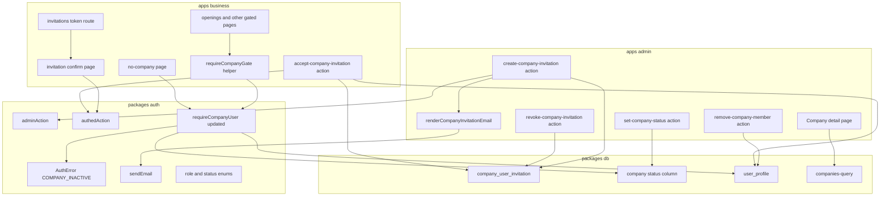
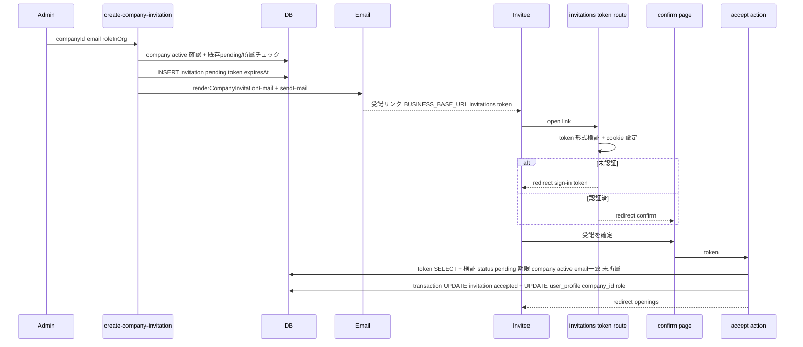
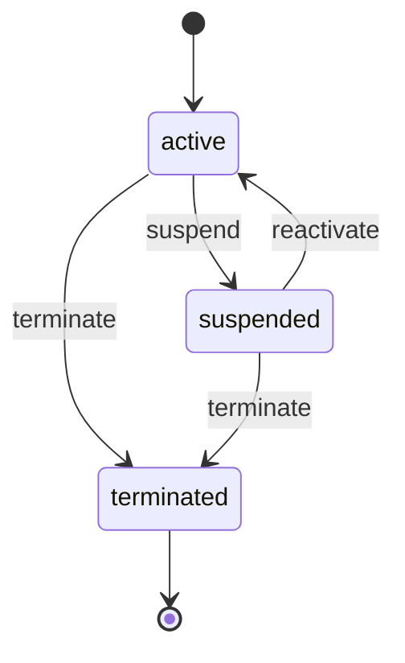
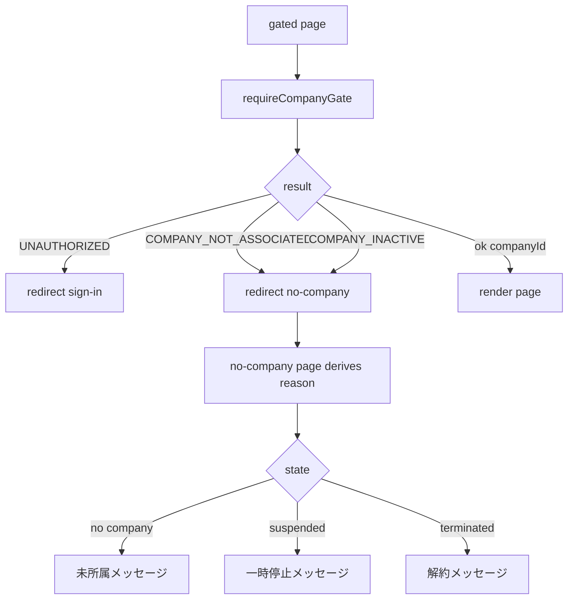
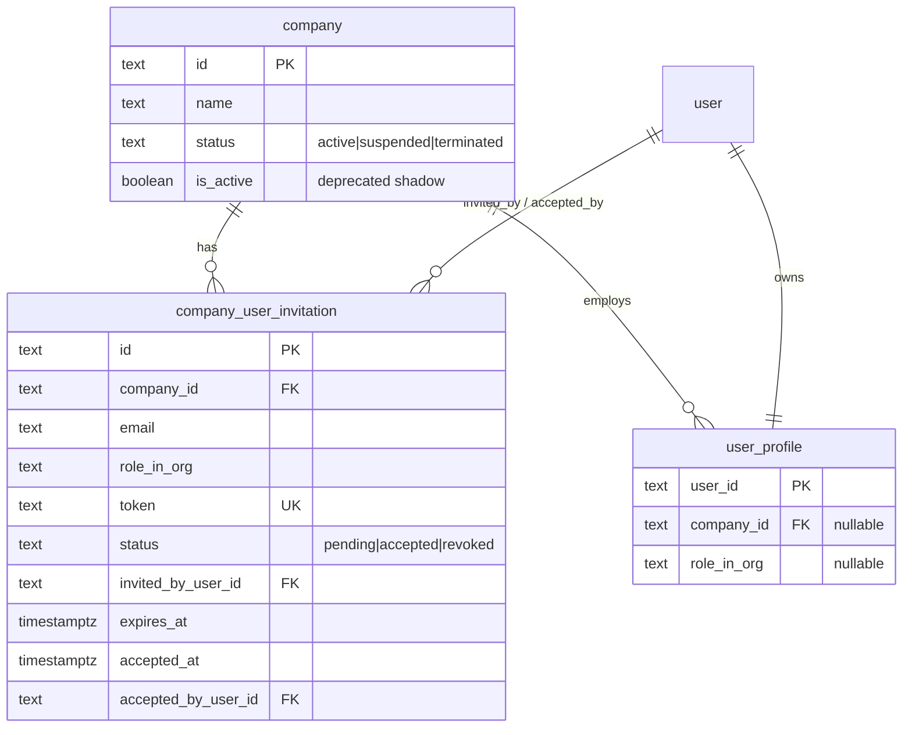
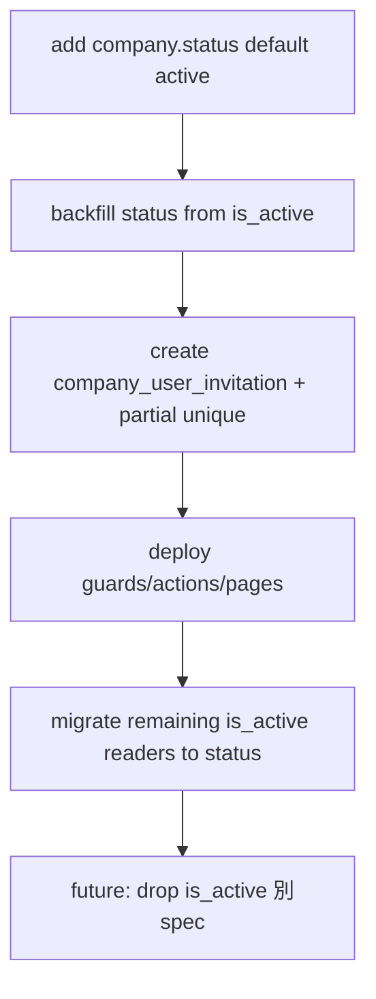

# Design Document — company-user-invitation

## Overview

**Purpose**: 企業ユーザー（面接官）を会社に紐付ける唯一の正規経路を新設する。管理者がメール宛にトークン招待を発行し、招待された企業ユーザーが受諾することで `user_profile.company_id` と `role_in_org` が設定される。あわせて会社のライフサイクル（有効 / 一時停止 / 解約）をステータスで管理し、未所属・利用停止中の企業ユーザーには専用ページ `/no-company` で状況を明示する。

**Users**: 管理者（admin、`ADMIN_ALLOWED_EMAILS`）が招待発行・メンバー管理・ステータス操作を行い、企業ユーザー（business、面接官）が招待を受諾する。

**Impact**: 現在ソースに存在しない `user_profile.company_id` 書込経路を新設する。`company` に `status` 列を追加し、`requireCompanyUser()` の判定にステータスを含める。business の会社ゲート catch の二段リダイレクト（`/openings → /sign-in → /interviews`）を解消する。

### Goals

- admin による会社ユーザー招待の発行・取り消し・メンバー解除を提供する
- 招待受諾による `company_id` + `role_in_org` の安全（単回・競合耐性）な設定
- 会社ステータス（active/suspended/terminated）の管理とゲート反映
- 未所属/停止中の企業ユーザー向け `/no-company` UX
- 認可を各サーバ境界で独立に成立させる（CVE-2025-29927）

### Non-Goals

- 解約後のデータ削除（消去）フロー（terminated を終端状態として識別するのみ）
- 1 ユーザーが複数会社へ所属するマルチテナント（1:1 を維持）
- 既存の候補者×募集向け `invitation` の変更
- 企業ユーザー自身による他ユーザー招待（発行は admin のみ）
- better-auth サインアップ時の会社自動決定（profile は従来どおり `company_id` NULL で作成）

## Boundary Commitments

### This Spec Owns

- `company_user_invitation` テーブルとそのライフサイクル（pending → accepted / revoked、expired は期限導出）
- `company.status`（active/suspended/terminated）の意味と遷移規則、authoritative な会社ライフサイクル
- `user_profile.company_id` / `role_in_org` を**設定・解除する唯一の経路**（招待受諾、admin 解除）
- `requireCompanyUser()` への会社ステータス判定の追加と新コード `COMPANY_INACTIVE`
- business 受諾フロー（route / confirm page / accept action）と `/no-company` ページ
- 会社ゲート catch の共通化（`requireCompanyGate()`）

### Out of Boundary

- 候補者×募集向け `invitation` / `entry`（別概念、変更しない）
- better-auth サインアップフック（`databaseHooks.user.create.after`、変更しない）
- 解約後の実データ削除（別 spec）
- magic-link 認証そのものの仕様（既存基盤を利用するのみ）

### Allowed Dependencies

- `@bulr/auth/server`（`adminAction` / `authedAction` / `requireUser` / `requireCompanyUser` / `sendEmail` / `AuthError`）
- `@bulr/db`（drizzle スキーマ・クエリ）
- 既存メール基盤（`sendEmail` + アプリ別 `render*Email`）
- 依存方向は `apps → packages` 単方向を厳守（`packages → apps` 禁止）。アプリ固有のブランド/文面・base URL は app 側に持つ

### Revalidation Triggers

- `company.status` の列挙値/意味変更、`COMPANY_INACTIVE` 追加 → `requireCompanyUser()` を呼ぶ business 全ページ
- `company_user_invitation` の契約変更 → admin 発行 / business 受諾の双方
- `is_active` 廃止 → 残存する `is_active` 読み手
- `role_in_org` enum の変更 → admin 発行フォーム / 受諾 / 表示

## Architecture

### Existing Architecture Analysis

- **多層認可**: proxy.ts は Cookie 存在チェックのみ（UX）。認可は各 Server Component / Server Action で `requireUser` / `requireAdmin` / `requireCompanyUser` を独立に呼ぶ（security.md / CVE-2025-29927）。本設計もこれに従う。
- **Server Action 規約**: 全 mutation は `adminAction` / `authedAction` でラップし `Result<R>` を返す。素の async Server Action は禁止。
- **token 消費パターン**: 既存 `create-entry.ts` の「条件付き UPDATE + recheck」を transaction 内で踏襲し race-safe を担保。
- **メール DI**: `sendEmail`（packages）にアプリ別 `render*Email`（app）を渡す。本設計は admin に会社招待テンプレートを追加。
- **クロスアプリ**: 発行=admin、受諾=business。受諾リンクは `BUSINESS_BASE_URL` で生成。

### Architecture Pattern & Boundary Map



**Architecture Integration**:

- Selected pattern: 既存の「Server Action ラッパー + 認可ガード + token transaction 消費」を会社×ユーザー招待に適用した CRUD + ステートマシン。
- Domain/feature boundaries: 発行・管理（admin） / 受諾・ゲート UX（business） / 認可・enum（auth） / 永続化（db）を分離。`company_id` 書込は受諾アクションと解除アクションのみが行う（No Hidden Shared Ownership）。
- Existing patterns preserved: `adminAction`/`authedAction`、多層認可、`sendEmail` DI、transaction 単回消費。
- New components rationale: 招待は会社×メールで `invitation`（候補者×募集）と概念が別のため新テーブル。会社ステータス判定の追加で新エラーコードが必要。
- Steering compliance: CVE-2025-29927（proxy 非依存）、Zod 全入力検証、Drizzle のみ、fail-secure。

### Technology Stack

| Layer | Choice / Version | Role in Feature | Notes |
| ----- | ---------------- | --------------- | ----- |
| Frontend | Next.js 16 App Router / React 19 | admin 管理 UI・business 受諾/未所属 UI | Server Components + Client form components |
| Backend | Server Actions（`adminAction`/`authedAction`） | 招待発行/取消/解除/受諾/ステータス | 既存ラッパー再利用 |
| Data | PostgreSQL + Drizzle ORM 0.45 | `company_user_invitation` 新設・`company.status` 追加 | drizzle-kit generate/push |
| Messaging | `sendEmail`（Resend / Mailpit） | 招待メール送信 | 新規依存なし |

## File Structure Plan

### New Files

```
packages/db/src/schema/
└── company-user-invitation.ts      # 新テーブル定義 + 型 + partial unique index

packages/auth/src/
└── (schemas.ts に追記)              # companyRoleSchema / companyStatusSchema

apps/admin/
├── lib/company-invitation-template.ts        # renderCompanyInvitationEmail({url, companyName})
└── app/companies/[id]/_actions/
    ├── create-company-invitation.ts          # 招待発行（adminAction）
    ├── revoke-company-invitation.ts          # 招待取消（adminAction）
    ├── remove-company-member.ts              # メンバー解除（adminAction）
    └── set-company-status.ts                 # ステータス遷移（adminAction）
apps/admin/app/companies/[id]/_components/
    ├── invite-member-form.tsx                # 招待発行フォーム（client）
    ├── pending-invitations-table.tsx         # 保留中招待 + 取消（client/server 併用）
    ├── member-row-actions.tsx                # メンバー解除ボタン（client）
    └── company-status-controls.tsx           # 停止/解約/再有効化（client）

apps/business/app/
├── invitations/[token]/
│   ├── route.ts                              # token 形式検証 + cookie + redirect
│   └── confirm/
│       ├── page.tsx                          # 受諾確認ページ（requireUser）
│       └── _actions/accept-company-invitation.ts  # 受諾（authedAction）
├── no-company/page.tsx                       # 未所属/停止の状況明示ページ
apps/business/lib/
└── company-gate.ts                           # requireCompanyGate()（catch→/no-company,/sign-in 集約）
```

### Modified Files

- `packages/db/src/schema/company.ts` — `status`（'active'|'suspended'|'terminated'）列を追加（NOT NULL default 'active'）。`isActive` は後方互換シャドウとして残置。
- `packages/db/src/schema/index.ts` — `company-user-invitation` を re-export。
- `packages/db/src/queries/admin/companies-query.ts` — 保留中招待一覧クエリ、会社ステータス取得を追加。
- `packages/auth/src/errors.ts` — `AuthErrorCode` に `'COMPANY_INACTIVE'` 追加。
- `packages/auth/src/guards.ts` — `requireCompanyUser()` に company JOIN を追加し、status !== 'active' で `COMPANY_INACTIVE` を throw。返り値に `companyStatus` を含めても良い。
- `packages/auth/src/schemas.ts` + `server-entry.ts` — role/status enum を公開。
- `apps/admin/app/companies/[id]/page.tsx` — 招待フォーム / 保留中招待一覧 / メンバー解除 / ステータス操作を追加。
- `apps/admin/app/companies/_actions/disable-company.ts` — `set-company-status` に統合（suspend へ委譲、または削除して呼び出し側を差し替え）。
- `apps/business/app/(interviewer)/openings/page.tsx` ほか会社ゲート4ページ（`openings/[openingId]/page.tsx`, `.../entries/page.tsx`, `.../entries/[entryId]/page.tsx`, `.../invitations/page.tsx`）— catch を `requireCompanyGate()` 呼び出しに置換。
- `apps/business/proxy.ts` — matcher に `/no-company` を追加（Cookie 無→/sign-in）。`/invitations/*` は matcher に含めない（route handler が未認証を処理）。

## System Flows

### 招待発行→受諾（Sequence）



### 会社ステータス遷移（State）



- terminated は終端（再有効化不可）。新規招待の発行/受諾は suspended・terminated で拒否。
- ステータス操作は `set-company-status` が許可遷移を内部検証し、不正遷移は `INVALID_TRANSITION` を返す。

### 会社ゲート分岐（Process）



## Requirements Traceability

| Requirement | Summary | Components | Interfaces | Flows |
| ----------- | ------- | ---------- | ---------- | ----- |
| 1.1–1.7 | 招待発行（admin） | create-company-invitation, invitation table, email template | createCompanyInvitation, renderCompanyInvitationEmail | 発行→受諾 Sequence |
| 2.1–2.7 | 招待受諾 | invitations route, confirm page, accept action | acceptCompanyInvitation | 発行→受諾 Sequence |
| 3.1–3.5 | メンバー/招待管理 | page.tsx 拡張, revoke/remove actions, companies-query | revokeCompanyInvitation, removeCompanyMember | — |
| 4.1–4.7 | 会社ステータス管理 | company.status, set-company-status, guards | setCompanyStatus | ステータス遷移 State |
| 5.1–5.5 | 未所属/停止 UX | no-company page, requireCompanyGate, proxy | requireCompanyGate | 会社ゲート分岐 Process |
| 6.1–6.5 | 認可境界/トークン安全性 | adminAction/authedAction, guards, token validation | 各 action, requireCompanyUser | 全フロー横断 |

## Components and Interfaces

| Component | Domain/Layer | Intent | Req Coverage | Key Dependencies | Contracts |
| --------- | ------------ | ------ | ------------ | ---------------- | --------- |
| company_user_invitation | db | 会社ユーザー招待の永続化 | 1, 2, 3, 6 | company, user (P0) | State |
| company.status | db | 会社ライフサイクル authoritative | 4 | — | State |
| requireCompanyUser (更新) | auth | 会社ゲート判定にステータス追加 | 4, 5, 6 | db (P0) | Service |
| createCompanyInvitation | admin | 招待発行 + メール送信 | 1 | adminAction, sendEmail (P0) | Service |
| revokeCompanyInvitation | admin | 保留招待の取消 | 3 | adminAction (P0) | Service |
| removeCompanyMember | admin | メンバー解除（company_id NULL化） | 3 | adminAction (P0) | Service |
| setCompanyStatus | admin | ステータス遷移 | 4 | adminAction (P0) | Service |
| acceptCompanyInvitation | business | 受諾→company_id/role 設定 | 2, 6 | authedAction (P0) | Service |
| requireCompanyGate | business | catch→redirect 集約 | 5 | requireCompanyUser (P0) | Service |
| renderCompanyInvitationEmail | admin | 招待メール本文生成 | 1 | — | Service |

### Data / Auth Layer

#### company_user_invitation（new table）

| Field | Detail |
| ----- | ------ |
| Intent | 会社×メールの招待トークンとライフサイクルを保持 |
| Requirements | 1.1, 1.3, 2.1, 2.2, 3.3, 6.3, 6.5 |

**Responsibilities & Constraints**

- token は推測困難（nanoid）かつ unique。1 招待 = 1 token。
- `status`: 'pending' | 'accepted' | 'revoked'（expired は `expiresAt < now()` で導出、保存しない）。
- 不変条件: accepted/revoked への遷移は pending からのみ（条件付き UPDATE で担保）。
- `UNIQUE(company_id, email) WHERE status = 'pending'`（partial unique index）で「会社×メールの保留中招待は最大1」を強制。
- 既存 `invitation`（候補者×募集）とはテーブルを分離（6.5）。

**Contracts**: State [x]

##### State Management

- 列: `id`(pk nanoid), `companyId`(notNull→company), `email`(notNull, 小文字正規化), `roleInOrg`(notNull, enum), `token`(notNull unique), `status`(notNull default 'pending'), `invitedByUserId`(notNull→user), `expiresAt`(notNull, tz), `acceptedAt`(nullable tz), `acceptedByUserId`(nullable→user), `createdAt`/`updatedAt`(notNull tz)。
- 消費: transaction 内で `UPDATE ... SET status='accepted', accepted_at=now(), accepted_by_user_id=:uid WHERE id=:id AND status='pending'` → recheck で race 検知。
- 取消: `UPDATE ... SET status='revoked' WHERE id=:id AND status='pending'`。

```typescript
// packages/db/src/schema/company-user-invitation.ts（契約イメージ）
export type CompanyUserInvitationStatus = 'pending' | 'accepted' | 'revoked';
export type CompanyUserInvitation = typeof companyUserInvitation.$inferSelect;
export type NewCompanyUserInvitation = typeof companyUserInvitation.$inferInsert;
```

**Implementation Notes**

- Integration: `schema/index.ts` に export。drizzle-kit generate/push で migration 生成（DIRECT_URL+DATABASE_URL を inline 指定）。
- Validation: partial unique 違反は `isUniqueViolation(err, '<index名>')`（既存 pg-error 流用）で `ALREADY_INVITED` に変換。
- Risks: 既存ユーザーが既に所属している場合は partial unique では防げない → 発行時に user_profile 所属チェックを併用。

#### company.status（modified）

| Field | Detail |
| ----- | ------ |
| Intent | 会社ライフサイクルの authoritative 列 |
| Requirements | 4.1, 4.2, 4.3, 4.4, 4.6 |

**Responsibilities & Constraints**

- `status` text NOT NULL default 'active'、値は `companyStatusSchema` で制約。
- 後方互換: `is_active` は `status==='active'` のシャドウとして status 系アクションで同期維持。新規読み手は `status` を参照。
- terminated は終端状態。将来のデータ削除請求 spec が識別子に使用（削除自体は本 spec 外、4.6）。

**Implementation Notes**

- Migration: 既存行 backfill（`is_active=true→active`, `false→suspended`）。
- Risks: `is_active` 二重ソース → status 系アクションで必ず両方更新。残存読み手の status 移行タスクを設ける。

#### requireCompanyUser（modified） / COMPANY_INACTIVE

| Field | Detail |
| ----- | ------ |
| Intent | 会社ゲート判定に会社ステータスを追加 |
| Requirements | 4.2, 4.3, 5.2, 6.1, 6.2 |

**Contracts**: Service [x]

##### Service Interface

```typescript
// company_id 無し → COMPANY_NOT_ASSOCIATED, status !== 'active' → COMPANY_INACTIVE
function requireCompanyUser(): Promise<{ user: User; companyId: string; companyStatus: CompanyStatus }>;
```

- Preconditions: 認証済み（内部で requireUser）。
- Postconditions: 返却時は company_id 有 かつ status==='active'。
- Invariants: proxy に依存せず DB で判定（CVE-2025-29927）。

**Implementation Notes**

- Integration: `errors.ts` に `COMPANY_INACTIVE` 追加、guards で company JOIN。
- Risks: 既存呼び出し側（business）は catch 分岐を `requireCompanyGate()` に集約して波及を局所化。

### Admin Actions

#### createCompanyInvitation

**Contracts**: Service [x]

```typescript
const createCompanyInvitationSchema = z.object({
  companyId: z.string().min(1),
  email: emailSchema,                       // 既存 emailSchema を流用、小文字化
  roleInOrg: companyRoleSchema,             // 固定 enum（1.7）
});
// → Result<{ invitationId: string }>
```

- 検証順: company 存在 & status==='active'（非activeは 1.5 で拒否, `COMPANY_INACTIVE`/`INVALID_STATE`）→ email の user が既にいずれかの会社所属なら `ALREADY_MEMBER`（1.4）→ pending 重複は partial unique で `ALREADY_INVITED`（1.3）。
- 副作用: INSERT（token=nanoid, expiresAt=now+7日）→ `renderCompanyInvitationEmail({ url: ${BUSINESS_BASE_URL}/invitations/${token}, companyName })` → `sendEmail`（1.1, 1.2）→ `revalidatePath('/companies/[id]')`。

#### revokeCompanyInvitation / removeCompanyMember / setCompanyStatus

```typescript
revokeCompanyInvitation(z.object({ invitationId: z.string().min(1) })): Result<{ ok: true }>;
// status pending→revoked（条件付き UPDATE）。pending 以外は NOT_PENDING。3.3

removeCompanyMember(z.object({ companyId: z.string().min(1), userId: z.string().min(1) })): Result<{ ok: true }>;
// user_profile.company_id を NULL、role_in_org を NULL に。所属不一致は NOT_FOUND。既存データ(opening等)は保持(3.4)。3.2

setCompanyStatus(z.object({ companyId: z.string().min(1), status: companyStatusSchema })): Result<{ ok: true }>;
// 許可遷移のみ。is_active 同期。terminated は終端。不正遷移は INVALID_TRANSITION。4.2-4.4
```

- 全て `adminAction`（requireAdmin を独立に検証, 3.5/4.7/6.1）。

### Business: 受諾フロー & ゲート

#### invitations/[token]/route.ts

- token を `/^[A-Za-z0-9_-]+$/`（max 256）で形式検証、不正は 404（6.3）。
- `pending_invitation_token` cookie（HttpOnly/Lax）設定。未認証は `/sign-in?token=...`、認証済は `/invitations/[token]/confirm` へ（2.4）。`__Secure-` プレフィックス両対応。

#### invitations/[token]/confirm/page.tsx

- `requireUser()`（**requireCompanyUser ではない** — 受諾前は未所属が正常）。
- cookie と URL token 一致を検証。invitation を JOIN company で取得し、status/期限/会社status を確認して受諾可否と理由を表示（2.3, 2.6）。

#### acceptCompanyInvitation（authedAction）

```typescript
const acceptCompanyInvitationSchema = z.object({
  token: z.string().min(1).regex(/^[A-Za-z0-9_-]+$/).max(256),
});
// → redirect('/openings') on success / Result error on failure
```

- 検証: token SELECT → status==='pending'（2.3 `INVALID_TOKEN`/`ALREADY_CONSUMED`/`REVOKED`）→ `expiresAt > now()`（`EXPIRED`）→ company.status==='active'（2.6 `COMPANY_INACTIVE`）→ `invitation.email === ctx.email`（横流し対策 `EMAIL_MISMATCH`, 6.4）→ 受諾者が未所属（2.5 `ALREADY_MEMBER`）。
- transaction: `UPDATE invitation SET status='accepted', accepted_at=now(), accepted_by_user_id=:uid WHERE id=:id AND status='pending'` → recheck（2.7 race）→ `UPDATE user_profile SET company_id=:cid, role_in_org=:role, updated_at=now() WHERE user_id=:uid`（2.1）。
- cookie クリア（`__Secure-` 両対応）。redirect は transaction 外（2.2）。

#### requireCompanyGate（apps/business/lib/company-gate.ts）

```typescript
// 会社ゲートページ共通。内部で requireCompanyUser を呼び、AuthError を redirect にマップ
async function requireCompanyGate(): Promise<{ companyId: string }>;
// UNAUTHORIZED/SESSION_EXPIRED → redirect('/sign-in')
// COMPANY_NOT_ASSOCIATED / COMPANY_INACTIVE → redirect('/no-company')
```

- 5.1, 5.2。各 gated page は `const { companyId } = await requireCompanyGate();` に置換。

#### no-company/page.tsx

- `requireUser()`（未認証は UNAUTHORIZED→ catch で `/sign-in`、5.3/5.4）。
- user_profile + company を引き、状態を導出して文言出し分け（未所属 / 一時停止 / 解約、5.1/5.2）。リンク等のアクション提示。

### Shared enums（packages/auth/src/schemas.ts）

```typescript
export const companyRoleSchema = z.enum(['admin', 'member']);   // role_in_org（label は UI 側）
export type CompanyRole = z.infer<typeof companyRoleSchema>;
export const companyStatusSchema = z.enum(['active', 'suspended', 'terminated']);
export type CompanyStatus = z.infer<typeof companyStatusSchema>;
```

- isomorphic（admin 発行・business 表示/受諾・guards で共有）。`server-entry.ts` から re-export。

## Data Models

### Logical Data Model



**Consistency & Integrity**

- 受諾は単一 transaction（invitation 消費 + user_profile 更新）。条件付き UPDATE + recheck で単回性。
- partial unique（company_id, email, status=pending）で重複 pending を DB レベルで防止。
- 解除は user_profile.company_id を NULL（FK は維持、cascade なし）。既存 opening 等は影響なし（3.4）。

## Error Handling

### Error Strategy

- 全 mutation は `adminAction`/`authedAction` 経由で `Result<R>`。AuthError/ZodError は `{ok:false,error:{code,message}}`、想定外は再 throw（既存規約）。
- ドメインエラーはコードで識別し UI は `error.message` を表示。

### Error Categories and Responses

| Code | 区分 | 契機 | 対応 |
| ---- | ---- | ---- | ---- |
| INVALID_INPUT | 4xx | Zod 失敗 | フィールド検証メッセージ |
| FORBIDDEN | 4xx | admin 非該当 | 操作不可 |
| ALREADY_INVITED | 409 | pending 重複 | 既存招待ありを表示（1.3） |
| ALREADY_MEMBER | 409 | 既に会社所属 | 招待/受諾不可（1.4, 2.5） |
| INVALID_TOKEN / ALREADY_CONSUMED / REVOKED / EXPIRED | 422 | token 状態/期限 | 受諾拒否+理由（2.3） |
| EMAIL_MISMATCH | 403 | 受諾者≠招待先 | 受諾拒否（6.4） |
| COMPANY_INACTIVE / INVALID_STATE | 422 | 会社非active | 発行/受諾拒否（1.5, 2.6） |
| INVALID_TRANSITION | 422 | 不正なステータス遷移 | 操作拒否（4.x） |
| NOT_PENDING / NOT_FOUND | 404/409 | 取消/解除対象不整合 | 操作拒否（3.x） |

### Monitoring

- 既存ロギング方針に従う。受諾の race（recheck 失敗）と partial unique 違反は想定内エラーとして握り潰し、対応コードを返す。

## Testing Strategy

### Unit Tests

- `companyStatusSchema` / `companyRoleSchema` の列挙値検証（不正値拒否）。
- `setCompanyStatus` の許可遷移表（active→suspended/terminated, suspended→active/terminated, terminated→不可）。
- `requireCompanyUser` の分岐（company_id 無→COMPANY_NOT_ASSOCIATED、status非active→COMPANY_INACTIVE、active→ok）。
- `requireCompanyGate` のコード→redirect マッピング。

### Integration Tests

- 招待発行: active 会社で INSERT + sendEmail 呼び出し / pending 重複で ALREADY_INVITED / 既存所属で ALREADY_MEMBER / 非active 会社で拒否。
- 受諾: 正常で user_profile.company_id+role 設定 & invitation accepted / 期限切れ・revoked・consumed・email不一致・非active 会社で各拒否 / 並行受諾で1回のみ成立（race）。
- 解除: company_id/role が NULL 化、既存 opening は残存。
- ステータス: suspend→当該メンバーが COMPANY_INACTIVE / reactivate→回復 / terminate 後 reactivate 不可。

### E2E/UI Tests（critical paths）

- 未所属ユーザーで `/openings` → `/no-company`（二段リダイレクトが起きない、5.1）。
- 招待リンク→（サインイン）→確認→受諾→`/openings` 到達。
- 一時停止中の会社メンバーで `/openings` → `/no-company`（一時停止文言、5.2）。

## Security Considerations

- 認可は各 Server Component / Server Action で独立検証（admin 操作=adminAction、会社ゲート=requireCompanyUser）。proxy は UX のみ（CVE-2025-29927）。
- token: 推測困難（nanoid）+ unique + 形式検証 + 有効期限 + 単回消費（pending→accepted の条件付き UPDATE）。
- 横流し対策: 受諾者の認証メールと招待先メールの一致を必須化（EMAIL_MISMATCH）。
- 入力は Zod 全検証（email/token/role/status/companyId）。文字列は長さ制限。
- 1:1 制約: 受諾時に受諾者の既存所属を確認、解除は company_id NULL 化のみ。

## Migration Strategy



- ロールバック: 新テーブル/列は追加のみで既存破壊なし。`status` 追加後も `is_active` を同期するため、デプロイ前段階の読み手は影響を受けない。
