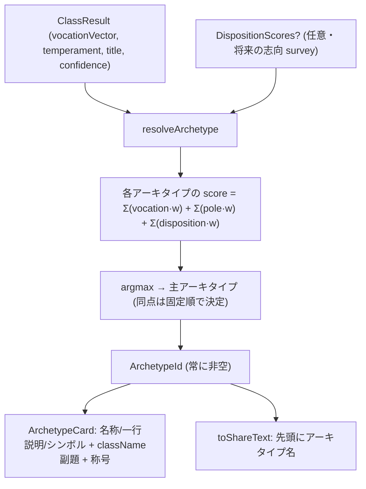

# Design Document — diagnosis-archetypes

## Overview

RPGクラス診断の主役を、12のプロ・アーキタイプ（Builder / Architect / Guardian / Firefighter / Innovator / Optimizer / Researcher / Mentor / Commander / Strategist / Integrator / Craftsman）へ刷新する。アーキタイプは既存 `ClassResult`（職掌 vocationVector × 気質 temperament、＋将来の志向 disposition）から **signature best-match（argmax）** で決定論的に導出する。結果カードはアーキタイプ名＋一行説明＋シンボルをヒーローにし、従来の説明的 `className` を副題、称号（ランク）を併記する。ゲーム風異名は"おまけ"。

**Purpose**: 「あの人こういう人だよね」と現実の開発チームで通じる、性別中立で認識可能な主役タイプを提供する。
**Users**: candidate アプリでクラス診断を閲覧する候補者本人。
**Impact**: 既存フィールドから表示時に導出（型・スキーマ・既存レコード変更なし）。反映先は ClassCard / SharePanel。導出は survey 追加に応じてカバレッジが広がる（段階導入）。

### Goals

- 12アーキタイプ master（名称・一行説明・ゲーム風異名・シンボル）を app-local に定義。
- (職掌×気質×任意の志向)→主アーキタイプの決定論的導出（常に非空・tiebreak 固定）。
- ClassCard / SharePanel の提示刷新。自己完結 SVG シンボル。
- 未充足タイプの graceful degradation と、志向信号の前方互換入力。

### Non-Goals

- 各 survey の設問設計・seed（別 spec）。
- 職掌/気質/称号を算出する engine の作り直し。
- 称号ランクの線形再設計。business/Phase2、LLM フレーバー生成の刷新。

## Boundary Commitments

### This Spec Owns

- アーキタイプ master（定義・異名・シンボル）と signature（判定重み）。
- `resolveArchetype`（純関数・決定論・常に非空）と志向入力契約 `DispositionScores`。
- ClassCard / SharePanel の提示（ヒーロー=アーキタイプ・className 副題・シンボル・称号併記・共有先頭）。

### Out of Boundary

- 職掌/気質/称号の算出（`_lib/{vocation,title}.ts`, `_lib/temperament/*`）は読み取りのみ。
- `DispositionScores` を生成する survey（`worklife-disposition-survey`）、sage/strategist の seed（別 spec）。
- business の representative-class 表示。

### Allowed Dependencies

- `@bulr/types`（`Vocation`, `VocationVector`, `TemperamentSummary`, `Title`）— 型のみ。
- app-local `class-diagnosis/_lib/definitions.ts`（`VOCATIONS` 等）、`_lib/temperament/*`（pole 判定の参照）。
- 依存方向 `app → @bulr/types` の単方向のみ。

### Revalidation Triggers

- `Vocation` union の増減（sage/strategist 開放）→ signature の vocation 重みキー整合をコンパイルで検出。
- `DispositionScores` 契約（キー集合）の変更 → `worklife-disposition-survey` の再確認。
- `ClassResult` の形状変更 → 導出入力の再確認。

## Architecture

### Existing Architecture Analysis

- 判定は純関数パイプライン（foldVocations → scoreTemperament → resolveTitle → assembleClass）で `ClassResult` を組成。`className` は `assembleClass` が決定論生成（R7.2 契約・不変）。
- 重みテーブル方式は `definitions.ts` の `CATEGORY_AFFINITY`（`Record<key, Partial<Record<Vocation, number>>>`）で確立済み → アーキタイプ signature も同型で実装し整合させる。
- 提示は Presentational（ClassCard / SharePanel）。数値非表示（R4.5）・共有 PII/数値なし（R7.3）が既存制約。

### Dependency Direction

```
@bulr/types (Vocation / VocationVector / TemperamentSummary / Title)
        │
        ▼
class-diagnosis/_lib/archetype/          ← 新設（純関数・master・signature）
   definitions.ts / signature.ts / resolve.ts / dispositions.ts
        │
        ├────────────► _components/archetype-symbol.tsx  ← 自己完結 SVG
        ▼
_components/class-card.tsx , _components/share-panel.tsx  ← 提示反映
```

### Derivation Flow



- 未提供の信号（disposition 未回答、sage/strategist 職掌が 0）は寄与 0 → 該当アーキタイプは選ばれにくい（graceful degradation, R3.1）。
- `confidence==='low'` は参考値注記（R3.2、既存 class-card の low-confidence 注記を流用）。

## File Structure Plan

### New Files

```
apps/candidate/app/class-diagnosis/_lib/archetype/
├── definitions.ts     # ARCHETYPES master(12): id/name/tagline/gameAlias、ArchetypeId union、表示順(=tiebreak)
├── dispositions.ts    # DispositionScores 型（改善/障害対応/育成/調整/新技術）— 前方互換の入力契約
├── signature.ts       # ARCHETYPE_SIGNATURES: 各 id の vocation/pole/disposition 重み
├── resolve.ts         # resolveArchetype(result, dispositions?) 純関数 + scoreArchetype
└── *.test.ts          # 網羅・決定論・tiebreak・fallback・coverage の検証
apps/candidate/app/class-diagnosis/_components/
└── archetype-symbol.tsx   # ArchetypeId → 自己完結インライン SVG エンブレム（役割/タイトル付き）
```

### Modified Files

- `_components/class-card.tsx` — h2 ヒーローをアーキタイプ名に、直下に tagline、`ArchetypeSymbol`、`className` を副題化。称号バッジは維持。`resolveArchetype(result)` を呼ぶ。
- `_components/share-panel.tsx` — `toShareText` 先頭をアーキタイプ名に、`className`/称号を補助行へ。
- 各 `*.test.tsx` — ヒーロー=アーキタイプ／副題=className／シンボル表示／共有先頭 の検証追加。

> `className` 生成（`assemble.ts`）・判定純関数・型（`packages/types`）・DB・AI は変更しない。

## Components and Interfaces

| Component | Layer | Intent | Req Coverage | Contracts |
|-----------|-------|--------|--------------|-----------|
| archetype/definitions.ts | app-local lib | 12アーキタイプ master＋表示順 | 1, 5, 8 | Data |
| archetype/signature.ts | app-local lib | 判定重み（vocation/pole/disposition） | 2, 3 | Data |
| archetype/resolve.ts | app-local lib（純関数） | 決定論 best-match 導出 | 2, 3, 9 | Service(pure) |
| archetype/dispositions.ts | app-local lib | 志向入力契約（前方互換） | 3 | Data(type) |
| ArchetypeSymbol | UI | タイプ別自己完結 SVG | 6 | State(props) |
| ClassCard（改） | UI | ヒーロー=アーキタイプ＋symbol、className 副題、称号併記 | 4 | State(props) |
| SharePanel / toShareText（改） | UI + 純関数 | 共有先頭にアーキタイプ名 | 7 | State(props) |

### app-local lib

#### archetype/resolve.ts

| Field | Detail |
|-------|--------|
| Intent | 職掌×気質(×志向)から主アーキタイプを決定論的に best-match |
| Requirements | 2.1, 2.2, 2.3, 2.4, 3.1, 9.2 |

**Responsibilities & Constraints**

- 純関数のみ・副作用/乱数/日付なし → 決定論（R2.2）。
- 常に非空の `ArchetypeId` を返す（R2.3）。同点は `ARCHETYPE_ORDER` の固定順（R2.4）。
- 利用可能な信号のみ加点。未提供信号は 0 寄与（R3.1）。

**Contracts**: Service [x]（純関数）

##### Service Interface

```typescript
import type { ClassResult, Vocation, TemperamentPole } from '@bulr/types';

/** 12アーキタイプの識別子（表示順＝tiebreak 順）。 */
export type ArchetypeId =
  | 'builder' | 'architect' | 'guardian' | 'firefighter'
  | 'innovator' | 'optimizer' | 'researcher' | 'mentor'
  | 'commander' | 'strategist' | 'integrator' | 'craftsman';

/** 志向信号（前方互換・任意）。worklife-disposition-survey が将来供給。 */
export type DispositionKey =
  | 'improvement' | 'incident' | 'mentoring' | 'coordination' | 'newTech';
export type DispositionScores = Partial<Record<DispositionKey, number>>; // 0..100

/** 1アーキタイプの signature（重みベクトル）。全キー任意・欠損は寄与0。 */
export interface ArchetypeSignature {
  vocation?: Partial<Record<Vocation, number>>;
  pole?: Partial<Record<TemperamentPole, number>>;
  disposition?: Partial<Record<DispositionKey, number>>;
}

/** 主アーキタイプを決定論的に導出する（常に非空）。 */
export function resolveArchetype(
  result: ClassResult,
  dispositions?: DispositionScores,
): ArchetypeId;

/** テスト・可観測性用の素点（argmax 前）。 */
export function scoreArchetype(
  result: ClassResult,
  dispositions?: DispositionScores,
): Record<ArchetypeId, number>;
```

- Preconditions: `result` は有効な `ClassResult`（pipeline が保証）。
- Postconditions: 返り値は常に 12 のいずれか。同一入力→同一値。
- Invariants: `ARCHETYPE_SIGNATURES` と `ARCHETYPES` は 12 キー完備（`Record<ArchetypeId, …>` でコンパイル時保証）。

**Implementation Notes**

- score = Σ(`vocationVector[v]` × `sig.vocation[v]`) + Σ(該当 pole が determined なら `sig.pole[p]` × 100) + Σ(`dispositions[k]` × `sig.disposition[k]`)。
- pole は `temperament.poles`（determined のみ）を参照。partial/null でも vocation 項だけで非空判定可能。
- 重みは下記「Data: signature」を転記。実データ校正は後続。

#### archetype/definitions.ts（master）

| Field | Detail |
|-------|--------|
| Intent | 12アーキタイプの名称・一行説明・ゲーム風異名・表示順 |
| Requirements | 1.1, 1.2, 1.3, 5.1, 5.3, 8.1, 8.4 |

```typescript
export interface Archetype {
  id: ArchetypeId;
  name: string;      // プロ名（例: 'つくり手'）
  handle: string;    // 英語ハンドル（例: 'Builder'）
  tagline: string;   // 「どんな人か」一行（数字・順位なし, R8.4）
  gameAlias: string; // おまけのゲーム風異名（性別中立, R5.3）
}
export const ARCHETYPES: Record<ArchetypeId, Archetype>;
export const ARCHETYPE_ORDER: readonly ArchetypeId[]; // tiebreak
```

### UI

#### ArchetypeSymbol（新）

| Field | Detail |
|-------|--------|
| Intent | ArchetypeId → 自己完結インライン SVG エンブレム |
| Requirements | 6.1, 6.2, 6.3, 6.4 |

**Implementation Notes**

- 共通フレーム（六角形/盾）＋タイプ別グリフ、デザインシステムのトークン配色（navy/copper 系）。外部 fetch/画像なし（R6.3）。
- `role="img"` ＋ `<title>{name}</title>`／`aria-label` でアクセシブル（R6.4）。サイズは props。

#### ClassCard（改）/ SharePanel（改）

- ClassCard: L110 の `<h2>{className}</h2>` を `ArchetypeSymbol` ＋ `<h2>{ARCHETYPES[id].name}</h2>` ＋ tagline に置換。直下に `className` 副題（`text-sm text-muted`）。称号バッジ維持。`const id = resolveArchetype(result)`。
- toShareText: `const a = ARCHETYPES[resolveArchetype(result)]`、先頭を `私のタイプは「${a.name}」！` に、`className`/称号を補助行へ。PII/数値なし維持（R7.3）。

## Data: アーキタイプ master と signature（確定ドラフト）

### master（12）

| id | handle / name | 一行説明（tagline） | ゲーム風異名 |
|---|---|---|---|
| builder | Builder / つくり手 | 手を動かして動くものを次々形にする | 鍛冶職人 |
| architect | Architect / 設計者 | 全体構造を描き長く効く土台を作る | 城の設計主 |
| guardian | Guardian / 品質の番人 | 壊れない・止まらないを守り抜く | 盾の守護者 |
| firefighter | Firefighter / 火消し | 障害・炎上の最前線で即座に沈める | 救援の遊撃兵 |
| innovator | Innovator / 開拓者 | 新技術・新領域にいち早く飛び込む | 冒険者 |
| optimizer | Optimizer / 改善屋 | 既存を測って磨き無駄を削る | 錬成師 |
| researcher | Researcher / 探究者 | 深く調べ・データで本質を示す | 賢者 |
| mentor | Mentor / 育成役 | 人を伸ばしチームの力を底上げ | 指南役 |
| commander | Commander / まとめ役 | 方針を定めチームを動かし切る | 統率者 |
| strategist | Strategist / 戦略家 | 何を作るべきかを見極め盤面を設計 | 軍師 |
| integrator | Integrator / 調整役 | 人と技術の間をつなぎ全体を回す | 吟遊詩人 |
| craftsman | Craftsman / 職人 | 一点を極める深さとこだわり | 名匠 |

### signature（初期重み・校正可能）

vocation 記号: van=前衛 rear=後衛 grd=守護 sage=賢者 cmd=指揮 str=策士 rng=遊撃。pole/disposition は加点極。

| id | vocation 重み | pole 加点 | disposition 加点 |
|---|---|---|---|
| builder | van .6, rear .6, rng .5 | improviser, challenger | — |
| architect | rear .5, grd .4, sage .4 | planner, deepener | — |
| guardian | grd .9 | stabilizer, deepener | — |
| firefighter | grd .5, rng .5 | improviser, challenger | incident（強） |
| innovator | rng .4, sage .3, van .3 | explorer（強）, challenger | newTech（強） |
| optimizer | rear .4, grd .4, van .3 | deepener, stabilizer | improvement（強） |
| researcher | sage .9 | explorer, deepener, solo | — |
| mentor | cmd .4, rng .2 | collab（強）, deepener | mentoring（強） |
| commander | cmd .9 | planner, collab | — |
| strategist | str .9 | planner | — |
| integrator | rng .5, cmd .4 | collab（強）, improviser | coordination（強） |
| craftsman | rear .3, van .3, grd .3 | deepener（強）, stabilizer, solo | — |

> 命名・重みは spec 上で差し替え可能（キー構造は固定）。sage/strategist は survey 未整備のため researcher/strategist は現状ほぼ不到達（下記 Coverage）。

### Coverage（現行データでの到達性・R3）

| 状態 | アーキタイプ | 開放条件 |
|---|---|---|
| ✅ 到達可 | builder / architect / guardian / innovator / commander / craftsman | 既存 職掌+気質 |
| ⚠️ 弱信号 | optimizer / mentor / firefighter / integrator | worklife-disposition-survey |
| 🔒 survey 待ち | researcher（sage-survey）/ strategist（pdm-strategist-survey） | 職掌開放 |

## Requirements Traceability

| Requirement | Components |
|---|---|
| 1.1–1.3 | archetype/definitions.ts（master 12・中立プロ語彙） |
| 2.1–2.4 | archetype/resolve.ts（best-match・決定論・非空・固定 tiebreak） |
| 3.1 | resolve.ts（利用可能信号のみ加点＝graceful degradation） |
| 3.2 | ClassCard（low-confidence 注記） |
| 3.3 | dispositions.ts（前方互換入力）＋ signature.disposition |
| 4.1–4.5 | ClassCard（ヒーロー/説明/副題/称号/数値非表示） |
| 5.1–5.3 | definitions.ts（gameAlias・従属表示・中立） |
| 6.1–6.4 | ArchetypeSymbol（自己完結 SVG・表示・アクセシブル） |
| 7.1–7.3 | SharePanel/toShareText |
| 8.1–8.4 | definitions.ts / ArchetypeSymbol（中立・単一セット・性別属性不使用・数字なし） |
| 9.1–9.3 | resolve.ts（既存フィールドから導出・移行なし・定義更新即反映） |

## Error Handling

- 純関数のため実行時エラー面は最小。`Record<ArchetypeId, …>` 網羅でキー欠落をコンパイル排除。
- `resolveArchetype` は全 score が 0（極端に信号が乏しい）でも `ARCHETYPE_ORDER` 先頭へ決定論的にフォールバックし非空を保証（R2.3）。
- ArchetypeSymbol は未知 id を型で排除（`Record` 網羅）。

## Testing Strategy

### Unit（archetype/*.test.ts）

1. `ARCHETYPES`／`ARCHETYPE_SIGNATURES` が 12 キー完備・非空、`ARCHETYPE_ORDER` が 12 を過不足なく含む — R1.1/2.3。
2. `resolveArchetype` 決定論: 代表 `ClassResult` に対する期待 id 一致、同一入力の反復一致 — R2.1/2.2。
3. tiebreak: 同点を構成した入力で `ARCHETYPE_ORDER` 先頭が選ばれる — R2.4。
4. graceful degradation: sage/strategist が 0・disposition 未提供でも非空、researcher/strategist が選ばれない（Coverage 準拠）— R3.1。
5. 前方互換: `dispositions` を与えると optimizer/firefighter/mentor/integrator の score が上がり選択が変化 — R3.3。
6. 命名品質: 全 name/tagline/gameAlias に数字なし、gameAlias が気質16型異名集合と非重複、性別含意語の禁則リスト不含 — R8.1/8.4。

### Component（既存テストへ追加）

1. ClassCard: full 結果でヒーロー=アーキタイプ名＋tagline＋`ArchetypeSymbol`、副題=`className`、称号併記、数値非表示 — R4.1–4.5/6.2。
2. ClassCard: `confidence==='low'` で参考値注記 — R3.2。
3. toShareText: 先頭にアーキタイプ名、`className`/称号は補助、PII/数値なし — R7.1–7.3。
4. ArchetypeSymbol: 12 id すべてで `role="img"`＋タイトルを描画、外部参照（http/xlink 外部）を含まない — R6.1/6.3/6.4。
