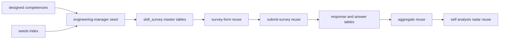

# Design Document — engineering-manager-survey

## Overview

**Purpose**: エンジニアリングマネージャー向けの独立スキルアンケート（`jobType='engineering-manager'`）を新設し、候補者本人のマネジメントスキルバランスの理解と、採用側の一次フィルタ（EM コンピテンシーのカバレッジ判定）を可能にする。

**Users**: 候補者（EM 志望・現任）が回答し自己分析で結果を確認する。採用担当者は回答カバレッジを一次フィルタとして利用する。

**Impact**: 既存 skill-survey / self-analysis 基盤は survey 非依存に動作するため、新 survey は **seed 追加のみ**で一覧・回答・自己分析に出現する。スキーマ・`score_kind` enum・集計純関数・フォーム描画・送信・必須判定・クールダウン・履歴・可視化コンポーネントは**すべて無変更**。コード成果物は ①`engineering-manager.ts` seed 新規作成 ②`seeds/index.ts` への登録 ③冪等・構造を検証する統合テスト に限定される。

### Goals

- `jobType='engineering-manager'` の独立 survey を seed で提供し、10 コンピテンシーカテゴリで EM 能力を多角的にカバーする（Req 1, 2）。
- 各コンピテンシーに「実践してきたこと（breadth）」＋「コンピテンシー習熟度（proficiency）」を配置し、全 10 カテゴリを熟練度レーダーに乗せる（Req 4）。
- 冒頭にマネジメント経験プロフィール、要所に自由記述を配置する（Req 2.2, 3.4）。
- 既存の回答保存・クールダウン・自己分析・版履歴・可視化を改修なしで再利用する（Req 7, 8）。
- 既存 IC アンケートと既存集計結果の非回帰を担保する（Req 10）。

### Non-Goals

- 代表習熟度ペア（ツール選択方式）の採用（Req 4.4 によりコンピテンシー別習熟度を採る）。
- EM レベル（line manager / manager-of-managers / director）別のアンケート出し分け（プロフィール設問で申告、本体は単一）。
- 新規フォーム描画／可視化コンポーネントの実装、DB スキーマ・enum 変更、既存アンケート内容の変更。

## Boundary Commitments

### This Spec Owns

- `jobType='engineering-manager'` の survey マスタ定義（カテゴリ／サブカテゴリ／設問／選択肢／level／scoringKind／isRequired）と、その冪等 seed・登録。
- CSV を持たない設問・選択肢の設計内容。

### Out of Boundary

- フォーム描画（`survey-form.tsx`）、回答送信・必須検証・クールダウン（`submit-survey.ts` ほか）、自己分析の検出・集計・可視化（`aggregate()` / `coverage-bars.tsx` / `skill-balance-radar.tsx`）、版履歴 — survey 非依存のため**無変更で再利用**。
- 既存 IC アンケート（backend / frontend / ai-driven-development / infrastructure-sre）の内容・必須判定・集計。
- DB スキーマ・`score_kind` enum・共有コンポーネント。

### Allowed Dependencies

- 前提依存（マージ済み）: `skill-survey` 基盤、`skill-survey-proficiency-scale`（`choice.level` / `question.scoring_kind` / `aggregate()` の proficiency 拡張 / 熟練度レーダー）。
- 既存テーブル: `skill_survey` 系 4 階層、`skill_survey_response` / `skill_survey_answer`、`self_analysis`。
- 既存設定: 再回答クールダウン（既定 30 日）。
- 依存制約: パッケージ依存方向 `apps → packages`。seed は `@bulr/db` の schema/client のみ参照。

### Revalidation Triggers

- seed 登録経路（`seeds/index.ts`）の構造変更。
- マスタ 4 階層のスキーマ・一意キー・`score_kind` enum 変更。
- 必須設問セットの変更（送信バリデーションの結果が変わる）。

## Architecture

### Existing Architecture Analysis

- マスタ 4 階層・冪等 upsert・標準習熟度ラベルは infra-sre / frontend と同一。`runEngineeringManagerSkillSurveySeed` は同型（survey→category→question→choice を `onConflictDoUpdate`、id 不変、件数 console 出力）。
- 保持すべき不変点: survey 非依存性、集計純関数性、後方互換、依存方向 `apps → packages`。

### Architecture Pattern & Boundary Map



**Key Decisions**: 既存 seed パターンの複製。新規アーキテクチャ要素なし。本 spec は `engineering-manager.ts` と `index.ts` 登録行のみ所有。

### Technology Stack

| Layer | Choice / Version | Role in Feature | Notes |
| ----- | ---------------- | --------------- | ----- |
| Data / Storage | drizzle-orm（既存）/ PostgreSQL | seed の冪等 upsert | 既存 schema、マイグレーション無し |
| Tooling | tsx（既存）| `seeds/index.ts` CLI 実行 | `tsx packages/db/src/seeds/index.ts` |
| Test | vitest（既存）| 冪等・構造検証（DB ゲート）| `DATABASE_URL` 未設定時 skip、クリーン DB 推奨 |

## File Structure Plan

### Created Files

```
packages/db/src/
├── seeds/skill-surveys/
│   └── engineering-manager.ts        # seed データ定義 + runEngineeringManagerSkillSurveySeed（infrastructure-sre.ts と同型）
└── __tests__/
    └── engineering-manager-survey.integration.test.ts   # 冪等性・構造検証（DB ゲート）
```

### Modified Files

- `packages/db/src/seeds/index.ts` — `runEngineeringManagerSkillSurveySeed` を re-export し、`main()` の実行列へ追加（infrastructure-sre の直後）。

## 設問設計（中核）

CSV を持たないため本セクションが設問の正本。標準習熟度ラベル（level 0–3）: L0 未経験・知識なし／L1 学習・理解はある（実務経験なし）／L2 実務で実践したことがある／L3 設計・改善を主導／チームへ展開・標準化した。

### マネジメント経験プロフィール（先頭・集計対象外）

カテゴリ `マネジメント経験プロフィール`（displayOrder 0）。全設問 `single_choice`・`scoringKind` 無し・`isRequired=false`。

| 設問 | 選択肢 |
| ---- | ------ |
| マネジメント経験年数を選択してください。 | 未経験・1年未満 / 1〜3年 / 3〜5年 / 5〜10年 / 10年以上 |
| 直近で管理したチーム規模を選択してください。 | 経験なし / 1〜3名 / 4〜7名 / 8〜15名 / 16名以上 |
| マネージャーを管理した経験（manager-of-managers）はありますか？ | はい / いいえ |

### コンピテンシーカテゴリ（10）

各カテゴリは 1 カテゴリオブジェクト（subcategory='コンピテンシー'、一部に自由記述）で、**2 つの breadth 設問（multi_choice）＋ 1 つの習熟度設問（single_choice, proficiency）**で構成。先頭 breadth に `isRequired=true`。習熟度設問の本文は「〈カテゴリ〉の習熟度を選択してください。」、選択肢は標準習熟度ラベル。

| # | カテゴリ | breadth-A（必須・実践）／ breadth-B（実践）の主旨 | 追加 |
| - | -------- | --------------------------------------------------- | ---- |
| 1 | ピープルマネジメント | A: 1on1・フィードバック・信頼構築 ／ B: モチベーション・心理的安全性・困難な会話 | free_text「難しい意思決定とその学び」 |
| 2 | 採用・チーム組成 | A: 採用要件・構造化面接・パイプライン ／ B: オンボーディング・チーム編成・D&I 採用 | — |
| 3 | 育成・キャリア支援 | A: コーチング・メンタリング ／ B: キャリアラダー・後継者育成・強みベース役割設計 | free_text「印象的な育成事例」 |
| 4 | パフォーマンスマネジメント | A: 目標設定（OKR/MBO）・評価レビュー ／ B: 報酬・昇進・ローパフォーマー対応・公平性 | — |
| 5 | デリバリーマネジメント | A: スコープ・見積もり・優先順位 ／ B: リスク・依存管理・アジャイル運用・横断調整 | — |
| 6 | 技術リーダーシップ | A: 技術方針・アーキ判断・技術選定への関与 ／ B: 品質/レビュー文化・技術的負債・標準策定 | — |
| 7 | ステークホルダー・コミュニケーション | A: 経営・PM・他部門連携 ／ B: 期待値調整・交渉・影響力（influence without authority） | — |
| 8 | 戦略・組織運営 | A: ロードマップ・予算・リソース計画 ／ B: 組織設計・目標カスケード・ビジョン浸透 | free_text「マネジメント哲学」 |
| 9 | チーム文化・エンゲージメント | A: 心理的安全性・エンゲージメント計測 ／ B: 文化醸成・DEI・バーンアウト予防 | — |
| 10 | プロセス・オペレーショナルエクセレンス | A: プロセス改善・生産性メトリクス（DORA/SPACE）／ B: インシデント文化・オンコール方針・ナレッジ共有 | — |

合計: プロフィール 3 + コンピテンシー 10×3（=30）+ 自由記述 3 = **約 36 設問**。必須 10（各コンピテンシー先頭 breadth）、proficiency 10（コンピテンシーごと 1）。選択肢総数は約 200。

> 規模補足: EM は 1 設問あたりの多肢選択（breadth）が濃く、IC サーベイ（46–69 設問）より設問数は少なめだが選択肢密度は同等。各コンピテンシーの breadth をさらに分割すれば 50+ 設問へ拡張可能（seed 冪等のため後追い容易）。

## Data Models

既存スキーマを変更なしで使用。seed が書き込むレコード形状:

- `skill_survey`: `{ jobType:'engineering-manager', title:'エンジニアリングマネージャー スキルアンケート', isActive:true }`
- `skill_survey_category`: `{ skillSurveyId, name, subcategory, displayOrder }`（(surveyId,name,subcategory) 一意）
- `skill_survey_question`: `{ categoryId, body, questionType, scoringKind|null, isRequired, displayOrder }`（(categoryId,body) 一意）
- `skill_survey_choice`: `{ questionId, label, level|null, displayOrder }`（(questionId,label) 一意）

不変条件: proficiency 設問の各選択肢に level 0–3 を昇順付与。breadth multi_choice / プロフィール single_choice / free_text の選択肢は level 無し（null）。

## Error Handling

- seed はトランザクション内で実行し、いずれかの upsert 失敗時に全体ロールバック（infra-sre 同型）。
- 必須/送信バリデーション・クールダウンは既存 `submit-survey.ts` が担当（本 spec は seed の `isRequired` 付与のみ）。

## Testing Strategy

### Integration Tests（DB ゲート、`packages/db/src/__tests__/engineering-manager-survey.integration.test.ts`）

1. **冪等性**（Req 9.2）: `runEngineeringManagerSkillSurveySeed` を 2–3 回実行し設問・選択肢件数が増えない。
2. **survey 提供**（Req 1.1）: `jobType='engineering-manager'` が 1 件・`isActive=true`・期待 title。
3. **カテゴリ構成**（Req 2.1）: コンピテンシー 10 カテゴリが存在し、マネジメント経験プロフィールが displayOrder 最小（先頭）。
4. **コンピテンシー別習熟度**（Req 4.1, 4.3, 5.1）: 各コンピテンシーカテゴリに breadth multi_choice と proficiency single_choice が共存し、proficiency 設問は計 10・選択肢 level 0–3。
5. **必須設問**（Req 6.1）: `isRequired=true` が各コンピテンシーに最低1件・計10件、プロフィール設問は必須でない。
6. **enum 健全性**（Req 5.3）: 使う scoringKind は `proficiency` のみ（recency/frequency 未使用）。
7. **自由記述**（Req 3.4）: free_text 設問が存在し、いずれも `isRequired=false`。
8. **非回帰**（Req 10）: backend / frontend / ai-driven-development / infrastructure-sre / engineering-manager の 5 seed 投入で各 jobType が衝突せず共存。

## Requirements Traceability

| Requirement | Summary | Design Element |
| ----------- | ------- | -------------- |
| 1.1–1.4 | EM survey 提供・独立性 | `engineering-manager.ts` survey 定義 / 既存一覧の survey 非依存表示 |
| 2.1–2.4 | 10コンピテンシー・プロフィール・順序・ボリューム | 設問設計（プロフィール＋10カテゴリ）/ displayOrder 規約 |
| 3.1–3.5 | ハイブリッド形式・ラベル・既存描画 | 設問設計の型指定 / 標準習熟度ラベル / free_text / 既存 `questionType` 描画 |
| 4.1–4.4 | コンピテンシー別習熟度・代表ペア不採用 | 各コンピテンシーの breadth＋proficiency / Non-Goals |
| 5.1–5.3 | proficiency 付与・経験/プロフィールは分類なし・enum 不変 | Data Models 不変条件 / Test 4,6 |
| 6.1–6.4 | 必須・バリデーション | 必須設問規約（各コンピテンシー先頭 breadth）/ 既存 `submit-survey.ts` |
| 7.1–7.4 | 永続化・クールダウン・版 | 既存 response/answer・クールダウン・履歴（無変更）|
| 8.1–8.4 | 自己分析スナップショット・可視化 | 既存 `aggregate()` / 可視化（無変更）|
| 9.1–9.4 | 冪等 seed・登録・level/分類付与 | `runEngineeringManagerSkillSurveySeed` / `index.ts` / Test 1,4 |
| 10.1–10.3 | 非回帰 | Non-Regression Test 8 / スキーマ・共有無変更 |
