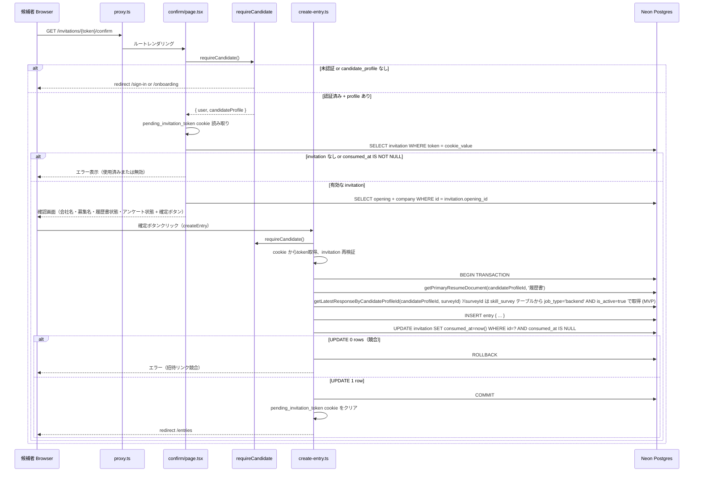
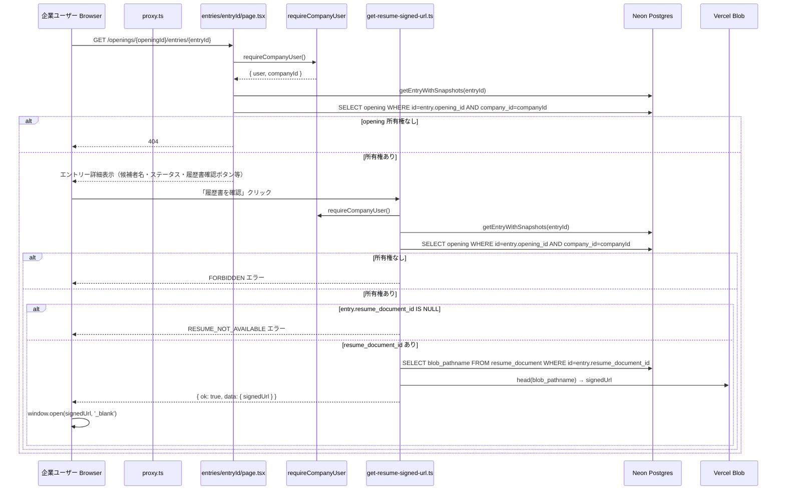

# Design Document — entry-flow

## Overview

**Purpose**: 本 spec は Wave 3 の中核として、候補者所有資産（`resume_document` / `skill_survey_response`）と企業所有資産（`opening` / `invitation`）を `entry` エンティティで接続する。候補者が `pending_invitation_token` cookie を消費してエントリーを確定し、企業ユーザーがエントリー一覧から候補者書類を確認できる両方向の動線を確立する。

**Users**: 候補者（`apps/candidate` を利用するエンジニア求職者）が招待リンク経由でエントリーを確定する直接の受益者。企業ユーザー（`apps/business` を利用する採用担当者）がエントリー確認の受益者。後続 Wave 3 `session-from-entry` と Wave 4 `admin-operations` は `getEntryWithSnapshots` seam の消費者。

**Impact**: Wave 3 `company-and-opening` 完了時点で存在しなかった `entry` テーブルを新設し、候補者側に `/invitations/[token]/confirm` と `/entries` ルートを追加し、企業側に `/openings/[openingId]/entries` と `/openings/[openingId]/entries/[entryId]` ルートを追加する。`resume_document` テーブルの FK 制約（`ON DELETE SET NULL`）を本 spec の migration で確定する。

### Goals

- `packages/db` に `entry` スキーマ（5 FK + status enum + UNIQUE 制約）を追加し、migration を生成する
- `createEntry` Server Action を `apps/candidate` に実装し、token 検証 + transaction + race condition 対策を行う
- `getResumeSignedUrlForBusiness` Server Action を `apps/business` に実装し、entry → opening → company 所有権検証を行う
- 候補者向け queries（`getEntriesByCandidateProfileId`）、企業向け queries（`getEntriesByOpeningId`）、downstream seam（`getEntryWithSnapshots`）を `packages/db` に追加する
- 候補者側 UI（`/invitations/[token]/confirm` / `/entries`）と企業側 UI（`/openings/[openingId]/entries` / `[entryId]`）を実装する

### Non-Goals

- 面接セッション作成（Wave 3 `session-from-entry`）
- エントリーの拒否・進捗ワークフロー（MVP は status 表示のみ）
- 候補者によるエントリー取り消し（Wave 5+）
- エントリー通知メール（Wave 5+）
- スカウト機能（Wave 5+）

---

## Boundary Commitments

### This Spec Owns

- `packages/db/src/schema/entry.ts`（`entry` テーブル + `entryStatus` pgEnum）
- `packages/db/src/schema/index.ts` 更新（entry のバレル export 追加）
- `packages/db/src/queries/entry/get-entries-by-candidate-profile-id.ts`
- `packages/db/src/queries/entry/get-entries-by-opening-id.ts`
- `packages/db/src/queries/entry/get-entry-with-snapshots.ts`
- `packages/db/src/queries/index.ts` 更新（entry クエリの re-export 追加）
- drizzle-kit migration ファイル（`packages/db/drizzle/*_entry.sql`）
- `apps/candidate/app/invitations/[token]/confirm/page.tsx`（エントリー確認画面）
- `apps/candidate/app/invitations/[token]/confirm/_actions/create-entry.ts`（Server Action）
- `apps/candidate/app/entries/page.tsx`（エントリー一覧）
- `apps/business/app/(interviewer)/openings/[openingId]/entries/page.tsx`（企業側エントリー一覧）
- `apps/business/app/(interviewer)/openings/[openingId]/entries/[entryId]/page.tsx`（企業側エントリー詳細）
- `apps/business/app/(interviewer)/openings/[openingId]/entries/[entryId]/_actions/get-resume-signed-url.ts`（Server Action）

### Out of Boundary

- `invitation` テーブル・token 生成（`company-and-opening` が所有）
- `resume_document` のアップロード・管理（`resume-registration` が所有）
- `skill_survey_response` の作成・管理（`skill-survey` が所有）
- `candidate_profile` の変更（`candidate-auth-onboarding` が所有）
- `pending_invitation_token` cookie の設定（`candidate-auth-onboarding` 7.1 が所有）
- `interview_session` の作成（Wave 3 `session-from-entry` が所有）
- entry status の手動更新 UI（MVP はステータス表示のみ）

### Allowed Dependencies

- `company-and-opening` が確立する `opening` / `invitation` / `company` スキーマ
- `candidate-auth-onboarding` が確立する `requireCandidate` / `candidateProfile` テーブル
- `resume-registration` が確立する `resume_document` テーブル + `getPrimaryResumeDocument` クエリ
- `skill-survey` が確立する `skill_survey_response` テーブル + `getLatestResponseByCandidateProfileId` クエリ
- `packages/auth` の `requireCompanyUser` / `requireCandidate` / `authedAction`（既存）
- `@vercel/blob` の `head()` API（`apps/business` 側の署名 URL 発行に使用）
- `nanoid`（既存 convention、id 生成）
- `apps/* → packages/*` 単方向依存ルール

### Revalidation Triggers

- `invitation.consumed_at` の型変更 → `createEntry` の消費ロジックを再確認
- `opening.company_id` の命名変更 → `getResumeSignedUrlForBusiness` 所有権検証を再確認
- `requireCompanyUser` の戻り値型変更 → `apps/business` 側 Server Actions を再確認
- `requireCandidate` の戻り値型変更 → `apps/candidate` 側 Server Actions を再確認
- `getPrimaryResumeDocument` のシグネチャ変更 → `createEntry` のスナップショット取得を再確認

---

## Architecture

### Existing Architecture Analysis

Wave 3 `company-and-opening` 完了時点の構成:

- `packages/db/src/schema/company.ts`: `company` テーブル（id, name）
- `packages/db/src/schema/opening.ts`: `opening` テーブル（id, company_id FK, title, description, status enum）
- `packages/db/src/schema/invitation.ts`: `invitation` テーブル（id, opening_id FK, token UNIQUE, expires_at nullable, consumed_at nullable）
- `packages/auth/src/guards.ts`: `requireCompanyUser` — `{ user, companyId }` を返す
- `apps/candidate/app/invitations/[token]/page.tsx`: トークンを `pending_invitation_token` cookie（HttpOnly, Max-Age 3600）に保存して `/` または `/onboarding` にリダイレクト
- `packages/db/src/queries/resume/`: `getPrimaryResumeDocument(candidateProfileId, kind)` が公開済み（Wave 3 seam として設計）
- `packages/db/src/queries/skill-survey/`: `getLatestResponseByCandidateProfileId(candidateProfileId, surveyId)` と `SkillSurveyResponseWithAnswers` 型が公開済み

**変更点**:
1. `packages/db/src/schema/entry.ts` を追加
2. `packages/db/src/schema/index.ts` に `entry` のバレル export を追加
3. `packages/db/src/queries/entry/` 配下に 3 クエリ関数を追加
4. `packages/db/src/queries/index.ts` に entry クエリの re-export を追加
5. `apps/candidate/app/invitations/[token]/confirm/` を追加
6. `apps/candidate/app/entries/` を追加
7. `apps/business/app/(interviewer)/openings/[openingId]/entries/` 配下を追加

### Architecture Pattern & Boundary Map

```mermaid
graph TB
    subgraph CandidateApp[apps/candidate bulr.net]
        ConfirmPage[invitations/token/confirm/page.tsx]
        CreateEntryAction[create-entry.ts Server Action]
        EntriesListPage[entries/page.tsx]
    end
    subgraph BusinessApp[apps/business bz.bulr.net]
        OEListPage[openings/openingId/entries/page.tsx]
        OEDetailPage[openings/openingId/entries/entryId/page.tsx]
        GetSignedUrlAction[get-resume-signed-url.ts Server Action]
    end
    subgraph AuthPkg[packages/auth]
        RequireCandidate[requireCandidate]
        RequireCompanyUser[requireCompanyUser]
        AutredAction[authedAction]
    end
    subgraph DBPkg[packages/db]
        EntrySchema[schema/entry.ts]
        EntryQueries[queries/entry/]
        InvitationSchema[schema/invitation.ts 既存]
        ResumeDocSchema[schema/resume-document.ts 既存]
        SSResponseSchema[schema/skill-survey-response.ts 既存]
        ResumeQueries[queries/resume/ 既存]
        SSQueries[queries/skill-survey/ 既存]
    end
    subgraph Blob[Vercel Blob]
        BlobStorage[candidates/.../resumes/...]
    end

    ConfirmPage --> RequireCandidate
    CreateEntryAction --> AutredAction
    CreateEntryAction --> RequireCandidate
    CreateEntryAction --> EntrySchema
    CreateEntryAction --> InvitationSchema
    CreateEntryAction --> ResumeQueries
    CreateEntryAction --> SSQueries
    EntriesListPage --> RequireCandidate
    EntriesListPage --> EntryQueries
    OEListPage --> RequireCompanyUser
    OEListPage --> EntryQueries
    OEDetailPage --> RequireCompanyUser
    OEDetailPage --> EntryQueries
    GetSignedUrlAction --> AutredAction
    GetSignedUrlAction --> RequireCompanyUser
    GetSignedUrlAction --> EntrySchema
    GetSignedUrlAction --> ResumeDocSchema
    GetSignedUrlAction --> BlobStorage
    EntrySchema --> ResumeDocSchema
    EntrySchema --> SSResponseSchema
    EntrySchema --> InvitationSchema
```



**Architecture Integration**:

- **authedAction + requireCandidate 二重防御パターン**: `createEntry` は `authedAction` をバウンダリとして使い、body 内で `requireCandidate()` を呼ぶ。`candidate-auth-onboarding` / `resume-registration` / `skill-survey` が確立したパターンを踏襲
- **authedAction + requireCompanyUser 二重防御パターン**: `getResumeSignedUrlForBusiness` も同様に `authedAction` + 内部 `requireCompanyUser()` パターン（`company-and-opening` が確立したパターンを踏襲）
- **race condition 対策**: invitation の `WHERE consumed_at IS NULL` 条件付き UPDATE を transaction 内で行い、同時クリックでも片方しか成功しないことを保証。Drizzle の transaction API を使用
- **所有権検証の多層防御**: proxy.ts（UX リダイレクト） → Server Component（`requireCompanyUser` でページ表示前チェック） → Server Action（`requireCompanyUser` + `entry.opening_id → opening.company_id` 検証）の3層

### Technology Stack

| レイヤー | 選択 / バージョン | 本 spec での役割 | 備考 |
|---------|----------------|----------------|------|
| DB / ORM | Drizzle ORM 0.45.x + Neon Postgres | entry テーブル追加 + クエリ実装 | 既存 DB 接続継続。`{ withTimezone: true }` 統一 |
| Migration | drizzle-kit 0.31.x | entry migration 生成 | dev: push（inline env override）、prod: generate + migrate |
| Auth | packages/auth / Better Auth 1.6.x | requireCandidate / requireCompanyUser 再利用 | 既存 guards を利用 |
| Blob Storage | @vercel/blob ^0.27.3 | 企業側署名 URL 発行（head() API） | `resume-registration` が確立した Blob 規約を踏襲 |
| Frontend | Next.js 16 App Router + React 19 | entry 関連ルート群 | Server Component 中心 |
| Validation | Zod 4.x（既存） | Server Action 入力検証 | 既存 |
| ID 生成 | nanoid（既存） | entry.id 生成 | 既存 convention |
| Build | Turborepo + pnpm | — | 既存。新規 env 変数なし |

---

## File Structure Plan

### Directory Structure

```
bulr-app-mvp/
├── packages/
│   └── db/
│       └── src/
│           ├── schema/
│           │   ├── entry.ts                          # ★新規: entry テーブル + entryStatus pgEnum
│           │   └── index.ts                          # ★変更: entry のバレル export 追加
│           ├── queries/
│           │   ├── entry/
│           │   │   ├── get-entries-by-candidate-profile-id.ts  # ★新規
│           │   │   ├── get-entries-by-opening-id.ts            # ★新規
│           │   │   └── get-entry-with-snapshots.ts             # ★新規
│           │   └── index.ts                          # ★変更: entry クエリ re-export 追加
│           └── drizzle/
│               └── *_entry.sql                       # ★新規: drizzle-kit 生成
│
├── apps/
│   ├── candidate/
│   │   └── app/
│   │       ├── invitations/
│   │       │   └── [token]/
│   │       │       └── confirm/
│   │       │           └── page.tsx                  # ★新規: エントリー確認画面 Server Component
│   │       │           └── _actions/
│   │       │               └── create-entry.ts       # ★新規: createEntry Server Action
│   │       └── entries/
│   │           └── page.tsx                          # ★新規: エントリー一覧 Server Component
│   │
│   └── business/
│       └── app/
│           └── (interviewer)/
│               └── openings/
│                   └── [openingId]/
│                       └── entries/
│                           ├── page.tsx              # ★新規: 企業側エントリー一覧
│                           └── [entryId]/
│                               ├── page.tsx          # ★新規: 企業側エントリー詳細
│                               └── _actions/
│                                   └── get-resume-signed-url.ts  # ★新規: 署名 URL Server Action
```

### Modified Files

- `packages/db/src/schema/index.ts` — `entry` テーブル / `entryStatus` enum のバレル export を追加
- `packages/db/src/queries/index.ts` — `./entry/*` クエリの re-export を追加

---

## System Flows

### エントリー確定フロー（候補者）



### 企業側署名 URL 発行フロー



---

## Requirements Traceability

| 要件 | サマリー | コンポーネント | インターフェース | フロー |
|------|---------|--------------|--------------|------|
| 1.1〜1.5 | entry テーブル定義 | `EntrySchema` | `packages/db/src/schema/entry.ts` | — |
| 2.1〜2.3 | resume_document ON DELETE SET NULL | `EntrySchema` | FK 制約 | migration |
| 3.1〜3.6 | createEntry Server Action | `CreateEntryAction` | `create-entry.ts` | エントリー確定 |
| 4.1〜4.5 | エントリー確認画面 | `ConfirmPage` | `/invitations/[token]/confirm` | エントリー確定 |
| 5.1〜5.4 | 候補者エントリー一覧 | `CandidateEntriesListPage` | `/entries` | — |
| 6.1〜6.3 | getEntriesByCandidateProfileId | `GetEntriesByCandidateProfileId` | `packages/db/queries/entry/` | — |
| 7.1〜7.4 | 企業側エントリー一覧 | `BusinessEntriesListPage` | `/openings/[id]/entries` | — |
| 8.1〜8.5 | 企業側エントリー詳細 | `BusinessEntryDetailPage` | `/openings/[id]/entries/[entryId]` | 署名 URL |
| 9.1〜9.2 | getEntriesByOpeningId | `GetEntriesByOpeningId` | `packages/db/queries/entry/` | — |
| 10.1〜10.3 | getEntryWithSnapshots | `GetEntryWithSnapshots` | `packages/db/queries/entry/` | — |
| 11.1〜11.4 | getResumeSignedUrlForBusiness | `GetResumeSignedUrlForBusiness` | `get-resume-signed-url.ts` | 署名 URL |
| 12.1〜12.4 | Drizzle migration | `DrizzleMigration` | `packages/db/drizzle/` | — |

---

## Components and Interfaces

### コンポーネント一覧

| コンポーネント | ドメイン/レイヤー | 意図 | 要件カバレッジ | キー依存 | コントラクト |
|-------------|----------------|------|-------------|---------|------------|
| `EntrySchema` | packages/db | entry テーブル + entryStatus pgEnum | 1.1〜1.5, 2.1〜2.3 | Drizzle ORM | State |
| `GetEntriesByCandidateProfileId` | packages/db/queries | 候補者の全エントリー取得（opening / company JOIN） | 6.1〜6.3 | EntrySchema | Service |
| `GetEntriesByOpeningId` | packages/db/queries | 特定 opening の全エントリー取得（candidate_profile JOIN） | 9.1〜9.2 | EntrySchema | Service |
| `GetEntryWithSnapshots` | packages/db/queries | entry + 全スナップショット JOIN（Wave 3+ seam） | 10.1〜10.3 | EntrySchema | Service |
| `DrizzleMigration` | packages/db | migration ファイル生成・適用 | 12.1〜12.4 | drizzle-kit | Batch |
| `ConfirmPage` | apps/candidate | エントリー確認画面 Server Component | 4.1〜4.4 | RequireCandidate, EntrySchema, InvitationSchema | State |
| `CreateEntryAction` | apps/candidate | createEntry Server Action | 3.1〜3.6 | authedAction, RequireCandidate, EntrySchema, InvitationSchema | Service |
| `CandidateEntriesListPage` | apps/candidate | エントリー一覧 Server Component | 5.1〜5.4 | RequireCandidate, GetEntriesByCandidateProfileId | State |
| `BusinessEntriesListPage` | apps/business | 企業側エントリー一覧 Server Component | 7.1〜7.4 | RequireCompanyUser, GetEntriesByOpeningId | State |
| `BusinessEntryDetailPage` | apps/business | 企業側エントリー詳細 Server Component | 8.1〜8.5 | RequireCompanyUser, GetEntryWithSnapshots | State |
| `GetResumeSignedUrlForBusiness` | apps/business | 企業側署名 URL 発行 Server Action | 11.1〜11.4 | authedAction, RequireCompanyUser, EntrySchema, @vercel/blob | Service |

---

### packages/db レイヤー

#### EntrySchema

| フィールド | 詳細 |
|----------|------|
| Intent | `entry` テーブルの Drizzle スキーマ定義（5 FK + status enum + UNIQUE 制約） |
| Requirements | 1.1〜1.5, 2.1〜2.3 |

**Physical Data Model**

```sql
CREATE TYPE entry_status AS ENUM ('submitted', 'reviewed', 'rejected', 'progressing');

CREATE TABLE entry (
  id                       text        PRIMARY KEY,        -- nanoid
  candidate_profile_id     text        NOT NULL REFERENCES candidate_profile(id),
  opening_id               text        NOT NULL REFERENCES opening(id),
  invitation_id            text        NOT NULL REFERENCES invitation(id),
  resume_document_id       text        REFERENCES resume_document(id) ON DELETE SET NULL,  -- nullable
  skill_survey_response_id text        REFERENCES skill_survey_response(id),               -- nullable
  status                   entry_status NOT NULL DEFAULT 'submitted',
  created_at               timestamptz NOT NULL DEFAULT now(),
  updated_at               timestamptz NOT NULL DEFAULT now(),
  UNIQUE(candidate_profile_id, opening_id)
);
```

```typescript
// packages/db/src/schema/entry.ts
import { pgEnum, pgTable, text, timestamp, uniqueIndex } from 'drizzle-orm/pg-core';
import { candidateProfile } from './candidate-profile';
import { opening } from './opening';
import { invitation } from './invitation';
import { resumeDocument } from './resume-document';
import { skillSurveyResponse } from './skill-survey-response';

export const entryStatus = pgEnum('entry_status', [
  'submitted',
  'reviewed',
  'rejected',
  'progressing',
]);

export const entry = pgTable(
  'entry',
  {
    id: text('id').primaryKey(),
    candidateProfileId: text('candidate_profile_id')
      .notNull()
      .references(() => candidateProfile.id),
    openingId: text('opening_id')
      .notNull()
      .references(() => opening.id),
    invitationId: text('invitation_id')
      .notNull()
      .references(() => invitation.id),
    resumeDocumentId: text('resume_document_id')
      .references(() => resumeDocument.id, { onDelete: 'set null' }),
    skillSurveyResponseId: text('skill_survey_response_id')
      .references(() => skillSurveyResponse.id),
    status: entryStatus('status').notNull().default('submitted'),
    createdAt: timestamp('created_at', { withTimezone: true }).notNull().defaultNow(),
    updatedAt: timestamp('updated_at', { withTimezone: true }).notNull().defaultNow(),
  },
  (table) => [
    uniqueIndex('entry_candidate_opening_uniq').on(
      table.candidateProfileId,
      table.openingId,
    ),
  ],
);

export type Entry = typeof entry.$inferSelect;
export type NewEntry = typeof entry.$inferInsert;
export type EntryStatus = (typeof entryStatus.enumValues)[number];
```

#### GetEntriesByCandidateProfileId

| フィールド | 詳細 |
|----------|------|
| Intent | 候補者の全エントリーを opening / company 情報付きで取得するクエリ（候補者エントリー一覧用） |
| Requirements | 6.1〜6.3 |

**Service Interface**

```typescript
// packages/db/src/queries/entry/get-entries-by-candidate-profile-id.ts
import { db } from '../../client';
import { entry, opening, company } from '../../schema';
import { eq, desc } from 'drizzle-orm';

export type EntryWithOpeningAndCompany = {
  entry: typeof entry.$inferSelect;
  opening: Pick<typeof opening.$inferSelect, 'id' | 'title'>;
  company: Pick<typeof company.$inferSelect, 'id' | 'name'>;
};

export async function getEntriesByCandidateProfileId(
  candidateProfileId: string,
): Promise<EntryWithOpeningAndCompany[]>;
```

- Preconditions: `candidateProfileId` が有効な `candidate_profile.id`（アプリ層で `requireCandidate` により保証）
- Postconditions: `entry.created_at DESC` 順で返す。存在しない場合は空配列

#### GetEntriesByOpeningId

| フィールド | 詳細 |
|----------|------|
| Intent | 特定 opening の全エントリーを候補者名付きで取得するクエリ（企業側エントリー一覧用） |
| Requirements | 9.1〜9.2 |

**Service Interface**

```typescript
// packages/db/src/queries/entry/get-entries-by-opening-id.ts
import { db } from '../../client';
import { entry, candidateProfile } from '../../schema';
import { eq, desc } from 'drizzle-orm';

export type EntryWithCandidateProfile = {
  entry: typeof entry.$inferSelect;
  candidateProfile: Pick<typeof candidateProfile.$inferSelect, 'id' | 'displayName'>;
};

export async function getEntriesByOpeningId(
  openingId: string,
): Promise<EntryWithCandidateProfile[]>;
```

- Postconditions: `entry.created_at DESC` 順で返す。企業側スコープ検証はアプリ層で行う（`requireCompanyUser` + opening.company_id 検証）

#### GetEntryWithSnapshots

| フィールド | 詳細 |
|----------|------|
| Intent | entry の全スナップショット参照（resume + survey）を取得する Wave 3+ downstream seam |
| Requirements | 10.1〜10.3 |

**Service Interface**

```typescript
// packages/db/src/queries/entry/get-entry-with-snapshots.ts
import { db } from '../../client';
import { entry, opening, company, candidateProfile, resumeDocument, skillSurveyResponse } from '../../schema';
import { eq, leftJoin } from 'drizzle-orm';

export type EntryWithSnapshots = {
  entry: typeof entry.$inferSelect;
  opening: typeof opening.$inferSelect;
  company: typeof company.$inferSelect;
  candidateProfile: typeof candidateProfile.$inferSelect;
  resumeDocument: typeof resumeDocument.$inferSelect | null;
  skillSurveyResponse: typeof skillSurveyResponse.$inferSelect | null;
};

export async function getEntryWithSnapshots(
  entryId: string,
): Promise<EntryWithSnapshots | null>;
```

- Postconditions: entry が存在しない場合は `null`。`resumeDocument` / `skillSurveyResponse` は nullable（LEFT JOIN）

---

### apps/candidate レイヤー

#### CreateEntryAction

| フィールド | 詳細 |
|----------|------|
| Intent | `pending_invitation_token` cookie を消費して `entry` を作成し、`invitation.consumed_at` をセットする Server Action |
| Requirements | 3.1〜3.6 |

**Responsibilities & Constraints**

- `apps/candidate/app/invitations/[token]/confirm/_actions/create-entry.ts` に配置
- `authedAction` をバウンダリとして使い、body 内で `requireCandidate()` を呼ぶ（二重防御パターン）
- cookie からトークン取得 → `invitation` テーブル検索 → `consumed_at IS NULL` チェック
- Drizzle transaction 内で以下を順次実行:
  1. `getPrimaryResumeDocument(candidateProfileId, '履歴書')` でスナップショット ID 取得（null 許容）
  2. `getLatestResponseByCandidateProfileId(candidateProfileId, surveyId)` でスナップショット ID 取得（null 許容）。surveyId の解決方針: MVP では `skill_survey` テーブルから `SELECT id FROM skill_survey WHERE job_type = 'backend' AND is_active = true LIMIT 1` で取得。取得結果が空なら `skill_survey_response_id` を NULL のまま entry を作成する（アンケート未投入企業もエントリー可能）。Wave 5+ で複数職種対応する際は `opening.job_type → skill_survey.job_type` のマッピングで取得する seam に拡張する
  3. `INSERT entry { id: nanoid(), candidateProfileId, openingId: invitation.openingId, invitationId: invitation.id, resumeDocumentId, skillSurveyResponseId, status: 'submitted' }`
  4. `UPDATE invitation SET consumed_at = now() WHERE id = ? AND consumed_at IS NULL`
  5. UPDATE の affectedRows が 0 なら ROLLBACK + `CONCURRENT_CONFLICT` エラー返却
- transaction 成功後: `pending_invitation_token` cookie を削除（Max-Age=0）

**Service Interface**

```typescript
// apps/candidate/app/invitations/[token]/confirm/_actions/create-entry.ts
const createEntrySchema = z.object({
  token: z.string().min(1).regex(/^[A-Za-z0-9_-]+$/),
});

export const createEntry = authedAction(
  createEntrySchema,
  async ({ token }, { userId }) => {
    const { candidateProfile } = await requireCandidate();
    // 1. invitation 検索 + consumed_at IS NULL チェック
    // 2. transaction でスナップショット取得 + entry INSERT + invitation UPDATE
    // 3. cookie クリア
    // 4. redirect('/entries') は呼び出し元のページで行う
    return { ok: true, data: { entryId } };
  }
);
```

**Preconditions**: `pending_invitation_token` cookie が存在し、`invitation.consumed_at IS NULL` であること
**Postconditions**: `entry` テーブルに 1 件 INSERT され、`invitation.consumed_at` が `now()` に更新される
**Invariants**: `UNIQUE(candidate_profile_id, opening_id)` 制約違反時は `DUPLICATE_ENTRY` エラーを返す

#### ConfirmPage

| フィールド | 詳細 |
|----------|------|
| Intent | エントリー確認画面を表示し、候補者が確定ボタンを押せる Server Component |
| Requirements | 4.1〜4.5 |

**Responsibilities & Constraints**

- `requireCandidate()` でガード後、`pending_invitation_token` cookie から token を読み取り
- `invitation` テーブルを検索し、`consumed_at IS NOT NULL` なら「使用済みです」表示
- opening / company を JOIN して会社名・募集名を表示
- `getPrimaryResumeDocument` で候補者の主履歴書の有無を表示（存在 / 未登録）
- 確定ボタンクリックで `createEntry` を呼ぶ Client Component（確定ボタン部分のみ `'use client'`）または form action

#### CandidateEntriesListPage

| フィールド | 詳細 |
|----------|------|
| Intent | 候補者の全エントリーを一覧表示する Server Component |
| Requirements | 5.1〜5.4 |

**Responsibilities & Constraints**

- `requireCandidate()` でガード後、`getEntriesByCandidateProfileId(candidateProfile.id)` でデータ取得
- 各エントリーに企業名・募集名・エントリー日・ステータスを表示
- 空の場合は「まだエントリーがありません」Empty State + 招待リンクの説明テキストを表示

---

### apps/business レイヤー

#### GetResumeSignedUrlForBusiness

| フィールド | 詳細 |
|----------|------|
| Intent | 企業ユーザーが候補者の履歴書を署名 URL 経由で安全に閲覧するための Server Action |
| Requirements | 11.1〜11.4 |

**Service Interface**

```typescript
// apps/business/app/(interviewer)/openings/[openingId]/entries/[entryId]/_actions/get-resume-signed-url.ts
const getResumeSignedUrlSchema = z.object({
  entryId: z.string().min(1),
  openingId: z.string().min(1),
});

export const getResumeSignedUrlForBusiness = authedAction(
  getResumeSignedUrlSchema,
  async ({ entryId, openingId }, { userId }) => {
    const { companyId } = await requireCompanyUser();

    // 所有権検証: EntryWithSnapshots の opening フィールドを直接参照 (追加の opening SELECT は不要)
    const entryData = await getEntryWithSnapshots(entryId);
    if (!entryData) throw new AuthError('NOT_FOUND');
    if (entryData.opening.companyId !== companyId) throw new AuthError('FORBIDDEN');

    if (!entryData.entry.resumeDocumentId || !entryData.resumeDocument) {
      return { ok: false, error: { code: 'RESUME_NOT_AVAILABLE' } } as const;
    }

    const blob = await head(entryData.resumeDocument.blobPathname, {
      token: process.env.BLOB_READ_WRITE_TOKEN,
    });
    return { ok: true, data: { signedUrl: blob.downloadUrl } } as const;
  }
);
```

**Preconditions**: ユーザーが当該 opening の所有企業に所属すること。`BLOB_READ_WRITE_TOKEN` が設定されていること
**Postconditions**: `signedUrl` が返された場合、Vercel Blob の一時的な署名 URL（デフォルト 60 秒 TTL）

#### BusinessEntriesListPage

| フィールド | 詳細 |
|----------|------|
| Intent | 特定 opening のエントリー一覧を表示する企業側 Server Component |
| Requirements | 7.1〜7.4 |

**Responsibilities & Constraints**

- `requireCompanyUser()` でガード後、`opening.company_id` と `companyId` を照合して所有権確認
- `getEntriesByOpeningId(openingId)` でエントリー一覧取得
- 各エントリーに候補者名・エントリー日・ステータス・詳細リンクを表示
- 空の場合は「まだエントリーはありません」Empty State を表示

#### BusinessEntryDetailPage

| フィールド | 詳細 |
|----------|------|
| Intent | エントリー詳細（候補者プロフィール + 履歴書確認 + スキルアンケート確認）を表示する企業側 Server Component |
| Requirements | 8.1〜8.5 |

**Responsibilities & Constraints**

- `requireCompanyUser()` でガード後、`getEntryWithSnapshots(entryId)` でデータ取得
- `opening.company_id === companyId` を確認（他社エントリーへのアクセスを防ぐ）
- `entry.resumeDocumentId` が null でなければ「履歴書を確認」ボタンを表示（クリックで `getResumeSignedUrlForBusiness` を呼ぶ）
- `entry.skillSurveyResponseId` が null でなければスキルアンケート確認リンクを表示
- `entry.status` を表示（`submitted` / `reviewed` / `rejected` / `progressing`）
- 「面接セッションを作成」ボタンをプレースホルダとして表示（Wave 3 `session-from-entry` で機能化）

---

## Data Models

### ドメインモデル

```
candidate_profile (候補者)
  └── entry (1:N, 候補者のエントリー)
       ├── opening (N:1, エントリー先の募集)
       │    └── company (N:1, 企業)
       ├── invitation (1:1, エントリーに使われた招待)
       ├── resume_document? (1:1 nullable, エントリー時の履歴書スナップショット)
       └── skill_survey_response? (1:1 nullable, エントリー時のアンケート回答スナップショット)
```

- `entry` が候補者所有資産と企業所有資産の境界エンティティ（データオーナーシップ 2 層の境界線）
- `UNIQUE(candidate_profile_id, opening_id)` により同一候補者の同一募集への重複エントリーを DB 制約で防止
- スナップショット参照: エントリー後に候補者が履歴書を更新・削除しても、エントリーは作成時点の `resume_document.id` を保持し続ける。`ON DELETE SET NULL` により、履歴書が削除されてもエントリー自体は残る

### 整合性制約

- `entry.candidate_profile_id` → `candidate_profile.id`（NOT NULL FK）
- `entry.opening_id` → `opening.id`（NOT NULL FK）
- `entry.invitation_id` → `invitation.id`（NOT NULL FK）
- `entry.resume_document_id` → `resume_document.id`（nullable FK, **ON DELETE SET NULL**）
- `entry.skill_survey_response_id` → `skill_survey_response.id`（nullable FK）
- `entry.status` pgEnum: `'submitted' | 'reviewed' | 'rejected' | 'progressing'`
- `UNIQUE(candidate_profile_id, opening_id)` 複合 UNIQUE インデックス
- すべての timestamp は `{ withTimezone: true }`

### status ライフサイクル

```
submitted  → (企業が確認) → reviewed
reviewed   → (企業が進捗更新) → progressing
reviewed   → (企業が拒否) → rejected
progressing → (面接セッション作成 = Wave 3 session-from-entry が担当)
```

MVP では UI からの status 手動更新は実装しない。表示のみ。

---

## Error Handling

### Error Strategy

- 認証エラーは `AuthError` を throw し、`authedAction` ラッパーが `{ ok: false, error: { code, message } }` に変換してクライアントに返す
- DB 操作エラー（UNIQUE 違反等）は `authedAction` が再 throw するため、クライアントにはデフォルトエラーメッセージを表示する
- invitation 消費の race condition は `WHERE consumed_at IS NULL` + affectedRows チェックで検出し、`CONCURRENT_CONFLICT` エラーを返す

### Error Categories and Responses

| エラー種別 | コード | 日本語メッセージ例 | ハンドリング先 |
|-----------|--------|----------------|-------------|
| 未認証アクセス | `UNAUTHORIZED` | — | `/sign-in` リダイレクト |
| candidate_profile 未作成 | `CANDIDATE_PROFILE_MISSING` | — | `/onboarding` リダイレクト |
| 企業未所属 | `COMPANY_NOT_ASSOCIATED` | 「企業アカウントが必要です」 | エラー表示 |
| invitation 使用済み | `INVITATION_ALREADY_CONSUMED` | 「この招待リンクは使用済みです」 | エラー表示 |
| invitation 存在しない | `INVITATION_NOT_FOUND` | 「無効な招待リンクです」 | エラー表示 |
| 重複エントリー | `DUPLICATE_ENTRY` | 「すでにこの募集にエントリー済みです」 | エラー表示 |
| 競合（race condition） | `CONCURRENT_CONFLICT` | 「エントリー処理が競合しました。再試行してください」 | エラー表示 |
| 履歴書未登録 | `RESUME_NOT_AVAILABLE` | 「履歴書が削除されたか未登録です」 | エラー表示 |
| 他社エントリーへのアクセス | `FORBIDDEN` | — | 404 表示 |

---

## Testing Strategy

### 手動 Smoke Test（Stage 1 方針）

本 spec は Stage 1 方針に沿い自動テストフレームワークを導入しない。完了確認は以下の手動 smoke test で行う。

1. **DB migration の適用**
   - `pnpm --filter @bulr/db drizzle-kit push`（inline env override）を実行し、`entry` テーブルおよび `entry_status` enum が DB に反映されること
   - `UNIQUE(candidate_profile_id, opening_id)` インデックスが作成されること
   - `entry.resume_document_id` の FK が `ON DELETE SET NULL` になっていること

2. **エントリー確定フロー（候補者）**
   - 招待リンクから未認証でアクセス → `/sign-in?token=...` にリダイレクト（`candidate-auth-onboarding` の既存挙動）
   - サインイン後に `/invitations/{token}/confirm` で会社名・募集名が表示されること
   - 確定ボタンをクリックすると `entry` が作成され、`invitation.consumed_at` が設定されること
   - 確定後に `/entries` にリダイレクトされること
   - 同じ招待リンクで再度 `/invitations/{token}/confirm` にアクセスすると「使用済みです」が表示されること

3. **重複エントリー防止**
   - 同一候補者が同一 opening に対して 2 回エントリー確定しようとすると `DUPLICATE_ENTRY` エラーが返ること
   - DB の `UNIQUE` 制約で弾かれること

4. **候補者エントリー一覧**
   - `/entries` で自分のエントリー一覧（企業名・募集名・エントリー日・ステータス）が表示されること
   - 未認証でのアクセスが `/sign-in` にリダイレクトされること

5. **企業側エントリー一覧・詳細**
   - `/openings/{openingId}/entries` で該当 opening のエントリー一覧が表示されること
   - `/openings/{openingId}/entries/{entryId}` でエントリー詳細（候補者名・ステータス）が表示されること
   - 「履歴書を確認」ボタンクリックで署名 URL が発行され、ブラウザが新タブで PDF を開くこと
   - 他社の opening の entries にアクセスすると 404 になること

6. **署名 URL の所有権検証**
   - 別の company のエントリー ID で `getResumeSignedUrlForBusiness` を呼ぶと `FORBIDDEN` エラーが返ること

7. **ビルドとタイプチェック**
   - `pnpm build` が全 packages と apps で成功すること
   - `pnpm typecheck` が全 workspace で成功すること

---

## Security Considerations

- **多層防御**: proxy.ts（UX リダイレクト） → Server Component（`requireCandidate` / `requireCompanyUser`） → Server Action（`authedAction` + guard 再チェック）の3層。CVE-2025-29927 教訓に基づき proxy.ts のみに依存しない
- **invitation 消費 race condition 対策**: `UPDATE invitation SET consumed_at = now() WHERE id = ? AND consumed_at IS NULL` の条件付き UPDATE を transaction 内で行う。affectedRows = 0 の場合はロールバックし `CONCURRENT_CONFLICT` エラーを返す
- **企業側所有権検証多層化**: proxy.ts → Server Component（`requireCompanyUser` + opening.company_id チェック） → Server Action（`requireCompanyUser` + `entry.opening_id → opening.company_id` 検証）の多層防御
- **スナップショット参照の削除耐性**: `entry.resume_document_id` は `ON DELETE SET NULL` で定義し、履歴書削除時もエントリー自体は保持される
- **`BLOB_READ_WRITE_TOKEN` の保護**: `getResumeSignedUrlForBusiness` はサーバーサイドのみで実行し、Blob Token をクライアントに渡さない
- **入力検証**: 全 Server Action で Zod スキーマ検証必須。token は `/^[A-Za-z0-9_-]+$/` パターンで事前検証

---

## Migration Strategy

1. `packages/db/src/schema/entry.ts` を追加（`company` / `opening` / `invitation` / `candidate_profile` / `resume_document` / `skill_survey_response` テーブルが存在することが前提）
2. `packages/db/src/schema/index.ts` にバレル export を追加
3. `packages/db/src/queries/entry/` に 3 クエリ関数を追加
4. `packages/db/src/queries/index.ts` に re-export を追加
5. `drizzle-kit generate` で migration SQL を生成
6. `drizzle-kit push`（dev 環境、inline env override）で dev DB に反映
7. `drizzle-kit migrate`（prod 環境）で本番 DB に適用

**前提 migration 順序**:
- `company_and_opening` migration（company / opening / invitation テーブル）が適用済みであること
- `candidate-auth-onboarding` migration（candidate_profile テーブル）が適用済みであること
- `resume-registration` migration（resume_document テーブル）が適用済みであること
- `skill-survey` migration（skill_survey_response テーブル）が適用済みであること

**ロールバック条件**: migration 適用後に typecheck または build が失敗した場合、migration を revert して原因を調査する。`entry.resume_document_id` は nullable のため、既存データへの影響はない。
