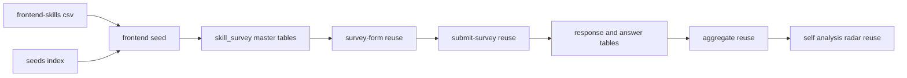

# Design Document — frontend-survey

## Overview

**Purpose**: フロントエンドエンジニア向けの独立スキルアンケート（`jobType='frontend'`）を新設し、候補者本人のフロントエンドスキルバランスの理解と、採用側の一次フィルタ（領域カバレッジ判定）を可能にする。

**Users**: 候補者（フロントエンドエンジニア）が回答し自己分析で結果を確認する。採用担当者は回答カバレッジを一次フィルタとして利用する。

**Impact**: 既存 skill-survey / self-analysis 基盤は survey 非依存に動作するため、新 survey は **seed 追加のみ**で一覧・回答・自己分析に出現する。スキーマ・enum・集計純関数・フォーム描画・送信・必須判定・クールダウン・履歴・可視化コンポーネントは**すべて無変更**。コード成果物は ①`frontend.ts` seed 新規作成 ②`seeds/index.ts` への登録 ③冪等・構造を検証する統合テスト に限定される。

### Goals

- `jobType='frontend'` の独立 survey を seed で提供し、CSV 準拠の 10 トップカテゴリで広さをカバーする（Req 1, 2）。
- `docs/frontend-skills.csv` の設問・選択肢を、定義した補正を除き文言を変えずに seed 化する（Req 3）。
- ハイブリッド設問形式（multi_choice / single_choice+level / 正規化 proficiency）と標準習熟度ラベルを既存描画で表示する（Req 4）。
- 既存の回答保存・クールダウン・自己分析・版履歴・可視化を改修なしで再利用する（Req 7, 8）。
- 既存職種アンケート（backend / ai-driven-development）と既存集計結果の非回帰を担保する（Req 10）。

### Non-Goals

- 新規フォーム描画／可視化コンポーネントの実装（既存を再利用）。
- DB スキーマ・enum（`score_kind` 等）の変更・新規マイグレーション。
- 既存 backend / ai-driven-development アンケート内容の変更。
- 全カテゴリ一律の自己評価設問によるレーダーのリッチ化（CSV 忠実性を優先。将来拡張）。
- 直近利用（recency）系統・深掘り（free_text）設問の網羅追加（CSV に無いため範囲外）。

## Boundary Commitments

### This Spec Owns

- `jobType='frontend'` の survey マスタ定義（カテゴリ／サブカテゴリ／設問／選択肢／level／scoringKind／isRequired）と、その冪等 seed・登録。
- CSV → seed の変換規約の適用（正規化・統合・崩れ行救済・誤字補正）。

### Out of Boundary

- フォーム描画（`survey-form.tsx`）、回答送信・必須検証・クールダウン（`submit-survey.ts` ほか）、自己分析の検出・集計・可視化（`aggregate()` / `coverage-bars.tsx` / `skill-balance-radar.tsx`）、版履歴 — survey 非依存のため**無変更で再利用**し本 spec は手を入れない。
- 既存 backend / ai-driven-development アンケートの内容・必須判定・集計。
- DB スキーマ・`score_kind` enum・共有コンポーネント。

### Allowed Dependencies

- 前提依存（マージ済み）: `skill-survey` 基盤、`skill-survey-proficiency-scale`（`choice.level` / `question.scoring_kind` / `aggregate()` の proficiency・recency 拡張 / 熟練度レーダー）。
- 既存テーブル: `skill_survey` / `skill_survey_category` / `skill_survey_question` / `skill_survey_choice`、`skill_survey_response` / `skill_survey_answer`、`self_analysis`。
- 既存設定: 再回答クールダウン（既定 30 日）。
- 依存制約: パッケージ依存方向 `apps → packages`。seed は `@bulr/db` の schema/client のみ参照。

### Revalidation Triggers

- seed 登録経路（`seeds/index.ts`）の構造変更。
- マスタ 4 階層のスキーマ・一意キー・`score_kind` enum 変更（seed 規約に影響）。
- 必須設問セットの変更（送信バリデーションの結果が変わる）。

## Architecture

### Existing Architecture Analysis

- **マスタ 4 階層**: `skill_survey`(jobType 一意) → `skill_survey_category`((surveyId,name,subcategory) 一意) → `skill_survey_question`((categoryId,body) 一意, `questionType`/`scoringKind`/`isRequired`) → `skill_survey_choice`((questionId,label) 一意, `level`)。
- **冪等 upsert**: 全テーブル `onConflictDoUpdate`、id は初回生成後不変（`set` に id を含めない）。`runBackendSkillSurveySeed` / `runAiDrivenDevelopmentSkillSurveySeed` と同型。
- **保持すべき不変点**: survey 非依存性、集計純関数性、後方互換、依存方向 `apps → packages`。

### Architecture Pattern & Boundary Map



**Key Decisions**:
- 選択パターン: **既存 backend seed パターンの複製**。新規アーキテクチャ要素なし。
- 境界分離: 本 spec は `frontend.ts` と `index.ts` の登録行のみを所有。下流（描画・集計）は survey 非依存契約に依存し無変更。

### Technology Stack

| Layer | Choice / Version | Role in Feature | Notes |
| ----- | ---------------- | --------------- | ----- |
| Data / Storage | drizzle-orm（既存）/ PostgreSQL | seed の冪等 upsert | 既存 schema をそのまま使用、マイグレーション無し |
| Tooling | tsx（既存）| `seeds/index.ts` CLI 実行 | `tsx packages/db/src/seeds/index.ts` |
| Test | vitest（既存）| 冪等・構造検証（DB ゲート）| `DATABASE_URL` 未設定時 skip |

## File Structure Plan

### Created Files

```
packages/db/src/
├── seeds/skill-surveys/
│   └── frontend.ts          # frontend survey seed データ定義 + runFrontendSkillSurveySeed（backend.ts と同型）
└── __tests__/
    └── frontend-survey.integration.test.ts   # 冪等性・構造（カテゴリ/必須/proficiency level）検証（DB ゲート）
```

### Modified Files

- `packages/db/src/seeds/index.ts` — `runFrontendSkillSurveySeed` を re-export し、`main()` の実行列へ追加（backend / ai-driven の直後）。

> 各ファイルは単一責務: `frontend.ts`=定義と投入、`index.ts`=登録、テスト=検証。

## CSV → Seed Mapping（中核）

正本 `docs/frontend-skills.csv`（69 行）を 10 トップカテゴリへ写像する。`questionType` の既定は CSV の選択肢列挙に従い **multi_choice**。表示順は CSV 出現順。各設問の `body`・`label` は補正を除き CSV 文言を保持。

### 変換規約

1. **multi_choice（経験選択）**: 「経験のあるものを選択」系 → `multi_choice`、`scoringKind` 無し。
2. **正規化 proficiency**: 「はい/いいえ」＋「活用レベル」progression（行 3–4 デザインシステム）→ proficiency `single_choice` 4 段階に統合。
3. **代表習熟度ペア（追加, D1）**: `ENGINEER_SKILL_LEVEL` を持つ 3 トップカテゴリへ「最も得意な X を1つ選ぶ」`single_choice` ＋「選んだ X の習熟度」proficiency `single_choice`（level 0–3）を 1 組追加。
4. **必須**: 各トップカテゴリ先頭の経験設問へ `isRequired=true`（計 10 問）。
5. **bare yes/no**（行 8 CSS レイヤー設計）: `single_choice`（はい／いいえ）、`scoringKind` 無し。

### 標準習熟度ラベル（level 0–3）

L0 未経験・知識なし／L1 学習・理解はある（実務経験なし）／L2 実務で実装・運用したことがある／L3 設計・改善を主導／チームへ展開・標準化した。

### カテゴリ別マッピング

| # | トップカテゴリ | サブカテゴリ（CSV 行）| 設問数 | 必須 | proficiency 設問 |
| - | ------------- | -------------------- | ------ | ---- | ---------------- |
| 0 | HTML・CSS | 言語スキル(1,2) / デザインシステム=正規化(3+4) / CSSプリプロセッサ(5) / CSSフレームワーク(6) / CSS設計(7,8) / 代表習熟度(追加) | 9 | 行1 | 正規化1 + 代表ペア1 |
| 1 | JavaScript | 言語スキル(9) / DOM操作・イベント(10) / 非同期処理・API通信(11) / OOP・モジュール化(12) / パフォーマンス最適化(13) / 代表習熟度(追加) | 7 | 行9 | 代表ペア1 |
| 2 | フレームワーク・ライブラリ | UIライブラリ(14) / コンポーネントライブラリ(15,16) / SSRフレームワーク(17) / ルーティング(18) / バリデーション(19) / ステート管理(20) / SSR・CSR・SSG理解(21) / i18n(22) / 代表習熟度(追加) | 11 | 行14 | 代表ペア1 |
| 3 | UI/UXスキル | 情報設計(23) / デザイン原則(24) / 状態フィードバック(25) / レスポンシブ(26,27) / 視覚的インタラクション(28) / アクセシビリティ(29,30,31) / 行動データ改善(32) | 10 | 行23 | — |
| 4 | バックエンド連携 | API呼び出し(33,34) / 型安全性(35) / エラーハンドリング(36) / 認証トークン(37) / 再試行(38) / キャッシュ制御(39) | 7 | 行33 | — |
| 5 | セキュリティ | XSS・CSRF(40) / セキュリティヘッダー(41) / 環境変数・機密情報(42) / 依存パッケージ脆弱性(43) / 設計力(44) / エラー・ログ管理(45) | 6 | 行40 | — |
| 6 | アーキテクチャ設計 | 構成パターン(46) / スコープ設計(47) / スケーラビリティ(48) / コンポーネント設計(49 + 救済68,69) / 状態管理設計(50) | 7 | 行46 | — |
| 7 | パフォーマンス・チューニング | レンダリング最適化(51) / ロード最適化(52) / 実行時・インタラクション(53) / 分析・計測(54) | 4 | 行51 | — |
| 8 | テスト | 単体テスト(55,56) / 結合・E2E(57,58) | 4 | 行55 | — |
| 9 | ビルド・デプロイ | ビルドツール(59) / バンドル最適化(60) / 環境構築(61,62) | 4 | 行59 | — |

合計: 約 69 設問（base 約 62 + 正規化統合 −1 + 代表習熟度ペア +6 + 救済 +2）。

### 代表習熟度ペアの選択肢プール（追加設問）

- **HTML・CSS**: 最も自信のあるスタイリング技術 = {Tailwind CSS, Bootstrap, Bulma, Foundation, Materialize, Sass/SCSS, 素のCSSのみ}
- **JavaScript**: 最も得意な言語 = {JavaScript, TypeScript}
- **フレームワーク・ライブラリ**: 最も得意な UI フレームワーク = {React, Vue, Angular, Solid, Svelte, Qwik}

### 「その他」統合・崩れ行救済（D2）

- 行 63–67（その他: アーキテクチャ/フォルダ構成/ディレクトリ構成）は アーキテクチャ設計 の構成パターン(46)・スコープ設計(47)・スケーラビリティ(48) と意味的に重複 → **統合（重複設問は追加しない）**。
- 行 68 → アーキテクチャ設計／コンポーネント設計 配下の `multi_choice`「コンポーネントライブラリのコード化・設計ポリシー策定で経験のあるものを選択」（選択肢: Storybook 等でコンポーネントライブラリをコード化・運用 / UIコンポーネント設計ポリシーを策定）。
- 行 69 → 同配下の `multi_choice`「デザインツール連携で経験のあるものを選択」（選択肢: Figma 等とコードを同期する仕組みを構築 / Figma・AdobeXD を用いた開発連携）。

### 誤字・表記補正一覧（Req 3.3）

| 元 | 補正後 | 箇所 |
| -- | ------ | ---- |
| `Crome` / `Crome Dev Tools` | `Chrome` / `Chrome DevTools` | 行54 |
| `Server Worker` | `Service Worker` | 行54 |
| `教会設計` | `境界設計` | 行44 |
| `Svelt Testing Library` | `Svelte Testing Library` | 行55 |
| `OpeinAPI` | `OpenAPI` | 行35 |
| `bind、call,、apply` | `bind、call、apply` | 行12 |
| `モジュールか` | `モジュール化` | 行12 設問文 |
| `Tailwind CSSS` | `Tailwind CSS` | 行61 |
| `フォージュリー` | `フォージェリ` | 行40 |
| 末尾の空 `（）` | 削除 | 行61 |

## Data Models

既存スキーマを変更なしで使用。seed が書き込むレコード形状:

- `skill_survey`: `{ jobType:'frontend', title:'フロントエンドエンジニア スキルアンケート', isActive:true }`
- `skill_survey_category`: `{ skillSurveyId, name, subcategory, displayOrder }`（(surveyId,name,subcategory) 一意）
- `skill_survey_question`: `{ categoryId, body, questionType, scoringKind|null, isRequired, displayOrder }`（(categoryId,body) 一意）
- `skill_survey_choice`: `{ questionId, label, level|null, displayOrder }`（(questionId,label) 一意）

不変条件: proficiency 設問の各選択肢に level 0–3 を昇順付与。multi_choice の選択肢は level 無し（null）。

## Error Handling

- seed はトランザクション内で実行し、いずれかの upsert 失敗時に全体ロールバック（backend 同型）。
- 必須/送信バリデーション・クールダウンは既存 `submit-survey.ts` が担当（本 spec は seed の `isRequired` 付与のみ）。

## Testing Strategy

### Integration Tests（DB ゲート、`packages/db/src/__tests__/frontend-survey.integration.test.ts`）

1. **冪等性**（Req 9.2）: `runFrontendSkillSurveySeed` を 2–3 回実行し、`skill_survey_question` / `skill_survey_choice` 件数が増えないこと。
2. **survey 提供**（Req 1.1）: `jobType='frontend'` の survey が 1 件・`isActive=true`・期待 title であること。
3. **カテゴリ構成**（Req 2.1, 2.3）: トップカテゴリ name の distinct が期待 10 種であり、`その他` が存在しないこと。
4. **必須設問**（Req 6.1）: `isRequired=true` の設問が各トップカテゴリに最低 1 件、計 10 件であること。
5. **proficiency 付与**（Req 4.4, 5.1）: `scoringKind='proficiency'` の設問の選択肢が level 0–3 を持つこと。代表習熟度ペアが HTML・CSS / JavaScript / フレームワーク・ライブラリ に存在すること。
6. **enum 健全性**（Req 5.3）: 付与された `scoringKind` が既存 enum 値（`proficiency` のみ使用、`recency`/`frequency` 未使用）に収まること。
7. **誤字補正**（Req 3.3）: seed 投入後の `body`/`label` 集合に補正対象文字列（`Crome`, `Server Worker`, `教会`, `OpeinAPI`, `Svelt Testing`）が存在しないこと。

### Non-Regression（Req 10）

8. backend / ai-driven-development seed 投入後も各 jobType の survey・カテゴリが従来件数で共存し、frontend 追加が衝突しないこと（同一テストで 3 seed を投入し各 jobType の存在を assert）。

## Requirements Traceability

| Requirement | Summary | Design Element |
| ----------- | ------- | -------------- |
| 1.1–1.4 | frontend survey 提供・独立性 | `frontend.ts` survey 定義 / 既存一覧の survey 非依存表示 |
| 2.1–2.4 | CSV 準拠 10 カテゴリ・その他統合・順序 | カテゴリ別マッピング表 / displayOrder 規約 |
| 3.1–3.4 | CSV 忠実・崩れ行・誤字・重複統合 | 変換規約 / 救済 / 誤字補正表 / その他統合 |
| 4.1–4.5 | ハイブリッド形式・代表ペア・正規化・ラベル・既存描画 | 変換規約 1–3,5 / 標準習熟度ラベル / 既存 `questionType` 描画 |
| 5.1–5.3 | proficiency 付与・経験は分類なし・enum 不変 | Data Models 不変条件 / Test 5,6 |
| 6.1–6.4 | 必須・バリデーション | 変換規約 4 / 既存 `submit-survey.ts` |
| 7.1–7.4 | 永続化・クールダウン・版 | 既存 response/answer・クールダウン・履歴（無変更） |
| 8.1–8.4 | 自己分析スナップショット・可視化 | 既存 `aggregate()` / 可視化（無変更） |
| 9.1–9.4 | 冪等 seed・登録・level/分類付与 | `runFrontendSkillSurveySeed` / `index.ts` / Test 1,5 |
| 10.1–10.3 | 非回帰 | Non-Regression Test 8 / スキーマ・共有無変更 |
