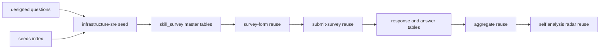

# Design Document — infrastructure-sre-survey

## Overview

**Purpose**: インフラ・SRE エンジニア向けの独立スキルアンケート（`jobType='infrastructure-sre'`）を新設し、候補者本人のインフラ／信頼性スキルバランスの理解と、採用側の一次フィルタ（領域カバレッジ判定）を可能にする。インフラと SRE を分離せず統合 1 本で提供する。

**Users**: 候補者（インフラ・SRE エンジニア）が回答し自己分析で結果を確認する。採用担当者は回答カバレッジを一次フィルタとして利用する。

**Impact**: 既存 skill-survey / self-analysis 基盤は survey 非依存に動作するため、新 survey は **seed 追加のみ**で一覧・回答・自己分析に出現する。スキーマ・`score_kind` enum・集計純関数・フォーム描画・送信・必須判定・クールダウン・履歴・可視化コンポーネントは**すべて無変更**。コード成果物は ①`infrastructure-sre.ts` seed 新規作成 ②`seeds/index.ts` への登録 ③冪等・構造を検証する統合テスト に限定される。

### Goals

- `jobType='infrastructure-sre'` の独立 survey を seed で提供し、共通インフラ層 6 + SRE・信頼性層 6 の計 12 カテゴリで両領域をカバーする（Req 1, 2）。
- 設問・選択肢を CSV なしで設計し、各カテゴリ・設問・選択肢へ安定した表示順を与える（Req 2.4）。
- ハイブリッド設問形式（multi_choice / single_choice+level / 任意 free_text）と標準習熟度ラベルを既存描画で表示する（Req 3）。
- ツール選択系 5 カテゴリへ代表習熟度ペアを付与し proficiency を供給する（Req 4）。
- 既存の回答保存・クールダウン・自己分析・版履歴・可視化を改修なしで再利用する（Req 7, 8）。
- 既存職種アンケート（backend / frontend / ai-driven-development）と既存集計結果の非回帰を担保する（Req 10）。

### Non-Goals

- インフラ職と SRE 職を別アンケートに分割すること（統合 1 本で提供）。
- 新規フォーム描画／可視化コンポーネントの実装、DB スキーマ・enum 変更。
- 既存アンケート内容の変更、面接・スカウト連携、複数 survey 横断の合成スコア。

## Boundary Commitments

### This Spec Owns

- `jobType='infrastructure-sre'` の survey マスタ定義（カテゴリ／サブカテゴリ／設問／選択肢／level／scoringKind／isRequired）と、その冪等 seed・登録。
- CSV を持たない設問・選択肢の設計内容。

### Out of Boundary

- フォーム描画（`survey-form.tsx`）、回答送信・必須検証・クールダウン（`submit-survey.ts` ほか）、自己分析の検出・集計・可視化（`aggregate()` / `coverage-bars.tsx` / `skill-balance-radar.tsx`）、版履歴 — survey 非依存のため**無変更で再利用**。
- 既存 backend / frontend / ai-driven-development アンケートの内容・必須判定・集計。
- DB スキーマ・`score_kind` enum・共有コンポーネント。

### Allowed Dependencies

- 前提依存（マージ済み）: `skill-survey` 基盤、`skill-survey-proficiency-scale`（`choice.level` / `question.scoring_kind` / `aggregate()` の proficiency 拡張 / 熟練度レーダー）。
- 既存テーブル: `skill_survey` 系 4 階層、`skill_survey_response` / `skill_survey_answer`、`self_analysis`。
- 既存設定: 再回答クールダウン（既定 30 日）。
- 依存制約: パッケージ依存方向 `apps → packages`。seed は `@bulr/db` の schema/client のみ参照。

### Revalidation Triggers

- seed 登録経路（`seeds/index.ts`）の構造変更。
- マスタ 4 階層のスキーマ・一意キー・`score_kind` enum 変更。
- 必須設問セットの変更（送信バリデーションの結果が変わる）。

## Architecture

### Existing Architecture Analysis

- マスタ 4 階層・冪等 upsert・標準習熟度ラベルは frontend-survey と同一。`runInfrastructureSreSkillSurveySeed` は `runFrontendSkillSurveySeed` と同型（survey→category→question→choice を `onConflictDoUpdate`、id 不変、件数 console 出力）。
- 保持すべき不変点: survey 非依存性、集計純関数性、後方互換、依存方向 `apps → packages`。

### Architecture Pattern & Boundary Map



**Key Decisions**: 既存 frontend seed パターンの複製。新規アーキテクチャ要素なし。本 spec は `infrastructure-sre.ts` と `index.ts` 登録行のみ所有。

### Technology Stack

| Layer | Choice / Version | Role in Feature | Notes |
| ----- | ---------------- | --------------- | ----- |
| Data / Storage | drizzle-orm（既存）/ PostgreSQL | seed の冪等 upsert | 既存 schema、マイグレーション無し |
| Tooling | tsx（既存）| `seeds/index.ts` CLI 実行 | `tsx packages/db/src/seeds/index.ts` |
| Test | vitest（既存）| 冪等・構造検証（DB ゲート）| `DATABASE_URL` 未設定時 skip、クリーン DB 推奨 |

## File Structure Plan

### Created Files

```
packages/db/src/
├── seeds/skill-surveys/
│   └── infrastructure-sre.ts        # seed データ定義 + runInfrastructureSreSkillSurveySeed（frontend.ts と同型）
└── __tests__/
    └── infrastructure-sre-survey.integration.test.ts   # 冪等性・構造検証（DB ゲート）
```

### Modified Files

- `packages/db/src/seeds/index.ts` — `runInfrastructureSreSkillSurveySeed` を re-export し、`main()` の実行列へ追加（frontend の直後）。

## 設問設計（中核）

CSV を持たないため本セクションが設問の正本。`questionType` 既定は **multi_choice**（scoringKind 無し）。各カテゴリ先頭の経験設問を `isRequired=true`。代表習熟度ペアは 5 カテゴリ（★）に付与。表示順はカテゴリ→サブカテゴリ→設問の宣言順。

### 標準習熟度ラベル（level 0–3）

L0 未経験・知識なし／L1 学習・理解はある（実務経験なし）／L2 実務で実装・運用したことがある／L3 設計・改善を主導／チームへ展開・標準化した。

### 共通インフラ層

| # | カテゴリ | サブカテゴリ：設問（型 / 必須・proficiency）|
| - | -------- | ------------------------------------------- |
| 1 | クラウド・プラットフォーム ★ | 主要クラウド：経験のあるクラウドを選択（multi, **必須**）／利用経験のあるサービス領域を選択（multi）。マルチアカウント：アカウント・組織管理で経験のあるものを選択（multi）。代表習熟度：最も得意なクラウドを1つ（single）＋習熟度（single, **proficiency**）|
| 2 | コンテナ・オーケストレーション ★ | コンテナ：コンテナ技術で経験のあるものを選択（multi, **必須**）。Kubernetes：K8s で経験のあるものを選択（multi）／K8s エコシステムツールを選択（multi）。代表習熟度：最も得意なコンテナ/オーケストレーション技術を1つ（single）＋習熟度（**proficiency**）|
| 3 | IaC・構成管理 ★ | IaC：経験のある IaC・構成管理ツールを選択（multi, **必須**）／IaC 運用実践で経験のあるものを選択（multi）。代表習熟度：最も得意な IaC ツールを1つ（single）＋習熟度（**proficiency**）|
| 4 | ネットワーク | 基礎：ネットワークで経験のあるものを選択（multi, **必須**）／Web・配信レイヤで経験のあるものを選択（multi）。トラブルシュート：切り分けで経験のあるものを選択（multi）|
| 5 | CI/CD・デリバリー ★ | CI/CD：経験のある CI/CD ツールを選択（multi, **必須**）／パイプラインで経験のあるものを選択（multi）。デプロイ戦略：経験のある戦略を選択（multi）。代表習熟度：最も得意な CI/CD ツールを1つ（single）＋習熟度（**proficiency**）|
| 6 | OS・ミドルウェア | Linux：Linux 運用で経験のあるものを選択（multi, **必須**）。ミドルウェア：運用経験のあるミドルウェアを選択（multi）／運用実践で経験のあるものを選択（multi）|

### SRE・信頼性層

| # | カテゴリ | サブカテゴリ：設問（型 / 必須・proficiency）|
| - | -------- | ------------------------------------------- |
| 7 | 可観測性 ★ | 三本柱：可観測性で経験のあるものを選択（multi, **必須**）／利用経験のあるツールを選択（multi）。アラート：アラート・通知設計で経験のあるものを選択（multi）。代表習熟度：最も得意な可観測性ツールを1つ（single）＋習熟度（**proficiency**）|
| 8 | 信頼性設計 | SLO：SLI/SLO・信頼性指標で経験のあるものを選択（multi, **必須**）／信頼性設計（冗長化・回復性）で経験のあるものを選択（multi）。キャパシティ：キャパシティ・スケーリングで経験のあるものを選択（multi）|
| 9 | インシデント対応・オンコール | インシデント：インシデント対応で経験のあるものを選択（multi, **必須**）／ポストモーテム・再発防止で経験のあるものを選択（multi）。オンコール：オンコール運用で経験のあるものを選択（multi）／重大インシデントの学び（free_text, 任意）|
| 10 | 自動化・トイル削減 | 自動化：運用自動化・トイル削減で経験のあるものを選択（multi, **必須**）／自動化に用いた言語・ツールを選択（multi）。プラットフォーム：DevEx の取り組みで経験のあるものを選択（multi）|
| 11 | セキュリティ・コンプライアンス | IAM/シークレット：インフラセキュリティで経験のあるものを選択（multi, **必須**）／脆弱性管理・サプライチェーンで経験のあるものを選択（multi）。コンプライアンス：監査対応で経験のあるものを選択（multi）|
| 12 | パフォーマンス・スケーラビリティ・コスト最適化 | パフォーマンス：パフォーマンス最適化で経験のあるものを選択（multi, **必須**）。スケーラビリティ：スケーラビリティ確保で経験のあるものを選択（multi）。コスト：コスト最適化(FinOps)で経験のあるものを選択（multi）|

合計: 約 36 設問 + 代表習熟度ペア 10（5×2）+ free_text 1 = **約 47 設問**（実装時にサブカテゴリ単位で +α 可、目標 50–70 設問）。必須 12 問、proficiency 設問 5 問。

### 主要ツール選択肢セット（seed で展開、設計時の正本）

- **クラウド**: AWS / Google Cloud / Microsoft Azure / Oracle Cloud / IBM Cloud / さくらのクラウド / オンプレ・プライベートクラウド
- **コンテナ/オーケストレーション**: Docker / Podman / containerd / Kubernetes / Amazon ECS / HashiCorp Nomad / Docker Swarm。エコシステム: Helm / Kustomize / Argo CD / Flux / Istio / Linkerd / cert-manager / External Secrets
- **IaC・構成管理**: Terraform / OpenTofu / AWS CloudFormation / AWS CDK / Pulumi / Ansible / Chef / Puppet / SaltStack
- **CI/CD**: GitHub Actions / GitLab CI / CircleCI / Jenkins / Argo CD / Spinnaker / AWS CodePipeline / Google Cloud Build
- **可観測性**: Prometheus / Grafana / Datadog / New Relic / Elastic Stack / Grafana Loki / Jaeger / Grafana Tempo / OpenTelemetry / Amazon CloudWatch / Google Cloud Monitoring

> 代表習熟度ペアの「最も得意な X を1つ」選択肢は各カテゴリの上記主要セットから構成（scoringKind 無し）。「習熟度」設問は標準習熟度ラベル（level 0–3, scoringKind=proficiency）。

## Data Models

既存スキーマを変更なしで使用。seed が書き込むレコード形状:

- `skill_survey`: `{ jobType:'infrastructure-sre', title:'インフラ・SREエンジニア スキルアンケート', isActive:true }`
- `skill_survey_category`: `{ skillSurveyId, name, subcategory, displayOrder }`（(surveyId,name,subcategory) 一意）
- `skill_survey_question`: `{ categoryId, body, questionType, scoringKind|null, isRequired, displayOrder }`（(categoryId,body) 一意）
- `skill_survey_choice`: `{ questionId, label, level|null, displayOrder }`（(questionId,label) 一意）

不変条件: proficiency 設問の各選択肢に level 0–3 を昇順付与。multi_choice / 代表習熟度の選択設問の選択肢は level 無し（null）。

## Error Handling

- seed はトランザクション内で実行し、いずれかの upsert 失敗時に全体ロールバック（frontend 同型）。
- 必須/送信バリデーション・クールダウンは既存 `submit-survey.ts` が担当（本 spec は seed の `isRequired` 付与のみ）。

## Testing Strategy

### Integration Tests（DB ゲート、`packages/db/src/__tests__/infrastructure-sre-survey.integration.test.ts`）

1. **冪等性**（Req 9.2）: `runInfrastructureSreSkillSurveySeed` を 2–3 回実行し設問・選択肢件数が増えない。
2. **survey 提供**（Req 1.1）: `jobType='infrastructure-sre'` が 1 件・`isActive=true`・期待 title。
3. **カテゴリ構成**（Req 2.1, 2.2）: トップカテゴリ distinct=12 で、共通インフラ層 6 + SRE・信頼性層 6 の期待 name 集合に一致。
4. **両層カバー**（Req 2.3）: 信頼性固有（SLI/SLO・エラーバジェット・ポストモーテム・トイル）の語が設問/選択肢に出現する。
5. **必須設問**（Req 6.1）: `isRequired=true` が各トップカテゴリに最低1件・計12件。
6. **proficiency 付与**（Req 4.3, 5.1）: `scoringKind='proficiency'` の設問の選択肢が level 0–3 を持ち、代表習熟度ペアが対象 5 カテゴリに存在。
7. **enum 健全性**（Req 5.3）: 付与 scoringKind が `proficiency` のみ（recency/frequency 未使用）。
8. **非回帰**（Req 10）: backend / frontend / ai-driven-development / infrastructure-sre の 4 seed 投入で各 jobType が衝突せず共存。

## Requirements Traceability

| Requirement | Summary | Design Element |
| ----------- | ------- | -------------- |
| 1.1–1.5 | 統合 survey 提供・独立性・非分割 | `infrastructure-sre.ts` survey 定義 / 既存一覧の survey 非依存表示 |
| 2.1–2.5 | 12カテゴリ・両層カバー・信頼性固有・順序・ボリューム | 設問設計（共通インフラ層/SRE・信頼性層の表）/ displayOrder 規約 |
| 3.1–3.5 | ハイブリッド形式・ラベル・既存描画 | 設問設計の型指定 / 標準習熟度ラベル / 既存 `questionType` 描画 |
| 4.1–4.3 | 代表習熟度ペア（5カテゴリ）| ★カテゴリの代表習熟度ペア / proficiency 付与 |
| 5.1–5.3 | proficiency 付与・経験は分類なし・enum 不変 | Data Models 不変条件 / Test 6,7 |
| 6.1–6.4 | 必須・バリデーション | 必須設問規約（各カテゴリ先頭）/ 既存 `submit-survey.ts` |
| 7.1–7.4 | 永続化・クールダウン・版 | 既存 response/answer・クールダウン・履歴（無変更）|
| 8.1–8.5 | 自己分析スナップショット・可視化・graceful | 既存 `aggregate()` / 可視化（無変更）|
| 9.1–9.4 | 冪等 seed・登録・level/分類付与 | `runInfrastructureSreSkillSurveySeed` / `index.ts` / Test 1,6 |
| 10.1–10.3 | 非回帰 | Non-Regression Test 8 / スキーマ・共有無変更 |
