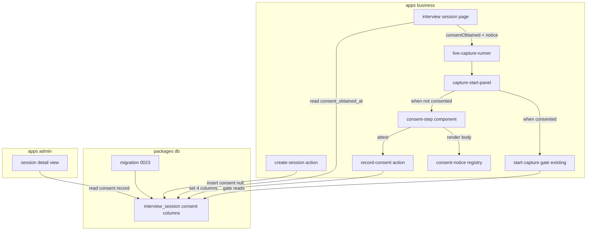
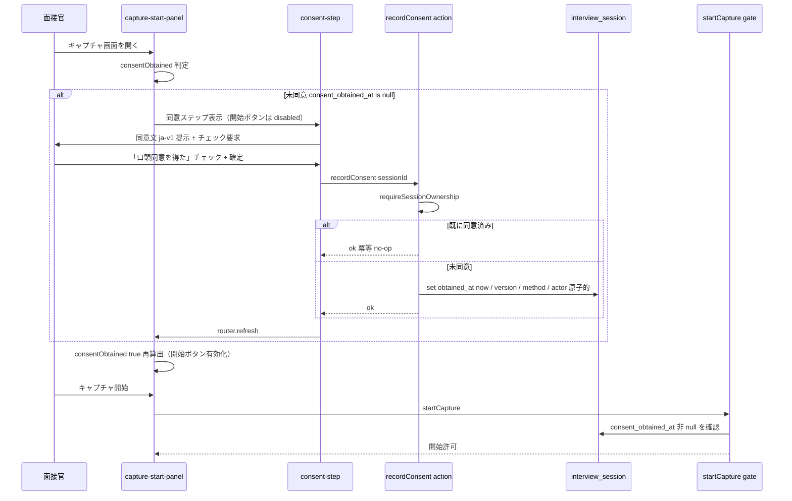
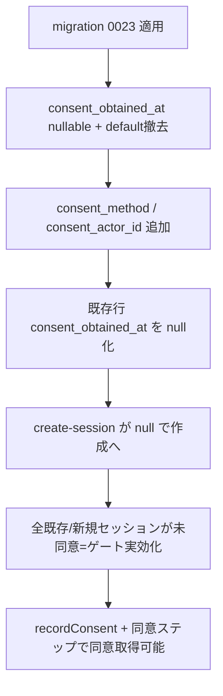

# Technical Design — interview-consent-gate

## Overview

本機能は、面接録音キャプチャの前提となる「候補者の同意」を実効化する。現状 `interview_session.consent_obtained_at` が `notNull().defaultNow()` であるため、`startCapture` の同意ゲート（`consent_obtained_at === null` 判定）が到達不能なデッドコードとなり、全セッションが作成と同時に自動的に同意済みと見なされている。本設計はスキーマを反転（nullable 化・default 撤去）してゲートを実効化し、面接官が同意文を確認して「候補者から録音同意を口頭で得た」と明示確定する**面接官アテステーション**の取得動線を追加する。

**Users**: 面接官（VPoE / EM / 採用責任者）が実面接のキャプチャ開始前に同意ステップを通過する。運営者は同意記録（日時・版・方法・アテスター）を監査目的で参照する。

**Impact**: `realtime-interview-capture` の Req 1.6 / Req 7.5 を初めて実効化する。read-path の UI 配線（`page.tsx` → `live-capture-runner` → `capture-start-panel` の `consentObtained` 伝播と開始ボタン disable）は既存を再利用し、write-path（スキーマ反転・`recordConsent` アクション・同意ステップ UI・同意文 registry）を新設する。同意モデルはハイブリッド（案C）で、今回は面接官アテステーションのみ実装し、記録スキーマは将来の候補者セルフ同意を追加可能な形にする。

### Goals

- 同意記録が無いセッションで録音キャプチャが開始されないようにする（ゲートの実効化）
- 面接官の明示操作によってのみ同意が確定し、日時・同意文版・取得方法・アテスターを一貫単位で記録する
- 版管理された同意文を提示し、記録される版が提示版と一致することを保証する
- 既存セッションと新規セッションを未同意状態に正し、遡って同意を実効化する

### Non-Goals

- 候補者セルフ同意フローの実装（スキーマは受け入れ可能にするが動線は作らない）
- 同意の撤回・取り消しフロー
- 削除請求対応（データオーナーシップ、別 spec）
- 同意文言の法務確定・レビュー（product/legal タスク、コード外）
- ja-v1 以外の多言語版同意文の起稿

## Boundary Commitments

### This Spec Owns

- `interview_session` の consent 系カラムの権威定義（`consent_obtained_at` の nullable 化、`consent_method` / `consent_actor_id` の追加）と migration 0023
- 同意取得アクション `recordConsent`（面接官アテステーションによる同意記録の唯一の書き込み経路）
- 同意ステップ UI（同意文提示＋明示チェック＋確定）
- 版管理された同意文の実体と registry（app ローカル）
- セッション作成時に consent 列を未同意（null）で開始させること

### Out of Boundary

- `startCapture` の同意ゲート判定ロジック（既存のまま無改修で有効化する。ゲート本体は `realtime-interview-capture` が所有）
- キャプチャ状態機械・ボット・文字起こし・評価パイプライン（`realtime-interview-capture` 所有）
- admin の同意記録の閲覧ロジック（`admin-operations` / `admin-review-panel` 所有。本 spec は null 安全表示の整合のみ要求）
- 候補者アプリ・模擬面接

### Allowed Dependencies

- `@bulr/db`: 既存スキーマ＋本 spec が追加する consent 列
- `@bulr/auth/server`: `authedAction` / `requireSessionOwnership`（呼び出しのみ）
- `apps/business` 内: 既存 `_components/live/*`、`lib/actions/*` パターン
- 制約: apps → packages の単方向依存。同意文（ブランド/文面）は package でなく `apps/business` ローカルに置く

### Revalidation Triggers

- `interview_session` の consent 列形状変更 → `apps/admin`（詳細画面 / json-export）の再検証
- `consent_obtained_at` を null 許容に変更 → `realtime-interview-capture` の Req 1.6 ゲートが実効化される（意図的）／`create-session.ts` の自動同意停止（旧 rtic Req 3.8/3.9 を supersede）
- `recordConsent` の入出力契約変更 → 同意ステップ UI の再検証
- 同意文版キー（`consent_version`）の意味変更 → admin 表示と監査手順の再検証

## Architecture

### Existing Architecture Analysis

- **read-path は完成済み**: `interviews/[sessionId]/page.tsx:73` が `consentObtained = consent_obtained_at !== null` を算出し、`live-capture-runner` 経由で `capture-start-panel` に伝播。パネルは `!consentObtained` で開始系ボタンを全 disable（`capture-start-panel.tsx:201/210/239/266/287`）し、`!consentObtained` ブロック（178）で `CONSENT_ERROR` alert を表示している。
- **vacuous の発生源**: `create-session.ts:86-87` がセッションを `status:'in_progress'` で作成し、consent 列に触れず `defaultNow()` に委ねて自動同意している。
- **ゲート本体**: `start-capture.ts:113` の `consent_obtained_at === null` 分岐は現状到達不能。スキーマ nullable 化で無改修のまま到達可能になる。
- **保持すべき統合点**: `authedAction` の二重ラップ契約（`result.ok`=認証/入力、`result.data.ok`=業務）、`requireSessionOwnership`、drizzle `pgEnum` パターン、音声30日削除 cron。

### Architecture Pattern & Boundary Map



**Architecture Integration**:
- Selected pattern: 既存 Server Action ＋ Server Component read-path への **薄い write-path 追加**（Option A: 既存パネル拡張）。
- Domain boundaries: 同意の**記録**（本 spec）と同意の**ゲート判定**（rtic 所有・無改修）を分離。ゲートは記録の副作用として実効化される。
- Existing patterns preserved: `authedAction` 二重ラップ、`requireSessionOwnership`、`pgEnum`、app ローカル文面。
- New components rationale: `recordConsent`（唯一の同意書き込み経路）、`consent-step`（取得 UI の単一責務）、`consent-notice`（版管理された文面の単一情報源）。
- Steering compliance: apps→packages 単方向、文面は app ローカル、drizzle migration 連番。

### Technology Stack

| Layer | Choice / Version | Role in Feature | Notes |
| --- | --- | --- | --- |
| Frontend | Next.js 16 App Router / React（既存） | 同意ステップ UI・`router.refresh()` で consent 状態再取得 | 新規 client component 1 本 |
| Backend | Server Actions（`authedAction`） | `recordConsent` 同意記録 | 既存パターン踏襲 |
| Data | Postgres + drizzle-orm（既存） | consent 列の nullable 化＋2 列追加＋既存行 null 化 | migration 0023 |

## File Structure Plan

### Created Files

```
apps/business/
├── lib/consent/
│   └── consent-notice.ts              # 同意文 registry: CURRENT_CONSENT_VERSION + getCurrentConsentNotice()
├── app/(interviewer)/interviews/
│   ├── [sessionId]/_actions/
│   │   └── record-consent.ts          # recordConsent Server Action（唯一の同意書き込み経路）
│   └── _components/live/
│       └── consent-step.tsx           # 同意ステップ UI（文面＋チェック＋確定→recordConsent→router.refresh）
packages/db/drizzle/
└── 0023_*.sql                         # consent_obtained_at nullable/default撤去 + 2列追加 + 既存行null化
```

対応するテスト（`consent-notice.test.ts` / `record-consent.test.ts` / `consent-step.test.tsx`）を各同階層に配置する。

### Modified Files

- `packages/db/src/schema/interview-session.ts` — `consent_obtained_at` を nullable・default 撤去。`consentMethod` pgEnum（`['interviewer_attestation']`）と `consent_method` / `consent_actor_id` 列を追加。`consent_version` は `notNull().default('ja-v1')` を維持。
- `apps/business/lib/actions/create-session.ts` — consent 列を明示的に書かず null で作成（自動同意の停止）。旧コメント「Requirement 3.8/3.9」を本 spec による supersede に更新。
- `apps/business/app/(interviewer)/interviews/_components/live/capture-start-panel.tsx` — `!consentObtained` ブロックの `CONSENT_ERROR` alert を `<ConsentStep>` に差し替え。`sessionId` と `notice` を props で受ける。
- `apps/business/app/(interviewer)/interviews/_components/live/live-capture-runner.tsx` — `sessionId` / `notice` をパネルへ伝播（`consentObtained` は既存伝播を利用）。
- `apps/business/app/(interviewer)/interviews/[sessionId]/page.tsx` — `getCurrentConsentNotice()` の結果と `sessionId` をランナーへ渡す（`consentObtained` 算出は既存）。
- `apps/admin/app/sessions/[id]/page.tsx` — `consent_obtained_at` の null 安全表示を確認（`consent_version` は notNull 維持のため不変）。

## System Flows

### 同意取得 → ゲート通過（面接官アテステーション）



ゲート（`startCapture`）は無改修。`consent_obtained_at` が null の間は `CONSENT_REQUIRED` を返し、`recordConsent` 成功後の `router.refresh()` で Server Component が再評価され開始が解禁される。

## Requirements Traceability

| Requirement | Summary | Components | Interfaces | Flows |
| --- | --- | --- | --- | --- |
| 1.1, 1.3 | 未同意なら開始不可・同意ありで許可 | startCapture（既存・無改修） | 既存 gate | 同意取得→ゲート通過 |
| 1.2 | 未同意での開始試行を拒否・必要表示 | startCapture / capture-start-panel | `CONSENT_REQUIRED` | 同上 |
| 1.4 | 両キャプチャ経路に同一ゲート | startCapture（recall/mic 共通前段） | 既存 gate | — |
| 2.1, 2.2 | 同意ステップ前置・未確定は開始無効化 | capture-start-panel / consent-step | ConsentStepProps | 同意取得 |
| 2.3, 2.4 | 明示確定でのみ記録・自動設定禁止 | recordConsent / create-session | recordConsent | 同意取得 |
| 3.1–3.4 | 日時・版・方法・アテスターを記録 | recordConsent / schema | recordConsent / consent columns | 同意取得 |
| 4.1–4.4 | 版管理された同意文の提示・整合 | consent-notice / consent-step | ConsentNotice | 同意取得 |
| 5.1, 5.2 | 既存行 null 化・新規は未同意 | migration 0023 / create-session | consent columns | — |
| 6.1–6.3 | 権限・冪等・一貫単位記録 | recordConsent | recordConsent | 同意取得 |

## Components and Interfaces

| Component | Domain/Layer | Intent | Req Coverage | Key Dependencies | Contracts |
| --- | --- | --- | --- | --- | --- |
| recordConsent | Server Action | 面接官アテステーションで同意を原子的・冪等に記録 | 2.3, 2.4, 3.1–3.4, 6.1–6.3 | authedAction (P0), db (P0) | Service |
| consent-notice | lib | 版管理された同意文の単一情報源 | 4.1–4.4 | — | State |
| consent-step | UI | 文面提示＋明示チェック＋確定→記録 | 2.1, 2.2 | recordConsent (P0), router (P1) | State |
| interview_session consent columns | Data | consent 記録の権威スキーマ | 3.1–3.4, 5.1, 5.2 | drizzle (P0) | State |
| capture-start-panel | UI | 未同意時に同意ステップを出し開始を gate | 1.2, 2.1, 2.2 | consent-step (P0) | State |

### Server Action

#### recordConsent

| Field | Detail |
| --- | --- |
| Intent | 面接官アテステーションによる同意を原子的・冪等に記録する唯一の経路 |
| Requirements | 2.3, 2.4, 3.1, 3.2, 3.3, 3.4, 6.1, 6.2, 6.3 |

**Responsibilities & Constraints**
- `requireSessionOwnership` で非担当者を拒否（6.1）。
- 同意 4 項目（`consent_obtained_at` / `consent_version` / `consent_method` / `consent_actor_id`）を**単一 UPDATE で一括 set**（6.3：部分欠損を残さない）。
- 冪等（6.2）：`consent_obtained_at` が既に非 null なら書き込まず ok を返す。
- 版は**サーバー側の `CURRENT_CONSENT_VERSION` を stamp**（4.3：記録版＝提示版を保証。client 送信版に依存しない）。
- `consent_method` は `'interviewer_attestation'` 固定、`consent_actor_id` は `userId`（3.3, 3.4）。

**Dependencies**
- Inbound: consent-step — 同意確定操作（P0）
- Outbound: `@bulr/db` interview_session — consent 列更新（P0）
- External: `@bulr/auth/server` authedAction / requireSessionOwnership（P0）

**Contracts**: Service [x]

##### Service Interface

```typescript
interface RecordConsentInput {
  sessionId: string;
}

interface RecordConsentData {
  consentObtainedAt: string; // ISO8601
  consentVersion: string;    // CURRENT_CONSENT_VERSION
  alreadyConsented: boolean; // 冪等 no-op だった場合 true
}

// handler は RecordConsentData を「直接」返す（二重ラップを避ける単段契約）。
// recordConsent には業務失敗パスが無い（所有権は requireSessionOwnership が throw、
// 冪等再実行は no-op で成功扱い）ため、startCapture のような { ok, error } 内包は不要。
// safe-action.ts が非推奨とする二重ラップ（result.data.ok の 2 段階読み）を回避する。
//
// authedAction ラップ後の呼び出し側契約（単段読み）:
//   result.ok    — 認証/所有権/入力の成否（false: FORBIDDEN | NOT_FOUND | 入力エラー）
//   result.data  — RecordConsentData（result.ok === true のとき）
//
// 型: ActionResult<RecordConsentData>（= { ok:true; data:RecordConsentData } | { ok:false; error }）
type RecordConsentResult =
  | { ok: true; data: RecordConsentData }
  | { ok: false; error: { code: string; message: string } };
```

- Preconditions: セッションが存在し `userId === interviewer_id`。
- Postconditions: `consent_obtained_at` 非 null かつ 4 列が整合。再呼び出しでも記録不変。
- Invariants: `consent_method != null ⟺ consent_obtained_at != null`（同時 set のため常に成立）。

### lib

#### consent-notice

| Field | Detail |
| --- | --- |
| Intent | 版管理された同意文の単一情報源（app ローカル） |
| Requirements | 4.1, 4.2, 4.3, 4.4 |

**Contracts**: State [x]

```typescript
interface ConsentNoticeSection {
  heading: string;
  body: string;
}

interface ConsentNotice {
  version: string;              // 例 'ja-v1'
  title: string;
  recordingTarget: string;      // 録音対象（4.2）
  purpose: string;              // 利用目的（4.2）
  retention: string;            // 保持期間: 音声30日自動削除と整合（4.2, 4.4）
  dataHandling: string;         // データの取り扱い（4.2）
  sections?: ConsentNoticeSection[];
}

export const CURRENT_CONSENT_VERSION = 'ja-v1';
export function getCurrentConsentNotice(): ConsentNotice; // CURRENT_CONSENT_VERSION の内容を返す
export function getConsentNotice(version: string): ConsentNotice | undefined;
```

**Implementation Notes**
- Integration: `page.tsx` が `getCurrentConsentNotice()` を渡し、`consent-step` が本文を描画。`recordConsent` は `CURRENT_CONSENT_VERSION` を stamp。
- Validation: `getCurrentConsentNotice().version === CURRENT_CONSENT_VERSION`（4.3 の起点）。
- Risks: 文言は**プレースホルダ**で実装し、法務確定後に本文のみ差し替え可能（版キー不変）。

### UI

#### consent-step

Summary-only（新規プレゼンテーション＋確定ハンドラ）。`ConsentNotice` を描画し、チェックボックス「候補者から録音同意を口頭で得た」と確定ボタンを提供。確定時に `recordConsent({ sessionId })` を呼び、`result.ok`（単段）で `router.refresh()`。チェック未了は確定ボタンを disabled（2.2 のクライアント側補強）。

```typescript
interface ConsentStepProps {
  sessionId: string;
  notice: ConsentNotice;
}
```

**Implementation Note**: `capture-start-panel` の既存 `!consentObtained` ブロックに描画。開始系ボタンの disable（`!consentObtained`）は既存ロジックを維持し、二重ガードとする。

#### capture-start-panel（変更）

Summary-only。`!consentObtained` 分岐の `CONSENT_ERROR` alert を `<ConsentStep sessionId notice />` に差し替え。props に `sessionId` / `notice` を追加。開始系 button の `disabled={!consentObtained}` は不変。

## Data Models

### Physical Data Model（interview_session consent 列）

| 列 | 変更 | 型 / 制約 | 要件 |
| --- | --- | --- | --- |
| `consent_obtained_at` | 変更 | `timestamptz` **NULL 許容 / default 撤去** | 3.1, 1.x, 5.x |
| `consent_version` | 維持 | `text NOT NULL DEFAULT 'ja-v1'` | 3.2, 4.3 |
| `consent_method` | 追加 | `consent_method`（pgEnum `['interviewer_attestation']`）NULL 許容 | 3.3 |
| `consent_actor_id` | 追加 | `text` NULL 許容（FK なし：将来 candidate 主体も許容するため） | 3.4 |

- **Consistency**: `recordConsent` の単一 UPDATE で `consent_obtained_at` / `consent_version` / `consent_method` / `consent_actor_id` を同時 set（6.3）。
- **拡張性（ハイブリッド）**: `consent_method` enum に将来 `'candidate_self_service'` を追加し、`consent_actor_id` に候補者 ID を格納することで案B を enum＋動線追加のみで載せられる。`consent_actor_id` に FK を張らないのはこの主体多型のため。

### Migration 0023

1. `ALTER COLUMN consent_obtained_at DROP DEFAULT, DROP NOT NULL`
2. `CREATE TYPE consent_method AS ENUM ('interviewer_attestation')`／列追加（NULL 許容）
3. `ADD COLUMN consent_actor_id text`（NULL 許容）
4. `UPDATE interview_session SET consent_obtained_at = NULL`（既存行の自動同意を無効化：実同意は存在しないため）

> drizzle-kit 実行時はメモリ [drizzle-kit env resolution gotcha] に従い DIRECT_URL/DATABASE_URL を inline 上書き。連番は 0022 の次＝0023。

## Error Handling

### Error Strategy

- **認証/所有権**（6.1）: `requireSessionOwnership` が `AuthError('FORBIDDEN'|'NOT_FOUND')` を throw → `authedAction` 外層が `{ ok:false, error }`。UI は権限エラーを表示し確定不可。
- **未同意でのキャプチャ開始**（1.2）: 既存 `startCapture` が `CONSENT_REQUIRED` を返す。UI は同意ステップへ誘導（既存 `!consentObtained` 分岐が担保）。
- **冪等再実行**（6.2）: `consent_obtained_at` 非 null なら no-op ok（`alreadyConsented:true`）。

### Error Categories and Responses

- User Errors: チェック未了→確定ボタン disabled（クライアント）。非担当者→FORBIDDEN。
- Business Logic: 未同意でのキャプチャ開始→`CONSENT_REQUIRED`（422 相当・業務エラー）。

### Monitoring

- `recordConsent` の成功/no-op/FORBIDDEN を既存ロガーで記録（同意日時・版・sessionId、**アテスターの個人情報は最小限**）。

## Testing Strategy

### Unit Tests
- `recordConsent`: 未同意→4 列を原子 set（3.1–3.4）／既存同意→no-op ok 冪等（6.2）／非担当者→FORBIDDEN（6.1）／版はサーバー stamp（4.3）。
- `consent-notice`: `getCurrentConsentNotice()` が録音対象・利用目的・保持期間・データ扱いを含む ja-v1 を返し、`version===CURRENT_CONSENT_VERSION`（4.1, 4.2, 4.4）。

### Integration Tests
- `startCapture` ゲート実効化: `consent_obtained_at=null`→`CONSENT_REQUIRED`／set 後→開始許可（1.1, 1.2, 1.3）。recall/mic 両経路で同一挙動（1.4）。
- `create-session`: 新規セッションが `consent_obtained_at=null` で作成される（2.4, 5.2）。
- migration 0023: 既存行の `consent_obtained_at` が null 化（5.1）。

### E2E/UI Tests
- 面接官フロー（critical path）: セッション作成→キャプチャ画面で開始 disabled＋同意ステップ表示→チェック＋確定→`router.refresh` 後に開始解禁（2.1, 2.2 + 1.x）。
- `capture-start-panel`: `!consentObtained` で `<ConsentStep>` を描画し開始系ボタンが disabled であること。

## Security Considerations

- **プライバシー**: 同意記録は候補者録画の適法性の根拠。同意文の保持期間記述は音声30日自動削除 cron と整合させる（4.4）。ログにはアテスターの識別を最小限に留める。
- **認可**: 同意記録はセッション担当面接官のみ（`requireSessionOwnership`）。
- **改ざん耐性**: 同意はサーバー側 stamp（日時・版）で、client 入力に版を委ねない（4.3）。

## Migration Strategy



- Rollback: 0023 を戻すと自動同意に復帰（vacuous 状態）。実データが無いため前方移行のみを想定。
- Validation checkpoint: 適用後、任意セッションでキャプチャ開始が `CONSENT_REQUIRED` になること、同意後に解禁されることを確認。
