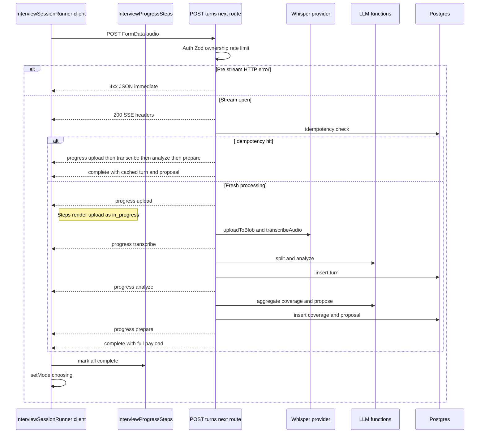

# Design Document

## Overview

**Purpose**: 面接官が「次の質問へ」ボタンを押下した後の待機画面で、サーバー側の各処理ステップ（音声アップロード、文字起こし、回答分析、次質問準備）の完了状況をリアルタイムに表示する。現状の単純なスピナーから、ステップリスト形式の進捗表示に置き換える。

**Users**: 面接官（`interviewer_id` を保持する Better Auth 認証済みユーザー）。録音モード → 待機画面 → 候補選択画面の 3 画面遷移のうち、待機画面における体験を改善する。

**Impact**: `POST /api/interview/turns/next` のレスポンス形式を従来の同期 JSON 返却から SSE（`text/event-stream`）ストリーミングに変更する。クライアント側の fetch 結果ハンドラーをストリームリーダーに置き換え、新規進捗 UI コンポーネントを `loading` モード時に描画する。既存の冪等性チェック・録音状態復帰・候補選択画面のデータ表示は完全に維持される。

### Goals

- 面接官が待機画面で「処理が止まっていない」「あと何が残っているか」を視覚的に把握できる
- 既存ルートの API パスを変更せず、呼び出し元（`interview-session-runner.tsx`）の置き換えのみで完結する
- 失敗・接続断・冪等性ヒットの 3 ケースで一貫した UI 挙動を提供する

### Non-Goals

- 処理中のキャンセル機能（要件で Out of scope 指定）
- 経過秒数表示・サブプログレスバー（要件で Out of scope）
- ジョブ ID 再開パターン（MVP では不要）
- Prepare フェーズのクリティカルパス外し（パフォーマンス調査の施策 #2、本設計では採用せず将来反復で再評価）
- 他 API エンドポイント（`finalize`、`proposal/regenerate`）への進捗表示展開
- 録音中のリアルタイム文字起こし表示

## Boundary Commitments

### This Spec Owns

- `POST /api/interview/turns/next` のレスポンスのワイヤーフォーマット（SSE 形式）
- ストリームに送出されるイベントの型・スキーマ（`progress` / `complete` / `error`）
- サーバー側内部処理（7 チェックポイント）からユーザー向け 4 ステップへのマッピング規則
- 待機画面の進捗 UI コンポーネント（`InterviewProgressSteps`）
- クライアント側のストリーム読み取りロジックと、ストリーム途絶（terminal イベント未受信）の検知判定

### Out of Boundary

- 内部処理ロジック自体（uploadToBlob / transcribeAudio / LLM 関数群 / DB transaction）— 既存実装の再利用のみ
- サーバー側の冪等性チェック・レート制限・認証 — 既存実装を移動せず流用
- 録音 UI（`recording-state.tsx`）と候補選択 UI（`proposal-choice-state.tsx`）— 変更対象外
- パフォーマンス最適化（Whisper プロバイダ切替・Quick Wins 等）— 別途実装済み、本設計の前提
- 他のストリーミング基盤（finalize 等）への展開 — 将来作業

### Allowed Dependencies

- Web Streams API（`ReadableStream`、`TextEncoder`、`TextDecoder`） — Web 標準
- Zod（`@bulr/types` で利用中の既存依存） — イベントスキーマ検証
- 既存の `withRetry` ヘルパー（upload / transcribe のみ、AI SDK 呼び出しは内部リトライ済み）
- 既存の `uploadToBlob` / `transcribeAudio` / `createLlmContext` / DB クエリ群
- 既存の Toast 通知・録音モード復帰ロジック

### Revalidation Triggers

以下の変更が発生した場合、本仕様を実装するルート・コンポーネントは再検証が必要：

- イベントスキーマの追加・削除・型変更（`progress` / `complete` / `error` 以外の追加、`step` 列挙の変更）
- ユーザー向け 4 ステップ表記の変更（要件 R1.1 と連動）
- 既存ルートが返す `turn` / `proposal` / `coverage` データの構造変更
- パフォーマンス施策 #2（Prepare クリティカルパス外）の採用（新イベント型 `core_ready` 追加が必要）
- Vercel 関数ランタイムの変更（`runtime` 設定や Fluid Compute 仕様変更）

## Architecture

### Existing Architecture Analysis

- 既存ルート `apps/web/app/api/interview/turns/next/route.ts` は同期 JSON 返却型。Auth → Validation → 冪等性 → Rate Limit → Core（4 工程の順次処理）→ Prepare（3 工程の独立処理）→ JSON 応答 の構造
- 既存クライアント `interview-session-runner.tsx` は単一の `fetch().json()` で結果を待ち、mode を `loading` → `choosing` に遷移
- ストリーミング応答は本プロジェクトで初導入。AI SDK は別用途（`generateObject`）でのみ使用、ストリーミング系 API（`streamText` 等）は未使用
- Vercel Hobby/Pro の関数タイムアウトは現行 300 秒（2026-02 時点）であり、ストリーミング維持に十分な余裕あり

### Architecture Pattern & Boundary Map



**Architecture Integration**:

- **Selected pattern**: Server Sent Events over POST（fetch + ReadableStream consumption）
- **Domain boundaries**: ワイヤーフォーマット定義は `lib/interview/turns-next-events.ts` に集約。サーバー側送出ロジックは `route.ts` に内包、クライアント側受信ロジックは `interview-session-runner.tsx` に内包。汎用 SSE フレームパーサのみ独立ユーティリティ化（`lib/interview/parse-sse-stream.ts`）
- **Existing patterns preserved**: Auth/Validation/Rate Limit の HTTP ステータスコード返却（401/403/429）はストリーム開始前で完結。冪等性ロジックは DB スキーマ・既存クエリそのまま流用
- **New components rationale**: `InterviewProgressSteps` は責務が明確（4 ステップの状態表示）かつ将来的な再利用余地があるため独立コンポーネント化。`turns-next-events.ts` はサーバー・クライアント間で共有する型定義
- **Steering compliance**: TypeScript strict mode、no `any`、Zod による境界検証、Tailwind CSS 4 スタイル（既存 `RecordingState` パターンに整合）

### Technology Stack

| Layer                | Choice / Version                | Role in Feature                                   | Notes                                                |
| -------------------- | ------------------------------- | ------------------------------------------------- | ---------------------------------------------------- |
| Frontend             | React 19 + Tailwind CSS 4       | `InterviewProgressSteps` コンポーネント描画       | 既存スタイルパターンに整合、新規依存なし             |
| Frontend             | Web Streams API + TextDecoder   | クライアント側 SSE フレームパース                 | Web 標準、Safari 18+ 含む全モダンブラウザ対応        |
| Backend              | Next.js 16 Route Handler        | `ReadableStream` 返却                             | `runtime: 'nodejs'`、`dynamic: 'force-dynamic'` 必須 |
| Backend              | Web Streams API + TextEncoder   | サーバー側 SSE フレーム送出                       | Node.js 20+ 標準対応                                 |
| Validation           | Zod 4 (既存依存)                | イベントスキーマの構造検証                        | クライアント受信時にも適用、型安全保証               |
| Infrastructure       | Vercel Functions (Fluid Compute) | ストリーミングレスポンスの長時間維持             | デフォルト 300 秒、本機能の所要時間 12-40 秒に十分   |

新規ライブラリ依存はゼロ。

## File Structure Plan

### Directory Structure

```
apps/web/
├── app/api/interview/turns/next/
│   └── route.ts                          # MODIFIED: 同期 JSON 返却 → ReadableStream + SSE 送出
├── app/(interviewer)/interviews/_components/
│   ├── interview-session-runner.tsx      # MODIFIED: fetch().json() → fetch + stream reader
│   └── interview-progress-steps.tsx      # NEW: 4 ステップ進捗 UI コンポーネント
└── lib/interview/
    ├── turns-next-events.ts              # NEW: SSE イベント Zod スキーマ + TypeScript 型 (shared)
    └── parse-sse-stream.ts               # NEW: 汎用 SSE フレームパーサ (client only)
```

### Modified Files

- `apps/web/app/api/interview/turns/next/route.ts` — レスポンス形式を `NextResponse.json` から `new Response(ReadableStream, { headers: SSE })` に変更。Auth/Validation/Rate Limit の早期 4xx 返却は維持。Core/Prepare 各フェーズ完了後に `progress` イベントを controller に enqueue。最終的に `complete` または `error` イベントを送出して controller を close
- `apps/web/app/(interviewer)/interviews/_components/interview-session-runner.tsx` — L184 周辺の fetch ハンドラーを書き換え。`response.body.getReader()` で逐次読み取り、`parseSseStream` で各イベントを取得、`progress` で `progressStep` state を更新、`complete` で既存の state 更新ロジック（`setLastInsertedTurnId` 等）を実行、`error` で既存の Toast + setMode('recording') ロジックを実行。`mode === 'loading'` 時のレンダーを既存スピナーから `<InterviewProgressSteps step={progressStep} />` に置き換え
- `apps/web/app/(interviewer)/interviews/_components/recording-state.tsx` — 変更なし

### Dependency Direction

```
turns-next-events.ts (types)
        ↑
        ├── route.ts (server)
        ├── parse-sse-stream.ts (client utility)
        ├── interview-progress-steps.tsx (UI)
        └── interview-session-runner.tsx (orchestrator)

parse-sse-stream.ts ← interview-session-runner.tsx
interview-progress-steps.tsx ← interview-session-runner.tsx
```

types → utility/UI/route → orchestrator の単方向。サーバー側ファイルとクライアント側ファイルの間にコード共有はスキーマファイル（`turns-next-events.ts`）のみ。

## Requirements Traceability

| Requirement | Summary                                              | Components                                                                | Interfaces                                | Flows                              |
| ----------- | ---------------------------------------------------- | ------------------------------------------------------------------------- | ----------------------------------------- | ---------------------------------- |
| 1.1         | 4 ステップをリスト表示                               | InterviewProgressSteps                                                    | `InterviewProgressStepsProps`             | 待機画面初期描画                   |
| 1.2         | ステップ完了で「完了」状態に更新                     | InterviewSessionRunner + InterviewProgressSteps                           | `progress` イベント受信 → state 更新     | SSE event handler                  |
| 1.3         | 処理中ステップを視覚的に強調                         | InterviewProgressSteps                                                    | `currentStep` prop                        | UI rendering                       |
| 1.4         | 全完了で候補選択画面に遷移                           | InterviewSessionRunner                                                    | `complete` イベント受信 → setMode        | SSE event handler                  |
| 1.5         | 冪等性ヒット時は 4 完了表示後に遷移                  | TurnsNextRoute                                                            | 4 progress + complete を即時連射          | サーバー idempotency hit 分岐      |
| 2.1         | 失敗通知                                             | InterviewSessionRunner                                                    | `error` イベント受信 → Toast              | SSE error event                    |
| 2.2         | 接続断検知                                           | InterviewSessionRunner + parseSseStream                                   | terminal event 未受信を検知               | Stream 途絶判定                    |
| 2.3         | 録音画面復帰                                         | InterviewSessionRunner                                                    | 既存 setMode('recording')                 | エラー時遷移                       |
| 2.4         | 再試行で冪等処理                                     | TurnsNextRoute（既存）                                                    | DB 既存 turn 検出                         | 既存ロジック                       |
| 3.1         | 候補選択画面のデータ同一                             | TurnsNextEventSchemas                                                     | `complete` event payload                  | `complete` ペイロード設計          |
| 3.2         | 「次の質問の準備」部分失敗を許容                     | TurnsNextRoute                                                            | Prepare 失敗時も `complete` 送出           | サーバー Prepare 内 try/catch 維持 |

## Components and Interfaces

| Component                  | Domain/Layer                | Intent                                                          | Req Coverage          | Key Dependencies (P0/P1)                                            | Contracts        |
| -------------------------- | --------------------------- | --------------------------------------------------------------- | --------------------- | ------------------------------------------------------------------- | ---------------- |
| TurnsNextRoute             | Backend / API               | SSE 形式で進捗・完了・エラーイベントを送出                      | 1.1-1.5, 2.1, 3.1-3.2 | TurnsNextEventSchemas (P0)、既存処理関数群 (P0)                     | API + Event      |
| TurnsNextEventSchemas      | Shared / Types              | Zod による SSE イベントの型・検証スキーマ提供                   | 1.5, 2.1, 3.1-3.2     | Zod (P0)                                                            | State (型契約)   |
| ParseSseStream             | Frontend / Utility          | `ReadableStream` から SSE フレームを Zod 検証付きで逐次取得     | 1.2, 2.2              | TurnsNextEventSchemas (P0)                                          | Service          |
| InterviewProgressSteps     | Frontend / UI               | 4 ステップのリスト + 各ステップの状態（待機/処理中/完了）描画   | 1.1, 1.3              | TurnsNextEventSchemas (P1: step 型のみ)                             | State            |
| InterviewSessionRunner     | Frontend / Orchestrator     | ストリーム読み取り → state 更新 → mode 遷移 / エラー処理        | 1.2, 1.4, 2.1, 2.3    | ParseSseStream (P0)、InterviewProgressSteps (P0)、既存 Toast (P1)   | State            |

### Backend / API

#### TurnsNextRoute

| Field        | Detail                                                         |
| ------------ | -------------------------------------------------------------- |
| Intent       | 既存の同期 JSON 返却を SSE ストリーミングに置き換える          |
| Requirements | 1.1, 1.2, 1.4, 1.5, 2.1, 3.1, 3.2                              |

**Responsibilities & Constraints**

- HTTP-level エラー（401/403/429/400）はストリーム開始前に同期 JSON で返却（既存挙動を維持）
- ストリーム開始後は HTTP ステータスコードを変更不可。すべての失敗は `error` イベントとして送出
- 既存の冪等性チェック・Core/Prepare 処理ロジックは変更なし、各境界で `progress` イベントを enqueue
- ストリーム終了時には必ず `complete` または `error` を 1 つだけ送出してから controller を close（terminal event 不在を判定するクライアント側の前提）

**Dependencies**

- Inbound: `interview-session-runner.tsx` から POST FormData（外部唯一の呼び出し元、P0）
- Outbound: 既存の `uploadToBlob` / `transcribeAudio` / `createLlmContext` / DB クエリ群（P0、変更なし）
- External: `TurnsNextEventSchemas` から Zod 型をインポート（P0）

**Contracts**: API ✓ / Event ✓ / Service ✗ / Batch ✗ / State ✗

##### API Contract

| Method | Endpoint                       | Request                          | Response                                | Errors                                                |
| ------ | ------------------------------ | -------------------------------- | --------------------------------------- | ----------------------------------------------------- |
| POST   | `/api/interview/turns/next`    | `multipart/form-data`（既存）    | `text/event-stream`（200, 連続イベント） | 400 (validation) / 401 (auth) / 403 (ownership) / 429 (rate limit) ※ストリーム開始前のみ |

レスポンスヘッダ:
- `Content-Type: text/event-stream; charset=utf-8`
- `Cache-Control: no-cache, no-transform`
- `Connection: keep-alive`
- `X-Accel-Buffering: no`

##### Event Contract

送出順序（ハッピーパス）:

```
data: {"type":"progress","step":"upload"}\n\n
data: {"type":"progress","step":"transcribe"}\n\n
data: {"type":"progress","step":"analyze"}\n\n
data: {"type":"progress","step":"prepare"}\n\n
data: {"type":"complete","turn":{...},"coverage":...,"transitionCoverage":...,"proposal":...}\n\n
```

冪等性ヒット時:

```
data: {"type":"progress","step":"upload"}\n\n
   ↓ 約 100ms 待機（サーバー側で await sleep）
data: {"type":"progress","step":"transcribe"}\n\n
   ↓ 約 100ms 待機
data: {"type":"progress","step":"analyze"}\n\n
   ↓ 約 100ms 待機
data: {"type":"progress","step":"prepare"}\n\n
   ↓ 約 100ms 待機
data: {"type":"complete","turn":{既存データ},"coverage":...,"transitionCoverage":null,"proposal":既存または null}\n\n
```

冪等性ヒット時は実処理が発生しないため、4 progress イベントが同一マイクロタスク内で連続送出されると、ブラウザ受信時に同一 TCP パケット → 同一 fetch reader chunk → 同一 JavaScript task で yield → React 19 の自動バッチングにより最終状態（4 ステップ全完了）のみが render される。これは要件 R1.5 が想定する「**全ステップを「完了」として一瞬表示後** 遷移」の UX を満たさない。

これを防ぐため、冪等性ヒット時のみサーバー側で各 progress イベント送出後に約 100ms の遅延（`await new Promise(r => setTimeout(r, 100))`）を挿入する。合計で約 400ms の追加レイテンシだが、エラー復旧文脈での「あなたの前回の処理が復元された」視覚フィードバックを保証するための意図的な遅延として許容する。通常フロー（fresh processing）では各ステップ間に実際の処理時間（数秒）が挟まるため、遅延挿入は不要。

Core 失敗時:

```
data: {"type":"progress","step":"upload"}\n\n     ← 失敗するまでの進捗のみ送出
data: {"type":"error","code":"core_phase_failed","retryable":true}\n\n
```

- 配信保証: なし（ストリーム途絶時はクライアント側で terminal event 不在を検知）
- 順序保証: 同一ストリーム内では FIFO 保証
- 冪等性: ストリーム単位ではなく既存の DB レベル冪等性（同 `turnId` で turn が既に存在すればヒット扱い）

**Implementation Notes**

- Integration: 既存の `try/catch` 構造を維持し、Core 失敗時は `error` イベントを送出して controller.close。Prepare 内の各 `try/catch` は引き続き失敗を握りつぶし `complete` 送出時に `proposal=null` 等で表現
- Validation: 送出時に `TurnsNextEventSchemas.parse` で Zod 検証してから `controller.enqueue`。クライアントへの不正イベント送出を防ぐ
- Risks: `await` を `return new Response(...)` の前に置くとバッファリングされる。すべての処理を `ReadableStream.start()` 内に閉じ込める
- Idempotency hit timing: 冪等性ヒット分岐内では各 progress イベント送出後に `await new Promise(r => setTimeout(r, 100))` を挟む。これにより React 19 自動バッチングによる UI 状態スキップを防ぎ、要件 R1.5 の「一瞬表示後遷移」UX を実現する。通常の fresh processing 分岐では各ステップ間に実処理が挟まるため遅延挿入は不要

### Shared / Types

#### TurnsNextEventSchemas

| Field        | Detail                                       |
| ------------ | -------------------------------------------- |
| Intent       | サーバー・クライアント間のイベント型定義の単一情報源 |
| Requirements | 1.5, 2.1, 3.1, 3.2                           |

**Responsibilities & Constraints**

- すべてのイベント型を Zod スキーマで定義し、TypeScript 型を `z.infer` で導出
- discriminated union（`type` フィールド）で型安全な分岐を保証
- `progress` の `step` は文字列リテラル型 `'upload' | 'transcribe' | 'analyze' | 'prepare'` で固定
- `complete` の payload は既存ルートが返していた JSON ペイロードと同形（後方互換）

**Dependencies**

- External: `zod` (P0)
- Outbound: `TurnsNextRoute`、`InterviewSessionRunner`、`InterviewProgressSteps`、`ParseSseStream` から参照される

**Contracts**: State ✓（型契約）/ Service ✗ / API ✗ / Event ✗ / Batch ✗

##### State Management

```typescript
import { z } from 'zod';
import type { schema } from '@bulr/db';  // type-only import（クライアントバンドルに DB 実装は混入しない）

// Drizzle 推論型を Zod スキーマに取り込むためのエイリアス
type InterviewTurn = typeof schema.interviewTurn.$inferSelect;
type PatternCoverage = typeof schema.patternCoverage.$inferSelect;
type QuestionProposal = typeof schema.questionProposal.$inferSelect;

export const ProgressStep = z.enum(['upload', 'transcribe', 'analyze', 'prepare']);
export type ProgressStep = z.infer<typeof ProgressStep>;

export const ProgressEvent = z.object({
  type: z.literal('progress'),
  step: ProgressStep,
});

export const CompleteEvent = z.object({
  type: z.literal('complete'),
  // z.custom<T>() は TypeScript 型情報のみを Zod に取り込むためのフック。
  // ランタイム検証は省略する（DB クエリ自体が型安全であり、ペイロード内容は
  // サーバー側 Drizzle 推論で既に保証されているため二重検証は不要）。
  turn: z.custom<InterviewTurn>(),
  coverage: z.custom<PatternCoverage | null>(),
  transitionCoverage: z.custom<PatternCoverage | null>(),
  proposal: z.custom<QuestionProposal | null>(),
});

export const ErrorEvent = z.object({
  type: z.literal('error'),
  code: z.enum(['core_phase_failed', 'unknown']),
  retryable: z.boolean().default(true),
});

export const TurnsNextEvent = z.discriminatedUnion('type', [
  ProgressEvent,
  CompleteEvent,
  ErrorEvent,
]);
export type TurnsNextEvent = z.infer<typeof TurnsNextEvent>;
```

**Implementation Notes**

- Integration: サーバー側は `TurnsNextEvent.parse(event)` で送出前にイベント envelope を Zod 検証してから `controller.enqueue`。クライアント側は `TurnsNextEvent.safeParse(parsed)` で受信時に同じ検証を実施
- Type safety: `z.custom<InterviewTurn>()` 等により、`z.infer<typeof CompleteEvent>['turn']` の TypeScript 型は `InterviewTurn` として正しく推論される。consumer 側で `as InterviewTurn` の assertion は不要、`event.turn.id` 等の型安全アクセスが可能
- Validation 境界: Zod は **envelope の `type` フィールドと discriminated union による分岐** のみ実ランタイム検証する。ペイロード内容（`turn` の各カラム値等）の検証は省略するが、これは Drizzle 推論型と DB スキーマ制約により既に静的・動的の両面で担保されているため安全
- Risks: スキーマ変更（特に `CompleteEvent` のフィールド追加・削除）は revalidation trigger に該当。サーバー・クライアントの同期デプロイが必要
- `@bulr/db` インポートの注意: `import type` で型のみ取り込むため、クライアントバンドルに DB ランタイムコード（`drizzle-orm` の接続コード等）は混入しない。`tsconfig.json` の `importsNotUsedAsValues: 'error'` 設定があれば型推論で確実に値が排除される

### Frontend / Utility

#### ParseSseStream

| Field        | Detail                                                         |
| ------------ | -------------------------------------------------------------- |
| Intent       | `ReadableStream` から SSE フレームを Zod 検証付きで逐次取り出す汎用ジェネレータ |
| Requirements | 1.2, 2.2                                                       |

**Responsibilities & Constraints**

- 入力: `ReadableStreamDefaultReader<Uint8Array>` と Zod スキーマ
- 出力: `AsyncGenerator<T>` （`T` は Zod スキーマの推論型）
- SSE フレーム境界（`\n\n`）でフレームを分割し、`data: ` プレフィックスを除いて JSON parse → Zod 検証
- ストリームが `complete` または `error` イベントを送らずに終了した場合は `StreamEndedWithoutTerminalEvent` 例外をスロー
- 不正な JSON や Zod 検証失敗は警告ログを出して該当フレームをスキップ（堅牢性のため）

**Dependencies**

- External: Web Streams API、TextDecoder（標準）
- Outbound: `InterviewSessionRunner` から呼び出される

**Contracts**: Service ✓

##### Service Interface

```typescript
import type { z } from 'zod';

export class StreamEndedWithoutTerminalEvent extends Error {}

export async function* parseSseStream<T>(
  reader: ReadableStreamDefaultReader<Uint8Array>,
  schema: z.ZodType<T>,
  isTerminal: (event: T) => boolean,
): AsyncGenerator<T, void, unknown> {
  // 実装は ReadableStream + TextDecoder + バッファ管理
}
```

- Preconditions: `reader` は未消費、`schema` は discriminated union 推奨、`isTerminal` は `complete` / `error` 等のストリーム終了マーカーを返す述語
- Postconditions: terminal event を yield 済みの場合は正常終了。terminal event 未受信のまま `done: true` の場合は `StreamEndedWithoutTerminalEvent` をスロー
- Invariants: 同一フレームを複数回 yield しない、Zod 検証失敗フレームはスキップ

**Implementation Notes**

- Integration: `interview-session-runner.tsx` 内で `for await (const event of parseSseStream(reader, TurnsNextEvent, e => e.type !== 'progress'))` の形で消費
- Validation: 受信した JSON が `TurnsNextEvent.safeParse` で失敗した場合 `console.warn` ログのみ出してスキップ
- Risks: バッファ境界で SSE フレームが分断される場合の処理を必ずカバー（`buf += decoder.decode(value, { stream: true })`）

### Frontend / UI

#### InterviewProgressSteps

| Field        | Detail                                                                         |
| ------------ | ------------------------------------------------------------------------------ |
| Intent       | 4 ステップのリストと、各ステップの状態（待機 / 処理中 / 完了）を視覚的に表示   |
| Requirements | 1.1, 1.3                                                                       |

**Responsibilities & Constraints**

- ステップ順序とラベルを内部に固定保持: `[{ key: 'upload', label: '音声のアップロード' }, ...]`
- `currentStep` prop の値に応じて各ステップの状態を計算: `currentStep` 以前 = 完了、`currentStep` = 処理中、それ以降 = 待機
- 既存 Tailwind パターン（`rounded-2xl bg-white p-8 shadow-md`、チェックマーク用 inline SVG、スピナー用 `animate-spin`）を踏襲
- 純粋表示コンポーネント（state なし、副作用なし）

**Dependencies**

- Inbound: `InterviewSessionRunner` から prop 経由
- External: `TurnsNextEventSchemas` から `ProgressStep` 型のみ参照

**Contracts**: State ✓（props のみ）

##### State Management

```typescript
import type { ProgressStep } from '@/lib/interview/turns-next-events';

export interface InterviewProgressStepsProps {
  currentStep: ProgressStep;  // サーバーから最後に受信した progress.step
}

export function InterviewProgressSteps(props: InterviewProgressStepsProps): JSX.Element {
  // 4 ステップを順に並べ、各ステップの状態を currentStep との比較で計算してレンダー
}
```

**Implementation Notes**

- Integration: `mode === 'loading'` 時に既存のスピナー描画箇所を本コンポーネントに置き換え。初期 `currentStep` は `'upload'` で開始
- Validation: 不要（純粋表示）
- Risks: なし。視覚パターンは既存 `RecordingState` のスタイルパターンと整合

### Frontend / Orchestrator

#### InterviewSessionRunner（変更）

| Field        | Detail                                                                                |
| ------------ | ------------------------------------------------------------------------------------- |
| Intent       | ストリーム読み取り、state 更新、mode 遷移、エラー処理を統合                           |
| Requirements | 1.2, 1.4, 2.1, 2.2, 2.3                                                               |

**Responsibilities & Constraints**

- `mode === 'loading'` 時のみストリームを読み取り、`mode` が変わったら `AbortController.abort()` で fetch を中断（unmount 時のクリーンアップ目的のみ、サーバー側処理はキャンセルしない）
- `progress` イベント受信で `progressStep` state を更新
- `complete` イベント受信で既存の state 更新ロジック（`setLastInsertedTurnId`、`setLastTurnTranscript` 等）を実行し、`setMode('choosing')`
- `error` イベント受信、または `StreamEndedWithoutTerminalEvent` 検知時に既存の Toast 「処理に失敗しました。同じ録音で再試行できます」 + `setMode('recording')` + turnId 保持

**Dependencies**

- Inbound: 親 `InterviewSessionPage` から `session` prop
- Outbound: `ParseSseStream` (P0)、`InterviewProgressSteps` (P0)、既存 Toast notification (P1)

**Contracts**: State ✓

##### State Management

新規追加 state:
- `progressStep: ProgressStep` — 現在のサーバー側処理ステップ（初期値 `'upload'`）

新規追加副作用フロー（`handleRecordingSubmit` 内で fetch 後）:

```typescript
const res = await fetch('/api/interview/turns/next', { method: 'POST', body: formData, signal });
if (!res.ok || !res.body) {
  // pre-stream HTTP error: 既存の status 別ハンドラ（429 toast など）を維持
  return;
}
setProgressStep('upload');
const reader = res.body.getReader();
try {
  for await (const event of parseSseStream(reader, TurnsNextEvent, e => e.type !== 'progress')) {
    if (event.type === 'progress') setProgressStep(event.step);
    else if (event.type === 'complete') {
      // 既存の state 更新ロジック
      setMode('choosing');
    } else if (event.type === 'error') {
      showToast('処理に失敗しました。同じ録音で再試行できます');
      setMode('recording');
    }
  }
} catch (e) {
  if (e instanceof StreamEndedWithoutTerminalEvent) {
    showToast('処理に失敗しました。同じ録音で再試行できます');
    setMode('recording');
  }
}
```

**Implementation Notes**

- Integration: `mode === 'loading'` レンダー時に `<InterviewProgressSteps currentStep={progressStep} />` を表示
- Validation: `parseSseStream` 内で Zod 検証済みイベントを受け取るため、コンポーネント内では discriminated union の `type` ガードのみで十分
- Type safety: `TurnsNextEventSchemas` が `z.custom<InterviewTurn>()` 等で Drizzle 推論型を取り込んでいるため、`event.type === 'complete'` で narrow した時点で `event.turn` は `InterviewTurn` として型推論される。`as` assertion は不要

## Data Models

### Event Schemas

`turns-next-events.ts` で定義する 3 種類のイベントが本機能のデータコントラクト全体（[Service Interface 定義済み](#turnsnexteventschemas)）。

### Cross-Service Data Management

なし。ストリーミング応答は単一リクエスト内で完結し、外部サービスへの分散トランザクションは発生しない。既存の DB トランザクション境界（turn insert + rate-limit upsert）も変更なし。

## Error Handling

### Error Strategy

ストリーミング応答における二段構えのエラー処理：

1. **ストリーム開始前**: 従来通り HTTP ステータスコード（401/403/400/429）で返却。クライアント側は既存の status 別ハンドラを維持
2. **ストリーム開始後**: `error` イベントを 1 件送出して controller.close。HTTP ステータスは 200 のまま

クライアント側のストリーム途絶検知:
- `parseSseStream` が `done: true` を受け取ったが terminal event（`complete` または `error`）を受信していない場合 → `StreamEndedWithoutTerminalEvent` をスロー
- これを失敗ケースとして既存のエラー UX（Toast + 録音モード復帰）に流す

### Error Categories and Responses

| 分類                    | サーバー側                                       | クライアント側                                                  |
| ----------------------- | ------------------------------------------------ | --------------------------------------------------------------- |
| 認証失敗 (401)          | ストリーム開始前 JSON                            | 既存の認証エラーハンドラ                                        |
| 入力検証失敗 (400)      | ストリーム開始前 JSON                            | 既存の汎用エラー Toast                                          |
| 権限なし (403)          | ストリーム開始前 JSON                            | 既存の汎用エラー Toast                                          |
| レート制限 (429)        | ストリーム開始前 JSON                            | 既存の Toast「レート制限超過」                                  |
| Core フェーズ失敗       | `error` イベント送出後 controller.close         | Toast「処理に失敗しました。同じ録音で再試行できます」+ 録音復帰 |
| Prepare フェーズ部分失敗 | 既存の try/catch 維持、`complete` で null を含めて送出 | `proposal=null` 等を既存通り choosing 画面側で処理              |
| 接続断                  | （サーバー側はストリーム終了を検知できない）     | `StreamEndedWithoutTerminalEvent` 検知 → Core 失敗と同等の UX   |

### Monitoring

- サーバー側: 既存の `console.error('[turns/next] ...', e)` ログを維持。`error` イベント送出時にも同等のログを出力
- クライアント側: ストリーム途絶検知時に `console.warn('[turns/next] stream ended without terminal event')` を出力（PostHog/Sentry は Stage 2 以降で導入予定）

## Testing Strategy

### Unit Tests

- `TurnsNextEventSchemas`: `ProgressEvent` / `CompleteEvent` / `ErrorEvent` の Zod スキーマが正しい入力を受け入れ、不正入力（不明な `type`、欠落した `step`）を reject する
- `ParseSseStream`: 単一フレーム、複数フレーム、フレーム境界がチャンクをまたぐケース、不正 JSON のスキップ、terminal event 未受信時の例外スロー
- `InterviewProgressSteps`: `currentStep='transcribe'` 時に upload が完了状態、transcribe が処理中、analyze と prepare が待機状態でレンダーされることを React Testing Library で検証

### Integration Tests

- `POST /api/interview/turns/next` ハッピーパス: モック化した uploadToBlob/transcribeAudio/LLM 関数で `progress×4 → complete` の順序でイベントが送出される
- `POST /api/interview/turns/next` 冪等性ヒット: 既存 turn が DB にある状態で POST → `progress×4 → complete` が即時送出される
- `POST /api/interview/turns/next` Core 失敗: transcribeAudio が throw する設定で `progress(upload) → progress(transcribe) は未送出 → error` の順で送出
- `POST /api/interview/turns/next` Prepare 失敗: proposeNextQuestions が throw する設定で `progress×4 → complete with proposal=null` が送出（既存挙動維持）

### E2E/UI Tests

- 「次の質問へ」押下 → 4 ステップ UI 表示 → 各ステップが順番にチェックマーク付きに変わる → 候補選択画面に遷移
- transcribeAudio が失敗する E2E: ボタン押下 → 進捗 UI 表示 → エラー Toast 表示 → 録音画面に戻る → 同じ録音データで「次の質問へ」を再押下できる

### Performance / Load

- TTFB（Time To First Byte）: ストリーム開始から最初の `progress` イベント送出まで <500ms（Auth + Validation + Rate Limit + Idempotency Check の合計時間）
- ストリーム完了時間: Core+Prepare の合計時間と等しい（±5%、ストリーム化のオーバーヘッドが無視できる範囲）
- イベント送出粒度: 4 段階のみで送出間隔は数秒オーダー（バッファリング/並列性問題は発生しない）

## Performance & Scalability

詳細はパフォーマンス調査結果（`research.md` 第 6-10 節）を参照。本設計では以下のみ確認:

- 本機能自体の wall clock オーバーヘッドは無視可能（ストリーム送出 = ms 単位の I/O）
- 別途実装済みの Quick Wins（QW1/QW2/QW3/QW5/QW6）と Groq Whisper 切替により、本設計のリリース時には typical 8-12 秒の所要時間が見込まれる
- 施策 #2（Prepare クリティカルパス外）は本設計では非採用（R1.4 厳格遵守、将来反復で再評価）
