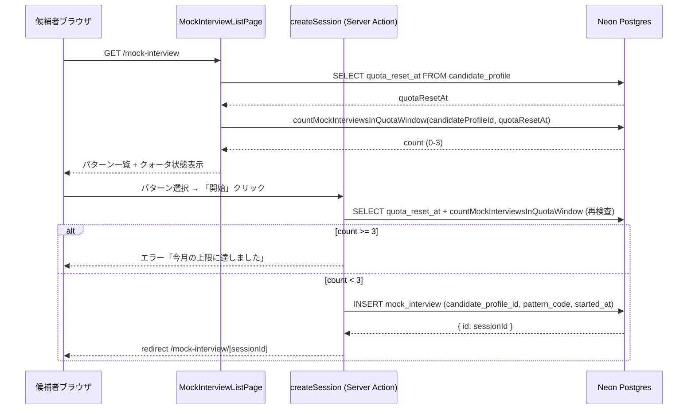
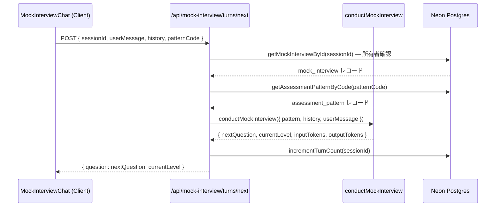
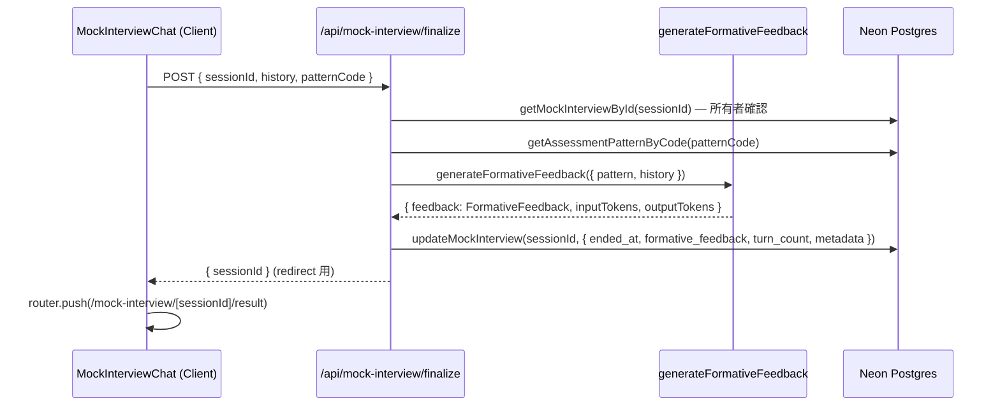

# 設計書

## 概要

本機能は `apps/candidate`（bulr.net）に AI テキスト模擬面接を追加する。候補者が bulr の 57 状況パターンから 1 つを選択し、AI が面接官役として 4 段階深掘り構造に沿った質問を行い、セッション終了時に 5 次元ルーブリックに基づく形成的フィードバック（スコアなし）を生成する。月次クォータ（3 回/候補者/月）でコスト上限を enforce する。

対象ユーザーは `apps/candidate` に Magic Link でサインイン済みの候補者。BtoB 面接エンジン（`assessment-engine`）とは完全に分離した別系統の LLM 関数（`packages/ai/mock/`）を新設する。`mock_interview` テーブルは候補者所有データとして設計し、`admin-operations` が読み取り専用で LLM コスト集計を行う共有シームとして機能する。

### ゴール

- 候補者が bulr の 57 パターンに慣れ、本番面接への準備ができる
- LLM コストの青天井防止（月次クォータ 3 回/候補者）
- `admin-operations` が LLM コストを集計できるデータフックの提供

### Non-Goals

- 音声・録音（テキスト専用 MVP）
- スコア・ランキング・ピア比較
- admin 側のクォータ管理 UI（admin-operations spec）
- `assessment-engine`（BtoB）への変更
- `assessment_pattern` マスタの編集

---

## Boundary Commitments

### This Spec Owns

- `mock_interview` テーブル（スキーマ・migration・クエリ関数）—— 候補者所有データの権威的定義
- `packages/ai/mock/` の 2 LLM 関数（`conductMockInterview` / `generateFormativeFeedback`）
- 候補者向け 3 画面 UI（`/mock-interview`・`/mock-interview/[sessionId]`・`/mock-interview/[sessionId]/result`）
- 2 API Route（`/api/mock-interview/turns/next`・`/api/mock-interview/finalize`）
- 月次クォータ検査ロジック（サーバー側: 当月 `mock_interview` 件数チェック）
- `packages/ai/mock/src/index.ts` バレル

### Out of Boundary

- `assessment-engine` 関連テーブル・LLM 関数（`interview_session`・`interview_turn`・`pattern_coverage`・`session_report`・`analyzeTurn` 等）への変更
- `assessment_pattern` テーブルの CREATE/UPDATE/DELETE（読み取り専用消費）
- admin 側のコスト監視・クォータ管理 UI（`admin-operations` spec）
- `skill_survey_response` テーブルへの書き込み（推奨パターン表示の参照のみ）
- `packages/ai/interview/` フォルダへの変更

### Allowed Dependencies

- `@bulr/auth/server` — `requireCandidate()` による認証ガード（`candidate-auth-onboarding` が定義）
- `@bulr/db` — Drizzle クライアント・`assessment_pattern`・`candidate_profile`・`skill_survey_response` クエリ
- `@bulr/ai` — `claudeSonnet46` クライアント共有（`packages/ai/client.ts`）、`validateAndFallback` ユーティリティ
- Next.js 16 App Router、React 19、Tailwind CSS 4、Zod、Vercel AI SDK 6 (`generateObject`)

### Revalidation Triggers

- `candidate_profile` スキーマの変更（特に `id` カラムの型変更）→ FK 整合性の再確認が必要
- **クロステーブル拡張**: 本 spec は `candidate_profile` テーブルに `quota_reset_at TIMESTAMPTZ NULL` カラムを追加する（`candidate-auth-onboarding` が定義するテーブルへの拡張）。`candidate-auth-onboarding` spec がこのカラムを削除・リネームした場合、クォータウィンドウ計算とクォータリセット機能が壊れる。
- `assessment_pattern` カラム名変更（`level_1_intro`〜`level_4_focus`・`ai_perspective`・`signals`）→ `conductMockInterview`・`generateFormativeFeedback` のプロンプト引数を更新
- `requireCandidate()` の返り値型変更 → 全ページ・API Route のガード実装を確認
- `mock_interview.formative_feedback` の JSONB 構造変更 → 結果表示コンポーネントの型定義を更新
- `admin-operations` が `mock_interview` テーブルおよび `candidate_profile.quota_reset_at` に依存するクエリを持つ場合、カラム変更で連携確認が必要

---

## アーキテクチャ

### アーキテクチャパターン & 境界マップ

```
候補者ブラウザ
  │ /mock-interview（パターン選択）
  │ /mock-interview/[sessionId]（チャット）
  │ /mock-interview/[sessionId]/result（結果）
  ▼
apps/candidate（Next.js 16 App Router）
  ├── Server Components
  │     ├── MockInterviewListPage        — パターン一覧取得・クォータ状態確認
  │     ├── MockInterviewChatPage        — セッション復元・初期化
  │     └── MockInterviewResultPage     — フィードバック取得・表示
  │
  ├── Client Components
  │     └── MockInterviewChat           — 会話 UI・入力制御
  │
  ├── API Routes
  │     ├── POST /api/mock-interview/turns/next   — AI 次質問生成
  │     └── POST /api/mock-interview/finalize      — セッション終了・FB生成
  │
  └── Server Actions
        └── createMockInterviewSession  — 新規セッション作成（クォータ検査込み）

packages/ai/mock/
  ├── conduct-mock-interview.ts         — conductMockInterview (generateObject)
  ├── generate-formative-feedback.ts    — generateFormativeFeedback (generateObject)
  └── index.ts

packages/db/
  └── src/schema/mock-interview.ts      — mock_interview テーブル定義（権威）

外部
  ├── Anthropic Claude Sonnet 4.6       — LLM API
  └── Neon Postgres (Drizzle ORM)       — データ永続化
```

### テクノロジースタック

| 層                 | 選択 / バージョン                             | 役割                         | 備考                            |
| ------------------ | --------------------------------------------- | ---------------------------- | ------------------------------- |
| フレームワーク     | Next.js 16 (App Router)                       | UI + API Routes              | 既存 `apps/candidate` と同一    |
| UI                 | React 19 + Tailwind CSS 4                     | チャット UI                  | shadcn/ui ベース                |
| AI 構造化出力      | Vercel AI SDK 6 (`generateObject`)            | LLM 呼び出し                 | 既存 `packages/ai` 規約に準拠   |
| LLM モデル         | Anthropic Claude Sonnet 4.6                   | 面接官役・フィードバック生成 | `packages/ai/client.ts` 共有    |
| DB / ORM           | Neon Postgres + Drizzle ORM 0.45.x            | セッション・フィードバック永続化 | `packages/db` 規約に準拠    |
| バリデーション     | Zod                                           | LLM 出力スキーマ検証         | `validateAndFallback` パターン  |
| 認証               | Better Auth（`@bulr/auth/server`）            | `requireCandidate()` ガード  | 既存規約                        |

---

## ファイル構造計画

### ディレクトリ構造

```
packages/
├── db/src/schema/
│   ├── mock-interview.ts          # NEW: mock_interview テーブル定義
│   └── index.ts                   # MODIFIED: mock-interview を re-export
├── db/src/queries/
│   ├── mock-interview.ts          # NEW: クォータカウント・セッション取得クエリ
│   └── index.ts                   # MODIFIED: クエリ re-export
├── ai/
│   └── mock/                      # NEW: packages/ai/mock サブパッケージ
│       ├── src/
│       │   ├── conduct-mock-interview.ts       # conductMockInterview 関数
│       │   ├── generate-formative-feedback.ts  # generateFormativeFeedback 関数
│       │   └── index.ts                        # バレル
│       └── package.json           # @bulr/ai-mock パッケージ定義

apps/candidate/app/
├── mock-interview/
│   ├── page.tsx                   # NEW: パターン選択画面（Server Component）
│   ├── _actions/
│   │   └── create-session.ts      # NEW: セッション作成 Server Action（クォータ検査）
│   ├── _components/
│   │   ├── PatternList.tsx        # NEW: 57 パターン一覧 + 推奨セクション
│   │   └── QuotaStatus.tsx        # NEW: クォータ状態表示
│   ├── [sessionId]/
│   │   ├── page.tsx               # NEW: チャット画面（Server Component、初期化）
│   │   └── _components/
│   │       └── MockInterviewChat.tsx  # NEW: チャット UI (Client Component)
│   └── [sessionId]/result/
│       └── page.tsx               # NEW: フィードバック結果画面（Server Component）
└── api/
    └── mock-interview/
        ├── turns/next/route.ts    # NEW: AI 次質問生成 API Route
        └── finalize/route.ts      # NEW: セッション終了・FB生成 API Route
```

### 変更対象の既存ファイル

- `packages/db/src/schema/index.ts` — `mock-interview` を re-export
- `packages/db/src/queries/index.ts` — `mock-interview` クエリを re-export
- `pnpm-workspace.yaml` — `packages/ai/mock` を追加（`@bulr/ai-mock` として）
- `apps/candidate/package.json` — `@bulr/ai-mock` 依存追加

> **注意**: `packages/ai/mock/` は独立した `@bulr/ai-mock` パッケージとして `packages/ai/` のサブディレクトリに置く（brief の「`packages/ai/interview` とは別系統」要件を満たすため）。`packages/ai/src/index.ts` には追加しない。

---

## システムフロー

### セッション作成フロー（クォータ検査）



### AI ターンフロー（次質問生成）



### セッション終了フロー（フィードバック生成）



---

## 要件トレーサビリティ

| 要件番号 | 概要                       | 設計コンポーネント                                                              |
| -------- | -------------------------- | ------------------------------------------------------------------------------- |
| 要件 1   | 月次クォータ管理           | `createSession` Server Action、`countMockInterviewsInQuotaWindow` クエリ、`candidate_profile.quota_reset_at` カラム |
| 要件 2   | パターン選択と推奨         | `MockInterviewListPage`、`PatternList` コンポーネント                           |
| 要件 3   | AI 面接官による質問生成    | `conductMockInterview`、`/api/mock-interview/turns/next`、`MockInterviewChat`    |
| 要件 4   | セッション終了とFB生成     | `generateFormativeFeedback`、`/api/mock-interview/finalize`                     |
| 要件 5   | フィードバック結果表示     | `MockInterviewResultPage`                                                       |
| 要件 6   | 認証ガードとデータ分離     | `requireCandidate()`、全ページ・API Route のオーナー検証                       |
| 要件 7   | LLM コスト記録             | `metadata.llm_cost_estimate`、両 LLM 関数のトークンカウント返却                |
| 要件 8   | DB テーブルスキーマ        | `packages/db/src/schema/mock-interview.ts`                                      |
| 要件 9   | `packages/ai/mock/` LLM 関数 | `conduct-mock-interview.ts`、`generate-formative-feedback.ts`                  |
| 要件 10  | テキストチャット UI        | `MockInterviewChat` (Client Component)                                          |

---

## コンポーネントとインターフェース

### コンポーネントサマリー

| コンポーネント                  | 層               | 役割                                              | 要件カバー         | 主要依存 (P0/P1)                   |
| ------------------------------- | ---------------- | ------------------------------------------------- | ------------------ | ---------------------------------- |
| `mock-interview.ts` (DB Schema) | データ層         | mock_interview テーブル定義（権威）               | 要件 1, 7, 8       | `candidate_profile` (P0)           |
| `mock-interview.ts` (DB Query)  | データ層         | クォータカウント・CRUD クエリ                     | 要件 1, 4, 5       | Drizzle ORM (P0)                   |
| `conductMockInterview`          | AI 層            | AI 面接官役・次質問生成                           | 要件 3, 9          | `claudeSonnet46`, `generateObject` (P0) |
| `generateFormativeFeedback`     | AI 層            | 5 次元形成的フィードバック生成                    | 要件 4, 9          | `claudeSonnet46`, `generateObject` (P0) |
| `createSession` Server Action   | アプリ層         | クォータ検査 + セッション作成                     | 要件 1, 2          | DB Query (P0), `requireCandidate` (P0) |
| `MockInterviewListPage`         | UI（Server）     | パターン一覧・クォータ状態表示                    | 要件 2, 1          | DB Query, `requireCandidate` (P0)  |
| `MockInterviewChat`             | UI（Client）     | チャット UI・入力制御・終了ボタン                 | 要件 3, 4, 10      | `/api/mock-interview/turns/next`, `/finalize` (P0) |
| `MockInterviewResultPage`       | UI（Server）     | フィードバック結果表示                            | 要件 5             | DB Query (P0)                      |
| `/api/mock-interview/turns/next` | API Route       | ユーザーターン処理・AI 次質問返却                 | 要件 3, 6, 7       | `conductMockInterview` (P0)        |
| `/api/mock-interview/finalize`  | API Route        | セッション終了・フィードバック生成・DB 更新       | 要件 4, 6, 7       | `generateFormativeFeedback` (P0)   |

---

### データ層

#### `packages/db/src/schema/mock-interview.ts`

| Field        | Detail                                             |
| ------------ | -------------------------------------------------- |
| Intent       | `mock_interview` テーブルの権威的スキーマ定義      |
| Requirements | 要件 1, 7, 8                                       |

**Responsibilities & Constraints**

- `candidate_profile.id` への FK（`ON DELETE CASCADE`）
- `pattern_code` は `assessment_pattern.code` の文字列コピー（FK なし、参照解除容易性とスキーマ分離のため）
- `formative_feedback` と `metadata` は nullable JSONB
- `started_at` はデフォルト `now()`、`ended_at` は nullable（セッション中は null）

**Contracts**: State [ ]

##### スキーマ定義

```typescript
// packages/db/src/schema/mock-interview.ts
import { integer, jsonb, pgTable, text, timestamp } from 'drizzle-orm/pg-core';
import { nanoid } from 'nanoid';
import { candidateProfile } from './candidate-profile';

export const mockInterview = pgTable('mock_interview', {
  id: text('id').primaryKey().$defaultFn(() => nanoid()),
  candidateProfileId: text('candidate_profile_id')
    .notNull()
    .references(() => candidateProfile.id, { onDelete: 'cascade' }),
  patternCode:    text('pattern_code').notNull(),
  startedAt:      timestamp('started_at', { withTimezone: true }).notNull().defaultNow(),
  endedAt:        timestamp('ended_at', { withTimezone: true }),
  turnCount:      integer('turn_count').notNull().default(0),
  formativeFeedback: jsonb('formative_feedback'),  // FormativeFeedback | null
  metadata:       jsonb('metadata'),               // MockInterviewMetadata | null
  createdAt:      timestamp('created_at', { withTimezone: true }).notNull().defaultNow(),
  updatedAt:      timestamp('updated_at', { withTimezone: true }).notNull().defaultNow(),
});

export type MockInterview = typeof mockInterview.$inferSelect;
export type NewMockInterview = typeof mockInterview.$inferInsert;
```

**JSONB 型定義**（`packages/db/src/schema/mock-interview.ts` 内）

```typescript
/** 5 次元形成的フィードバック */
export interface FormativeFeedback {
  authenticity:   string;  // 真贋
  judgment:       string;  // 判断力
  scope:          string;  // 射程
  meta_cognition: string;  // メタ認知
  ai_literacy:    string;  // AI 活用リテラシー
  overall:        string;  // 総合所感
}

/** LLM コスト推定 */
export interface MockInterviewMetadata {
  llm_cost_estimate: {
    input_tokens:   number;
    output_tokens:  number;
    estimated_usd:  number;
  };
}
```

---

#### `packages/db/src/queries/mock-interview.ts`

| Field        | Detail                                                      |
| ------------ | ----------------------------------------------------------- |
| Intent       | mock_interview テーブルの CRUD・クォータカウントクエリ      |
| Requirements | 要件 1, 4, 5, 6                                             |

**Service Interface**

```typescript
/**
 * クォータウィンドウ内の模擬面接セッション数を返す（クォータ検査用）。
 * ウィンドウ開始 = GREATEST(date_trunc('month', now()), COALESCE(quotaResetAt, date_trunc('month', now())))
 * quotaResetAt は candidate_profile.quota_reset_at（admin がリセット操作した日時）。
 * admin リセット後は当月初日ではなくリセット日時が起点となるため、リセットが即座に反映される。
 */
export async function countMockInterviewsInQuotaWindow(
  candidateProfileId: string,
  quotaResetAt: Date | null,
): Promise<number>;

/** 新規セッション作成 */
export async function createMockInterview(input: {
  candidateProfileId: string;
  patternCode: string;
}): Promise<MockInterview>;

/** ID + 所有者検証付き取得 */
export async function getMockInterviewByIdAndOwner(
  id: string,
  candidateProfileId: string,
): Promise<MockInterview | undefined>;

/** ターン数インクリメント */
export async function incrementMockInterviewTurnCount(id: string): Promise<void>;

/** 終了時更新（ended_at・formative_feedback・turn_count・metadata） */
export async function finalizeMockInterview(
  id: string,
  update: {
    endedAt: Date;
    formativeFeedback: FormativeFeedback;
    turnCount: number;
    metadata: MockInterviewMetadata;
  },
): Promise<void>;
```

---

### AI 層

#### `conductMockInterview` (`packages/ai/mock/src/conduct-mock-interview.ts`)

| Field        | Detail                                                              |
| ------------ | ------------------------------------------------------------------- |
| Intent       | AI 面接官役として 4 段階深掘り構造に沿った次の質問を生成する        |
| Requirements | 要件 3, 9                                                           |

**Responsibilities & Constraints**

- `generateObject` + Zod スキーマで構造化出力を保証
- 入力として `assessment_pattern` の `level_1_intro`〜`level_4_focus`・`ai_perspective`・`signals`・会話履歴・ユーザーの最新回答を受け取る
- 会話履歴から現在の深掘り段階（level 1〜4）を推定し、次段階への移行判断をプロンプトに組み込む
- LLM 出力はトークン数（入力・出力）も返し、呼び出し元がコスト集計に利用できるようにする
- `validateAndFallback` で Zod 検証、失敗時はセーフフォールバック

**Service Interface**

```typescript
// packages/ai/mock/src/conduct-mock-interview.ts

export const conductMockInterviewOutputSchema = z.object({
  next_question:  z.string().max(2000),
  current_level:  z.union([z.literal(1), z.literal(2), z.literal(3), z.literal(4)]),
  notes:          z.string().max(1000).optional(),
});

export type ConductMockInterviewOutput = z.infer<typeof conductMockInterviewOutputSchema>;

export interface ConductMockInterviewInput {
  pattern: {
    code: string;
    title: string;
    description: string;
    level_1_intro: string;
    level_2_focus: string;
    level_3_focus: string;
    level_4_focus: string;
    ai_perspective: string;
    signals: string[];
  };
  history: Array<{ role: 'interviewer' | 'candidate'; content: string }>;
  userMessage: string;
}

export interface ConductMockInterviewResult {
  output: ConductMockInterviewOutput;
  usage: { input_tokens: number; output_tokens: number };
}

export async function conductMockInterview(
  input: ConductMockInterviewInput,
): Promise<ConductMockInterviewResult>;
```

---

#### `generateFormativeFeedback` (`packages/ai/mock/src/generate-formative-feedback.ts`)

| Field        | Detail                                                                          |
| ------------ | ------------------------------------------------------------------------------- |
| Intent       | セッション全体の会話履歴から 5 次元形成的フィードバックを生成する               |
| Requirements | 要件 4, 9                                                                       |

**Responsibilities & Constraints**

- `generateObject` + Zod スキーマで構造化出力を保証
- 5 次元（真贋・判断力・射程・メタ認知・AI 活用リテラシー）ごとに成長示唆テキスト（スコアなし）を出力
- `overall`（総合所感）フィールドも含める
- プロンプトは bulr 語彙（「観察されました」「〜を意識すると良いでしょう」）でトーンを固定
- `validateAndFallback` で Zod 検証、失敗時はセーフフォールバック

**Service Interface**

```typescript
// packages/ai/mock/src/generate-formative-feedback.ts

export const generateFormativeFeedbackOutputSchema = z.object({
  authenticity:   z.string().max(1000),
  judgment:       z.string().max(1000),
  scope:          z.string().max(1000),
  meta_cognition: z.string().max(1000),
  ai_literacy:    z.string().max(1000),
  overall:        z.string().max(2000),
});

export type GenerateFormativeFeedbackOutput = z.infer<typeof generateFormativeFeedbackOutputSchema>;

export interface GenerateFormativeFeedbackInput {
  pattern: {
    code: string;
    title: string;
    description: string;
    signals: string[];
    ai_perspective: string;
  };
  history: Array<{ role: 'interviewer' | 'candidate'; content: string }>;
}

export interface GenerateFormativeFeedbackResult {
  output: GenerateFormativeFeedbackOutput;
  usage: { input_tokens: number; output_tokens: number };
}

export async function generateFormativeFeedback(
  input: GenerateFormativeFeedbackInput,
): Promise<GenerateFormativeFeedbackResult>;
```

---

### アプリ層（Server Actions / API Routes）

#### `createSession` Server Action (`apps/candidate/app/mock-interview/_actions/create-session.ts`)

| Field        | Detail                                                         |
| ------------ | -------------------------------------------------------------- |
| Intent       | クォータ検査 + セッション作成 + redirect を行う Server Action  |
| Requirements | 要件 1, 2, 6                                                   |

**API Contract**

```typescript
// 'use server'
export async function createMockInterviewSessionAction(
  patternCode: string,
): Promise<{ error?: string }>;
```

- `requireCandidate()` で認証・プロフィール取得
- `db.select({ quotaResetAt: candidateProfile.quotaResetAt }).from(candidateProfile).where(eq(candidateProfile.id, profile.id))` で `quota_reset_at` を取得する
- `countMockInterviewsInQuotaWindow(profile.id, quotaResetAt)` でウィンドウ内件数を確認（>= 3 なら `{ error: '今月の上限に達しました（3 回 / 月）' }` を返す）
- 条件クリア後 `createMockInterview` で INSERT
- `redirect('/mock-interview/' + session.id)`

---

#### `POST /api/mock-interview/turns/next`

| Field        | Detail                                               |
| ------------ | ---------------------------------------------------- |
| Intent       | ユーザーの回答を受け取り AI 次質問を返す API Route   |
| Requirements | 要件 3, 6, 7                                         |

**API Contract**

| Method | Endpoint                           | Request                                                                                | Response                                          | Errors          |
| ------ | ---------------------------------- | -------------------------------------------------------------------------------------- | ------------------------------------------------- | --------------- |
| POST   | `/api/mock-interview/turns/next`   | `{ sessionId: string, userMessage: string, history: TurnItem[], patternCode: string }` | `{ question: string, currentLevel: 1\|2\|3\|4 }` | 400, 403, 500   |

- `requireCandidate()` で認証
- `getMockInterviewByIdAndOwner` で所有者確認（不一致は 403）
- `getAssessmentPatternByCode` でパターン取得
- `conductMockInterview` 呼び出し
- `incrementMockInterviewTurnCount` でターン数更新
- `usage` を返さず（コスト集計は finalize 時にまとめる。turns/next での usage は呼び出し元でカウントし、クライアント state で累積→finalize 時に送信する設計でもよいが MVP では finalize のみでトークンを記録）
- MVP 簡易化: 各ターンの usage は finalize API で全体集計する代わりに、turns/next でも `usage` を response に含め、クライアント側で累積 → finalize 時に送信する

> **設計決定**: トークン累積はクライアント state（`accumulatedUsage`）で管理し、finalize 時にサーバーへ送る。これによりターンごとの DB write を省略し、セッション終了時に 1 回だけ DB 更新する。

---

#### `POST /api/mock-interview/finalize`

| Field        | Detail                                                         |
| ------------ | -------------------------------------------------------------- |
| Intent       | セッション終了・フィードバック生成・DB 更新を行う API Route    |
| Requirements | 要件 4, 6, 7                                                   |

**API Contract**

| Method | Endpoint                         | Request                                                                                                         | Response              | Errors        |
| ------ | -------------------------------- | --------------------------------------------------------------------------------------------------------------- | --------------------- | ------------- |
| POST   | `/api/mock-interview/finalize`   | `{ sessionId: string, history: TurnItem[], patternCode: string, accumulatedUsage: { input_tokens: number, output_tokens: number } }` | `{ sessionId: string }` | 400, 403, 500 |

- `requireCandidate()` で認証
- `getMockInterviewByIdAndOwner` で所有者確認
- `generateFormativeFeedback` 呼び出し
- `finalizeMockInterview` で `ended_at`・`formative_feedback`・`turn_count`・`metadata.llm_cost_estimate` を更新
  - `estimated_usd = (input_tokens * 3 + output_tokens * 15) / 1_000_000`（Claude Sonnet 4.6 の単価目安）

---

### UI 層

#### `MockInterviewListPage` (`apps/candidate/app/mock-interview/page.tsx`)

Server Component。

- `requireCandidate()` でガード
- `candidate_profile.quota_reset_at` を SELECT して取得する
- `countMockInterviewsInQuotaWindow(profile.id, quotaResetAt)` でクォータ消費数を取得し、残数 = `3 - count` を計算する
- `db.select().from(assessmentPattern).where(eq(assessmentPattern.isActive, true))` でパターン一覧取得
- `skill_survey_response` の存在確認（boolean）のみを行い、存在する場合は上部に「あなたへのおすすめ」セクションとして汎用的な推奨ヒントを表示する。`response_data` カラムは存在しないため読み取らない。具体的なパターン抽出ロジックは MVP スコープ外とし、存在フラグのみを `PatternList` に渡す。
- `PatternList` + `QuotaStatus` コンポーネントに props で渡す

#### `MockInterviewChat` (`apps/candidate/app/mock-interview/[sessionId]/_components/MockInterviewChat.tsx`)

`'use client'` Client Component。

- Props: `initialSession: MockInterview`, `pattern: AssessmentPattern`
- State:
  - `history: TurnItem[]` — 会話履歴（初期値: DB の既存会話 or 空配列）
  - `isLoading: boolean`
  - `accumulatedUsage: { input_tokens: number, output_tokens: number }` — コスト累積
- 「送信」時: `POST /api/mock-interview/turns/next` → レスポンスの質問を history に追加、usage 累積
- 「面接を終了する」時: `POST /api/mock-interview/finalize` → `router.push('/mock-interview/[sessionId]/result')`
- Enter キーで送信（Shift+Enter は改行）

**TurnItem 型定義**

```typescript
export interface TurnItem {
  role: 'interviewer' | 'candidate';
  content: string;
}
```

#### `MockInterviewResultPage` (`apps/candidate/app/mock-interview/[sessionId]/result/page.tsx`)

Server Component。

- `requireCandidate()` でガード
- `getMockInterviewByIdAndOwner` でセッション取得（所有者不一致は `notFound()`）
- `formative_feedback` が null の場合、`<Suspense>` + ポーリング（または手動リロード誘導）を表示
- フィードバックを 5 次元セクション + 総合所感で表示
- 「新しい模擬面接を開始」リンク → `/mock-interview`

---

## データモデル

### 物理データモデル（Drizzle スキーマ）

```sql
CREATE TABLE "mock_interview" (
  "id"                   TEXT PRIMARY KEY,
  "candidate_profile_id" TEXT NOT NULL REFERENCES "candidate_profile"("id") ON DELETE CASCADE,
  "pattern_code"         TEXT NOT NULL,
  "started_at"           TIMESTAMPTZ NOT NULL DEFAULT NOW(),
  "ended_at"             TIMESTAMPTZ,
  "turn_count"           INTEGER NOT NULL DEFAULT 0,
  "formative_feedback"   JSONB,
  "metadata"             JSONB,
  "created_at"           TIMESTAMPTZ NOT NULL DEFAULT NOW(),
  "updated_at"           TIMESTAMPTZ NOT NULL DEFAULT NOW()
);

CREATE INDEX "mock_interview_candidate_profile_id_idx" ON "mock_interview"("candidate_profile_id");
CREATE INDEX "mock_interview_created_at_idx" ON "mock_interview"("created_at");

-- candidate_profile へのクロステーブル拡張（mock-interview spec が所有）
-- admin-operations spec はこのカラムに quota_reset_at = now() を書き込み、mock-interview のクォータ検査がそれを参照する
ALTER TABLE "candidate_profile" ADD COLUMN "quota_reset_at" TIMESTAMPTZ;
```

**クォータウィンドウ計算式**:

```sql
-- 有効クォータウィンドウ開始時刻（PostgreSQL 式）
GREATEST(date_trunc('month', now()), COALESCE(quota_reset_at, date_trunc('month', now())))
```

admin が `quota_reset_at = now()` を書き込むと、ウィンドウ開始がリセット日時に移動し、その後に作成されたセッションのみがカウントされる。

**インデックス選定理由**:
- `candidate_profile_id` — 候補者のセッション一覧・クォータカウントで全アクセスに使用
- `created_at` — クォータウィンドウの `WHERE created_at >= <window_start>` 絞り込みに使用

---

## エラーハンドリング

### エラー戦略

| エラー種別                     | 対応                                                                    |
| ------------------------------ | ----------------------------------------------------------------------- |
| 未認証                         | `requireCandidate()` がスローした `AuthError` を catch して `/sign-in` リダイレクト |
| クォータ上限                   | `createMockInterviewSessionAction` が `{ error: '...' }` を返す、UI にトースト表示 |
| セッション所有者不一致（4xx）  | API Route で 403 レスポンス、チャット UI はエラー表示 + `/mock-interview` へ誘導 |
| LLM 呼び出し失敗               | `validateAndFallback` でセーフフォールバック、500 レスポンス             |
| フィードバック未生成状態アクセス | result ページで `formative_feedback` が null の場合ローディング表示       |

---

## テスト戦略

本リポジトリにはテストフレームワークが存在しないため、検証は `pnpm typecheck`・`pnpm build`・手動スモークテストで行う。

### 型チェック（`pnpm typecheck`）

- `mock_interview` スキーマの Drizzle 推論型が `FormativeFeedback`・`MockInterviewMetadata` と整合する
- `conductMockInterviewOutputSchema`・`generateFormativeFeedbackOutputSchema` の Zod 型が API Route の引数・レスポンス型と整合する
- `MockInterviewChat` の props 型が Server Component の渡し方と整合する

### ビルド（`pnpm build`）

- `packages/ai/mock`・`packages/db` がビルドエラーなし
- `apps/candidate` がビルドエラーなし

### 手動スモークテスト

1. **クォータ上限**: 同一候補者で 3 セッション開始後、4 回目の「開始」で「今月の上限に達しました」が表示されること（`countMockInterviewsInQuotaWindow` が 3 を返す）
2. **パターン選択**: 57 パターン一覧が表示され、いずれか 1 つを選択してセッションが作成されること
3. **チャット**: 回答送信後に AI の次の質問が表示されること
4. **セッション終了**: 「面接を終了する」押下後にフィードバック結果ページに遷移し、5 次元フィードバックが表示されること
5. **所有者確認**: 別候補者のセッション URL に直接アクセスして 404 が返ること

---

## セキュリティ考慮

- 全ページ・API Route は `requireCandidate()` による認証ガード（多層防御）
- `mock_interview` の取得・更新は `candidate_profile_id` フィルタを必須とし、ORM レベルで所有者スコープを強制
- LLM プロンプトへのユーザー入力はサイズ上限を設定（`userMessage` max 10,000 文字）
- API Route の入力は Zod で検証してから処理（型安全バリデーション）
- `ANTHROPIC_API_KEY` は `apps/candidate` の Vercel 環境変数として管理し、クライアント側には露出させない
