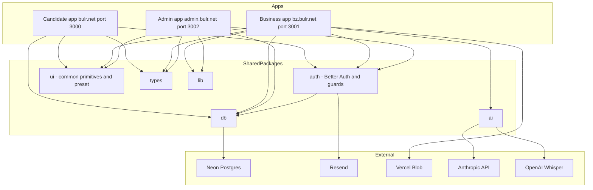
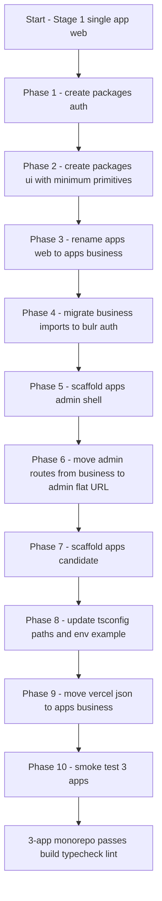

# Design Document — monorepo-app-split

## Overview

`bulr-app-mvp` モノレポを単一アプリ構成（`apps/web`）から、候補者向け `apps/candidate`（`bulr.net`）・企業向け `apps/business`（`bz.bulr.net`）・運営向け `apps/admin`（`admin.bulr.net`）の3アプリ構成へ分割する。本 spec は Stage 2 再設計 Wave 1 の最初の spec で、続く `multi-app-deployment`・Wave 2 以降の前提を作る。

**Users**: 開発者と運営（本 spec の直接の受益者）。エンドユーザ（面接官・候補者）の挙動は変えない。

**Impact**: モノレポの物理構造を3アプリ＋拡張 packages（`@bulr/auth`・`@bulr/ui`）へ再編する。`apps/business` は現行 `apps/web` と機能等価に動き、`apps/admin` で既存検証パネルが引き続き動作し、`apps/candidate` はサインイン後のプレースホルダ画面まで到達できる。新規業務機能・新規 DB スキーマ・本番デプロイは扱わない。

### Goals

- 3アプリ（candidate / business / admin）が `pnpm build` / `pnpm typecheck` / `pnpm lint` を通過する。
- `apps/business` が現行 `apps/web` の URL・API・面接官 UI と機能等価。
- `apps/admin` で既存検証パネル（セッション一覧・詳細・手動評価入力・LLM 評価突合・CSV/JSON エクスポート）が flat 化 URL（`/sessions/...`）で動作する。
- `apps/candidate` のサインインページが表示でき、Magic Link でサインイン後に空のプレースホルダ画面に到達する。
- `packages/auth` と `packages/ui` が3アプリから共通に import 可能。
- 既存 Stage 1 spec の実装挙動を変えない（リネーム・移設・切り出しのみ）。

### Non-Goals

- Vercel 3プロジェクト化・本番ドメイン設定・Preview 自動デプロイ（次の `multi-app-deployment`）。
- `apps/candidate` の業務機能（履歴書・スキルアンケート・模擬面接・エントリー、Wave 2〜4）。
- `apps/admin` の運営拡張機能（企業管理・候補者管理・マスタ CMS・コスト監視、`admin-operations`）。
- `packages/i18n` 追加・新規 DB スキーマ・`packages/ai` の `mock/` 関数追加。
- 既存実装の挙動変更（リネーム・移設・切り出し以外）。

## Boundary Commitments

### This Spec Owns

- `apps/web` → `apps/business` のディレクトリリネームと内部 import パスの更新。
- `apps/candidate` と `apps/admin` の新規アプリスケルトン／シェル作成。
- 現行 `apps/web/app/admin/**` の `apps/admin/app/**`（URL flat 化）への移設。
- `packages/auth` 新規作成と `apps/web/lib/auth/*`・`lib/guards.ts`・`lib/safe-action.ts` の集約。
- **`apps/web/lib/email/`（`resend.ts` + `templates/magic-link.ts`）を `packages/auth/src/email/` へ移管**（Magic Link 配信は auth-bound、現状他で未使用）。
- **`apps/web/lib/rate-limit.ts` を `packages/lib/src/rate-limit.ts` へ移管**（auth と business API（interview turns/proposal/create-session）で共有されるため共通ユーティリティ層が妥当）。
- `packages/ui` 新規作成と3アプリで使う最小プリミティブ（Button / Input / Label / Form / Card）の導入＋ Tailwind preset の共有。
- `tsconfig.base.json` の `paths` 追加（`@bulr/auth`・`@bulr/ui`）。
- `pnpm-workspace.yaml`・`turbo.json` の3アプリ対応化（必要範囲のみ）。
- `.env.example` の3アプリ対応化（アプリ別 URL 変数の整理）。
- `vercel.json` の `apps/business/vercel.json` への移動。

> **Amendment (2026-05-23, Task 1.2 実装中に発見)**: 初版 design は `packages/auth/src/server.ts` が `apps/web/lib/email/*` と `apps/web/lib/rate-limit.ts` に依存することを見落としていた。`packages/auth → apps/web` 逆参照を避けるため email/ は packages/auth へ、rate-limit.ts は packages/lib へ移管する形に拡張。Allowed Dependencies は `packages/auth → packages/db` に加え、Magic Link 配信のため Resend SDK と React Email（ある場合）への外部依存を許容。

### Out of Boundary

- Vercel プロジェクト作成・ドメイン設定・Preview 自動デプロイ（`multi-app-deployment`）。
- `apps/candidate` / `apps/admin` の業務／運営拡張機能（後続 Wave）。
- 既存 `packages/{db,ai,types,lib}` の公開 API 変更（無変更で継承）。
- 新規 DB スキーマ・migration の追加。
- `packages/i18n` の追加・多言語対応。
- shadcn primitive の `packages/ui` への大量追加（3アプリの本 spec 用途で必要な最小のみ。後続 Wave で必要に応じ追加）。
- `apps/business/components/app-shell/` の packages/ui への昇格（business 専用シェル、共有プリミティブではない）。

### Allowed Dependencies

- 既存 packages: `@bulr/db`・`@bulr/types`・`@bulr/lib`・`@bulr/ai`（無変更で継承）。
- 新規 packages: `@bulr/auth`・`@bulr/ui`（本 spec で新設）。
- Better Auth 1.6.x（既存と同じバージョン）。
- Resend（既存）／Neon Postgres（既存）／Vercel Blob（既存）／Anthropic Claude API（既存）／OpenAI Whisper API（既存）。
- Tailwind CSS 4 ＋ shadcn/ui（既存設定の拡張）。
- 依存方向: `apps/*` → `packages/{auth,ui,db,types,lib,ai}` ／ `packages/auth` → `packages/db` ／ `packages/db` → `packages/types`。逆方向の参照は禁止。

### Revalidation Triggers

以下の変更が起きた場合、依存する spec / 実装は再確認が必要:

- `@bulr/auth` の公開 API（`requireUser` / `requireAdmin` / `requireSessionOwnership` / `authedAction` / `adminAction` / `auth` / `authClient` のシグネチャ）変更。
- `@bulr/ui` の Tailwind preset の互換性ある拡張以外の変更。
- 各アプリの `BETTER_AUTH_URL`・`NEXT_PUBLIC_APP_URL`・ポートの再割当。
- `apps/business/vercel.json` の Cron スケジュール変更。
- `apps/admin` の URL flat 化方針の覆し（再び `/admin/` プレフィックスを入れる等）。

## Architecture

### Existing Architecture Analysis

- 現状: `apps/web` 単一 Next.js 16 アプリに面接官 UI（`(interviewer)/*`）・運営管理画面（`admin/*`）・API（`api/*`）が同居。
- 共有: `packages/{db, types, lib, ai}` 経由でデータ・型・LLM 関数を共有。
- 認証: `apps/web/lib/auth/`（Better Auth 設定）・`apps/web/lib/guards.ts`・`apps/web/lib/safe-action.ts`。
- 既存 admin は `_components/`・`_actions/`・`_lib/` private folder 構造で閉じている（`admin-review-panel` R11 の布石）。

### Architecture Pattern & Boundary Map

選定パターン: **Turborepo + pnpm workspaces ＋ 3 Next.js apps**（既存方式の自然な延長）。各アプリは独立 Next.js プロセス、共通ロジックは `packages/*` で提供。



**Key Decisions**:

- 各アプリは**独立した Better Auth インスタンス**を持つ（SSO・クロスドメイン cookie 共有なし）。`packages/auth` が共有設定を提供し、各アプリの `/api/auth/[...all]/route.ts` が自分の `BETTER_AUTH_URL` で起動する（`research.md` Decision 1）。
- **`apps/admin` の URL は flat 化**（`/admin/` プレフィックスなし）。サブドメインで admin スコープが明確（`research.md` Decision 2）。
- **`packages/ui` は最小プリミティブのみで開始**（`research.md` Decision 3）。
- `apps/business/components/app-shell/` は business 専用のため `packages/ui` に昇格させない。
- `vercel.json` を `apps/business/vercel.json` に移動して次の `multi-app-deployment` の前提を整える（`research.md` Decision 4）。

### Technology Stack

| Layer | Choice / Version | Role in Feature | Notes |
|-------|-----------------|------------------|-------|
| Frontend / Apps | Next.js 16 (App Router、Turbopack) | 3アプリ それぞれ独立 | 既存と同バージョン |
| Auth | Better Auth 1.6.x | `packages/auth` で設定共有、各アプリで独立起動 | 既存設定を `packages/auth` に集約 |
| UI primitives | shadcn/ui（React 19 + Tailwind CSS 4） | `packages/ui` で最小プリミティブを共有 | components.json を `packages/ui` に整理 |
| Build | Turborepo + pnpm workspaces | 3アプリと packages の並列ビルド・型・lint | 既存設定の微修正 |
| Type Check | TypeScript strict / `tsconfig.base.json` 継承 | 3アプリと packages の単一基準 | `paths` に `@bulr/auth`・`@bulr/ui` 追加 |

## File Structure Plan

### Directory Structure

```
bulr-app-mvp/
├── apps/
│   ├── candidate/                          # 新規（Next.js 16）
│   │   ├── app/
│   │   │   ├── api/auth/[...all]/route.ts
│   │   │   ├── sign-in/page.tsx
│   │   │   ├── layout.tsx
│   │   │   └── page.tsx                    # サインイン後プレースホルダ
│   │   ├── components/                     # candidate 専用最小
│   │   ├── lib/                            # candidate 専用最小
│   │   ├── public/
│   │   ├── next.config.ts
│   │   ├── tailwind.config.ts              # @bulr/ui preset を extend
│   │   ├── postcss.config.mjs
│   │   ├── tsconfig.json
│   │   ├── package.json                    # name: @bulr/candidate、dev port 3000
│   │   └── README.md
│   ├── business/                           # apps/web からリネーム
│   │   ├── app/                            # 既存（admin/ を除く）
│   │   │   ├── (interviewer)/              # 既存ルートグループ無変更
│   │   │   ├── api/                        # auth / interview / cron 無変更
│   │   │   ├── sign-in/                    # 既存
│   │   │   ├── layout.tsx
│   │   │   ├── page.tsx
│   │   │   └── globals.css
│   │   ├── components/                     # 既存 app-shell/ 等
│   │   ├── lib/                            # 既存（auth/ guards.ts safe-action.ts は packages/auth へ移管）
│   │   │   ├── actions/  audio/  email/  interview/  queries/
│   │   │   └── rate-limit.ts
│   │   ├── public/
│   │   ├── next.config.ts
│   │   ├── tailwind.config.ts              # @bulr/ui preset を extend（既存に preset 追加）
│   │   ├── vercel.json                     # ルートから移動（Cron audio-purge）
│   │   ├── tsconfig.json
│   │   ├── package.json                    # name: @bulr/business、dev port 3001
│   │   └── README.md
│   └── admin/                              # 新規（apps/web/app/admin/ を flat 化して移設）
│       ├── app/
│       │   ├── api/auth/[...all]/route.ts
│       │   ├── sign-in/page.tsx            # 旧 /admin/login の置き換え
│       │   ├── sessions/                   # 旧 apps/web/app/admin/sessions/* 移設（flat）
│       │   │   ├── page.tsx
│       │   │   ├── [id]/page.tsx
│       │   │   ├── [id]/export/route.ts
│       │   │   ├── _components/            # 移設
│       │   │   ├── _actions/               # 移設
│       │   │   └── _lib/                   # 移設
│       │   ├── layout.tsx
│       │   └── page.tsx                    # /sessions リダイレクトまたは admin top
│       ├── components/                     # admin 専用最小
│       ├── lib/                            # admin 専用最小
│       ├── public/
│       ├── next.config.ts
│       ├── tailwind.config.ts              # @bulr/ui preset を extend
│       ├── postcss.config.mjs
│       ├── tsconfig.json
│       ├── package.json                    # name: @bulr/admin、dev port 3002
│       └── README.md
├── packages/
│   ├── auth/                               # 新規
│   │   ├── src/
│   │   │   ├── server.ts                   # 旧 apps/web/lib/auth/server.ts
│   │   │   ├── client.ts                   # 旧 apps/web/lib/auth/client.ts
│   │   │   ├── schemas.ts                  # 旧 apps/web/lib/auth/schemas.ts
│   │   │   ├── guards.ts                   # 旧 apps/web/lib/guards.ts
│   │   │   ├── safe-action.ts              # 旧 apps/web/lib/safe-action.ts
│   │   │   ├── errors.ts                   # AuthError 型（既存定義を集約）
│   │   │   ├── email/                      # ★Amendment：Magic Link 配信
│   │   │   │   ├── resend.ts               # 旧 apps/web/lib/email/resend.ts
│   │   │   │   └── templates/magic-link.ts # 旧 apps/web/lib/email/templates/magic-link.ts
│   │   │   └── index.ts                    # バレル
│   │   ├── package.json                    # name: @bulr/auth
│   │   └── tsconfig.json
│   ├── ui/                                 # 新規
│   │   ├── src/
│   │   │   ├── components/
│   │   │   │   ├── button.tsx
│   │   │   │   ├── input.tsx
│   │   │   │   ├── label.tsx
│   │   │   │   ├── form.tsx
│   │   │   │   └── card.tsx
│   │   │   ├── lib/utils.ts                # cn 等の汎用ユーティリティ
│   │   │   ├── tailwind-preset.ts          # 3アプリで共有する preset
│   │   │   ├── styles.css                  # （必要なら）共有ベーススタイル
│   │   │   └── index.ts                    # バレル
│   │   ├── components.json                 # shadcn 設定（packages/ui スコープ）
│   │   ├── package.json                    # name: @bulr/ui
│   │   └── tsconfig.json
│   ├── db/                                 # 既存（無変更）
│   ├── types/                              # 既存（無変更）
│   ├── lib/                                # 既存 ＋ ★Amendment
│   │   └── src/
│   │       ├── rate-limit.ts               # 旧 apps/web/lib/rate-limit.ts（auth + business API 共有）
│   │       └── index.ts                    # rate-limit を re-export
│   └── ai/                                 # 既存（無変更）
├── scripts/                                # 既存（無変更）
├── docker/                                 # 既存（無変更）
├── docs/                                   # 既存
├── .kiro/                                  # 既存
├── pnpm-workspace.yaml                     # 変更不要（apps/* packages/* で新規も自動認識）
├── turbo.json                              # 必要に応じて微修正
├── tsconfig.base.json                      # paths に @bulr/auth、@bulr/ui を追加
├── .env.example                            # 3アプリ対応に整理
├── package.json                            # 既存スクリプトを 3アプリ対応に微修正
└── (vercel.json は apps/business/vercel.json へ移動済み)
```

### Modified Files

- `apps/web/` → `apps/business/`（ディレクトリリネーム）。中身は基本維持、`admin/` 配下のみ `apps/admin/app/` へ移設。
- `apps/business/package.json` — `name`: `@bulr/web` → `@bulr/business`、dev script のポートを `-p 3020` → `-p 3001` に変更。
- `apps/business/app/admin/` — 削除（apps/admin/ へ移設）。
- `apps/business/lib/auth/` — 削除（packages/auth へ集約）。
- `apps/business/lib/guards.ts`・`safe-action.ts` — 削除（packages/auth へ集約）。
- **`apps/business/lib/email/` — 削除（packages/auth/src/email/ へ集約、Amendment）**。
- **`apps/business/lib/rate-limit.ts` — 削除（packages/lib/src/rate-limit.ts へ集約、Amendment）**。
- `apps/business/` 配下の全 `import` を `@/lib/auth/*`・`@/lib/guards`・`@/lib/safe-action` から `@bulr/auth` に置換。
- **`apps/business/` 配下の `@/lib/rate-limit` import を `@bulr/lib` に置換**（対象: `app/api/interview/turns/next/route.ts`・`app/api/interview/proposal/regenerate/route.ts`・`lib/actions/create-session.ts`）。
- **`apps/business/` 配下の `@/lib/email/*` import を `@bulr/auth` に置換**（Magic Link テンプレ等の参照、もしあれば。実態としては auth 配下の server.ts からの内部 import のみ）。
- `apps/admin/app/sessions/**` — 旧 `apps/web/app/admin/sessions/**` を flat 化（`apps/admin/app/admin/` ではなく `apps/admin/app/sessions/` 直下）。
- `apps/admin/app/sign-in/page.tsx` — 旧 `apps/web/app/admin/login/page.tsx` の置き換え（命名統一）。
- `tsconfig.base.json` — `paths` に `"@bulr/auth": ["./packages/auth/src/index.ts"]` と `"@bulr/ui": ["./packages/ui/src/index.ts"]` を追加。
- `pnpm-workspace.yaml` — 無変更（`apps/*` `packages/*` で自動認識される）。
- `turbo.json` — `dev` タスクは既に `persistent: true` なので3アプリの並列起動はそのまま機能する。必要に応じて `globalDependencies` に `tsconfig.base.json` を追加。
- `.env.example` — アプリ別変数（`NEXT_PUBLIC_APP_URL`・`BETTER_AUTH_URL`）を3アプリ別に明示するコメントと例値を追加。
- `vercel.json`（ルート） → `apps/business/vercel.json` に移動（内容は Cron 定義のまま）。
- ルート `package.json` の scripts — `dev` は `turbo run dev`（既存）のままで OK。`pnpm --filter @bulr/{candidate|business|admin} dev` のショートカットを必要に応じて追加（任意）。

## Requirements Traceability

| Req ID | Summary | Components | Interfaces | Migration Phase |
|--------|---------|-----------|------------|----------------|
| 1.1〜1.7 | 3アプリ構成への移行 | `apps/candidate`・`apps/business`・`apps/admin`・モノレポ設定 | `pnpm --filter` / port assignments | Phase 3, 5, 7, 8 |
| 2.1〜2.7 | apps/business の現行機能維持 | `apps/business`（rename, imports） | 既存 `(interviewer)/*` ルート保持 | Phase 3, 4 |
| 3.1〜3.12 | apps/admin シェル＋検証パネル移設 | `apps/admin`、`packages/auth`（requireAdmin） | `/sessions`・`/sessions/[id]`・`/sessions/[id]/export` flat 化 URL | Phase 5, 6 |
| 4.1〜4.7 | apps/candidate スケルトン | `apps/candidate`、`packages/auth`（Magic Link） | `/sign-in`、`/` プレースホルダ | Phase 7 |
| 5.1〜5.11 | packages/auth 切り出し | `packages/auth` | `auth`・`authClient`・`requireUser`・`requireAdmin`・`requireSessionOwnership`・`authedAction`・`adminAction` | Phase 1, 4 |
| 6.1〜6.7 | packages/ui 切り出し | `packages/ui` | `Button`・`Input`・`Label`・`Form`・`Card`・Tailwind preset | Phase 2 |
| 7.1〜7.7 | モノレポ設定の更新 | `tsconfig.base.json`、`turbo.json`、各 `package.json` | `pnpm build`・`pnpm typecheck`・`pnpm lint` | Phase 8 |
| 8.1〜8.5 | 既存 packages の3アプリからの利用 | 各 `apps/*` の `package.json` dependencies | 既存 `@bulr/{db,types,lib,ai}` 公開 API | Phase 4, 5, 7 |
| 9.1〜9.5 | 環境変数の取り扱い | `.env.example`、各 `apps/*` の dev script | アプリ別 URL 変数 | Phase 8 |
| 10.1〜10.6 | スコープ外の明示 | `Boundary Commitments` 全般 | — | 全 Phase |
| 11.1〜11.2 | smoke test での完了確認 | 手動 smoke test 手順 | — | Phase 10 |

## Components and Interfaces

### Apps Layer

#### `apps/candidate`

| Field | Detail |
|-------|--------|
| Intent | 候補者向けアプリのスケルトン（サインイン＋プレースホルダのみ） |
| Requirements | 4.1〜4.7、1.6 |

**Responsibilities & Constraints**

- Next.js 16 App Router、Better Auth Magic Link によるサインイン、認証後の空ダッシュボード（`/`）への遷移。
- 候補者ロール判定（`candidate_profile` 必須化）は本 spec のスコープ外。

**Dependencies**

- Inbound: なし（エンドユーザ）
- Outbound: `@bulr/auth`（Magic Link）・`@bulr/ui`（プリミティブ）・`@bulr/db`・`@bulr/types`・`@bulr/lib`（最小限の利用、機能は Wave 2 以降）
- External: Resend（Magic Link 配信、`packages/auth` 経由）

**Contracts**: Service [x] / API [ ] / Event [ ] / Batch [ ] / State [ ]

**Implementation Notes**

- Integration: `/api/auth/[...all]/route.ts` で Better Auth handler、`@bulr/auth` の `auth` をマウント。
- Validation: env で `BETTER_AUTH_URL=http://localhost:3000`（dev）が設定されること。
- Risks: 候補者ロール判定がない段階では、サインイン済みなら誰でも `/` に到達する。Wave 2 `candidate-auth-onboarding` で `candidate_profile` 必須化が入るまでの暫定。

#### `apps/business`

| Field | Detail |
|-------|--------|
| Intent | 旧 `apps/web` を継承した企業ユーザ向けアプリ。面接アシスタント本体 |
| Requirements | 2.1〜2.7、1.6 |

**Responsibilities & Constraints**

- 現行 `apps/web` の `(interviewer)/*` ルート群・API・面接エンジンを機能等価で継承。
- `/admin/*` ルートは `apps/admin` へ移設するため持たない。
- `vercel.json`（Cron `audio-purge`）をアプリ内に持つ。

**Dependencies**

- Outbound: `@bulr/auth`（面接官認証）・`@bulr/ui`・`@bulr/db`・`@bulr/types`・`@bulr/lib`・`@bulr/ai`
- External: Anthropic Claude（既存）・OpenAI Whisper（既存）・Vercel Blob（既存）・Resend（`packages/auth` 経由）

**Contracts**: 既存 API ルートを継承（無変更）

**Implementation Notes**

- Integration: import パスを `@/lib/auth/*`・`@/lib/guards`・`@/lib/safe-action` から `@bulr/auth` に一括置換。
- Validation: 一括置換後に `pnpm --filter @bulr/business typecheck` が通ること。
- Risks: 内部 import の見落とし。`grep -rn '@/lib/auth\|@/lib/guards\|@/lib/safe-action' apps/business/` で完全置換確認。

#### `apps/admin`

| Field | Detail |
|-------|--------|
| Intent | 運営向けアプリのシェル＋既存検証パネル移設 |
| Requirements | 3.1〜3.12、1.6 |

**Responsibilities & Constraints**

- Next.js 16 App Router、Better Auth Magic Link、`ADMIN_ALLOWED_EMAILS` 検査（`requireAdmin()`）。
- 既存検証パネル（セッション一覧・詳細・手動評価・LLM 突合・CSV/JSON）を flat 化 URL（`/sessions/*`）で提供。
- 運営拡張機能（企業管理・マスタ CMS 等）は本 spec で実装しない。

**Dependencies**

- Outbound: `@bulr/auth`（requireAdmin・adminAction）・`@bulr/ui`・`@bulr/db`（`queries/admin/`）・`@bulr/types`・`@bulr/lib`

**Contracts**: 既存 admin Server Action（`update-manual-evaluation`）・Route Handler（`/sessions/[id]/export`）を継承（パスは flat 化）

**Implementation Notes**

- Integration: `apps/web/app/admin/sessions/**`（`_components/`・`_actions/`・`_lib/` 含む）を `apps/admin/app/sessions/**` に移動。内部相対 import はそのまま動作する。
- Validation: 移設後 `pnpm --filter @bulr/admin typecheck` が通ること、手動 smoke test で全機能が動作すること。
- Risks: URL 変更で creator・社内ブックマークの旧 URL が無効になる（影響は創業者のみ、許容）。

### Shared Packages Layer

#### `packages/auth` ★新規

| Field | Detail |
|-------|--------|
| Intent | Better Auth 設定とガード／safe-action の3アプリ共有 |
| Requirements | 5.1〜5.11、3.3、4.2 |

**Responsibilities & Constraints**

- Better Auth サーバ／クライアントインスタンスの定義（env-driven baseURL）。
- ガード関数（`requireUser`・`requireAdmin`・`requireSessionOwnership`）と safe-action ラッパー（`authedAction`・`adminAction`）。
- `user` テーブルは Better Auth 管理を1つに保ち、3アプリで共有。
- 役割分離は各アプリ側のガード呼び出しで実施（candidate ロール判定は本 spec ではしない）。

**Dependencies**

- Outbound: `packages/db`（Better Auth テーブル定義の利用）
- External: Better Auth 1.6.x、Resend（Magic Link 配信）

**Contracts**: Service [x] / API [ ] / Event [ ] / Batch [ ] / State [ ]

##### Service Interface

> **Amendment (Task 3.4 実装中に発見)**: 初版 design はバレル単一エントリ（`@bulr/auth`）の前提だったが、`server.ts`（`next/headers`・`pg`・`nodemailer` 依存）と `client.ts` を同一エントリから export すると Client Component が `signIn` を import した時点で server-only 依存が Client バンドルに巻き込まれ、Next.js ビルドが `Module not found: Can't resolve 'tls'/'fs'/'net'/...` で失敗する。Subpath exports（`@bulr/auth/server` と `@bulr/auth/client`）に分離し、メインバレル（`@bulr/auth`）は isomorphic（zod スキーマ・`AuthError`・型）のみを公開する。`server.ts` / `guards.ts` / `safe-action.ts` の冒頭には `import 'server-only';` を追加し、Client から誤って引き込まれた場合に明示的エラーで止める。

```typescript
// packages/auth/src/index.ts（メインバレル: isomorphic 公開シンボルのみ）
export { AuthError } from './errors';
export type { AuthErrorCode } from './errors';
export type { User, Session } from './schemas';
export { emailSchema, interviewerProfileSchema } from './schemas';
export type { InterviewerProfileInput } from './schemas';

// packages/auth/src/server-entry.ts（"./server" subpath、Server / Route Handler / Server Action 用）

// Better Auth サーバインスタンス（各アプリの /api/auth/[...all] でマウント）
export { auth } from './server';
// クライアント側ヘルパー（React Client Component から利用）。
// "./client" subpath（packages/auth/src/client-entry.ts）から export。
export { authClient } from './client';

// 認証ガード（Server Component / Server Action / Route Handler の先頭で呼ぶ）
export function requireUser(): Promise<{ user: User; session: Session }>;
export function requireAdmin(): Promise<{ user: User; session: Session }>;
export function requireSessionOwnership(sessionId: string): Promise<{ user: User; session: Session }>;

// Server Action ラッパー（型安全な認可付き Server Action を提供）
export function authedAction<I, O>(
  schema: ZodSchema<I>,
  fn: (input: I, ctx: AuthedContext) => Promise<O>
): (input: I) => Promise<O>;
export function adminAction<I, O>(
  schema: ZodSchema<I>,
  fn: (input: I, ctx: AdminContext) => Promise<O>
): (input: I) => Promise<O>;

// エラー型
export class AuthError extends Error {
  constructor(code: 'UNAUTHORIZED' | 'FORBIDDEN' | 'SESSION_EXPIRED');
}
export type { User, Session } from './schemas';
```

**Preconditions / Postconditions / Invariants**

- 各アプリで env `BETTER_AUTH_URL`・`BETTER_AUTH_SECRET`・`RESEND_API_KEY`・`DATABASE_URL` が設定されていること（precondition）。
- `requireUser()` が成功した場合、戻り値の `user` は Better Auth で検証済みのセッションに対応する（postcondition）。
- `user` テーブルは DB 上で1つだけ存在し、3アプリで共有される（invariant）。

**Implementation Notes**

- Integration: 既存 `apps/web/lib/auth/{server,client,schemas}.ts`・`lib/guards.ts`・`lib/safe-action.ts` を物理移動。`AuthError` も既存定義から移管。
- Validation: `pnpm --filter @bulr/auth typecheck` ＋ 3アプリの typecheck がすべて通ること。
- Risks: 既存 `apps/web` で参照されていた import の見落とし。`grep` での網羅確認。

#### `packages/ui` ★新規

| Field | Detail |
|-------|--------|
| Intent | 3アプリで共有する最小 UI プリミティブと Tailwind preset |
| Requirements | 6.1〜6.7、4.2、3.2 |

**Responsibilities & Constraints**

- shadcn/ui ベースの最小プリミティブ（Button / Input / Label / Form / Card）。
- Tailwind preset（3アプリの `tailwind.config.ts` が extend）。
- `cn`（class-name util）等の汎用ユーティリティ。
- スコープは YAGNI で最小に保つ。3アプリでまだ共有されない components は含めない。

**Dependencies**

- Outbound: なし（React と Tailwind に依存するが peer / dev で扱う）
- External: React 19、Tailwind CSS 4、shadcn/ui の primitive（CLI で個別インストール）、`class-variance-authority`・`tailwind-merge`（cn の実装）

**Contracts**: Service [ ] / API [ ] / Event [ ] / Batch [ ] / State [ ]（プレゼンテーション層、契約なし）

##### Public exports（説明用）

```typescript
// packages/ui/src/index.ts
export { Button } from './components/button';
export { Input } from './components/input';
export { Label } from './components/label';
export {
  Form, FormField, FormItem, FormLabel, FormControl, FormMessage
} from './components/form';
export { Card, CardHeader, CardTitle, CardContent, CardFooter } from './components/card';
export { cn } from './lib/utils';
export { default as bulrTailwindPreset } from './tailwind-preset';
```

**Implementation Notes**

- Integration: 各アプリの `tailwind.config.ts` が `presets: [bulrTailwindPreset]` を含む。`components.json` は `packages/ui` 配下に置き、shadcn CLI で primitive を追加する場合は `packages/ui` スコープで実行。
- Validation: 3アプリのサインインページが `Button`・`Input`・`Form` を import して表示できること。
- Risks: Tailwind の content スキャンが各アプリの設定で正しく `packages/ui/src/**/*.tsx` を含むこと。各アプリの `tailwind.config.ts` で content paths を明示。

#### `packages/db` / `packages/ai` / `packages/types` / `packages/lib`

| Component | Intent | Requirements | Change |
|-----------|--------|--------------|--------|
| `@bulr/db` | DB スキーマ・クエリの単一の真実 | 8.1〜8.4 | 無変更 |
| `@bulr/ai` | LLM 関数・Whisper・プロンプト | 8.5 | 無変更（`mock/` 追加は Wave 4） |
| `@bulr/types` | 共通型（profile・evaluation） | 8.1〜8.4 | 無変更 |
| `@bulr/lib` | 共通ユーティリティ | 8.1〜8.4 | 無変更 |

### Monorepo Tooling

| Item | Current | After |
|------|---------|-------|
| `pnpm-workspace.yaml` | `packages: ['apps/*', 'packages/*']` | 無変更（自動認識） |
| `turbo.json` | `build` / `dev`（persistent） / `typecheck` / `lint` | 無変更（必要に応じて `globalDependencies` 追加） |
| `tsconfig.base.json` | 既存 paths | `paths` に `@bulr/auth`・`@bulr/ui` を追加 |
| ルート `package.json` | `dev` = `turbo run dev` | 無変更 |
| `.env.example` | 共有変数中心 | アプリ別 URL 変数（`NEXT_PUBLIC_APP_URL`・`BETTER_AUTH_URL`）を3アプリ別に明示 |
| `vercel.json` | ルート | `apps/business/vercel.json` に移動 |

## Error Handling

### Error Strategy

リファクタ spec のため、新規エラー処理はほぼ発生しない。既存のエラー応答（`AuthError`・Next.js `notFound()`・Server Action の判別共用体）は移管後も同じ挙動を維持する。

### Refactor-Specific Risks

- **Import 漏れ** — `pnpm typecheck` で検出。各 Phase 完了時に typecheck をゲートにする。
- **Better Auth baseURL ミスマッチ** — 各アプリで env `BETTER_AUTH_URL` が正しく注入されていないと Magic Link コールバックが失敗する。dev/prod それぞれで `.env.local` の例を `.env.example` に明示。
- **Tailwind content スキャン漏れ** — `packages/ui` のクラスが各アプリで生成されないと UI が崩れる。各アプリの `tailwind.config.ts` の content に `packages/ui/src/**/*.{ts,tsx}` を含める。
- **ポート競合** — `apps/business` の `:3001` が他プロセスで使われていると dev が起動しない。`.env.local` または `package.json` script でポート明示。
- **vercel.json の Cron 失効** — ローカル影響なし。次の `multi-app-deployment` で Vercel プロジェクトが business を Root Directory にして `apps/business/vercel.json` を拾うことを確認するまで本番 Cron に手を加えない（本 spec は本番デプロイを触らない）。

### Monitoring

本 spec はリファクタのため新規監視は導入しない。完了確認は手動 smoke test（R11）で行う。

## Testing Strategy

Stage 1 方針に沿い、自動テストフレームワークは導入しない（R11.1）。完了確認は以下の手動 smoke test を実施する（R11.2）。

### Build / Tooling

- `pnpm install` がクリーンな状態（`node_modules` 削除後）から成功する。
- `pnpm build` が3アプリと全 packages で成功する。
- `pnpm typecheck` が全 workspace で成功する。
- `pnpm lint` が全 workspace で成功する。

### Per-App Boot

- `pnpm --filter @bulr/candidate dev` が `:3000` で起動できる。
- `pnpm --filter @bulr/business dev` が `:3001` で起動できる。
- `pnpm --filter @bulr/admin dev` が `:3002` で起動できる。
- ルート `pnpm dev` で3アプリが Turbo によって並列起動する。

### apps/business（機能等価性確認）

- 既存の面接官サインイン → セッション一覧 → 新規セッション作成 → 面接中 UI（状態A/B）→ 面接後レポートの一連が現行 `apps/web` と同じく動作する。

### apps/admin（既存検証パネル動作確認）

- 許可メールでサインイン → セッション一覧（`/sessions`）→ セッション詳細（`/sessions/[id]`）→ 手動評価入力・保存 → LLM vs 手動 並列表示・差分ハイライト → CSV/JSON エクスポート（`/sessions/[id]/export?format=csv|json`）の一連が現行と同じく動作する。

### apps/candidate（スケルトン到達確認）

- サインインページ表示 → Magic Link でサインイン → 認証後のプレースホルダ画面（`/`）に到達。

## Migration Strategy

リファクタリスクを抑えるため、`pnpm typecheck` を各 Phase のゲートにして段階的に進める。



### Phase Breakdown

1. **Phase 1**: `packages/auth` 新規作成。`apps/web/lib/auth/*`・`lib/guards.ts`・`lib/safe-action.ts` を物理移動。`packages/auth` 単体で typecheck 通過。
2. **Phase 2**: `packages/ui` 新規作成。shadcn CLI で Button / Input / Label / Form / Card を `packages/ui` スコープで追加。Tailwind preset を作成。
3. **Phase 3**: `git mv apps/web apps/business`。`apps/business/package.json` の `name`・dev port を更新。
4. **Phase 4**: `apps/business/` 内の `@/lib/auth/*`・`@/lib/guards`・`@/lib/safe-action` import を `@bulr/auth` に一括置換。`pnpm --filter @bulr/business typecheck` 通過。
5. **Phase 5**: `apps/admin/` 新規スケルトン作成。`package.json`・`tsconfig`・`tailwind.config`・`next.config`・`/api/auth/[...all]/route.ts`・`/sign-in/page.tsx` を整備。`pnpm --filter @bulr/admin build` 通過。
6. **Phase 6**: `apps/business/app/admin/sessions/**`（`_components/`・`_actions/`・`_lib/` 含む）を `apps/admin/app/sessions/**` に物理移動（flat 化）。`apps/business/app/admin/login/page.tsx` を `apps/admin/app/sign-in/page.tsx` として移設・統一。`pnpm --filter @bulr/admin typecheck` 通過。
7. **Phase 7**: `apps/candidate/` 新規スケルトン作成（Phase 5 と同様の最小骨格 ＋ `/page.tsx` プレースホルダ）。`pnpm --filter @bulr/candidate build` 通過。
8. **Phase 8**: `tsconfig.base.json` の `paths` に `@bulr/auth`・`@bulr/ui` を追加。`.env.example` を3アプリ対応にコメント整理。各アプリの `tailwind.config.ts` で content に `packages/ui/src/**/*.{ts,tsx}` を含める。`pnpm typecheck` 全体通過。
9. **Phase 9**: ルート `vercel.json` を `apps/business/vercel.json` に物理移動。内容は無変更（Cron 定義）。
10. **Phase 10**: 手動 smoke test（Testing Strategy 参照）。`pnpm build` / `pnpm typecheck` / `pnpm lint` が全体通過。3アプリの起動・主要フロー動作確認。

### Rollback Triggers

- Phase 4 で大量の typecheck エラーが解消されない → Phase 3 直後にロールバック、auth 集約方針を再検討。
- Phase 6 で admin の URL flat 化に伴う相対 import が壊れる → 移設前のディレクトリ階層を再現するか、相対 import をパスエイリアス（`@/`）に整理してから再移設。

## Risks（要約・詳細は `research.md`）

- Import パス破壊（mitigation: Phase ごとに `pnpm typecheck` ゲート）
- Better Auth baseURL ミスマッチ（mitigation: env-driven 設計＋ `.env.example` 例示）
- ポート競合（mitigation: 各アプリの dev script で明示、`.env.local` 例示）
- shadcn Tailwind の content スキャン漏れ（mitigation: 各アプリの tailwind.config に packages/ui を明示）
- vercel.json 移動による Cron 失効（mitigation: 本 spec は本番触らない、`multi-app-deployment` で確認）

詳細リスクと mitigation は `research.md` の "Risks & Mitigations" を参照。
