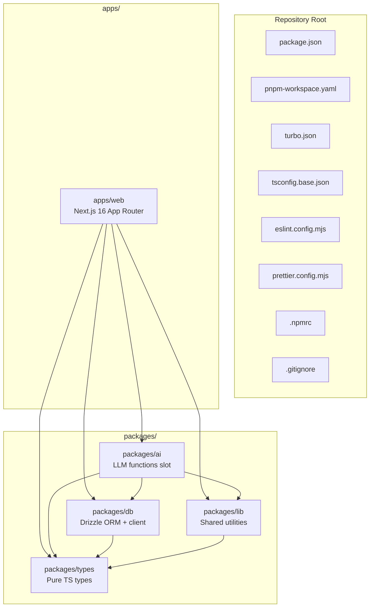

# Design Document — monorepo-foundation

## Overview

**Purpose**: 本機能は、bulr Stage 1 MVP プロトタイプ（AI 面接アシスタント型）の **モノレポ基盤** を確立する。Turborepo + pnpm workspaces + Next.js 16 + 4 つの workspace パッケージ（`@bulr/db`、`@bulr/types`、`@bulr/lib`、`@bulr/ai`）によるスケルトンを構築し、`pnpm install` → `pnpm dev` で apps/web (port 3000) が起動し、`pnpm typecheck` / `pnpm lint` がエラーなく通る状態をゴールとする。

**Users**: 後続 5 spec（`multi-env-infrastructure`、`authentication`、`assessment-pattern-seed`、`assessment-engine`、`admin-review-panel`）の実装担当者が利用する。各 spec はこの基盤の上にインフラ統合・認証・DB スキーマ・LLM 関数 + 状態 A/B UI・管理画面を順次積み上げる。

**Impact**: greenfield プロジェクトに対して、ルート設定（`package.json` / `pnpm-workspace.yaml` / `turbo.json` / `tsconfig.base.json` / Lint/Format 設定）と `apps/web` + `packages/{db, types, lib, ai}` のディレクトリ構造を新規作成する。本スペックは **機能を実装しない**。空ページ表示と型チェック/lint pass のみがゴール。

### Goals

- ルート設定 8 ファイル（`package.json` / `pnpm-workspace.yaml` / `turbo.json` / `tsconfig.base.json` / `.gitignore` / `eslint.config.mjs` / `prettier.config.mjs` / `.npmrc`）を整備
- `apps/web` を Next.js 16 + React 19 + Tailwind CSS 4 + shadcn/ui ベースで初期化し、port 3000 で空ランディングページを起動
- `packages/{db, types, lib, ai}` の 4 パッケージスケルトンを作成し、相互参照（`@bulr/*` エイリアス）を確立
- `packages/types/package.json` の exports map に `./profile` / `./evaluation` のサブパス export を予約
- `packages/ai/package.json` に Vercel AI SDK 6 / Anthropic SDK / OpenAI SDK / Zod の依存を追加
- `packages/db` に Drizzle ORM の最小初期化（client + 空 schema + drizzle.config.ts）
- `pnpm dev` / `pnpm build` / `pnpm typecheck` / `pnpm lint` のルートコマンドが動作

### Non-Goals

- 認証実装（Better Auth、Magic Link、proxy.ts）→ `authentication` spec
- DB テーブル実体定義 → 後続 spec
- LLM 関数実装、システムプロンプト、Whisper クライアント実装 → `assessment-engine` spec
- 環境変数定義、`.env.example`、Vercel デプロイ、Vercel Cron → `multi-env-infrastructure` spec
- UI コンポーネント実装、面接 UI、管理画面 → 後続 spec
- CI/CD パイプライン、テストフレームワークセットアップ → 必要になった spec
- Drizzle migration の dev/prod への push → 後続 spec

## Boundary Commitments

### This Spec Owns

- ルート設定 8 ファイルの作成と内容
- `apps/web` の Next.js 16 初期化（`app/layout.tsx`、`app/page.tsx`、`next.config.ts`、`tailwind.config.ts`、`postcss.config.mjs`、`globals.css`、`tsconfig.json`、`package.json`、`components.json` for shadcn/ui ベース）
- `packages/{db, types, lib, ai}` の 4 パッケージの `package.json` / `tsconfig.json` / `src/index.ts` 等のスケルトン
- `packages/db/drizzle.config.ts` と `src/client.ts`、`src/schema/index.ts`（空バレル）、`src/queries/index.ts`（空バレル）
- `packages/types/package.json` の exports map（`.` / `./profile` / `./evaluation`）と `src/{index,profile,evaluation}.ts` 空ファイル
- `packages/ai` の `src/{functions,prompts,whisper}/` ディレクトリ予約（`.gitkeep` または空 `index.ts`）と AI SDK 依存追加
- パッケージ間依存方向の `package.json` レベルでの強制
- ESLint Flat Config と Prettier 設定（`singleQuote: true`）
- Turborepo パイプライン定義（`build` / `dev` / `typecheck` / `lint`）

### Out of Boundary

- `.env*` ファイル、環境変数値、Vercel プロジェクト設定 → `multi-env-infrastructure` spec
- `vercel.json`（Cron 定義含む）→ `multi-env-infrastructure` spec
- DB schema 実体（candidate / interview_session 等のテーブル定義）→ 後続 spec が `packages/db/src/schema/*.ts` を追加
- LLM 関数本体（`analyzeTurn` 等 5 関数）と Whisper ラッパー（`transcribeAudio`）の実装 → `assessment-engine` spec が `packages/ai/src/functions/*.ts` と `src/whisper/transcribe.ts` を追加
- `packages/types/src/profile.ts` / `evaluation.ts` の型実体 → `assessment-engine` spec
- 認証ヘルパー（`requireUser` / `requireAdmin` / `requireSessionOwnership`）と Server Action ラッパー → `authentication` spec が `apps/web/lib/` に追加
- shadcn/ui コンポーネント本体（Button / Dialog 等）の追加 → `assessment-engine` spec で必要なものから順次追加（本スペックでは `components.json` の登録設定のみ）
- テストランナー（Vitest / Playwright）の導入 → 必要になった spec で導入
- `pnpm audit` 等のセキュリティスキャン CI 設定 → `multi-env-infrastructure` spec

### Allowed Dependencies

- pnpm 10+、Turborepo 2.x、TypeScript 5.x、Next.js 16、React 19、Tailwind CSS 4、Drizzle ORM 0.45.x、drizzle-kit 0.31.x、Vercel AI SDK 6.x、Anthropic AI SDK 3.x、OpenAI SDK（公式）、Zod 4.x
- ESLint 9.x（Flat Config）、typescript-eslint 8.x、Prettier 3.x
- Postgres 用 Node ドライバ（`pg` 8.x）。Neon の serverless ドライバへの差し替えは `multi-env-infrastructure` spec で判断
- 制約: `packages/types` には runtime 依存（Zod 含む）を一切追加しない。Zod は `packages/lib` および `packages/ai`、`apps/web/lib` でのみ使用

### Revalidation Triggers

- パッケージ名（`@bulr/*`）または workspace エイリアス命名規則の変更 → 全 spec が import 文を書き換え
- 依存方向ルール（`apps/web → packages/{db, types, lib, ai}` 等）の変更 → 後続 spec の package.json 更新が必要
- `packages/types` の exports map（`.` / `./profile` / `./evaluation`）にサブパスを追加・削除 → `assessment-engine` spec の import 文に影響
- TypeScript の `module` / `moduleResolution` 設定変更 → 全パッケージの import 解決方式に影響
- Next.js のメジャーバージョン変更（16 → 17 等）→ `apps/web` 全体の検証が必要
- `packages/ai` の AI SDK のメジャーバージョン変更（Vercel AI SDK 6 → 7、Anthropic SDK の API 変更等）→ `assessment-engine` spec のコード書き換えが必要
- Drizzle ORM のメジャーバージョン変更 → `assessment-pattern-seed` および `assessment-engine` spec のスキーマ書き換えが必要

## Architecture

### Existing Architecture Analysis

該当なし（greenfield）。bootstrap commit + `docs/` + `.kiro/`（steering 7 ファイル + 6 spec brief）+ `.claude/` のみが既存。

参照プロジェクト `dishxdish-app-mvp` が部分的に同一スタック（Turborepo + pnpm + Next.js 16 + Drizzle + Vercel AI SDK 6 + Anthropic SDK）で稼働中。本スペックは dishxdish の構成を Stage 1 用に簡略化して移植する：

- `dishxdish/packages/{auth, ui, i18n}` は **Stage 1 では作らない**（apps/web に直書き、Stage 2 で切り出し）
- `dishxdish/packages/types` の exports map 構造を踏襲
- `dishxdish/packages/ai` の依存構成を bulr 用に変更（`@ai-sdk/google` を外し、`openai` を追加）
- Prettier の `singleQuote` は dishxdish が `false` だが、本プロジェクトでは v1 確認済み方針で `true` を採用（差分注意）

### Architecture Pattern & Boundary Map



**Architecture Integration**:
- **Selected pattern**: モノレポ + 単一アプリ（apps/web）+ 4 パッケージ。Turborepo パイプラインで並列ビルド・型チェック・lint
- **Domain/feature boundaries**: `packages/types` は型のみ、`packages/lib` は runtime ユーティリティ、`packages/db` は DB スキーマ + クライアント、`packages/ai` は LLM 関数（本スペックではディレクトリと依存予約のみ）。`apps/web` は UI + API Routes + Server Components
- **Existing patterns preserved**: 該当なし（greenfield）
- **New components rationale**: 後続 5 spec の依存順序（roadmap.md 参照）を満たすため、最小 4 パッケージで開始。`packages/auth` / `ui` / `i18n` は Stage 2 で切り出し
- **Steering compliance**: `structure.md` L13-99 のディレクトリ構造、L240-251 の依存ルール、`tech.md` L41-53 の技術選定、`security.md` L189-209 のシークレット管理ルールに準拠

### Technology Stack

| Layer | Choice / Version | Role in Feature | Notes |
|-------|------------------|-----------------|-------|
| Frontend | Next.js 16 (App Router、Turbopack stable、React Compiler) / React 19 | apps/web の起動・空ページ表示 | `app/page.tsx` のみ含む |
| Styling | Tailwind CSS 4 + shadcn/ui ベース | グローバル CSS と shadcn の `components.json` 登録 | 個別コンポーネントは後続 spec で追加 |
| Backend / Services | （該当なし） | 本スペックでは API Route を実装しない | `assessment-engine` spec で `/api/interview/*` 追加 |
| Data / Storage | Drizzle ORM 0.45.x stable + drizzle-kit + `pg` 8.x | `packages/db` の client 初期化と空 schema | 接続先 DATABASE_URL は `multi-env-infrastructure` spec |
| AI / LLM | Vercel AI SDK 6.x + `@ai-sdk/anthropic` + `openai` + Zod 4.x | `packages/ai` の依存追加のみ | 関数実装は `assessment-engine` spec |
| Type System | TypeScript 5.x（strict mode、`noUncheckedIndexedAccess: true`） | 全パッケージの型チェック | `tsconfig.base.json` で集中管理 |
| Lint / Format | ESLint 9.x（Flat Config） / typescript-eslint 8.x / Prettier 3.x | コード品質 | Prettier `singleQuote: true` |
| Build / Task | Turborepo 2.x + pnpm 10+ workspaces | 並列ビルド・型チェック・lint | `turbo.json` で task 定義 |
| Runtime | Node.js 22 LTS or 24 LTS | `engines` で要求 | `tech.md` 準拠 |

## File Structure Plan

### Directory Structure

```
bulr-app-mvp/
├── package.json                       # ルート: workspaces / scripts (dev/build/typecheck/lint) / engines / devDependencies
├── pnpm-workspace.yaml                # ["apps/*", "packages/*"]
├── turbo.json                         # build / dev / typecheck / lint タスク定義
├── tsconfig.base.json                 # strict mode / noUncheckedIndexedAccess / ESNext / bundler
├── eslint.config.mjs                  # Flat Config: typescript-eslint recommended + ignores
├── prettier.config.mjs                # singleQuote: true / printWidth 100 / tabWidth 2
├── .npmrc                             # strict-peer-dependencies / link-workspace-packages 等
├── .gitignore                         # node_modules / .next / .turbo / dist / .vercel / coverage / .env*.local
│
├── apps/
│   └── web/
│       ├── package.json               # name: @bulr/web、deps: next/react/react-dom/tailwindcss + @bulr/{db,types,lib,ai}
│       ├── tsconfig.json              # extends tsconfig.base.json + Next.js plugin + paths
│       ├── next.config.ts             # 最小設定（後続 spec で CSP / cron 等追加）
│       ├── postcss.config.mjs         # @tailwindcss/postcss
│       ├── tailwind.config.ts         # content: ["./app/**/*.{ts,tsx}", "./components/**/*.{ts,tsx}"]
│       ├── components.json            # shadcn/ui の設定（aliases、style、tailwind 設定指定）
│       ├── app/
│       │   ├── layout.tsx             # ルートレイアウト（html/body + globals.css import）
│       │   ├── page.tsx               # 空のランディング（"bulr — AI 面接アシスタント (準備中)"）
│       │   └── globals.css            # @import "tailwindcss";
│       ├── components/                # 空ディレクトリ（.gitkeep）
│       └── lib/                       # 空ディレクトリ（.gitkeep）
│
└── packages/
    ├── db/
    │   ├── package.json               # name: @bulr/db、deps: drizzle-orm + pg、devDeps: drizzle-kit + tsx + @types/pg、peerDeps: @bulr/types、exports に ./schema/* / ./queries/* / ./seeds/* ワイルドカード予約
    │   ├── tsconfig.json              # extends tsconfig.base.json
    │   ├── drizzle.config.ts          # schema / out / dialect: 'postgresql' / dbCredentials は後続 spec で追加
    │   └── src/
    │       ├── index.ts               # export * from './client'; export * as schema from './schema';
    │       ├── client.ts              # drizzle(pg client) ファクトリ（DATABASE_URL は process.env、後続 spec で実 URL）
    │       ├── schema/
    │       │   └── index.ts           # 空バレル（コメント: テーブルは後続 spec で追加）
    │       ├── queries/
    │       │   ├── .gitkeep           # ディレクトリ予約（後続 spec が interview/, admin/ サブディレクトリを追加）
    │       │   └── index.ts           # 空バレル（コメント: クエリは後続 spec で追加）
    │       └── seeds/
    │           └── .gitkeep           # ディレクトリ予約（assessment-pattern-seed spec が assessment-patterns.ts / types.ts を追加）
    │
    ├── types/
    │   ├── package.json               # name: @bulr/types、exports: { ".", "./profile", "./evaluation" }、deps: 空、devDeps: typescript のみ
    │   ├── tsconfig.json              # extends tsconfig.base.json
    │   └── src/
    │       ├── index.ts               # 空バレル（コメント: 共通型を再エクスポート予定）
    │       ├── profile.ts             # 空ファイル（assessment-engine spec で InterviewerProfile / CandidateInfo 等を追加）
    │       └── evaluation.ts          # 空ファイル（assessment-engine spec で LlmEvaluation / ManualEvaluation / HeatmapData 等を追加）
    │
    ├── lib/
    │   ├── package.json               # name: @bulr/lib、deps: @bulr/types + zod（runtime OK レイヤ）
    │   ├── tsconfig.json              # extends tsconfig.base.json
    │   └── src/
    │       └── index.ts               # 空バレル（コメント: 共通ユーティリティを追加予定）
    │
    └── ai/
        ├── package.json               # name: @bulr/ai、deps: ai (Vercel AI SDK 6) + @ai-sdk/anthropic + openai + zod + @bulr/{db,types,lib}
        ├── tsconfig.json              # extends tsconfig.base.json
        └── src/
            ├── index.ts               # 空バレル（コメント: LLM 関数を再エクスポート予定）
            ├── client.ts              # 空ファイル or コメントのみ（後続 spec で Anthropic Claude モデル定義）
            ├── functions/
            │   └── .gitkeep           # ディレクトリ予約（assessment-engine spec が 5 関数を追加）
            ├── prompts/
            │   └── .gitkeep           # ディレクトリ予約（assessment-engine spec が system-prompt.ts を追加）
            └── whisper/
                └── .gitkeep           # ディレクトリ予約（assessment-engine spec が transcribe.ts を追加）
```

### Modified Files

- 該当なし（全ファイル新規作成）

> 各ファイルは単一責務。ルート設定 8 ファイル、`apps/web` 12 ファイル、`packages/db` 7 ファイル、`packages/types` 5 ファイル、`packages/lib` 3 ファイル、`packages/ai` 7 ファイル（`.gitkeep` 含む）。`packages/ai` の 5 関数実装と Whisper ラッパーは **本スペックでは作成しない**（ディレクトリと依存のみ予約）。

## Requirements Traceability

| Requirement | Summary | Components | Interfaces | Flows |
|-------------|---------|------------|------------|-------|
| 1.1 | ルート設定 8 ファイル存在 | RootConfig | filesystem | — |
| 1.2 | workspaces 宣言 | RootConfig | pnpm-workspace.yaml | — |
| 1.3 | engines: Node 22+ / pnpm 10+ | RootConfig | package.json | — |
| 1.4 | TS strict + noUncheckedIndexedAccess | TsConfigBase | tsconfig.base.json | — |
| 1.5 | Prettier singleQuote: true 等 | PrettierConfig | prettier.config.mjs | — |
| 1.6 | pnpm install が成功 | RootConfig + 全パッケージ | pnpm | install フロー |
| 1.7 | .gitignore 内容 | RootConfig | .gitignore | — |
| 1.8 | .npmrc 内容 | RootConfig | .npmrc | — |
| 2.1 | apps/web 構成ファイル一式 | WebApp | filesystem | — |
| 2.2 | App Router 採用 | WebApp | app/layout.tsx + app/page.tsx | — |
| 2.3 | Next.js 16 + React 19 | WebApp | package.json | — |
| 2.4 | Tailwind CSS 4 有効化 | WebApp | globals.css + postcss.config + tailwind.config | — |
| 2.5 | TS strict 継承 | WebApp | tsconfig.json | — |
| 2.6 | pnpm dev で port 3000 起動 | WebApp + TurboPipeline | package.json scripts | dev フロー |
| 2.7 | pnpm build 成功 | WebApp + TurboPipeline | turbo.json | build フロー |
| 2.8 | @bulr/* dependencies 宣言 | WebApp | package.json | — |
| 2.9 | components/ + lib/ ディレクトリ予約 | WebApp | filesystem | — |
| 3.1 | packages/db ファイル一式 | DbPackage | filesystem | — |
| 3.2 | drizzle-orm + drizzle-kit + pg 依存 | DbPackage | package.json | — |
| 3.3 | drizzle.config.ts 設定 | DbPackage | drizzle.config.ts | — |
| 3.4 | 空 schema バレル | DbPackage | src/schema/index.ts | — |
| 3.5 | db client + schema 再エクスポート | DbPackage | src/index.ts | import フロー |
| 3.6 | @bulr/types peer 宣言 | DbPackage | package.json | — |
| 3.7 | typecheck 成功 | DbPackage + TurboPipeline | tsc | typecheck フロー |
| 3.8 | drizzle-kit scripts | DbPackage | package.json scripts | — |
| 4.1 | packages/types ファイル一式 | TypesPackage | filesystem | — |
| 4.2 | exports map: ./profile / ./evaluation | TypesPackage | package.json | サブパス解決フロー |
| 4.3 | runtime 依存ゼロ | TypesPackage | package.json | — |
| 4.4 | profile.ts / evaluation.ts 空 | TypesPackage | filesystem | — |
| 4.5 | tsconfig 継承 | TypesPackage | tsconfig.json | — |
| 4.6 | typecheck 成功 | TypesPackage | tsc | typecheck フロー |
| 4.7 | サブパス import が解決 | TypesPackage | exports map | サブパス解決フロー |
| 5.1 | packages/lib ファイル一式 | LibPackage | filesystem | — |
| 5.2 | @bulr/types 参照 + Zod 許容 | LibPackage | package.json | — |
| 5.3 | packages/ai ファイル一式 | AiPackage | filesystem | — |
| 5.4 | ai + @ai-sdk/anthropic + openai + zod 依存 | AiPackage | package.json | — |
| 5.5 | functions / prompts / whisper ディレクトリ予約 | AiPackage | filesystem | — |
| 5.6 | src/index.ts 空バレル | AiPackage | src/index.ts | — |
| 5.7 | LLM 関数本体は含まない | AiPackage | （out of scope 確認） | — |
| 5.8 | typecheck 成功 | LibPackage + AiPackage | tsc | typecheck フロー |
| 6.1 | @bulr/* エイリアス | 全パッケージ | package.json names | — |
| 6.2 | 依存方向遵守 | 全パッケージ | package.json dependencies | — |
| 6.3 | 違反検出（物理的予防） | 全パッケージ | package.json | — |
| 6.4 | types は外部依存ゼロ | TypesPackage | package.json | — |
| 6.5 | apps/web から @bulr/db 解決 | WebApp + DbPackage | TS module resolution | import フロー |
| 6.6 | @bulr/ai 空 export 解決 | WebApp + AiPackage | TS module resolution | — |
| 7.1 | dev/build/typecheck/lint scripts | RootConfig + TurboPipeline | package.json | — |
| 7.2 | turbo.json タスク定義 | TurboPipeline | turbo.json | — |
| 7.3 | dev タスク cache: false / persistent: true | TurboPipeline | turbo.json | dev フロー |
| 7.4 | typecheck 全パッケージ並列実行成功 | TurboPipeline + 全パッケージ | turbo run typecheck | typecheck フロー |
| 7.5 | lint 全パッケージ並列実行成功 | TurboPipeline + 全パッケージ | turbo run lint | lint フロー |
| 7.6 | 各 package の typecheck script | 全パッケージ | package.json scripts | — |
| 7.7 | 各 package の lint script | 全パッケージ | package.json scripts | — |
| 8.1 | Flat Config + Prettier config 存在 | EslintConfig + PrettierConfig | filesystem | — |
| 8.2 | typescript-eslint recommended + no-explicit-any: warn+ | EslintConfig | eslint.config.mjs | — |
| 8.3 | ignores 一覧 | EslintConfig | eslint.config.mjs | — |
| 8.4 | Prettier 設定値 | PrettierConfig | prettier.config.mjs | — |
| 8.5 | 整形動作 | PrettierConfig | prettier CLI | format フロー |
| 8.6 | ルート設定継承 | 全パッケージ | （flat config 自動適用） | — |

## Components and Interfaces

| Component | Domain/Layer | Intent | Req Coverage | Key Dependencies (P0/P1) | Contracts |
|-----------|--------------|--------|--------------|--------------------------|-----------|
| RootConfig | Root | ルート設定 8 ファイル一式（package.json / pnpm-workspace.yaml / turbo.json / tsconfig.base.json / eslint.config.mjs / prettier.config.mjs / .npmrc / .gitignore） | 1.1, 1.2, 1.3, 1.6, 1.7, 1.8, 7.1 | pnpm 10+ (P0)、Node 22+ (P0)、Turborepo 2.x (P0) | State |
| TsConfigBase | Root | TypeScript 共通設定 | 1.4, 4.5 | TypeScript 5.x (P0) | State |
| EslintConfig | Root | ESLint Flat Config | 8.1, 8.2, 8.3, 8.6 | typescript-eslint 8.x (P0) | State |
| PrettierConfig | Root | Prettier 統一フォーマット | 1.5, 8.1, 8.4, 8.5 | Prettier 3.x (P0) | State |
| TurboPipeline | Root | Turborepo パイプライン定義 | 7.1, 7.2, 7.3, 7.4, 7.5 | Turborepo 2.x (P0) | Batch |
| WebApp | apps/web | Next.js 16 空アプリスケルトン | 2.1-2.9, 6.5, 7.4, 7.5, 7.6, 7.7 | Next.js 16 (P0)、React 19 (P0)、Tailwind CSS 4 (P0)、@bulr/db/types/lib/ai (P0) | State |
| DbPackage | packages/db | Drizzle 初期化 + 空 schema | 3.1-3.8, 6.1, 6.2, 7.4-7.7 | drizzle-orm (P0)、drizzle-kit (P0)、pg (P0)、@bulr/types (P1) | Service, State |
| TypesPackage | packages/types | 型のみ + サブパス export 予約 | 4.1-4.7, 6.1, 6.2, 6.4, 7.4 | TypeScript 5.x (P0) | State |
| LibPackage | packages/lib | 共通ユーティリティ slot | 5.1, 5.2, 6.1, 6.2, 7.4-7.7 | @bulr/types (P0)、Zod (P1) | Service |
| AiPackage | packages/ai | LLM 関数 / Whisper の依存・ディレクトリ予約 | 5.3-5.8, 6.1, 6.2, 6.6, 7.4-7.7 | ai (Vercel AI SDK 6) (P0)、@ai-sdk/anthropic (P0)、openai (P0)、Zod (P0)、@bulr/db/types/lib (P1) | Service |

> 全コンポーネントが「設定ファイル + ディレクトリ作成」中心のため、Service interface や API contract は不要。State 契約として「`pnpm install` 後に install ツリーが解決可能」「`pnpm typecheck` が成功」「`pnpm dev` で port 3000 起動」が観測可能なゴール。

### Root / Configuration Layer

#### RootConfig

| Field | Detail |
|-------|--------|
| Intent | モノレポ ルート設定 8 ファイルを揃え、`pnpm install` を成功させる |
| Requirements | 1.1, 1.2, 1.3, 1.6, 1.7, 1.8, 7.1 |
| Owner / Reviewers | プロジェクトオーナー |

**Responsibilities & Constraints**
- ルート直下 8 ファイル（`package.json`、`pnpm-workspace.yaml`、`turbo.json`、`tsconfig.base.json`、`.gitignore`、`eslint.config.mjs`、`prettier.config.mjs`、`.npmrc`）を所有
- workspace メンバ宣言（`apps/*`、`packages/*`）の単一の真実
- ルートレベル devDependencies（`turbo`、`typescript`、`eslint`、`prettier`、`typescript-eslint`）の管理
- 各 workspace パッケージは固有の dependencies のみを宣言、共通 devDependencies はルートで集約
- 不変条件: `engines.node >= 22`、`engines.pnpm >= 10`

**Dependencies**
- Inbound: 全 workspace パッケージ — 親 `package.json` から workspaces 解決（P0）
- Outbound: なし
- External: pnpm CLI 10+ — workspace 解決（P0）、Turborepo 2.x — タスクパイプライン（P0）

**Contracts**: State

##### State Management
- State model: ファイル一式の存在 + 内容
- Persistence & consistency: git にコミット
- Concurrency strategy: 該当なし

**Implementation Notes**
- Integration: dishxdish の `package.json` / `turbo.json` / `pnpm-workspace.yaml` 構造を踏襲し、e2e/integration 関連スクリプトおよび docker compose スクリプトは Stage 1 不要のため削除
- Validation: `pnpm install` がエラーなく完了、`pnpm typecheck` / `pnpm lint` が空アプリ + 空パッケージで通る
- Risks: pnpm のバージョンが 10 未満だと workspace 解決が失敗する → `engines` で要求し、`packageManager` フィールドで pin

#### TsConfigBase

| Field | Detail |
|-------|--------|
| Intent | TypeScript の strict mode + bundler module resolution を全パッケージで共有 |
| Requirements | 1.4, 4.5 |

**Responsibilities & Constraints**
- `compilerOptions` の単一の真実（`strict: true`、`noUncheckedIndexedAccess: true`、`module: "ESNext"`、`moduleResolution: "bundler"`、`target: "ES2022"`、`skipLibCheck: true`、`esModuleInterop: true`、`allowSyntheticDefaultImports: true`、`resolveJsonModule: true`、`isolatedModules: true`、`noEmit: true`、`incremental: true`）
- `exclude: ["node_modules"]`

**Dependencies**
- Inbound: 全 `tsconfig.json`（`extends: "../../tsconfig.base.json"`）（P0）
- External: TypeScript 5.x（P0）

**Contracts**: State

**Implementation Notes**
- Integration: dishxdish の `tsconfig.base.json` をそのまま流用
- Validation: 各 workspace で `tsc --noEmit` が成功
- Risks: `module: "ESNext"` + `moduleResolution: "bundler"` は Next.js 16 と Drizzle のどちらにも対応するが、Node スクリプト直接実行時は別設定が必要 → Drizzle scripts は `tsx` 経由で実行

#### EslintConfig

| Field | Detail |
|-------|--------|
| Intent | ESLint 9.x Flat Config で全パッケージ統一の lint ルールを提供 |
| Requirements | 8.1, 8.2, 8.3, 8.6 |

**Responsibilities & Constraints**
- Flat Config 形式（`eslint.config.mjs`）
- `typescript-eslint` recommended ルール
- 追加ルール: `@typescript-eslint/no-unused-vars` を `error`（`argsIgnorePattern: '^_'`、`varsIgnorePattern: '^_'`）、`@typescript-eslint/no-explicit-any` を `warn` 以上
- ignores: `**/node_modules/**`、`**/.next/**`、`**/dist/**`、`**/.turbo/**`、`**/coverage/**`、`**/.vercel/**`

**Dependencies**
- External: ESLint 9.x（P0）、typescript-eslint 8.x（P0）

**Contracts**: State

**Implementation Notes**
- Integration: dishxdish の `eslint.config.mjs` をそのまま流用
- Validation: `pnpm lint` が apps/web + packages/{db,types,lib,ai} すべてで成功
- Risks: Next.js 公式 ESLint 設定（`eslint-config-next`）の Flat Config 対応が不完全な場合がある → 本スペックでは導入せず、`apps/web` も typescript-eslint recommended のみで運用。Next.js 固有の追加ルールは後続 spec で必要時に検討

#### PrettierConfig

| Field | Detail |
|-------|--------|
| Intent | コードフォーマット統一 |
| Requirements | 1.5, 8.4, 8.5 |

**Responsibilities & Constraints**
- `singleQuote: true`（dishxdish と異なる、v1 確認済み方針）
- `semi: true`、`trailingComma: "all"`、`printWidth: 100`、`tabWidth: 2`、`useTabs: false`、`bracketSpacing: true`、`bracketSameLine: false`、`arrowParens: "always"`、`endOfLine: "lf"`

**Dependencies**
- External: Prettier 3.x（P0）

**Contracts**: State

**Implementation Notes**
- Integration: dishxdish の `prettier.config.mjs` 構造を流用、`singleQuote` のみ反転
- Validation: 既存ファイルを `prettier --write` で整形しても安定（差分が出ない）
- Risks: `singleQuote: true` と React JSX の属性値（常に `"..."`）の混在 → JSX は Prettier が自動的に double quote を維持する

#### TurboPipeline

| Field | Detail |
|-------|--------|
| Intent | `pnpm dev` / `pnpm build` / `pnpm typecheck` / `pnpm lint` を全 workspace に並列展開 |
| Requirements | 7.1, 7.2, 7.3, 7.4, 7.5 |

**Responsibilities & Constraints**
- `turbo.json` で `build` / `dev` / `typecheck` / `lint` を定義
- `build`: `dependsOn: ["^build"]`、`outputs: [".next/**", "!.next/cache/**", "dist/**"]`
- `dev`: `cache: false`、`persistent: true`
- `typecheck`: `dependsOn: ["^typecheck"]`
- `lint`: `dependsOn: ["^lint"]`
- ルート `package.json.scripts`: `dev: "turbo run dev"`、`build: "turbo run build"`、`typecheck: "turbo run typecheck"`、`lint: "turbo run lint"`

**Dependencies**
- Inbound: 全 workspace パッケージの `scripts.{dev,build,typecheck,lint}`（P0）
- External: Turborepo 2.x（P0）

**Contracts**: Batch

##### Batch / Job Contract
- Trigger: `pnpm <task>` from root
- Input / validation: workspace 各パッケージの `scripts` 定義
- Output / destination: ターミナル出力 + `.turbo/` キャッシュ + 各パッケージの artifact（`apps/web/.next` 等）
- Idempotency & recovery: Turborepo キャッシュにより同一 input なら同一 output。失敗時は該当タスクのみ再実行

**Implementation Notes**
- Integration: dishxdish の `turbo.json` を流用、`globalEnv` の `VERCEL_ENV` 等は `multi-env-infrastructure` spec で追加検討
- Validation: 空 apps/web + 空 packages で `pnpm typecheck` / `pnpm lint` / `pnpm build` がすべて成功
- Risks: `apps/web` の `dev` task が persistent のため Ctrl-C で停止が必要 → 標準的な Next.js dev server の挙動

### apps/web

#### WebApp

| Field | Detail |
|-------|--------|
| Intent | Next.js 16 + React 19 + Tailwind CSS 4 の空ランディングを起動可能な状態にする |
| Requirements | 2.1-2.9, 6.5, 7.4, 7.5, 7.6, 7.7 |

**Responsibilities & Constraints**
- App Router 構成（`app/layout.tsx` + `app/page.tsx` + `app/globals.css`）
- Tailwind CSS 4 を `@import "tailwindcss";` で `globals.css` に読み込み
- shadcn/ui の `components.json` 登録（実コンポーネントは後続 spec で追加）
- `package.json` に `@bulr/db`、`@bulr/types`、`@bulr/lib`、`@bulr/ai` を `workspace:*` で宣言
- `scripts`: `dev: "next dev --turbopack -p 3000"`、`build: "next build"`、`start: "next start"`、`typecheck: "tsc --noEmit"`、`lint: "eslint ."`
- `port 3000` 固定（`tech.md` および本スペック方針）
- React Compiler 有効化（`next.config.ts`）

**Dependencies**
- Inbound: なし（最終 leaf）
- Outbound: `@bulr/db` / `@bulr/types` / `@bulr/lib` / `@bulr/ai`（P0、すべて空バレルだが import 解決を確立）
- External: Next.js 16（P0）、React 19（P0）、Tailwind CSS 4（P0）、`@tailwindcss/postcss`（P0）、TypeScript 5.x（P0）

**Contracts**: State

##### State Management
- State model: 起動時に空ランディング（`<main>bulr — AI 面接アシスタント (準備中)</main>` 等）を表示
- Persistence & consistency: 該当なし
- Concurrency strategy: Next.js dev server の標準動作

**Implementation Notes**
- Integration: shadcn/ui の `components.json` を作成（`style: "default"`、`tailwind.config: "tailwind.config.ts"`、`aliases.components: "@/components"`、`aliases.utils: "@/lib/utils"`）。`utils.ts`（`cn` 関数）は後続 spec で必要時に追加
- Validation: `pnpm dev` で `http://localhost:3000` が HTTP 200 を返し、`pnpm build` がエラーなく完了
- Risks: Next.js 16 の React Compiler 設定はオプトイン → `next.config.ts` で `reactCompiler: true` を有効化。Tailwind CSS 4 + Next.js 16 の組み合わせは新しいので、`@tailwindcss/postcss` プラグイン経由での導入を採用

### packages/db

#### DbPackage

| Field | Detail |
|-------|--------|
| Intent | Drizzle ORM の client 初期化と空 schema バレル、drizzle-kit scripts |
| Requirements | 3.1-3.8, 6.1, 6.2, 7.4-7.7 |

**Responsibilities & Constraints**
- `package.json` の `name: "@bulr/db"`、`exports` map（後続 spec のサブパス import を解決するためワイルドカードを予約）:
  ```json
  "exports": {
    ".": "./src/index.ts",
    "./schema": "./src/schema/index.ts",
    "./schema/*": "./src/schema/*.ts",
    "./queries": "./src/queries/index.ts",
    "./queries/*": "./src/queries/*/index.ts",
    "./seeds": "./src/seeds/index.ts",
    "./seeds/*": "./src/seeds/*.ts"
  }
  ```
  - 後続 spec が `@bulr/db/schema/auth`, `@bulr/db/schema/user-profile`, `@bulr/db/schema/rate-limit`, `@bulr/db/schema/assessment-pattern`, `@bulr/db/seeds/assessment-patterns`, `@bulr/db/seeds/types`, `@bulr/db/queries/interview`, `@bulr/db/queries/admin` を import するため、Node 18+ exports semantics で解決可能とする
  - 本スペック時点では `src/seeds/`、`src/queries/` ディレクトリは `.gitkeep` でスロット予約のみ（バレルファイルは後続 spec で追加）。ワイルドカード対象の実体ファイルが存在しなくても `pnpm install` 自体は失敗しない（Node の exports は import 時に解決される）
- `dependencies`: `drizzle-orm` ^0.45.0、`pg` ^8、`nanoid` ^5（id 生成用ユーティリティ用、後続 spec で利用）
- `devDependencies`: `drizzle-kit` ^0.31.0、`tsx` ^4、`@types/pg` ^8
- `peerDependencies`: `@bulr/types` `workspace:*`（types と相互参照、循環なし）
- `scripts`: `typecheck: "tsc --noEmit"`、`lint: "eslint ."`、`generate: "drizzle-kit generate"`、`push: "drizzle-kit push"`、`migrate: "drizzle-kit migrate"`
- `drizzle.config.ts` で `schema: "./src/schema/*.ts"`、`out: "./drizzle"`、`dialect: "postgresql"` を指定（`dbCredentials.url: process.env.DATABASE_URL!` は `multi-env-infrastructure` spec で追加。本スペックでは `process.env.DATABASE_URL` を参照する形だけ用意、未定義時の挙動は `drizzle-kit generate` 時の標準エラー）
- `src/client.ts` で `pg.Pool` を初期化し、`drizzle(pool, { schema })` を返す（DATABASE_URL 未定義時は throw）
- `src/index.ts` で `db` クライアントと `schema` バレルを再エクスポート

**Dependencies**
- Inbound: `apps/web`（P0）、`packages/ai`（P1、本スペックでは未利用）
- Outbound: `@bulr/types`（P1、peer）
- External: drizzle-orm（P0）、pg（P0）、drizzle-kit（P0、開発時のみ）

**Contracts**: Service, State

##### Service Interface
```typescript
// src/index.ts
export { db } from './client';
export * as schema from './schema';
```

```typescript
// src/client.ts (概要のみ)
import { drizzle } from 'drizzle-orm/node-postgres';
import { Pool } from 'pg';
import * as schema from './schema';

const connectionString = process.env.DATABASE_URL;
if (!connectionString) {
  throw new Error('DATABASE_URL is not defined');
}
const pool = new Pool({ connectionString });
export const db = drizzle(pool, { schema });
```
- Preconditions: `process.env.DATABASE_URL` が設定されている（本スペックでは未設定 OK、利用時にエラー）
- Postconditions: `db` インスタンスが import 可能
- Invariants: client は singleton

##### State Management
- State model: 空 schema バレル（後続 spec が `candidate.ts`、`interview-session.ts` 等を追加）
- Persistence & consistency: Postgres へのコネクションは利用時に確立
- Concurrency strategy: `pg.Pool` のデフォルト

**Implementation Notes**
- Integration: dishxdish の `packages/db` を流用、Better Auth テーブル関連は `authentication` spec で追加するためここでは含めない
- Validation: `pnpm typecheck` 成功、`pnpm drizzle-kit generate` が空 schema で実行可能（migration ファイルは生成されないが、エラーも出ない）
- Risks: Neon の serverless ドライバ（`@neondatabase/serverless`）への切替が必要になる可能性 → `multi-env-infrastructure` spec で判断

### packages/types

#### TypesPackage

| Field | Detail |
|-------|--------|
| Intent | 純粋な TypeScript 型定義 + サブパス export 予約 |
| Requirements | 4.1-4.7, 6.1, 6.2, 6.4, 7.4 |

**Responsibilities & Constraints**
- `package.json` の `name: "@bulr/types"`
- `exports`: `{ ".": "./src/index.ts", "./profile": "./src/profile.ts", "./evaluation": "./src/evaluation.ts" }`
- **runtime 依存ゼロ**（`dependencies` フィールドを持たないか空オブジェクト）
- `devDependencies`: `typescript` のみ
- `scripts`: `typecheck: "tsc --noEmit"`、`lint: "eslint ."`
- `src/index.ts`、`src/profile.ts`、`src/evaluation.ts` は本スペックでは空ファイル（`export {};` または空コメント）

**Dependencies**
- Inbound: `packages/db`（peer、P1）、`packages/lib`（P0）、`packages/ai`（P0）、`apps/web`（P0）
- Outbound: なし
- External: TypeScript 5.x（P0、devDeps）

**Contracts**: State

##### State Management
- State model: 型定義の集合（本スペックでは空、後続 spec で `InterviewerProfile`、`CandidateInfo`、`LlmEvaluation`、`ManualEvaluation`、`HeatmapData` 等を追加）
- Persistence & consistency: TypeScript コンパイル時のみ
- Concurrency strategy: 該当なし

**Implementation Notes**
- Integration: dishxdish の `packages/types` 構造を流用、サブパス export を bulr 用に拡張
- Validation: `pnpm typecheck` が成功し、他パッケージから `import type { Foo } from '@bulr/types/profile'` の文が（実体型がなくても）解決される
- Risks: サブパス export を `package.json` に宣言しても `tsconfig.json` の `paths` 解決が一致しない場合がある → `tsconfig.base.json` の `moduleResolution: "bundler"` がこの宣言を直接尊重するため追加 paths は不要

### packages/lib

#### LibPackage

| Field | Detail |
|-------|--------|
| Intent | 共通ユーティリティ slot（runtime 依存 OK） |
| Requirements | 5.1, 5.2, 6.1, 6.2, 7.4-7.7 |

**Responsibilities & Constraints**
- `package.json` の `name: "@bulr/lib"`、`exports: { ".": "./src/index.ts" }`
- `dependencies`: `@bulr/types` `workspace:*`、`zod` ^4.0.0
- `scripts`: `typecheck: "tsc --noEmit"`、`lint: "eslint ."`
- `src/index.ts` は空バレル（コメントのみ）

**Dependencies**
- Inbound: `apps/web`（P0）、`packages/ai`（P1）
- Outbound: `@bulr/types`（P0）
- External: Zod 4.x（P1、後続 spec で利用予定）

**Contracts**: Service

**Implementation Notes**
- Integration: dishxdish の `packages/lib` 構造に倣う（Stage 1 では空）
- Validation: `pnpm typecheck` 成功
- Risks: なし（最小スケルトン）

### packages/ai

#### AiPackage

| Field | Detail |
|-------|--------|
| Intent | LLM 関数 / Whisper クライアント の依存と空ディレクトリ予約 |
| Requirements | 5.3-5.8, 6.1, 6.2, 6.6, 7.4-7.7 |

**Responsibilities & Constraints**
- `package.json` の `name: "@bulr/ai"`、`exports: { ".": "./src/index.ts" }`
- `dependencies`: `ai` ^6.0.0（Vercel AI SDK 6）、`@ai-sdk/anthropic` ^3.0.0、`openai` ^4.0.0（OpenAI 公式 SDK）、`zod` ^4.0.0、`@bulr/db` `workspace:*`、`@bulr/types` `workspace:*`、`@bulr/lib` `workspace:*`
- `scripts`: `typecheck: "tsc --noEmit"`、`lint: "eslint ."`
- `src/index.ts` は空バレル
- `src/client.ts` は空ファイル（後続 spec で Anthropic Claude Sonnet 4.6 モデル定義）
- `src/functions/`、`src/prompts/`、`src/whisper/` ディレクトリを `.gitkeep` で予約

**Dependencies**
- Inbound: `apps/web`（P0）
- Outbound: `@bulr/db`（P1）、`@bulr/types`（P0）、`@bulr/lib`（P1）
- External: Vercel AI SDK 6（P0）、Anthropic SDK 3（P0）、OpenAI SDK 4（P0）、Zod 4（P0）

**Contracts**: Service

##### Service Interface
本スペックでは export なし（空バレル）。後続 `assessment-engine` spec で以下を追加予定：
```typescript
// 後続 spec で追加（本スペックでは契約予約のみ）
export { analyzeTurn } from './functions/analyze-turn';
export { splitInterviewerCandidate } from './functions/split-interviewer-candidate';
export { proposeNextQuestions } from './functions/propose-next-questions';
export { aggregatePatternCoverage } from './functions/aggregate-pattern-coverage';
export { generateSessionReport } from './functions/generate-session-report';
export { transcribeAudio } from './whisper/transcribe';
```

**Implementation Notes**
- Integration: dishxdish の `packages/ai` 構造を流用し、`@ai-sdk/google` を削除して `openai`（Whisper API 用）を追加。`@ai-sdk/react` も Stage 1 で `useChat` を使わないため除外（`tech.md` L53 準拠）
- Validation: `pnpm typecheck` 成功、`pnpm install` で全 SDK が解決
- Risks:
  - Vercel AI SDK 6 の API は v5 から大きく変わったが、本スペックでは関数実装しないため影響なし
  - OpenAI SDK のメジャーバージョン（v4 系）は Whisper API 対応版を選択 → `assessment-engine` spec で実装時に確認
  - `peerDependencies` ではなく `dependencies` で宣言する理由: monorepo 内の単一 import ツリーで動作するため peer 不要

## Data Models

本スペックではデータモデルを定義しない。

- `packages/db/src/schema/` は空バレルとして存在
- 実テーブル定義は `assessment-pattern-seed`（`assessment_pattern`）、`authentication`（`user_profile` + Better Auth 管理テーブル）、`assessment-engine`（`candidate`、`interview_session`、`question_proposal`、`interview_turn`、`pattern_coverage`、`session_report`）、`multi-env-infrastructure`（`rate_limit`）の各 spec で追加

## Error Handling

### Error Strategy

本スペックは設定ファイルとスケルトン作成のみのため、独自のエラーハンドリングは持たない。代わりに以下のツールが標準的なエラーを出す：

- **`pnpm install` 失敗**: 依存解決エラー → ユーザーが lockfile を確認、`pnpm install --force` で再試行
- **`pnpm typecheck` 失敗**: TypeScript エラー → 該当ファイル位置と型エラーメッセージを表示
- **`pnpm lint` 失敗**: ESLint エラー → 該当ルール違反位置を表示
- **`pnpm dev` 失敗**: Next.js が port 3000 競合や設定エラーをログ出力
- **`drizzle-kit generate` 失敗（DATABASE_URL 未定義）**: drizzle-kit が標準エラー出力（本スペックではこのコマンドの実行成功は要求しない）

### Error Categories and Responses

該当なし（本スペックには runtime コードがほぼ存在しない）。

### Monitoring

本スペックではログ・監視を追加しない。`multi-env-infrastructure` spec で Vercel ダッシュボードの活用を整備、Stage 2 で Sentry / PostHog / Helicone を導入。

## Testing Strategy

本スペックではテストフレームワーク（Vitest / Playwright 等）を導入しない。代わりに以下の **動作確認手順** を完了条件とする：

### Manual Smoke Test Items

1. **`pnpm install` 成功**
   - クリーンチェックアウトから `pnpm install` を実行
   - lockfile が生成され、エラーなく完了することを確認
   - 検証要件: 1.6

2. **`pnpm typecheck` 成功**
   - 全 5 workspace（apps/web + packages/{db,types,lib,ai}）で `tsc --noEmit` がエラーなく完了
   - 検証要件: 3.7、4.6、5.8、7.4

3. **`pnpm lint` 成功**
   - 全 5 workspace で ESLint がエラーなく完了
   - 検証要件: 7.5

4. **`pnpm dev` で port 3000 起動**
   - `pnpm dev` 後、`curl http://localhost:3000/` が HTTP 200 を返す
   - ブラウザで開いて空ランディングが表示されることを目視確認
   - 検証要件: 2.6

5. **`pnpm build` 成功**
   - `apps/web/.next/` 配下に build 成果物が生成されることを確認
   - 検証要件: 2.7

6. **サブパス export 解決**
   - `apps/web/app/page.tsx` に一時的に `import type {} from '@bulr/types/profile';` を追加
   - `pnpm typecheck` がエラーなく通ることを確認、確認後コードを戻す
   - 検証要件: 4.7

7. **Prettier 整形安定**
   - 既存 `.ts` / `.tsx` ファイルに対して `npx prettier --check .` がエラーなく完了
   - 検証要件: 8.5

> 上記 7 項目は手動スモークテスト。CI 化は `multi-env-infrastructure` spec の責務。

## Security Considerations

本スペックでは認証・データアクセスを実装しないため、`security.md` の脅威カテゴリ（LLM コスト枯渇、認証バイパス、SQL インジェクション、音声漏洩等）には直接該当しない。ただし以下の **基盤レベルの安全設計** は本スペックで担保する：

- **シークレット混入防止**: `.gitignore` に `.env*.local` を必ず含め、ルート設定ファイルにハードコードされたシークレットを置かない
- **依存性脆弱性ベースライン**: `pnpm install` 後に `pnpm audit --audit-level=moderate` を CI で実行する設計を後続 spec に渡す（本スペックでは設定のみ）
- **TypeScript strict mode**: `noUncheckedIndexedAccess: true` を含む strict mode で、後続 spec の型安全性ベースラインを確立
- **`packages/types` の runtime 依存ゼロ**: 型のみのパッケージにすることで、誤って Zod スキーマや実装ロジックを混入させるリスクを構造的に排除

`security.md` の他の項目（多層認証、Zod 入力検証、LLM スコープ束縛、CSP ヘッダー、Vercel Cron 認証等）はすべて後続 spec の責務。本スペックではそれらが実装可能な土台を提供する。

## Open Questions / Risks

- **`@neondatabase/serverless` への切替判断**: `multi-env-infrastructure` spec で Neon 採用時に `pg` から差し替える必要が出るかもしれない。本スペックでは `pg` で開始
- **shadcn/ui の `components.json` 設定**: 本スペックでは登録のみで個別コンポーネント追加なし。`assessment-engine` spec で必要なコンポーネント（Button、Card、Dialog 等）を `pnpm dlx shadcn@latest add` で順次追加予定
- **OpenAI SDK のバージョン**: 公式 OpenAI SDK は v4 系から v5 系への移行が進んでいる。本スペックでは v4 系最新（Whisper API 対応確認済み）を採用、`assessment-engine` spec で実装時に再確認
- **`packages/ai` の AI SDK バージョン pin**: `^6.0.0` で広めに取るが、Vercel AI SDK 6 系内のマイナー破壊変更リスクあり。`assessment-engine` spec での実装開始時に lockfile を確認
