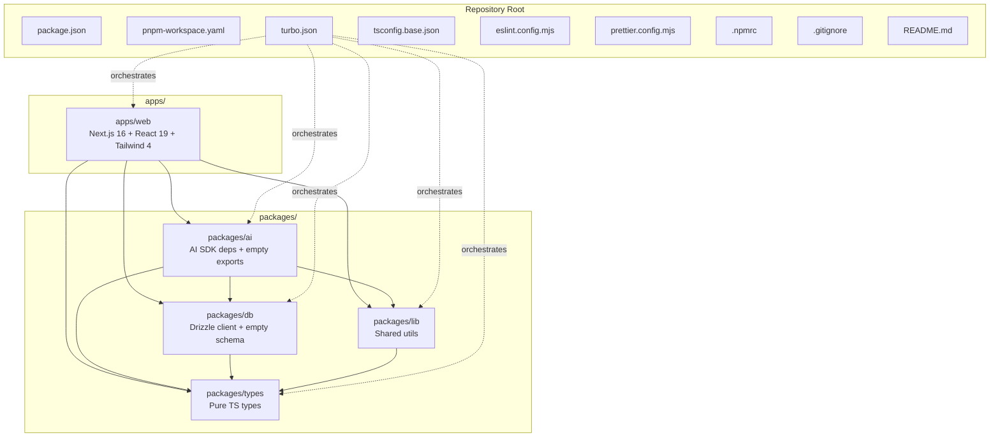
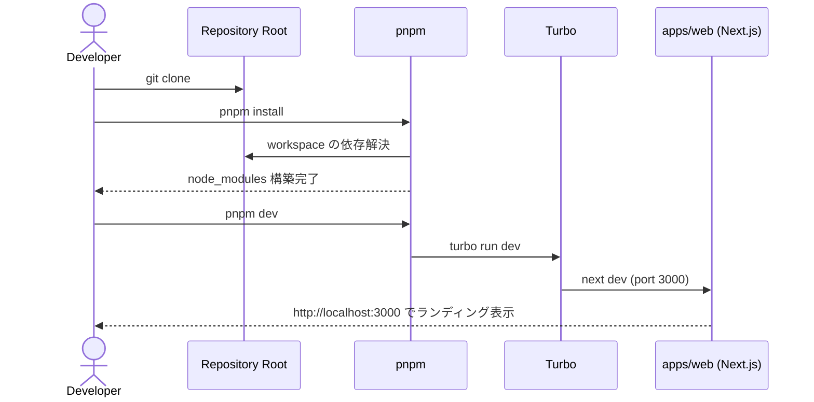
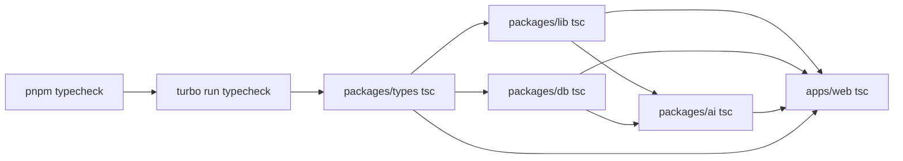

# Design Document: monorepo-foundation

## Overview

**Purpose**: bulr Stage 1 MVP プロトタイプの全実装が乗る最小モノレポ基盤を 0 から構築する。Turborepo + pnpm workspaces + Next.js 16 + Drizzle ORM + 4 つの workspace パッケージ（`@bulr/{db, types, lib, ai}`）を一括で初期化し、`pnpm dev` / `pnpm build` / `pnpm typecheck` / `pnpm lint` がエラーなく通る状態をゴールとする。

**Users**: 後続 5 spec（`multi-env-infrastructure` / `authentication` / `assessment-pattern-seed` / `assessment-engine` / `admin-review-panel`）の実装者がこの基盤の上に機能を積み上げる。本スペックの直接利用者は spec 実装者のみであり、エンドユーザー向け機能は一切提供しない。

**Impact**: greenfield リポジトリ（Initial commit + `docs/` + `.kiro/` のみ）に、ルート設定一式 + `apps/web` + 4 packages を新規追加する。既存ファイル（`docs/` 配下、`.kiro/` 配下）は変更しない。

### Goals

- ルート設定（`package.json` / `pnpm-workspace.yaml` / `turbo.json` / `tsconfig.base.json` / `.gitignore` / `eslint.config.mjs` / `prettier.config.mjs` / `.npmrc`）を整備する
- `apps/web` に Next.js 16 + React 19 + Tailwind CSS 4 + shadcn/ui ベースを初期化し、空のランディングページを表示する
- `packages/{db, types, lib, ai}` の 4 パッケージスケルトンを workspace として参照可能にする
- Drizzle ORM の初期設定（空スキーマ + `drizzle.config.ts` + Drizzle client）を `packages/db` に提供する
- `pnpm install` → `pnpm dev` で apps/web (port 3000) が起動し、`pnpm typecheck` / `pnpm lint` がエラーなく通る

### Non-Goals

- 認証実装（Better Auth、Magic Link、proxy.ts、guards）→ `authentication` spec
- DB アプリケーションテーブル定義 → `assessment-pattern-seed` および `assessment-engine` spec
- LLM ツール、システムプロンプト、評価ロジック → `assessment-engine` spec
- UI コンポーネントの本実装、shadcn/ui 個別コンポーネント追加 → 後続 spec で必要に応じて
- Vercel プロジェクト作成、Neon 接続、Resend 統合、`.env.example` → `multi-env-infrastructure` spec
- CI/CD ワークフロー → `multi-env-infrastructure` spec
- テストフレームワーク（Vitest / Playwright）のセットアップ → 必要になった spec で導入
- `packages/{auth, ui, i18n}` の切り出し → Stage 2

## Boundary Commitments

### This Spec Owns

- ルート設定ファイル一式（`package.json`、`pnpm-workspace.yaml`、`turbo.json`、`tsconfig.base.json`、`.gitignore`、`.npmrc`、`eslint.config.mjs`、`prettier.config.mjs`、`README.md`）
- `apps/web` のスケルトン（`app/layout.tsx`、`app/page.tsx`、`next.config.ts`、`postcss.config.mjs`、`tsconfig.json`、`eslint.config.mjs`、`components.json`、Tailwind 設定、グローバル CSS）
- `packages/{db, types, lib, ai}` の 4 パッケージそれぞれの `package.json`、`tsconfig.json`、`src/index.ts` スケルトン
- `packages/db/drizzle.config.ts` と `packages/db/src/schema/index.ts`（空スキーマバレル）と `packages/db/src/client.ts`（Drizzle client）
- workspace パッケージ参照エイリアス（`@bulr/db` / `@bulr/types` / `@bulr/lib` / `@bulr/ai`）の解決経路
- 開発コマンドのトポロジ（`pnpm dev` / `pnpm build` / `pnpm typecheck` / `pnpm lint` / `pnpm --filter @bulr/db generate` / `pnpm --filter @bulr/db push`）

### Out of Boundary

- DB アプリケーションテーブル定義（`user_profile` / `assessment_session` / `assessment_answer` / `assessment_pattern` / `chat_message`）— `assessment-pattern-seed` および `assessment-engine` spec が `packages/db/src/schema/` に追加する
- LLM ツール実装、システムプロンプト、状態機械、評価ロジック — `assessment-engine` spec が `packages/ai/src/` に追加する
- 認証ヘルパー、Magic Link 実装、Basic 認証、proxy.ts — `authentication` spec が `apps/web/lib/` および `apps/web/proxy.ts` に追加する
- ユーザー向け UI コンポーネント、チャット画面、管理画面 — `assessment-engine` および `admin-review-panel` spec が `apps/web/app/` 配下に追加する
- 環境変数定義、`.env.example`、Vercel 環境変数設定 — `multi-env-infrastructure` spec が整備する
- CI/CD パイプライン、Vercel プロジェクト設定、Neon ブランチ作成、Resend 設定 — `multi-env-infrastructure` spec が担う
- Drizzle migration の実行（`drizzle-kit push` を実 DB に対して実行）— `multi-env-infrastructure` spec が dev/prod 環境を整えた後に実行する

### Allowed Dependencies

- 外部 npm パッケージ: `next@^16`、`react@^19`、`react-dom@^19`、`typescript@^5.4`、`turbo@^2.9`、`eslint@^9`、`typescript-eslint@^8`、`prettier@^3.8`、`tailwindcss@^4`、`@tailwindcss/postcss@^4`、`drizzle-orm@^0.45`、`drizzle-kit@^0.31`、`pg@^8`、`@types/pg@^8`、`ai@^6`、`@ai-sdk/anthropic@^3`、`@ai-sdk/react@^3`、`zod@^4`、`tsx@^4`、`@types/node@^22`、`@types/react@^19`、`@types/react-dom@^19`、`eslint-config-next@^16`、`babel-plugin-react-compiler@^1`
- 内部 workspace 依存方向（厳守）:
  - `apps/web → @bulr/{db, types, lib, ai}`
  - `@bulr/ai → @bulr/{db, types, lib}`
  - `@bulr/db → @bulr/types`
  - `@bulr/lib → @bulr/types`
  - `@bulr/types → なし`
- ホスト環境: Node.js 22 LTS 以上、pnpm 10 以上、macOS / Linux

### Revalidation Triggers

以下が発生した場合、後続 spec は本スペックとの統合を再検証する必要がある:

- workspace エイリアス命名の変更（`@bulr/*` → 別 prefix）
- 依存方向の変更（例: `@bulr/types` が他 package を import するようになる）
- ルートスクリプトの命名・契約変更（`pnpm dev` / `pnpm build` / `pnpm typecheck` / `pnpm lint` の挙動変更）
- Next.js / React / TypeScript / Drizzle / Tailwind のメジャーバージョン変更
- `apps/web` の Root Directory 変更や複数アプリ化（apps/admin 分離は Stage 2）
- `packages/db/drizzle.config.ts` のスキーマパス変更（`./src/schema/index.ts` から移動）
- `tsconfig.base.json` の strict 設定の緩和

## Architecture

### Architecture Pattern & Boundary Map



**Architecture Integration**:

- **Selected pattern**: モノレポ + 単一アプリ + 共通パッケージ群（Turborepo + pnpm workspaces）。`structure.md` で定義された Stage 1 構造をそのまま実体化する
- **Domain/feature boundaries**: `apps/web` がエンドユーザー向け UI / API、`packages/db` が DB スキーマと client の真実の源、`packages/types` が純粋な型定義（他 package に依存しない頂点）、`packages/lib` が汎用ユーティリティ、`packages/ai` が AI 関連ロジックの置き場
- **Existing patterns preserved**: なし（greenfield）
- **New components rationale**: 4 packages はいずれも後続 spec が「ここに追加する」前提のスケルトン。本スペックは「箱」だけ用意し、中身は後続 spec が積む
- **Steering compliance**: `tech.md` の技術選定（Next.js 16、React 19、Drizzle 0.45、Vercel AI SDK 6、TypeScript strict）、`structure.md` の依存方向と命名規則、`security.md` の `no-explicit-any` ルール、をすべて遵守

### Technology Stack

| Layer | Choice / Version | Role in Feature | Notes |
|-------|------------------|-----------------|-------|
| Frontend | Next.js 16 (App Router、Turbopack stable、React Compiler) + React 19 | apps/web のフレームワーク | `tech.md` 準拠、空のランディングページのみ |
| Styling | Tailwind CSS 4 + `@tailwindcss/postcss` 4 + shadcn/ui ベース | apps/web のスタイル | 個別 shadcn コンポーネント追加は本スペックでは行わない |
| Backend / Services | Next.js 16 API Routes（本スペックでは未使用、後続 spec で利用） | 将来の API エンドポイント置き場 | 本スペックでは API は実装しない |
| Data / Storage | Drizzle ORM 0.45.x stable + `drizzle-kit` 0.31.x + `pg` 8.x | packages/db の ORM 基盤、空スキーマ | アプリケーションテーブル定義は後続 spec |
| Type Safety | TypeScript 5.4+（strict、noUncheckedIndexedAccess、isolatedModules） | 全 workspace の型基盤 | `any` は ESLint warn |
| Validation | Zod 4.x（packages/ai の依存に追加するのみ、スケルトン段階では未使用） | 後続 spec の入力検証 | 本スペックでは import チェックのみ |
| AI SDK | Vercel AI SDK 6.x + `@ai-sdk/anthropic` 3.x + `@ai-sdk/react` 3.x | packages/ai の依存追加のみ | 実装は `assessment-engine` spec |
| Tooling | ESLint 9 + typescript-eslint 8 + Prettier 3.8 + Turbo 2.9 + pnpm 10 | コード品質と build orchestration | dishxdish の設定を踏襲 |
| Infrastructure / Runtime | Node.js 22 LTS 以上 + pnpm 10 以上 | ローカル開発前提 | Vercel 設定は別 spec |

> 詳細な比較・代替案検討は `research.md` に格納。本セクションは決定された選定と役割のみを提示する。

## File Structure Plan

### Directory Structure

```
bulr-app-mvp/
├── package.json                       # ルート package.json（pnpm scripts、devDeps）
├── pnpm-workspace.yaml                # workspace 登録（apps/* + packages/*）
├── turbo.json                         # Turbo タスク定義（build/dev/typecheck/lint）
├── tsconfig.base.json                 # 全 package が extends する TS 共通設定
├── .npmrc                             # pnpm 挙動制御
├── .gitignore                         # 共通 ignore
├── eslint.config.mjs                  # ESLint flat config（typescript-eslint）
├── prettier.config.mjs                # Prettier 設定
├── README.md                          # 開発者向けセットアップ案内
│
├── apps/
│   └── web/                           # Next.js 16 アプリ
│       ├── package.json               # apps/web 個別の依存と scripts
│       ├── tsconfig.json              # tsconfig.base.json を extends + Next.js 用設定
│       ├── next.config.ts             # Next.js 設定（React Compiler、transpilePackages）
│       ├── next-env.d.ts              # Next.js 型補完（自動生成、git 管理外）
│       ├── postcss.config.mjs         # Tailwind CSS 4 PostCSS 設定
│       ├── eslint.config.mjs          # ルート config を継承
│       ├── components.json            # shadcn/ui ベース設定（後続 spec が add で利用）
│       └── src/
│           ├── app/
│           │   ├── layout.tsx         # Root layout（HTML/body/フォント）
│           │   ├── page.tsx           # ランディング（bulr ベータの説明）
│           │   └── globals.css        # Tailwind directive + shadcn ベーストークン
│           └── lib/
│               └── utils.ts           # `cn()` ユーティリティ（shadcn 規約、空でも置く）
│
└── packages/
    ├── types/                         # 純粋型（依存先なし）
    │   ├── package.json
    │   ├── tsconfig.json
    │   └── src/
    │       └── index.ts               # スケルトン: `export {};`
    │
    ├── lib/                           # 共通ユーティリティ（types のみに依存）
    │   ├── package.json
    │   ├── tsconfig.json
    │   └── src/
    │       └── index.ts               # スケルトン: `export {};`
    │
    ├── db/                            # Drizzle client + 空スキーマバレル
    │   ├── package.json
    │   ├── tsconfig.json
    │   ├── drizzle.config.ts          # PostgreSQL + ./src/schema/index.ts + snake_case
    │   └── src/
    │       ├── index.ts               # `export { db, type DB } from './client'; export * from './schema';`
    │       ├── client.ts              # `pg.Pool` + `drizzle()` + DATABASE_URL ガード
    │       └── schema/
    │           └── index.ts           # 空バレル（後続 spec がテーブルを追加）
    │
    └── ai/                            # AI SDK 依存追加のみ
        ├── package.json
        ├── tsconfig.json
        └── src/
            └── index.ts               # スケルトン: `export {};`
```

### Modified Files

- `.gitignore` — 既存（initial commit）が無い場合は新規作成。dishxdish ベースに `.next/`、`dist`、`.turbo`、`.vercel`、`*.tsbuildinfo`、`.env*.local`、`.serena/cache/`、`.claude/settings.local.json` を ignore。

> File Structure Plan の各ファイルは「責務 1 つ」の原則を守る。後続 spec が追加するファイルはすべて `packages/db/src/schema/`、`packages/ai/src/`、`apps/web/src/app/(assessment)/`、`apps/web/src/app/admin/`、`apps/web/src/app/api/`、`apps/web/src/lib/` のいずれかに収まる前提。

## System Flows

### 開発者の初期セットアップフロー



### 型チェック / ビルド時の依存解決フロー



> Turbo は各 package の `typecheck` スクリプトを依存トポロジ（`^typecheck`）に従って並列実行する。`types` が頂点、`web` が末端。

## Requirements Traceability

| Requirement | Summary | Components | Interfaces | Flows |
|-------------|---------|------------|------------|-------|
| 1.1 | ルート package.json | RootPackageJson | `pnpm dev/build/typecheck/lint` scripts | 開発者初期セットアップ |
| 1.2 | pnpm-workspace.yaml | WorkspaceConfig | workspace globs | — |
| 1.3 | turbo.json | TurboConfig | build/dev/typecheck/lint タスク | 型チェック / ビルド時依存解決 |
| 1.4 | tsconfig.base.json | TsConfigBase | strict mode 設定 | — |
| 1.5 | pnpm install で依存解決 | RootPackageJson + WorkspaceConfig | — | 開発者初期セットアップ |
| 1.6 | .npmrc | NpmrcConfig | pnpm 挙動制御 | — |
| 2.1 | ルート eslint.config.mjs | EslintRootConfig | typescript-eslint rules | — |
| 2.2 | ルート prettier.config.mjs | PrettierRootConfig | フォーマットルール | — |
| 2.3 | pnpm lint コマンド | TurboConfig + EslintRootConfig | turbo run lint | — |
| 2.4 | ESLint / git ignore | EslintRootConfig + GitignoreConfig | ignore patterns | — |
| 2.5 | no-explicit-any warning | EslintRootConfig | rule 設定 | — |
| 3.1 | apps/web Next.js 16 初期化 | WebApp | next.config.ts、package.json | 開発者初期セットアップ |
| 3.2 | layout.tsx と page.tsx | WebApp（layout/page） | React コンポーネント | — |
| 3.3 | pnpm dev で port 3000 起動 | TurboConfig + WebApp | turbo run dev | 開発者初期セットアップ |
| 3.4 | Tailwind CSS 4 設定 | WebApp（postcss.config + globals.css） | PostCSS plugin | — |
| 3.5 | shadcn/ui ベース設定 | WebApp（components.json + src/lib/utils.ts） | shadcn config | — |
| 3.6 | apps/web tsconfig.json + paths alias | WebApp（tsconfig.json） | `@/*` alias | — |
| 3.7 | pnpm build エラーなし | TurboConfig + WebApp | turbo run build | 型チェック / ビルド時依存解決 |
| 4.1 | 4 packages のスケルトン | TypesPkg + LibPkg + DbPkg + AiPkg | package.json + tsconfig.json + src/index.ts | — |
| 4.2 | @bulr/* 命名 + private | TypesPkg + LibPkg + DbPkg + AiPkg | package.json name フィールド | — |
| 4.3 | 依存方向の強制 | TypesPkg + LibPkg + DbPkg + AiPkg + WebApp | package.json dependencies | — |
| 4.4 | 逆方向依存の防御 | TypesPkg + LibPkg + DbPkg + AiPkg | dependencies に追加しない方針 | — |
| 4.5 | workspace:* プロトコル | RootPackageJson + WebApp + AiPkg + DbPkg + LibPkg | package.json dependencies | — |
| 4.6 | apps/web から @bulr/db import 解決 | WorkspaceConfig + DbPkg + WebApp | workspace alias | — |
| 4.7 | pnpm typecheck エラーなし | TurboConfig + 全 package | turbo run typecheck | 型チェック / ビルド時依存解決 |
| 5.1 | drizzle.config.ts | DbPkg（drizzle.config.ts） | drizzle-kit defineConfig | — |
| 5.2 | 空スキーマバレル | DbPkg（src/schema/index.ts） | barrel export | — |
| 5.3 | Drizzle client export + DB 型 | DbPkg（src/client.ts + src/index.ts） | `db` インスタンス + `DB` 型 | — |
| 5.4 | drizzle-orm 0.45.x 依存 | DbPkg（package.json） | dependencies | — |
| 5.5 | DATABASE_URL 未設定で明示エラー | DbPkg（src/client.ts） | 起動時 throw | — |
| 5.6 | drizzle-kit generate 起動可能 | DbPkg（package.json scripts + drizzle.config.ts） | `pnpm --filter @bulr/db generate` | — |
| 5.7 | アプリテーブル未定義 | DbPkg（src/schema/index.ts） | 空バレル維持 | — |
| 6.1 | packages/ai の AI SDK 依存 | AiPkg（package.json） | dependencies | — |
| 6.2 | packages/ai の最小 export | AiPkg（src/index.ts） | barrel export | — |
| 6.3 | packages/{lib, types} の最小 export | LibPkg + TypesPkg（src/index.ts） | barrel export | — |
| 6.4 | LLM ツール未実装 | AiPkg（src/index.ts） | 空バレル維持 | — |
| 6.5 | packages の typecheck 通過 | 全 package（tsconfig.json） | turbo run typecheck | 型チェック / ビルド時依存解決 |
| 7.1 | pnpm dev | TurboConfig + RootPackageJson | turbo run dev | 開発者初期セットアップ |
| 7.2 | pnpm build | TurboConfig + RootPackageJson | turbo run build | 型チェック / ビルド時依存解決 |
| 7.3 | pnpm typecheck | TurboConfig + RootPackageJson | turbo run typecheck | 型チェック / ビルド時依存解決 |
| 7.4 | pnpm lint | TurboConfig + RootPackageJson | turbo run lint | — |
| 7.5 | drizzle 操作コマンド | DbPkg（package.json scripts） | `pnpm --filter @bulr/db generate/push` | — |
| 7.6 | Turbo cache outputs 設定 | TurboConfig | outputs 配列 | — |
| 8.1 | kebab-case ファイル名 | 全コンポーネント | ファイル命名規則 | — |
| 8.2 | apps/web の拡張可能ディレクトリ構成 | WebApp | src/app/ 構造 | — |
| 8.3 | packages/db/src/schema/ ディレクトリ | DbPkg | schema/ ディレクトリ | — |
| 8.4 | auth/ui/i18n を作らない | （Out of Boundary） | — | — |
| 8.5 | 既存 docs/ scripts/ .github/ を阻害しない | RootPackageJson + GitignoreConfig | — | — |
| 9.1 | README.md | ReadmeDoc | Markdown | — |
| 9.2 | steering 内容を README に重複させない | ReadmeDoc | ポインタのみ | — |
| 9.3 | 既存 docs/ と .kiro/ を変更しない | （境界遵守） | — | — |

## Components and Interfaces

### Component Summary

| Component | Domain/Layer | Intent | Req Coverage | Key Dependencies (P0/P1) | Contracts |
|-----------|--------------|--------|--------------|--------------------------|-----------|
| RootPackageJson | Root config | pnpm/Node 制約とトップレベル scripts | 1.1, 1.5, 7.1, 7.2, 7.3, 7.4 | pnpm@10 (P0)、Turbo (P0) | Service |
| WorkspaceConfig | Root config | workspace パッケージ glob 登録 | 1.2, 1.5, 4.5, 4.6 | pnpm@10 (P0) | Service |
| TurboConfig | Build orchestration | build/dev/typecheck/lint タスク定義 | 1.3, 2.3, 3.3, 3.7, 4.7, 6.5, 7.1, 7.2, 7.3, 7.4, 7.6 | Turbo@2.9 (P0)、各 package の scripts (P0) | Service |
| TsConfigBase | Type system | strict mode + module 解決の共通設定 | 1.4 | TypeScript@5.4 (P0) | Service |
| NpmrcConfig | Root config | pnpm 挙動制御 | 1.6 | pnpm@10 (P0) | Service |
| EslintRootConfig | Code quality | typescript-eslint flat config | 2.1, 2.3, 2.4, 2.5 | eslint@9 (P0)、typescript-eslint@8 (P0) | Service |
| PrettierRootConfig | Code quality | フォーマットルール | 2.2 | prettier@3.8 (P0) | Service |
| GitignoreConfig | Repo hygiene | ビルド成果物・シークレット除外 | 2.4, 8.5 | git (P0) | — |
| ReadmeDoc | Documentation | 開発者オンボーディング | 9.1, 9.2, 9.3 | — | — |
| WebApp | Application | Next.js 16 アプリスケルトン | 3.1, 3.2, 3.3, 3.4, 3.5, 3.6, 3.7, 4.6, 8.2 | Next.js@16 (P0)、React@19 (P0)、Tailwind@4 (P0)、@bulr/db (P1)、@bulr/ai (P1) | Service |
| TypesPkg | Domain types | 純粋型の頂点 | 4.1, 4.2, 4.3, 4.4, 4.7, 6.3, 6.5 | TypeScript@5.4 (P0) | Service |
| LibPkg | Shared utils | 共通ユーティリティ置き場 | 4.1, 4.2, 4.3, 4.4, 4.7, 6.3, 6.5 | @bulr/types (P0) | Service |
| DbPkg | Data access | Drizzle client + 空スキーマ | 4.1, 4.2, 4.3, 4.4, 4.6, 4.7, 5.1, 5.2, 5.3, 5.4, 5.5, 5.6, 5.7, 7.5, 8.3 | drizzle-orm@0.45 (P0)、drizzle-kit@0.31 (P0)、pg@8 (P0)、@bulr/types (P1) | Service |
| AiPkg | AI integration | Vercel AI SDK 依存とスケルトン | 4.1, 4.2, 4.3, 4.4, 4.7, 6.1, 6.2, 6.4, 6.5 | ai@6 (P0)、@ai-sdk/anthropic@3 (P0)、zod@4 (P0)、@bulr/db (P1)、@bulr/types (P1)、@bulr/lib (P1) | Service |

### Root Configuration Components

#### RootPackageJson

| Field | Detail |
|-------|--------|
| Intent | リポジトリルートの pnpm/Node 制約と Turbo 経由のトップレベル scripts を提供 |
| Requirements | 1.1, 1.5, 7.1, 7.2, 7.3, 7.4 |

**Responsibilities & Constraints**
- `private: true`、`packageManager: "pnpm@10.x"`、`engines.node >= 22`、`engines.pnpm >= 10` を宣言
- `scripts` に `dev` / `build` / `typecheck` / `lint` を `turbo run <task>` の形で提供
- `devDependencies` に `turbo`、`typescript`、`eslint`、`typescript-eslint`、`prettier`、`@typescript-eslint/eslint-plugin`、`@typescript-eslint/parser` を持つ
- アプリ依存（`next`、`react`、`drizzle-orm` 等）はルートに置かず、各 workspace に置く

**Dependencies**
- Outbound: TurboConfig — `turbo run` 経由のタスク委譲（P0）
- External: pnpm 10 — workspace 解決と install（P0）

**Contracts**: Service [x] / API [ ] / Event [ ] / Batch [ ] / State [ ]

##### Service Interface（pnpm scripts）
```typescript
type RootScripts = {
  dev: 'turbo run dev';
  build: 'turbo run build';
  typecheck: 'turbo run typecheck';
  lint: 'turbo run lint';
};
```
- Preconditions: `pnpm install` 済み
- Postconditions: 各コマンドが Turbo タスクを起動する
- Invariants: ルートにアプリ依存を持ち込まない

**Implementation Notes**
- Integration: dishxdish の `package.json` を参考に、Stage 1 では Vitest / Playwright 関連 scripts は含めない（テストフレームワーク導入は別 spec）
- Validation: `pnpm install --frozen-lockfile` がローカルで成功する
- Risks: pnpm バージョン差異 → `packageManager` フィールドで pin することで Corepack が自動解決

#### WorkspaceConfig

| Field | Detail |
|-------|--------|
| Intent | pnpm に workspace ディレクトリを認識させる |
| Requirements | 1.2, 1.5, 4.5, 4.6 |

**Responsibilities & Constraints**
- `apps/*` と `packages/*` の glob を登録（dishxdish の `tests/*` は本スペックでは除外）
- workspace 内パッケージ参照は `workspace:*` プロトコルで解決される

**Dependencies**
- External: pnpm 10 — workspace 機能（P0）

**Contracts**: Service [x]

##### Service Interface
```yaml
packages:
  - "apps/*"
  - "packages/*"
```

**Implementation Notes**
- Integration: 本スペックでは `tests/*` を含めない。後続 spec が tests workspace を追加する際に拡張する
- Risks: `tests/*` を後から追加すると pnpm-lock の再生成が必要 → 本スペックの段階で含めるか別 spec で含めるかは `multi-env-infrastructure` の判断に委ねる（ここでは含めない）

#### TurboConfig

| Field | Detail |
|-------|--------|
| Intent | apps と packages の build/dev/typecheck/lint を依存トポロジで実行する |
| Requirements | 1.3, 2.3, 3.3, 3.7, 4.7, 6.5, 7.1, 7.2, 7.3, 7.4, 7.6 |

**Responsibilities & Constraints**
- `build` task: `dependsOn: ["^build"]`、`outputs: [".next/**", "!.next/cache/**", "dist/**"]`
- `dev` task: `cache: false`、`persistent: true`
- `typecheck` task: `dependsOn: ["^typecheck"]`
- `lint` task: `dependsOn: ["^lint"]`
- `globalEnv` は本スペックでは空（環境変数導入は `multi-env-infrastructure`）

**Dependencies**
- Outbound: 各 package の `package.json` scripts（P0）
- External: Turbo 2.9（P0）

**Contracts**: Service [x]

##### Service Interface
```jsonc
{
  "$schema": "https://turbo.build/schema.json",
  "tasks": {
    "build": { "dependsOn": ["^build"], "outputs": [".next/**", "!.next/cache/**", "dist/**"] },
    "dev": { "cache": false, "persistent": true },
    "typecheck": { "dependsOn": ["^typecheck"] },
    "lint": { "dependsOn": ["^lint"] }
  }
}
```

**Implementation Notes**
- Integration: 各 package の `package.json` には対応する scripts (`typecheck`、`lint`、`build`、`dev`) が必要。スケルトンでも `typecheck` と `lint` は最低限定義する
- Validation: `pnpm typecheck` 実行時、Turbo が `types` → `lib`/`db` → `ai` → `web` のトポロジで並列実行する
- Risks: package 側に script が無いと Turbo が warning を出す → 全 package に最低限の `typecheck` script を置く

#### TsConfigBase

| Field | Detail |
|-------|--------|
| Intent | 全 package が extends する TypeScript 共通設定 |
| Requirements | 1.4 |

**Responsibilities & Constraints**
- `strict: true`、`noUncheckedIndexedAccess: true`、`module: "ESNext"`、`moduleResolution: "bundler"`、`target: "ES2022"`、`isolatedModules: true`、`skipLibCheck: true`、`esModuleInterop: true`、`allowSyntheticDefaultImports: true`、`resolveJsonModule: true`、`noEmit: true`、`incremental: true`
- `exclude: ["node_modules"]`

**Contracts**: Service [x]

**Implementation Notes**
- Integration: dishxdish の `tsconfig.base.json` をそのまま採用
- Validation: 各 package の `tsconfig.json` が `extends: "../../tsconfig.base.json"` で読み込み可能
- Risks: `noUncheckedIndexedAccess` は厳しい設定だが、後続 spec の DB クエリ結果が `T | undefined` になり安全側に倒れる

#### NpmrcConfig

| Field | Detail |
|-------|--------|
| Intent | pnpm の install 挙動を bulr の monorepo に合わせる |
| Requirements | 1.6 |

**Responsibilities & Constraints**
- `auto-install-peers=true`（peer 依存の自動インストール）
- `strict-peer-dependencies=false`（peer 不一致を warning に降格）
- `shamefully-hoist=false`（hoist の暗黙的副作用を抑制）

**Contracts**: Service [x]

#### EslintRootConfig

| Field | Detail |
|-------|--------|
| Intent | typescript-eslint flat config + bulr 固有ルール |
| Requirements | 2.1, 2.3, 2.4, 2.5 |

**Responsibilities & Constraints**
- `tseslint.configs.recommended` を継承
- `@typescript-eslint/no-unused-vars`: `error`（`_` prefix で除外可能）
- `@typescript-eslint/no-explicit-any`: `warn`（`security.md` の `no any` 方針を warning で運用）
- `ignores`: `**/node_modules/**`、`**/.next/**`、`**/dist/**`、`**/.turbo/**`、`**/coverage/**`、`**/.vercel/**`

**Contracts**: Service [x]

**Implementation Notes**
- Integration: dishxdish の `eslint.config.mjs` をそのまま採用。`apps/web/eslint.config.mjs` がこれを spread import する
- Validation: `pnpm lint` で 0 件エラーを目指す（warning は許容、ただし Stage 1 は `any` 0 件を目標）
- Risks: `eslint-config-next` を `apps/web` 側で別途追加する必要 → `apps/web/package.json` で対応

#### PrettierRootConfig

| Field | Detail |
|-------|--------|
| Intent | コードフォーマットルールの統一 |
| Requirements | 2.2 |

**Responsibilities & Constraints**
- `semi: true`、`singleQuote: true`、`trailingComma: 'all'`、`printWidth: 100`、`tabWidth: 2`、`useTabs: false`、`bracketSpacing: true`、`bracketSameLine: false`、`arrowParens: 'always'`、`endOfLine: 'lf'`
- bulr では `singleQuote: true`（dishxdish は `false` だが、bulr は steering の TypeScript コード例が `'@bulr/db'` のようにシングルクォートを使う）

**Contracts**: Service [x]

**Implementation Notes**
- Integration: ESLint との衝突は当面なし（formatting 系ルールは prettier 側）
- Risks: dishxdish と挙動が異なるため、コピペ時にフォーマットが揺れる → README に明記

#### GitignoreConfig

| Field | Detail |
|-------|--------|
| Intent | ビルド成果物・シークレット・ツールキャッシュを git 管理から除外 |
| Requirements | 2.4, 8.5 |

**Responsibilities & Constraints**
- `node_modules`、`.next/`、`out/`、`build`、`dist`、`.turbo`、`.vercel`、`*.tsbuildinfo`、`next-env.d.ts`、`.env.local`、`.env*.local`、`.DS_Store`、`coverage`、`.serena/cache/`、`.serena/project.local.yml`、`.claude/settings.local.json` を ignore

**Contracts**: —

#### ReadmeDoc

| Field | Detail |
|-------|--------|
| Intent | 開発者向けセットアップ手順とコマンド一覧 |
| Requirements | 9.1, 9.2, 9.3 |

**Responsibilities & Constraints**
- プロジェクト概要（bulr Stage 1 MVP プロトタイプ）
- 前提（Node.js 22 LTS+、pnpm 10+）
- 初期セットアップ（`pnpm install`）
- 主要コマンド（`pnpm dev` / `pnpm build` / `pnpm typecheck` / `pnpm lint`）
- steering ドキュメント (`.kiro/steering/`) と spec ディレクトリ (`.kiro/specs/`) の所在のみ示し、内容は重複させない

**Contracts**: —

### Application Components

#### WebApp

| Field | Detail |
|-------|--------|
| Intent | Next.js 16 + React 19 + Tailwind 4 + shadcn/ui ベースの最小アプリスケルトン |
| Requirements | 3.1, 3.2, 3.3, 3.4, 3.5, 3.6, 3.7, 4.6, 8.2 |

**Responsibilities & Constraints**
- `next@^16`、`react@^19`、`react-dom@^19`、`tailwindcss@^4`、`@tailwindcss/postcss@^4`、`babel-plugin-react-compiler@^1`、`eslint-config-next@^16` を依存に持つ
- workspace 依存として `@bulr/db`、`@bulr/types`、`@bulr/lib`、`@bulr/ai` を `workspace:*` で参照
- `next.config.ts` で `reactCompiler: true` と `transpilePackages: ['@bulr/db', '@bulr/types', '@bulr/lib', '@bulr/ai']` を設定
- `app/layout.tsx` は `<html>`/`<body>` のみの最小構成、`app/page.tsx` は bulr ベータの説明テキストのみ
- `app/globals.css` で Tailwind directives と shadcn 用の CSS variables を提供
- `components.json` を shadcn/ui の規約通り配置（後続 spec が `add` で利用）
- `src/lib/utils.ts` に `cn()` 関数（shadcn 規約）を最小実装
- ポートは 3000（dishxdish の 3010 ではなく、`tech.md` 準拠で 3000）
- API Routes は本スペックでは未実装（後続 spec で `app/api/` を追加）

**Dependencies**
- Inbound: 開発者ブラウザ（外部）
- Outbound: @bulr/db (P1)、@bulr/types (P1)、@bulr/lib (P1)、@bulr/ai (P1)
- External: Next.js 16 (P0)、React 19 (P0)、Tailwind CSS 4 (P0)

**Contracts**: Service [x] / API [ ] / Event [ ] / Batch [ ] / State [ ]

##### Service Interface（apps/web scripts）
```typescript
type WebScripts = {
  dev: 'next dev --port 3000';
  build: 'next build';
  start: 'next start --port 3000';
  typecheck: 'tsc --noEmit';
  lint: 'next lint';  // または eslint .
};
```

**Implementation Notes**
- Integration: dishxdish の `apps/web` 構成を踏襲しつつ、`next-intl` / `@dishxdish/auth` / `@dishxdish/ui` / `@dishxdish/i18n` の依存と `proxy.ts` を含めない（Stage 1 で不要、後続 spec で追加）
- Validation: `pnpm dev` で http://localhost:3000 にアクセスしてランディングが表示される
- Risks:
  - Next.js 16 + React 19 + React Compiler の組み合わせは比較的新しいため、`babel-plugin-react-compiler` のバージョン不整合に注意 → dishxdish と同じ `^1.0.0` を採用
  - Tailwind CSS 4 は v3 と設定方法が異なる（`@tailwindcss/postcss` を使う）→ dishxdish 構成を踏襲

### Workspace Package Components

#### TypesPkg

| Field | Detail |
|-------|--------|
| Intent | bulr 共通型定義の頂点（依存先なし） |
| Requirements | 4.1, 4.2, 4.3, 4.4, 4.7, 6.3, 6.5 |

**Responsibilities & Constraints**
- `@bulr/types`、`private: true`、`exports.': './src/index.ts'`
- 他の workspace package を一切 import しない
- 本スペックでは `src/index.ts` は `export {};` のみ（後続 spec が型を追加）

**Dependencies**
- Outbound: なし（頂点）
- External: TypeScript@5.4 (P0)

**Contracts**: Service [x]

##### Service Interface
```typescript
// packages/types/src/index.ts
export {};
```

**Implementation Notes**
- Integration: 後続 spec（特に `assessment-engine`）が共通型をここに置く
- Validation: `pnpm --filter @bulr/types typecheck` がエラーなく完了
- Risks: 型のみのパッケージなので runtime コードを混入させない（ESLint で検知が難しいため、PR レビューで担保）

#### LibPkg

| Field | Detail |
|-------|--------|
| Intent | bulr 共通ユーティリティ（types のみに依存） |
| Requirements | 4.1, 4.2, 4.3, 4.4, 4.7, 6.3, 6.5 |

**Responsibilities & Constraints**
- `@bulr/lib`、`private: true`
- 依存可能なのは `@bulr/types` のみ
- 本スペックでは `src/index.ts` は `export {};` のみ

**Dependencies**
- Outbound: @bulr/types (P0)（ただしスケルトン段階では import 無し）
- External: TypeScript@5.4 (P0)

**Contracts**: Service [x]

#### DbPkg

| Field | Detail |
|-------|--------|
| Intent | Drizzle ORM client と空スキーマバレル、drizzle-kit 設定 |
| Requirements | 4.1, 4.2, 4.3, 4.4, 4.6, 4.7, 5.1, 5.2, 5.3, 5.4, 5.5, 5.6, 5.7, 7.5, 8.3 |

**Responsibilities & Constraints**
- `@bulr/db`、`private: true`
- 依存: `drizzle-orm@^0.45`、`drizzle-kit@^0.31`、`pg@^8`、`@types/pg@^8`、`tsx@^4`、`@bulr/types` (workspace:*)
- `src/client.ts`: `pg.Pool` で `DATABASE_URL` を読み、`drizzle()` でクライアントを生成。未設定なら起動時 throw
- `src/schema/index.ts`: 空バレル（`export {};`）。後続 spec がここにテーブル定義をエクスポート
- `src/index.ts`: `export { db, type DB } from './client'; export * from './schema';`
- `drizzle.config.ts`: `dialect: 'postgresql'`、`schema: './src/schema/index.ts'`、`out: './drizzle'`、`casing: 'snake_case'`、`dbCredentials.url` は `DATABASE_URL` から
- scripts: `typecheck`、`generate`（`drizzle-kit generate`）、`push`（`drizzle-kit push`）、`migrate`（`drizzle-kit migrate`）

**Dependencies**
- Outbound: @bulr/types (P1)（スケルトン段階では import 無し）
- External: drizzle-orm@0.45 (P0)、drizzle-kit@0.31 (P0)、pg@8 (P0)

**Contracts**: Service [x]

##### Service Interface
```typescript
// packages/db/src/client.ts
import { drizzle } from 'drizzle-orm/node-postgres';
import { Pool } from 'pg';
import * as schema from './schema';

if (!process.env.DATABASE_URL) {
  throw new Error('DATABASE_URL is required');
}

export const pool = new Pool({ connectionString: process.env.DATABASE_URL });
export const db = drizzle(pool, { schema, casing: 'snake_case' });
export type DB = typeof db;
```

##### Batch / Job Contract（drizzle-kit）
- Trigger: `pnpm --filter @bulr/db generate`（マイグレーションファイル生成）、`push`（dev DB に反映）、`migrate`（履歴管理付き反映）
- Input / validation: `./src/schema/index.ts` の export
- Output / destination: `./drizzle/` ディレクトリにマイグレーション SQL
- Idempotency & recovery: drizzle-kit が差分検出して冪等に動作

**Implementation Notes**
- Integration: dishxdish の `packages/db` 構成を踏襲（`drizzle.config.ts` の `.env.local` 自動読込ロジックも含む）。ただし `seed` script は本スペックでは含めない（`assessment-pattern-seed` spec が追加）
- Validation:
  - `pnpm --filter @bulr/db typecheck` がエラーなく完了
  - 空スキーマでも `pnpm --filter @bulr/db generate` がエラーなく実行できる（成果物は最小）
  - `import { db } from '@bulr/db'` を実行する側で `DATABASE_URL` 未設定なら `Error: DATABASE_URL is required` がスローされる
- Risks:
  - Stage 1 では Neon serverless driver ではなく `pg` (`node-postgres`) を採用（`multi-env-infrastructure` spec で Neon 接続時に再評価する余地）。dishxdish と同じ選択
  - `drizzle.config.ts` で `.env.local` をルートから自動読込するロジックは dishxdish 由来。後続 spec（`multi-env-infrastructure`）が `.env.local` を整える前提

#### AiPkg

| Field | Detail |
|-------|--------|
| Intent | Vercel AI SDK 6 と Anthropic SDK の依存を登録、後続 spec の Tool 実装受け皿 |
| Requirements | 4.1, 4.2, 4.3, 4.4, 4.7, 6.1, 6.2, 6.4, 6.5 |

**Responsibilities & Constraints**
- `@bulr/ai`、`private: true`
- 依存: `ai@^6`、`@ai-sdk/anthropic@^3`、`@ai-sdk/react@^3`、`zod@^4`、`drizzle-orm@^0.45`、`@bulr/db` (workspace:*)、`@bulr/types` (workspace:*)、`@bulr/lib` (workspace:*)
- 本スペックでは `src/index.ts` は `export {};` のみ
- LLM tools、システムプロンプト、評価ロジック、stream context は本スペックでは実装しない（`assessment-engine` spec が追加）

**Dependencies**
- Outbound: @bulr/db (P1)、@bulr/types (P1)、@bulr/lib (P1)（スケルトン段階では import 無し）
- External: ai@6 (P0)、@ai-sdk/anthropic@3 (P0)、zod@4 (P0)

**Contracts**: Service [x]

**Implementation Notes**
- Integration: dishxdish の `packages/ai` の依存リストを踏襲しつつ、`@ai-sdk/google` と `@dishxdish/auth` workspace 依存は除外（bulr Stage 1 では Anthropic 単一、auth は apps/web 直書き）
- Validation: `pnpm --filter @bulr/ai typecheck` がエラーなく完了
- Risks: 依存だけ先に入れて未使用のままだと ESLint の no-unused-vars が誤検知する可能性 → スケルトンの `export {};` のみなので問題なし

## Data Models

本スペックでは「Drizzle 設定」のみ提供し、アプリケーションテーブル定義は行わない。データモデルの実体定義は後続 spec が担う。

### Logical Data Model（Drizzle 設定段階）

- **Schema location**: `packages/db/src/schema/index.ts`（空バレル）
- **Naming convention**: テーブル名・カラム名は snake_case（`drizzle.config.ts` の `casing: 'snake_case'`）
- **Migration output**: `packages/db/drizzle/` ディレクトリ
- **Connection**: `DATABASE_URL`（未設定なら起動時 throw）

### Out of scope（後続 spec で定義）

- `user`、`session`、`account`、`verification`（Better Auth 管理）→ `authentication` spec
- `user_profile`（受験プロファイル）→ `authentication` spec
- `assessment_pattern`（57 パターンマスタ）→ `assessment-pattern-seed` spec
- `assessment_session`、`assessment_answer`、`chat_message` → `assessment-engine` spec

## Error Handling

### Error Strategy

本スペックは設定とスケルトンが中心のため、ランタイムエラーは限定的:

- **`DATABASE_URL` 未設定エラー**: `packages/db/src/client.ts` が import されたタイミングで `throw new Error('DATABASE_URL is required')`。早期失敗で原因特定を容易にする（Fail Fast）
- **TypeScript 型エラー**: `pnpm typecheck` で検出。CI 化は `multi-env-infrastructure` spec
- **ESLint ルール違反**: `pnpm lint` で検出
- **依存解決エラー**: pnpm が unmet peer dependency を検出。`.npmrc` の `auto-install-peers=true` で軽減

### Error Categories and Responses

- **設定不備（5xx 相当）**: `DATABASE_URL` 未設定 → 起動時 throw、stack trace で `packages/db/src/client.ts` を指す
- **型不一致（ビルド時）**: TS エラーで build/typecheck が落ちる
- **ファイル欠落（ビルド時）**: 例えば `next.config.ts` が無いと `next dev` が失敗 → `pnpm dev` が即時 exit

### Monitoring

本スペックではモニタリングは導入しない（`multi-env-infrastructure` 以降で Vercel ログ + 手動確認）。

## Testing Strategy

本スペックは設定とスケルトンが中心のため、テストフレームワーク（Vitest / Playwright）の導入は行わない。テストフレームワーク導入は必要になった spec で行う方針（`tasks.md` で明示）。

### Default sections

- **Unit Tests**: 本スペックでは導入しない
- **Integration Tests**: 本スペックでは導入しない
- **E2E/UI Tests**: 本スペックでは導入しない
- **Manual Smoke Tests**（本スペックの完了確認）:
  1. リポジトリルートで `pnpm install` が正常終了する（exit code 0）
  2. リポジトリルートで `pnpm typecheck` が全 workspace でエラーなく完了する
  3. リポジトリルートで `pnpm lint` が全 workspace でエラーなく完了する
  4. リポジトリルートで `pnpm build` が全 workspace でエラーなく完了する
  5. リポジトリルートで `pnpm dev` を実行し、ブラウザで http://localhost:3000 にアクセスすると bulr ベータ説明のランディングページが表示される
  6. `pnpm --filter @bulr/db generate` がエラーなく完了する（空スキーマのため成果物は最小）
  7. `apps/web/src/app/page.tsx` で `import { db } from '@bulr/db'` の type resolution が成立する（実 import は本スペックでは行わない）

> 上記の Manual Smoke Tests を `tasks.md` の「Validation」フェーズで実施可能なタスクとして配置する。

## Security Considerations

`security.md` の Stage 1 必須項目のうち、本スペックで担う部分は限定的:

- **シークレット管理**: `.gitignore` に `.env.local`、`.env*.local` を含めることで、後続 spec が環境変数を導入する際にコミット事故を防ぐ
- **`no any` ルール**: ESLint で warn 設定。`security.md` の「TypeScript strict mode、no any」を ESLint レベルで担保
- **strict mode**: `tsconfig.base.json` で `strict: true` + `noUncheckedIndexedAccess: true` を強制
- **依存性脆弱性チェック**: 本スペックでは未導入。`multi-env-infrastructure` spec が CI に `pnpm audit --audit-level=moderate` を組み込む

本スペックでは認証 / 入力検証 / SQL injection 対策 / LLM 防御は範囲外（後続 spec で対応）。

## Performance & Scalability

本スペックは性能要求対象外（設定とスケルトンのみ）。Turbo の `outputs` cache 設定により、ローカル開発の再ビルド時間を抑える程度。

## Migration Strategy

greenfield のため migration なし。既存 `docs/` および `.kiro/` ディレクトリは一切変更しない。

## Supporting References

- 参照プロジェクト: `/Users/takaaki.tanno/Documents/workspace/github/dishxdish-app-mvp/`（同一スタック稼働中の構成例）
- steering: `.kiro/steering/tech.md`、`.kiro/steering/structure.md`、`.kiro/steering/security.md`
- brief: `.kiro/specs/monorepo-foundation/brief.md`
