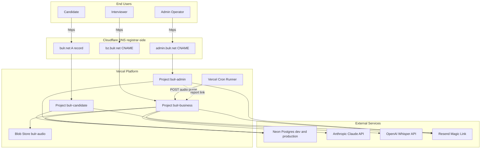
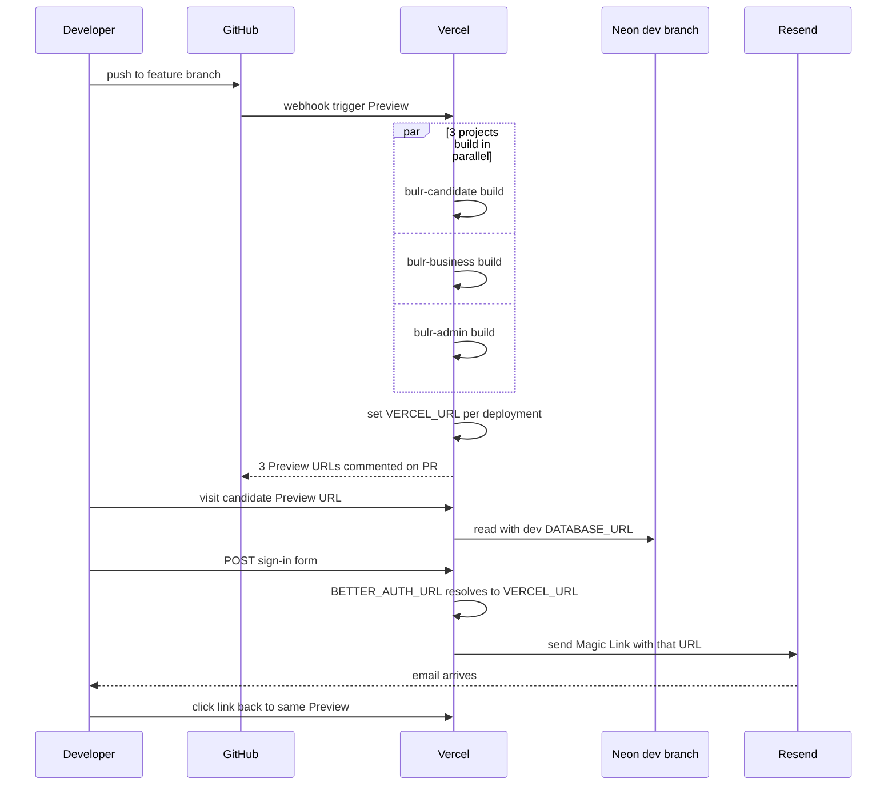
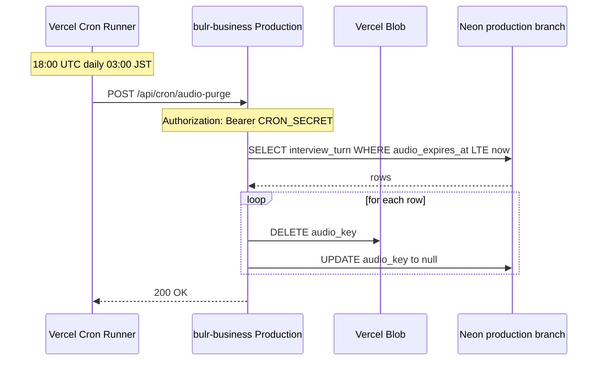
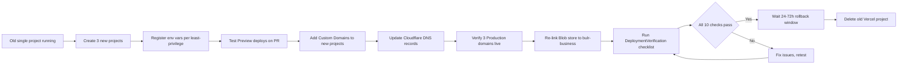

# Technical Design — multi-app-deployment

## Overview

本 spec は Wave 1 仕上げとして、`monorepo-app-split` で 3 アプリ化された bulr-app-mvp（`apps/candidate` / `apps/business` / `apps/admin`）を Vercel の 3 独立プロジェクトとして本番デプロイ可能な状態にする。

**Purpose**: 候補者・面接官・運営の 3 ユーザー層に対し、ドメイン分離（`bulr.net` / `bz.bulr.net` / `admin.bulr.net`）・最小権限の環境変数配分・PR ごとの独立 Preview デプロイを提供する。

**Users**: 運用担当者（インフラ設定）／開発者（PR ベースでの動作確認）／エンドユーザー（各ドメインで該当アプリにアクセス）が利用する。

**Impact**: 既存の単一 Vercel プロジェクト（`apps/web` 時代）を廃止し、3 プロジェクト構成に置換する。コード差分は最小（Better Auth の baseURL に Preview フォールバックを 1 行追加するのみ）。残りはすべて Vercel ダッシュボード設定・Cloudflare DNS 設定・ドキュメント更新で完結する。

### Goals

- Vercel に 3 プロジェクト（candidate / business / admin）を新規作成し、旧プロジェクトを廃止する
- `bulr.net` apex を candidate に、`bz.bulr.net` を business に、`admin.bulr.net` を admin に Custom Domain として割り当てる
- 環境変数を least-privilege で配分する（共有変数は 3 プロジェクト共通、アプリ固有変数は該当プロジェクトのみ）
- PR ごとに 3 アプリが独立 Preview デプロイされ、Better Auth Magic Link が正しい Preview URL に飛ぶ
- business プロジェクトでのみ `audio-purge` Cron が登録され、candidate / admin では登録されない
- Production デプロイ後、3 ドメインでサインインフローと cross-app リンクが正常動作する

### Non-Goals

- Magic Link メールテンプレのアプリ別分離（Wave 2 `candidate-auth-onboarding`）
- 候補者・企業・運営の業務機能追加（Wave 2〜4 各 spec）
- DB スキーマ変更・テストフレームワーク導入・新 packages 追加
- 監視統合（Sentry / PostHog / Helicone）、CSP / HSTS 等のセキュリティヘッダー改修
- Vercel 以外のホスティング検討・マルチリージョン化・マルチテナント分離
- Vercel API による自動セットアップ（dashboard 手動操作と運用手順書化が範囲）

## Boundary Commitments

### This Spec Owns

- Vercel に新規作成する 3 プロジェクト（candidate / business / admin）の Build / Install / Output / Root Directory 設定
- 旧 Vercel プロジェクトの廃止手順（環境変数 export → 新プロジェクトへ移植 → Custom Domain 移管 → Blob ストア re-link → プロジェクト削除）
- 3 つの本番ドメインの割当: `bulr.net`（apex）/ `bz.bulr.net` / `admin.bulr.net`
- Cloudflare（レジストラ）の DNS レコード設定（A / CNAME / 必要に応じ TXT）と proxy 設定（gray cloud / SSL Full strict）
- 3 プロジェクトの環境変数登録（Production / Preview）と least-privilege 配分ルール
- `packages/auth/src/server.ts` の baseURL に Preview 動的フォールバック追加（1 行）
- `docs/setup/vercel.md` の全面書き換え（3 アプリ + Cloudflare DNS + 旧プロジェクト廃止手順）
- Production デプロイ後の動作検証 checklist（10 項目）

### Out of Boundary

- Magic Link メールテンプレートのコピー（branding は Wave 2 で対応）
- `packages/auth` の factory 化（Wave 2 `candidate-auth-onboarding` の追加スコープ）
- 各アプリの業務機能・新 API・新ページ
- DB スキーマ変更、Drizzle migration 追加
- Cron Job 本体ロジック変更（`apps/business/app/api/cron/audio-purge/route.ts` の中身は触らない）
- セキュリティヘッダー変更、CSP 更新（既存 `next.config.ts` 設定を継承）
- CI/CD パイプライン拡張（`.github/workflows/ci.yml` の build 追加は別 spec）
- Cross-app URL helper の packages/lib への切り出し（Wave 2 検討事項）
- bulr.net レジストラ移管（Cloudflare 継続利用、移管は対象外）

### Allowed Dependencies

- 既存 `apps/business/vercel.json`（Cron 定義、無変更で再利用）
- 既存 `packages/auth/src/server.ts`（Better Auth インスタンス、baseURL 行のみ修正）
- 既存 `apps/admin/app/_components/report-link.tsx`（`BUSINESS_BASE_URL` env 読み込み、無変更）
- 既存 `.env.example`（環境変数リスト、Production 登録の reference として参照）
- Vercel 公式機能: Custom Domain / Environment Variables / Cron Jobs / Preview Deployments / Blob Storage / System Env (`VERCEL_URL` / `VERCEL_ENV`)
- Cloudflare DNS（既存契約、移管不要）
- Neon Postgres dev / production branch（既存契約、Preview = dev、Production = production の運用継続）
- Resend（既存契約、本番 Magic Link 配信）

### Revalidation Triggers

以下の変更が発生した場合、関連する spec / コードを再検証する:

- **`packages/auth` の factory 化** （Wave 2 `candidate-auth-onboarding`）: baseURL の Preview フォールバック行が factory 引数経由に変わる可能性あり。本 spec で追加した 1 行の扱いを再設計する
- **Vercel プロジェクト命名規約変更**: 本 spec が想定する `bulr-candidate` / `bulr-business` / `bulr-admin` 系の命名を変更する場合、`docs/setup/vercel.md` と DNS レコードの参照を更新
- **bulr.net ドメイン変更 / レジストラ移管**: DNS 手順の全面書き直しが必要
- **新アプリ追加（4 つ目以降）**: 本 spec の「3 プロジェクト」前提を拡張し、命名規約・env 配分ルールの一般化が必要
- **Cloudflare → 他 DNS への移行**: DNS 手順の差し替え + proxy 設定の再評価
- **Vercel Blob ストアの再構成**（複数ストア化など）: 本 spec の「1 store / business のみ参照」前提を見直し

## Architecture

### Existing Architecture Analysis

`monorepo-app-split` が確立した構造をそのまま受ける（変更なし）:

- 3 アプリは `apps/{candidate,business,admin}/` 配下、それぞれ独立 `package.json` / `next.config.ts` / `tsconfig.json` を持つ
- `packages/auth` が 3 アプリで共有される Better Auth インスタンスを提供（subpath exports `/server` / `/client`）
- `apps/business/vercel.json` が Cron 定義を持つ（path: `/api/cron/audio-purge`、schedule: `0 18 * * *`）
- ローカル dev は port 3020 / 3021 / 3022 で動作（Vercel では PORT 環境変数で動的割当、影響なし）
- `BUSINESS_BASE_URL` env が admin の cross-app link で参照される（未設定時は相対 path にフォールバック）

本 spec はこの構造を**外側**から包む形でデプロイ層を確立する。コード側は最小変更（Better Auth baseURL の 1 行のみ）。

### Architecture Pattern & Boundary Map



**Architecture Integration**:

- **Selected pattern**: Multi-project Vercel deployment（モノレポ ＋ Root Directory 別プロジェクト）。各 Vercel プロジェクトが独立した Build / Deploy / Env / Cron / Custom Domain を持ち、相互参照は環境変数経由（cross-app link）でのみ行う
- **Domain/feature boundaries**: 3 プロジェクトは別 origin（独立 SSL / 独立 cookie scope）。Vercel Blob ストアは business のみが接続し、candidate / admin からは見えない
- **Existing patterns preserved**: `apps/business/vercel.json`、`packages/auth` の env 駆動 baseURL、`BUSINESS_BASE_URL` の相対 fallback。すべて無変更で動作する
- **New components rationale**: 新規実装は実質ゼロ。Better Auth baseURL の Preview フォールバック 1 行のみ。残りはすべて Vercel ダッシュボード設定と運用手順書化
- **Steering compliance**: `tech.md` の Vercel + Neon + Resend + Vercel Blob + Vercel Cron の Stage 2 デプロイ構成を実体化。`security.md` の least-privilege 原則に従い、env を必要なプロジェクトにのみ配置

### Technology Stack

| Layer | Choice / Version | Role in Feature | Notes |
|---|---|---|---|
| Infrastructure / Runtime | Vercel (Hobby plan、3 projects) | アプリのホスティング + Cron + Preview + Blob | 3 プロジェクトは同一リポジトリ参照、Root Directory で分離 |
| DNS / Domain | Cloudflare（DNS-only、proxy off） | apex + 2 サブドメインを Vercel に向ける | Proxy ON は Vercel KB で非推奨。SSL/TLS は Full (strict) |
| Frontend / Backend | Next.js 16 (App Router) | 既存。3 アプリ共通 | 本 spec で next.config 変更なし |
| Auth | Better Auth 1.6.x | env 駆動 baseURL + 本 spec で VERCEL_URL フォールバック追加 | dynamic baseURL の 1 行追加のみ |
| DB | Neon Postgres（dev / production branch） | Production = production branch、Preview = dev branch | 既存 multi-env-infrastructure spec の規約継続 |
| LLM | Anthropic Claude / OpenAI Whisper | business のみが利用 | env は 3 プロジェクト共通配置（Stage 1 単純化）または business のみ |
| Email | Resend | Magic Link 配信、3 プロジェクト共通 | テンプレートは packages/auth 共有（Wave 2 で分離） |
| Storage | Vercel Blob | business のみ接続 | 1 store / 1 プロジェクトの単純構成 |

> 詳細な調査結果は `research.md` 参照。

## File Structure Plan

本 spec のコード変更は最小。大部分は Vercel ダッシュボード操作とドキュメント更新。

### Modified Files

- `packages/auth/src/server.ts` — `baseURL` を `process.env.BETTER_AUTH_URL ?? \`https://${process.env.VERCEL_URL}\`` 形式に変更（1 行）。Preview デプロイで env 未設定時に Vercel System Env から動的解決する
- `docs/setup/vercel.md` — Stage 1 の `apps/web` 単一プロジェクト記述を破棄し、3 プロジェクト + Cloudflare DNS + 旧プロジェクト廃止手順 + 検証 checklist に全面書き換え

### Reference Files (No Change)

- `apps/business/vercel.json` — Cron 定義は無変更
- `packages/auth/src/server.ts` の baseURL 以外 — Better Auth 設定本体は触らない
- `apps/admin/app/_components/report-link.tsx` — `BUSINESS_BASE_URL` 読み込み済み、無変更
- `.env.example` — `monorepo-app-split` で 3 アプリ対応化済み、無変更（既存 `BUSINESS_BASE_URL` セクションを Production 登録の reference に使う）
- `.gitignore` — `.vercel` / `.env*.local` 除外済み、無変更
- `.github/workflows/ci.yml` — typecheck / lint / audit を継続、build は Vercel 任せ
- `apps/{candidate,admin}/package.json` の dev / start ポート — Vercel デプロイでは PORT env が動的割当されるため、`-p 3020/3021/3022` 指定は本番に影響しない（Vercel は内部で port を渡す）

### Dashboard / External Configuration（コード外）

| 設定対象 | 場所 | 内容 |
|---|---|---|
| Vercel プロジェクト 3 件 | Vercel dashboard | 新規作成 + Root Directory / Framework Preset 設定 |
| Custom Domain 3 件 | Vercel dashboard | `bulr.net` / `bz.bulr.net` / `admin.bulr.net` 登録 |
| 環境変数（Production / Preview） | Vercel dashboard | 各プロジェクトに least-privilege で登録 |
| DNS レコード | Cloudflare dashboard | apex A、サブドメイン CNAME、必要なら TXT |
| Vercel Blob ストア | Vercel dashboard | business プロジェクトに接続（既存 store なら re-link） |
| 旧プロジェクト削除 | Vercel dashboard | env export → Custom Domain 移管後に削除 |

## System Flows

### Build & Deploy Flow（PR push → Preview 3 件）



**Key decisions**:
- 3 プロジェクトは並列ビルド（Vercel が自動）。失敗したプロジェクトのみ retry すれば良い
- Preview ごとに `BETTER_AUTH_URL` env が未設定 → `VERCEL_URL` フォールバックで動的解決
- Preview の `DATABASE_URL` は Neon dev branch を共有（Production の prod branch を破壊しない）

### Production Cron Flow（business のみ）



candidate / admin プロジェクトには Vercel Cron が登録されないため、上記フローはトリガされない（`apps/{candidate,admin}` に `vercel.json` を置かない）。

## Requirements Traceability

| Requirement | Summary | Components / Settings | Interfaces / Contracts | Flows |
|---|---|---|---|---|
| 1.1〜1.9 | Vercel 3 プロジェクト構成 | VercelProjects（dashboard）、Root Directory 設定 | Vercel UI: Root / Build / Install / Output / Framework Preset | Build & Deploy Flow |
| 2.1〜2.9 | 本番ドメイン + SSL | VercelCustomDomains（dashboard） | Vercel Custom Domain UI | — |
| 3.1〜3.6 | DNS 設定 | CloudflareDNS（registrar） | Cloudflare DNS UI（A / CNAME / TXT） | — |
| 4.1〜4.5 | 共有環境変数登録 | VercelEnvVars（dashboard） | Vercel Environment Variables UI（Production / Preview） | — |
| 5.1〜5.7 | プロジェクト別 env の least-privilege | VercelEnvVars（dashboard）、各プロジェクト独立設定 | 同上、配分ルールは docs/setup/vercel.md | — |
| 6.1〜6.5 | Cron Job business 限定 | 既存 `apps/business/vercel.json`、VercelCronUI | `audio-purge` POST contract（CRON_SECRET Bearer） | Production Cron Flow |
| 7.1〜7.6 | 独立 Preview デプロイ | VercelProjects + Git connection、PreviewUrls | Vercel GitHub 連携 / Preview comment | Build & Deploy Flow |
| 8.1〜8.6 | Better Auth callback URL 整合 | `packages/auth/src/server.ts`（baseURL 1 行）、VercelEnvVars | Better Auth baseURL contract（env or VERCEL_URL fallback） | Build & Deploy Flow |
| 9.1〜9.5 | 旧 Vercel プロジェクト廃止 | OldProjectDecommission（dashboard 手順） | Vercel CLI `vercel env pull`、Blob store re-link 手順 | — |
| 10.1〜10.10 | Production デプロイ動作検証 | DeploymentVerification checklist | curl / browser / Vercel dashboard 確認 | Build & Deploy Flow + Production Cron Flow |

## Components and Interfaces

| Component | Domain / Layer | Intent | Req Coverage | Key Dependencies (P0/P1) | Contracts |
|---|---|---|---|---|---|
| **VercelProjects** | Infra / Dashboard | Vercel 上の 3 プロジェクトの存在と build 設定 | 1.1〜1.9, 7.1〜7.6 | Vercel platform (P0), Git repo (P0) | Operational |
| **VercelCustomDomains** | Infra / Dashboard | 3 ドメインを各プロジェクトに割当 | 2.1〜2.9 | VercelProjects (P0), CloudflareDNS (P0) | Operational |
| **CloudflareDNS** | Infra / Registrar | apex + 2 サブドメインの DNS レコード | 3.1〜3.6 | Cloudflare account (P0) | Operational |
| **VercelEnvVars** | Infra / Dashboard | 環境変数の least-privilege 配分 | 4.1〜4.5, 5.1〜5.7 | VercelProjects (P0), Neon dev/prod URLs (P0) | Operational |
| **BetterAuthBaseUrl** | Code / packages/auth | Production と Preview で baseURL を解決 | 8.1〜8.6 | VercelEnvVars (P0), Vercel System Env (P0) | Service |
| **AudioPurgeCron** | Infra / business のみ | business で audio-purge Cron を運用 | 6.1〜6.5 | `apps/business/vercel.json` (P0), `CRON_SECRET` (P0) | Batch / Job |
| **OldProjectDecommission** | Operations / 一時タスク | 旧プロジェクトの安全な廃止 | 9.1〜9.5 | Vercel CLI (P0), Blob store (P1) | Operational |
| **DeploymentVerification** | Operations / Smoke test | Production 後の動作検証 checklist | 10.1〜10.10 | 全プロジェクト Production deploy (P0) | Operational |
| **VercelSetupDocs** | Documentation | `docs/setup/vercel.md` の全面書き換え | 1〜10 全般（運用手順） | 上記すべて (P0) | Documentation |

ほとんどが「dashboard 設定 or 運用手順」コンポーネントのため、フル interface block は **BetterAuthBaseUrl** と **AudioPurgeCron** のみ。残りは下記 Implementation Notes でまとめる。

### Code Component

#### BetterAuthBaseUrl

| Field | Detail |
|---|---|
| Intent | `packages/auth/src/server.ts` の `betterAuth({ baseURL })` 引数を Production / Preview 両環境で正しく解決する |
| Requirements | 8.1, 8.2, 8.3, 8.4 |

**Responsibilities & Constraints**

- Production: env `BETTER_AUTH_URL` が固定値（各アプリの本番ドメイン）として登録されているので、そのまま使う
- Preview: env `BETTER_AUTH_URL` を未登録にし、`VERCEL_URL` System Env から動的に組み立てる（`https://${VERCEL_URL}`）
- `VERCEL_URL` は protocol を持たないため、`https://` プレフィックスを必ず付加する
- 既存の起動時 env チェック（`if (!BETTER_AUTH_SECRET) throw`）は維持。`BETTER_AUTH_URL` チェックは緩和し、env or VERCEL_URL のいずれかが存在すればよい

**Dependencies**

- Inbound: Better Auth `betterAuth()` 初期化 — purpose: 認証 baseURL の供給 (P0)
- Outbound: なし
- External: Vercel System Env `VERCEL_URL` — purpose: Preview URL の動的取得 (P0)

**Contracts**: Service [x]

##### Service Interface

```typescript
// packages/auth/src/server.ts (Modified)
//
// Before (current):
//   if (!process.env.BETTER_AUTH_URL) {
//     throw new Error('[auth] BETTER_AUTH_URL is not set');
//   }
//   ...
//   baseURL: process.env.BETTER_AUTH_URL,
//
// After (this spec):

function resolveBaseUrl(): string {
  if (process.env.BETTER_AUTH_URL) return process.env.BETTER_AUTH_URL;
  if (process.env.VERCEL_URL) return `https://${process.env.VERCEL_URL}`;
  throw new Error(
    '[auth] BETTER_AUTH_URL is not set and VERCEL_URL is not available'
  );
}

export const auth = betterAuth({
  // ...
  baseURL: resolveBaseUrl(),
  // ...
});
```

- Preconditions: `BETTER_AUTH_URL` または `VERCEL_URL` のいずれかが解決時点で利用可能
- Postconditions: 返り値は `https://` から始まる有効な絶対 URL
- Invariants: protocol は常に https。`http://` を返さない

**Implementation Notes**

- Integration: 既存 import 構造（subpath exports `/server` / `/client`）への影響なし。3 アプリの `app/api/auth/[...all]/route.ts` 経路は変更不要
- Validation: 起動時 throw のメッセージを「BETTER_AUTH_URL or VERCEL_URL」両方カバーするよう更新
- Risks: ローカル dev では `VERCEL_URL` が未定義なので、`.env.local` の `BETTER_AUTH_URL=http://localhost:3020` 等が必須（既存運用）。dev script で inline 設定されているため変更不要

### Operational Component (Job / Batch)

#### AudioPurgeCron

| Field | Detail |
|---|---|
| Intent | business プロジェクトでのみ Vercel Cron Runner が `audio-purge` を発火する |
| Requirements | 6.1, 6.2, 6.3, 6.4, 6.5 |

**Responsibilities & Constraints**

- 既存 `apps/business/vercel.json` の `crons` 定義（path: `/api/cron/audio-purge`、schedule: `0 18 * * *`）を business プロジェクトの Root Directory 経由で Vercel に登録させる
- candidate / admin プロジェクトには `vercel.json` を置かないため、Vercel が Cron 設定を発見しない
- `CRON_SECRET` env は business プロジェクトにのみ登録（candidate / admin 側で漏れない）

**Dependencies**

- Inbound: Vercel Cron Runner — purpose: スケジュール実行 (P0)
- Outbound: `/api/cron/audio-purge` route handler — purpose: 既存ロジック実行 (P0、本 spec で変更しない)
- External: なし（Cron Runner も Vercel 内部）

**Contracts**: Batch [x]

##### Batch / Job Contract

- Trigger: Vercel Cron スケジュール `0 18 * * *`（UTC 18:00 = JST 03:00 毎日）
- Input / validation: `Authorization: Bearer ${CRON_SECRET}` ヘッダで認証。一致しなければ HTTP 401
- Output / destination: Vercel Blob から `audio_expires_at <= now()` の音声を削除、`interview_turn.audio_key` を null に更新
- Idempotency & recovery: 既に削除済みの行は no-op。失敗した行は次回 Cron で再試行（Vercel Cron は失敗してもリトライしない一般原則あり、idempotent 設計済み）

**Implementation Notes**

- Integration: 既存 Cron route handler は無変更。本 spec は dashboard 上で business プロジェクトに Cron が登録される状態を担保するのみ
- Validation: business プロジェクトの Vercel dashboard → Cron Jobs タブで `audio-purge` が「Active」表示
- Risks: candidate / admin プロジェクトに誤って `vercel.json` を作ると Cron が増殖。プロジェクト命名規約と Vercel UI 上で監視

### Operational Components (Dashboard / Docs Only — Summary Only)

#### VercelProjects

3 プロジェクト（`bulr-candidate` / `bulr-business` / `bulr-admin`）を Vercel ダッシュボードで新規作成する。設定値:

| Field | candidate | business | admin |
|---|---|---|---|
| Project Name | `bulr-candidate` | `bulr-business` | `bulr-admin` |
| Framework Preset | Next.js | Next.js | Next.js |
| Root Directory | `apps/candidate` | `apps/business` | `apps/admin` |
| Build Command | `next build`（Vercel デフォルト、Turbo が dependency package を解決） | 同左 | 同左 |
| Install Command | （Vercel が pnpm-lock.yaml を検出して自動） | 同左 | 同左 |
| Output Directory | `.next`（Next.js デフォルト） | 同左 | 同左 |
| Node.js Version | 22.x または 24.x | 同左 | 同左 |
| Git Branch | `main` を Production、それ以外を Preview | 同左 | 同左 |

> Build Command を `turbo run build` に明示する案もあるが、Root Directory を `apps/<app>` にすれば Vercel が自動的に `apps/<app>/package.json` の `build` script（`next build`）を実行する。Turborepo は dependency パッケージ（`@bulr/auth` 等）のビルドを Next.js の monorepo 解決と Turbo cache 経由で処理する。

#### VercelCustomDomains

| Project | Primary Domain | Redirect (オプション) |
|---|---|---|
| bulr-candidate | `bulr.net`（apex、Primary） | `www.bulr.net` → `bulr.net` redirect |
| bulr-business | `bz.bulr.net` | （無し） |
| bulr-admin | `admin.bulr.net` | （無し） |

Vercel ダッシュボード → Project → Settings → Domains で各ドメインを追加。Cloudflare の DNS が伝播後、Vercel が SSL 証明書を自動発行（Let's Encrypt）。

#### CloudflareDNS

Cloudflare DNS-only モード（proxy off / gray cloud）を使用。Cloudflare KB と Vercel KB の両方が「Vercel の前に Cloudflare proxy を挟まない」を推奨。

| Record | Type | Name | Target | Proxy | TTL |
|---|---|---|---|---|---|
| apex | A | `@`（or `bulr.net`） | Vercel ダッシュボードで案内される IP | off (gray cloud) | Auto（300秒） |
| business | CNAME | `bz` | Vercel ダッシュボードで案内される target（例: `cname.vercel-dns.com` または `<hash>.vercel-dns-NNN.com`） | off | Auto |
| admin | CNAME | `admin` | 同上 | off | Auto |
| （SSL 検証） | TXT | （Vercel 指定） | （Vercel 指定の値、一時的） | — | — |

**SSL/TLS mode**: Cloudflare ダッシュボード → SSL/TLS → Overview を **Full (strict)** に設定。

#### VercelEnvVars

各プロジェクトに以下の env を登録する。`*` は Production / Preview 両方に登録、`P` は Production のみ、`Prev` は Preview のみ。

##### 3 プロジェクト共通（Shared）

| Env Variable | candidate | business | admin | 値 |
|---|---|---|---|---|
| `DATABASE_URL` | `*` | `*` | `*` | Production = Neon production branch / Preview = Neon dev branch |
| `BETTER_AUTH_SECRET` | `*` | `*` | `*` | 32-byte base64 ランダム値（3 プロジェクト同一値） |
| `ANTHROPIC_API_KEY` | `*` | `*` | `*` | Anthropic Console から取得 |
| `OPENAI_API_KEY` | `*` | `*` | `*` | OpenAI Console（Whisper 用） |
| `WHISPER_PROVIDER` | `*` | `*` | `*` | Production = `openai`、Preview = `openai`（local-docker は本番未使用） |
| `RESEND_API_KEY` | `*` | `*` | `*` | Resend ダッシュボードから取得 |

##### プロジェクト別（Least-Privilege）

| Env Variable | candidate | business | admin | 値 |
|---|---|---|---|---|
| `BETTER_AUTH_URL` | `P` | `P` | `P` | Production: candidate=`https://bulr.net`、business=`https://bz.bulr.net`、admin=`https://admin.bulr.net`。Preview は未登録（VERCEL_URL フォールバック） |
| `NEXT_PUBLIC_APP_URL` | `P` | `P` | `P` | 同上の値 |
| `CRON_SECRET` | — | `*` | — | Vercel Cron が自動付与（business のみ） |
| `BLOB_READ_WRITE_TOKEN` | — | `*` | — | Vercel Blob ストアを business に接続したとき自動付与 |
| `BLOB_STORAGE_PROVIDER` | — | `*` | — | `vercel-blob` |
| `ADMIN_ALLOWED_EMAILS` | — | — | `*` | カンマ区切り CSV（admin のみ） |
| `BUSINESS_BASE_URL` | — | — | `*` | Production = `https://bz.bulr.net`、Preview = `https://bz.bulr.net`（固定、研究判断 7.2 参照） |

> `SMTP_HOST` / `SMTP_PORT` はローカル Mailpit 専用のため Vercel に登録しない。

#### OldProjectDecommission

旧 `apps/web` 時代の Vercel プロジェクトを安全に廃止する。順序が重要。

1. **環境変数の export**: Vercel CLI で `vercel env pull .env.backup`（旧プロジェクトに対し）を実行し、全 env を抜き出す
2. **Blob store の参照確認**: 旧プロジェクトに紐づいた Blob ストアが存在する場合、ストア名とトークンを記録（store は project と独立しているので削除されない）
3. **新プロジェクトへの env 移植**: 上記表に従い 3 プロジェクトに登録（API キーなどは旧プロジェクトの値を再利用、URL 系は新値）
4. **新 3 プロジェクトの Production デプロイ確認**: `main` ブランチへの push が成功し、3 ドメインで HTTP 200 が返ることを確認
5. **Custom Domain の移管**: 旧プロジェクトに `bulr.net` 等が紐づいていれば、新プロジェクトに先に move（cert 再発行に数分かかる）
6. **Blob store の re-link**: business プロジェクトの Settings → Storage で既存 Blob ストアを connect（store settings から token をコピーして手動セット）
7. **旧プロジェクト削除**: Production 切替から 24〜72 時間の rollback 猶予を置いた後、旧プロジェクトを Vercel dashboard から削除（Settings → General → Delete Project）
8. **Cron ジョブの旧消滅確認**: 旧プロジェクト削除と同時に旧 Cron が消える。business 新プロジェクト側で新 Cron が登録されていることを確認

#### DeploymentVerification

Production デプロイ後の動作検証 checklist。requirement 10.1〜10.10 を 1:1 でカバーする。

| # | 検証項目 | 確認方法 |
|---|---|---|
| 1 | candidate Production 応答 | `curl -I https://bulr.net/sign-in` → 200 |
| 2 | business Production 応答 | `curl -I https://bz.bulr.net/sign-in` → 200 |
| 3 | admin Production 応答 | `curl -I https://admin.bulr.net/sign-in` → 200 |
| 4 | candidate Magic Link ドメイン | ブラウザで `https://bulr.net/sign-in` → メール受信 → Magic Link が `https://bulr.net/...` を含む |
| 5 | business Magic Link ドメイン | 同上 `https://bz.bulr.net/...` |
| 6 | admin Magic Link ドメイン | 同上 `https://admin.bulr.net/...` |
| 7 | admin → business cross-app | admin の `/sessions/[id]` でレポートリンクをクリック → `https://bz.bulr.net/interviews/[id]/report` に到達 |
| 8 | Cron 登録（business のみ） | business プロジェクトの Vercel dashboard → Cron Jobs に `audio-purge` が Active 表示。candidate / admin には表示なし |
| 9 | 3 プロジェクトの最新デプロイ Ready | Vercel dashboard で 3 プロジェクトとも最新 Production が Ready |
| 10 | Preview 動作 | 任意の PR を立てる → GitHub Checks に 3 つの Preview URL → 各 URL で `/sign-in` 200、Magic Link が Preview URL を指す |

#### VercelSetupDocs

`docs/setup/vercel.md` を全面書き換え。以下の構成:

1. 概要（3 アプリ・3 ドメイン・3 プロジェクトの設計）
2. 前提条件（bulr-app-mvp リポジトリ、Cloudflare アカウント、Neon プロジェクト、Vercel アカウント）
3. Step 1: Vercel 3 プロジェクト新規作成（VercelProjects 表の通り）
4. Step 2: 環境変数の登録（VercelEnvVars 表の通り、Production / Preview 別）
5. Step 3: Custom Domain 追加 + Cloudflare DNS 設定（CloudflareDNS 表の通り、proxy off / SSL Full strict 明示）
6. Step 4: 旧 Vercel プロジェクト廃止手順（OldProjectDecommission の 8 ステップ）
7. Step 5: Production 動作検証（DeploymentVerification の 10 項目）
8. Troubleshooting（DNS 伝播遅延、SSL 証明書発行失敗、cookie ドメイン不一致など定番）

## Error Handling

### Error Strategy

本 spec は主に設定・運用変更のため、コードレベルの新規エラーパスは BetterAuthBaseUrl のみ。残りは「設定誤り → 観測可能なエラー → リカバリ手順」の運用パターン。

### Error Categories and Responses

| エラー種別 | シナリオ | 観察方法 | リカバリ |
|---|---|---|---|
| 設定誤り | `BETTER_AUTH_URL` も `VERCEL_URL` も未定義 | アプリ起動時 throw、Vercel build log にエラー | env を Vercel ダッシュボードで設定して再デプロイ |
| DNS 伝播未完了 | Custom Domain 追加直後に SSL 証明書発行されず | Vercel dashboard が "Invalid Configuration" 表示 | DNS 伝播待ち（数分〜数十分）、`dig` で CNAME 解決確認 |
| Cloudflare proxy 誤設定 | proxy on にしたまま | SSL Strict エラー、Vercel が cert 発行失敗 | Cloudflare で proxy off (gray cloud) に変更 |
| env 漏れ（プロジェクト別変数） | `ADMIN_ALLOWED_EMAILS` を admin に未登録 | admin で `/sessions` アクセス時に `FORBIDDEN` で全員拒否 | Vercel UI で env 登録 → 再デプロイ |
| Cron 重複登録 | candidate / admin に誤って `vercel.json` を置いた | Vercel Cron dashboard に重複登録、`/api/cron/audio-purge` が candidate / admin の Hobby 制限に抵触 | `vercel.json` を削除 → 再デプロイ → Vercel dashboard で Cron が消えたことを確認 |
| Blob token 漏れ | business に `BLOB_READ_WRITE_TOKEN` 未登録 | 音声録音時に `/api/interview/turns/next` が 500 | Vercel UI で Blob ストア接続を確認、token 再付与 |
| 旧プロジェクト削除タイミング誤り | Custom Domain 移管前に旧プロジェクト削除 | ドメインが「unowned」状態、新プロジェクトに登録不可 | Vercel サポートに連絡、または DNS で一時的に他 host へ向ける |
| Cross-app Preview 飛び先 | Preview 環境で admin から business レポートリンクを開く | Production の business（`bz.bulr.net`）に飛ぶ | 仕様通り（Preview は Production fixed）。Wave 2 で動的解決検討 |

### Monitoring

- Vercel dashboard の Build Logs / Function Logs / Cron Job History を主要監視点とする
- 3 プロジェクトすべての Production デプロイ ステータスを Vercel notifications で受け取る設定
- Stage 2 で導入予定の Sentry / PostHog による細粒度監視は本 spec 範囲外

## Testing Strategy

本 spec は主に dashboard 設定・運用手順なので、**自動テストは追加しない**。代わりに DeploymentVerification の 10 項目チェックリストを手動で回す。

### Unit Tests

- **BetterAuthBaseUrl の `resolveBaseUrl()`**: 3 ケース（env あり / VERCEL_URL fallback / 両方無しで throw）。Vitest 等のテストフレームワーク導入は本 spec 範囲外のため、PR 時に人間が `pnpm typecheck` + コードレビューで確認する

### Integration Tests

- **Vercel build 通過**: 3 プロジェクトすべてで `main` ブランチ push → Production deploy 成功
- **Preview build 通過**: 任意の PR で 3 プロジェクトすべての Preview deploy 成功

### E2E / UI Tests（手動 smoke test）

DeploymentVerification の 10 項目を Production デプロイ後に手動実行。

### Performance / Load

- 本 spec ではパフォーマンス目標を新規設定しない
- Vercel Hobby plan の制限（Cron 1 日 1 回 / Function 実行時間 etc.）は既存 multi-env-infrastructure spec で確認済み

## Security Considerations

本 spec は **least-privilege 配分**が主要セキュリティ要素。

- **env least-privilege**: `BLOB_READ_WRITE_TOKEN` / `CRON_SECRET` を business のみ、`ADMIN_ALLOWED_EMAILS` / `BUSINESS_BASE_URL` を admin のみに配置。candidate プロジェクトには音声 Blob トークンも管理者メールリストも置かない
- **Cookie scope**: 3 ドメインは独立 origin のため、Better Auth の session cookie は各ドメインに閉じる（cross-domain で漏れない）。これは本 spec の設計上の利点
- **Cloudflare proxy off**: proxy on は Vercel KB で非推奨（cert 発行失敗、latency 増、Firewall 機能低下）。SSL/TLS は Cloudflare 側で Full (strict) に設定
- **Admin 制約**: `ADMIN_ALLOWED_EMAILS` を admin プロジェクトにのみ置くことで、business / candidate サイドからリストが漏れない。`requireAdmin()` は admin プロジェクトでのみ呼ばれる前提（既存 monorepo-app-split で確立済み）
- **CRON_SECRET**: Vercel Cron が自動付与する。手動上書きしない（Cron Runner が自動的に同じ secret を `Authorization` ヘッダに付ける）
- **旧プロジェクト削除前の env export**: `vercel env pull` で控えを取得することで、移行漏れによる本番障害を防ぐ
- 既存セキュリティヘッダー（CSP / HSTS / Permissions-Policy）は `next.config.ts` に維持。本 spec で変更しない

## Migration Strategy



**Phase breakdown**:

- **Phase 1（Dashboard 設定、約 1-2h）**: 3 プロジェクト作成 + env 登録 + コード側 BetterAuthBaseUrl 修正 + PR でビルド確認
- **Phase 2（DNS 切替、約 30min-数 h DNS 伝播）**: Cloudflare DNS 更新 + Custom Domain 追加 + Vercel で SSL 発行確認
- **Phase 3（検証、約 1h）**: DeploymentVerification 10 項目を手動実行
- **Phase 4（旧削除、Phase 3 から 24-72h 後）**: 旧プロジェクト Vercel から削除

**Rollback triggers**:

- DeploymentVerification の 1〜10 のうち 1 つでも失敗 → 該当項目だけ修正、合格まで Phase 3 を繰り返す
- 旧 Custom Domain を新プロジェクトに移管後に SSL 発行に失敗 → DNS の TTL を一時的に下げて旧 IP に戻す（rollback 可能なのは旧プロジェクトを削除する前まで）
- 本番ユーザー報告でログイン障害 → env 設定誤り or BetterAuthBaseUrl の問題を Vercel Function Log で確認、env 更新で再デプロイ

**Validation checkpoints**:

- Phase 1 完了後: `pnpm build` がローカルで通り、Vercel Preview が 3 件成功
- Phase 2 完了後: `curl -I https://bulr.net/sign-in` 等で 200 確認、Vercel dashboard で 3 ドメインが Valid Configuration
- Phase 3 完了後: DeploymentVerification 10/10 pass
- Phase 4 完了後: 旧プロジェクトが Vercel dashboard に存在せず、新 3 プロジェクトのみ稼働

## Supporting References

- `research.md` — gap analysis、Vercel monorepo deployment 公式パターン、Better Auth dynamic baseURL、Cloudflare / Vercel 推奨設定、Vercel System Env reference
- `docs/superpowers/specs/2026-05-23-bulr-candidate-business-split-design.md` — Stage 2 再設計の全体方針（セクション 4: アプリ／ドメイン構成）
- `.kiro/specs/monorepo-app-split/tasks.md` — Wave 1 前半の Amendment 群（port 再番号付け、BUSINESS_BASE_URL、logout UI）
- Vercel 公式ドキュメント:
  - Monorepo with Turborepo: https://vercel.com/docs/monorepos/turborepo
  - System Environment Variables: https://vercel.com/docs/environment-variables/system-environment-variables
  - Working with Custom Domains: https://vercel.com/docs/domains/working-with-domains/add-a-domain
  - Cron Jobs: https://vercel.com/docs/cron-jobs/manage-cron-jobs
  - Vercel Blob: https://vercel.com/docs/vercel-blob
- Cloudflare KB: Vercel との連携時の proxy off 推奨（https://vercel.com/kb/guide/cloudflare-with-vercel）
- Better Auth Dynamic Base URL: https://better-auth.com/docs/guides/dynamic-base-url
