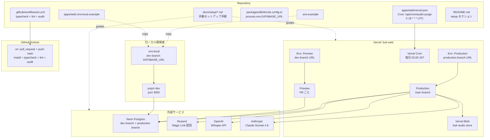

# Design Document — multi-env-infrastructure

## Overview

**Purpose**: 本機能は、`monorepo-foundation` で構築されたモノレポ基盤の上に、bulr Stage 1 MVP プロトタイプ（AI 面接アシスタント型）を **Vercel に本番デプロイ可能な状態** まで持ち上げるためのインフラ基盤を確立する。具体的には、Vercel プロジェクト `bulr-web`、Neon Postgres の dev/production 2 ブランチ、Resend / OpenAI / Anthropic / Vercel Blob の 4 外部サービス連携、Vercel Cron スケジュール定義、環境変数規約（12 変数）、ローカル開発の `.env.local` 運用、最小 CI（typecheck + lint + audit）を整える。

**Users**: 後続 4 spec（`authentication` / `assessment-pattern-seed` / `assessment-engine` / `admin-review-panel`）の実装担当者、および Stage 1 期間中に参画する開発者・プロジェクトオーナー。本スペックの成果物により、各 spec の実装者は「環境変数の名前付け」「DB 接続」「Vercel Blob トークン取得」「Cron スケジュール調整」を一切意識せず、各 spec の本来の機能（認証 / シード / LLM / 管理画面）の実装に集中できる。

**Impact**: `monorepo-foundation` 完了時点では Vercel / Neon / Resend / OpenAI / Anthropic / Vercel Blob / Vercel Cron が一切設定されておらず、ローカルで `pnpm dev` が動くのみの状態。本スペックは「設定ファイル群（`.env.example` / `apps/web/.env.local.example` / `apps/web/vercel.json` / `.github/workflows/ci.yml` / `docs/setup/*.md`）の作成」と「Owner 手動セットアップ手順の文書化」のみを所有し、route handler / LLM 関数 / 認証ロジックは追加しない。本スペック完了で、Vercel に main ブランチ push で本番デプロイ・PR で Preview デプロイが自動実行される状態と、CI で型チェック・lint・audit が自動実行される状態を達成する。

### Goals

- ルート `.env.example` に Stage 1 環境変数 12 個（`DATABASE_URL` / `BETTER_AUTH_SECRET` / `BETTER_AUTH_URL` / `RESEND_API_KEY` / `NEXT_PUBLIC_APP_URL` / `ANTHROPIC_API_KEY` / `OPENAI_API_KEY` / `BLOB_READ_WRITE_TOKEN` / `CRON_SECRET` / `ADMIN_ALLOWED_EMAILS` / `ADMIN_BASIC_AUTH_USER` / `ADMIN_BASIC_AUTH_PASSWORD`）をプレースホルダ + コメント付きで網羅
- `apps/web/.env.local.example` をローカル開発者向けコピー元として整備
- `apps/web/vercel.json` に Vercel Cron 定義（`/api/cron/audio-purge` を `0 18 * * *` UTC = 03:00 JST 毎日）を作成
- `.github/workflows/ci.yml` で `pnpm install --frozen-lockfile` → `pnpm typecheck` → `pnpm lint` → `pnpm audit --audit-level=moderate` を PR / main push で自動実行
- `packages/db/drizzle.config.ts` の `dbCredentials.url` を `process.env.DATABASE_URL` から確実に読み取る形に整える（`monorepo-foundation` の空設定を有効化）
- `docs/setup/` ディレクトリに Vercel / Neon / Resend / OpenAI / Anthropic / Vercel Blob / Cron / 環境変数 / drizzle-kit 運用 / CI の手順を集約し、`docs/setup/README.md` インデックスを提供
- README.md にセットアップ概要セクションを追記し、`docs/setup/` への入り口を明示

### Non-Goals

- Better Auth 設定・Magic Link 実装・proxy.ts のセキュリティロジック → `authentication` spec
- DB テーブル実体定義 → `assessment-pattern-seed` および `assessment-engine` spec
- LLM 関数本体（5 関数）、システムプロンプト、Whisper クライアント実装、Vercel Blob アップロード関数 → `assessment-engine` spec
- 音声削除 Cron の **ロジック実装**（`/api/cron/audio-purge/route.ts` 中身）→ `assessment-engine` spec（本スペックでは vercel.json のスケジュール定義のみ）
- 管理画面 UI、Basic 認証ロジック、`requireAdmin` ヘルパー → `admin-review-panel` spec
- セキュリティヘッダー（CSP / HSTS / Permissions-Policy）の `next.config.ts` 設定 → 後続 spec（`assessment-engine` でマイク CSP、`authentication` で HSTS / X-Frame-Options 等）
- 監視スタック（PostHog / Sentry / Helicone / BetterStack）→ Stage 2
- Cloudflare R2 への移行 → Stage 2
- カスタムドメイン（bulr.net 等）の SSL / DNS 設定 → Stage 1 末で必要なら別途
- staging 環境構築 → Stage 2
- Resend のカスタムドメイン認証 → Stage 2
- Vercel API 経由の自動セットアップスクリプト（Owner 手動実施を前提とする）
- レート制限実装 → 後続 spec

## Boundary Commitments

### This Spec Owns

- ルート `.env.example` の作成と内容（Stage 1 環境変数 12 項目 + コメント + Vercel 登録先指定）
- `apps/web/.env.local.example` の作成と内容（ローカル開発者向けコピー元）
- `apps/web/vercel.json` の作成と内容（Cron 定義 1 エントリ、それ以外の `headers` / `rewrites` / `redirects` は持たない）
- `.github/workflows/ci.yml` の作成と内容（install / typecheck / lint / audit の 4 ステップ）
- `packages/db/drizzle.config.ts` の `dbCredentials.url` 設定の有効化（`monorepo-foundation` で空のまま残されていた箇所）
- `docs/setup/` ディレクトリ配下の各セットアップ手順ドキュメント（vercel.md / neon.md / resend.md / openai.md / anthropic.md / vercel-blob.md / cron.md / env-vars.md / drizzle-kit.md / README.md インデックス）
- README.md のセットアップセクション追加または更新

### Out of Boundary

- `apps/web/app/api/cron/audio-purge/route.ts` の実装（route handler 中身）→ `assessment-engine` spec
- `apps/web/lib/audio/` の Vercel Blob クライアント実装 → `assessment-engine` spec
- `packages/ai/src/whisper/transcribe.ts` の Whisper ラッパー実装 → `assessment-engine` spec
- `packages/db/src/schema/*.ts` の実テーブル定義 → 後続 spec
- `apps/web/lib/auth/` の Better Auth 設定 → `authentication` spec
- `apps/web/lib/email/` の Resend Magic Link テンプレ → `authentication` spec
- `next.config.ts` のセキュリティヘッダー設定 → 後続 spec
- Vercel / Neon / Resend / OpenAI / Anthropic / Vercel Blob 各社の **アカウント実作成・API キー実発行**（本スペックでは手順書のみ提供、Owner が手動実施）
- 実 Vercel 環境変数の値 setting（本スペックでは `.env.example` のプレースホルダと手順書のみ）
- 初回の `pnpm drizzle-kit push` 実行（後続 `assessment-pattern-seed` spec が初回スキーマ確定時に実行）

### Allowed Dependencies

- pnpm 10+、Node.js 22+（`monorepo-foundation` で設定済み）
- Turborepo 2.x（`monorepo-foundation` で設定済み）
- Drizzle ORM 0.45.x、drizzle-kit 0.31.x、`pg` 8.x（`monorepo-foundation` で設定済み）
- Vercel ランタイム（外部）：本スペックは Vercel ダッシュボード上の手動操作と `vercel.json` の宣言のみ
- GitHub Actions の公式アクション（`actions/checkout` / `actions/setup-node` / `pnpm/action-setup`）
- 外部サービス（Vercel / Neon / Resend / OpenAI / Anthropic）：API キーの取得と Vercel 環境変数登録のみ、SDK の追加は `monorepo-foundation` で完了済み
- 制約: 本スペックでは `dependencies` / `devDependencies` の追加は行わない（`monorepo-foundation` で全 SDK 導入済み）。新規 npm パッケージの追加は不要

### Revalidation Triggers

- 環境変数名の追加・改名（例: 新たに `DEEPGRAM_API_KEY` を追加） → `.env.example` / `apps/web/.env.local.example` / Vercel 環境変数登録手順 / 後続 spec の参照箇所すべてを更新
- Vercel Cron スケジュール変更（`0 18 * * *` 以外に変更） → `vercel.json` 更新 + `assessment-engine` spec の Cron 想定時刻と整合確認
- 2 環境構成 → 3 環境以上（staging 追加）への移行 → 環境マッピング規約・Vercel 環境変数登録手順・Neon ブランチ運用すべてを再設計
- Vercel Hobby → Pro プランへの移行 → Cron 制限緩和、Custom Domain SSL 等の前提が変わる
- Cloudflare R2 への音声ストレージ移行 → `BLOB_READ_WRITE_TOKEN` を `R2_ACCESS_KEY_ID` 等に置換、後続 spec の音声 I/O 全体に影響
- Neon ブランチ命名（`dev` / `production`）の変更 → drizzle-kit 運用手順 / Vercel 環境変数登録手順を再執筆
- `apps/web/vercel.json` 配置位置の変更（例: ルート直下に移動） → `structure.md` 更新 + Vercel プロジェクト Root Directory 設定の見直し

## Architecture

### Existing Architecture Analysis

`monorepo-foundation` 完了時点で以下が整備済み：

- ルート設定 8 ファイル（`package.json` / `pnpm-workspace.yaml` / `turbo.json` / `tsconfig.base.json` / `eslint.config.mjs` / `prettier.config.mjs` / `.npmrc` / `.gitignore`）
- `apps/web` の Next.js 16 + React 19 + Tailwind CSS 4 スケルトン
- `packages/{db,types,lib,ai}` の 4 パッケージスケルトン
- `packages/db/drizzle.config.ts`（`dbCredentials` は `process.env.DATABASE_URL ?? ''` の形で初期化済み、本スペックで「未定義時のエラー検知」を確認）
- `packages/db/src/client.ts`（`DATABASE_URL` 未定義時の throw が実装済み）
- `.gitignore` に `.env*.local` 含む（本スペックで `.env` も除外対象に追加することを再確認）

`monorepo-foundation` で **意図的に未着手で残された箇所**:

- 環境変数の値設定 / `.env.example` / Vercel プロジェクト / Cron / CI / セットアップドキュメント（すべて本スペックで担当）
- Vercel Blob / OpenAI / Resend の SDK は `monorepo-foundation` で `packages/ai` に依存追加済み（`ai` / `@ai-sdk/anthropic` / `openai` / `zod`）。Vercel Blob の SDK（`@vercel/blob`）は `assessment-engine` spec で必要時に追加（本スペックではトークン環境変数の登録のみ）

参照プロジェクト `dishxdish-app-mvp` は同じく `multi-env-infrastructure` spec を持つが 4 環境構成（local / dev / preview / prod）。本スペックでは Stage 1 規模に合わせて **2 環境構成（dev branch + production）** に簡略化し、Vercel Blob と Vercel Cron を新規追加（dishxdish にはない bulr 独自）。

### Architecture Pattern & Boundary Map



**Architecture Integration**:
- **Selected pattern**: 2 環境構成（dev branch + production）で運用するシンプルなインフラ。Vercel Preview = dev branch DATABASE_URL を共有、Vercel Production = production branch DATABASE_URL を使用。staging は持たない
- **Domain/feature boundaries**: 本スペックは「設定ファイル + 文書化された手動手順」のみ所有。route handler / DB schema / LLM 関数 / 認証ロジック / Cron 実装は後続 spec
- **Existing patterns preserved**: `monorepo-foundation` で確立した Turborepo パイプライン・パッケージ依存方向・`process.env.DATABASE_URL` を起点とする DB 接続パターンを維持
- **New components rationale**: 後続 4 spec が必要とする全環境変数を本スペックで先に定義し、各 spec が「変数名の決定」に時間を取られないようにする。Vercel Cron スケジュール定義も本スペックで先取りすることで、`assessment-engine` spec の実装者は route handler 実装に集中できる
- **Steering compliance**: `tech.md` L212-236 の Stage 1 環境変数リスト全 12 項目を `.env.example` に網羅、`tech.md` L242-251 のデプロイ構成（Vercel `bulr-web` + `vercel.json` で Cron）に従う、`security.md` L203-216 のシークレット管理 + CI セキュリティに準拠、`structure.md` L97 の vercel.json 配置（`apps/web/vercel.json`）に従う

### Technology Stack

| Layer | Choice / Version | Role in Feature | Notes |
|-------|------------------|-----------------|-------|
| Hosting | Vercel Hobby | apps/web のホスティング、Cron 実行、Vercel Blob | Owner 手動でプロジェクト作成 |
| Database | Neon Postgres（サーバーレス） | dev / production の 2 ブランチ運用 | 各ブランチの DATABASE_URL を Vercel 環境変数に登録 |
| Storage | Vercel Blob | 音声ファイル保存（30 日後自動削除） | 単一ストア `bulr-audio`、`BLOB_READ_WRITE_TOKEN` 自動付与 |
| Email | Resend Free | Magic Link 配信（100 通/日） | Stage 1 はテストドメイン、カスタムドメインは Stage 2 |
| LLM | Anthropic Claude Sonnet 4.6 | LLM 分析・候補生成 | API キー: `ANTHROPIC_API_KEY` |
| Speech-to-Text | OpenAI Whisper（whisper-1） | 音声文字起こし | API キー: `OPENAI_API_KEY` |
| Cron | Vercel Cron（Hobby: 1 日 2 回まで） | `/api/cron/audio-purge` を毎日 03:00 JST | `vercel.json` で定義、`CRON_SECRET` で認証 |
| Migration | drizzle-kit 0.31.x | dev: push、production: generate + migrate | `monorepo-foundation` で導入済み |
| CI | GitHub Actions | typecheck + lint + audit | シークレット不要、外部接続なし |
| Secret Management | Vercel 環境変数 + ローカル `.env.local` | サーバー専用シークレットの管理 | `NEXT_PUBLIC_` プレフィックスのみクライアント露出 |

## File Structure Plan

### Directory Structure

```
bulr-app-mvp/
├── .env.example                          # 新規: Stage 1 全 12 環境変数のプレースホルダ + コメント + Vercel 登録先指定
├── README.md                             # 更新: セットアップセクションを追加し docs/setup/README.md へリンク
│
├── .github/
│   └── workflows/
│       └── ci.yml                        # 新規: PR / main push で install + typecheck + lint + audit
│
├── apps/
│   └── web/
│       ├── .env.local.example            # 新規: ローカル開発者向けコピー元、12 変数すべて含む
│       └── vercel.json                   # 新規: Vercel Cron 定義 1 エントリ（/api/cron/audio-purge を 0 18 * * * UTC）
│
├── packages/
│   └── db/
│       └── drizzle.config.ts             # 更新: dbCredentials.url を process.env.DATABASE_URL から確実に読み取る形に整える（monorepo-foundation で空のまま残された場合）
│
└── docs/
    └── setup/
        ├── README.md                     # 新規: セットアップ手順インデックス（推奨実行順序を明示）
        ├── env-vars.md                   # 新規: 12 環境変数の用途・参照元・公開可否・Vercel 登録先の総合リファレンス
        ├── vercel.md                     # 新規: Vercel プロジェクト bulr-web の作成手順、Root Directory = apps/web、環境変数登録方法
        ├── neon.md                       # 新規: Neon プロジェクト + dev / production ブランチ作成、各 DATABASE_URL の取得と Vercel 登録
        ├── resend.md                     # 新規: Resend Free アカウント作成 + RESEND_API_KEY 取得 + Vercel 登録
        ├── openai.md                     # 新規: OpenAI アカウント作成 + Whisper API 利用設定 + OPENAI_API_KEY 取得 + Vercel 登録 + Usage Limit
        ├── anthropic.md                  # 新規: Anthropic アカウント作成 + Claude Sonnet 4.6 利用設定 + ANTHROPIC_API_KEY 取得 + Vercel 登録 + Usage Limit
        ├── vercel-blob.md                # 新規: Vercel Blob ストア bulr-audio の作成、BLOB_READ_WRITE_TOKEN 自動登録の確認
        ├── cron.md                       # 新規: CRON_SECRET 生成（openssl rand -base64 32）+ Vercel 登録 + vercel.json の説明
        ├── drizzle-kit.md                # 新規: dev branch には push、production branch には generate + migrate の運用手順、SQL ファイル名は drizzle-kit が決定
        └── ci.md                         # 新規: .github/workflows/ci.yml の構成説明と PR レビュー時の確認事項
```

### Modified Files

- `bulr-app-mvp/README.md`: `monorepo-foundation` で作成された README に、セットアップセクションまたは「セットアップ手順は `docs/setup/README.md` 参照」のリンクを追加
- `bulr-app-mvp/packages/db/drizzle.config.ts`: `monorepo-foundation` で `dbCredentials.url: process.env.DATABASE_URL ?? ''` の形で空文字 fallback されていた場合、本スペックで `process.env.DATABASE_URL!` または `process.env.DATABASE_URL` 未定義時の明示的エラーメッセージに置き換える（DATABASE_URL 未定義時は drizzle-kit が即時失敗する形）

> 各ファイルは単一責務。新規作成: `.env.example` 1 個、`apps/web/.env.local.example` 1 個、`apps/web/vercel.json` 1 個、`.github/workflows/ci.yml` 1 個、`docs/setup/*.md` 11 個（README.md インデックス + 10 手順書）。更新: `README.md` 1 個、`packages/db/drizzle.config.ts` 1 個。コード変更は最小限で、実質的にはドキュメントと設定ファイルが中心。

## Requirements Traceability

| Requirement | Summary | Components | Interfaces | Flows |
|-------------|---------|------------|------------|-------|
| 1.1 | `.env.example` ルート存在 | EnvExampleConfig | filesystem | — |
| 1.2 | 12 変数を網羅 | EnvExampleConfig | .env.example | — |
| 1.3 | プレースホルダで記載 | EnvExampleConfig | .env.example | — |
| 1.4 | `NEXT_PUBLIC_` の公開可否を明示 | EnvExampleConfig | .env.example | — |
| 1.5 | apps/web/.env.local.example | WebEnvLocalExample | filesystem | — |
| 1.6 | `.gitignore` 確認 | EnvExampleConfig | .gitignore | — |
| 1.7 | コピーで pnpm dev 起動 | WebEnvLocalExample + DrizzleConfigUpdate | .env.local | local dev フロー |
| 1.8 | Vercel 登録先（Production / Preview / 両方）を明示 | EnvExampleConfig | .env.example | — |
| 2.1 | docs/setup/vercel.md 存在 | VercelSetupDoc | filesystem | — |
| 2.2 | Vercel プロジェクト設定（Root Directory 等） | VercelSetupDoc | docs/setup/vercel.md | Vercel プロジェクト作成フロー |
| 2.3 | 環境変数の Production / Preview 使い分け | VercelSetupDoc + EnvVarsDoc | docs | Vercel 環境変数登録フロー |
| 2.4 | GitHub 連携手順 | VercelSetupDoc | docs/setup/vercel.md | デプロイ自動化フロー |
| 2.5 | Vercel Hobby プラン前提 | VercelSetupDoc | docs/setup/vercel.md | — |
| 2.6 | Owner 手動実施明示 | VercelSetupDoc | docs/setup/vercel.md | — |
| 2.7 | main push で本番 / PR で Preview | VercelSetupDoc | Vercel ダッシュボード | デプロイ自動化フロー |
| 3.1 | docs/setup/neon.md 存在 | NeonSetupDoc | filesystem | — |
| 3.2 | production プライマリ + dev 分岐 | NeonSetupDoc | docs/setup/neon.md | Neon ブランチ作成フロー |
| 3.3 | DATABASE_URL を Production / Preview に登録 | NeonSetupDoc + EnvVarsDoc | docs | Vercel 環境変数登録フロー |
| 3.4 | drizzle.config.ts の DATABASE_URL 参照 | DrizzleConfigUpdate | drizzle.config.ts | drizzle-kit 実行フロー |
| 3.5 | client.ts の fail fast 確認 | DrizzleConfigUpdate | packages/db/src/client.ts | DB 接続フロー |
| 3.6 | dev branch への push 手順 | DrizzleKitOpsDoc | docs/setup/drizzle-kit.md | drizzle-kit push フロー |
| 3.7 | production branch への generate + migrate 手順 | DrizzleKitOpsDoc | docs/setup/drizzle-kit.md | drizzle-kit migrate フロー |
| 3.8 | SQL ファイル名は drizzle-kit が決定 | DrizzleKitOpsDoc | docs/setup/drizzle-kit.md | — |
| 3.9 | DATABASE_URL を読み取り接続成立 | DrizzleConfigUpdate + WebEnvLocalExample | packages/db | local dev フロー |
| 4.1 | docs/setup/{resend,openai,anthropic}.md 存在 | ResendSetupDoc + OpenAISetupDoc + AnthropicSetupDoc | filesystem | — |
| 4.2 | Resend Free + テストドメイン | ResendSetupDoc | docs/setup/resend.md | Resend セットアップフロー |
| 4.3 | OpenAI Whisper API + Usage Limit | OpenAISetupDoc | docs/setup/openai.md | OpenAI セットアップフロー |
| 4.4 | Anthropic Sonnet 4.6 + Usage Limit | AnthropicSetupDoc | docs/setup/anthropic.md | Anthropic セットアップフロー |
| 4.5 | API キーを Vercel 環境変数登録 | 各 SetupDoc + EnvVarsDoc | docs | Vercel 環境変数登録フロー |
| 4.6 | API キーをローカル .env.local 設定 | 各 SetupDoc + WebEnvLocalExample | docs + .env.local.example | local dev フロー |
| 4.7 | 3 サービスが Production / Preview 両方に登録 | 各 SetupDoc + EnvVarsDoc | Vercel ダッシュボード | Vercel 環境変数登録フロー |
| 5.1 | docs/setup/vercel-blob.md 存在 | VercelBlobSetupDoc | filesystem | — |
| 5.2 | BLOB_READ_WRITE_TOKEN 自動登録 | VercelBlobSetupDoc | docs/setup/vercel-blob.md | Vercel Blob 作成フロー |
| 5.3 | 無料枠 + 30 日保存方針 | VercelBlobSetupDoc | docs/setup/vercel-blob.md | — |
| 5.4 | docs/setup/cron.md + CRON_SECRET 生成 | CronSetupDoc | docs/setup/cron.md | CRON_SECRET 登録フロー |
| 5.5 | Authorization Bearer 検証は assessment-engine の責務 | CronSetupDoc | docs/setup/cron.md | — |
| 5.6 | BLOB_READ_WRITE_TOKEN が Production / Preview 両方 | VercelBlobSetupDoc | Vercel ダッシュボード | — |
| 5.7 | CRON_SECRET が Production / Preview 両方 | CronSetupDoc | Vercel ダッシュボード | — |
| 6.1 | apps/web/vercel.json 存在 | VercelJsonConfig | filesystem | — |
| 6.2 | crons 配列 1 エントリ（0 18 * * *） | VercelJsonConfig | apps/web/vercel.json | Vercel Cron スケジュールフロー |
| 6.3 | Hobby プラン制限内 | VercelJsonConfig | apps/web/vercel.json | — |
| 6.4 | Cron 以外の余分な設定なし | VercelJsonConfig | apps/web/vercel.json | — |
| 6.5 | Vercel が読み取り Cron 登録 | VercelJsonConfig | Vercel ダッシュボード | デプロイフロー |
| 6.6 | route handler は本スペックで作らない（明示） | VercelJsonConfig + DocsSetupReadme | docs | — |
| 6.7 | route handler 未実装で 404 許容 | VercelJsonConfig | — | — |
| 7.1 | .github/workflows/ci.yml 存在 | CIWorkflow | filesystem | — |
| 7.2 | PR + main push で起動 | CIWorkflow | ci.yml | CI 実行フロー |
| 7.3 | Node 22+ / pnpm 10+ セットアップ | CIWorkflow | ci.yml | CI 実行フロー |
| 7.4 | pnpm install --frozen-lockfile | CIWorkflow | ci.yml | CI 実行フロー |
| 7.5 | pnpm typecheck | CIWorkflow | ci.yml | CI 実行フロー |
| 7.6 | pnpm lint | CIWorkflow | ci.yml | CI 実行フロー |
| 7.7 | pnpm audit --audit-level=moderate | CIWorkflow | ci.yml | CI 実行フロー |
| 7.8 | シークレット不要 | CIWorkflow | ci.yml | — |
| 7.9 | PR で 4 ステップ実行 | CIWorkflow | GitHub Actions | CI 実行フロー |
| 8.1 | README.md にセットアップリンク | DocsSetupReadme + RootReadme | README.md | — |
| 8.2 | docs/setup/ インデックス | DocsSetupReadme | docs/setup/README.md | — |
| 8.3 | 推奨実行順序明示 | DocsSetupReadme | docs/setup/README.md | セットアップフロー |
| 8.4 | 手動実施前提 | DocsSetupReadme + 各 SetupDoc | docs | — |
| 8.5 | 完了確認方法を含む | 各 SetupDoc | docs | — |
| 8.6 | 新規開発者が手順で構築可能 | DocsSetupReadme + 各 SetupDoc | docs | セットアップ全体フロー |
| 9.1 | 環境マッピング規約明示 | EnvVarsDoc + DocsSetupReadme | docs | — |
| 9.2 | staging 不要を明示 | EnvVarsDoc + DocsSetupReadme | docs | — |
| 9.3 | 各変数の Production / Preview 使い分け | EnvExampleConfig + EnvVarsDoc | docs + .env.example | Vercel 環境変数登録フロー |
| 9.4 | DATABASE_URL の Production = production / Preview = dev | NeonSetupDoc + EnvVarsDoc | docs | — |
| 9.5 | 本番 DB に push 禁止、migrate のみ | DrizzleKitOpsDoc | docs/setup/drizzle-kit.md | — |
| 9.6 | Preview デプロイが本番 DB に影響しない | EnvVarsDoc + NeonSetupDoc | Vercel 環境変数 | デプロイフロー |
| 10.1 | .gitignore で .env / .env.local 除外 | EnvExampleConfig | .gitignore | — |
| 10.2 | .env.example はプレースホルダのみ | EnvExampleConfig + WebEnvLocalExample | .env.example | — |
| 10.3 | NEXT_PUBLIC_ のみクライアント露出 | EnvExampleConfig + EnvVarsDoc | docs | — |
| 10.4 | CI で audit | CIWorkflow | ci.yml | CI 実行フロー |
| 10.5 | シークレットは Vercel ダッシュボード経由のみ | EnvVarsDoc + 各 SetupDoc | docs | — |
| 10.6 | CRON_SECRET は最低 32 バイトランダム | CronSetupDoc | docs/setup/cron.md | — |
| 10.7 | diff に実シークレットが含まれない | EnvExampleConfig + 各 SetupDoc | git diff | PR レビューフロー |

## Components and Interfaces

| Component | Domain/Layer | Intent | Req Coverage | Key Dependencies (P0/P1) | Contracts |
|-----------|--------------|--------|--------------|--------------------------|-----------|
| EnvExampleConfig | Root | ルート `.env.example` の作成と内容 | 1.1, 1.2, 1.3, 1.4, 1.6, 1.8, 9.3, 10.1, 10.2, 10.7 | `.gitignore`（既設）(P0) | State |
| WebEnvLocalExample | apps/web | ローカル開発者向けコピー元 | 1.5, 1.7, 3.9, 4.6 | EnvExampleConfig (P0) | State |
| VercelJsonConfig | apps/web | Vercel Cron 定義 | 6.1, 6.2, 6.3, 6.4, 6.5, 6.6, 6.7 | Vercel Hobby プラン (P0) | State |
| DrizzleConfigUpdate | packages/db | drizzle.config.ts の DATABASE_URL 読み取り設定有効化 | 3.4, 3.5, 3.9, 1.7 | `monorepo-foundation` の packages/db スケルトン (P0) | State |
| CIWorkflow | .github/workflows | CI 最小構成（install + typecheck + lint + audit） | 7.1, 7.2, 7.3, 7.4, 7.5, 7.6, 7.7, 7.8, 7.9, 10.4 | GitHub Actions ランタイム (P0)、pnpm 10+ (P0)、Node 22+ (P0) | Batch |
| DocsSetupReadme | docs/setup | セットアップ手順インデックス | 8.1, 8.2, 8.3, 8.4, 8.6, 9.1, 9.2 | 各 SetupDoc (P0) | State |
| EnvVarsDoc | docs/setup | 12 環境変数の総合リファレンス | 1.4, 1.8, 4.5, 4.7, 5.6, 5.7, 9.1, 9.3, 9.4, 9.6, 10.3, 10.5 | EnvExampleConfig (P0) | State |
| VercelSetupDoc | docs/setup | Vercel プロジェクト bulr-web 作成手順 | 2.1, 2.2, 2.3, 2.4, 2.5, 2.6, 2.7, 8.5 | Vercel Hobby (P0)、GitHub リポジトリ (P0) | State |
| NeonSetupDoc | docs/setup | Neon dev / production ブランチ作成手順 | 3.1, 3.2, 3.3, 9.4, 9.6, 8.5 | Neon Free プラン (P0) | State |
| ResendSetupDoc | docs/setup | Resend アカウント + RESEND_API_KEY | 4.1, 4.2, 4.5, 4.7, 8.5 | Resend Free プラン (P0) | State |
| OpenAISetupDoc | docs/setup | OpenAI Whisper + OPENAI_API_KEY | 4.1, 4.3, 4.5, 4.7, 8.5 | OpenAI 従量課金 (P0) | State |
| AnthropicSetupDoc | docs/setup | Anthropic Claude + ANTHROPIC_API_KEY | 4.1, 4.4, 4.5, 4.7, 8.5 | Anthropic 従量課金 (P0) | State |
| VercelBlobSetupDoc | docs/setup | Vercel Blob ストア bulr-audio 作成 | 5.1, 5.2, 5.3, 5.6, 8.5 | Vercel Blob 無料枠 (P0) | State |
| CronSetupDoc | docs/setup | CRON_SECRET 生成 + Vercel 登録 | 5.4, 5.5, 5.7, 6.6, 10.6, 8.5 | openssl CLI (P1)、Vercel ダッシュボード (P0) | State |
| DrizzleKitOpsDoc | docs/setup | drizzle-kit push / generate / migrate 運用 | 3.6, 3.7, 3.8, 9.5, 8.5 | drizzle-kit 0.31.x (P0、`monorepo-foundation` 既設) | State |
| RootReadme | Root | README.md にセットアップリンク追加 | 8.1 | DocsSetupReadme (P0) | State |

### Root / Configuration Layer

#### EnvExampleConfig

| Field | Detail |
|-------|--------|
| Intent | Stage 1 全 12 環境変数をプレースホルダ + コメント付きで網羅し、後続 spec の実装者と新規開発者が「変数名」「用途」「Vercel 登録先」を即座に把握できる単一リファレンスとする |
| Requirements | 1.1, 1.2, 1.3, 1.4, 1.6, 1.8, 9.3, 10.1, 10.2, 10.7 |
| Owner / Reviewers | プロジェクトオーナー |

**Responsibilities & Constraints**
- ルート直下 `.env.example` を所有
- 12 変数を以下の順序・グループでコメント付きで記載:
  - **共通**: `DATABASE_URL` / `BETTER_AUTH_SECRET` / `BETTER_AUTH_URL` / `RESEND_API_KEY` / `NEXT_PUBLIC_APP_URL`
  - **LLM**: `ANTHROPIC_API_KEY` / `OPENAI_API_KEY`
  - **ストレージ**: `BLOB_READ_WRITE_TOKEN`
  - **Cron**: `CRON_SECRET`
  - **管理画面**: `ADMIN_ALLOWED_EMAILS` / `ADMIN_BASIC_AUTH_USER` / `ADMIN_BASIC_AUTH_PASSWORD`
- 各変数の直前または同行コメントで以下を明示:
  - 用途（一行）
  - Vercel 登録先（Production / Preview / 両方）
  - 公開可否（`NEXT_PUBLIC_` のみクライアント露出、それ以外サーバー専用）
  - 値の例（プレースホルダ、実シークレットを含まない）
- `.gitignore` に `.env`、`.env.local`、`.env.*.local` が含まれていることを再確認（含まれていない場合は本スペックで追加）
- 不変条件: `.env.example` 内に実シークレット値を一切含まない

**Dependencies**
- Inbound: `WebEnvLocalExample` がコピー元として参照、`EnvVarsDoc` が網羅性のリファレンスとして参照
- Outbound: なし
- External: `.gitignore`（`monorepo-foundation` 既設、本スペックで `.env` 除外を再確認）（P0）

**Contracts**: State

##### State Management
- State model: ファイル存在 + 12 変数すべて + コメント
- Persistence & consistency: git にコミット
- Concurrency strategy: 該当なし

**Implementation Notes**
- Integration: `tech.md` L212-236 の Stage 1 環境変数リストを忠実に転記、各変数に Vercel 登録先（Production / Preview）と用途コメントを追加
- Validation: 開発者が `.env.example` を `.env.local` にコピーし、実値を埋めれば `pnpm dev` 起動時に必須変数が読み取れる
- Risks: コメントが冗長になりすぎてファイルが読みづらくなる → 各変数 1-2 行コメントに収める

#### WebEnvLocalExample

| Field | Detail |
|-------|--------|
| Intent | ローカル開発者が `cp apps/web/.env.local.example apps/web/.env.local` でコピーして利用できる、ローカル開発に必要な環境変数のみを含む雛形ファイル |
| Requirements | 1.5, 1.7, 3.9, 4.6 |

**Responsibilities & Constraints**
- `apps/web/.env.local.example` を所有
- 内容はルート `.env.example` とほぼ同等（12 変数すべて）だが、`NEXT_PUBLIC_APP_URL` のデフォルト値を `http://localhost:3000` にする等、ローカル特化のコメントを含む
- `BETTER_AUTH_URL` も `http://localhost:3000` をプレースホルダとして記載
- `DATABASE_URL` には Neon dev branch の URL を入れる旨をコメントで明示

**Dependencies**
- Inbound: 開発者が `cp` で `.env.local` を作成（local dev フロー）
- Outbound: なし
- External: なし

**Contracts**: State

**Implementation Notes**
- Integration: ルート `.env.example` のサブセットでなく、apps/web の dev 起動に必要な変数を一通り含む
- Validation: 開発者が `cp apps/web/.env.local.example apps/web/.env.local` で実行可能
- Risks: ルートの `.env.example` と内容が乖離するリスク → 本スペック完了時点では同期、後続 spec で変数追加時には両ファイル更新を docs に明記

#### VercelJsonConfig

| Field | Detail |
|-------|--------|
| Intent | Vercel Cron スケジュール定義（`/api/cron/audio-purge` を毎日 03:00 JST）を `vercel.json` で宣言 |
| Requirements | 6.1, 6.2, 6.3, 6.4, 6.5, 6.6, 6.7 |

**Responsibilities & Constraints**
- `apps/web/vercel.json` を所有（`structure.md` L97 配置方針に従う）
- 内容は `crons` 配列のみ:
  ```json
  {
    "crons": [
      {
        "path": "/api/cron/audio-purge",
        "schedule": "0 18 * * *"
      }
    ]
  }
  ```
- スケジュール `0 18 * * *` は UTC 18:00 = JST 03:00 毎日（日本ユーザーが少ない時間帯）
- Vercel Hobby プランの Cron 制限（1 日 2 回まで）を超えない（本スペックでは 1 日 1 回のみ）
- `headers` / `rewrites` / `redirects` 等の余分な設定は持たない（後続 spec で必要時に追加）
- 不変条件: route handler ファイル（`apps/web/app/api/cron/audio-purge/route.ts`）は **本スペックでは作成しない**（`assessment-engine` spec の責務）。Cron が呼び出された時点で route が未実装の場合、Vercel は 404 を返すが、これは `assessment-engine` spec 完了までの一時状態として許容

**Dependencies**
- Inbound: Vercel ランタイム（デプロイ時に読み取る）（P0）
- Outbound: なし
- External: Vercel ホスティング（P0）

**Contracts**: State

##### State Management
- State model: JSON ファイルの存在 + 内容
- Persistence & consistency: git にコミット、Vercel デプロイ時に Vercel が読み取る
- Concurrency strategy: 該当なし（宣言的設定）

**Implementation Notes**
- Integration: `tech.md` L246-250 のデプロイ構成に従い、`apps/web/vercel.json` 配置（Vercel プロジェクトの Root Directory `apps/web` 配下）
- Validation: Vercel デプロイ後、Vercel ダッシュボードの Cron Jobs ページで `/api/cron/audio-purge` がスケジュール登録されていることを確認
- Risks:
  - Cron が登録されたのに route handler が未実装で Vercel ログに 404 が連日記録される → `assessment-engine` spec 完了までの一時的な状況として許容、ログを Vercel ダッシュボードで確認する程度の対応
  - スケジュール表記の誤り（UTC と JST の取り違え） → コメントで明示、本スペックの docs/setup/cron.md でも明記

#### DrizzleConfigUpdate

| Field | Detail |
|-------|--------|
| Intent | `monorepo-foundation` で空文字 fallback されていた `dbCredentials.url` を、`process.env.DATABASE_URL` を確実に読み取る形に整える |
| Requirements | 3.4, 3.5, 3.9, 1.7 |

**Responsibilities & Constraints**
- `packages/db/drizzle.config.ts` を更新
- `dbCredentials.url: process.env.DATABASE_URL!`（TypeScript の non-null assertion）または明示的な検証コードに置き換え
- `monorepo-foundation` の `packages/db/src/client.ts` は既に `DATABASE_URL` 未定義時に throw する実装が入っているため、本スペックでは drizzle.config.ts の側のみ修正（client.ts は触らず、動作確認のみ）

**Dependencies**
- Inbound: `pnpm drizzle-kit push` / `migrate` / `generate` 実行時に読み取られる（drizzle-kit 実行フロー）
- Outbound: `process.env.DATABASE_URL`
- External: drizzle-kit 0.31.x（P0、`monorepo-foundation` 既設）

**Contracts**: State

**Implementation Notes**
- Integration: `monorepo-foundation` の drizzle.config.ts が `?? ''` の形になっている場合、本スペックで `process.env.DATABASE_URL!` または明示的な validation に置き換える
- Validation: `.env.local` に DATABASE_URL を設定して `pnpm --filter @bulr/db generate` が空 schema でも実行成功（migration ファイルは生成されないが、エラーも出ない）
- Risks: `process.env.DATABASE_URL!` の non-null assertion は実行時 undefined だと runtime error になるが、drizzle-kit 実行時にすぐ判明するため許容

### CI Layer

#### CIWorkflow

| Field | Detail |
|-------|--------|
| Intent | PR ごと・main ブランチ push ごとに型チェック・lint・依存性脆弱性スキャンを自動実行し、本番ブランチにバグや脆弱性を混入させない |
| Requirements | 7.1, 7.2, 7.3, 7.4, 7.5, 7.6, 7.7, 7.8, 7.9, 10.4 |

**Responsibilities & Constraints**
- `.github/workflows/ci.yml` を所有
- トリガ: `pull_request` の `opened` / `synchronize` および `push` の `branches: [main]`
- ジョブ構成: 単一ジョブ `ci`（runs-on: `ubuntu-latest`）
- ステップ:
  1. `actions/checkout@v4` でリポジトリ取得
  2. `pnpm/action-setup@v4` で pnpm 10 セットアップ
  3. `actions/setup-node@v4` で Node.js 22 LTS セットアップ + `cache: 'pnpm'`
  4. `pnpm install --frozen-lockfile`
  5. `pnpm typecheck`
  6. `pnpm lint`
  7. `pnpm audit --audit-level=moderate`
- 不変条件: シークレット（DATABASE_URL 等）を必要としない（外部接続なし）

**Dependencies**
- Inbound: GitHub Actions ランタイム（P0）
- Outbound: pnpm install / pnpm scripts（`monorepo-foundation` 既設）
- External: GitHub 公式アクション（actions/checkout、actions/setup-node、pnpm/action-setup）（P0）

**Contracts**: Batch

##### Batch / Job Contract
- Trigger: GitHub の `pull_request` および `push` イベント
- Input / validation: PR ブランチまたは main ブランチの最新コミット
- Output / destination: GitHub Actions の checks（成功/失敗ステータス）
- Idempotency & recovery: 同一コミットに対しては再実行可能、フェイル時は PR 上で「checks failed」表示。`pnpm audit` での既知脆弱性は依存性更新で解決

**Implementation Notes**
- Integration: dishxdish の `multi-env-infrastructure` spec の CI 構成を参考に最小化（Stage 1 では gitleaks / Dependabot / CodeQL は導入せず、Stage 2 で追加）
- Validation: PR 作成時に GitHub Actions タブで 4 ステップが順次実行され、全成功で「all checks passed」表示
- Risks:
  - `pnpm audit --audit-level=moderate` で false positive がある場合、PR が頻繁に fail するリスク → 必要時に `--ignore` オプションで個別除外（本スペックでは初期は何も除外しない）
  - pnpm キャッシュが効かない場合、CI 時間が長くなる → `actions/setup-node` の `cache: 'pnpm'` で対応

### Documentation Layer

#### DocsSetupReadme

| Field | Detail |
|-------|--------|
| Intent | `docs/setup/` ディレクトリのインデックス。新規開発者・Owner が「どの順序で何をすればいいか」を 1 ページで把握できる |
| Requirements | 8.1, 8.2, 8.3, 8.4, 8.6, 9.1, 9.2 |

**Responsibilities & Constraints**
- `docs/setup/README.md` を所有
- 推奨実行順序を明示（例: 1. Neon → 2. Resend → 3. OpenAI → 4. Anthropic → 5. Vercel プロジェクト作成 → 6. Vercel Blob → 7. CRON_SECRET 登録 → 8. 環境変数の Vercel 登録 → 9. CI 確認 → 10. drizzle-kit 初回 push）
- 各ステップへの相対リンク（`./neon.md` 等）
- 環境マッピング規約（local / Vercel Preview / Vercel Production の 3 段階、staging なし）を明示
- すべて Owner 手動実施の前提

**Dependencies**
- Inbound: `RootReadme` がリンク（README.md → docs/setup/README.md）
- Outbound: 各 SetupDoc（`./vercel.md` 等）（P0）

**Contracts**: State

**Implementation Notes**
- Integration: dishxdish の `docs/setup/README.md` 構造を参考に、bulr Stage 1 用に簡略化（4 環境構成 → 2 環境構成、加えて Vercel Blob と Cron を追加）
- Validation: 新規開発者がこのインデックスから順番にリンクを辿れば全セットアップが完了する
- Risks: 推奨順序が実情と合わなくなる → 後続 spec の実装フィードバックで都度更新

#### EnvVarsDoc

| Field | Detail |
|-------|--------|
| Intent | 12 環境変数の総合リファレンス。各変数の用途・参照元・公開可否・Vercel 登録先・ローカル設定方法を 1 ページに集約 |
| Requirements | 1.4, 1.8, 4.5, 4.7, 5.6, 5.7, 9.1, 9.3, 9.4, 9.6, 10.3, 10.5 |

**Responsibilities & Constraints**
- `docs/setup/env-vars.md` を所有
- 12 変数すべてについて、テーブル形式または変数ごとのセクションで以下を記述:
  - 用途
  - 参照元（どの spec / どのファイル）
  - 公開可否（クライアント / サーバー専用）
  - Vercel 登録先（Production / Preview / 両方）
  - ローカル `.env.local` での設定方法
  - 値の取得元（Neon ダッシュボード / Resend ダッシュボード / 手動生成 等）
- DATABASE_URL の Production / Preview 使い分け（Production = production branch、Preview = dev branch）を強調
- すべての NEXT_PUBLIC_ 以外の変数がサーバー専用である旨を明示

**Dependencies**
- Inbound: `DocsSetupReadme` からリンク、各 SetupDoc からも詳細リファレンスとして参照
- Outbound: なし
- External: `tech.md` L212-236 の環境変数リストを 1:1 でカバー

**Contracts**: State

**Implementation Notes**
- Integration: `tech.md` の環境変数セクションを拡張する形で、Vercel 登録先と公開可否の列を追加
- Validation: 全 12 変数が `.env.example` と一致、各変数の用途が後続 spec のレビューで誤解されないこと
- Risks: 後続 spec で変数が追加された際に同期漏れ → 後続 spec の design.md レビュー時に「.env.example と env-vars.md を更新したか」を確認項目に含める

#### VercelSetupDoc / NeonSetupDoc / ResendSetupDoc / OpenAISetupDoc / AnthropicSetupDoc / VercelBlobSetupDoc / CronSetupDoc / DrizzleKitOpsDoc

各セットアップ手順ドキュメントは以下の共通構造を持つ:

| Field | Detail |
|-------|--------|
| Intent | 各サービスのアカウント作成・API キー取得・Vercel 環境変数登録の手順を Owner が再現可能な形で記述 |
| Owner / Reviewers | プロジェクトオーナー |

**Responsibilities & Constraints**
- 該当サービスのアカウント作成 URL とプラン選択（Free / Hobby）を明示
- API キー（または接続文字列）取得手順を画面操作レベルで記述
- Vercel 環境変数への登録手順（Production / Preview / 両方）
- ローカル `.env.local` への設定手順
- 完了確認方法（例: ダッシュボードで API キーが表示される、Vercel 環境変数一覧に登録されている）

**Per-Doc 個別事項**:
- **VercelSetupDoc** (`vercel.md`): Vercel プロジェクト `bulr-web` 作成、Root Directory = `apps/web`、Framework Preset = Next.js、GitHub 連携、Vercel Hobby プラン前提（Req 2.x）
- **NeonSetupDoc** (`neon.md`): Neon プロジェクト作成、production プライマリ + dev ブランチ分岐、各 DATABASE_URL（pooled connection 推奨）取得、Vercel Production / Preview 別々登録（Req 3.1, 3.2, 3.3, 9.4, 9.6）
- **ResendSetupDoc** (`resend.md`): Resend Free アカウント、テストドメイン送信、`RESEND_API_KEY` 取得、カスタムドメイン認証は Stage 2 で（Req 4.1, 4.2, 4.5）
- **OpenAISetupDoc** (`openai.md`): OpenAI アカウント、Whisper API（whisper-1）利用、`OPENAI_API_KEY` 取得、Usage Limit 月 $50-100 推奨（Req 4.1, 4.3, 4.5）
- **AnthropicSetupDoc** (`anthropic.md`): Anthropic アカウント、Claude Sonnet 4.6 利用、`ANTHROPIC_API_KEY` 取得、Usage Limit 月 $150-300 推奨（Req 4.1, 4.4, 4.5）
- **VercelBlobSetupDoc** (`vercel-blob.md`): Vercel ダッシュボードから Blob ストア `bulr-audio` 単一ストア作成、`BLOB_READ_WRITE_TOKEN` が自動的に Vercel 環境変数（Production / Preview 両方）に追加されることを確認、無料枠 1GB/月、保存期間 30 日（後続 Cron で削除）（Req 5.1, 5.2, 5.3, 5.6）
- **CronSetupDoc** (`cron.md`): `CRON_SECRET` を `openssl rand -base64 32` で生成（最低 32 バイト推奨）、Vercel Production / Preview 両方に登録、Vercel Cron からの呼び出しは `Authorization: Bearer <CRON_SECRET>` ヘッダで送信される旨説明、route handler 側の検証は `assessment-engine` spec の責務（Req 5.4, 5.5, 5.7, 6.6, 10.6）
- **DrizzleKitOpsDoc** (`drizzle-kit.md`): dev branch には `pnpm --filter @bulr/db push`、production branch には `pnpm --filter @bulr/db generate` で `packages/db/drizzle/<番号>_<suffix>.sql` を生成（drizzle-kit が決定するファイル名、ハードコードしない）→ git コミット → レビュー → `pnpm --filter @bulr/db migrate` で本番反映、本番に直接 push を実行しない方針を明示（Req 3.6, 3.7, 3.8, 9.5）

**Contracts**: State

**Implementation Notes**
- Integration: dishxdish の `docs/setup/` の各サービス手順を bulr Stage 1 用に簡略化（4 環境 → 2 環境）、Vercel Blob と Cron は bulr 独自の追加
- Validation: 各手順を Owner が実際に実行して完了確認方法を満たせること
- Risks: 各サービスのダッシュボード UI が変わると手順スクリーンショットが古くなる → スクリーンショットを画像でなくテキスト手順で記述、UI 変更があった際の更新を README で促す

### Root README Update

#### RootReadme

| Field | Detail |
|-------|--------|
| Intent | リポジトリのトップレベル README に「セットアップ手順は `docs/setup/README.md` を参照」のリンクを追加し、新規開発者の入り口を明示 |
| Requirements | 8.1 |

**Responsibilities & Constraints**
- `monorepo-foundation` で作成された `README.md` に、セットアップセクションまたは `docs/setup/README.md` へのリンクを追記
- 既存の README 内容を尊重し、過剰な書き換えはしない
- リンク先 `docs/setup/README.md` がインデックスとして機能していることを確認

**Dependencies**
- Inbound: なし（リポジトリのトップエントリ）
- Outbound: `DocsSetupReadme`（リンク先）

**Contracts**: State

**Implementation Notes**
- Integration: `monorepo-foundation` の README をベースに、Setup セクションを 1 つ追加するだけの最小変更
- Validation: GitHub のリポジトリトップで README が表示され、Setup リンクをクリックして `docs/setup/README.md` に遷移できる
- Risks: なし（最小変更）

## Data Models

本スペックでは新規データモデルを定義しない。

- 環境変数は OS / Vercel ランタイムが管理する key-value ペア（`process.env.X` で参照）
- DB スキーマ実体は後続 spec（`assessment-pattern-seed` / `authentication` / `assessment-engine`）が `packages/db/src/schema/*.ts` に追加
- `vercel.json` の `crons` 配列は Vercel が読み取る宣言的設定で、独自データモデルではない

## Error Handling

### Error Strategy

本スペックは設定ファイルとドキュメント中心のため、独自のエラーハンドリングは持たない。代わりに以下の標準的なエラーが発生する：

- **`pnpm install --frozen-lockfile` 失敗（CI）**: lockfile と `package.json` の不整合 → 開発者が `pnpm install` で lockfile を更新してコミット
- **`pnpm typecheck` 失敗（CI）**: TypeScript エラー → 該当ファイル位置と型エラーメッセージを GitHub Actions ログに表示
- **`pnpm lint` 失敗（CI）**: ESLint エラー → 該当ルール違反位置を表示
- **`pnpm audit --audit-level=moderate` 失敗（CI）**: moderate 以上の依存性脆弱性 → 該当パッケージを更新するか、レビュー後に許容判断
- **`pnpm drizzle-kit *` 失敗（DATABASE_URL 未定義）**: drizzle-kit が標準エラー出力 → 開発者が `.env.local` に DATABASE_URL を設定
- **Vercel Cron が 404 を返す**: route handler 未実装（`assessment-engine` spec 完了まで）→ 一時状態として許容、Vercel ダッシュボードのログで観測

### Error Categories and Responses

該当なし（本スペックには runtime コードがほぼ存在しない）。

### Monitoring

本スペックでは独自の監視を追加しない。Vercel ダッシュボード（Deployments / Logs / Cron Jobs）の標準機能で監視。Stage 2 で Sentry / PostHog / Helicone / BetterStack を導入。

## Testing Strategy

本スペックではテストフレームワーク（Vitest / Playwright 等）を導入しない。代わりに以下の **動作確認手順** を完了条件とする：

### Manual Smoke Test Items

1. **`.env.example` 完整性**
   - ルート `.env.example` を開き、12 変数すべて（DATABASE_URL / BETTER_AUTH_SECRET / BETTER_AUTH_URL / RESEND_API_KEY / NEXT_PUBLIC_APP_URL / ANTHROPIC_API_KEY / OPENAI_API_KEY / BLOB_READ_WRITE_TOKEN / CRON_SECRET / ADMIN_ALLOWED_EMAILS / ADMIN_BASIC_AUTH_USER / ADMIN_BASIC_AUTH_PASSWORD）が含まれていること、コメントが記載されていること、実シークレットを含まないことを目視確認
   - 検証要件: 1.1, 1.2, 1.3, 1.4, 1.8, 10.2, 10.7

2. **ローカル `.env.local` 経由で `pnpm dev` 起動**
   - `cp apps/web/.env.local.example apps/web/.env.local` を実行、Neon dev branch の DATABASE_URL を埋める
   - `pnpm dev` で apps/web (port 3000) が起動し、HTTP 200 を返すことを確認
   - 検証要件: 1.5, 1.7, 3.9

3. **`apps/web/vercel.json` の構造検証**
   - JSON として有効、`crons` 配列に `path: "/api/cron/audio-purge"` と `schedule: "0 18 * * *"` が含まれていることを確認
   - `headers` / `rewrites` / `redirects` 等が含まれていないことを確認
   - 検証要件: 6.1, 6.2, 6.3, 6.4

4. **`packages/db/drizzle.config.ts` の DATABASE_URL 読み取り検証**
   - DATABASE_URL を設定した状態で `pnpm --filter @bulr/db generate` を実行、空 schema でもエラーなく完了
   - DATABASE_URL を未設定で実行すると drizzle-kit がエラーを返すことを確認
   - 検証要件: 3.4, 3.5

5. **CI workflow の動作確認**
   - PR を立てて GitHub Actions が起動、4 ステップ（install / typecheck / lint / audit）が順次実行され、すべて成功して「all checks passed」表示
   - 検証要件: 7.1, 7.2, 7.5, 7.6, 7.7, 7.9

6. **Vercel デプロイ確認（Owner 手動）**
   - Owner がドキュメント手順通りに Vercel プロジェクト `bulr-web` を作成、main ブランチ push で本番デプロイが成功し、`https://bulr-web.vercel.app/` が HTTP 200 を返すことを確認
   - PR を立てると Preview デプロイが自動生成されることを確認
   - 検証要件: 2.7

7. **Vercel Cron 登録確認（Owner 手動、デプロイ後）**
   - Vercel ダッシュボードの Cron Jobs ページで `/api/cron/audio-purge` がスケジュール登録されていることを確認（route handler 未実装で 404 になるが、Cron 登録自体は成功）
   - 検証要件: 6.5, 6.7

8. **Vercel 環境変数登録確認（Owner 手動）**
   - Vercel 環境変数ページで Production / Preview に 12 変数すべてが登録されていることを確認、特に DATABASE_URL は Production = production branch、Preview = dev branch であることを確認
   - 検証要件: 2.3, 4.7, 5.6, 5.7, 9.3, 9.4, 9.6

9. **`docs/setup/README.md` インデックス確認**
   - インデックスから各セットアップ手順への相対リンクが正しく機能、推奨実行順序が明記されていることを確認
   - 検証要件: 8.1, 8.2, 8.3

10. **README.md セットアップリンク確認**
    - リポジトリトップ README にセットアップセクションまたは `docs/setup/README.md` へのリンクが追加されていることを確認
    - 検証要件: 8.1

> 上記 10 項目は手動スモークテスト。Owner 手動実施を要する項目（6, 7, 8）は本スペック完了の最終確認として、Owner がチェックリスト形式で実行する。

## Security Considerations

`security.md` の脅威カテゴリのうち、本スペックは以下に直接該当する：

- **シークレット漏洩**: `.env.example` に実シークレット値を含めない、`.gitignore` で `.env*.local` を除外、Vercel 環境変数はダッシュボード経由のみで登録、CI で `pnpm audit` を実行（`security.md` L203-216 準拠）
- **CRON_SECRET 認証**: 本スペックでは `CRON_SECRET` の生成と Vercel 登録のみ（最低 32 バイトランダム）、route handler 側の `Authorization: Bearer` 検証は `assessment-engine` spec の責務（`security.md` L255-267 参照）
- **本番 DB の保護**: Vercel Preview = dev branch DATABASE_URL を共有する規約、Production には production branch のみ登録する規約を docs で明示。本番 DB に対する直接 push を禁止し、`drizzle-kit migrate` のみを許可

`security.md` の他の項目（多層認証、Zod 入力検証、LLM スコープ束縛、CSP / マイク権限ヘッダー、レート制限、SQL インジェクション対策、音声 30 日自動削除のロジック）はすべて後続 spec の責務。本スペックではそれらが実装可能な土台（環境変数 + Cron スケジュール + DB 接続）を提供する。

## Open Questions / Risks

- **Neon の接続プール選択（pooled vs unpooled）**: Vercel サーバーレスでは pooled connection が推奨だが、`drizzle-kit migrate` 実行時には unpooled（direct connection）が必要なケースがある。`docs/setup/neon.md` で「Vercel ランタイム = pooled、ローカル drizzle-kit = unpooled」のように使い分け方針を明示するか、pooled 1 本で運用するかを Owner と要相談（本スペックでは pooled で開始、必要時に追記）
- **Vercel Hobby プランの Cron 1 日 2 回制限**: 現状 `/api/cron/audio-purge` 1 回のみで余裕あるが、Stage 1 後半で別 Cron（例: 健全性チェック）が必要になる場合 Hobby では収まらない可能性 → Stage 2 で Pro プラン移行を検討
- **`pnpm audit --audit-level=moderate` の false positive 頻度**: 既知の脆弱性が頻繁に検出される場合、PR がしばしば fail するリスク → 必要時に `--ignore` オプションで個別除外、ただし本スペックでは初期は何も除外せずに開始
- **`apps/web/.env.local.example` と ルート `.env.example` の同期**: 後続 spec で変数追加時に両方の更新を忘れるリスク → 後続 spec の PR レビュー時に「.env.example 系を 2 つとも更新したか」を必須チェック項目とすることを `docs/setup/env-vars.md` に明記
- **Vercel Blob の単一ストア `bulr-audio` 命名**: Stage 2 で Cloudflare R2 移行時に bucket 名と一致させたいが、bulr-audio が R2 で利用可能か未確認 → Stage 1 では Vercel Blob のみ、R2 移行時に再検討
- **`vercel.json` 配置位置**: `apps/web/vercel.json` か ルート `vercel.json` か。Vercel プロジェクトの Root Directory を `apps/web` に設定するため `apps/web/vercel.json` が正解（`structure.md` L97 準拠）。仮にルート配置にすると Vercel が読まないリスクがあるため、本スペックでは `apps/web/vercel.json` で固定
