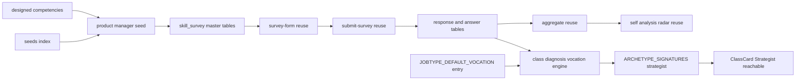

# Design Document — pdm-strategist-survey

## Overview

**Purpose**: プロダクトマネージャー（PdM）向けの独立スキルアンケート（`jobType='product-manager'`）を新設し、候補者本人のプロダクトマネジメントスキルバランスの理解と、採用側の一次フィルタ（PdM コンピテンシーのカバレッジ判定）を可能にする。同時に `JOBTYPE_DEFAULT_VOCATION` へ1行追加することで、既に定義済みの職掌「策士」とアーキタイプ「Strategist（戦略家）」を診断で開放する。

**Users**: 候補者（PdM 志望・現任）が回答し自己分析で結果を確認する。採用担当者は回答カバレッジを一次フィルタとして利用する。RPG クラス診断を閲覧する候補者は Strategist アーキタイプ・策士職掌を結果として得られるようになる。

**Impact**: 既存 skill-survey / self-analysis 基盤・`diagnosis-archetypes` 導出ロジックは survey 非依存に動作するため、新 survey は **seed 追加＋職掌マッピング1行**のみで一覧・回答・自己分析・クラス診断に反映される。スキーマ・`score_kind` enum・集計純関数・フォーム描画・送信・必須判定・クールダウン・履歴・可視化コンポーネント・`resolveArchetype`／`ARCHETYPE_SIGNATURES` はすべて無変更。コード成果物は ①`product-manager.ts` seed 新規作成 ②`seeds/index.ts` への登録 ③`definitions.ts` の `JOBTYPE_DEFAULT_VOCATION` 1行追加 ④冪等性・構造・職掌開放を検証する統合テスト に限定される。

### Goals

- `jobType='product-manager'` の独立 survey を seed で提供し、8コンピテンシーカテゴリで PdM 能力（プロダクトの what/why）を多角的にカバーする（Req 1, 2）。
- 各コンピテンシーに「実践してきたこと（breadth）」＋「コンピテンシー習熟度（proficiency）」を配置し、全8カテゴリを熟練度レーダーに乗せる（Req 5）。
- 冒頭に PdM 経験プロフィール、要所に自由記述を配置する（Req 2.2, 4.4）。
- EM（Commander＝人と組織のマネジメント）とコンピテンシー領域を重複させず、策士（PdM＝プロダクトの what/why）としての職能境界を明確にする（Req 3）。
- `JOBTYPE_DEFAULT_VOCATION` へ `product-manager` → `strategist` を1行追加し、`vocationVector.strategist` を回答から算出可能にする（Req 10）。
- 既存の回答保存・クールダウン・自己分析・版履歴・可視化・クラス診断判定ロジックを改修なしで再利用する（Req 8, 9, 12）。
- 既存アンケート・既存集計結果・既存6職掌のスコア算出の非回帰を担保する（Req 12）。

### Non-Goals

- 代表習熟度ペア（ツール選択方式）の採用（Req 5.4 によりコンピテンシー別習熟度を採る）。
- PdM のレベル（アソシエイト / シニア / VP of Product 等）や事業ドメイン（toB/toC、SaaS/マーケットプレイス等）別のアンケート出し分け（プロフィール設問で申告し、本体は単一トラック）。
- EM とのアンケート統合（両者は独立 jobType のまま維持する。Req 3.3）。
- `diagnosis-archetypes` のアーキタイプ導出ロジック・signature・`ClassCard`／`SharePanel` 表示の変更（既に `strategist: { vocation: { strategist: 0.9 }, pole: { planner: 0.4 } } ` として定義済み・本 spec は入力信号を非ゼロにするだけ）。
- 新規フォーム描画／可視化コンポーネントの実装、DB スキーマ・enum 変更、`CATEGORY_AFFINITY` への横断カテゴリ追加（本 spec のカテゴリはすべて `product-manager` の既定職掌へ素直に解決されるため不要と判断）。

## Boundary Commitments

### This Spec Owns

- `jobType='product-manager'` の survey マスタ定義（カテゴリ／サブカテゴリ／設問／選択肢／level／scoringKind／isRequired）と、その冪等 seed・登録。
- CSV を持たない設問・選択肢の設計内容。
- `apps/candidate/app/class-diagnosis/_lib/definitions.ts` の `JOBTYPE_DEFAULT_VOCATION` への `product-manager: 'strategist'` の1行追加。

### Out of Boundary

- フォーム描画（`survey-form.tsx`）、回答送信・必須検証・クールダウン（`submit-survey.ts` ほか）、自己分析の検出・集計・可視化（`aggregate()` / `coverage-bars.tsx` / `skill-balance-radar.tsx`）、版履歴 — survey 非依存のため**無変更で再利用**。
- `diagnosis-archetypes` の `resolveArchetype` / `ARCHETYPE_SIGNATURES` / `ArchetypeSymbol` / `ClassCard` / `SharePanel` — 既に策士職掌を消費する signature が定義済みであり、本 spec は入力（`vocationVector.strategist`）を非ゼロにするのみで、判定重み・提示ロジックには触れない。
- `resolveCategoryVocationWeights` の解決規約・`CATEGORY_AFFINITY` の既存エントリ・`SUB_VOCATION_RATIO` 等の判定パラメータ。
- 既存 IC アンケート（backend / frontend / ai-driven-development / infrastructure-sre）・engineering-manager アンケートの内容・必須判定・集計。
- EM アンケートが対象とするピープルマネジメント領域（1on1・フィードバック・採用面接・育成・評価・報酬・組織設計・エンゲージメント計測等）— 本アンケートのコンピテンシーには含めない（Req 3.1）。
- DB スキーマ・`score_kind` enum・共有コンポーネント。

### Allowed Dependencies

- 前提依存（マージ済み）: `skill-survey` 基盤、`skill-survey-proficiency-scale`（`choice.level` / `question.scoring_kind` / `aggregate()` の proficiency 拡張 / 熟練度レーダー）、`engineering-manager-survey`（設計駆動パターンの参照元）、`diagnosis-archetypes`（`Strategist` アーキタイプ・signature 定義済み、`Vocation` union に `strategist` 既存）。
- 既存テーブル: `skill_survey` 系4階層、`skill_survey_response` / `skill_survey_answer`、`self_analysis`。
- 既存設定: 再回答クールダウン（既定30日）。
- app-local: `apps/candidate/app/class-diagnosis/_lib/definitions.ts`（`JOBTYPE_DEFAULT_VOCATION` の1行追加のみ。同ファイルの他エクスポート・`resolveCategoryVocationWeights` の実装は変更しない）。
- 依存制約: パッケージ依存方向 `types → db → ai → apps`。seed は `@bulr/db` の schema/client のみ参照。`definitions.ts` の変更は app-local に閉じる。

### Revalidation Triggers

- seed 登録経路（`seeds/index.ts`）の構造変更。
- マスタ4階層のスキーマ・一意キー・`score_kind` enum 変更。
- 必須設問セットの変更（送信バリデーションの結果が変わる）。
- `Vocation` union・`JOBTYPE_DEFAULT_VOCATION` の型・`ARCHETYPE_SIGNATURES.strategist` の重み変更 → 本 spec が開放した策士職掌・Strategist アーキタイプへの到達性を再確認。

## Architecture

### Existing Architecture Analysis

- マスタ4階層・冪等 upsert・標準習熟度ラベルは engineering-manager / infrastructure-sre と同一。seed 共通ランナー `runSkillSurveySeed`（`packages/db/src/seeds/skill-surveys/runner.ts`）が survey→category→question→choice を `onConflictDoUpdate` で upsert する処理を一本化済みであり、本 spec の seed ファイルは `SkillSurveySeedData` 形状のデータ定義のみを持てばよい（各 seed ファイルに約100行のランナーを複製する必要はない）。
- 保持すべき不変点: survey 非依存性、集計純関数性、後方互換、依存方向 `apps → packages`。
- `JOBTYPE_DEFAULT_VOCATION`（`definitions.ts`）は「対応 survey を追加すれば1行足すだけで自動的に開放される」設計になっており（既存コメントで明記）、本 spec はその設計が想定する初のリアル追加ケースである。

### Architecture Pattern & Boundary Map



**Key Decisions**: 既存 seed パターンの複製＋既定職掌マッピングへの1行追加。新規アーキテクチャ要素なし。本 spec は `product-manager.ts`・`seeds/index.ts` の登録行・`definitions.ts` の `JOBTYPE_DEFAULT_VOCATION` 1行のみ所有する。

### Technology Stack

| Layer | Choice / Version | Role in Feature | Notes |
| ----- | ---------------- | --------------- | ----- |
| Data / Storage | drizzle-orm（既存）/ PostgreSQL | seed の冪等 upsert | 既存 schema、マイグレーション無し |
| Tooling | tsx（既存） | `seeds/index.ts` CLI 実行 | `tsx packages/db/src/seeds/index.ts` |
| Test | vitest（既存） | 冪等・構造・職掌開放検証（DB ゲート） | `DATABASE_URL` 未設定時 skip、クリーン DB 推奨、`fileParallelism:false` |

## File Structure Plan

### Created Files

```
packages/db/src/
├── seeds/skill-surveys/
│   └── product-manager.ts               # seed データ定義（SkillSurveySeedData 形状。runSkillSurveySeed を利用、engineering-manager.ts と同型）
└── __tests__/
    └── product-manager-survey.integration.test.ts   # 冪等性・構造検証（DB ゲート）
```

### Modified Files

- `packages/db/src/seeds/index.ts` — `runProductManagerSkillSurveySeed` の re-export を追加し、`main()` の実行列へ engineering-manager の直後に追加。
- `apps/candidate/app/class-diagnosis/_lib/definitions.ts` — `JOBTYPE_DEFAULT_VOCATION` に `"product-manager": "strategist"` を1行追加（該当 union コメント「sage・strategist は対応 survey 未整備のため本マップに含めない」を strategist について解消する記述へ更新）。他のエクスポート・`resolveCategoryVocationWeights` の実装は変更しない。

## 設問設計（中核）

CSV を持たないため本セクションが設問の正本。標準習熟度ラベル（level 0–3）: L0 未経験・知識なし／L1 学習・理解はある（実務経験なし）／L2 実務で実践したことがある／L3 設計・改善を主導／チームへ展開・標準化した（engineering-manager と同一ラベルセットを再利用）。

### 職能境界（重要・設計原則）

本アンケートは「プロダクトの what/why」（何を作るべきか、なぜそれを作るのか）に関するコンピテンシーのみを扱う。以下は EM アンケートの領域であり本アンケートには**含めない**（Req 3.1, 3.2）:

- 部下の1on1・フィードバック・信頼構築・心理的安全性の醸成（EM「ピープルマネジメント」）
- 採用要件定義・構造化面接・オンボーディング（EM「採用・チーム組成」）
- キャリアラダー・コーチング・後継者育成（EM「育成・キャリア支援」）
- 目標設定（OKR/MBO）・評価レビュー・報酬・昇進（EM「パフォーマンスマネジメント」）
- 組織設計・目標カスケード（EM「戦略・組織運営」の人事的側面）

「ステークホルダー・組織連携」（カテゴリ6）は EM の「ステークホルダー・コミュニケーション」と類似の名称になり得るため、本アンケートでは対象を**プロダクト意思決定の合意形成**（経営承認・営業/CS からの要望収集・開発/デザインとの握り・顧客ヒアリング）に限定し、部下の人事評価や採用面接は含めないことを設問文で明示する（Req 3.2）。

### PdM経験プロフィール（先頭・集計対象外）

カテゴリ `PdM経験プロフィール`（displayOrder 0）。全設問 `single_choice`・`scoringKind` 無し・`isRequired=false`。

| 設問 | 選択肢 |
| ---- | ------ |
| PdM 経験年数を選択してください。 | 未経験・1年未満 / 1〜3年 / 3〜5年 / 5〜10年 / 10年以上 |
| 直近で担当したプロダクトのフェーズを選択してください。 | 0→1（新規立ち上げ） / PMF 前後 / スケール期（成長） / 成熟期・グロース / 複数プロダクトのポートフォリオ管理 |
| 事業サイド（営業・マーケティング・事業開発等）との兼務経験はありますか？ | はい / いいえ |

### コンピテンシーカテゴリ（8）

各カテゴリは1カテゴリオブジェクト（subcategory='コンピテンシー'、一部に自由記述）で、**2つの breadth 設問（multi_choice）＋1つの習熟度設問（single_choice, proficiency）**で構成。先頭 breadth に `isRequired=true`。習熟度設問の本文は「〈カテゴリ〉の習熟度を選択してください。」、選択肢は標準習熟度ラベル。

| # | カテゴリ | breadth-A（必須・実践）／breadth-B（実践）の主旨 | 追加 | EMとの弁別 |
| - | -------- | --------------------------------------------------- | ---- | ---------- |
| 1 | プロダクト戦略 | A: ビジョン・ミッション策定、事業戦略との接続 ／ B: 市場・競合分析、プロダクトポジショニング | free_text「プロダクト戦略の思想・判断基準」 | 組織のビジョンではなくプロダクトのビジョンを扱う |
| 2 | ディスカバリー・顧客理解 | A: 顧客インタビュー・ユーザーリサーチ設計 ／ B: ペルソナ・ジョブ理論・課題仮説検証 | — | 採用面接（対候補者）ではなく対顧客のヒアリング |
| 3 | 優先順位付け・意思決定 | A: 優先順位フレームワーク運用（RICE/ICE等）・トレードオフ判断 ／ B: 撤退・Go/No-Go判断、不確実性下の意思決定 | — | 人事評価の判断ではなくプロダクト施策の判断 |
| 4 | ロードマップ・実行推進 | A: ロードマップ策定・要求仕様定義（PRD） ／ B: 開発チームとの実行伴走、スコープ調整 | — | チーム編成ではなくプロダクト実行計画 |
| 5 | データドリブン運用 | A: KPI設計・ダッシュボード運用 ／ B: A/Bテスト設計・分析、実験からの意思決定 | free_text「データが意思決定を覆した経験」 | 生産性メトリクス（DORA/SPACE、EM領域）ではなくプロダクト指標 |
| 6 | ステークホルダー・組織連携 | A: 経営・営業・CSからの要望収集と合意形成 ／ B: 開発・デザインとの協働、期待値調整 | — | 対象は「プロダクト意思決定の合意形成」に限定。部下の人事評価・採用面接は含まない |
| 7 | GTM・グロース連携 | A: ローンチ計画・GTM戦略立案 ／ B: グロース施策（オンボーディング改善・リテンション・バイラリティ）との連携 | — | マーケティング施策の実行ではなく施策への関与・連携 |
| 8 | UX・ビジネス・テクノロジーの越境 | A: UXデザインレビュー・情報設計への関与 ／ B: 技術的制約の理解、エンジニアとのトレードオフ議論 | — | 技術方針の最終決定（EM領域）ではなく越境的な理解・議論への関与 |

合計: プロフィール3 + コンピテンシー8×3（=24）+ 自由記述2 = **約29設問**。必須8（各コンピテンシー先頭 breadth）、proficiency 8（コンピテンシーごと1）。

> 規模補足: EM（約36設問・10コンピテンシー）より少ないカテゴリ数だが、選択肢密度（各 breadth 5〜6択）は同水準を維持する。カテゴリをさらに分割すれば拡張可能（seed 冪等のため後追い容易）。

## Data Models

既存スキーマを変更なしで使用。seed が書き込むレコード形状:

- `skill_survey`: `{ jobType:'product-manager', title:'プロダクトマネージャー スキルアンケート', isActive:true }`
- `skill_survey_category`: `{ skillSurveyId, name, subcategory, displayOrder }`（(surveyId,name,subcategory) 一意）
- `skill_survey_question`: `{ categoryId, body, questionType, scoringKind|null, isRequired, displayOrder }`（(categoryId,body) 一意）
- `skill_survey_choice`: `{ questionId, label, level|null, displayOrder }`（(questionId,label) 一意）

不変条件: proficiency 設問の各選択肢に level 0–3 を昇順付与。breadth multi_choice / プロフィール single_choice / free_text の選択肢は level 無し（null）。

### 職掌マッピング（`definitions.ts`）

`JOBTYPE_DEFAULT_VOCATION` は `Record<string, Vocation>`。本 spec は次のキーを1件追加する（既存キーの値は変更しない）:

```typescript
export const JOBTYPE_DEFAULT_VOCATION: Record<string, Vocation> = {
  frontend: "vanguard",
  backend: "rearguard",
  "infrastructure-sre": "guardian",
  "engineering-manager": "commander",
  "ai-driven-development": "ranger",
  "product-manager": "strategist", // 追加: 本 spec
};
```

追加後、`resolveCategoryVocationWeights('product-manager', anyCategoryName)` は `CATEGORY_AFFINITY` に明示エントリが無い限り `{ strategist: 1 }` へ決定論的に解決される（既存 resolver ロジック不変・本 spec のカテゴリはいずれも横断カテゴリでないため `CATEGORY_AFFINITY` への追加は不要）。回答が集計されると `vocationVector.strategist` が0より大きくなり、`ARCHETYPE_SIGNATURES.strategist`（`diagnosis-archetypes` で定義済み・変更なし）を通じて Strategist アーキタイプが到達可能になる。

## Error Handling

- seed はトランザクション内で実行し、いずれかの upsert 失敗時に全体ロールバック（engineering-manager 同型、共通ランナー `runSkillSurveySeed` が担保）。
- 必須/送信バリデーション・クールダウンは既存 `submit-survey.ts` が担当（本 spec は seed の `isRequired` 付与のみ）。
- `JOBTYPE_DEFAULT_VOCATION` はコンパイル時に `Record<string, Vocation>` として型検査されるため、無効な `Vocation` 値の追加はビルドエラーで検出される。

## Testing Strategy

### Integration Tests（DB ゲート、`packages/db/src/__tests__/product-manager-survey.integration.test.ts`）

1. **冪等性**（Req 11.2）: `runProductManagerSkillSurveySeed` を2〜3回実行し設問・選択肢件数が増えない。
2. **survey 提供**（Req 1.1）: `jobType='product-manager'` が1件・`isActive=true`・期待 title。
3. **カテゴリ構成**（Req 2.1）: コンピテンシー8カテゴリが存在し、PdM経験プロフィールが displayOrder 最小（先頭）。
4. **コンピテンシー別習熟度**（Req 5.1, 5.3, 6.1）: 各コンピテンシーカテゴリに breadth multi_choice と proficiency single_choice が共存し、proficiency 設問は計8・選択肢 level 0–3。
5. **必須設問**（Req 7.1）: `isRequired=true` が各コンピテンシーに最低1件・計8件、プロフィール設問は必須でない。
6. **enum 健全性**（Req 6.3）: 使う scoringKind は `proficiency` のみ（recency/frequency/polarity 未使用）。
7. **自由記述**（Req 4.4）: free_text 設問が存在し、いずれも `isRequired=false`。
8. **EM 領域非重複**（Req 3.1）: PdM survey の設問本文・カテゴリ名が EM survey の対象領域キーワード（1on1・採用要件・評価レビュー・報酬等）と重複しないことをテキストレベルで確認（既存 EM seed データとの突合）。
9. **非回帰**（Req 12.1）: backend / frontend / ai-driven-development / infrastructure-sre / engineering-manager / product-manager の6 seed 投入で各 jobType が衝突せず共存することを確認。

### Unit Tests（`apps/candidate/app/class-diagnosis/_lib/definitions.test.ts` への追加、既存ファイルがあれば追加、無ければ本 spec で新規作成）

1. **職掌開放**（Req 10.1, 10.2）: `JOBTYPE_DEFAULT_VOCATION['product-manager']` が `'strategist'` であること。
2. **既存マッピング非破壊**（Req 10.3, 12.3）: 既存5 jobType（frontend/backend/infrastructure-sre/engineering-manager/ai-driven-development）の既定職掌マッピング値が変更されていないこと。
3. **resolver 経由の解決**（Req 10.4）: `resolveCategoryVocationWeights('product-manager', '任意のカテゴリ名')` が `{ strategist: 1 }` を返すこと（`CATEGORY_AFFINITY` に明示エントリが無い場合のフォールバック確認）。

## Requirements Traceability

| Requirement | Summary | Design Element |
| ----------- | ------- | -------------- |
| 1.1–1.4 | PdM survey 提供・独立性 | `product-manager.ts` survey 定義 / 既存一覧の survey 非依存表示 |
| 2.1–2.4 | 8コンピテンシー・プロフィール・順序・ボリューム | 設問設計（プロフィール＋8カテゴリ）/ displayOrder 規約 |
| 3.1–3.3 | EM境界（人と組織 vs プロダクトwhat/why） | 職能境界セクション / カテゴリ6の対象限定 / 独立 jobType 維持 |
| 4.1–4.5 | ハイブリッド形式・ラベル・既存描画 | 設問設計の型指定 / 標準習熟度ラベル / free_text / 既存 `questionType` 描画 |
| 5.1–5.4 | コンピテンシー別習熟度・代表ペア不採用 | 各コンピテンシーの breadth＋proficiency / Non-Goals |
| 6.1–6.3 | proficiency 付与・経験/プロフィールは分類なし・enum 不変 | Data Models 不変条件 / Test 4,6 |
| 7.1–7.4 | 必須・バリデーション | 必須設問規約（各コンピテンシー先頭 breadth）/ 既存 `submit-survey.ts` |
| 8.1–8.4 | 永続化・クールダウン・版 | 既存 response/answer・クールダウン・履歴（無変更） |
| 9.1–9.4 | 自己分析スナップショット・可視化 | 既存 `aggregate()` / 可視化（無変更） |
| 10.1–10.4 | 職掌マッピングによるStrategist開放 | `JOBTYPE_DEFAULT_VOCATION` 1行追加 / resolver 経由の解決 / Unit Test 1–3 |
| 11.1–11.4 | 冪等 seed・登録・level/分類付与 | `runProductManagerSkillSurveySeed` / `index.ts` / Integration Test 1,4 |
| 12.1–12.4 | 非回帰 | Non-Regression Integration Test 9 / Unit Test 2 / スキーマ・共有無変更 |
