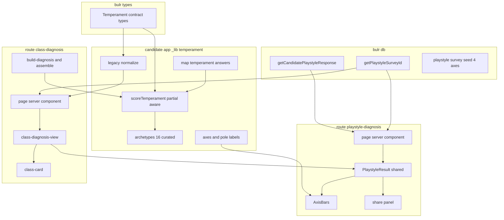
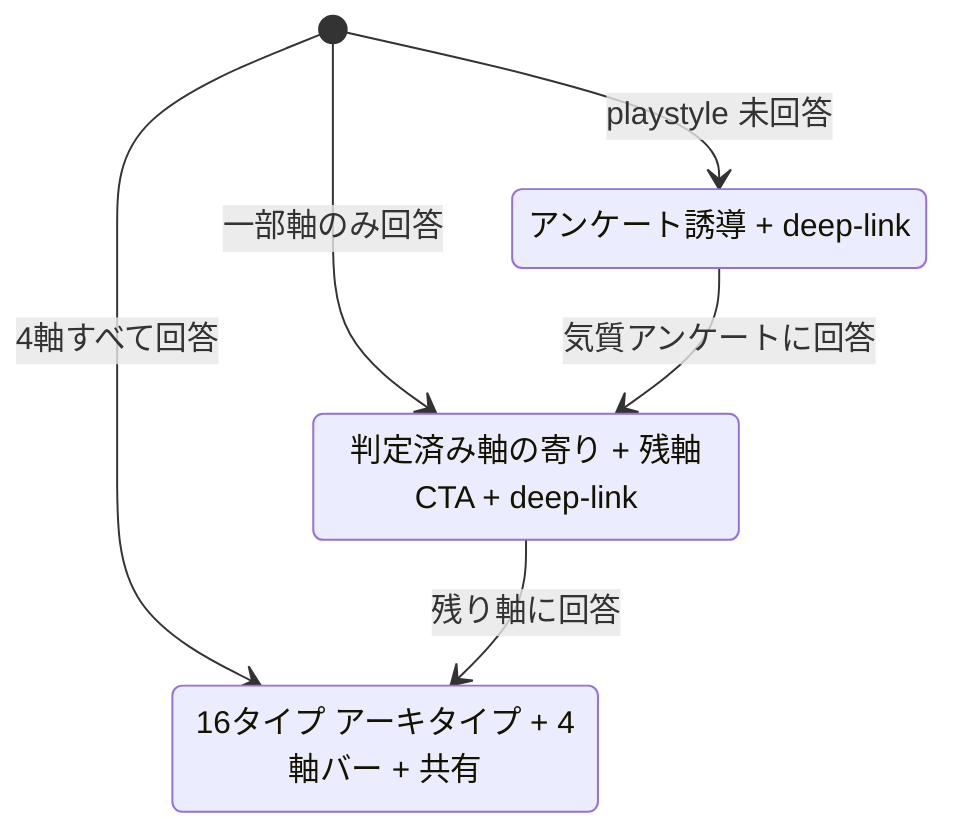
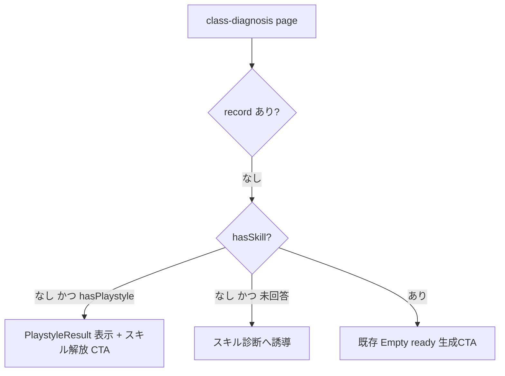

# Design Document — playstyle-diagnosis

## Overview

**プレイスタイル診断** は、候補者の「気質（どう働くか）」を4軸×2極＝16タイプのアーキタイプとして独立に自己診断させる機能である。既存 `rpg-class-diagnosis`（main マージ済）の気質レイヤー（2軸4象限）を拡張し、(1) 気質タイプを軸×極から決定論導出する拡張可能モデルに作り替え、(2) 独立した結果体験（アーキタイプ提示・4軸可視化・共有）と専用ページを新設し、(3) 気質パスの導線の穴（気質のみ回答者の行き止まり／CTAの一覧止まり）を塞ぐ。

**Users**: apps/candidate の認証済み候補者。気質アンケートに回答し、`/playstyle-diagnosis` またはクラス診断ページから自分の気質タイプを受け取る。

**Impact**: 気質判定は決定論的（同一回答→同一タイプ）でLLM非依存。数値スコアは非表示。RPGクラス診断は本機能と**同一の気質判定を単一ソース**として共有する。永続化済み `ClassResult`（旧4型）は後方互換で無害に描画する。

### Goals

- 気質を4軸×2極＝16タイプで表現し、軸の追加・改名を定義データ変更のみで行える拡張可能モデルにする（R1）。
- 独立したプレイスタイル診断の結果体験（アーキタイプ・4軸可視化・キュレーテッド文言・共有）を提供する（R2, R4）。
- 回答充足度（未回答／一部軸／全軸）に応じた導出と誘導、目的アンケートへの直行導線を実現する（R3, R6）。
- 気質アンケートを4軸構成に拡張する（R5）。
- RPGクラス診断が同一気質判定を共有し、旧レコードが壊れないようにする（R7）。

### Non-Goals

- 診断ファミリー共通ハブ／結果枠の基盤化（2つ目メンバーが揃うまで抽出しない）。
- プレイスタイル診断結果のDB永続化・履歴・版間比較。
- 地頭診断・仕事力診断そのものの実装。
- `survey_kind` enum への値追加（本specでは `playstyle` のまま）。

## Boundary Commitments

### This Spec Owns

- 気質判定コア：4軸定義・極トークン・充足度・16タイプcode導出・アーキタイプ文言・スコアリング（partial対応）。契約型 `TemperamentAxis`/`TemperamentPole`/`TemperamentSummary`（`@bulr/types`）と app-local 実装。
- プレイスタイル診断の独立UI（`/playstyle-diagnosis`）と共有プレゼンテーション `PlaystyleResult`・4軸バー・共有パネル。
- 気質アンケート seed の4軸拡張（`playstyle` survey）。
- 気質CTAの deep-link 解決（`getPlaystyleSurveyId`）とクラス診断ページの状態分岐（気質のみ回答者の受け皿）。
- RPGクラス統合：`ClassResult.temperament` の型変更、className の簡潔化、旧4型レコードの互換正規化。

### Out of Boundary

- RPGクラス診断の職掌判定・称号判定・生成/保存フロー・cooldown・LLMフレーバー生成の仕組み（気質の型・className・互換に限り触れる）。
- business アプリの代表クラス表示（`getRepresentativeClass` は className/職掌/称号のみ返し気質構造に触れないため影響なし）。
- 気質結果の永続化・履歴。

### Allowed Dependencies

- 依存方向 `@bulr/types → @bulr/db → @bulr/ai-* → apps/candidate` を厳守。気質の構造契約型は `@bulr/types` が正本。アーキタイプ名・ラベル・スコアリング等のロジック/コンテンツは app-local。
- 既存 `getCandidatePlaystyleResponse`（db）・skill-survey seed runner・survey フォーム `/skill-survey/[surveyId]`・`requireCandidate`（auth）を再利用。
- 新規外部依存なし。4軸可視化は素の SVG/CSS（recharts 不使用）。

### Revalidation Triggers

- `ClassResult` の `temperament` フィールド形状変更 → `@bulr/ai-class-diagnosis`（ClassResult 消費）と `class_diagnosis.result` jsonb 読取箇所は再検証必須。
- `TemperamentSummary` / `TemperamentAxis` 契約変更 → クラスカード・className 組成・legacy 正規化を再検証。
- className 組成フォーマット変更 → business 代表クラス表示（表示は文字列そのままだが）と共有テキストを再確認。
- playstyle seed のカテゴリ名変更 → `PLAYSTYLE_CATEGORY_AXIS` マッピングを再検証（カテゴリ名は軸キー）。

## Architecture

### Existing Architecture Analysis

- 気質判定は既に決定論純関数（`scoreTemperament` → `assembleClass`）としてクラス診断に組み込まれている。本機能はこの純関数群を**拡張・共有化**し、独立UIから同一関数を呼ぶ。
- 気質構造の union（`TemperamentAxis`/`Temperament`）は `@bulr/types` が正本、ラベル等は app-local `definitions.ts`。この2層分離を維持し、4軸16型でも「構造は types・コンテンツは app-local」を守る。
- `class_diagnosis.result` は `.$type<ClassResult>()` の jsonb。**`.$type` はコンパイル時のみで実行時は生JSON**のため、型変更してもDBマイグレーションは不要だが、旧shape（`temperament: 'explorer_solo'`）を読む正規化が要る。
- 気質のみ回答者は現状 `class-diagnosis-view` の `NoVocation`（`!record && !hasSkill`）に吸収され行き止まり。ここを `hasPlaystyle` で分岐する。

### Architecture Pattern & Boundary Map



**Architecture Integration**:
- **Selected pattern**: 決定論パイプライン（回答→純関数判定→表示）＋共有プレゼンテーション。standalone は永続化・Server Action・LLM を持たず Server Component 内でライブ算出。
- **Domain boundaries**: 「気質判定コア（純関数・content）」を app-shared `_lib/temperament/` に単一集約し、standalone とクラス診断の双方が同一関数を使う（R7.1 単一ソース、No Hidden Shared Ownership 解消）。UIは `PlaystyleResult` を単一実装として両ルートでマウント（二重化しない）。
- **Existing patterns preserved**: 数値非表示、types↔app-local 分離、seed runner 冪等 upsert、共有パネルの PII 非含。
- **New components rationale**: 4軸バーは bipolar 表現が recharts レーダーに不適合のため新規（素の SVG/CSS）。`getPlaystyleSurveyId` は `[surveyId]` が UUID 解決のため deep-link に必須。

### Technology Stack

| Layer | Choice / Version | Role in Feature | Notes |
| --- | --- | --- | --- |
| Frontend | Next.js 16 App Router / React 19 | 独立ルート・Server Component ライブ算出・共有プレゼン | 既存 candidate と同一 |
| 判定ロジック | TypeScript 純関数（app-local） | 気質スコアリング・code導出・legacy正規化・archetype | DB/LLM非依存・単体テスト |
| 契約型 | `@bulr/types` | 気質構造契約（axis/pole/summary） | jsonb 契約の正本 |
| Data | `@bulr/db`（Drizzle） | playstyle 回答取得・survey id 解決・seed | スキーマ変更なし |
| 可視化 | 素の SVG/CSS | 4軸バイポーラバー（数値非表示） | 新規依存なし |

## File Structure Plan

### New Files

```
packages/types/src/
└── temperament.ts                 # TemperamentAxis(4) / TemperamentPole / TemperamentCode /
                                    #   TemperamentCompleteness / TemperamentSummary / LegacyTemperament

apps/candidate/app/_lib/temperament/   # 気質判定コア（standalone と class が共有する単一ソース）
├── axes.ts        # 4軸定義・極トークン・軸/極ラベル・canonical order・midpoint
├── archetypes.ts  # 16 code -> { name, shortLabel, description, nextStep }（キュレーテッド）
├── score.ts       # scoreTemperament(answers)->TemperamentProfile / toSummary / deriveCode
├── answers.ts     # PLAYSTYLE_CATEGORY_AXIS（seed カテゴリ名->軸）＋ mapTemperamentAnswers(playstyle)
                    #   ->TemperamentAnswer[]（build-diagnosis から移設・seed 契約の単一ソース）
└── legacy.ts      # normalizeClassResultTemperament(raw)->TemperamentSummary | null（旧4型互換）

apps/candidate/app/playstyle-diagnosis/
├── page.tsx                       # Server Component: auth->fetch->score->deep-link 解決->render
└── _components/
    ├── playstyle-result.tsx       # 共有プレゼン（none/partial/full 分岐）。class からも使用
    ├── axis-bars.tsx              # 4軸バイポーラバー（数値非表示, R2.3）
    └── playstyle-share-panel.tsx  # アーキタイプ名のみの共有（PII非含, R4）

packages/db/src/queries/class-diagnosis/
└── get-playstyle-survey-id.ts     # getPlaystyleSurveyId(): playstyle survey の id or null
```

### Modified Files

- `packages/types/src/class-diagnosis.ts` — `ClassResult.temperament: TemperamentSummary | null` へ変更、`temperamentBalanced` 廃止（summary 内 `balancedAxes` へ）。旧 `Temperament` 4値 union は `LegacyTemperament`（temperament.ts）として legacy 正規化の入力にのみ残す。
- `packages/types/src/index.ts` — `temperament.ts` の型を re-export。
- `packages/db/src/queries/class-diagnosis/index.ts`（バレル）— `getPlaystyleSurveyId` 登録。
- `packages/db/src/seeds/skill-surveys/playstyle.ts` — カテゴリ「計画と即興」「堅実と挑戦」×6問（natural×3＋reverse×3）を追加し4軸24問化。冪等 upsert 維持。
- `packages/ai/class-diagnosis/*`（@bulr/ai-class-diagnosis）— `ClassResult` 消費箇所を新 `temperament` 形状に追従（**必須**: 型変更は types→ai の依存で必ず波及するため実装時に参照箇所を確認し、`temperament` enum 直接参照があれば修正。className 文字列利用なら最小変更）。
- `apps/candidate/app/class-diagnosis/_lib/**/*.test.ts` ほか既存 rpg-class-diagnosis テスト群 — `ClassResult.temperament`（summary 化）・`temperamentBalanced` 廃止・className 簡潔化の契約変更に追従して更新（旧4型前提のアサーションを新契約へ）。
- `apps/candidate/app/class-diagnosis/_lib/definitions.ts` — 気質ラベル/軸定義を `_lib/temperament/axes.ts` へ移設し re-export（職掌・称号定義は残す）。
- `apps/candidate/app/class-diagnosis/_lib/temperament.ts` — `_lib/temperament/score.ts` へ統合（旧2軸実装を4軸partial対応へ置換）。
- `apps/candidate/app/class-diagnosis/_lib/build-diagnosis.ts` — `PLAYSTYLE_CATEGORY_AXIS`（4軸ぶん）と `mapTemperamentAnswers` を `_lib/temperament/answers.ts` へ移設し import に切替（seed 契約の単一ソース化）、`computeClassResult` は新 profile→summary を採用。
- `apps/candidate/app/class-diagnosis/_lib/assemble.ts` — `composeClassName` を簡潔化（full 時のみ `shortLabel` を埋め込み、partial/none は気質省略）、`ClassResult.temperament` に summary を格納。
- `apps/candidate/app/class-diagnosis/_components/class-card.tsx` — 気質を summary（poles/shortLabel）から描画、partial 時は「残り軸に回答」導線。
- `apps/candidate/app/class-diagnosis/_components/class-diagnosis-view.tsx` — `NoVocation` を分岐（`hasPlaystyle` → `PlaystyleResult` ＋ skill 解放 CTA）、気質CTAを deep-link href へ。
- `apps/candidate/app/class-diagnosis/page.tsx` — playstyle profile 算出・`playstyleSurveyHref` 解決・legacy 正規化を適用して view へ渡す。
- `apps/candidate/app/class-diagnosis/_components/vocation-radar.tsx` — 未使用 `temperamentAxes` prop 撤去。
- `apps/candidate/app/_components/nav-items.ts` — `/playstyle-diagnosis`（プレイスタイル診断）を追加。

## System Flows

### 状態導出（充足度）



**Key decisions**: 状態は `TemperamentProfile.completeness`（`none`/`partial`/`full`）から一意に導出。`completeness='full'` のときのみ `code` 非null＝アーキタイプ確定。未回答軸は**中点で埋めず** `determined=false` とする（R3.2、旧実装の中点フォールバックを廃止）。

### 気質のみ回答者のクラス診断ページ導線（R6.2/6.3）



## Requirements Traceability

| Requirement | Summary | Components | Interfaces | Flows |
| --- | --- | --- | --- | --- |
| 1.1–1.6 | 4軸16型・軸×極ジェネリック・決定論・LLM非依存 | axes.ts, score.ts, archetypes.ts, `@bulr/types` temperament | `scoreTemperament`, `deriveCode`, `TemperamentSummary` | 状態導出 |
| 2.1,2.4 | アーキタイプ名＋説明＋次の一歩（キュレーテッド） | archetypes.ts, playstyle-result | `TEMPERAMENT_ARCHETYPES` | — |
| 2.2 | 4軸の寄りの可視化 | axis-bars | `AxisBarsProps` | — |
| 2.3 | 数値スコア非表示 | axis-bars, playstyle-result, class-card | — | — |
| 2.5 | 専用ページ | playstyle-diagnosis/page, nav-items | route | — |
| 3.1–3.4 | 未/一部/全 の導出・中点拮抗 | score.ts, playstyle-result | `TemperamentProfile.completeness` | 状態導出 |
| 3.5 | 回答更新で最新結果 | playstyle-diagnosis/page（ライブ算出） | `getCandidatePlaystyleResponse` | — |
| 4.1–4.3 | アーキタイプ名の共有・PII非含・保存不要 | playstyle-share-panel | share text builder | — |
| 5.1–5.4 | 4軸アンケート・軸対応・極向き・冪等 | playstyle seed, `_lib/temperament/answers.ts`（axis map） | `PLAYSTYLE_CATEGORY_AXIS` | — |
| 5.5 | 職種一覧から分離維持 | （既存 answered-surveys-query, 変更なし） | — | — |
| 6.1 | deep-link 直行 | get-playstyle-survey-id, class-diagnosis-view | `getPlaystyleSurveyId` | — |
| 6.2,6.3 | 気質のみ回答者の受け皿＋次の一歩 | class-diagnosis-view, playstyle-result | — | 導線 flow |
| 6.4 | 本人スコープ | 各 page（requireCandidate） | `requireCandidate` | — |
| 7.1 | 気質判定 単一ソース | `_lib/temperament`（共有コア） | `scoreTemperament` | — |
| 7.2 | className 簡潔記述 | assemble.ts | `composeClassName` | — |
| 7.3,7.4 | 旧4型レコード互換・partial扱い | legacy.ts, class-diagnosis/page, class-card | `normalizeClassResultTemperament` | — |
| 7.5 | 再診断で16型反映 | build-diagnosis, generate action（既存フロー） | `computeClassResult` | — |

## Components and Interfaces

| Component | Domain/Layer | Intent | Req Coverage | Key Dependencies (P0/P1) | Contracts |
| --- | --- | --- | --- | --- | --- |
| temperament types | types | 気質構造契約 | 1 | — | State |
| score.ts | app core | 気質スコアリング・code導出・summary射影 | 1,3,7 | axes(P0), types(P0) | Service |
| archetypes.ts | app core | 16タイプ キュレーテッド文言 | 2 | axes(P0) | State |
| legacy.ts | app core | 旧4型→summary 正規化 | 7 | types(P0) | Service |
| getPlaystyleSurveyId | db | deep-link 用 survey id 解決 | 6 | skill-survey schema(P0) | Service |
| playstyle-diagnosis/page | UI(server) | ライブ算出＋状態描画 | 2,3,6 | score(P0), getCandidatePlaystyleResponse(P0), getPlaystyleSurveyId(P1) | — |
| PlaystyleResult | UI | 共有プレゼン（none/partial/full） | 2,3,6 | axis-bars(P0), archetypes(P0) | State |
| AxisBars | UI | 4軸バイポーラ可視化 | 2 | axes(P0) | — |
| playstyle-share-panel | UI | アーキタイプ名共有 | 4 | archetypes(P1) | — |

### 気質判定コア（app core）

#### score.ts

| Field | Detail |
| --- | --- |
| Intent | 気質回答を4軸で採点し、充足度・極・16型code を持つ profile を決定論導出、ClassResult 用 summary へ射影 |
| Requirements | 1.2, 1.5, 1.6, 3.1, 3.2, 3.3, 3.4, 7.1 |

**Responsibilities & Constraints**
- 各軸: 回答済み設問の post-reverse 正規化平均（0..100）。**回答が無い軸は `determined=false`（中点で埋めない）**。
- 極: `score > midpoint → 第2極`、`<= midpoint → 第1極（既定極）`。`score === midpoint` は既定極＋`balanced=true`。
- `completeness`: determined 軸数が 0→`none` / 4→`full` / それ以外→`partial`。
- `code`: `completeness==='full'` のときのみ、canonical order の極トークンを決定論連結。それ以外は null。
- DB/LLM/乱数/時刻に非依存の純関数。

**Contracts**: Service [x] / State [ ]

```typescript
// 4軸（canonical order = code 生成順・バー表示順）
type TemperamentAxis =
  | 'explorationDeepening'  // 探索 ⇔ 深化
  | 'soloCollaboration'     // 個人 ⇔ 協調
  | 'planningImprovisation' // 計画 ⇔ 即興
  | 'stabilityChallenge';   // 堅実 ⇔ 挑戦

// 極は軸ごとの2値 union に分割し、code をこれらの直積の template-literal 型として型で網羅する。
type ExplorationPole = 'explorer' | 'deepener';
type SocialPole = 'solo' | 'collab';
type ProcessPole = 'planner' | 'improviser';
type RiskPole = 'stabilizer' | 'challenger';
type TemperamentPole = ExplorationPole | SocialPole | ProcessPole | RiskPole;

type TemperamentCompleteness = 'none' | 'partial' | 'full';
// canonical order の極を '-' 連結した16通りを型として列挙（archetype キー欠落をコンパイルで検出）。
type TemperamentCode = `${ExplorationPole}-${SocialPole}-${ProcessPole}-${RiskPole}`;

interface AxisReading {
  score: number;     // 0..100（内部値・UI非露出）
  pole: TemperamentPole;
  determined: boolean;
  balanced: boolean; // 中点ちょうど
}

interface TemperamentProfile {         // ライブ算出のリッチ表現（standalone 用）
  axes: Record<TemperamentAxis, AxisReading>;
  completeness: TemperamentCompleteness;
  code: TemperamentCode | null;
}

interface TemperamentSummary {         // ClassResult 保存用のコンパクト射影（@bulr/types）
  poles: Partial<Record<TemperamentAxis, TemperamentPole>>; // determined 軸のみ
  balancedAxes: TemperamentAxis[];
  code: TemperamentCode | null;
  completeness: TemperamentCompleteness;
}

interface TemperamentAnswer { axis: TemperamentAxis; level: number; reverse: boolean; maxLevel: number; }

function scoreTemperament(answers: TemperamentAnswer[]): TemperamentProfile;
function toSummary(profile: TemperamentProfile): TemperamentSummary;
function deriveCode(poles: Record<TemperamentAxis, TemperamentPole>): TemperamentCode;
```
- Preconditions: `answers` の axis は4軸のいずれか。空配列可（→ completeness='none'）。
- Postconditions: `axes` は常に4軸キー完備（未回答軸は `determined=false`）。同一入力→同一出力。
- Invariants: `code` 非null ⇔ `completeness==='full'`。スコア数値は返り値に含むが UI へは露出しない。

#### archetypes.ts / axes.ts

| Field | Detail |
| --- | --- |
| Intent | 16タイプの表示コンテンツ（キュレーテッド）と、4軸・8極のラベル定義 |
| Requirements | 1.3, 2.1, 2.2 |

**Contracts**: State [x]
```typescript
interface Archetype { name: string; shortLabel: string; description: string; nextStep: string; }
// Record<TemperamentCode, Archetype> により16 code の網羅を**コンパイル時に型強制**（欠落＝型エラー）。
// テストは網羅の補助（型が主保証）。
const TEMPERAMENT_ARCHETYPES: Record<TemperamentCode, Archetype>;
// 例: 'explorer-solo-planner-stabilizer' -> { name:'堅実なる独学の設計者', shortLabel:'設計者', ... }
const AXES: readonly TemperamentAxis[];                 // canonical order
const AXIS_LABELS: Record<TemperamentAxis, { first: string; second: string; title: string }>;
const POLE_LABELS: Record<TemperamentPole, string>;
```
**Implementation Notes**
- Integration: `name`/`description`/`nextStep` は standalone のフル提示、`shortLabel` は className の簡潔記述（R7.2）に使う。
- Validation: 16 code 網羅は `Record<TemperamentCode, Archetype>` の型で強制（R1.3）。数値・他者比較を文言に含めない（R2.3）。
- Risks: 16文言のトーン一貫性はコンテンツ品質課題（実装時レビュー）。

#### legacy.ts

| Field | Detail |
| --- | --- |
| Intent | 永続化済み旧 `ClassResult`（`temperament: 'explorer_solo'|...|null` ＋ `temperamentBalanced`）を新 `TemperamentSummary` へ正規化 |
| Requirements | 7.3, 7.4 |

**Contracts**: Service [x]
```typescript
type LegacyTemperament = 'explorer_solo' | 'explorer_collab' | 'deepener_solo' | 'deepener_collab';
function normalizeClassResultTemperament(
  raw: TemperamentSummary | LegacyTemperament | null,
): TemperamentSummary | null;
```
- 旧値 → explorationDeepening/soloCollaboration の2極のみ `determined`、planningImprovisation/stabilityChallenge は未含（`completeness='partial'`, `code=null`）。
- 既に新 summary 形状ならそのまま返す（冪等）。`null`→`null`。総関数（throw しない）。
**Implementation Notes**
- Integration: `class-diagnosis/page.tsx` が `getLatestClassDiagnosis` の `result.temperament` に適用。旧 `className` 文字列は再組成せずそのまま表示（無害, R7.3）。partial のため class-card は「残り軸に回答」導線を出す（R7.4）。

### db

#### getPlaystyleSurveyId

| Field | Detail |
| --- | --- |
| Intent | `kind='playstyle'` の survey の id を1件返す（deep-link 用） |
| Requirements | 6.1 |

**Contracts**: Service [x]
```typescript
function getPlaystyleSurveyId(): Promise<string | null>;
```
- Postconditions: seed 済みなら playstyle survey の id、無ければ null（呼び手は一覧 `/skill-survey` へフォールバック）。
- Dependencies: Outbound skill-survey schema (P0)。

### UI

#### playstyle-diagnosis/page（Server Component）
- Inbound: なし（route）。Outbound: `requireCandidate`(P0), `getCandidatePlaystyleResponse`(P0), `mapTemperamentAnswers`+`scoreTemperament`(P0), `getPlaystyleSurveyId`(P1)。
- 手順: 認証（未認証→/sign-in, profile欠→/onboarding）→ playstyle 取得 → profile 算出 → `PlaystyleResult` に profile と deep-link href を渡す。永続化・Server Action・LLM なし（R3.5 はライブ算出で自然充足）。

#### PlaystyleResult（共有プレゼン, summary-only 詳細）
- `completeness` で分岐：`none`→アンケート誘導＋deep-link、`partial`→`AxisBars`（determined 軸）＋残軸CTA＋deep-link、`full`→アーキタイプ（name/description/nextStep）＋`AxisBars`（4軸）＋共有。
- standalone route と `class-diagnosis-view` の TemperamentOnly 分岐の**両方から**マウント（単一実装）。
- Implementation Note: 数値非表示（R2.3）。本人スコープは各 page の認証ガードで担保。

#### AxisBars / playstyle-share-panel（presentational, summary-only）
- AxisBars: 各軸を第1極⇔第2極のトラックに描き、`score` 位置へマーカー（数値ラベルなし）。determined=false の軸は淡色＋「未回答」。素の SVG/CSS。
- playstyle-share-panel: `full` 時のみ、`archetype.name`（＋任意で `shortLabel`）のみの共有テキスト。PII・回答生データ・数値を含めない（R4.2）。既存 class `share-panel` のパターンに倣う。

## Data Models

### 契約型の変更（@bulr/types）
- `ClassResult.temperament: Temperament | null` → `TemperamentSummary | null`、`temperamentBalanced: boolean` を削除（summary.balancedAxes に統合）。
- `TemperamentAxis` を2→4値へ拡張。`Temperament`(4値 union) は撤去し、legacy 入力型 `LegacyTemperament` としてのみ温存。
- 新規: `TemperamentPole`, `TemperamentCode`, `TemperamentCompleteness`, `TemperamentSummary`。

### 永続化（class_diagnosis.result jsonb）
- **スキーマ変更・マイグレーション不要**（`.$type` はコンパイル時のみ）。
- 新規生成レコードは新 `temperament: TemperamentSummary` 形状で保存。
- 既存レコードは旧形状のまま。読取時に `normalizeClassResultTemperament` で正規化（DB行の書換えはしない＝非破壊）。
- `sourceSignature`/cooldown/生成フローは不変（気質 responseId は既に署名に含まれる）。

### 気質アンケート seed（変更）
- `playstyleSurveySeed` に2カテゴリ追加：
  - 「計画と即興」→ `planningImprovisation`（level高=即興）
  - 「堅実と挑戦」→ `stabilityChallenge`（level高=挑戦）
- 各カテゴリ6問（natural×3＋reverse×3）、`scoringKind='polarity'`、Likert level 0..4、subcategory 非null（`'気質'`）。
- `build-diagnosis.ts` の `PLAYSTYLE_CATEGORY_AXIS` に上記2カテゴリ名→軸を追加（カテゴリ名＝安定キー）。
- runner による冪等 upsert（既存回答・既存2軸を破壊しない）。

## Error Handling

### Error Strategy
- standalone は Server Action を持たないため、ビジネスエラー経路なし。認証失敗は既存同様 redirect（未認証→`/sign-in`、profile欠→`/onboarding`）。
- 気質未回答は「エラー」ではなく `completeness='none'` の正常状態として誘導表示（Fail-safe: 常に何かを見せる）。
- `getPlaystyleSurveyId` が null（seed 未投入等）→ deep-link を一覧 `/skill-survey` へフォールバック（機能低下せず）。
- `normalizeClassResultTemperament` は総関数で未知値も安全に `null`/partial 化（旧データで throw しない, R7.3）。
- クラス診断の LLM フレーバー生成は本specの変更対象外（既存 try/catch フォールバックを維持）。

### Monitoring
- 追加の監視要件なし（新規の外部呼び出し・永続化なし）。既存 candidate のログに準ずる。

## Testing Strategy

### Unit Tests（純関数・app core）
- `scoreTemperament`: none（空）/ partial（2軸のみ→未回答軸 determined=false, 中点で埋めない）/ full（4軸→code非null）/ 中点 balanced / reverse 吸収（R1.2,1.5,3.1–3.4）。
- `deriveCode` 決定論・canonical order、`toSummary` 射影（determined 軸のみ poles に含む）（R1.2,1.5）。
- `TEMPERAMENT_ARCHETYPES` の文言に数値を含まない（R2.3）。16 code 網羅は型で強制済み（R1.3、テストは補助）。
- `normalizeClassResultTemperament`: 旧4値→2軸 determined partial / 新 summary 冪等 / null（R7.3,7.4）。
- `composeClassName`: full→`${title}・${shortLabel}な${vocation}` / partial・none→気質省略（R7.2）。

### Integration Tests（DB, inline env・fileParallelism:false）
- `getPlaystyleSurveyId`: seed 後に playstyle survey id を返す（R6.1）。
- `getCandidatePlaystyleResponse`＋4軸 seed: 4カテゴリの回答から4軸 determined の profile を算出できる（R5.1,5.2）。
- playstyle が職種アンケート一覧・self-analysis 対象に出現しない（既存 `answered-surveys-query`、退行防止）（R5.5）。

### E2E/UI Tests（jsdom, `@bulr/candidate test`）
- standalone `/playstyle-diagnosis`: none/partial/full の各描画、数値が一切出ない（R2.2,2.3,3.1–3.3）。
- 気質CTA が playstyle survey へ直行（deep-link href）（R6.1）。
- class-diagnosis NoVocation＋hasPlaystyle で `PlaystyleResult`＋スキル解放 CTA を表示（R6.2,6.3）。
- 共有テキストがアーキタイプ名のみで PII/数値を含まない（R4.1–4.3）。
- 旧 `ClassResult`（旧4型）を渡してクラスカードが崩れず描画され、partial 導線が出る（R7.3,7.4）。

## Migration Strategy

- **DBマイグレーション不要**（jsonb 契約はコンパイル時のみ）。旧行は読取時 `normalizeClassResultTemperament` で正規化する非破壊方式。
- 旧12問回答者：新モデルで2軸のみ determined＝partial。UIが残り2軸への回答を促し、再回答で `full`（16型）へ更新（R7.4,7.5）。
- seed 拡張：既存2軸カテゴリは名称・構成を維持し、新2軸カテゴリを冪等 upsert で追加（既存回答を保全）。

## Implementation Order（契約変更の波及順）

`ClassResult.temperament` の型変更は依存方向 types→db→ai→apps に沿って**下流全消費者を追従させてから UI に着手**する。推奨順:
1. `@bulr/types`（temperament 型・ClassResult 変更）
2. app core `_lib/temperament/`（score/archetypes/axes/answers/legacy）
3. 既存消費者の追従：`@bulr/ai-class-diagnosis` / `assemble.ts` / `build-diagnosis.ts` / 既存 rpg-class-diagnosis テスト群（**この段でグリーンに戻す**）
4. db（`getPlaystyleSurveyId`）・seed 拡張
5. UI（standalone route・`PlaystyleResult`・class-diagnosis-view 分岐・nav・class-card）

この順を守らないと中間状態でビルド/テストが赤のまま積み上がる。

## Open Questions / Risks

- 16アーキタイプ文言のコンテンツ品質（トーン統一）は実装フェーズのレビュー対象。実データによる閾値・設問校正は別途（本specは初期版）。
- 追加2軸（計画⇔即興／堅実⇔挑戦）の設問文の弁別性は初期版であり、実データ収集後に校正しうる（別作業）。
