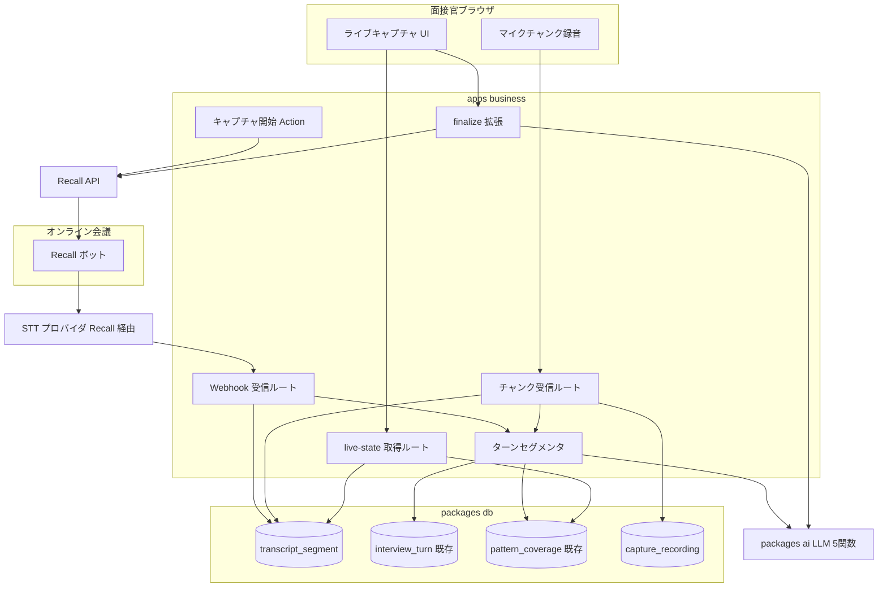
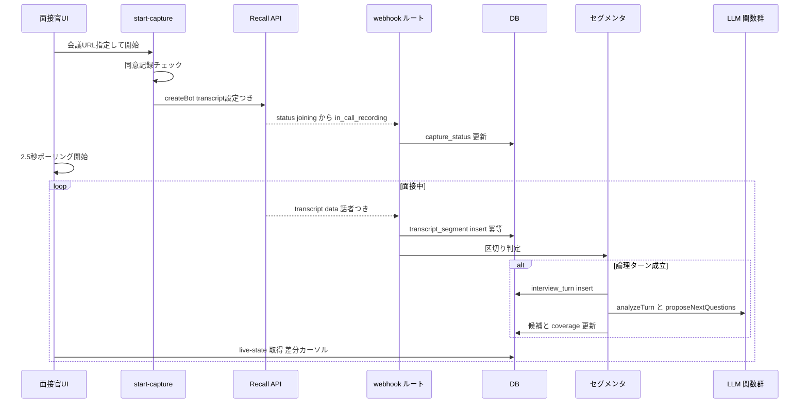
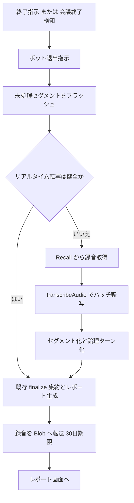
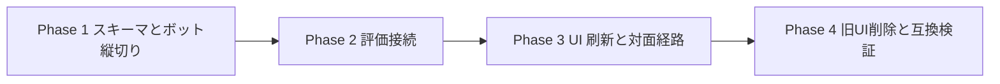

# Technical Design — realtime-interview-capture

## Overview

**Purpose**: 本機能は、面接官に「面接中の操作ゼロ」のキャプチャ体験を提供する。オンライン面接では録音ボットが Zoom / Google Meet / Microsoft Teams に参加して話者情報つきライブトランスクリプトを取得し、対面面接では端末マイクの連続録音で代替する。会話はリアルタイムに論理ターンへ分割され、既存の評価パイプライン（analyzeTurn → pattern_coverage → session_report）へ自動接続される。

**Users**: 面接官（VPoE / EM / 採用責任者）が実面接で利用する。面接官は開始と終了以外の操作をせず、サイドパネルのカバレッジ進捗と質問候補を見たいときだけ参照する。

**Impact**: 現行の状態A/B ステートマシン（ターン単位手動録音 + ターン毎 Whisper バッチ）を廃止し、キャプチャ層を webhook 駆動・DB 真実源・ポーリング配信の構成に置き換える。評価層（LLM 5 関数・interview_turn 以降のスキーマ・管理画面）は無改修で維持する。

### Goals

- 面接官の必須操作を「キャプチャ開始」「面接終了」の 2 回に削減する
- 発話から約 10 秒以内のライブトランスクリプト表示、回答の一区切りから約 15 秒以内の質問候補更新
- 既存評価パイプライン・管理画面・旧セッションデータとの完全互換（interview_turn への書き戻しで構造的に保証）
- 60 分連続キャプチャと画面リロード復元に耐える、DB を真実源とする進行状態管理

### Non-Goals

- ATS・カレンダー連携、レポート共有 URL、ハイライトクリップ（将来 spec）
- 複数面接官の同席・面接官間ばらつき分析
- 映像（録画）の取得・解析、候補者向け画面
- 模擬面接（apps/candidate）への適用
- 旧 状態A/B UI の維持（新規セッションは新方式に一本化）

## Boundary Commitments

### This Spec Owns

- キャプチャ層全体: ボットライフサイクル管理、webhook 受信、対面チャンク録音、`transcript_segment` / `capture_recording` テーブルとその書き込み
- セグメンテーション: トランスクリプトセグメント → 論理ターン化と `interview_turn` / `question_proposal` への書き戻し、使用質問の自動判別
- ライブ配信契約: `GET /api/interview/sessions/{id}/live-state` のレスポンススキーマ
- 面接実施 UI の置き換え: キャプチャ開始画面、ライブトランスクリプトペイン、操作レスサイドパネル
- `interview_session` への capture 系カラム追加（`capture_provider` / `capture_status` / `bot_id` / `meeting_url`）

### Out of Boundary

- LLM 5 関数の内部ロジック・プロンプト・出力スキーマ（analyzeTurn のプロンプトへの「話者ラベル付き入力」の注記追加のみ許容）
- `pattern_coverage` / `session_report` のスキーマと集約ロジック
- 管理画面（apps/admin / admin 系 query）の変更 — 新方式データは既存スキーマ経由で自動的に閲覧可能であること
- エントリーフロー・セッション作成（session-from-entry）のロジック — 作成済みセッションを引き受けるのみ
- 候補者向けアプリ・模擬面接

### Allowed Dependencies

- packages/ai: `analyzeTurn` / `proposeNextQuestions` / `aggregatePatternCoverage` / `generateSessionReport` / `splitInterviewerCandidate` / `transcribeAudio`（呼び出しのみ、変更不可）
- packages/db: 既存スキーマ + 本 spec が追加する 2 テーブルとカラム
- packages/lib: `rate-limit`（上限値の追加定義は許容）
- apps/business 内: guards / safe-action / blob-client / SSE パーサ資産
- 外部: Recall.ai API（ボット）、Recall 経由の STT プロバイダ、Vercel Blob / Cron
- 制約: apps → packages の単方向依存。Recall クライアントは apps/business 内に置く（他アプリから不使用のため）

### Revalidation Triggers

- `interview_turn.transcript` JSON 形状または `question_proposal` の 3 候補構造を変更した場合 → admin-review-panel / admin-operations の再検証
- `interview_session.status` enum を変更した場合 → session-from-entry / entry 一覧の再検証
- live-state レスポンススキーマの破壊的変更 → 面接 UI の再検証
- 音声保持ポリシー（30 日）または保存先の変更 → audio-purge cron と security.md の再検証

## Architecture

### Existing Architecture Analysis

現行は「クライアント主導・リクエスト応答完結」型: クライアントが音声 blob を POST し、単一リクエスト内で Blob 保存 → Whisper → LLM 3 関数 → DB insert → SSE 応答が完結する。進行状態はクライアントの useReducer に集中している。本機能では駆動源が外部（webhook）になるため、**真実源を DB に移し、クライアントは取得専用**に反転させる。維持する既存パターン: provider factory（`WHISPER_PROVIDER` / `BLOB_STORAGE_PROVIDER`）、authedAction / requireSessionOwnership 多層ガード、Zod 全入力検証、LLM ctx 束縛、CRON_SECRET Bearer 検証。

### Architecture Pattern & Boundary Map



**Architecture Integration**:

- 選択パターン: **Webhook ingestion + DB 真実源 + クライアントポーリング**。Vercel serverless（inbound WebSocket 不可、Hobby 関数上限 300 秒）の制約下で 60 分面接を成立させる最小構成
- 境界: キャプチャ層（本 spec）と評価層（既存）の継ぎ目は **`interview_turn` への書き戻し**。評価層は入力源がボットか手動録音かを区別しない
- Build vs Adopt: ボットインフラは Recall.ai を採用（3 プラットフォーム自前実装を棄却）。ストリーミング STT は Recall の `transcript.provider` 設定で委譲（自前 STT 接続を持たない）。リアルタイム配信は外部 SaaS（Pusher 等)を採用せずポーリングで自作（MVP 規模で十分、ベンダー追加を回避）
- 対面フォールバックは新規 STT 統合ゼロ: チャンクを既存 `transcribeAudio`（Whisper バッチ）で転写し、話者分離は論理ターン化時に既存 `splitInterviewerCandidate` で吸収

### Technology Stack

| Layer | Choice / Version | Role in Feature | Notes |
| --- | --- | --- | --- |
| ボットインフラ | Recall.ai API（リージョン別ベース URL） | Zoom / Meet / Teams 参加・録音・退出・録音ファイル取得 | 録音 $0.50/h + STT $0.15/h、秒割り課金 |
| ストリーミング STT | Recall `recording_config.transcript.provider`（既定 `deepgram_streaming`、env で切替） | 日本語ライブ転写 + 参加者単位の話者付与 | 自前の STT 接続は持たない。webhook で `transcript.data` / `partial_data` 受信 |
| 対面 STT | 既存 `transcribeAudio`（`WHISPER_PROVIDER`） | マイクチャンクのバッチ転写 | 新規依存なし |
| 配信 | クライアントポーリング（2.5 秒間隔、カーソル差分） | live-state 取得 | Vercel 制約下で最も単純。SSE 再接続案は棄却（research.md） |
| データ | Neon Postgres + Drizzle（migration 0015〜） | `transcript_segment` / `capture_recording` 新設、`interview_session` 拡張 | |
| ストレージ | Vercel Blob（既存 blob-client） | チャンク音声・ボット録音の 30 日保存 | |
| UI | 既存スタック（Next.js 16 / React 19 / agenda コンポーネント流用） | ライブキャプチャ画面 | |

## File Structure Plan

### New Files

```
packages/db/src/schema/
├── transcript-segment.ts        # 生セグメント（webhook/チャンク由来）
└── capture-recording.ts         # セッション録音・チャンク音声の保管台帳

apps/business/lib/capture/
├── recall-client.ts             # Recall API アダプタ（createBot/leaveBot/getRecording）
├── recall-webhook-verify.ts     # 署名・トークン検証（status: Svix / transcript: URL トークン）
├── segmenter.ts                 # セグメント列→論理ターン判定（決定論ルール）
├── turn-pipeline.ts             # 論理ターン→interview_turn 書き戻し + LLM 呼び出し編成
├── proposal-matcher.ts          # 面接官発話と 3 候補の照合（使用質問の自動判別）
├── live-state.ts                # live-state レスポンスの Zod スキーマ・型
└── capture-status.ts            # capture_status 遷移の定義と検証

apps/business/app/api/webhooks/recall/
├── route.ts                     # ボット status イベント受信（参加成功/退出/会議終了/失敗）
└── transcript/route.ts          # リアルタイムトランスクリプト受信（partial/final）

apps/business/app/api/interview/
├── capture/chunks/route.ts      # 対面: マイクチャンク受信→Blob→transcribeAudio→segment 化
└── sessions/[sessionId]/live-state/route.ts  # GET ポーリングエンドポイント

apps/business/app/(interviewer)/interviews/[sessionId]/_actions/
├── start-capture.ts             # authedAction: ボット起動 or 対面モード開始（同意ガード込み）
└── stop-capture.ts              # authedAction: キャプチャ中止/終了指示

apps/business/app/(interviewer)/interviews/_components/live/
├── live-capture-runner.tsx      # ポーリング消費 + 画面状態（useReducer 廃止、DB 復元）
├── capture-start-panel.tsx      # 会議 URL 入力 / 対面切替 / 失敗時リトライ UI
├── live-transcript-pane.tsx     # 話者ラベル付きライブトランスクリプト表示
├── mic-chunk-recorder.ts        # MediaRecorder timeslice + 未送信キュー（オフライン耐性）
└── use-live-state.ts            # ポーリング hook（カーソル管理・バックオフ）
```

### Modified Files

- `packages/db/src/schema/interview-session.ts` — `capture_provider`（'recall' | 'mic' | null）、`capture_status`、`bot_id`、`meeting_url` カラム追加。status enum は不変
- `packages/lib/src/rate-limit.ts` — `llm:<sessionId>` 上限を 150 に引き上げ、`capture-chunk:<sessionId>` / `webhook:<botId>` キー追加
- `apps/business/app/api/interview/finalize/route.ts` — 冒頭に「ボット退出指示・未処理セグメントのフラッシュ・（STT 不能時）録音バッチ転写フォールバック・ボット録音の Blob 転送」を追加。以降の集約・レポート生成は不変
- `apps/business/app/api/cron/audio-purge/route.ts` — 削除対象に `capture_recording` を追加
- `apps/business/app/(interviewer)/interviews/[sessionId]/page.tsx` — ランナーを live-capture-runner に差し替え（completed セッションは既存レポート表示のまま）
- `apps/business/app/(interviewer)/interviews/[sessionId]/report/` 配下 — 話者ラベル付き全文トランスクリプトタブを追加（transcript_segment 由来）
- `turbo.json` — `RECALL_API_KEY` / `RECALL_API_BASE_URL` / `RECALL_WEBHOOK_SECRET` / `CAPTURE_TRANSCRIPT_PROVIDER` を build.env に追加
- 削除: `recording-state.tsx` / `choosing-state` 系 / `interview-session-runner.tsx`（旧状態A/B。最終タスクで除去）

## System Flows

### ボットキャプチャと論理ターン処理



### 面接終了とフォールバック



フロー上の決定: 区切り判定は **final セグメントの話者交代 + 無音間隔（既定 4 秒）+ 最小発話長**の決定論ルールで行い、LLM は判定に使わない（コストと 15 秒制約のため）。区切りの起動はイベント着弾とポーリング tick の 2 系統（沈黙はイベントを生まないため）。論理ターン処理はセッション単位の advisory lock で直列化し、`(session_id, turn_fingerprint)` 一意制約と `logical_turn_id` の条件付き claim で重複・順序逆転・並行起動に耐える。

## Requirements Traceability

| Requirement | Summary | Components | Interfaces | Flows |
| --- | --- | --- | --- | --- |
| 1.1, 1.3 | ボット参加・記録中表示名 | CaptureOrchestrator, RecallClient | start-capture, createBot | ボットキャプチャ |
| 1.2 | 3 プラットフォーム URL 受付 | CaptureOrchestrator | meeting URL Zod 検証 | — |
| 1.4 | 参加失敗の表示・切替 | CaptureOrchestrator, CaptureStartPanel | status webhook → capture_status='failed' | ボットキャプチャ |
| 1.5 | 対面マイク連続録音 | MicChunkRecorder, ChunkIngestion | capture/chunks | — |
| 1.6 | 同意なしで開始不可 | CaptureOrchestrator | start-capture 前提条件 | — |
| 1.7 | ステータス進行中更新 | CaptureOrchestrator | interview_session.status='in_progress' | — |
| 2.1 | 10 秒以内ライブ表示 | WebhookIngestion, LiveStateAPI, LiveTranscriptPane | transcript webhook + 2.5s poll | ボットキャプチャ |
| 2.2, 2.3 | 話者分離・未確定ラベル | WebhookIngestion, TurnSegmenter | segment.speaker_role | — |
| 2.4 | 日本語転写 | RecallClient（provider 設定） | CAPTURE_TRANSCRIPT_PROVIDER | — |
| 2.5 | 一時中断の自動再開表示 | WebhookIngestion, LiveStateAPI | last_event_at 監視 → stale 表示 | — |
| 2.6 | 復旧不能時の事後転写 | FinalizeExtension | 録音 DL → transcribeAudio | 終了フォールバック |
| 2.7 | 音声保存と 30 日削除 | CaptureRecordingStore, RetentionExtension | capture_recording.expires_at | 終了フォールバック |
| 3.1, 3.8 | カバレッジ進捗・経過表示 | LiveStateAPI, SidePanel（agenda 流用） | live-state.coverage | — |
| 3.2, 3.3 | 候補 3 件の自動更新 15 秒以内 | TurnSegmenter, TurnPipeline, LiveStateAPI（tick） | proposeNextQuestions 既存契約 | ボットキャプチャ |
| 3.4 | next_pattern 1 件保証 | TurnPipeline | 既存 proposeNextQuestions の制約を継承 | — |
| 3.5 | 操作必須は開始終了のみ | LiveCaptureRunner | UI 契約 | — |
| 3.6 | 使用質問の自動判別 | ProposalMatcher | 類似度照合 → selected_index | — |
| 3.7 | フリー質問の総評反映 | ProposalMatcher, TurnPipeline | pattern_id=null 既存運用 | — |
| 4.1 | ターン自動分割 | TurnSegmenter | 決定論セグメンテーション規則 | ボットキャプチャ |
| 4.2 | パターン自動分類 | TurnPipeline | analyzeTurn.matched_pattern_id 流用 | — |
| 4.3 | 完了時カバレッジ集約 | TurnPipeline | aggregatePatternCoverage 流用 | — |
| 4.4 | 出力形式の同一性 | TurnPipeline（interview_turn 書き戻し） | 既存スキーマ不変 | — |
| 4.5 | 解析上限到達時の継続 | RateLimit 拡張, TurnPipeline | llm:<sessionId> 150 上限 | — |
| 5.1, 5.2 | 終了指示・会議終了検知 | CaptureOrchestrator, WebhookIngestion | stop-capture / status webhook | 終了フォールバック |
| 5.3 | 既存レポート生成 | FinalizeExtension | 既存 finalize 契約 | 終了フォールバック |
| 5.4 | 全文トランスクリプト閲覧 | TranscriptView | report 配下タブ | — |
| 5.5 | レポート失敗時の再実行 | FinalizeExtension | 既存リトライ + データ保持 | — |
| 6.1 | 新方式一本化 | LiveCaptureRunner（旧 UI 削除） | — | — |
| 6.2, 6.4 | 旧データ・管理画面互換 | TurnPipeline（書き戻し設計） | interview_turn 不変 | — |
| 6.3 | エントリー連携維持 | CaptureOrchestrator | session-from-entry 出力を入力に | — |
| 7.1 | アクセス制限 | 全ルート | requireSessionOwnership / requireAdmin | — |
| 7.2 | 入力検証 | 全ルート | Zod スキーマ（URL・webhook payload） | — |
| 7.3, 7.4 | 30 日削除・転写は保持 | RetentionExtension | audio-purge cron 拡張 | — |
| 7.5 | 同意記録保持 | 既存 consent カラム | 変更なし | — |
| 7.6 | 中止の即時停止 | CaptureOrchestrator | stop-capture(abort) → ボット退出 + 解析停止 | — |
| 8.1 | 60 分連続処理 | 全体（webhook 駆動のため関数長時間実行なし） | — | — |
| 8.2 | リロード復元 | LiveStateAPI, LiveCaptureRunner | DB 真実源 + 全量再取得 | — |
| 8.3 | 対面オフライン耐性 | MicChunkRecorder | 未送信キュー + 再送 | — |

## Components and Interfaces

| Component | Domain/Layer | Intent | Req Coverage | Key Dependencies | Contracts |
| --- | --- | --- | --- | --- | --- |
| CaptureOrchestrator | Server Action | キャプチャ開始/停止/中止とボットライフサイクル | 1.1–1.7, 5.1, 6.3, 7.6 | RecallClient (P0), guards (P0) | Service |
| RecallClient | 外部アダプタ | Recall API 呼び出しの薄いラッパ | 1.1–1.3, 2.4, 5.1 | Recall API (P0) | Service |
| WebhookIngestion | API Route | status / transcript イベントの検証・冪等永続化 | 1.4, 2.1–2.3, 2.5, 5.2 | recall-webhook-verify (P0), TranscriptSegmentStore (P0) | API, Event |
| ChunkIngestion | API Route | 対面チャンクの受信・転写・セグメント化 | 1.5, 8.3 | transcribeAudio (P0), blob-client (P0) | API |
| TurnSegmenter | ドメインロジック | セグメント列から論理ターンを確定 | 3.3, 4.1 | TranscriptSegmentStore (P0) | Service |
| TurnPipeline | ドメインロジック | 論理ターンの書き戻しと LLM 編成 | 3.2–3.4, 3.7, 4.2–4.5, 6.2, 6.4 | packages/ai 5 関数 (P0), rate-limit (P1) | Service |
| ProposalMatcher | ドメインロジック | 面接官発話と提示候補の照合 | 3.6, 3.7 | — | Service |
| LiveStateAPI | API Route | ポーリング向け差分状態の提供 | 2.1, 2.5, 3.1, 3.8, 8.2 | DB read 系 (P0) | API |
| LiveCaptureRunner ほか UI 群 | UI | ライブ画面（開始パネル・転写ペイン・サイドパネル） | 1.4, 3.1–3.5, 3.8, 5.4, 6.1, 8.2 | use-live-state (P0), agenda 流用 (P1) | State |
| MicChunkRecorder | ブラウザユーティリティ | timeslice 録音と未送信キュー | 1.5, 8.3 | MediaRecorder | Service |
| FinalizeExtension | API Route 改修 | 終了処理の前段拡張とフォールバック転写 | 2.6, 2.7, 5.1–5.3, 5.5 | finalize 既存 (P0), RecallClient (P1) | API |
| RetentionExtension | Cron 改修 | capture_recording の期限削除 | 2.7, 7.3, 7.4 | audio-purge 既存 (P0) | Batch |

### Capture 層

#### CaptureOrchestrator（start-capture / stop-capture）

| Field | Detail |
| --- | --- |
| Intent | キャプチャの開始・終了・中止を司る唯一の状態遷移入口 |
| Requirements | 1.1–1.7, 5.1, 6.3, 7.6 |

**Responsibilities & Constraints**

- `capture_status` 遷移の唯一の書き込み主体（webhook による外部起因遷移を除く）: `idle → bot_joining → recording → stopping → stopped` / `failed` / `aborted`
- 前提条件: `consent_obtained_at` 非 null（1.6）、セッション所有権、`status in ('draft','in_progress')`
- 開始成功時に `interview_session.status = 'in_progress'`、`started_at` 設定（1.7）

##### Service Interface

```typescript
type CaptureMode = { kind: 'recall'; meetingUrl: string } | { kind: 'mic' };

interface CaptureOrchestrator {
  startCapture(input: { sessionId: string; mode: CaptureMode }):
    Promise<ActionResult<{ captureStatus: CaptureStatus; botId?: string }>>;
  stopCapture(input: { sessionId: string; reason: 'finish' | 'abort' }):
    Promise<ActionResult<{ captureStatus: CaptureStatus }>>;
}

type CaptureStatus =
  | 'idle' | 'bot_joining' | 'recording'
  | 'stopping' | 'stopped' | 'failed' | 'aborted';
```

- Preconditions: authedAction + requireSessionOwnership。meetingUrl は Zoom / Meet / Teams の URL 形式 Zod 検証（1.2, 7.2）
- Postconditions: `reason='abort'` の場合、以降の webhook 受信は破棄され解析は再開しない（7.6）
- Invariants: 1 セッションに同時アクティブなキャプチャは 1 つ（`bot_id` 非 null かつ status 進行中の場合は再開始を拒否）

**Implementation Notes**

- Integration: 失敗時（createBot エラー・参加タイムアウト）は `failed` に遷移し、UI が再試行 / 対面切替を提示（1.4）
- Risks: ボット参加待ちのタイムアウト判定は status webhook 依存。webhook 不達に備え live-state 側で `bot_joining` の経過時間を監視し UI でタイムアウト表示

#### RecallClient

| Field | Detail |
| --- | --- |
| Intent | Recall API の薄いアダプタ。ベンダー知識をこのファイルに閉じ込める |
| Requirements | 1.1–1.3, 2.4, 5.1 |

##### Service Interface

```typescript
interface RecallClient {
  createBot(input: {
    meetingUrl: string;
    botName: string;            // 「bulr 記録ボット」等、記録中であることを明示（1.3）
    transcriptProvider: string; // env CAPTURE_TRANSCRIPT_PROVIDER（既定 deepgram_streaming）
    webhookBaseUrl: string;     // realtime_endpoints の宛先（トークン付き URL）
    metadata: { sessionId: string };
  }): Promise<Result<{ botId: string }, RecallError>>;
  leaveBot(botId: string): Promise<Result<void, RecallError>>;
  getRecordingDownloadUrl(botId: string): Promise<Result<{ url: string; expiresAt: string }, RecallError>>;
}

type RecallError =
  | { code: 'invalid_meeting_url' } | { code: 'rate_limited' }
  | { code: 'api_error'; status: number } | { code: 'network' };
```

**Implementation Notes**

- Integration: `recording_config.transcript.provider` と `realtime_endpoints`（webhook、`transcript.data` + `transcript.partial_data`）を createBot 時に設定。リージョン別ベース URL は `RECALL_API_BASE_URL`
- Validation: API キーはサーバー専用 env。クライアントへ露出禁止
- Risks: プロバイダ別の話者付与粒度・日本語品質は実装時に実測（research.md R-1）。差し替えは env のみで可能な契約とする

#### WebhookIngestion（/api/webhooks/recall, /api/webhooks/recall/transcript）

| Field | Detail |
| --- | --- |
| Intent | 外部イベントを検証し、冪等に永続化してセグメンタを駆動する |
| Requirements | 1.4, 2.1–2.3, 2.5, 5.2 |

**Contracts**: API / Event

##### API Contract

| Method | Endpoint | Request | Response | Errors |
| --- | --- | --- | --- | --- |
| POST | /api/webhooks/recall | Svix 署名付き status イベント | 200（常時即応） | 401（署名不正）, 400 |
| POST | /api/webhooks/recall/transcript?token={secret} | transcript.data / partial_data | 200 | 401（トークン不正）, 400 |

##### Event Contract

- 購読: `bot.in_call_recording`（→ `recording`）、`bot.call_ended` / `bot.done`（→ 終了処理起動、5.2）、`bot.fatal`（→ `failed`、1.4）、`transcript.data`（final セグメント永続化）。**`transcript.partial_data` は購読しない**（final-only 方針）: ストリーミング STT の final 発話は数秒間隔で到着するため 2.1 の 10 秒予算を満たし、serverless 上に partial の保持場所（揮発状態）を持たずに済む。partial 表示は実面接で体感遅延が問題になった場合の将来拡張とする
- 冪等性: `transcript_segment` に `(session_id, source_id)` 一意制約（source_id = ボット ID + プロバイダのセグメント識別子/タイムスタンプ）。重複配信は no-op。順序逆転は `started_at_ms` ソートで吸収
- 話者付与: 参加者名・ID をボット参加者メタデータから取得し、`bot_id` の所有セッションの面接官名と照合して `interviewer | candidate | unknown` に正規化（2.2, 2.3）。照合不能時は `unknown`
- 配信保証: at-least-once 前提。応答は常に即時 200（処理失敗はログ + 再配信で回復）

**Implementation Notes**

- Validation: payload 全体を Zod 検証。`metadata.sessionId` と `bot_id` の DB 紐付けが一致しない場合は破棄（7.1, 7.2）
- Integration: final セグメント insert 後に同一呼び出し内でセグメンタを起動（追加インフラなし）。`aborted` セッションのイベントは破棄（7.6）
- Risks: webhook 停止 = ライブ表示停止。`interview_session.last_capture_event_at` を更新し、live-state が 20 秒無更新で「転写が遅延しています」を表示（2.5）

#### ChunkIngestion（/api/interview/capture/chunks）+ MicChunkRecorder

| Field | Detail |
| --- | --- |
| Intent | 対面面接の音声チャンクを受信し、転写してセグメント化する |
| Requirements | 1.5, 8.3 |

##### API Contract

| Method | Endpoint | Request | Response | Errors |
| --- | --- | --- | --- | --- |
| POST | /api/interview/capture/chunks | multipart: sessionId, chunkNo, audio(webm, ≤5MB, ≈8 秒) | { accepted: true } | 401, 403, 413, 429 |

- MicChunkRecorder は MediaRecorder timeslice（8 秒）で chunk を生成し、メモリ内キュー + 逐次 POST。送信失敗時はキューに保持し指数バックオフで再送（8.3）。チャンクは `capture_recording` に Blob 保存（30 日期限）後、`transcribeAudio` で転写し speaker_role='unknown' のセグメントとして insert（話者分離は TurnPipeline の `splitInterviewerCandidate` で吸収）
- レート制限: `capture-chunk:<sessionId>` 600 回/日（60 分 × 8 秒チャンク + 再送余裕）

### セグメンテーション・評価接続層

#### TurnSegmenter

| Field | Detail |
| --- | --- |
| Intent | final セグメント列から「論理ターン = 1 質問 + 1 回答」を決定論的に確定する |
| Requirements | 3.3, 4.1 |

##### Service Interface

```typescript
interface TurnSegmenter {
  // final セグメント追加のたびに呼ばれ、確定した論理ターンを 0..n 件返す
  evaluate(input: {
    sessionId: string;
    segments: TranscriptSegment[];   // 未消費（logical_turn 未割当）の final セグメント
    config: SegmenterConfig;
  }): LogicalTurn[];
}

interface SegmenterConfig {
  silenceGapMs: number;        // 既定 4000: 候補者発話後の無音で区切り
  minAnswerChars: number;      // 既定 40: これ未満は次セグメントと結合
  maxTurnDurationMs: number;   // 既定 360000: 強制区切り（上限保護）
}

interface LogicalTurn {
  question: { text: string; speakerRole: SpeakerRole; segmentIds: string[] };
  answer: { text: string; speakerRole: SpeakerRole; segmentIds: string[] };
  fingerprint: string;         // 構成 segmentIds から導出（冪等キー）
}
```

- Invariants: 1 セグメントは最大 1 論理ターンに属する（`transcript_segment.logical_turn_id` で消費管理）。区切り判定に LLM を使用しない
- 話者未確定（unknown）のみで構成される場合（対面モード）: 質問/回答の分離を保留した `LogicalTurn`（question 空）を返し、TurnPipeline が `splitInterviewerCandidate` で分離する
- **起動トリガは 2 系統**: ① final セグメント ingestion 時（webhook / chunk）② live-state ポーリング時の tick（後述）。②がないと「候補者が回答を終え沈黙した」境界はイベントが発生せず検知できない — 質問候補は面接官が次に話し出す**前**に必要なため、ポーリング（2.5 秒間隔）を時計として無音閾値超過を検査する
- **並行実行制御**: evaluate → 書き戻しは Postgres advisory transaction lock（セッション ID 単位、`pg_advisory_xact_lock`）で直列化する。webhook 連続着弾とポーリング tick が同時に走っても二重の論理ターンを生成しない。ロック内では `logical_turn_id IS NULL` 条件付き UPDATE でセグメントを claim し、更新行数 0 なら処理を放棄する（楽観的二重防御）。turn_fingerprint 一意制約は最終防衛線として維持

#### TurnPipeline

| Field | Detail |
| --- | --- |
| Intent | 論理ターンを既存評価パイプラインへ接続する唯一のアダプタ |
| Requirements | 3.2–3.4, 3.7, 4.2–4.5, 6.2, 6.4 |

**Responsibilities & Constraints**

- `interview_turn` への書き戻し: transcript JSON `{interviewer, candidate, raw}` を既存形状のまま構築。`audio_key` は null（音声はセッション単位の `capture_recording` が保持）。`question_source` は ProposalMatcher の結果から設定（4.4, 6.2, 6.4）
- LLM 編成（既存 turns/next の Core 相当を移植）: `analyzeTurn`（matched_pattern_id によるパターン自動分類、4.2）→ パターン完了判定 → `aggregatePatternCoverage`（4.3）→ `proposeNextQuestions`（3.2、next_pattern 1 件保証は既存関数の契約を継承 = 3.4）→ `question_proposal` insert
- レート制限: 各 LLM 呼び出し前に `llm:<sessionId>`（上限 150）をチェック。超過時は解析のみ停止し `interview_session.analysis_capped_at` を設定（live-state 経由で UI 通知）。セグメント永続化と録音は継続（4.5）
- 冪等性: `interview_turn` に turn_fingerprint 由来の一意制約。webhook 重複起動でも二重処理しない

#### ProposalMatcher

| Field | Detail |
| --- | --- |
| Intent | 面接官の質問発話が直近の提示 3 候補のどれかを判別し selected_index / question_source を決める |
| Requirements | 3.6, 3.7 |

##### Service Interface

```typescript
interface ProposalMatcher {
  match(input: {
    interviewerText: string;
    proposal: { candidates: [string, string, string] } | null;
  }): { source: 'proposal'; selectedIndex: 0 | 1 | 2 } | { source: 'manual' };
}
```

- 方式: 正規化（記号・空白除去）後の文字 n-gram 重複率による類似度。閾値以上の最大候補を選択、未満は `manual`（= フリー質問判定の入口、3.7）。LLM・埋め込み不使用（決定論・ゼロコスト）
- `manual` のターンは analyzeTurn の `matched_pattern_id` が null（off_pattern）の場合に `pattern_id=null` のフリー質問として記録（既存運用継承）

### 配信・UI 層

#### LiveStateAPI（GET /api/interview/sessions/[sessionId]/live-state）

| Field | Detail |
| --- | --- |
| Intent | 面接画面が必要とする全状態を 1 エンドポイントで差分提供する（DB 真実源） |
| Requirements | 2.1, 2.5, 3.1, 3.8, 8.2 |

##### API Contract

| Method | Endpoint | Request | Response | Errors |
| --- | --- | --- | --- | --- |
| GET | …/live-state?cursor={segCursor} | cursor: 取得済み最終 segment 連番 | LiveState | 401, 403, 404 |

```typescript
interface LiveState {
  captureStatus: CaptureStatus;
  staleTranscript: boolean;          // last_capture_event_at が 20 秒超過（2.5）
  analysisCapped: boolean;           // 4.5
  segments: LiveSegment[];           // cursor 以降の final セグメント（partial は配信しない）
  coverage: PatternCoverageSummary[]; // 3.1: カバー済み/進行中/未着手 + 到達段階
  currentProposal: ProposalView | null; // 3.2: 最新 3 候補
  elapsedSeconds: number;            // 3.8
  remainingPlannedPatterns: number;  // 3.8
  nextCursor: number;
}
```

- ポーリング: クライアント 2.5 秒間隔（エラー時バックオフ最大 10 秒）。`cursor=0` で全量返却 = リロード復元（8.2）
- 遅延予算（2.1）: STT/webhook ≈ 1–3 秒 + ポーリング ≤ 2.5 秒 + 描画 → 約 10 秒以内を満たす
- **セグメンタ tick の起点**（3.3）: キャプチャ進行中のポーリング受信時、未消費 final セグメントの末尾が無音閾値（4 秒）を超過していれば TurnSegmenter を起動する（advisory lock 下で冪等）。GET に副作用を持たせる例外は本 tick のみとし、応答遅延を避けるため tick はレスポンス生成と独立に実行する

#### LiveCaptureRunner / CaptureStartPanel / LiveTranscriptPane / SidePanel

| Field | Detail |
| --- | --- |
| Intent | 操作レスの面接画面。開始パネル → ライブ画面（転写ペイン + サイドパネル）→ 終了 |
| Requirements | 1.4, 3.1–3.5, 3.8, 5.4, 6.1, 8.2 |

Summary-only: 進行状態を一切クライアントに保持せず `use-live-state` の取得結果のみで描画する（8.2 を構造で保証）。サイドパネルは既存 agenda コンポーネント（`session-agenda-sidebar` / `agenda-pattern-row` / `next-question-picker` の表示部）を「選択操作なし」に改修して流用。操作要素は「キャプチャ開始」「面接終了」「中止」の 3 つのみ（3.5、7.6）。旧 `interview-session-runner` / `recording-state` は最終タスクで削除（6.1）。

### 終了・保持層

#### FinalizeExtension（/api/interview/finalize 改修）

| Field | Detail |
| --- | --- |
| Intent | 終了時の前処理（退出・フラッシュ・フォールバック・録音転送）を既存 finalize に前置する |
| Requirements | 2.6, 2.7, 5.1–5.3, 5.5 |

- 処理順: ① `leaveBot`（5.1）→ ② 未消費 final セグメントを強制的に論理ターン化（フラッシュ）→ ③ リアルタイム転写が不健全だった区間（capture_status の failed 期間 / セグメント空白）があれば録音をダウンロードし `transcribeAudio` でバッチ転写 → セグメント化（2.6）→ ④ ボット録音を Blob へ転送し `capture_recording` に 30 日期限で登録（2.7）→ ⑤ 既存処理（未集約パターン集約 → generateSessionReport → heatmap → status='completed'）（5.3）
- 会議終了検知（`bot.call_ended`）時は同じ処理をサーバー起点で実行し、live-state 経由で UI に終了を通知（5.2）
- 失敗時: 既存の冪等設計を継承。transcript_segment / interview_turn は保持されたまま再実行可能（5.5）
- リスク: ③ のバッチ転写は 60 分音声で関数上限（Hobby 300 秒）に迫る。チャンク分割転写 + 必要に応じ maxDuration 設定 / Pro 移行で対処（research.md R-7）

#### RetentionExtension（audio-purge cron 改修）

Summary-only: 削除対象クエリに `capture_recording.expires_at <= now()` を追加し、Blob 削除 + `audio_key` null 化 + 削除ログを既存パターンで実施（7.3）。`transcript_segment` / `interview_turn` / 評価データは削除対象外（7.4）。

## Data Models

### Domain Model

- 集約ルート: `interview_session`（キャプチャ状態を含む）。`transcript_segment` はセッション配下の追記専用ストリーム、`interview_turn` は論理ターンの正本（既存のまま）
- 不変条件: ① final セグメントは不変（追記のみ）② 1 セグメント → 最大 1 論理ターン ③ `capture_status` の遷移は定義済みパスのみ ④ `aborted` 後の新規セグメント受理なし

### Physical Data Model

**transcript_segment**（新規）

| カラム | 型 | 説明 |
| --- | --- | --- |
| id | uuid PK | |
| session_id | uuid FK → interview_session | インデックス |
| seq | integer | セッション内連番（live-state カーソル）。`(session_id, seq)` 一意 |
| source_id | text | プロバイダ由来の冪等キー。`(session_id, source_id)` 一意 |
| speaker_role | enum: interviewer / candidate / unknown | 2.2, 2.3 |
| speaker_label | text nullable | 参加者表示名（生値） |
| text | text（≤10000 字） | 転写テキスト |
| started_at_ms / ended_at_ms | integer | セッション開始からの相対ミリ秒 |
| origin | enum: bot_realtime / mic_chunk / post_batch | 2.6 の事後転写を区別 |
| logical_turn_id | uuid nullable FK → interview_turn | 消費管理 + レポートからの参照（5.4） |
| created_at | timestamp | |

**capture_recording**（新規）

| カラム | 型 | 説明 |
| --- | --- | --- |
| id | uuid PK | |
| session_id | uuid FK | |
| kind | enum: mic_chunk / bot_full | |
| chunk_no | integer nullable | mic_chunk のみ |
| audio_key | text nullable | Blob キー（削除後 null） |
| audio_expires_at | timestamp | created_at + 30 days（7.3） |
| created_at | timestamp | |

**interview_session 追加カラム**: `capture_provider`（enum nullable: recall / mic）、`capture_status`（enum、既定 'idle'）、`bot_id`（text nullable、一意）、`meeting_url`（text nullable）、`last_capture_event_at`（timestamp nullable）、`analysis_capped_at`（timestamp nullable）。**status enum は変更しない**（旧データ互換、6.2）

- Migration: 0015（2 テーブル新設 + カラム追加）。既存行は capture 系 null/idle のままで旧データ閲覧に影響なし（6.2）

### Data Contracts & Integration

- webhook payload / live-state / chunk リクエストはすべて Zod スキーマを `apps/business/lib/capture/` に定義し、ルートとクライアントで共有（7.2）
- `interview_turn.transcript` JSON・`question_proposal` 3 候補構造・`pattern_coverage.llm_evaluation` は**既存形状を変更しない**（4.4 の構造的保証）

## Error Handling

### Error Strategy

外部駆動（webhook）と内部処理（LLM）の失敗を分離する。**キャプチャ（録音・転写）は評価より優先して生存させる** — 評価が止まっても面接データは失わない（2.6, 4.5 の設計原則）。

### Error Categories and Responses

- **ボット参加失敗**（1.4）: `failed` 遷移 + UI に理由表示（invalid_meeting_url → URL 修正促し / 入室拒否 → 会議ホストへの案内 / timeout → 再試行 or 対面切替）
- **転写の一時中断**（2.5）: `staleTranscript` フラグで UI 表示のみ。録音はボット側で継続
- **転写の復旧不能**（2.6）: finalize の事後バッチ転写で全量回復。origin='post_batch' で区別
- **LLM 失敗 / 上限**（4.5）: 単発失敗は既存のフォールバックオブジェクトで継続。上限到達は解析停止 + UI 通知、転写は継続
- **webhook 認証失敗**: 401 即応 + 監査ログ。payload 不整合（sessionId/bot_id 不一致）は 200 + 破棄（再配信ループ防止）
- **チャンク送信失敗**（8.3）: クライアントキューで保持・再送。30 件超滞留で UI 警告

### Monitoring

`interview_session.last_capture_event_at` / `capture_status` / 削除ログ（既存）に加え、webhook 受信エラーと LLM 失敗は console 構造化ログ（Stage 1 は Vercel ログ確認運用、steering 準拠）。

## Testing Strategy

### Unit Tests

1. **TurnSegmenter**: 話者交代 + 無音間隔での区切り確定 / minAnswerChars 未満の結合 / maxTurnDuration 強制区切り / unknown 話者のみの保留ターン生成（4.1）
2. **ProposalMatcher**: 候補読み上げ（言い換え含む）の selectedIndex 判定 / 閾値未満で manual 判定（3.6）
3. **recall-webhook-verify**: Svix 署名検証の正否 / transcript URL トークン検証（7.2）
4. **capture-status 遷移**: 許可された遷移のみ通過、aborted 後の受理拒否（7.6）
5. **live-state カーソル**: cursor=0 全量 / 差分返却 / staleTranscript 判定（8.2, 2.5）

### Integration Tests

1. **webhook → segment → turn → proposal**: transcript.data 連続投入で interview_turn / question_proposal が既存スキーマ形状で生成される（4.1–4.4）。重複・順序逆転配信で二重処理されない（冪等）
2. **チャンク経路**: chunk POST → Blob 保存 + transcribeAudio + unknown セグメント → splitInterviewerCandidate 経由の論理ターン化（1.5）
3. **finalize 拡張**: 未消費セグメントのフラッシュ → 既存集約 → session_report 生成。失敗後の再実行で重複なし（5.3, 5.5）
4. **解析上限**: llm:<sessionId> 150 到達で解析停止・セグメント永続化継続・analysisCapped 反映（4.5）
5. **retention**: capture_recording 期限切れの Blob 削除 + audio_key null 化、transcript_segment が残ること（7.3, 7.4）

### E2E/UI Tests

1. **オンライン面接ハッピーパス**: URL 入力 → ボット参加表示 → ライブ転写表示 → 候補自動更新 → 終了 → レポート + 全文トランスクリプト閲覧（1.1, 2.1, 3.2, 5.3, 5.4）
2. **参加失敗 → 対面切替**: 不正 URL で failed 表示 → 対面録音で続行（1.4, 1.5）
3. **リロード復元**: 面接中にリロードし、転写・カバレッジ・候補が復元される（8.2）
4. **同意なし開始拒否**: consent 未記録セッションで開始ボタンがエラーを返す（1.6）

### Performance/Load

1. 60 分相当のセグメント投入（約 700 final セグメント）で live-state 応答が劣化しないこと（インデックス検証、8.1）
2. ポーリング 2.5 秒 × 60 分（約 1,440 リクエスト/セッション）の関数実行が Vercel 無料枠内に収まること
3. 遅延予算実測: webhook 受信 → live-state 反映 ≤ 5 秒（2.1）、ターン確定 → 候補更新 ≤ 15 秒（3.3）

## Security Considerations

- 新規の外部入口は webhook 2 ルートのみ。Svix 署名（status）+ URL 埋め込みトークン（transcript、セッション毎に発行・bot_id と突合）で認証し、payload は Zod 全検証（7.2）。CRON_SECRET と同様にサーバー専用シークレットで管理
- `meeting_url` は個人情報に準ずる扱い（会議 ID を含む）: 面接官本人と admin のみ閲覧、ログへの出力禁止
- Recall 側に残る録音はベンダー保持期間（7 日無料）に依存させず、finalize で Blob 転送後を正本とし 30 日削除を適用（7.3）。Recall 側の削除 API 呼び出しは実装時に確認（research.md R-4）
- LLM セキュリティ・プロンプトインジェクション対策は steering（security.md）の既存統制を継承。転写テキストは従来どおり外部入力として扱う

## Performance & Scalability

- 目標: 転写表示 ≤ 10 秒（2.1）/ 候補更新 ≤ 15 秒（3.3）/ 60 分連続（8.1）
- すべての処理が短命関数（webhook 1 イベント・ポーリング 1 回・チャンク 1 件）に分解されるため、関数実行時間上限に依存する箇所は finalize の事後バッチ転写のみ（チャンク分割で対処、それでも不足時は Pro プラン移行を判断）
- LLM コスト試算: 論理ターン約 15–20/セッション × (analyzeTurn + propose) + 集約 12–15 + report 1 ≈ 50–60 呼び出し/セッション。現行想定と同水準（上限 150 はバースト余裕）

## Migration Strategy



- Phase 1: migration 0015 + RecallClient + webhook + live-state + 最小転写表示（評価なし）— 外部統合リスクを最初に消す
- Phase 2: TurnSegmenter / TurnPipeline / ProposalMatcher — 既存 LLM 関数への接続と冪等性
- Phase 3: ライブ UI 完成・チャンク経路・finalize 拡張・retention
- Phase 4: 旧 状態A/B コンポーネント削除（6.1）、旧セッション閲覧・管理画面の互換確認（6.2, 6.4）
- ロールバック: Phase 4 までは旧 UI が残存するため、env（`CAPTURE_ENABLED` 相当の判定は持たず、ルーティング差し替えコミットの revert）で復帰可能。スキーマ追加は加算のみで後方互換
