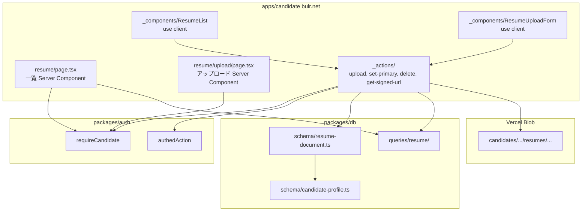
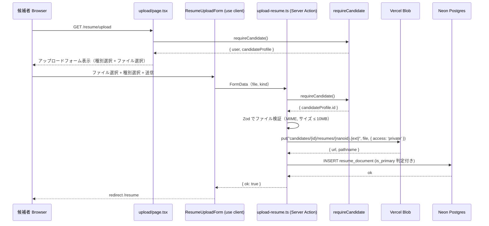
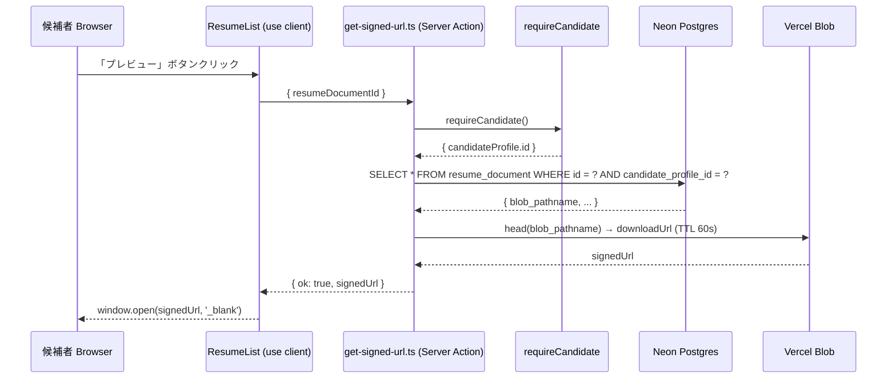
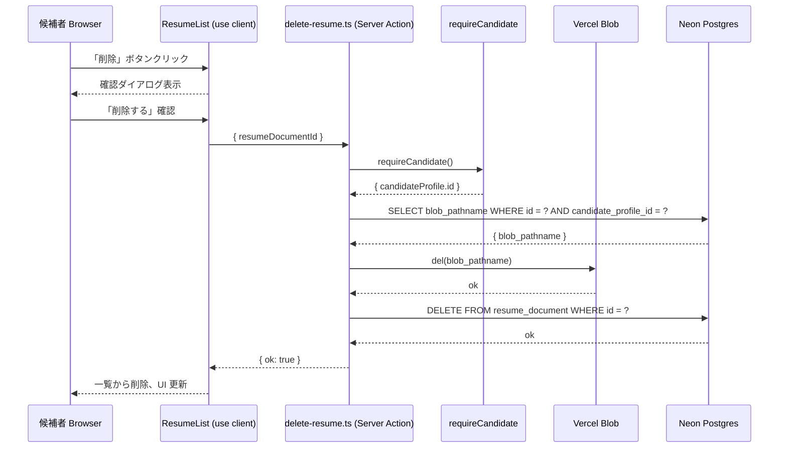

# Design Document — resume-registration

## Overview

本 spec は Wave 2 の2番目の spec で、候補者向けアプリ `apps/candidate`（bulr.net）に履歴書ドキュメントのアップロード・管理機能を追加する。`packages/db` に `resume_document` テーブルを新設し、Vercel Blob（private）でファイルを保管する。アクセス制御は `candidate-auth-onboarding` spec が確立した `requireCandidate` ガードに依存する。

**Users**: 候補者（bulr.net を利用するエンジニア求職者）が直接の受益者。開発者（後続 Wave 3 `entry-flow` の実装者）は `resume_document` テーブルと primary フラグクエリを利用してエントリー時の履歴書スナップショット参照を実装する。

**Impact**: `candidate-auth-onboarding` 完了時点では候補者は `candidate_profile` を持つのみで、履歴書データも管理 UI も存在しない。本 spec 完了で、候補者が `bulr.net/resume` で履歴書4種別を管理し、Vercel Blob（private）に保存され、署名 URL で閲覧できる状態になる。既存 Stage 1 の音声ファイル（`interview-turn/...` prefix）とは命名空間が分離されており、共存できる。

### Goals

- `packages/db` に `resume_document` スキーマ（`resumeKind` enum 含む）を追加し、drizzle-kit migration を生成する
- 候補者が `/resume` で一覧を見て、`/resume/upload` で種別を選んでアップロードできる
- Blob 命名規約 `candidates/{candidate_profile_id}/resumes/{nanoid}.{ext}` を確立し、`interview-turn/...` との衝突を回避する
- primary フラグ（種別 × 候補者 × 最大1件）の atomic な更新ロジックを実装する
- Server Action 経由の署名 URL で候補者が private Blob を安全にプレビューできる
- `apps/candidate/package.json` に `@vercel/blob` と `nanoid` を追加する（business app で実績あり）
- Wave 3 `entry-flow` が `is_primary=true` のドキュメントを参照できる seam（クエリ関数）を提供する

### Non-Goals

- 履歴書テキスト抽出・OCR・AI 解析（Wave 5+）
- `entry` 作成と履歴書スナップショット参照実装（Wave 3 `entry-flow`）
- 企業側 UI からの履歴書閲覧 UI（Wave 3 `entry-flow`）
- スキルアンケート（Wave 2 `skill-survey`）
- Blob から R2 への移行（Wave 3+ で判断）
- 履歴書 diff・バージョン履歴 UI（MVP スコープ外）
- 論理削除（候補者所有資産のため物理削除のみ）

---

## Boundary Commitments

### This Spec Owns

- `packages/db/src/schema/resume-document.ts` — `resume_document` テーブル定義 + `resumeKind` enum + 型エクスポート
- `packages/db/src/schema/index.ts` 更新 — `resume-document` のバレル追加
- `packages/db/src/queries/resume/` — `getResumeDocuments`, `getPrimaryResumeDocument` クエリ関数
- `packages/db/src/queries/index.ts` 更新 — resume クエリの re-export
- drizzle-kit migration ファイル `packages/db/drizzle/*_resume_document.sql`
- `apps/candidate/app/resume/page.tsx` — 一覧 Server Component
- `apps/candidate/app/resume/upload/page.tsx` — アップロードフォーム Server Component
- `apps/candidate/app/resume/_actions/` — Server Actions（upload, set-primary, delete, get-signed-url）
- `apps/candidate/app/resume/_components/` — ResumeList, ResumeUploadForm クライアントコンポーネント
- `apps/candidate/package.json` 更新 — `@vercel/blob ^0.27.3`, `nanoid ^5` 追加
- Turborepo `turbo.json` 確認 — `BLOB_READ_WRITE_TOKEN` が `build.env` に含まれることを確認（既に含まれていれば変更不要）

### Out of Boundary

- `requireCandidate` ガード実装（`candidate-auth-onboarding` が所有）
- `candidate_profile` テーブル定義（`candidate-auth-onboarding` が所有）
- `packages/auth` の変更（`candidate-auth-onboarding` が所有）
- Blob を使った音声ファイル管理（Stage 1 `assessment-engine` が所有）
- 企業側（`apps/business`）からの履歴書閲覧 UI（Wave 3 `entry-flow` が所有）
- `entry.resume_document_id` スナップショット参照の実装（Wave 3 `entry-flow` が所有）
- `candidateAction` wrapper の実装（`candidate-auth-onboarding` が `packages/auth/src/safe-action.ts` に追加する予定、本 spec では `authedAction` + `requireCandidate` を直接使うフォールバックを許容）

### Allowed Dependencies

- `candidate-auth-onboarding` が確立する `requireCandidate` from `@bulr/auth/server`
- `candidate-auth-onboarding` が確立する `candidateProfile` テーブル from `@bulr/db`
- `@vercel/blob` ^0.27.3（`apps/business` と同バージョン）
- `nanoid` ^5（`apps/business` と同バージョン）
- 依存方向: `apps/candidate → packages/{db, auth, lib, ui}` の単方向を厳守
- `packages/db` は `packages/auth` に依存しない（`candidate_profile_id` を用いるのみで user id への直接 JOIN は Server Action 側で行う）

### Revalidation Triggers

- `candidate_profile.id` の型変更（現在: `text` nanoid）→ `resume_document.candidate_profile_id` FK を再確認
- `requireCandidate` の戻り値型変更 → Server Action の `ctx` 利用箇所を再確認
- Vercel Blob SDK のメジャーバージョンアップ → `put()` / `del()` / `head()` API 互換性を再確認
- `BLOB_READ_WRITE_TOKEN` の環境変数名変更 → `turbo.json` と全 Server Action を更新

---

## Architecture

### Existing Architecture Analysis

Wave 1 `assessment-engine` の Blob 利用パターン（`apps/web/lib/audio/blob-client.ts`）:
- `put(pathname, body, { access: 'public', token: BLOB_READ_WRITE_TOKEN })` でアップロード
- `del(url)` で削除
- Blob pathname: `interview-turn/{session_id}/{turn_id}.webm`（`interviews/...` prefix には相当しない実際の形式）

本 spec の Blob pathname: `candidates/{candidate_profile_id}/resumes/{nanoid}.{ext}`

**競合なし**: `candidates/` prefix は Stage 1 で使用されていない。

`candidate-auth-onboarding` spec により:
- `requireCandidate()` → `{ user, session, candidateProfile }` を返す
- `candidateProfile.id` が `candidate_profile.id`（nanoid）

### Architecture Pattern & Boundary Map



**Key Decisions**:

- **Blob アップロードはサーバーサイド完結**: クライアントから Blob に直接アップロードしない。フォームは Server Action に multipart/form-data を送り、Server Action 内で `@vercel/blob` の `put()` を呼ぶ。これにより `BLOB_READ_WRITE_TOKEN` がクライアントに漏れない。
- **`candidateAction` wrapper 不在のフォールバック**: `candidate-auth-onboarding` spec が `candidateAction` を `packages/auth/src/safe-action.ts` に追加した場合はそれを使う。追加前は `authedAction` ラッパー内で `requireCandidate` を呼び出す形で実装する（`requireCandidate` は `authedAction` の `requireUser` の代わりに使えるため、二重呼び出しにはなるが安全）。実装時に `candidateAction` の有無を確認して判断する。
- **署名 URL は server action で発行**: `@vercel/blob` の `head()` で `downloadUrl` を取得（60 秒 TTL を `expiresAt` で設定）し、クライアントにリダイレクトさせる。Blob オブジェクト URL をクライアントに直接返さない。
- **物理削除の順序**: Blob 削除 → DB 削除の順。Blob 削除に失敗したら DB 削除しない（ファイル孤児化 > データ不整合）。
- **`candidate_profile_id` の配置**: `packages/db` 内のスキーマ定義のみ。クエリ関数は `apps/candidate` の Server Action から呼ぶ（apps → packages 単方向）。
- **Blob ヘルパー関数の配置**: `apps/candidate` 内に直接置く（`packages/lib` に置くと packages → apps 依存が逆転する恐れがあり、また candidate 専用のため共有不要）。

### Technology Stack

| Layer | 選択 / バージョン | 本 spec での役割 | 備考 |
|-------|-----------------|----------------|------|
| Blob Storage | @vercel/blob ^0.27.3 | 履歴書ファイルの private 保存・signed URL 発行 | apps/business と同バージョン |
| DB / ORM | Drizzle ORM 0.45.x + Neon Postgres | resume_document スキーマ追加 | 既存 DB 接続を継続利用 |
| Migration | drizzle-kit 0.31.x | resume_document migration 生成 | dev: push、prod: generate + migrate |
| Frontend | Next.js 16 App Router + React 19 | resume 管理ページ | 既存バージョン |
| Forms | react-hook-form ^7 + @hookform/resolvers | アップロードフォームのクライアント検証 | candidate app に既に導入済み |
| Validation | Zod 4.x | フォーム入力・Server Action 検証 | 既存 |
| ID生成 | nanoid ^5 | Blob pathname の一意 ID + DB レコード ID | apps/business と同バージョン |
| Build | Turborepo + pnpm | build.env の BLOB_READ_WRITE_TOKEN 確認 | 既存 turbo.json に含まれている |

---

## File Structure Plan

### Directory Structure

```
bulr-app-mvp/
├── packages/
│   └── db/
│       └── src/
│           ├── schema/
│           │   ├── resume-document.ts         # ★新規: resume_document テーブル + resumeKind enum
│           │   └── index.ts                   # ★変更: resume-document の barrel export 追加
│           ├── queries/
│           │   ├── resume/
│           │   │   ├── get-resume-documents.ts   # ★新規: 候補者の全ドキュメント取得
│           │   │   └── get-primary-resume-document.ts # ★新規: kind × 候補者の primary 取得
│           │   └── index.ts                   # ★変更: resume クエリ re-export 追加
│           └── drizzle/
│               └── *_resume_document.sql      # ★新規: drizzle-kit が生成する migration ファイル
│
└── apps/
    └── candidate/
        ├── app/
        │   └── resume/
        │       ├── page.tsx                   # ★新規: 履歴書一覧 Server Component
        │       ├── upload/
        │       │   └── page.tsx               # ★新規: アップロード Server Component
        │       ├── _actions/
        │       │   ├── upload-resume.ts       # ★新規: ファイルアップロード Server Action
        │       │   ├── set-primary-resume.ts  # ★新規: primary フラグ変更 Server Action
        │       │   ├── delete-resume.ts       # ★新規: 削除 Server Action
        │       │   └── get-signed-url.ts      # ★新規: 署名 URL 発行 Server Action
        │       └── _components/
        │           ├── resume-list.tsx        # ★新規: 'use client' 一覧表示コンポーネント
        │           └── resume-upload-form.tsx # ★新規: 'use client' アップロードフォームコンポーネント
        └── package.json                       # ★変更: @vercel/blob ^0.27.3, nanoid ^5 追加
```

### Modified Files

- `packages/db/src/schema/index.ts` — `resume-document.ts` の barrel export を追加
- `packages/db/src/queries/index.ts` — `./resume/*` クエリの re-export を追加
- `apps/candidate/package.json` — `@vercel/blob ^0.27.3`, `nanoid ^5` を dependencies に追加
- `turbo.json` — `BLOB_READ_WRITE_TOKEN` が `build.env` に含まれることを確認（既存エントリあり、変更不要の見込み）

---

## System Flows

### アップロードフロー



### 署名 URL 発行フロー



### 削除フロー



---

## Requirements Traceability

| 要件 | サマリー | コンポーネント | インターフェース | フロー |
|------|---------|--------------|--------------|------|
| 1.1〜1.5 | resume_document スキーマ | `ResumeDocumentSchema` | DB テーブル | — |
| 2.1〜2.5 | Blob 保存・命名規約 | `UploadResumeAction` | `put()` / `del()` | アップロード |
| 3.1〜3.7 | アップロード機能 | `UploadResumeAction`, `ResumeUploadForm` | Server Action | アップロード |
| 4.1〜4.4 | 一覧表示 | `ResumeListPage`, `ResumeList` | — | — |
| 5.1〜5.4 | 署名 URL 閲覧 | `GetSignedUrlAction` | Server Action | 署名 URL |
| 6.1〜6.4 | primary フラグ管理 | `SetPrimaryResumeAction`, `ResumeDocumentSchema` | Server Action | — |
| 7.1〜7.5 | 削除機能 | `DeleteResumeAction` | Server Action | 削除 |
| 8.1〜8.5 | アクセス制御 | 全 Server Action | `requireCandidate` | 全フロー |
| 9.1〜9.2 | Turborepo build.env | `turbo.json` 確認 | `BLOB_READ_WRITE_TOKEN` | — |
| 10.1〜10.2 | Wave 3 seam | `GetPrimaryResumeDocument` クエリ | `getResumeDocuments`, `getPrimaryResumeDocument` | — |

---

## Components and Interfaces

### コンポーネント一覧

| コンポーネント | ドメイン/レイヤー | 意図 | 要件カバレッジ | キー依存 | コントラクト |
|-------------|----------------|------|-------------|---------|------------|
| `ResumeDocumentSchema` | packages/db | resume_document テーブル + enum 定義 | 1.1〜1.5, 6.1 | Drizzle ORM, candidateProfile FK | State |
| `GetResumeDocuments` | packages/db/queries | 候補者全ドキュメント取得 | 4.1〜4.2, 10.1 | ResumeDocumentSchema | Service |
| `GetPrimaryResumeDocument` | packages/db/queries | kind × 候補者の primary 取得 | 10.1〜10.2 | ResumeDocumentSchema | Service |
| `UploadResumeAction` | apps/candidate/_actions | ファイルアップロード Server Action | 2.1〜2.5, 3.1〜3.7 | requireCandidate, @vercel/blob put() | Service |
| `SetPrimaryResumeAction` | apps/candidate/_actions | primary フラグ atomic 更新 | 6.1〜6.4 | requireCandidate, ResumeDocumentSchema | Service |
| `DeleteResumeAction` | apps/candidate/_actions | Blob + DB 物理削除 | 2.5, 7.1〜7.5 | requireCandidate, @vercel/blob del() | Service |
| `GetSignedUrlAction` | apps/candidate/_actions | private Blob の署名 URL 発行 | 5.1〜5.4 | requireCandidate, @vercel/blob head() | Service |
| `ResumeListPage` | apps/candidate | 一覧 Server Component | 4.1〜4.4, 8.1〜8.4 | requireCandidate, GetResumeDocuments | State |
| `UploadPage` | apps/candidate | アップロード Server Component | 3.7, 8.1〜8.4 | requireCandidate | State |
| `ResumeList` | apps/candidate | 'use client' 一覧コンポーネント | 4.1〜4.3, 5.1, 6.1, 7.4 | SetPrimaryResumeAction, DeleteResumeAction, GetSignedUrlAction | State |
| `ResumeUploadForm` | apps/candidate | 'use client' アップロードフォーム | 3.1〜3.7 | UploadResumeAction | State |

### packages/db

#### ResumeDocumentSchema

| フィールド | 詳細 |
|----------|------|
| Intent | `resume_document` テーブルの Drizzle スキーマ定義 + `resumeKind` pgEnum 定義 |
| Requirements | 1.1, 1.2, 1.3, 1.4, 1.5 |

**Responsibilities & Constraints**

- `packages/db/src/schema/resume-document.ts` に定義
- `resumeKind` pgEnum は `'履歴書' | '職務経歴書' | 'CV' | 'レジュメ'` の4値
- `candidate_profile_id` は `candidateProfile.id` への FK（`packages/db/schema/candidate-profile.ts` が確立済みであること前提）
- `is_primary` は `boolean().notNull().default(false)`
- `blob_url` と `blob_pathname` の両方を保存（URL は Vercel Blob の返却値、pathname は del() / head() に使う）
- `uploaded_at` は `defaultNow()`（`created_at` と同一でも可、区別のため両方持つ）
- Better Auth `user` テーブルに独自カラムを追加しない（既存方針継続）

**Physical Data Model**

```sql
CREATE TYPE resume_kind AS ENUM ('履歴書', '職務経歴書', 'CV', 'レジュメ');

CREATE TABLE resume_document (
  id                   text        PRIMARY KEY,              -- nanoid
  candidate_profile_id text        NOT NULL,                 -- FK to candidate_profile.id
  kind                 resume_kind NOT NULL,
  is_primary           boolean     NOT NULL DEFAULT false,
  blob_url             text        NOT NULL,
  blob_pathname        text        NOT NULL,
  mime_type            text        NOT NULL,
  size_bytes           integer     NOT NULL,
  original_filename    text        NOT NULL,
  created_at           timestamp   NOT NULL DEFAULT now(),
  uploaded_at          timestamp   NOT NULL DEFAULT now(),
  CONSTRAINT fk_candidate_profile
    FOREIGN KEY (candidate_profile_id) REFERENCES candidate_profile(id)
    -- ON DELETE: Wave 3 で entry が参照する場合は RESTRICT または application-level guard が必要
    -- MVP では entry が存在しないため DELETE は常に許可（アプリ層で Blob 削除後に DB 削除する）
);
```

```typescript
// packages/db/src/schema/resume-document.ts（概要）
import { boolean, integer, pgEnum, pgTable, text, timestamp } from 'drizzle-orm/pg-core';
import { candidateProfile } from './candidate-profile';

export const resumeKind = pgEnum('resume_kind', ['履歴書', '職務経歴書', 'CV', 'レジュメ']);

export const resumeDocument = pgTable('resume_document', {
  id: text('id').primaryKey(),
  candidateProfileId: text('candidate_profile_id')
    .notNull()
    .references(() => candidateProfile.id),
  kind: resumeKind('kind').notNull(),
  isPrimary: boolean('is_primary').notNull().default(false),
  blobUrl: text('blob_url').notNull(),
  blobPathname: text('blob_pathname').notNull(),
  mimeType: text('mime_type').notNull(),
  sizeBytes: integer('size_bytes').notNull(),
  originalFilename: text('original_filename').notNull(),
  createdAt: timestamp('created_at', { withTimezone: true }).notNull().defaultNow(),
  uploadedAt: timestamp('uploaded_at', { withTimezone: true }).notNull().defaultNow(),
});

export type ResumeDocument = typeof resumeDocument.$inferSelect;
export type NewResumeDocument = typeof resumeDocument.$inferInsert;
export type ResumeKind = (typeof resumeKind.enumValues)[number];
```

**Dependencies**

- Inbound: `UploadResumeAction`, `SetPrimaryResumeAction`, `DeleteResumeAction`, `GetSignedUrlAction`, `GetResumeDocuments`, `GetPrimaryResumeDocument` (P0)
- Outbound: `candidateProfile` テーブル FK (P0)

**Contracts**: State [x]

#### GetResumeDocuments + GetPrimaryResumeDocument

| フィールド | 詳細 |
|----------|------|
| Intent | 候補者の全ドキュメント一覧取得、および特定 kind の primary ドキュメント取得（Wave 3 seam） |
| Requirements | 4.1, 4.2, 10.1, 10.2 |

**Service Interface**

```typescript
// packages/db/src/queries/resume/get-resume-documents.ts
export async function getResumeDocuments(
  candidateProfileId: string,
): Promise<ResumeDocument[]>;

// packages/db/src/queries/resume/get-primary-resume-document.ts
export async function getPrimaryResumeDocument(
  candidateProfileId: string,
  kind: ResumeKind,
): Promise<ResumeDocument | null>;
```

- Preconditions: `candidateProfileId` は有効な `candidate_profile.id` であること（アプリ層で `requireCandidate` により保証）
- Postconditions: `getResumeDocuments` は `uploaded_at DESC` 順で返す。`getPrimaryResumeDocument` は `is_primary=true` かつ指定 kind のドキュメントを返す（存在しない場合は null）

**Wave 3 参照パスに関する注記**:
`getPrimaryResumeDocument` は `packages/db/src/queries/resume-document/` に配置し、`packages/db` のバレル（`@bulr/db/queries` 相当）から公開する。Wave 3 `entry-flow` が `apps/business` から本クエリを参照する際は、`packages/db` のバレル経由で直接 import する（`apps/candidate` のコードは参照しない）。これにより apps → apps 依存禁止を保ったまま read-only seam を提供する。

### apps/candidate/_actions

#### UploadResumeAction

| フィールド | 詳細 |
|----------|------|
| Intent | ファイルを Vercel Blob にアップロードし、`resume_document` を DB に INSERT する Server Action |
| Requirements | 2.1, 2.2, 2.3, 2.4, 2.5, 3.1, 3.2, 3.3, 3.4, 3.5, 3.6, 3.7 |

**Responsibilities & Constraints**

- `requireCandidate()` を呼び出して `candidateProfile.id` を取得
- Zod で FormData を検証（file: File、kind: `z.enum(['履歴書', '職務経歴書', 'CV', 'レジュメ'])`)
- MIME チェック: `['application/pdf', 'application/msword', 'application/vnd.openxmlformats-officedocument.wordprocessingml.document', 'text/plain']` のみ許可
- サイズチェック: 10MB（10 × 1024 × 1024 bytes）以下
- Blob pathname: `candidates/{candidateProfileId}/resumes/${nanoid()}.${getExtFromMime(mimeType)}`
- `put(pathname, file, { access: 'private', token: process.env.BLOB_READ_WRITE_TOKEN })`
- 同 kind の既存ドキュメントが0件なら `is_primary = true`、1件以上なら `is_primary = false` で INSERT
- エラー時は `{ ok: false, error: { code, message } }` を返す

**Service Interface**

```typescript
// apps/candidate/app/resume/_actions/upload-resume.ts
const uploadResumeSchema = z.object({
  file: z.instanceof(File),
  kind: z.enum(['履歴書', '職務経歴書', 'CV', 'レジュメ']),
});

export async function uploadResumeAction(
  formData: FormData,
): Promise<Result<{ id: string }>>;
```

#### SetPrimaryResumeAction

| フィールド | 詳細 |
|----------|------|
| Intent | 同 kind の他のドキュメントを non-primary にしつつ、指定ドキュメントを primary にする atomic な Server Action |
| Requirements | 6.1, 6.2, 6.3, 6.4 |

**Responsibilities & Constraints**

- `requireCandidate()` で所有権確認
- DB トランザクション内で: (1) 同 `candidate_profile_id` + 同 `kind` の全ドキュメントを `is_primary = false` に UPDATE、(2) 対象ドキュメントを `is_primary = true` に UPDATE
- ドランザクション外では TOCTOU が発生するため、必ず単一トランザクションで実行

**Service Interface**

```typescript
export async function setPrimaryResumeAction(
  resumeDocumentId: string,
): Promise<Result<void>>;
```

#### DeleteResumeAction

| フィールド | 詳細 |
|----------|------|
| Intent | Blob 削除 → DB 削除の順で物理削除する Server Action |
| Requirements | 2.5, 7.1, 7.2, 7.3, 7.4, 7.5 |

**Responsibilities & Constraints**

- `requireCandidate()` で所有権確認、`candidate_profile_id` で対象ドキュメントを SELECT
- `del(blob_pathname)` でファイルを Vercel Blob から削除
- Blob 削除成功後のみ DB の `resume_document` を DELETE
- Blob 削除失敗時は DB は触らず `{ ok: false }` を返す

**Service Interface**

```typescript
export async function deleteResumeAction(
  resumeDocumentId: string,
): Promise<Result<void>>;
```

#### GetSignedUrlAction

| フィールド | 詳細 |
|----------|------|
| Intent | private Blob の短期 signed URL を発行する Server Action |
| Requirements | 5.1, 5.2, 5.3, 5.4 |

**Responsibilities & Constraints**

- `requireCandidate()` で所有権確認
- `head(blob_pathname, { token: BLOB_READ_WRITE_TOKEN })` で Blob メタデータを取得
- Vercel Blob の `downloadUrl` が TTL 付きで返る（SDK がデフォルト60秒を付与）
- エラー時は `{ ok: false }` を返す

**Service Interface**

```typescript
export async function getSignedUrlAction(
  resumeDocumentId: string,
): Promise<Result<{ signedUrl: string }>>;
```

### apps/candidate — ページ + クライアントコンポーネント

#### ResumeListPage

| フィールド | 詳細 |
|----------|------|
| Intent | 候補者の全履歴書ドキュメントを一覧する Server Component |
| Requirements | 4.1〜4.4, 8.1〜8.3 |

**Responsibilities & Constraints**

- `requireCandidate()` で `candidateProfile.id` を取得
- `getResumeDocuments(candidateProfile.id)` でドキュメント一覧を取得
- `<ResumeList documents={documents} />` にデータを渡す
- 空の場合は Empty State + アップロードページへのリンクを表示

#### ResumeUploadForm（クライアントコンポーネント）

| フィールド | 詳細 |
|----------|------|
| Intent | 種別選択 + ファイル選択 + バリデーションを持つアップロードフォーム |
| Requirements | 3.1〜3.7 |

**Responsibilities & Constraints**

- `'use client'` 宣言必須
- `<select>` で種別（4種別）を選択
- `<input type="file" accept=".pdf,.doc,.docx,.txt">` でファイル選択
- クライアント側でサイズチェック（10MB 超でエラーメッセージ）
- `uploadResumeAction(formData)` を呼び出してアップロード
- 成功後は router.push('/resume') でリダイレクト

---

## Data Models

### Domain Model

- `candidate_profile` (1) ─── (N) `resume_document`
- 同 `candidate_profile_id` + 同 `kind` で `is_primary=true` は最大1件（アプリ層で保証）
- Wave 3 で `entry` が `resume_document.id` を参照する（スナップショット FK）。MVP では `entry` が存在しないため制約は実装しない

**Wave 3 削除制約 seam（設計上の注記）**:
Wave 3 の `entry-flow` が `entry.resume_document_id` FK を追加する際、`resume_document` に対する `ON DELETE RESTRICT` または `ON DELETE SET NULL` の選択が必要になる。`ON DELETE RESTRICT` の場合、エントリー参照中のドキュメントは候補者が削除できなくなる。`ON DELETE SET NULL` の場合、エントリー参照が null になりスナップショットが失われる。どちらを採用するかは Wave 3 `entry-flow` spec で決定する。本 spec では FK なしで削除を自由に許容する。

### Logical Data Model

```
resume_document
├── id: text (nanoid, PK)
├── candidate_profile_id: text (FK → candidate_profile.id, NOT NULL)
├── kind: resume_kind (enum, NOT NULL)
├── is_primary: boolean (NOT NULL, DEFAULT false)
├── blob_url: text (NOT NULL) — Vercel Blob が返す URL
├── blob_pathname: text (NOT NULL) — `candidates/{id}/resumes/{nanoid}.{ext}`
├── mime_type: text (NOT NULL)
├── size_bytes: integer (NOT NULL)
├── original_filename: text (NOT NULL)
├── created_at: timestamp with timezone (NOT NULL, DEFAULT now())
└── uploaded_at: timestamp with timezone (NOT NULL, DEFAULT now())
```

---

## Error Handling

### Error Strategy

- 全 Server Action は `Result<T>` 型（`{ ok: true, data: T } | { ok: false, error: { code, message } }`）を返す
- `requireCandidate` の AuthError は各 Server Action でキャッチし、適切なリダイレクトを行う
- Blob 操作エラーは DB 操作前にキャッチし、DB を汚染しない（Blob 削除失敗 → DB 削除キャンセル）

### Error Categories and Responses

| エラー種別 | コード | 日本語メッセージ例 |
|-----------|--------|----------------|
| 未認証 | UNAUTHORIZED | `/sign-in` にリダイレクト |
| プロフィール未作成 | CANDIDATE_PROFILE_MISSING | `/onboarding` にリダイレクト |
| サイズ超過 | FILE_TOO_LARGE | 「ファイルサイズは10MB以下にしてください」 |
| MIME 不正 | INVALID_MIME_TYPE | 「PDF、Word、テキストファイルのみアップロードできます」 |
| Blob アップロード失敗 | BLOB_UPLOAD_FAILED | 「ファイルの保存に失敗しました。再試行してください」 |
| Blob 削除失敗 | BLOB_DELETE_FAILED | 「ファイルの削除に失敗しました。再試行してください」 |
| 署名 URL 生成失敗 | SIGNED_URL_FAILED | 「ファイルを開けませんでした。再試行してください」 |
| 所有権なし | FORBIDDEN | 一覧にリダイレクト（他者のドキュメントへのアクセス） |

---

## Testing Strategy

### 手動 Smoke Test（Stage 1 方針）

本 spec は Stage 1 方針に沿い自動テストフレームワークを導入しない。完了確認は以下の手動 smoke test で行う。

1. **スキーマ・migration**
   - `pnpm drizzle-kit generate` で migration ファイルが生成されること
   - `pnpm drizzle-kit push`（dev）で `resume_document` テーブルと `resume_kind` enum が作成されること
   - `packages/db` の型エクスポートで `ResumeDocument`, `ResumeKind`, `resumeKind` が利用可能なこと

2. **アップロード**
   - `/resume/upload` に PDF をアップロード → 一覧に表示される
   - 10MB 超のファイルを選択 → クライアント側でエラーメッセージが出る
   - 同種別を2回アップロード → 1枚目が primary、2枚目は non-primary
   - 種別を「CV」でアップロード → DB に `kind='CV'` で保存される

3. **一覧・primary 管理**
   - `/resume` に全ドキュメントが表示される（uploaded_at 降順）
   - ドキュメントの「メインにする」ボタン → is_primary が atomic に切り替わる
   - 同種別の別ドキュメントの primary が解除されていること

4. **署名 URL・プレビュー**
   - 「プレビュー」ボタンクリック → ブラウザ新タブで PDF が開く
   - Blob の raw URL を直接ブラウザに打ち込んでも 403 になること（private access）

5. **削除**
   - 確認ダイアログが表示される
   - 削除後に一覧から消え、Blob からも削除されること
   - primary ドキュメントを削除後、他の同 kind ドキュメントの primary は自動昇格しないこと

6. **アクセス制御**
   - 未認証で `/resume` にアクセス → `/sign-in` にリダイレクト
   - 他候補者の `resumeDocumentId` で delete/set-primary → FORBIDDEN エラー

7. **ビルド・型チェック**
   - `pnpm build` が apps/candidate + packages/db で成功すること
   - `pnpm typecheck` が全 workspace で成功すること

---

## Security Considerations

- `BLOB_READ_WRITE_TOKEN` はサーバーサイド（Server Action / API Route）のみで使用。クライアントコードで参照しない（`NEXT_PUBLIC_` プレフィックスなし）
- 全 Server Action で `requireCandidate()` による多層防御（proxy.ts だけに依存しない、CVE-2025-29927 教訓）
- DB クエリは常に `candidate_profile_id` でスコープ（クロス候補者アクセスを防ぐ）
- 署名 URL は短期（60秒）で発行し、Blob raw URL をクライアントに渡さない
- ファイル MIME チェックはクライアント + サーバー両側で実施（サーバー側が権威）
- Blob pathname に `candidateProfileId` を含めることで、たとえ pathname が漏れても他候補者への参照が困難になる

## Performance & Scalability

MVP 規模（数百件/候補者、数千ドキュメント全体）では特別な最適化は不要。`candidate_profile_id` インデックスを migration に含めることで一覧クエリの性能を確保する。

---

## Migration Strategy

1. `packages/db/src/schema/resume-document.ts` を追加（`candidate_profile` テーブルが存在することを前提）
2. `packages/db/src/schema/index.ts` に barrel export を追加
3. `pnpm drizzle-kit generate` で migration ファイルを生成
4. dev 環境: `pnpm drizzle-kit push` で適用
5. prod 環境: PR マージ後に `pnpm drizzle-kit migrate` で適用

### Rollback Triggers

- `resumeKind` enum の値変更（日本語ラベル変更）→ 既存データとの不整合。Enum は追加のみ可能、変更は migration で rename が必要
- `candidate_profile` テーブルが存在しない状態での migration 適用 → FK 制約エラー（`candidate-auth-onboarding` を先に migration する必要がある）
