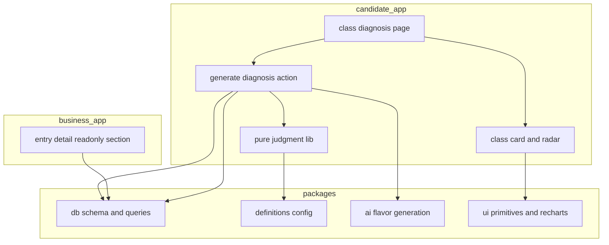
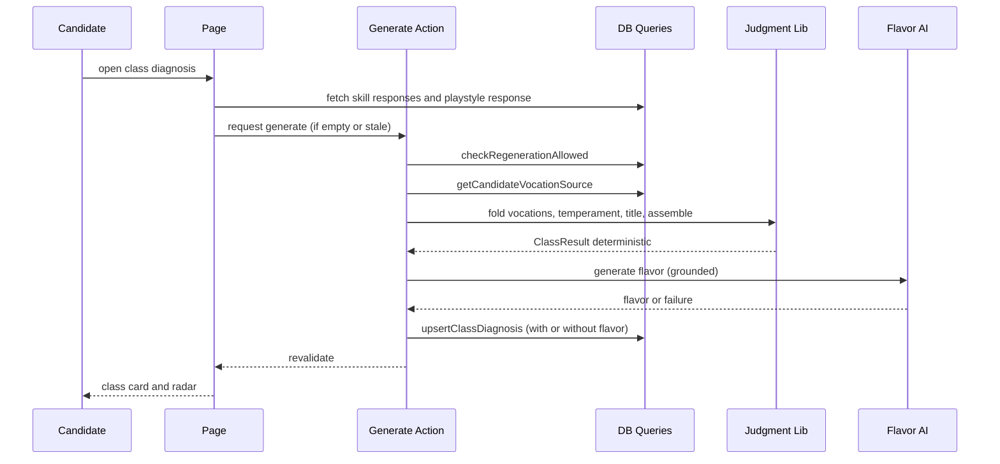
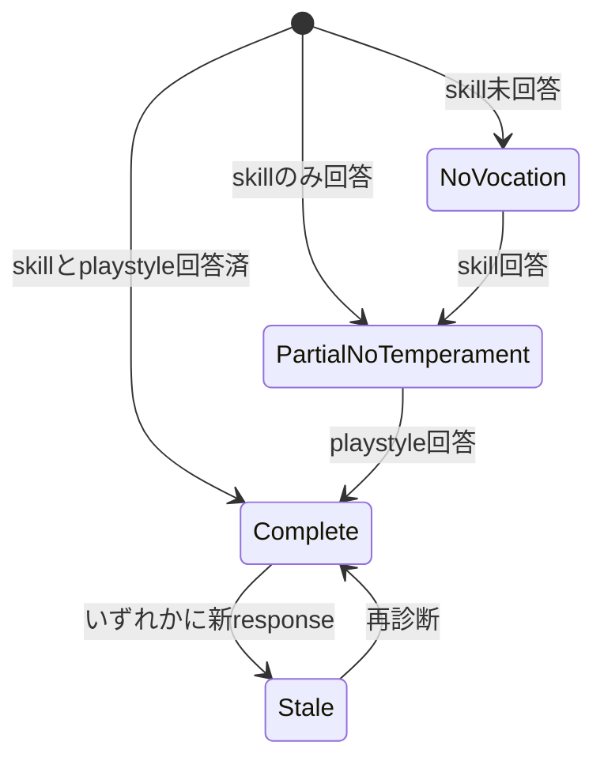

# Technical Design — rpg-class-diagnosis（Phase 1: 個人クラス診断）

## Overview

本機能は、既存の skill-survey（職種別スキルアンケート）と self-analysis（自己分析）基盤の上に、候補者を「RPGのクラス」として診断する機能を追加する。クラスは **職掌（どこで戦うか）× 気質（どう戦うか）** で構成し、さらに **称号（キャラの格＝広さ×深さ）** を重ねる。職掌は候補者の全 skill-survey 回答から横断合成し、気質は本specで新設する12問のプレイスタイル診断から導く。

**Purpose**: 候補者本人にはキャッチーで共有したくなる自己理解体験（狙いA）を、企業には候補者クラスの read-only 把握（狙いB）を提供する。
**Users**: candidate アプリの候補者が診断・閲覧・共有し、business アプリの企業ユーザーが代表クラスを read-only 参照する。
**Impact**: 既存の決定論的集計・LLM生成・版管理・Recharts 可視化を再利用しつつ、新規に「候補者単位の確定診断（`class_diagnosis`）」「プレイスタイル診断 survey」「純粋判定ロジック」「フレーバー生成 AI」を追加する。

### Goals

- 職掌7 × 気質4 = 28クラスを、定義の積み木（職掌7＋気質4＋称号）から決定論的に生成する。
- スキル実力に依らず「型」を出し、ベテラン（広く深い）を上位称号（賢者/勇者）として適切に表現する。
- LLM 失敗時もクラス・可視化を必ず表示する（graceful degradation）。
- 下流（Phase 2 パーティ編成）が使えるよう、7職掌のスコアベクトルを保持する。

### Non-Goals

- パーティ編成・バランス可視化（Phase 2、別spec）。
- クエスト適合・採用戦略提案（Phase 3、別spec）。
- 賢者・策士に対応する専用スキルアンケートの新規作成（別spec。本specは職掌の「枠」のみ定義）。
- skill-survey / プレイスタイル診断以外（面接・エントリー履歴）の診断入力利用。

## Boundary Commitments

### This Spec Owns

- `class_diagnosis`（候補者単位・版管理つき確定診断）のスキーマとデータの真実。
- プレイスタイル診断（`skill_survey.jobType = 'playstyle'`）の seed 定義。
- 純粋判定ロジック：職掌ベクトル畳み込み、主/副職掌判定、気質軸スコアと象限化、広さ×深さの称号、クラス組み立て。
- 職掌/気質/称号/職掌アフィニティの定義（config 定数）。
- candidate 向けクラス診断ページ・生成 Server Action・クラスカード UI・共有表現。
- フレーバーテキスト生成 AI（`@bulr/ai` の新サブモジュール）。

### Out of Boundary

- 複数候補者を横断するパーティ編成・充足度計算（Phase 2）。
- skill-survey マスタ（カテゴリ/設問/選択肢）の構造変更。既存スキーマ変更は `score_kind` への `'polarity'` 追加と `survey_kind`/`kind` 列追加（非破壊・既定 `'skill'`）に限定。
- self-analysis 本体のロジック変更（`aggregate()` は読み取り再利用のみ）。唯一の例外は `getAnsweredSurveysForCandidate` への `kind='skill'` 絞り込み追加（playstyle 混入防止の最小変更で、集計・生成ロジックは不変）。
- business 側での診断の再計算・編集（read-only 表示に限定）。

### Allowed Dependencies

- 読み取り再利用：`aggregate()`（`apps/candidate/.../self-analysis/_lib/aggregate.ts`）、`AggregatedSnapshot`/`CategoryCoverage` 型、skill-survey 回答クエリ。
- 版管理・cooldown パターン：`self_analysis` の upsert/history/`checkRegenerationAllowed` を参照実装として踏襲。
- 認可：既存 `requireCandidate` / `candidateProfileId` 固定フィルタ、`@bulr/ai` クライアント（`ANTHROPIC_API_KEY` サーバ側のみ）。
- 依存方向：`types → db → ai → apps`。app内は `_lib(純関数) → _actions(Server Action) → _components(UI)`。逆流禁止。

### Revalidation Triggers

- `class_diagnosis` の JSON 契約（`vocationVector` / `temperamentAxes` / `sourceSnapshot`）の形状変更 → Phase 2/3 は再確認。
- 職掌の集合（7種）や職掌キー名の変更 → 定義 config・下流の充足計算に波及。
- `score_kind` enum への追加以外のスキーマ破壊的変更。
- 代表クラス選定規則（R10.2）の変更 → business 表示に波及。

## Architecture

### Existing Architecture Analysis

- **monorepo（Turborepo + pnpm）**、`apps/candidate`・`apps/business`・`apps/admin` ＋ `packages/db`（Drizzle スキーマとクエリの唯一の真実）・`packages/ai`（LLM 純関数＋Zod）・`packages/ui`（dist ビルドで消費）・`packages/types`。steering の「Stage1 単一アプリ」記述は陳腐化しており、実体は app 分割後。
- **決定論コア＋LLM 補助**：self-analysis は `aggregate()`（純関数）で数値可視化を確定し、LLM は自然言語のみを担い、失敗しても可視化は残す。本機能もこの原則を踏襲する。
- **追記型データ＋版管理**：skill-survey 回答は append-only。`self_analysis` は `sourceResponseId` ユニークで版を保持。
- **維持すべき統合点**：`candidateProfileId` によるデータ所有、`requireCandidate` 認可、drizzle migration 自動採番（最新 `0019`）。

### Architecture Pattern & Boundary Map



**Architecture Integration**:
- **Selected pattern**: 決定論パイプライン（横断集計 → 純関数判定 → 確定保存）＋ LLM サイドカー（フレーバーのみ）。
- **Boundaries**: 純関数判定（`_lib`）は入力→出力のみで DB/LLM を知らない。永続化は `class_diagnosis`。フレーバーは分離され失敗許容。
- **Preserved patterns**: self-analysis の状態分岐（NoResponse/Empty/Complete/VizOnly/Stale）、cooldown、`skill-balance-radar` の Recharts。
- **New components rationale**: (1) 職掌横断合成は既存クエリに無い、(2) 候補者単位の確定診断は self_analysis の 1:1 と版キーが異なる、(3) 気質軸スコアは proficiency と意味が異なる。
- **Steering compliance**: `apps → packages` 単方向、DB 真実は packages/db、LLM 真実は packages/ai。

### Technology Stack

| Layer | Choice / Version | Role in Feature | Notes |
| --- | --- | --- | --- |
| Frontend | Next.js 16 App Router / React 19 | 診断ページ・クラスカード・部分状態 | 既存 candidate app に追加 |
| UI | Tailwind 4 + `@bulr/ui`(dist) + Recharts | レーダー可視化・カード | `skill-balance-radar` 流用 |
| Judgment | TypeScript 純関数（strict, no any） | 職掌/気質/称号/クラス判定 | app-local `_lib`、決定論・単体テスト必須 |
| AI | Vercel AI SDK 6 `generateObject` + Anthropic Sonnet | フレーバー生成 | `@bulr/ai/class-diagnosis` 新設、失敗時フォールバック |
| Data | Neon Postgres + Drizzle 0.45 | `class_diagnosis` 永続化、横断集計クエリ | 新テーブル＋`score_kind`に`'polarity'`追加 |
| Migration | drizzle-kit generate→push/migrate | `0020_*` 自動採番 | 既存レシピ踏襲 |

## File Structure Plan

### Directory Structure

```
packages/db/src/
├── schema/
│   ├── skill-survey.ts                    # [変更] score_kind に 'polarity' + survey_kind enum と kind 列を追加
│   └── class-diagnosis.ts                 # [新規] class_diagnosis テーブル + JSON型
├── queries/class-diagnosis/
│   ├── candidate-vocation-source.ts       # [新規] 候補者の kind='skill' 回答のみ横断取得→集計
│   ├── class-diagnosis-query.ts           # [新規] upsert/history/latest/cooldown/代表クラス
│   └── index.ts                           # [新規] バレル
└── seeds/skill-surveys/
    └── playstyle.ts                       # [新規] プレイスタイル診断 seed(2軸x6問、逆転含む)

packages/ai/class-diagnosis/
├── src/schema.ts                          # [新規] 入出力Zod/型(ClassFlavor)
├── src/generate-class-flavor.ts           # [新規] フレーバー生成(structured output)
└── src/index.ts                           # [新規] バレル

apps/candidate/app/class-diagnosis/
├── page.tsx                               # [新規] Server Component 状態分岐
├── _actions/generate-class-diagnosis.ts   # [新規] 生成/再生成オーケストレーション
├── _lib/
│   ├── definitions.ts                     # [新規] 職掌7/気質4/称号/アフィニティ config
│   ├── vocation.ts                        # [新規] カテゴリ→7職掌畳み込み, argmax, 副職掌しきい値
│   ├── temperament.ts                     # [新規] 軸スコア正規化, 逆転吸収, 中点二値化
│   ├── title.ts                           # [新規] 広さ×深さ→称号
│   ├── assemble.ts                        # [新規] 職掌×気質×称号→ClassResult 組み立て
│   └── types.ts                           # [新規] ClassResult 等ドメイン型
└── _components/
    ├── class-diagnosis-view.tsx           # [新規] 状態表示切替(self-analysis-view 準拠)
    ├── class-card.tsx                     # [新規] クラス名/アイコン/称号/フレーバー
    ├── vocation-radar.tsx                 # [新規] 7職掌レーダー(skill-balance-radar 準拠)
    ├── share-panel.tsx                    # [新規] 共有表現(PII除外)
    └── generate-button.tsx                # [新規] 生成/再生成 CTA(pending UI)
```

### Modified Files

- `packages/db/src/schema/skill-survey.ts` — `score_kind` に `'polarity'` を追加、`survey_kind` enum(`'skill'|'playstyle'`)と `skill_survey.kind`（notNull default `'skill'`）を追加（既存行は `'skill'` 既定で非破壊）。
- `packages/db/src/schema/index.ts` — `class-diagnosis` を re-export。
- `packages/db/src/queries/index.ts` — `class-diagnosis` クエリを re-export。
- `packages/db/src/queries/self-analysis/answered-surveys-query.ts` — `getAnsweredSurveysForCandidate` に `kind='skill'` フィルタを追加（playstyle を職種アンケート一覧／self-analysis 生成対象から除外。ロジック変更ではなく絞り込みのみ）。
- `packages/db/src/seeds/index.ts` — `playstyleSurveySeed` の seed 呼び出しを追加。
- `packages/ai/package.json`（or exports）— `class-diagnosis` サブパスを追加。
- `apps/business/app/(interviewer)/openings/[openingId]/entries/[entryId]/page.tsx` — 代表クラスの read-only セクションを追加（R10）。

> 純粋判定ロジックは candidate app-local（既存 `aggregate.ts` の app-local 慣習に合わせる）。Phase 2 が定義 config を要すれば、その時に package へ抽出する（本specでは投機的抽象を避ける）。

## System Flows

### 診断生成フロー（Server Action）



判定（`L`）は純粋・決定論的で先に確定する。フレーバー（`AI`）は後続かつ失敗許容で、失敗時は `llmFlavor=null` で保存し UI はテンプレ文で描画する（R7.3）。

### 状態遷移（陳腐化・部分状態）



`Stale` は保存済み `sourceSnapshot` の各 `submittedAt` より新しい response が寄与 survey か playstyle に存在するかで判定する（self-analysis の陳腐化に準拠）。

## Requirements Traceability

| Requirement | Summary | Components | Interfaces / Data | Flows |
| --- | --- | --- | --- | --- |
| 1.1–1.7 | 職掌の横断合成・主/副判定・決定論 | `vocation.ts`, `candidate-vocation-source.ts`, `definitions.ts` | `foldVocations`, `VocationVector` | 生成フロー |
| 2.1–2.6 | 気質12問・軸スコア・象限化 | `playstyle.ts`(seed), `temperament.ts` | `scoreTemperament` | 生成フロー |
| 3.1–3.7 | クラス・広さ×深さ称号 | `title.ts`, `assemble.ts`, `definitions.ts` | `resolveTitle`, `assembleClass` | 生成フロー |
| 4.1–4.4 | 閲覧・可視化・数値非表示 | `class-diagnosis-view`, `class-card`, `vocation-radar` | `ClassResult` | — |
| 5.1–5.2 | 共有・PII除外 | `share-panel` | `toShareText` | — |
| 6.1–6.4 | 版管理・履歴・再診断・cooldown | `class-diagnosis-query.ts` | `upsertClassDiagnosis`, `checkRegenerationAllowed` | 状態遷移 |
| 7.1–7.3 | フレーバー＋劣化耐性 | `generate-class-flavor.ts`, generate action | `generateClassFlavor` | 生成フロー |
| 8.1–8.3 | 部分状態・低信頼 | `class-diagnosis-view`, generate action | `DiagnosisState` | 状態遷移 |
| 9.1–9.3 | 定義マスタ・拡張性・賢者/策士枠 | `definitions.ts` | `VOCATIONS`, `CATEGORY_AFFINITY` | — |
| 10.1–10.3 | business read-only・代表クラス | entry 詳細 page, `getRepresentativeClass` | `RepresentativeClass` | — |
| 11.1–11.3 | 認可・プライバシー | generate action, page, queries | `requireCandidate` | — |
| 12.1–12.2 | 7職掌ベクトル保持 | `class-diagnosis.ts` schema | `vocationVector` jsonb | 生成フロー |

## Components and Interfaces

| Component | Layer | Intent | Req | Key Deps (P0/P1) | Contracts |
| --- | --- | --- | --- | --- | --- |
| definitions.ts | Config | 職掌/気質/称号/アフィニティ定義 | 1,3,9 | — | State |
| vocation.ts | Logic | 職掌ベクトル畳み込み・主/副判定 | 1 | definitions(P0) | Service |
| temperament.ts | Logic | 気質軸スコア・象限化 | 2 | definitions(P0) | Service |
| title.ts | Logic | 広さ×深さ→称号 | 3 | definitions(P0) | Service |
| assemble.ts | Logic | ClassResult 組み立て | 3,8,12 | vocation,temperament,title(P0) | Service |
| candidate-vocation-source.ts | DB | 全skill-survey回答の横断取得 | 1 | aggregate()(P0) | Service |
| class-diagnosis-query.ts | DB | 保存/履歴/最新/cooldown/代表 | 6,10 | class_diagnosis(P0) | Service, State |
| generate-class-flavor.ts | AI | フレーバー生成 | 7 | @bulr/ai client(P0) | Service |
| generate-class-diagnosis.ts | Action | 生成オーケストレーション | 1,6,7,8,11 | 上記全(P0) | Service |
| class-diagnosis-view + card + radar + share | UI | 表示・共有 | 4,5,8 | @bulr/ui, Recharts(P1) | State |
| entry read-only section | UI(business) | 代表クラス表示 | 10 | class-diagnosis-query(P0) | State |

### Config

#### definitions.ts

**Responsibilities & Constraints**
- 7職掌・4気質・称号・カテゴリ→職掌アフィニティ・jobType→既定職掌を型付き定数で保持。判定ロジックの唯一の設定源（R9.1）。
- 賢者・策士は定義を置くが対応カテゴリが無ければスコア0で非活性、対応 survey 追加で自動開放（R9.2/9.3）。

**Contracts**: State ☑

```typescript
export type Vocation =
  | 'vanguard'   // 前衛 フロントエンド
  | 'rearguard'  // 後衛 バックエンド
  | 'guardian'   // 守護 インフラ SRE QA セキュリティ
  | 'sage'       // 賢者 AI ML 検索 推薦 データ
  | 'commander'  // 指揮 エンジニアリングマネージャー
  | 'strategist' // 策士 プロダクトマネージャー
  | 'ranger';    // 遊撃 フルスタック AI駆動開発

export const VOCATIONS: readonly Vocation[]; // displayOrder 兼 tiebreak 順

export type TemperamentAxis = 'explorationDeepening' | 'soloCollaboration';
export type Temperament = 'explorer_solo' | 'explorer_collab' | 'deepener_solo' | 'deepener_collab';
export type Title = 'sage_hero' | 'specialist' | 'jack_of_all' | 'apprentice';

// カテゴリ名(またはjobType)から各職掌への重み(0..1)。合計1でなくてよい。
export const CATEGORY_AFFINITY: Record<string, Partial<Record<Vocation, number>>>;
export const JOBTYPE_DEFAULT_VOCATION: Record<string, Vocation>;

// 判定パラメータ(校正可能、config 集中)
export const SUB_VOCATION_RATIO = 0.75;   // 副職掌 相対しきい値
export const SUB_VOCATION_MAX = 2;         // 副職掌 上限
export const BREADTH_ABS_THRESHOLD = 60;   // 「広さ」に数える職掌スコア絶対閾値(0..100)
export const BREADTH_WIDE_MIN = 4;         // これ以上で「広」
export const DEPTH_DEEP_MIN = 70;          // 深さ(対象職掌の平均熟練度)閾値
export const LOW_CONFIDENCE_MIN_ANSWERS = 8; // これ未満で低信頼(R8.3)
export const TEMPERAMENT_MIDPOINT = 50;
```

### Logic（純関数・app-local）

#### vocation.ts / temperament.ts / title.ts / assemble.ts

**Responsibilities & Constraints**
- すべて純関数（同一入力→同一出力、DB/LLM 非依存）。R1.7/R2/R3 の決定論要件を担保。
- 同点は `VOCATIONS`（displayOrder）で決定論的 tiebreak（R1.6）。気質中点は既定極へ寄せ `balanced` フラグ（R2.5）。

**Contracts**: Service ☑

```typescript
// vocation.ts
export interface VocationInput {
  // 候補者の各 survey 集計から抽出。categoryScore は proficiency→frequency→coverage の順で
  // フォールバック正規化した 0..100 の寄与スコア（source 層で解決済み。null は非寄与）。
  categories: Array<{ categoryName: string; categoryScore: number | null; answeredCount: number }>;
}
export type VocationVector = Record<Vocation, number>; // 0..100 正規化
export interface VocationResult {
  vector: VocationVector;
  primary: Vocation;
  subs: Vocation[];        // 相対75%・最大2、なければ空
  totalAnswered: number;
}
export function foldVocations(input: VocationInput): VocationResult;
// 事前条件: categories 非空。事後条件: primary は vector の argmax。
// 不変条件: subs は primary を含まず score>=primary*0.75 の上位最大2、tiebreak=displayOrder。

// temperament.ts
export interface TemperamentAnswer { axis: TemperamentAxis; level: number; reverse: boolean; maxLevel: number; }
export interface TemperamentResult {
  axes: Record<TemperamentAxis, number>; // 0..100
  quadrant: Temperament;
  balanced: boolean;                     // いずれかの軸が中点
}
export function scoreTemperament(answers: TemperamentAnswer[]): TemperamentResult | null; // 未回答は null(R8.2)
// 逆転設問は (maxLevel - level) に変換して平均、0..100 正規化、中点で二値化。

// title.ts
export interface TitleResult { title: Title; breadth: number; depth: number; }
export function resolveTitle(v: VocationResult): TitleResult;
// 広さ=score>=BREADTH_ABS_THRESHOLD の職掌数、深さ=該当職掌の平均score。2x2 で Title 決定(R3.2-3.6)。

// assemble.ts
export interface ClassResult {
  primaryVocation: Vocation;
  subVocations: Vocation[];
  vocationVector: VocationVector;         // R12: 全7職掌保持
  temperament: Temperament | null;        // playstyle 未回答なら null(R8.2)
  temperamentBalanced: boolean;
  title: Title;
  representativeVocation: Vocation;        // 称号併記用(最大比重)
  className: string;                       // 表示名(定義から組成)
  confidence: 'low' | 'normal';           // R8.3
}
export function assembleClass(v: VocationResult, t: TemperamentResult | null, title: TitleResult): ClassResult;
```

**Implementation Notes**
- Integration: `generate action` から順に呼ぶ。UI は `ClassResult` のみ参照。
- Validation: 入力は Server Action 側で型検証済み。境界（空カテゴリ）は例外でなく安全既定。
- Risks: 閾値（`definitions.ts` 定数）は初期値であり、seed データでの実測後に校正する（research.md の持ち越し課題2）。

### DB

#### candidate-vocation-source.ts

**Responsibilities & Constraints**
- 候補者が回答済みの **`kind='skill'` の** skill-survey のみを対象に（playstyle は除外）、最新 response を読み、`aggregate()` を適用してカテゴリ別の寄与スコアを返す（R1.1/1.2）。self_analysis 生成有無に依存しない。
- 各カテゴリの寄与スコアは決定論的フォールバックで正規化する：`categoryScore = proficiencyScore ?? frequencyScore ?? round(coverageRatio*100)`（proficiency 系でない職掌＝賢者/指揮/遊撃が構造的に過小評価されるのを防ぐ）。`answeredCount=0` のカテゴリは寄与に数えない。

**Contracts**: Service ☑

```typescript
export interface CandidateVocationSource {
  surveys: Array<{ surveyId: string; jobType: string; responseId: string; submittedAt: Date; overallCoverageRatio: number; }>;
  // categoryScore は proficiency→frequency→coverage フォールバックで解決済みの 0..100（null=非寄与）。
  categories: Array<{ surveyId: string; categoryName: string; categoryScore: number | null; answeredCount: number }>;
}
export function getCandidateVocationSource(candidateProfileId: string): Promise<CandidateVocationSource>;
```

- 事前条件: `candidateProfileId` は本人（Action で `requireCandidate`）。事後条件: 未回答なら `surveys=[]`（R8.1 の分岐材料）。

#### class-diagnosis-query.ts

**Responsibilities & Constraints**
- 候補者単位の確定診断を append-only で保存。`sourceSignature`（寄与 response id 群の決定論的連結）で版を一意化し、同一入力の重複生成を upsert で抑止。最新版取得・履歴・cooldown・代表クラスを提供（R6/R10）。

**Contracts**: Service ☑ / State ☑

```typescript
export interface ClassDiagnosisSourceSnapshot {
  skillResponses: Array<{ surveyId: string; responseId: string; submittedAt: string; overallCoverageRatio: number }>;
  playstyleResponseId: string | null;
  playstyleSubmittedAt: string | null;
}
export interface UpsertClassDiagnosisInput {
  candidateProfileId: string;
  sourceSignature: string;
  sourceSnapshot: ClassDiagnosisSourceSnapshot;
  result: ClassResult;                    // 確定判定(JSONで保存)
  llmFlavor: ClassFlavor | null;
  metadata: { llm_cost_estimate?: { input_tokens: number; output_tokens: number; estimated_usd: number } } | null;
  regenerationCount: number;
  regenerationWindowStart: Date;
}
export function upsertClassDiagnosis(input: UpsertClassDiagnosisInput): Promise<ClassDiagnosisRecord>;
export function getLatestClassDiagnosis(candidateProfileId: string): Promise<ClassDiagnosisRecord | null>;
export function getClassDiagnosisHistory(candidateProfileId: string): Promise<ClassDiagnosisRecord[]>;
export function checkClassRegenerationAllowed(candidateProfileId: string, sourceSignature: string): Promise<RateLimitVerdict>;
export function getRepresentativeClass(candidateProfileId: string): Promise<RepresentativeClass | null>; // R10.2
```

- Invariants: `unique(candidateProfileId, sourceSignature)`。最新版は `generatedAt` 降順先頭。`getRepresentativeClass` は「候補者単位の最新確定診断」を代表クラスと定義し（R10.2）、そこから `className`・`primaryVocation`・`title` のみを返す（R10.3、根拠回答は返さない）。survey 単位の複数診断から選抜する処理は存在しない（職掌は既に横断合成済みのため代表対象は単一）。
- 陳腐化: page 側で `sourceSnapshot.*.submittedAt` と最新 response を比較して判定（DB は生データを返すのみ）。

### AI

#### generate-class-flavor.ts

**Responsibilities & Constraints**
- 確定した `ClassResult` と候補者の回答ラベルを入力に、根拠づけた短いフレーバー文を structured output で生成（R7.1）。数値・他者比較・順位を出さない（R7.2、self-analysis の grounding 制約を踏襲）。DB 非依存（DI）。

**Contracts**: Service ☑

```typescript
export const classFlavorSchema = z.object({
  tagline: z.string().max(80),          // 一言キャッチ
  description: z.string().max(400),     // クラス説明(根拠づけ)
  nextStepHint: z.string().max(200),    // 隣接クラスへの成長ヒント(R4.3)
});
export type ClassFlavor = z.infer<typeof classFlavorSchema>;
export interface ClassFlavorInput {
  result: ClassResult;
  answers: Array<{ categoryName: string; selectedLabels: string[]; freeText: string | null }>;
}
export function generateClassFlavor(input: ClassFlavorInput): Promise<{ output: ClassFlavor; usage: { input_tokens: number; output_tokens: number } }>;
```

**Implementation Notes**
- Integration: `generate-self-analysis.ts` を参照実装として写経。`generateObject` + Zod、`maxRetries: 2`。
- Risks: 失敗は Action 側で捕捉し `llmFlavor=null` 保存 → UI はテンプレ文（R7.3）。

### Action / UI

- `generate-class-diagnosis.ts`（Server Action）: `requireCandidate` → `checkClassRegenerationAllowed` → `getCandidateVocationSource` ＋ playstyle 回答取得 → 純関数判定 → `generateClassFlavor`（try/catch）→ `upsertClassDiagnosis` → `revalidatePath`。再診断は narrative のみ更新も可。
- UI（summary-only）: `class-diagnosis-view` が状態分岐（`NoVocation`/`PartialNoTemperament`/`Complete`/`VizOnly`/`Stale`）を担い、`class-card`・`vocation-radar`・`share-panel` を配置。`vocation-radar` は `skill-balance-radar` を参照実装に 7職掌ベクトルを描画。数値スコアは非表示（R4.4）。

## Data Models

### Logical Data Model

- `class_diagnosis` は `candidate_profile` に属する（`candidateProfileId` FK, `ON DELETE CASCADE`）。1候補者に複数版（append-only）。
- 版一意キーは `(candidateProfileId, sourceSignature)`。`sourceSignature` は寄与 skill response id 群＋playstyle response id をソート連結した決定論的文字列。
- 職掌の入力元 `skill_survey_response` と気質の入力元 playstyle `skill_survey_response` は参照のみ（本テーブルは FK を張らず `sourceSnapshot` に id と submittedAt を記録）。これにより「複数ソース参照」を単一テーブルで表現し、陳腐化を submittedAt 比較で判定する。

### Physical Data Model

```typescript
export const classDiagnosis = pgTable('class_diagnosis', {
  id: text('id').primaryKey().$defaultFn(() => nanoid()),
  candidateProfileId: text('candidate_profile_id').notNull()
    .references(() => candidateProfile.id, { onDelete: 'cascade' }),
  sourceSignature: text('source_signature').notNull(),
  sourceSnapshot: jsonb('source_snapshot').$type<ClassDiagnosisSourceSnapshot>().notNull(),
  result: jsonb('result').$type<ClassResult>().notNull(),          // 確定判定(職掌/気質/称号/vector/confidence)
  llmFlavor: jsonb('llm_flavor').$type<ClassFlavor>(),             // nullable = LLM失敗(R7.3)
  metadata: jsonb('metadata').$type<ClassDiagnosisMetadata>(),
  regenerationCount: integer('regeneration_count').notNull().default(0),
  regenerationWindowStart: timestamp('regeneration_window_start', { withTimezone: true }).notNull().defaultNow(),
  generatedAt: timestamp('generated_at', { withTimezone: true }).notNull().defaultNow(),
  createdAt: timestamp('created_at', { withTimezone: true }).notNull().defaultNow(),
  updatedAt: timestamp('updated_at', { withTimezone: true }).notNull().defaultNow(),
}, (t) => [
  uniqueIndex('class_diagnosis_candidate_signature_idx').on(t.candidateProfileId, t.sourceSignature),
  index('class_diagnosis_candidate_generated_idx').on(t.candidateProfileId, t.generatedAt),
]);
```

- **Temporal**: `generatedAt` 降順で最新版。履歴は全版保持（R6.1）。
- **score_kind 拡張**: `skill-survey.ts` の `pgEnum('score_kind', [...])` に `'polarity'` を追加。playstyle seed の設問は `scoringKind='polarity'`、選択肢に Likert `level`（例 0..4）を割当。逆転設問は seed で `level` を反転して表現（スキーマ構造は不変）。
- **survey_kind 導入**: `pgEnum('survey_kind', ['skill','playstyle'])` と `skill_survey.kind`（notNull, default `'skill'`）を追加。既存 job 系 survey は `'skill'`、playstyle seed のみ `'playstyle'`。職掌集計（`candidate-vocation-source`）は `kind='skill'` を、playstyle 回答取得は `kind='playstyle'` を、既存の職種アンケート一覧／self-analysis 生成（`getAnsweredSurveysForCandidate`）は `kind='skill'` を、それぞれフィルタ条件に用いる。これにより性格クイズと職種スキルの混線を構造的に防ぐ。

### Data Contracts & Integration

- `result`（`ClassResult`）と `vocationVector` が Phase 2/3 への公開契約。`vocationVector` は7職掌全キーを常に含む（R12.1/12.2）。
- 代表クラス（R10）は `getRepresentativeClass` が最新版から `className`/`primaryVocation`/`title` のみ返す最小契約。

## Error Handling

### Error Strategy

- **User errors**: 未認証→サインイン誘導（R11.1）。未回答→CTA（R8.1/8.2）。cooldown 超過→理由提示で再診断拒否（R6.4）。
- **System errors**: LLM 失敗→`llmFlavor=null` で確定診断を保存し UI はテンプレ文（R7.3）。DB 書込失敗→Action はエラー返却、判定結果は再計算可能（副作用は upsert のみ）。
- **Business logic**: 空入力・同点・中点は例外にせず安全既定（tiebreak/既定極/`balanced`）。低信頼は `confidence='low'` で表現を弱める（R8.3）。

### Monitoring

- LLM コストは `metadata.llm_cost_estimate` に記録（self-analysis と同形式、admin 監視の将来集計に接続）。cooldown カウンタで暴走防止。

## Testing Strategy

### Unit Tests（純関数中心）

- `foldVocations`: 単一 survey→本命職掌／横断合成で比重反映／守護寄せ（backend でセキュリティ突出）／同点 tiebreak が displayOrder 順（1.1–1.6）。
- `foldVocations` 副職掌: 相対75%境界・上限2・該当なしで単一（1.4/1.5）。
- `scoreTemperament`: 逆転設問の反転吸収／中点で `balanced=true`／未回答で null（2.3–2.5, 8.2）。
- `resolveTitle`: 広×深=賢者/勇者、狭×深=スペシャリスト、広×浅=遊撃、狭×浅=見習い、ベテラン境界（3.2–3.6）。
- `assembleClass`: `vocationVector` が7キー完備／`confidence='low'` 閾値（12.1, 8.3）。

### Integration Tests

- `getCandidateVocationSource`: 複数 survey 回答→カテゴリ横断集約、未回答で空（1.2, 8.1）。**`kind='playstyle'` の survey は集計対象から除外される**（Issue1）。**proficiencyScore=null のカテゴリは frequencyScore→coverageRatio にフォールバックして寄与し、賢者/指揮/遊撃が0固定にならない**（Issue2, 1.1/1.2）。要クリーン DB・`--concurrency=1`・@bulr/db fileParallelism:false（既存 CI レシピ）。
- `getAnsweredSurveysForCandidate`: `kind='skill'` のみ返し、playstyle survey が職種アンケート一覧・self-analysis 対象に出現しない（Issue1）。
- `upsertClassDiagnosis` + `checkClassRegenerationAllowed`: 同一 `sourceSignature` は版重複せず、24h 上限で拒否、履歴は全版保持（6.1–6.4）。
- `getRepresentativeClass`: 最新版のクラス名のみ返し根拠回答を含まない（10.2/10.3/11.3）。

### E2E / UI

- 候補者フロー: skill 回答済み→診断生成→クラスカード＋レーダー表示、数値非表示（4.1/4.2/4.4）。
- 部分状態: playstyle 未回答で職掌のみ暫定表示＋CTA（8.2）。
- 陳腐化: 新規回答後に stale バナー→再診断で更新（6.2/6.3）。
- business: entry 詳細に代表クラスが read-only 表示（10.1）。

## Security Considerations

- 認可は既存踏襲：page・Action の双方で `requireCandidate`、クエリは `candidateProfileId` 固定フィルタで本人限定（R11.1/11.2）。`ANTHROPIC_API_KEY` はサーバ側のみ。
- business 表示はクラス名に限定し根拠回答を開示しない（R11.3/10.3）。共有表現は個人特定情報を含めない（R5.2、`share-panel` の `toShareText` がクラス名・称号のみを出力）。

## Migration Strategy

- `packages/db/src/schema/class-diagnosis.ts` 追加＋`skill-survey.ts` の `score_kind` に `'polarity'` 追加 → `drizzle-kit generate`（`0020_*` 自動採番）→ dev は `push`、prod は `migrate`。DIRECT_URL/DATABASE_URL は既存 gotcha に従い inline 上書き。
- playstyle seed は `runSkillSurveySeed` で冪等 upsert。既存 survey・回答データへの破壊的変更なし（追記型・enum 追加のみ）。
