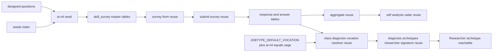

# Design Document — sage-survey

## Overview

**Purpose**: AI/ML・データ専門スキルに特化した独立スキルアンケート（`jobType='ai-ml'`）を新設し、候補者本人の AI/ML スキルバランスの理解と、採用側の一次フィルタ（専門領域カバレッジ判定）を可能にする。あわせて `JOBTYPE_DEFAULT_VOCATION` へ1行追加し、RPG クラス診断の職掌 sage（賢者）とアーキタイプ Researcher（探究者）を開放する。

**Users**: 候補者（AI/ML エンジニア、MLOps エンジニア、データサイエンティスト等）が回答し自己分析で結果を確認する。採用担当者は回答カバレッジを一次フィルタとして利用する。候補者が回答すると、RPG クラス診断で Researcher アーキタイプが初めて到達可能になる。

**Impact**: 既存 skill-survey / self-analysis / class-diagnosis 基盤は survey・jobType 非依存に動作するため、新 survey は **seed 追加のみ**で一覧・回答・自己分析に出現する。職掌開放も `JOBTYPE_DEFAULT_VOCATION` への**1行追加のみ**で成立する。DB スキーマ・`score_kind` enum・集計純関数・フォーム描画・送信・必須判定・クールダウン・履歴・可視化コンポーネント・`diagnosis-archetypes` の導出ロジックは**すべて無変更**。コード成果物は ①`ai-ml.ts` seed 新規作成 ②`seeds/index.ts` への登録 ③`definitions.ts` の `JOBTYPE_DEFAULT_VOCATION` へ1行追加 ④それぞれの検証テスト に限定される。

### Goals

- `jobType='ai-ml'` の独立 survey を seed で提供し、AI/ML・データ専門スキルを 6 カテゴリ（機械学習基礎／モデル開発・評価／データエンジニアリング／推薦・検索／MLOps／分析・可視化）で多角的にカバーする（Req 1, 2）。
- `ai-driven-development-survey`（AI ツール活用、jobType='ai-driven-development'）と主題・測定対象が重複しない、AI/ML モデル・データそのものの専門技術領域を設問化する（Req 2.3）。
- ハイブリッド設問形式（multi_choice / single_choice+level / free_text）と標準習熟度ラベルを既存描画で表示する（Req 3）。
- 技術・手法選択系カテゴリへ代表習熟度ペアを付与し proficiency を供給する（Req 4）。
- 既存の回答保存・クールダウン・自己分析・版履歴・可視化を改修なしで再利用する（Req 7, 8）。
- `JOBTYPE_DEFAULT_VOCATION['ai-ml'] = 'sage'` を追加し、`vocationVector.sage` を非零化して Researcher アーキタイプを到達可能にする（Req 10）。
- 既存職種アンケート・既存職掌判定・既存集計結果の非回帰を担保する（Req 11）。

### Non-Goals

- 新規フォーム描画／可視化コンポーネントの実装（既存を再利用）。
- 既存 backend / frontend / ai-driven-development / infrastructure-sre / engineering-manager アンケート内容の変更。
- DB スキーマ・`score_kind` enum の変更。
- `diagnosis-archetypes` のアーキタイプ定義・`resolveArchetype` / `ARCHETYPE_SIGNATURES` の変更（Researcher の signature は `diagnosis-archetypes` が既に `{ vocation: { sage: 0.9 } }` として定義済み。本仕様は入力である `vocationVector.sage` を非零にするだけ）。
- class-diagnosis の UI（ClassCard / SharePanel）の変更。
- 面接（assessment/interview）・スカウト連携、複数 survey 横断の合成スコア。

## Boundary Commitments

### This Spec Owns

- `jobType='ai-ml'` の survey マスタ定義（カテゴリ／設問／選択肢／level／scoringKind／isRequired）と、その冪等 seed・登録。
- CSV を持たない設問・選択肢の設計内容（設計駆動、`ai-driven-development-survey` / `infrastructure-sre-survey` と同じアプローチ）。
- `apps/candidate/app/class-diagnosis/_lib/definitions.ts` の `JOBTYPE_DEFAULT_VOCATION` への `'ai-ml': 'sage'` 1行追加（および必要であれば `CATEGORY_AFFINITY` への横断カテゴリ精緻化）。

### Out of Boundary

- フォーム描画（`survey-form.tsx`）、回答送信・必須検証・クールダウン（`submit-survey.ts` ほか）、自己分析の検出・集計・可視化（`aggregate()` / `coverage-bars.tsx` / `skill-balance-radar.tsx`）、版履歴 — survey 非依存のため**無変更で再利用**。
- 既存 backend / frontend / ai-driven-development / infrastructure-sre / engineering-manager アンケートの内容・必須判定・集計。
- `diagnosis-archetypes` の `resolveArchetype` / `scoreArchetype` / `ARCHETYPE_SIGNATURES` / `ARCHETYPES`（読み取り専用の前提として扱う。Researcher の到達性は本仕様の副次効果であり、判定ロジックは触らない）。
- DB スキーマ・`score_kind` enum・共有コンポーネント。
- `pdm-strategist-survey`（隣接の別 spec。strategist 職掌・Strategist アーキタイプの開放を担当し、本仕様とは独立）。

### Allowed Dependencies

- 前提依存（マージ済み）: `skill-survey` 基盤、`skill-survey-proficiency-scale`（`choice.level` / `scoring_kind` / 集計の熟練度拡張）。
- 既存テーブル: `skill_survey` 系 4 階層、`skill_survey_response` / `skill_survey_answer`、`self_analysis`。
- 既存設定: 再回答クールダウン（既定 30 日）。
- `apps/candidate/app/class-diagnosis/_lib/definitions.ts`（`JOBTYPE_DEFAULT_VOCATION` / `CATEGORY_AFFINITY` / `resolveCategoryVocationWeights`）— 既存の1行追加パターンをそのまま利用。
- 依存制約: パッケージ依存方向 `types → db → ai → apps`、および `apps → packages` の単方向。seed は `@bulr/db` の schema/client のみ参照。`definitions.ts` 変更は `@bulr/types` の `Vocation` union（変更しない）のみに依存。

### Revalidation Triggers

- seed 登録経路（`seeds/index.ts`）の構造変更。
- マスタ 4 階層のスキーマ・一意キー・`score_kind` enum 変更。
- 必須設問セットの変更（送信バリデーションの結果が変わる）。
- `JOBTYPE_DEFAULT_VOCATION` のキー集合・値の意味変更（`diagnosis-archetypes` の Coverage 表・`definitions.test.ts` の非活性枠テストが古くなる）。
- `diagnosis-archetypes` の `ARCHETYPE_SIGNATURES.researcher` の重み変更（本仕様の効果範囲が変わる）。

## Architecture

### Existing Architecture Analysis

- マスタ 4 階層・冪等 upsert・標準習熟度ラベルは frontend / infrastructure-sre / ai-driven-development と同一。共通ランナー `packages/db/src/seeds/skill-surveys/runner.ts` の `runSkillSurveySeed` が survey→category→question→choice を `onConflictDoUpdate` で upsert する処理を一本化済みであり、各 seed ファイルはデータ定義のみを持つ（infrastructure-sre 以降のパターン）。
- 職掌開放は `resolveCategoryVocationWeights(jobType, categoryName)` の決定論的解決に依存する：明示的な `CATEGORY_AFFINITY[jobType::category]` がなければ `JOBTYPE_DEFAULT_VOCATION[jobType]` へフォールバックする。これにより **1行追加だけで全カテゴリが自動的に sage へ解決される**（横断カテゴリがあれば個別に精緻化）。
- 保持すべき不変点: survey 非依存性、集計純関数性、後方互換、依存方向 `apps → packages`、`resolveCategoryVocationWeights` の複合キー解決による jobType 横断のカテゴリ名衝突耐性。

### Architecture Pattern & Boundary Map



**Key Decisions**: 既存 infrastructure-sre / ai-driven-development seed パターンの複製（設計駆動・CSV なし）。新規アーキテクチャ要素なし。本 spec は `ai-ml.ts`・`seeds/index.ts` 登録行・`definitions.ts` の1行のみ所有する。職掌開放は既存の resolver・signature を変更せず、入力（seed 回答）を追加するだけで到達する。

### Technology Stack

| Layer | Choice / Version | Role in Feature | Notes |
| ----- | ---------------- | --------------- | ----- |
| Data / Storage | drizzle-orm（既存）/ PostgreSQL | seed の冪等 upsert | 既存 schema、マイグレーション無し |
| Tooling | tsx（既存）| `seeds/index.ts` CLI 実行 | `tsx packages/db/src/seeds/index.ts` |
| Test | vitest（既存）| 冪等・構造検証（DB ゲート）、`definitions.ts` の単体検証 | DB テストは `DATABASE_URL` 未設定時 skip、クリーン DB・`fileParallelism:false` で直列実行 |

## File Structure Plan

### Created Files

```
packages/db/src/
├── seeds/skill-surveys/
│   └── ai-ml.ts                       # seed データ定義 + runAiMlSkillSurveySeed（runner.ts 利用、infrastructure-sre.ts と同型）
└── __tests__/
    └── ai-ml-survey.integration.test.ts   # 冪等性・構造検証（DB ゲート）
```

### Modified Files

- `packages/db/src/seeds/index.ts` — `runAiMlSkillSurveySeed` を re-export し、`main()` の実行列へ追加（既存 seed の直後）。
- `apps/candidate/app/class-diagnosis/_lib/definitions.ts` — `JOBTYPE_DEFAULT_VOCATION` に `'ai-ml': 'sage'` を1行追加。コメント中の「sage・strategist は対応 survey 未整備のため本マップに含めない」の記述を sage 分について更新。
- `apps/candidate/app/class-diagnosis/_lib/definitions.test.ts` — 「sage/strategist に対応する jobType は存在しない（非活性枠）」テストを sage 分について更新し、`ai-ml → sage` の解決を検証するケースを追加。既存の EXPECTED_JOBTYPE_DEFAULT フィクスチャに `ai-ml` を追加。

### Unchanged (Reused) — 明示的に手を入れないファイル

- `apps/candidate/app/skill-survey/_components/survey-form.tsx`（描画）
- `apps/candidate/app/skill-survey/[surveyId]/_actions/submit-survey.ts`（送信・必須検証・クールダウン）
- `apps/candidate/app/self-analysis/_lib/aggregate.ts`、`_components/coverage-bars.tsx` / `skill-balance-radar.tsx`（集計・可視化）
- `apps/candidate/app/class-diagnosis/_lib/vocation.ts`（`resolveCategoryVocationWeights` の呼び出し元。無変更で新 jobType を自動解決）
- `apps/candidate/app/class-diagnosis/_lib/archetype/*`（`diagnosis-archetypes` の signature・resolve。Researcher 到達性は入力側の変化のみで実現）

## 設問設計（中核）

CSV を持たないため本セクションが設問の正本。`questionType` 既定は **multi_choice**（scoringKind 無し）。各カテゴリ先頭の経験設問を `isRequired=true`。代表習熟度ペアは 4 カテゴリ（★）に付与。表示順はカテゴリ→設問の宣言順。

### 標準習熟度ラベル（level 0–3）

L0 未経験・知識なし／L1 学習・理解はある（実務経験なし）／L2 実務で実装・運用したことがある／L3 設計・改善を主導／チームへ展開・標準化した。

### `ai-driven-development-survey` との境界（非重複の確認）

`ai-driven-development-survey` は「AI コーディング支援ツールをどう使って開発するか」（Copilot・Cursor・プロンプト設計・エージェント活用・LLM アプリのフレームワーク利用等、ranger 職掌）を測る。本アンケートは「AI/ML モデル・データそのものを設計・学習・評価・運用する専門技術」（アルゴリズム選定・特徴量エンジニアリング・学習パイプライン・評価指標・MLOps 基盤等、sage 職掌）を測る。設問主語が「AI をツールとして使う開発者」か「AI/ML を作る専門家」かで一貫して分離し、選択肢の技術要素も重複しないよう設計する（例: 本アンケートは Copilot 等のコーディング支援ツールを選択肢に含めない）。

### カテゴリ構成（6カテゴリ）

| # | カテゴリ | 設問内容（型 / 必須・proficiency）|
| - | -------- | ------------------------------------------- |
| 1 | 機械学習基礎 ★ | 手法：経験のある学習パラダイム・アルゴリズムを選択（multi, **必須**）／数理・評価の基礎で理解しているものを選択（multi）。代表習熟度：最も得意な手法群を1つ（single）＋習熟度（single, **proficiency**）|
| 2 | モデル開発・評価 ★ | フレームワーク：経験のある ML/DL フレームワークを選択（multi, **必須**）／モデル開発プロセスで経験のあるものを選択（multi）。評価：評価・検証手法で経験のあるものを選択（multi）。代表習熟度：最も得意なフレームワークを1つ（single）＋習熟度（**proficiency**）|
| 3 | データエンジニアリング ★ | パイプライン：データ収集・前処理・パイプライン構築で経験のあるものを選択（multi, **必須**）／利用経験のあるデータ基盤・ツールを選択（multi）。特徴量：特徴量エンジニアリングで経験のあるものを選択（multi）。代表習熟度：最も得意なデータ基盤・ツールを1つ（single）＋習熟度（**proficiency**）|
| 4 | 推薦・検索 | 経験のある推薦・検索・情報検索技術を選択（multi, **必須**）／ベクトル検索・埋め込み関連で経験のあるものを選択（multi）|
| 5 | MLOps ★ | 運用：モデルの学習・デプロイ・監視で経験のあるものを選択（multi, **必須**）／利用経験のある MLOps ツール・基盤を選択（multi）。ガバナンス：モデル品質・再現性・ガバナンスで意識している取り組みを選択（multi）。代表習熟度：最も得意な MLOps ツール・基盤を1つ（single）＋習熟度（**proficiency**）|
| 6 | 分析・可視化 | 経験のあるデータ分析・統計手法を選択（multi, **必須**）／利用経験のある可視化・BI ツールを選択（multi）。取り組み方（free_text, 任意）：モデル・分析結果をどう検証し意思決定に活かしているか記述 |

合計: 6 カテゴリ、経験選択 multi_choice 設問 約 12 問 + 代表習熟度ペア 4（4×2=8 問）+ free_text 1 = **約 21 設問**（実装時にカテゴリ単位で ±α 可、単一領域として現実的な回答ボリューム目標 18–28 設問）。必須 6 問（各カテゴリ先頭）、proficiency 設問 4 問。

### 主要技術・手法選択肢セット（seed で展開、設計時の正本）

- **機械学習基礎（手法）**: 教師あり学習 / 教師なし学習 / 強化学習 / 決定木・アンサンブル（Random Forest, XGBoost, LightGBM）/ サポートベクターマシン / ニューラルネットワーク基礎 / 深層学習（CNN/RNN/Transformer）/ 生成モデル（GAN, VAE, 拡散モデル）/ 大規模言語モデル（事前学習・アーキテクチャ理解）
- **モデル開発・評価（フレームワーク）**: scikit-learn / PyTorch / TensorFlow / Keras / JAX / XGBoost / LightGBM / Hugging Face Transformers / Hugging Face 生態系（Datasets, PEFT 等）
- **データエンジニアリング（基盤・ツール）**: Apache Spark / Apache Airflow / dbt / Kafka / BigQuery / Snowflake / Databricks / Feature Store（Feast 等）/ Pandas・Polars
- **推薦・検索**: 協調フィルタリング / コンテンツベース推薦 / ハイブリッド推薦 / ランキング学習（Learning to Rank）/ ベクトル検索（Faiss, Pinecone, pgvector, Weaviate）/ 埋め込みモデルの学習・活用 / セマンティック検索
- **MLOps（ツール・基盤）**: MLflow / Kubeflow / SageMaker / Vertex AI / Weights & Biases / DVC / モデルサービング（TorchServe, Triton, BentoML）/ 特徴量ストア運用 / CI/CD for ML
- **分析・可視化（BI）**: Jupyter / Tableau / Looker / Metabase / Superset / matplotlib・seaborn・plotly / 統計的仮説検定 / A/Bテスト設計・分析

> 代表習熟度ペアの「最も得意な X を1つ」選択肢は各カテゴリの上記主要セットから構成（scoringKind 無し）。「習熟度」設問は標準習熟度ラベル（level 0–3, scoringKind=proficiency）。

## Data Models

既存スキーマを変更なしで使用。seed が書き込むレコード形状:

- `skill_survey`: `{ jobType:'ai-ml', title:'AI/ML・データ スキルアンケート', isActive:true }`
- `skill_survey_category`: `{ skillSurveyId, name, subcategory, displayOrder }`（(surveyId,name,subcategory) 一意。全カテゴリに非 null の `subcategory` を付与し冪等性を担保する）
- `skill_survey_question`: `{ categoryId, body, questionType, scoringKind|null, isRequired, displayOrder }`（(categoryId,body) 一意）
- `skill_survey_choice`: `{ questionId, label, level|null, displayOrder }`（(questionId,label) 一意）

不変条件: proficiency 設問の各選択肢に level 0–3 を昇順付与。multi_choice / 代表習熟度の選択設問の選択肢は level 無し（null）。

`definitions.ts` 側の変更後の状態:

```typescript
export const JOBTYPE_DEFAULT_VOCATION: Record<string, Vocation> = {
  frontend: "vanguard",
  backend: "rearguard",
  "infrastructure-sre": "guardian",
  "engineering-manager": "commander",
  "ai-driven-development": "ranger",
  "ai-ml": "sage", // 追加: 本仕様
};
```

`CATEGORY_AFFINITY` は既定どおり（横断カテゴリなし）で全カテゴリが `resolveCategoryVocationWeights('ai-ml', category)` → `{ sage: 1 }` にフォールバック解決される。カテゴリ名（「機械学習基礎」等）は他 jobType と衝突しないため、明示的な `CATEGORY_AFFINITY` エントリの追加は不要と判断する。

## Error Handling

- seed はトランザクション内で実行し、いずれかの upsert 失敗時に全体ロールバック（infrastructure-sre / frontend 同型、共通ランナー `runSkillSurveySeed` の既定動作）。
- 必須/送信バリデーション・クールダウンは既存 `submit-survey.ts` が担当（本 spec は seed の `isRequired` 付与のみ）。
- `JOBTYPE_DEFAULT_VOCATION` への1行追加はコンパイル時に `Record<string, Vocation>` 型で検証され、無効な `Vocation` 値は型エラーになる。実行時エラー面はない。

## Testing Strategy

### Integration Tests（DB ゲート、`packages/db/src/__tests__/ai-ml-survey.integration.test.ts`）

1. **冪等性**（Req 9.2）: `runAiMlSkillSurveySeed` を 2–3 回実行し設問・選択肢件数が増えない。
2. **survey 提供**（Req 1.1）: `jobType='ai-ml'` が 1 件・`isActive=true`・期待 title。
3. **カテゴリ構成**（Req 2.1）: トップカテゴリ distinct=6 で、期待 name 集合（機械学習基礎／モデル開発・評価／データエンジニアリング／推薦・検索／MLOps／分析・可視化）に一致。
4. **必須設問**（Req 6.1）: `isRequired=true` が各トップカテゴリに最低1件・計6件。
5. **proficiency 付与**（Req 4.3, 5.1）: `scoringKind='proficiency'` の設問の選択肢が level 0–3 を持ち、代表習熟度ペアが対象 4 カテゴリに存在。
6. **enum 健全性**（Req 5.3）: 付与 scoringKind が `proficiency` のみ（recency/frequency 未使用）。
7. **非回帰**（Req 11.1, 11.3）: backend / frontend / ai-driven-development / infrastructure-sre / engineering-manager / ai-ml の全 seed 投入で各 jobType が衝突せず共存することを確認。

### Unit Tests（`definitions.test.ts` 追補、DB 不要）

1. `JOBTYPE_DEFAULT_VOCATION['ai-ml']` が `'sage'` に解決される（Req 10.1）。
2. `resolveCategoryVocationWeights('ai-ml', <任意の seed カテゴリ名>)` が `{ sage: 1 }`（または明示 affinity があればその値）へ非空に解決される（Req 10.2）。
3. 既存 jobType（frontend / backend / infrastructure-sre / engineering-manager / ai-driven-development）の `resolveCategoryVocationWeights` 結果が本変更前後で不変（Req 10.4, 11.4）。
4. 「sage/strategist に対応する jobType は存在しない（非活性枠）」テストを更新し、sage は `ai-ml` で開放済み・strategist は依然非活性であることを検証する。

### E2E/UI Tests（クリティカルパス・既存再利用の確認）

- 候補者が AI/ML アンケートを一覧から開き、必須設問未回答で送信が拒否され、全必須回答で受理されることを確認（Req 6.2, 6.4 — 既存フォームで動作）。
- 自己分析に AI/ML アンケートの独立カードが出現し、カバレッジ＋熟練度レーダーが表示され、既存アンケートの表示を破壊しないことを確認（Req 8.2, 8.3）。
- 候補者が AI/ML アンケートに回答後、RPG クラス診断で `vocationVector.sage` が非零となり Researcher アーキタイプが到達可能になることを確認（Req 10.3。`diagnosis-archetypes` 側の `resolveArchetype` は変更せず、入力データのみで到達性が変わることの確認）。

### 非回帰

- 既存 backend / frontend / ai-driven-development / infrastructure-sre / engineering-manager アンケートの一覧・回答・必須判定・クールダウン・自己分析・既存スナップショット・既存職掌判定が不変（Req 11.1-11.4）。
