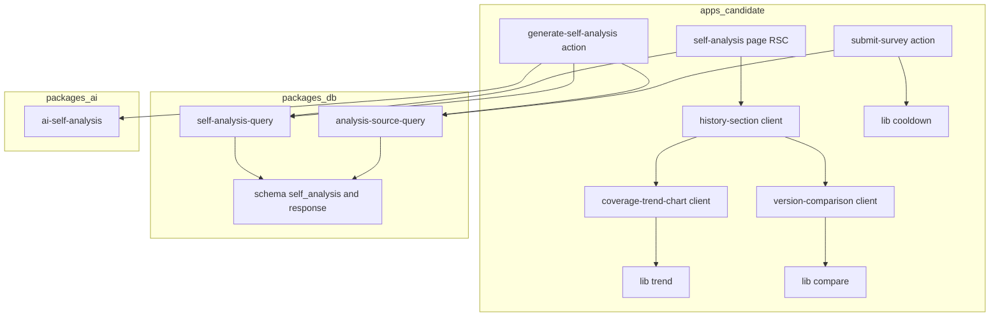
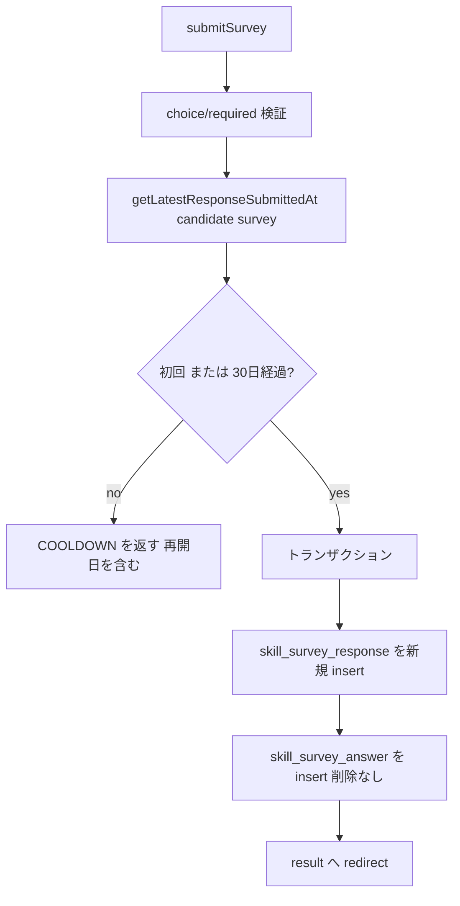
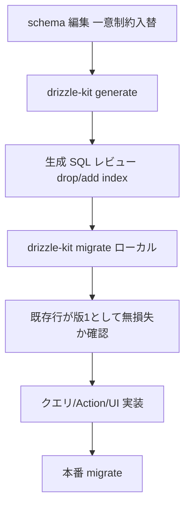

# Technical Design — self-analysis-history

## Overview

本機能は候補者の自己分析（`/self-analysis`）を**版（バージョン）管理**へ拡張し、スキルアンケートの再回答ごとに回答と自己分析を履歴として保持する。候補者は全体・カテゴリ別のスキル網羅度の推移を時系列グラフで振り返り、任意の2版を選んで差分を比較できる。

**Users**: 認証済みの候補者が、自身のスキルの成長を `/self-analysis` 上で振り返るために利用する。

**Impact**: 現状 `skill_survey_response` と `self_analysis` は `UNIQUE(candidateProfileId, skillSurveyId)` により最新1件のみを upsert 保持し、再回答で過去が上書きされる。本設計はこれを**追記型（append-only）**へ変える。版キーは `self_analysis` が既に保持する `source_response_id` を採用し、新テーブルを追加しない。あわせて、版の乱立と生成コスト増大を抑えるため同一アンケートの再回答に**30日クールダウン**を導入する。

### Goals

- スキルアンケートの再回答ごとに回答・自己分析を版として保持し、履歴を失わない（R1, R3）。
- 同一アンケートの再回答を前回提出から30日間抑止する（R2）。
- 全体・カテゴリ別網羅度の成長推移グラフと、任意2版の差分比較を提供する（R4, R5）。
- 既存の最新版表示・生成・再生成・陳腐化判定の利用者体験と、既存データを非破壊で維持する（R3, R7）。

### Non-Goals

- 複数職種（複数スキルアンケート）の横断比較・統合分析（R7.3 で明示除外）。
- 他候補者との比較・序列化、数値スコア/偏差値の提示（R4.5）。
- 面接・エントリー履歴の自己分析への統合。
- 履歴版の手動削除・編集、管理者によるクールダウン例外リセット（将来検討）。

## Boundary Commitments

### This Spec Owns

- `skill_survey_response` / `self_analysis` の**追記型化**（一意制約の撤廃・付け替え）と、それに伴う既存クエリ・Server Action の版対応への書き換え。
- 再回答30日クールダウンの判定ロジックと、`submitSurvey` での適用・拒否応答。
- 版履歴・指定版取得クエリ（`getSelfAnalysisHistory` / `getSelfAnalysisByResponseId`）と、成長推移・差分の整形（純関数）。
- `/self-analysis` の履歴セクション UI（推移グラフ・版選択・2版比較）。

### Out of Boundary

- 自己分析の決定論的集計（`aggregate`）・自然言語生成（`@bulr/ai-self-analysis`）・コスト推定（`estimateUsd`）の**内部ロジック**。本設計はこれらを再利用するのみで変更しない。
- skill-survey の回答フォーム UI・設問マスタ・必須検証（`candidate-self-analysis` / `skill-survey` の責務）。
- admin-operations のコスト集計（`metadata.llm_cost_estimate` の形式は維持し、消費側は変更しない）。

### Allowed Dependencies

- 依存方向は既存規約どおり **apps → packages**（単方向）。クエリは `@bulr/db`、Server Action は `apps/candidate`、認証は `@bulr/auth/server`。
- UI は `@bulr/ui` / Tailwind v4 / lucide-react を利用。新規に `recharts`（＋ `react-is` override）を `apps/candidate` に追加。
- `self_analysis.source_response_id` を版キーとして参照してよい（既存カラム）。

### Revalidation Triggers

以下の変更は下流の消費側に再確認を要求する:

- `getSelfAnalysis` / `getSurveyResponseForAnalysis` / `checkRegenerationAllowed` / `getLatestResponseByCandidateProfileId` の**意味変更**（最新版/版スコープ化／ORDER BY 明示）。これらを呼ぶ全箇所（generate / regenerate / self-analysis page / skill-survey result page）が対象。
- `skill_survey_response` / `self_analysis` の一意制約変更（マイグレーション）。
- `submitSurvey` の戻り値に `COOLDOWN` エラーコードを追加（回答フォーム consumer）。再回答入口（result の編集リンク・フォーム入口）はクールダウン状態を表示に反映。

## Architecture

### Existing Architecture Analysis

レイヤ構成（既存）: `schema (@bulr/db)` → `queries (@bulr/db)` → `Server Actions (apps/candidate/_actions)` → `Page (RSC)` → `Components`。`_lib` の純関数（`aggregate` / `cost`）が Server Action から呼ばれる。本設計はこの層構成を踏襲し、版対応を各層へ加算する。

`self_analysis` は既に `source_response_id` / `source_submitted_at` を保持しており、版の紐付けに必要な情報は揃っている。最大の制約は、**一意制約に暗黙依存するクエリ**が版複数化で破綻する点である。下表の4クエリに加え、実装着手時に**両テーブルの全 consumer を grep で棚卸し**し、`LIMIT 1`／一意制約前提の箇所を漏れなく洗い出す（タスク化）:

| クエリ（ファイル） | 現状の前提 | 版対応後 |
|---|---|---|
| `getSelfAnalysis(candidate, survey)`（self-analysis-query.ts） | UNIQUE で1件 | `source_submitted_at` 降順の**最新版**を返す |
| `getSurveyResponseForAnalysis(candidate, survey)`（analysis-source-query.ts:100） | UNIQUE で1件（コメント明記） | **最新 response** へ解決＋**responseId 指定**版を分離 |
| `checkRegenerationAllowed(candidate, survey)`（self-analysis-query.ts） | UNIQUE 行のカウンタ | **source_response_id スコープ**のカウンタへ |
| `getLatestResponseByCandidateProfileId(candidate, survey)`（**skill-survey/index.ts:23**） | `ORDER BY` 無し `.limit(1)`（コメント「ユニーク制約により最大1件」）。名前に反し最新を**非保証** | `ORDER BY submitted_at DESC LIMIT 1` を明示し**最新 response** を返す。`/skill-survey/[surveyId]/result` ページの consumer |

### Architecture Pattern & Boundary Map



**Architecture Integration**:
- **Selected pattern**: 既存レイヤ拡張（Option A: 既存テーブル追記型化、新テーブルなし）。
- **Boundaries**: 読み出し契約は `@bulr/db` が所有、UI 履歴表示は `apps/candidate` が所有。純関数（cooldown/trend/compare）は副作用なしで単体検証可能。
- **Preserved patterns**: authedAction の二重ラップ＋discriminated エラー、`candidateProfileId` フィルタ、`revalidatePath('/self-analysis')`。
- **Steering compliance**: apps → packages 単方向、`any` 不使用、recharts は Client Component に隔離。

### Technology Stack

| Layer | Choice / Version | Role in Feature | Notes |
| --- | --- | --- | --- |
| Frontend | recharts ^3 + react-is override (=React 19 版) | 成長推移の折れ線グラフ | Client Component 限定。SSR 回避のため dynamic import（`ssr:false`）でラップ |
| Frontend | React 19 / Tailwind v4 / lucide-react（既存） | 版選択・比較 UI | 既存 `CoverageBars` / `NarrativeSection` を再利用 |
| Backend | Next.js Server Actions（既存） | cooldown 適用・版スコープ生成 | authedAction 規約踏襲 |
| Data | PostgreSQL + drizzle-kit（既存） | 一意制約入替・追記型化 | `drizzle-kit generate` → `migrate` |

> recharts は React 19 で `react-is` の peer 解決問題があるため、`package.json` の pnpm `overrides` で `react-is` を React 19 系に固定する（research.md 参照）。

## File Structure Plan

### Directory Structure

```
apps/candidate/app/self-analysis/
├── _components/
│   ├── coverage-trend-chart.tsx     # 新規: recharts 折れ線（client, dynamic import 対象）
│   ├── version-comparison.tsx       # 新規: 2版選択＋差分表示（client, CoverageBars/NarrativeSection 再利用）
│   ├── history-section.tsx          # 新規: 履歴セクション統括（client, server から history を props 受領）
│   ├── narrative-section.tsx        # 新規: 強み/弱み/成長アクションのリスト（self-analysis-view から抽出・export）
│   ├── coverage-bars.tsx            # 既存(export済): 比較で左右並置に再利用（変更なし想定）
│   └── self-analysis-view.tsx       # 既存: 最新版表示（NarrativeSection を抽出 import へ置換＋履歴セクションを内包）
├── _lib/
│   ├── cooldown.ts                  # 新規: canReAnswer 純関数（30日判定・再開日算出）
│   ├── trend.ts                     # 新規: buildCoverageTrend 純関数（history→時系列）
│   ├── compare.ts                   # 新規: diffVersions 純関数（2版の網羅度差分）
│   ├── aggregate.ts                 # 既存（変更なし）
│   └── cost.ts                      # 既存（変更なし）
└── page.tsx                         # 既存: getSelfAnalysisHistory を追加取得し history-section へ渡す
```

### Modified Files

- `packages/db/src/schema/self-analysis.ts` — 一意インデックスを `(candidate, survey)` → `(source_response_id)` へ変更。履歴/最新取得用に `(candidate_profile_id, skill_survey_id, source_submitted_at)` の非一意インデックスを追加。
- `packages/db/src/schema/skill-survey-response.ts` — `UNIQUE(candidate, survey)` を撤廃し、`(candidate_profile_id, skill_survey_id, submitted_at)` の非一意インデックスを追加。
- `packages/db/src/queries/self-analysis/self-analysis-query.ts` — `getSelfAnalysis` を最新版取得へ、`checkRegenerationAllowed` を responseId スコープへ、`upsertSelfAnalysis` の onConflict を `source_response_id` へ変更。`getSelfAnalysisHistory` / `getSelfAnalysisByResponseId` を新規追加。
- `packages/db/src/queries/self-analysis/analysis-source-query.ts` — `getSurveyResponseForAnalysis` を「最新 response 解決」と「responseId 指定」に分離。`getLatestResponseSubmittedAt(candidate, survey)` を新規追加（cooldown 用）。
- `packages/db/src/queries/skill-survey/index.ts` — `getLatestResponseByCandidateProfileId` の Step1 を `ORDER BY submitted_at DESC LIMIT 1` へ修正（追記型化で最新 response を確実に返す）。**両テーブルの全 consumer を grep 棚卸しし、他に `LIMIT 1`／一意前提の箇所が無いか確認**（Critical Issue 1 対応）。
- `apps/candidate/app/skill-survey/[surveyId]/result/page.tsx` — 上記クエリ修正により最新版回答を表示（コード変更は基本不要だが、回帰確認の対象）。「回答を編集する」リンクはクールダウン中は無効化・再開日表示（`getLatestResponseSubmittedAt`＋`canReAnswer` を RSC で評価）。
- `apps/candidate/app/skill-survey/[surveyId]/page.tsx`（回答フォーム入口）— クールダウン中はフォームを編集不可表示＋再開日提示にする（入口抑止）。一覧 `apps/candidate/app/skill-survey/page.tsx` も再回答導線があればクールダウン状態を反映（最小実装としては result/フォーム入口を優先）。
- `apps/candidate/app/skill-survey/[surveyId]/_actions/submit-survey.ts` — Step1 を upsert→**新規 insert**、Step2（answer 全削除）を**撤廃**。insert 前に cooldown 検証を追加し `COOLDOWN` を返す。
- `apps/candidate/app/self-analysis/_components/narrative-section.tsx` — 新規。現在 `self-analysis-view.tsx` 内のローカル関数 `NarrativeSection` を**共有コンポーネントへ抽出**し export（`self-analysis-view` と `version-comparison` で共用）。`self-analysis-view.tsx` は抽出後の import へ置換（Critical Issue 3 対応）。
- `apps/candidate/app/self-analysis/_actions/generate-self-analysis.ts` — 最新 response を先に解決し responseId スコープで rate-limit 判定。regenerate は `existing.sourceResponseId` の回答で再生成（版を増やさない）。
- `packages/db/src/index.ts` — 新規クエリの re-export。
- `apps/candidate/package.json` — `recharts` 追加、`react-is` override 追加。`vitest` を devDependency に追加し `test` スクリプトを定義。
- `apps/candidate/vitest.config.ts` — 新規。純関数（`_lib/cooldown` `_lib/trend` `_lib/compare`）に限定した最小 vitest 設定（`app/self-analysis/_lib/**/*.test.ts` を対象）。
- `apps/candidate/app/self-analysis/_lib/{cooldown,trend,compare}.test.ts` — 新規。各純関数の境界条件ユニットテスト。
- `turbo.json` — `test` タスクを追加（`apps/candidate` の vitest を pipeline に載せる）。

## System Flows

### 回答提出（cooldown 付き・追記型）



クールダウンは新規 response の作成のみを抑止する。既存の最新版に対する自己分析の生成・再生成は cooldown の対象外（10回/24h の版スコープ上限で別途制御）。

### 自己分析の生成（版スコープ）

`generate` は最新 response を解決 → その `responseId` で `checkRegenerationAllowed` → 集計 → LLM → `source_response_id` 一意キーで upsert。再回答直後の新 response は分析行が無いため初回生成として許可され、当該版の分析が作られる。`regenerate` は最新版の分析（`getSelfAnalysis`）の `sourceResponseId` の回答を入力に LLM のみ再実行し、その版の行を更新する（集計・snapshot 不変）。

### ページ読み出しと陳腐化

`page.tsx` は `getAnsweredSurveyForCandidate`（最新 response の survey 特定）→ `getSelfAnalysis`（最新版の分析）→ `getSelfAnalysisHistory`（全版）を取得。陳腐化は従来式 `answered.submittedAt > record.sourceSubmittedAt` を維持（最新 response に分析が未生成なら stale 表示＋過去版の履歴は閲覧可、R3.4）。

## Requirements Traceability

| Requirement | Summary | Components | Interfaces | Flows |
| --- | --- | --- | --- | --- |
| 1.1, 1.2, 1.3 | 回答版の追記保持 | schema(response), submit-survey | 新規 insert, `getLatestResponseSubmittedAt` | 回答提出 |
| 2.1, 2.2, 2.3, 2.4 | 30日クールダウン（入口抑止＋提出拒否の二層） | `_lib/cooldown`, submit-survey, result/form 入口ページ | `canReAnswer`, `COOLDOWN` 応答, 入口での `CooldownVerdict` 表示 | 回答提出 |
| 3.1, 3.2 | 版ごとの分析保持・再生成は版更新 | self-analysis-query, generate-self-analysis | `upsertSelfAnalysis`(onConflict=responseId), `updateNarrative` | 自己分析の生成 |
| 3.3, 3.4 | 最新版表示・未生成時の導線 | page, self-analysis-view, history-section | `getSelfAnalysis`(最新版) | ページ読み出し |
| 3.5 | 再生成日次上限維持 | self-analysis-query | `checkRegenerationAllowed`(responseId) | 自己分析の生成 |
| 4.1, 4.2, 4.3, 4.4, 4.5 | 成長推移グラフ | history-section, coverage-trend-chart, `_lib/trend` | `getSelfAnalysisHistory`, `buildCoverageTrend` | ページ読み出し |
| 5.1, 5.2, 5.3, 5.4 | 2版比較 | version-comparison, `_lib/compare` | `getSelfAnalysisByResponseId`, `diffVersions` | ページ読み出し |
| 6.1, 6.2, 6.3 | アクセス制御・所有 | 全クエリ, page | `candidateProfileId` フィルタ, `requireCandidate` | 全フロー |
| 7.1, 7.2, 7.3 | 移行・非破壊・横断比較なし | schema migration, queries（4クエリ＋consumer 棚卸し） | drizzle migration, `getLatestResponseByCandidateProfileId` ORDER BY 修正 | 移行 |

## Components and Interfaces

| Component | Domain/Layer | Intent | Req Coverage | Key Dependencies (P0/P1) | Contracts |
|---|---|---|---|---|---|
| cooldown | apps/_lib | 30日再回答可否の純関数 | 2.1–2.4 | なし | Service(pure) |
| trend | apps/_lib | history→時系列の純関数 | 4.1–4.4 | AggregatedSnapshot(P0) | Service(pure) |
| compare | apps/_lib | 2版の網羅度差分の純関数 | 5.1, 5.3 | AggregatedSnapshot(P0) | Service(pure) |
| analysis-source-query | packages/db | 最新/指定版 response 取得・最新提出日時 | 1.x, 2.x, 3.x | schema(P0) | Service |
| self-analysis-query | packages/db | 版スコープ read/write・履歴 | 3.x, 4.1, 5.x, 6.x | schema(P0) | Service, State |
| submit-survey | apps/_actions | 追記 insert＋cooldown 適用 | 1.x, 2.x | cooldown(P0), query(P0) | Service |
| generate-self-analysis | apps/_actions | 版スコープ生成・再生成 | 3.1, 3.2, 3.5 | query(P0), ai(P0) | Service |
| coverage-trend-chart | apps/_components | recharts 折れ線 | 4.1–4.3 | recharts(P0), trend(P1) | — |
| version-comparison | apps/_components | 版選択＋差分表示 | 5.1–5.4 | compare(P1), CoverageBars(P1) | State |
| history-section | apps/_components | 履歴セクション統括 | 4.4, 5.4 | chart(P1), comparison(P1) | State |

### packages/db — 版スコープ read/write

#### analysis-source-query（拡張）

**Responsibilities & Constraints**
- 最新 response の解決と responseId 指定取得を分離し、一意制約への暗黙依存を排除する。
- 全 read は `candidateProfileId` フィルタで本人所有のみ（R6.1, R6.3）。

**Contracts**: Service [x]

```typescript
// 最新 response を解決して回答束を返す（generate 用）。最新は submitted_at 降順 LIMIT 1。
function getLatestSurveyResponseForAnalysis(
  candidateProfileId: string,
  surveyId: string,
): Promise<SurveyResponseForAnalysis | null>;

// 指定 response の回答束を返す（regenerate 用・版固定）。本人フィルタ込み。
function getSurveyResponseByResponseId(
  candidateProfileId: string,
  responseId: string,
): Promise<SurveyResponseForAnalysis | null>;

// cooldown 判定用に (candidate, survey) の最新提出日時を返す。未回答は null。
function getLatestResponseSubmittedAt(
  candidateProfileId: string,
  surveyId: string,
): Promise<Date | null>;
```

- Preconditions: `candidateProfileId` は認証済み本人。
- Postconditions: `SurveyResponseForAnalysis` の形は既存型を維持（消費側非破壊）。
- Invariants: skill_survey 系へ書き込みしない（read-only）。

**Implementation Notes**
- Integration: 既存 `getSurveyResponseForAnalysis` を `getSurveyResponseByResponseId` を中核に再構成し、`getLatestSurveyResponseForAnalysis` は最新 responseId 解決後に委譲。Step1 の `LIMIT 1` を `ORDER BY submitted_at DESC LIMIT 1` へ。
- Risks: generate/regenerate の呼び分けミスは版取り違えに直結。generate=最新、regenerate=`existing.sourceResponseId` を厳守。

#### self-analysis-query（拡張）

**Contracts**: Service [x] / State [x]

```typescript
// 履歴の1版（昇順に versionIndex を付与）
interface SelfAnalysisVersion {
  responseId: string;        // = source_response_id（版キー）
  versionIndex: number;      // 1-based, source_submitted_at 昇順
  submittedAt: Date;         // = source_submitted_at
  aggregatedSnapshot: AggregatedSnapshot;
  llmOutput: SelfAnalysisNarrative | null; // null = 可視化のみ（R4.3, R5.3）
}

// 既存: 最新版の分析を返す（source_submitted_at 降順 LIMIT 1 へ意味変更）
function getSelfAnalysis(
  candidateProfileId: string, skillSurveyId: string,
): Promise<SelfAnalysisRecord | null>;

// 新規: 全版を昇順で返す（推移グラフ・版選択用）。本人フィルタ込み。
function getSelfAnalysisHistory(
  candidateProfileId: string, skillSurveyId: string,
): Promise<SelfAnalysisVersion[]>;

// 新規: 指定版の分析を返す（2版比較用）。本人フィルタ込み。
function getSelfAnalysisByResponseId(
  candidateProfileId: string, responseId: string,
): Promise<SelfAnalysisRecord | null>;

// 既存: rate-limit を responseId スコープへ意味変更
function checkRegenerationAllowed(
  candidateProfileId: string, sourceResponseId: string,
): Promise<RateLimitVerdict>;

// 既存: onConflict target を [source_response_id] へ変更（引数形は不変）
function upsertSelfAnalysis(input: UpsertSelfAnalysisInput): Promise<SelfAnalysisRecord>;
```

- Preconditions: 各 read は本人 `candidateProfileId` 必須。
- Postconditions: `getSelfAnalysisHistory` は `versionIndex` 昇順・連番。`checkRegenerationAllowed` は対象版の行が無ければ初回生成として許可。
- Invariants: `upsertSelfAnalysis` は `source_response_id` 一意キーで1版1行を保証。

**Implementation Notes**
- Integration: `RateLimitVerdict` / `SelfAnalysisRecord` 型は維持。`checkRegenerationAllowed` の引数を `skillSurveyId` → `sourceResponseId` に変更するため、呼び出し側（generate/regenerate）も更新（Revalidation Trigger）。
- Risks: `getSelfAnalysis` の「最新版」化で、再回答直後（最新 response に分析未生成）は前版の分析が返り、page の stale 判定でカバーされる（R3.4）。この連動を実装時に必ず確認。

### apps/candidate/_lib — 純関数

```typescript
// cooldown.ts — 30日（既定）クールダウン判定。now/cooldownDays を引数注入し決定論化。
interface CooldownVerdict {
  allowed: boolean;
  nextAvailableAt: Date | null; // allowed=false のとき再開日時
}
function canReAnswer(
  lastSubmittedAt: Date | null, now: Date, cooldownDays?: number /* =30 */,
): CooldownVerdict;

// trend.ts — history→時系列。全体＋カテゴリ別の網羅度系列。viz_only 版も網羅度は含む（R4.3）。
interface TrendPoint { versionIndex: number; submittedAt: Date; value: number; }
interface CoverageTrend {
  overall: TrendPoint[];
  byCategory: Array<{ categoryName: string; points: TrendPoint[] }>;
}
function buildCoverageTrend(history: SelfAnalysisVersion[]): CoverageTrend;

// compare.ts — 2版の網羅度差分。
interface CategoryDelta { categoryName: string; from: number; to: number; delta: number; }
interface VersionDiff { overallDelta: number; categories: CategoryDelta[]; }
function diffVersions(from: SelfAnalysisVersion, to: SelfAnalysisVersion): VersionDiff;
```

- これら3関数は副作用なし・決定論的（`now` を引数化）で、単体テスト対象（Testing Strategy 参照）。

### apps/candidate/_components — 履歴 UI（presentational 中心）

- **coverage-trend-chart.tsx**（client）: `CoverageTrend` を受け取り recharts `LineChart` で描画。全体ラインを既定表示し、カテゴリは凡例トグルで重畳。SSR 回避のため `history-section` から `dynamic(() => import(...), { ssr: false })` で読み込む。`versionIndex`/`submittedAt` を X 軸、網羅度%を Y 軸。
- **version-comparison.tsx**（client, State）: `SelfAnalysisVersion[]` から2版を選択し、`diffVersions` の結果と各版の `CoverageBars`（export 済）を左右並置。両版に `llmOutput` があれば**抽出済み共有 `NarrativeSection`**（`narrative-section.tsx`）で強み・成長アクションを新旧対比、片方でも null なら網羅度差分のみ（R5.3）。版1件以下は比較 UI を出さない（R5.4）。前提: `NarrativeSection` の抽出・export を先行実施（Modified Files 参照）。
- **history-section.tsx**（client, State）: server から渡る `SelfAnalysisVersion[]` を保持し、推移グラフと比較を束ねる。版1件のときは単点表示・比較無効（R4.4）。本人データのみが props に乗る前提（取得は server 側で本人フィルタ済み）。
- **self-analysis-view.tsx**（既存・微修正）: 最新版表示の下に `history-section` を内包。

**Implementation Note（共通）**: Integration=既存 `CoverageBars` / `NarrativeSection` を再利用し新規描画ロジックを最小化。Validation=網羅度は決定論値をそのまま表示（序列・偏差値は出さない, R4.5）。Risks=recharts のバンドル肥大/Turbopack 警告（`feedback_bulr_ui_dist_build`）— dynamic import と client 隔離で影響を局所化。

## Data Models

### Logical Data Model

- **集約**: 候補者（`candidate_profile`）配下に、survey ごとの**回答版列**（`skill_survey_response` 複数）と、各回答版に対応する**自己分析**（`self_analysis` 1:1 on `source_response_id`）。
- **版キー**: `self_analysis.source_response_id`（既存・notNull）。`source_submitted_at` が版の時系列順序を与える。
- **不変条件**: 1 回答版 = 最大1自己分析（`UNIQUE(source_response_id)`）。回答版・自己分析は上書き削除しない（追記型）。

### Physical Data Model（変更点）

`self_analysis`:
- DROP `unique self_analysis_candidate_survey_idx (candidate_profile_id, skill_survey_id)`
- ADD `unique self_analysis_source_response_idx (source_response_id)`
- ADD `index self_analysis_candidate_survey_submitted_idx (candidate_profile_id, skill_survey_id, source_submitted_at)` — 最新版/履歴取得用

`skill_survey_response`:
- DROP `unique skill_survey_response_candidate_survey_idx (candidate_profile_id, skill_survey_id)`
- ADD `index skill_survey_response_candidate_survey_submitted_idx (candidate_profile_id, skill_survey_id, submitted_at)` — 最新/履歴取得用

> FK（`source_response_id → skill_survey_response.id` 等）は不変。`skill_survey_answer` の `onDelete: cascade` も不変。

### 移行安全性（R7.1）

既存行は (candidate, survey) で一意のため、追記型化後も各行がそのまま版1になる。既存 `self_analysis` は各行が `source_response_id` を保持済みで、新 `UNIQUE(source_response_id)` は既存データで必ず成立する。データ損失・衝突なし。

## Error Handling

### Error Strategy

既存の二段階エラー（authedAction の `ok` → ビジネス層 `ok`）と discriminated union を踏襲する。本機能で追加するビジネスエラーは1種:

| Code | 発生条件 | 応答 |
|---|---|---|
| `COOLDOWN` | 直近提出から30日未満の同一アンケート再回答（R2.1, R2.2） | `{ ok:false, error:{ code:'COOLDOWN', message, nextAvailableAt } }`。フォームは再開日を表示 |

**クールダウンのUX露出（多層・Critical Issue 2 対応）**: 提出時の `COOLDOWN` 拒否は**最終防衛線**とし、ユーザーが入力し切ってから弾かれる体験を避けるため、再回答の**入口で先回りして抑止**する:

- **回答編集の入口**（`/skill-survey/[surveyId]/result` の「回答を編集する」リンク、および survey 一覧/フォーム入口）: クールダウン中は当該リンク/ボタンを無効化し、再開日（`nextAvailableAt`）を併記する。
- 判定は server 側 `getLatestResponseSubmittedAt` ＋ `canReAnswer` を入口ページ（RSC）で評価し、`CooldownVerdict` を表示に反映する（提出時と同一ロジックを共有）。
- これにより R2.2「再開日を提示して受け付けない」を、入口抑止＋提出時拒否の二層で担保する。

既存コード（`NO_RESPONSE` / `NO_ANALYSIS` / `RATE_LIMITED` / `GENERATION_FAILED` / `INVALID_CHOICE_IDS` / `MISSING_REQUIRED_ANSWERS`）は意味・形式を維持。`RATE_LIMITED` は版スコープ（10/24h）として継続し、cooldown とは独立軸である旨を実装コメントに明記。

### Monitoring

`metadata.llm_cost_estimate` の記録は不変（admin-operations 整合）。cooldown 拒否は通常フローのため例外ログ不要。

## Testing Strategy

> 現状リポジトリにテスト基盤（vitest/jest）は存在しない（research.md）。本機能の最大リスクは純関数（cooldown/trend/compare）の境界条件と、版スコープ化に伴うクエリ意味変更にある。**方針確定: vitest を `apps/candidate` に最小導入し、純関数3種を単体テストする**（DB/UI は引き続き local Docker Postgres＋手動検証）。

- **Unit（純関数・新規 vitest を apps/candidate に最小導入【確定】）**:
  1. `canReAnswer`: 初回(null)=allowed、29日=拒否＋再開日、30日ちょうど=allowed の境界（R2.1–2.4）。
  2. `buildCoverageTrend`: 0/1/複数版、viz_only 版の網羅度が系列に含まれる（R4.3, R4.4）。
  3. `diffVersions`: カテゴリ増減・新規/消失カテゴリの delta 計算（R5.1）。
- **Integration（local Docker Postgres・手動 or スクリプト）**:
  1. 再回答で `skill_survey_response` 行が増え過去 answer が残る（R1.1, R1.2）。
  2. cooldown 内の再提出が `COOLDOWN`、30日経過後は受理（R2）。
  3. 同一版へのサマリ再生成で版数が増えず行が更新、別版生成で行追加（R3.1, R3.2）。
  4. `getSelfAnalysis` が最新版、`getSelfAnalysisHistory` が昇順全版を返す（R3.3, R4.1）。
- **E2E/UI（手動・受入確認）**:
  1. 2版以上で推移グラフ表示、1版で単点・比較無効（R4.1, R4.4, R5.4）。
  2. 2版選択で網羅度差分＋強み/成長アクション新旧対比、片方 viz_only で差分のみ（R5.1–5.3）。
- **検証コマンド**: `pnpm typecheck` / `pnpm build`（既存 kiro-impl 運用に準拠）。

> vitest の最小導入は確定（ユーザー承認済み）。本機能が当リポジトリ初のテスト基盤導入となるため、対象は本 spec の純関数3種に限定し、スコープを広げない。

## Migration Strategy



- ロールバック契機: 生成 SQL が想定外（既存 unique 値の重複検出など）。実データは (candidate,survey) 一意のため通常発生しない。
- 検証チェックポイント: migrate 後に `self_analysis` 行数・`source_response_id` の一意性、`skill_survey_response` 行数が不変であること。

## Open Questions / Risks

1. **vitest 最小導入**: 【解決済み・ユーザー承認】純関数3種に限定して `apps/candidate` に導入する。当リポジトリ初のテスト基盤のため対象を本 spec 純関数に限定し、スコープを広げない。
2. **recharts のバンドル影響**: `react-is` override と dynamic import で局所化するが、`/self-analysis` の初回 JS が増える。実測で許容外なら自作 SVG スパークラインへ縮退する退避案を保持。
3. **クールダウン例外運用**: 管理者リセットや誤提出救済は現スコープ外。必要になれば別 spec。
