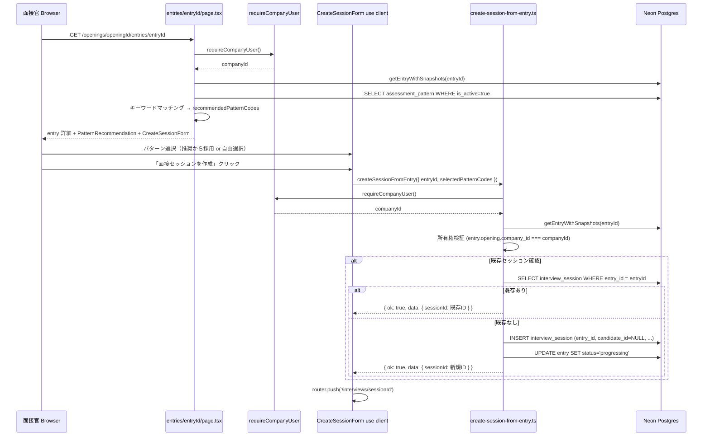
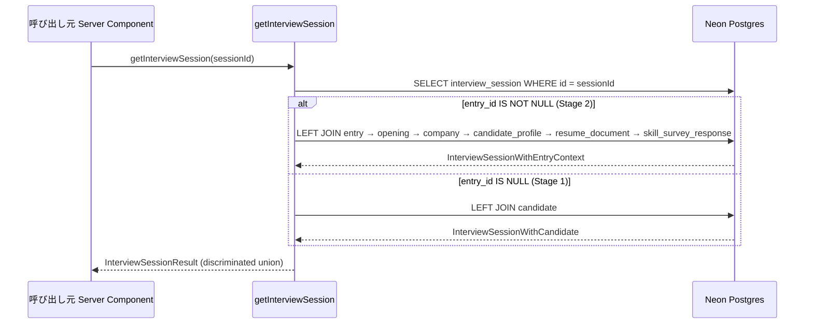

# Design Document — session-from-entry

## Overview

**Purpose**: 本 spec は Wave 3 の最終ピースとして、Stage 1 で構築された `assessment-engine` の `interview_session` テーブルを `entry` 経由で起動できるよう拡張し、Stage 1 → Stage 2 の意味論的整合を完成させる。`entry_id` カラム追加と `candidate_id` nullable 化により、Stage 1 セッション（候補者手入力）と Stage 2 セッション（entry 経由）を同一テーブルで共存させる。

**Users**: 企業ユーザー（`apps/business` の採用担当者・面接官）が entry 詳細ページからスキルアンケート結果を参照しながらパターンを選択し、セッションを作成する直接の受益者。管理者（`apps/admin`）がセッション一覧で entry 経由セッションも確認できる。

**Impact**: `packages/db` の `interview_session` スキーマを拡張し、`apps/business` に `createSessionFromEntry` Server Action + パターン選定支援 UI を追加する。`getInterviewSession` クエリを拡張し、面接アシスタント UI ヘッダー・面接後レポート・admin セッション一覧を Stage 1/2 分岐表示に対応させる。`apps/business` のナビゲーションから `/interviews/new` を非表示にする。

### Goals

- `interview_session` テーブルに `entry_id` (nullable FK) を追加し、`candidate_id` を nullable 化する
- `createSessionFromEntry` Server Action を実装し、entry の候補者・募集・スキルアンケート情報を引き継いでセッションを作成する
- entry 詳細ページにスキルアンケートベースのパターン選定支援 UI を追加する（キーワードマッチング推奨）
- `getInterviewSession` クエリを拡張し entry 経由情報を JOIN する
- 面接アシスタント UI ヘッダー・面接後レポートを Stage 1/2 分岐表示にする
- admin セッション一覧・詳細を entry 経由セッション表示に対応させる
- `/interviews/new` ナビゲーションを非表示にする

### Non-Goals

- `assessment-engine` 本体（5 LLM 関数・状態 A/B 遷移・interview_turn / pattern_coverage / session_report テーブル）の変更
- Stage 1 `candidate` テーブルの削除・縮退
- CHECK 制約の DB 層実装（`entry_id IS NOT NULL OR candidate_id IS NOT NULL` はアプリ層で保証）
- パターン選定の ML ベース最適化（MVP はキーワードマッチング）
- 候補者向け面接セッション可視化（Wave 5+）

---

## Boundary Commitments

### This Spec Owns

- `packages/db/src/schema/interview-session.ts` 更新 (`entry_id` 追加、`candidate_id` nullable 化)
- `packages/db/drizzle/*_session_from_entry.sql` (drizzle-kit 生成 migration)
- `packages/db/src/queries/interview/get-interview-session.ts` (新規または拡張、entry JOIN 対応)
- `packages/db/src/queries/index.ts` 更新 (新規クエリ re-export)
- `apps/business/app/(interviewer)/openings/[openingId]/entries/[entryId]/_actions/create-session-from-entry.ts`
- `apps/business/app/(interviewer)/openings/[openingId]/entries/[entryId]/page.tsx` 更新 (パターン選定支援 UI 追加)
- `apps/business/app/(interviewer)/openings/[openingId]/entries/[entryId]/_components/pattern-recommendation.tsx` (推奨パターンコンポーネント)
- `apps/business/app/(interviewer)/openings/[openingId]/entries/[entryId]/_components/create-session-form.tsx` (セッション作成フォーム Client Component)
- `apps/business/app/(interviewer)/interviews/[sessionId]/page.tsx` 更新 (ヘッダー Stage 1/2 分岐)
- `apps/business/app/(interviewer)/interviews/[sessionId]/report/page.tsx` 更新 (Stage 2 セクション追加)
- `apps/business/app/(interviewer)/interviews/[sessionId]/_components/session-header.tsx` (Stage 1/2 分岐ヘッダー)
- `apps/business/app/(interviewer)/interviews/[sessionId]/report/_components/entry-context-section.tsx` (entry 情報表示)
- `apps/admin/app/sessions/page.tsx` 更新 (entry 経由セッション表示対応)
- `apps/admin/app/sessions/[id]/page.tsx` 更新 (entry 情報追加表示)
- ナビゲーションファイルから `/interviews/new` リンクを削除

### Out of Boundary

- 5 LLM 関数本体 (`analyzeTurn` / `splitInterviewerCandidate` / `proposeNextQuestions` / `aggregatePatternCoverage` / `generateSessionReport`) — 触らない
- `interview_turn` / `pattern_coverage` / `session_report` テーブルのスキーマ変更
- `assessment_pattern` マスタの追加・編集（Wave 4 `admin-operations`）
- Stage 1 `candidate` テーブルの削除・縮退（将来別 spec）
- `/interviews/new` ルートファイルの削除（温存、URL 直接アクセスは可能）
- 候補者向けセッション可視化・通知（Wave 5+）
- パターン選定の ML/ベクトル最適化（MVP はキーワードマッチング）

### Allowed Dependencies

- `entry-flow` が確立する `entry` スキーマ + `getEntryWithSnapshots` + entry 詳細ページ
- `assessment-engine` が確立する `interview_session` スキーマ + 面接アシスタント UI + 面接後レポートページ
- `skill-survey` が確立する `skill_survey_response` スキーマ + `getLatestResponseByCandidateProfileId` + `SkillSurveyResponseWithAnswers`
- `admin-review-panel` が確立する admin セッション一覧・詳細ページ（apps/admin 配下）
- `packages/auth` の `requireCompanyUser` / `authedAction`（既存）
- `packages/db` の既存スキーマ（`assessment_pattern` / `candidate` / `interview_session` 等）
- `packages/db/src/queries/skill-survey/` の既存クエリ
- `apps/* → packages/*` 単方向依存ルール

### Revalidation Triggers

- `interview_session.entry_id` FK 追加 → `getInterviewSession` クエリ + 面接アシスタント UI + レポートすべてを再確認
- `entry` スキーマ変更（`entry-flow`）→ `getInterviewSession` JOIN 定義を再確認
- `SkillSurveyResponseWithAnswers` 型変更（`skill-survey`）→ パターン推奨ロジックと表示を再確認
- `getEntryWithSnapshots` シグネチャ変更（`entry-flow`）→ `createSessionFromEntry` Server Action を再確認
- `requireCompanyUser` 戻り値型変更（`packages/auth`）→ Server Action の認可ロジックを再確認

---

## Architecture

### Existing Architecture Analysis

`entry-flow` 完了時点での構成（本 spec が拡張するベースライン）:

- `packages/db/src/schema/interview-session.ts`: `interview_session` テーブル（`candidate_id` NOT NULL FK、`interviewer_id` FK）
- `packages/db/src/queries/entry/get-entry-with-snapshots.ts`: `EntryWithSnapshots` 型（entry + opening + company + candidateProfile + resumeDocument + skillSurveyResponse）
- `apps/business/app/(interviewer)/openings/[openingId]/entries/[entryId]/page.tsx`: 企業側 entry 詳細ページ（「面接セッションを作成」ボタンのプレースホルダ）
- `apps/business/app/(interviewer)/interviews/[sessionId]/page.tsx`: 面接アシスタント UI（`candidate.name` を表示）
- `apps/business/app/(interviewer)/interviews/[sessionId]/report/page.tsx`: 面接後レポート（Stage 1 のみ）
- `apps/admin/app/sessions/page.tsx` / `[id]/page.tsx`: admin セッション一覧・詳細

**変更点**:
1. `packages/db/src/schema/interview-session.ts` に `entry_id` 追加、`candidate_id` nullable 化
2. `packages/db/src/queries/interview/get-interview-session.ts` を新規追加（または既存クエリ拡張）
3. `apps/business` entry 詳細ページにパターン選定支援 UI + createSessionFromEntry 接続
4. `apps/business` 面接アシスタント UI ヘッダーに Stage 1/2 分岐
5. `apps/business` 面接後レポートに Stage 2 セクション追加
6. `apps/admin` セッション一覧・詳細に entry 経由対応
7. `apps/business` ナビゲーションから `/interviews/new` 削除

### Architecture Pattern & Boundary Map

```mermaid
graph TB
    subgraph BusinessApp[apps/business bz.bulr.net]
        EntryDetailPage[openings/openingId/entries/entryId/page.tsx]
        PatternRec[PatternRecommendation コンポーネント]
        CreateSessionForm[CreateSessionForm use client]
        CreateSessionAction[create-session-from-entry.ts Server Action]
        InterviewPage[interviews/sessionId/page.tsx]
        SessionHeader[SessionHeader Stage 1 or 2]
        ReportPage[interviews/sessionId/report/page.tsx]
        EntryContextSection[EntryContextSection Stage 2]
        Nav[ナビゲーション]
    end
    subgraph AdminApp[apps/admin admin.bulr.net]
        AdminSessionList[sessions/page.tsx]
        AdminSessionDetail[sessions/id/page.tsx]
    end
    subgraph DBPkg[packages/db]
        InterviewSessionSchema[schema/interview-session.ts entry_id 追加]
        GetInterviewSession[queries/interview/get-interview-session.ts]
        EntryQueries[queries/entry/ 既存]
        SSQueries[queries/skill-survey/ 既存]
        AssessmentPatternSchema[schema/assessment-pattern.ts 既存]
    end
    subgraph AuthPkg[packages/auth]
        RequireCompanyUser[requireCompanyUser]
        AutredAction[authedAction]
    end

    EntryDetailPage --> RequireCompanyUser
    EntryDetailPage --> EntryQueries
    EntryDetailPage --> SSQueries
    EntryDetailPage --> PatternRec
    EntryDetailPage --> CreateSessionForm
    CreateSessionForm --> CreateSessionAction
    CreateSessionAction --> AutredAction
    CreateSessionAction --> RequireCompanyUser
    CreateSessionAction --> EntryQueries
    CreateSessionAction --> InterviewSessionSchema

    InterviewPage --> GetInterviewSession
    SessionHeader --> GetInterviewSession
    ReportPage --> GetInterviewSession
    EntryContextSection --> GetInterviewSession

    AdminSessionList --> InterviewSessionSchema
    AdminSessionDetail --> GetInterviewSession

    GetInterviewSession --> InterviewSessionSchema
    GetInterviewSession --> EntryQueries
```



**Architecture Integration**:

- **Selected pattern**: `authedAction + requireCompanyUser` 二重防御パターンを `createSessionFromEntry` に踏襲（`entry-flow` の `getResumeSignedUrlForBusiness` と同一構造）
- **Domain/feature boundaries**: パターン推奨ロジック（キーワードマッチング）は Server Component 内またはユーティリティ純関数として実装。LLM は使わず、assessment_pattern テーブルの `title` / `description` と skill_survey_response の回答テキストの含有比較のみ
- **Existing patterns preserved**: Stage 1 セッション（`entry_id=NULL`、`candidate_id` あり）は既存通り動作。Stage 2 セッション（`entry_id` あり、`candidate_id=NULL`）は分岐表示
- **New components rationale**: `PatternRecommendation` は entry 詳細ページ内の純表示コンポーネント（Server Component）。`CreateSessionForm` は選択パターンコードを保持して Server Action を呼ぶ Client Component（選択状態管理が必要）。`SessionHeader` / `EntryContextSection` は既存ページを最小限拡張する分離コンポーネント
- **Steering compliance**: `tech.md` L196（ファイル名 kebab-case、コンポーネント PascalCase）、`assessment-design.md`（AI は黒子、面接官が判断）、monorepo の `apps → packages` 単方向依存

### Technology Stack

| レイヤー | 選択 / バージョン | 本 spec での役割 | 備考 |
|---------|----------------|----------------|------|
| DB / ORM | Drizzle ORM 0.45.x + Neon Postgres | interview_session スキーマ拡張 + getInterviewSession クエリ | 既存 DB 接続継続。`{ withTimezone: true }` 統一 |
| Migration | drizzle-kit 0.31.x | entry_id カラム追加 migration 生成 | dev: push（inline env override）、prod: generate + migrate |
| Auth | packages/auth / Better Auth 1.6.x | requireCompanyUser / authedAction 再利用 | 既存 guards を利用 |
| Frontend | Next.js 16 App Router + React 19 | entry 詳細 UI 拡張・面接 UI 分岐・レポート拡張 | Server Component 中心、Client Component は最小限 |
| Validation | Zod 4.x（既存） | Server Action 入力検証 | 既存 |
| ID 生成 | nanoid（既存） | interview_session.id 生成 | 既存 convention |

---

## File Structure Plan

### Directory Structure

```
bulr-app-mvp/
├── packages/
│   └── db/
│       └── src/
│           ├── schema/
│           │   └── interview-session.ts          # ★変更: entry_id 追加、candidate_id nullable 化
│           ├── queries/
│           │   ├── interview/
│           │   │   └── get-interview-session.ts  # ★新規: entry JOIN 対応クエリ
│           │   └── index.ts                      # ★変更: get-interview-session re-export 追加
│           └── drizzle/
│               └── *_session_from_entry.sql      # ★新規: drizzle-kit 生成 migration
│
└── apps/
    ├── business/
    │   └── app/
    │       └── (interviewer)/
    │           ├── openings/
    │           │   └── [openingId]/
    │           │       └── entries/
    │           │           └── [entryId]/
    │           │               ├── page.tsx      # ★変更: パターン選定支援 UI 追加
    │           │               ├── _actions/
    │           │               │   └── create-session-from-entry.ts  # ★新規: Server Action
    │           │               └── _components/
    │           │                   ├── pattern-recommendation.tsx    # ★新規: 推奨パターン表示
    │           │                   └── create-session-form.tsx       # ★新規: セッション作成フォーム
    │           └── interviews/
    │               └── [sessionId]/
    │                   ├── page.tsx              # ★変更: SessionHeader 追加
    │                   ├── _components/
    │                   │   └── session-header.tsx  # ★新規: Stage 1/2 分岐ヘッダー
    │                   └── report/
    │                       ├── page.tsx          # ★変更: EntryContextSection 追加
    │                       └── _components/
    │                           └── entry-context-section.tsx  # ★新規: entry 情報表示
    └── admin/
        └── app/
            └── sessions/
                ├── page.tsx                      # ★変更: entry 経由セッション候補者名分岐
                └── [id]/
                    └── page.tsx                  # ★変更: opening / entry 情報追加表示
```

### Modified Files

- `packages/db/src/schema/interview-session.ts` — `entry_id text nullable FK → entry` を追加、`candidate_id` を nullable 化
- `packages/db/src/queries/index.ts` — `get-interview-session` re-export を追加
- `apps/business/app/(interviewer)/openings/[openingId]/entries/[entryId]/page.tsx` — `PatternRecommendation` + `CreateSessionForm` 追加、「面接セッションを作成」ボタンを機能化
- `apps/business/app/(interviewer)/interviews/[sessionId]/page.tsx` — `SessionHeader` コンポーネントを追加、セッションデータ取得に `getInterviewSession` を使用
- `apps/business/app/(interviewer)/interviews/[sessionId]/report/page.tsx` — `EntryContextSection` 追加（entry_id ありの場合のみ表示）
- `apps/admin/app/sessions/page.tsx` — 候補者名表示を `entry_id IS NOT NULL ? candidateProfile.displayName : candidate.name` 分岐に
- `apps/admin/app/sessions/[id]/page.tsx` — entry 経由セッションの opening / candidateProfile 情報追加表示
- `apps/business/app/(interviewer)/layout.tsx` または nav コンポーネント — `/interviews/new` リンクを削除

---

## System Flows

### entry 経由セッション作成フロー



### getInterviewSession クエリ分岐



---

## Requirements Traceability

| 要件 | サマリー | コンポーネント | インターフェース | フロー |
|------|---------|--------------|--------------|------|
| 1.1〜1.6 | interview_session スキーマ拡張 + migration | InterviewSessionSchema, DrizzleMigration | packages/db/schema/interview-session.ts | migration |
| 2.1〜2.8 | createSessionFromEntry Server Action | CreateSessionFromEntryAction | apps/business/…/create-session-from-entry.ts | セッション作成フロー |
| 3.1〜3.7 | パターン選定支援 UI | PatternRecommendation, CreateSessionForm, PatternMatchingUtil | entry 詳細ページ拡張 | セッション作成フロー |
| 4.1〜4.4 | getInterviewSession クエリ拡張 | GetInterviewSession | packages/db/queries/interview/get-interview-session.ts | getInterviewSession 分岐 |
| 5.1〜5.3 | 面接アシスタント UI ヘッダー分岐 | SessionHeader | apps/business/…/session-header.tsx | 面接アシスタント UI |
| 6.1〜6.4 | 面接後レポート Stage 2 拡張 | EntryContextSection, ReportPage | apps/business/…/report/page.tsx | 面接後レポート |
| 7.1〜7.3 | /interviews/new ナビゲーション非表示 | Nav | apps/business 既存 layout / nav | — |
| 8.1〜8.4 | admin セッション一覧・詳細 entry 対応 | AdminSessionList, AdminSessionDetail | apps/admin/sessions/* | admin 一覧・詳細 |

---

## Components and Interfaces

| コンポーネント | ドメイン/レイヤー | 意図 | 要件カバレッジ | キー依存 | コントラクト |
|-------------|----------------|------|-------------|---------|------------|
| `InterviewSessionSchema` | packages/db/schema | entry_id 追加 + candidate_id nullable 化 | 1.1〜1.6 | Drizzle ORM, entry schema | State |
| `DrizzleMigration` | packages/db/drizzle | DDL migration ファイル | 1.6 | drizzle-kit | Batch |
| `GetInterviewSession` | packages/db/queries/interview | Stage 1/2 分岐 JOIN クエリ | 4.1〜4.4 | InterviewSessionSchema, entry schema | Service |
| `CreateSessionFromEntryAction` | apps/business | entry 経由セッション作成 Server Action | 2.1〜2.8 | authedAction, requireCompanyUser, GetEntryWithSnapshots, InterviewSessionSchema | Service |
| `PatternRecommendation` | apps/business | 推奨パターン表示 Server Component | 3.1〜3.3, 3.7 | assessment_pattern schema, SkillSurveyResponseWithAnswers | State |
| `CreateSessionForm` | apps/business | パターン選択 + セッション作成 Client Component | 3.3〜3.6 | CreateSessionFromEntryAction | State + Service |
| `PatternMatchingUtil` | apps/business | キーワードマッチング純関数 | 3.2, 3.7 | (純関数) | Service |
| `SessionHeader` | apps/business | Stage 1/2 分岐ヘッダー | 5.1〜5.3 | GetInterviewSession | State |
| `EntryContextSection` | apps/business | entry 情報・スキルアンケートサマリー表示 | 6.1〜6.4 | GetInterviewSession | State |
| `AdminSessionList` | apps/admin | entry 経由セッション候補者名分岐 | 8.1〜8.2 | InterviewSessionSchema | State |
| `AdminSessionDetail` | apps/admin | entry 情報追加表示 | 8.3〜8.4 | GetInterviewSession | State |

---

### packages/db レイヤー

#### InterviewSessionSchema

| フィールド | 詳細 |
|----------|------|
| Intent | `interview_session` テーブルへの `entry_id` nullable FK 追加と `candidate_id` nullable 化 |
| Requirements | 1.1〜1.6 |

**Physical Data Model（変更差分）**

```sql
-- 既存カラムの変更
ALTER TABLE interview_session
  ALTER COLUMN candidate_id DROP NOT NULL;

-- 新規カラム追加
ALTER TABLE interview_session
  ADD COLUMN entry_id text REFERENCES entry(id);
```

```typescript
// packages/db/src/schema/interview-session.ts（変更差分）
export const interviewSession = pgTable('interview_session', {
  // 既存カラム（変更なし）
  id: text('id').primaryKey().$defaultFn(() => nanoid()),
  interviewerId: text('interviewer_id').notNull().references(() => user.id),
  // candidate_id: nullable 化（.notNull() を削除）
  candidateId: text('candidate_id').references(() => candidate.id),  // nullable
  status: sessionStatus('status').notNull().default('draft'),
  role: text('role').notNull().default('backend'),
  plannedPatternCodes: text('planned_pattern_codes').array().notNull(),
  consentObtainedAt: timestamp('consent_obtained_at', { withTimezone: true }).notNull().defaultNow(),
  consentVersion: text('consent_version').notNull().default('ja-v1'),
  startedAt: timestamp('started_at', { withTimezone: true }),
  completedAt: timestamp('completed_at', { withTimezone: true }),
  createdAt: timestamp('created_at', { withTimezone: true }).notNull().defaultNow(),
  updatedAt: timestamp('updated_at', { withTimezone: true }).notNull().defaultNow(),
  // ★新規追加
  entryId: text('entry_id').references(() => entry.id),  // nullable FK
});
```

**整合性制約**: `entry_id IS NOT NULL OR candidate_id IS NOT NULL` のチェックはアプリ層（`createSessionFromEntry` の入力検証）で保証。MVP では DB CHECK 制約は不要。

**Revalidation Triggers**: `entry` スキーマ変更（`entry-flow`）→ FK 定義を再確認

---

#### GetInterviewSession

| フィールド | 詳細 |
|----------|------|
| Intent | `interview_session` を取得し、`entry_id` 有無に応じて entry/candidate を JOIN する Stage 1/2 対応クエリ |
| Requirements | 4.1〜4.4 |

**Service Interface**

```typescript
// packages/db/src/queries/interview/get-interview-session.ts

// Stage 1 形式（entry_id=NULL）
export type InterviewSessionWithCandidate = {
  session: typeof interviewSession.$inferSelect;
  candidate: typeof candidate.$inferSelect;
  entry: null;
  opening: null;
  company: null;
  candidateProfile: null;
  resumeDocument: null;
  skillSurveyResponse: null;
};

// Stage 2 形式（entry_id あり）
export type InterviewSessionWithEntry = {
  session: typeof interviewSession.$inferSelect;
  candidate: null;
  entry: typeof entry.$inferSelect;
  opening: typeof opening.$inferSelect;
  company: typeof company.$inferSelect;
  candidateProfile: typeof candidateProfile.$inferSelect;
  resumeDocument: typeof resumeDocument.$inferSelect | null;
  skillSurveyResponse: typeof skillSurveyResponse.$inferSelect | null;
};

export type InterviewSessionResult =
  | ({ kind: 'stage1' } & InterviewSessionWithCandidate)
  | ({ kind: 'stage2' } & InterviewSessionWithEntry);

export async function getInterviewSession(
  sessionId: string,
): Promise<InterviewSessionResult | null>;
```

- Preconditions: `sessionId` が有効な `interview_session.id`
- Postconditions: セッションが存在しない場合は `null`。`entry_id IS NOT NULL` なら `kind: 'stage2'`、NULL なら `kind: 'stage1'`
- 実装方針: Drizzle `leftJoin` を使い、`session.entryId IS NULL` かどうかで分岐判定して戻り値 `kind` を決定

---

### apps/business レイヤー

#### CreateSessionFromEntryAction

| フィールド | 詳細 |
|----------|------|
| Intent | entry 情報を引き継いで `interview_session` を作成し、`entry.status` を `progressing` に更新する Server Action |
| Requirements | 2.1〜2.8 |

**Responsibilities & Constraints**

- `apps/business/app/(interviewer)/openings/[openingId]/entries/[entryId]/_actions/create-session-from-entry.ts` に配置
- `authedAction` をバウンダリとして使い、body 内で `requireCompanyUser()` を呼ぶ（二重防御パターン）
- `getEntryWithSnapshots(entryId)` で entry の所有権検証（`entry.opening.company_id === companyId`）
- 既存セッション重複チェック（`SELECT WHERE entry_id = entryId` の結果があれば既存 ID を返す）
- `interview_session.entry_id = entryId`、`candidate_id = NULL`、`planned_pattern_codes = selectedPatternCodes` で INSERT
- INSERT 成功後に `UPDATE entry SET status='progressing'`
- データ整合性保証: `entry_id` をセットするため `candidate_id IS NOT NULL OR entry_id IS NOT NULL` は自動的に満たされる

**Service Interface**

```typescript
const createSessionFromEntrySchema = z.object({
  entryId: z.string().min(1),
  selectedPatternCodes: z.array(z.string()).min(1).max(20),
});

export const createSessionFromEntry = authedAction(
  createSessionFromEntrySchema,
  async ({ entryId, selectedPatternCodes }, { userId }) => {
    const { companyId } = await requireCompanyUser();
    // 1. getEntryWithSnapshots(entryId) → 所有権検証
    // 2. 既存セッション確認
    // 3. INSERT interview_session (entry_id, candidate_id=NULL, planned_pattern_codes)
    // 4. UPDATE entry SET status='progressing'
    return { ok: true, data: { sessionId } };
  }
);
```

- Preconditions: 認証済みの企業ユーザーが当該 entry の `opening.company_id` に所属すること
- Postconditions: `interview_session` に 1 件 INSERT され、`entry.status='progressing'` に更新される
- Invariants: 同一 `entry_id` に対して既存セッションがある場合、新規作成せず既存 ID を返す（べき等性）
- Error codes: `FORBIDDEN`（所有権なし）、`ENTRY_NOT_FOUND`（entry 存在しない）

---

#### PatternRecommendation

| フィールド | 詳細 |
|----------|------|
| Intent | スキルアンケート回答と assessment_pattern のキーワードマッチング結果を表示する Server Component |
| Requirements | 3.1〜3.3, 3.7 |

**Responsibilities & Constraints**

- props: `{ skillSurveyResponse: SkillSurveyResponseWithAnswers | null, patterns: AssessmentPattern[] }`
- `skillSurveyResponse` が null の場合は「スキルアンケート未回答」メッセージを表示（3.4 対応は呼び出し元ページが条件分岐）
- `PatternMatchingUtil.matchPatterns(answers, patterns)` を呼び、スコア降順で推奨パターンを表示
- 各推奨パターンにはパターン名・カテゴリ・マッチ理由（キーワード）を表示
- 推奨は「ヒント」であることを UI 上で明示（例：「以下のパターンがスキルアンケートに関連している可能性があります」）
- このコンポーネント自体は選択状態を持たない（選択は `CreateSessionForm` が担当）

---

#### PatternMatchingUtil

| フィールド | 詳細 |
|----------|------|
| Intent | スキルアンケート回答テキストと assessment_pattern の title/description のキーワード含有マッチングを行う純関数 |
| Requirements | 3.2, 3.7 |

**Service Interface**

```typescript
export type PatternMatch = {
  patternCode: string;
  patternTitle: string;
  patternCategory: string;
  matchScore: number;      // マッチしたキーワード数
  matchedKeywords: string[];
};

export function matchPatterns(
  answers: SkillSurveyResponseWithAnswers,
  patterns: Pick<AssessmentPattern, 'code' | 'title' | 'description' | 'category'>[],
): PatternMatch[];
```

- 実装方針: 回答テキスト（選択肢テキスト + 記述回答）を空白分割してキーワードセットを生成。各パターンの `title + description` の単語と前方一致または完全一致を確認。`matchScore > 0` のパターンを `matchScore` 降順で返す
- ML・ベクトル検索は使用しない（MVP キーワードマッチング）
- フルオート決定は行わない（結果は `PatternRecommendation` コンポーネントが「ヒント」として表示するのみ）

---

#### CreateSessionForm

| フィールド | 詳細 |
|----------|------|
| Intent | 推奨パターンの選択状態を管理し、「面接セッションを作成」を呼び出す Client Component |
| Requirements | 3.3〜3.6 |

**Responsibilities & Constraints**

- `'use client'` 指定
- props: `{ entryId: string, recommendedPatternCodes: string[], allPatterns: Pick<AssessmentPattern, 'code' | 'title' | 'category'>[] }`
- 初期選択状態 = `recommendedPatternCodes`（面接官が変更可能）
- 全 `allPatterns` から自由に追加・削除できる（推奨に限定しない）
- 最低 1 パターン選択が必要（バリデーション）
- 送信時 `useTransition` でローディング表示
- 成功時: `router.push('/interviews/sessionId')` でリダイレクト
- エラー時: インラインエラーメッセージ表示

---

#### SessionHeader

| フィールド | 詳細 |
|----------|------|
| Intent | Stage 1（candidate.name + applied_role）と Stage 2（candidateProfile.displayName + opening.title）の分岐ヘッダーコンポーネント |
| Requirements | 5.1〜5.3 |

**Responsibilities & Constraints**

- props: `{ session: InterviewSessionResult }`
- `session.kind === 'stage2'` の場合: `candidateProfile.displayName` + `opening.title` を表示
- `session.kind === 'stage1'` の場合: `candidate.name` + `session.role`（applied_role に相当）を表示
- 面接アシスタントの状態 A/B UI（LLM 関数・録音処理）には影響しない（表示のみ）

---

#### EntryContextSection

| フィールド | 詳細 |
|----------|------|
| Intent | 面接後レポートに entry 情報（opening / 候補者名 / スキルアンケートサマリー）を追加表示する Server Component |
| Requirements | 6.1〜6.4 |

**Responsibilities & Constraints**

- props: `{ session: InterviewSessionResult }`
- `session.kind === 'stage1'` の場合: このコンポーネントを表示しない（呼び出し元の条件分岐で制御）
- `session.kind === 'stage2'` の場合:
  - `opening.title` + `company.name` + `candidateProfile.displayName` を表示（6.1）
  - `session.skillSurveyResponse` が null でない場合: 回答カテゴリ・スキル一覧のサマリーを表示（6.2）
  - `session.skillSurveyResponse` が null の場合: 「スキルアンケート回答なし」を表示（6.4）

---

### apps/admin レイヤー

#### AdminSessionList（変更）

| フィールド | 詳細 |
|----------|------|
| Intent | セッション一覧で entry 経由セッションの候補者名を `candidateProfile.displayName` で表示する |
| Requirements | 8.1〜8.2 |

**Responsibilities & Constraints**

- 既存の `sessionListQuery` を拡張して `entry → candidate_profile` の LEFT JOIN を追加
- 表示ロジック: `entry_id IS NOT NULL ? candidateProfile.displayName : candidate.name`
- 既存の手動評価・CSV エクスポート機能への変更は最小限（クエリ拡張のみ）

---

#### AdminSessionDetail（変更）

| フィールド | 詳細 |
|----------|------|
| Intent | セッション詳細で entry 経由セッションの opening タイトル・会社名・候補者プロフィールを追加表示する |
| Requirements | 8.3〜8.4 |

**Responsibilities & Constraints**

- `sessionDetailQuery` を拡張して entry 経由 JOIN を追加（または `getInterviewSession` を利用）
- entry_id IS NOT NULL の場合のみ、opening タイトル・会社名・candidateProfile.displayName セクションを表示
- 既存の手動評価入力・LLM 評価突合・CSV/JSON エクスポートロジックは変更しない

---

## Data Models

### ドメインモデル（変更差分）

```
interview_session（拡張後）
  ├── entry_id? → entry (nullable FK, Stage 2 のみ)
  │    ├── opening → company
  │    ├── candidate_profile
  │    ├── resume_document?
  │    └── skill_survey_response?
  └── candidate_id? → candidate (nullable FK, Stage 1 のみ)
```

### 整合性制約

- `interview_session.entry_id` → `entry.id`（nullable FK）
- `interview_session.candidate_id` → `candidate.id`（nullable FK、**Stage 1 後方互換**）
- **アプリ層保証**: `entry_id IS NOT NULL OR candidate_id IS NOT NULL`（`createSessionFromEntry` と既存 `createSession` の両方で保証）
- すべての timestamp は `{ withTimezone: true }`

---

## Error Handling

### Error Strategy

- 認証・認可エラーは `AuthError` を throw し、`authedAction` ラッパーが `{ ok: false, error: { code, message } }` に変換
- `createSessionFromEntry` 内の整合性エラーは明示的なエラーコードで返す
- `getInterviewSession` が null を返した場合、呼び出し元 Server Component が `notFound()` を呼ぶ

### Error Categories and Responses

| エラー種別 | コード | 日本語メッセージ | ハンドリング先 |
|-----------|--------|----------------|-------------|
| 企業未所属 | `COMPANY_NOT_ASSOCIATED` | 「企業アカウントが必要です」 | エラー表示 |
| 他社 entry へのアクセス | `FORBIDDEN` | — | 404 表示 |
| entry 存在しない | `ENTRY_NOT_FOUND` | 「エントリーが見つかりません」 | エラー表示 |
| パターン未選択 | クライアントバリデーション | 「1 つ以上のパターンを選択してください」 | フォームエラー表示 |

---

## Testing Strategy

### 手動 Smoke Test（Stage 1 方針踏襲）

本 spec は Stage 1 方針に沿い自動テストフレームワークを導入しない。完了確認は以下の手動 smoke test で行う。

1. **DB migration の適用**
   - `pnpm --filter @bulr/db drizzle-kit push` で `interview_session.entry_id` カラムが追加され、`candidate_id` が nullable になること
   - 既存レコード（Stage 1 セッション）が `entry_id=NULL` のまま正常に読み書きできること

2. **entry 経由セッション作成フロー**
   - `/openings/{openingId}/entries/{entryId}` でスキルアンケート推奨パターンが表示されること（アンケート回答あり）
   - アンケート未回答の場合「スキルアンケート未回答」メッセージが表示されること
   - パターンを選択して「面接セッションを作成」をクリックすると `interview_session` が作成され、`entry.status='progressing'` になること
   - 作成後 `/interviews/{sessionId}` にリダイレクトされること
   - 同じ entry で再度作成しようとすると既存セッション ID が返ること（重複防止）

3. **面接アシスタント UI ヘッダー**
   - Stage 2 セッション（`entry_id` あり）で `candidateProfile.displayName` + `opening.title` が表示されること
   - Stage 1 セッション（`candidate_id` あり）で `candidate.name` が従来通り表示されること
   - 状態 A/B の録音・LLM 処理が Stage 1/2 どちらでも正常動作すること

4. **面接後レポート**
   - Stage 2 セッションのレポートに opening タイトル・会社名・候補者名が表示されること
   - スキルアンケートサマリーが表示されること（回答ありの場合）
   - Stage 1 セッションのレポートが従来表示を維持すること

5. **/interviews/new ナビゲーション非表示**
   - サイドバー・ヘッダーに `/interviews/new` へのリンクが表示されないこと
   - `/interviews/new` に直接 URL アクセスすると従来通りフォームが表示されること

6. **admin セッション一覧・詳細**
   - `/admin/sessions` で entry 経由セッションの候補者名に `candidateProfile.displayName` が使われること
   - `/admin/sessions/{id}` で entry 経由セッションの opening / entry 情報が追加表示されること

7. **ビルドとタイプチェック**
   - `pnpm build` が全 packages と apps で成功すること
   - `pnpm typecheck` が全 workspace で成功すること

---

## Security Considerations

- **多層防御**: `createSessionFromEntry` は `authedAction` + `requireCompanyUser` + entry 所有権検証（`opening.company_id === companyId`）の3層
- **パターン推奨はサーバー側計算**: `PatternMatchingUtil` は Server Component 内で実行し、assessment_pattern の全データをクライアントに渡さない（表示に必要な最小情報のみ）
- **フルオート禁止**: `CreateSessionForm` は面接官の明示的なクリックなしにセッションを作成しない

## Migration Strategy

1. `packages/db/src/schema/interview-session.ts` を変更（`entry_id` 追加、`candidate_id` nullable 化）
2. `drizzle-kit generate` で migration SQL を生成
3. `drizzle-kit push`（dev 環境、inline env override）で dev DB に反映
4. 既存 Stage 1 セッションは `entry_id=NULL`、`candidate_id` あり → 後方互換を維持
5. `drizzle-kit migrate`（prod 環境）で本番 DB に適用

**ロールバック条件**: migration 適用後に typecheck または build が失敗した場合、migration を revert する。`candidate_id` の nullable 化は既存データへの影響がない（NOT NULL → nullable は後方互換）。
