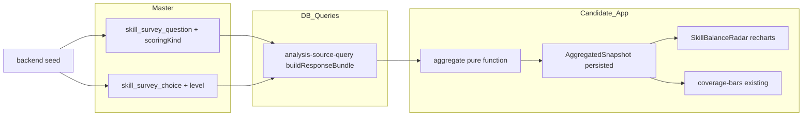
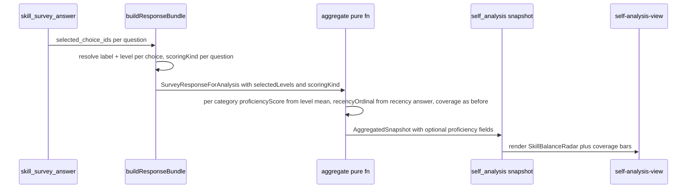
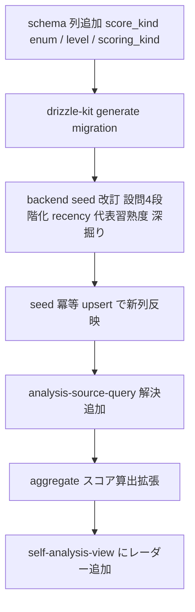

# Design Document

## Overview

**Purpose**: backend スキルアンケートの能力系設問を「はい/いいえ」の二択から4段階の熟練度スケールへ転換し、直近利用（recency）軸・判断の深さを問う自由記述・カテゴリ別熟練度スコアリング・スキルバランス可視化を追加することで、候補者本人がスキルバランスを把握でき、採用側が必要スキルの有無と濃淡を判断できる一次材料の解像度を高める。

**Users**: 候補者（自己分析でスキルバランスを確認）と採用側（スコア化された回答データを材料に有無を判断。採用側向け表示UIは本仕様の範囲外）。

**Impact**: 熟練度を「選択肢のメタデータ（`level`）」として持ち、設問の集計分類を `scoringKind` で表現する。回答保存・送信・必須判定・フォーム描画は既存の `single_choice` 経路を流用し無改修とする。集計純関数 `aggregate.ts` と分析ソースクエリを拡張し、`AggregatedSnapshot` に熟練度フィールドを後方互換で追加する。可視化は既存依存 `recharts` のレーダーを追加する。

### Goals

- 能力系設問を4段階（L0–L3）の単一選択へ転換し、深さの解像度を出す（Req 1）。
- recency と代表習熟度、深掘り自由記述で領域ごとの濃淡・現役性・判断根拠を取得する（Req 2, 3, 4）。
- カテゴリ別熟練度スコアを決定論的に算出・永続化し、レーダーで可視化する（Req 5, 6）。
- 既存の網羅性・版管理・履歴/比較を破綻させない（Req 7, 8）。

### Non-Goals

- AI駆動開発に関する設問（別の独立アンケートとして本改修完了後に着手）。
- 技術ごとのマトリクス習熟度評価（各技術への個別レベル付与。Phase2）。
- backend 以外の職種アンケート。
- 採用担当者向け管理画面でのスコア表示UIの構築（スコア化データの産出・永続化までを担う）。
- 専用スケールUI（横並びレベル等のUX強化）の導入（questionType は据え置き。Phase2 候補）。

## Boundary Commitments

### This Spec Owns

- `skill_survey_choice.level`（序数メタデータ）と `skill_survey_question.scoringKind`（集計分類）の追加と、その意味論。
- backend アンケート seed（`backend.ts`）の設問・選択肢の改訂（能力系の4段階化、代表習熟度、recency、深掘り自由記述）。
- カテゴリ別熟練度スコア／recency 序数の決定論的算出（`aggregate.ts`）と、`AggregatedSnapshot` への後方互換フィールド追加。
- 分析ソースクエリ（`analysis-source-query.ts`）における level・scoringKind の解決と伝播。
- 候補者向けスキルバランス可視化（レーダー）コンポーネントの追加。

### Out of Boundary

- 回答保存テーブル（`skill_survey_answer`）の構造変更、送信アクション（`submit-survey.ts`）の payload 変更、フォーム描画分岐（`survey-form.tsx` の questionType 分岐）の追加 — いずれも本仕様では行わない（既存を流用）。
- 自己分析の LLM ナラティブ生成ロジック（`SelfAnalysisNarrative`）の改変 — 既存のまま。熟練度の文章化は別途検討。
- self-analysis-history の cooldown / 版管理 / 比較ロジックの仕様変更 — 既存契約を維持。
- 採用側・管理画面の表示。

### Allowed Dependencies

- `@bulr/db`（schema・queries・型）：`skill-survey` / `skill-survey-response` / `self-analysis` スキーマ、`analysis-source-query`。
- `apps/candidate` 既存の self-analysis 集計・表示基盤、`recharts@^3.8.1`。
- drizzle-kit（マイグレーション生成）と既存 seed ランナー。
- 依存方向は既存どおり：Types(schema) → Queries → Lib(aggregate) → UI。UI から schema への逆流や、aggregate からの I/O は禁止（aggregate は純関数を維持）。

### Revalidation Triggers

- `AnswerForAnalysis` / `SurveyResponseForAnalysis` / `AggregatedSnapshot` / `CategoryCoverage` の**型形状変更** → self-analysis / self-analysis-history の消費側が再検証必要。
- `skill_survey_choice` / `skill_survey_question` の**列追加・制約変更** → seed・マイグレーション・読み出しクエリの再検証。
- `scoringKind` の**取りうる値の追加**（例: 'weight'）→ 集計分類の再検証。
- 既存 `questionType` を変更する場合 → フォーム描画・バリデーション・送信の再検証（本仕様では変更しない）。

## Architecture

### Existing Architecture Analysis

- **マスタ階層**: `skill_survey → skill_survey_category(name, subcategory) → skill_survey_question(questionType, isRequired) → skill_survey_choice(label, displayOrder)`。`single_choice` の回答は `skill_survey_answer.selected_choice_ids`(text[]) に1件入る。
- **集計**: `aggregate.ts` は純関数で、`SurveyResponseForAnalysis`（カテゴリ→回答→`selectedLabels`/`freeText`）から `AggregatedSnapshot`（カバレッジのみ）を生成。`self_analysis.aggregated_snapshot`(jsonb) に版管理（追記型・`source_response_id` 一意）で永続化。
- **保たれる境界**: 「同名カテゴリを1エントリへ集約」「内容ベースの回答済み判定（`isAnswered`）」「冪等 seed upsert」。本仕様はこれらを維持する。
- **流用する拡張点**: `questionType='single_choice'` の描画・保存・必須判定。新たな描画タイプを追加せず、熟練度/recency をこの経路に載せる。

### Architecture Pattern & Boundary Map



- **Selected pattern**: 既存のレイヤード純関数パイプライン（Master → Query → Pure Aggregate → Snapshot → UI）を踏襲し拡張する。
- **Domain/feature boundaries**: マスタ列追加（DB）／level・scoringKind 解決（Query）／スコア算出（Aggregate 純関数）／可視化（UI）を分離。集計は I/O を持たない純関数を維持。
- **Existing patterns preserved**: 同名カテゴリ集約、内容ベース回答判定、冪等 seed、版管理スナップショット。
- **New components rationale**: `SkillBalanceRadar`（熟練度の俯瞰表示）のみ新規。他は既存の拡張。

### Technology Stack

| Layer | Choice / Version | Role in Feature | Notes |
| --- | --- | --- | --- |
| Frontend | Next.js（既存）/ recharts ^3.8.1 | スキルバランスのレーダー表示、カバレッジバー併存 | 既存依存。新規導入なし |
| Backend / Services | Server Component + 既存 self-analysis 生成経路 | level/scoringKind 解決、決定論的スコア算出 | 送信アクションは無改修 |
| Data / Storage | PostgreSQL + drizzle-kit | `choice.level`・`question.scoringKind` 列追加、jsonb スナップショット拡張 | nullable 2列追加のマイグレーション＋seed 改訂 |

## File Structure Plan

### Modified Files

- `packages/db/src/schema/skill-survey.ts` — `skillSurveyChoice` に `level`(integer, nullable)、`skillSurveyQuestion` に `scoringKind`(新 pgEnum `score_kind` ['proficiency','recency'], nullable) を追加。
- `packages/db/src/schema/self-analysis.ts` — `CategoryCoverage` に optional フィールド（`proficiencyScore`, `answeredProficiencyCount`, `recencyOrdinal`, `recencyLabel`）を追加。`AggregatedSnapshot` はカテゴリ配列を通じて拡張（後方互換）。
- `packages/db/src/queries/self-analysis/analysis-source-query.ts` — `AnswerForAnalysis` に `scoringKind` と `selectedLevels: number[]` を追加。`buildResponseBundle` で choice の `level`、question の `scoringKind` を解決して伝播（解決追加は本関数一箇所に集約）。
- `packages/db/src/seeds/skill-surveys/backend.ts` — seed 型に `level`/`scoringKind` を追加。能力系（はい/いいえ）設問を4段階 proficiency single_choice へ改訂、カテゴリ代表習熟度設問・recency 設問・深掘り free_text を追加。`runBackendSkillSurveySeed` の upsert で新列を冪等反映。
- `apps/candidate/app/self-analysis/_lib/aggregate.ts` — カテゴリ別 `proficiencyScore`（level 平均の0–100正規化）と `recencyOrdinal`/`recencyLabel` を決定論的に算出し、既存カバレッジと併せて `AggregatedSnapshot` に格納。旧データ（level/scoringKind 無し）は null-safe。
- `apps/candidate/app/self-analysis/_components/self-analysis-view.tsx` — `SkillBalanceRadar` を組み込み（既存 coverage-bars と併置）。
- `packages/db/drizzle/` — drizzle-kit 生成のマイグレーション（`score_kind` enum 作成、2列追加）。

### New Files

- `apps/candidate/app/self-analysis/_components/skill-balance-radar.tsx` — `recharts` RadarChart で `AggregatedSnapshot.categories[].proficiencyScore` を描画。データ不足時は空表示。
- （任意）`apps/candidate/app/self-analysis/_lib/scoring.ts` — proficiency/recency のスコア換算純関数を `aggregate.ts` から分離する場合に作成（単一責務化のため）。

> 依存方向: schema(Types) → analysis-source-query(Query) → aggregate/scoring(Lib 純関数) → self-analysis-view/skill-balance-radar(UI)。UI から schema への逆参照や aggregate での I/O は禁止。

## System Flows

熟練度スコア算出のデータフロー（提出後の自己分析生成時）:



- **分類規則**: `scoringKind='proficiency'` の回答のみ熟練度平均に寄与。`scoringKind='recency'` は recency 序数として併記/補正。`scoringKind=null`（インベントリ multi_choice・深掘り free_text）は従来どおりカバレッジ/広さに寄与。
- **null 安全**: level 未解決・proficiency 回答0件のカテゴリは `proficiencyScore=null`。旧スナップショットは optional 欠落として UI が空表示。

## Requirements Traceability

| Requirement | Summary | Components | Interfaces | Flows |
| --- | --- | --- | --- | --- |
| 1.1, 1.3 | 能力系を4段階 single_choice へ | backend seed, schema(choice.level) | seed 型, `level` | — |
| 1.2 | 選択肢に習熟度序数を記録 | schema(choice.level) | `skillSurveyChoice.level` | — |
| 1.4 | 必須未回答を妨げる | 既存 `isRequiredSatisfied`（無改修） | survey-structure | — |
| 1.5 | 技術インベントリは複数選択維持 | backend seed | `scoringKind=null` の multi_choice | — |
| 2.1, 2.2, 2.3 | カテゴリ代表習熟度 | backend seed | proficiency single_choice ＋技術選択 | — |
| 3.1, 3.2, 3.3 | recency 設問（カテゴリ最大1問） | backend seed, schema(choice.level) | `scoringKind='recency'`, `level` 序数 | scoring flow |
| 4.1, 4.2, 4.3 | 深掘り自由記述（任意・上限） | backend seed | free_text, 既存上限 | — |
| 5.1, 5.2, 5.4, 5.5 | カテゴリ別熟練度スコア算出・永続化・null安全 | aggregate, schema(self-analysis) | `aggregate()`, `CategoryCoverage` 拡張 | scoring flow |
| 5.3 | recency をスコア補正/併記に反映 | aggregate | `recencyOrdinal`/補正 | scoring flow |
| 6.1, 6.2, 6.3 | レーダー可視化・カバレッジ併存・データ不足表示 | skill-balance-radar, self-analysis-view | RadarChart props | — |
| 7.1, 7.2 | 網羅性・必須趣旨の維持 | backend seed | カテゴリ削減なし | — |
| 8.1, 8.2, 8.3 | 版管理維持・履歴/比較破綻なし・冪等反映 | aggregate(null安全), seed upsert | スナップショット optional | — |

## Components and Interfaces

| Component | Domain/Layer | Intent | Req Coverage | Key Dependencies (P0/P1) | Contracts |
| --- | --- | --- | --- | --- | --- |
| Schema 拡張 | Data | level/scoringKind 列追加 | 1.2, 3.x, 5.x | drizzle (P0) | State |
| analysis-source-query 拡張 | Query | level/scoringKind 解決・伝播 | 5.1, 5.3 | schema (P0) | Service |
| aggregate 拡張 | Lib(純関数) | カテゴリ熟練度/recency 算出 | 5.x, 8.2 | source query 型 (P0) | Service |
| SkillBalanceRadar | UI | スキルバランス俯瞰 | 6.1, 6.3 | recharts (P0), snapshot (P0) | State |
| backend seed 改訂 | Data | 設問/選択肢の改訂・冪等反映 | 1, 2, 3, 4, 7, 8.3 | schema (P0) | Batch |

### Data / Query Layer

#### analysis-source-query 拡張

| Field | Detail |
| --- | --- |
| Intent | 回答の選択肢を label に加え level、設問の scoringKind まで解決して集計へ渡す |
| Requirements | 5.1, 5.3 |

**Responsibilities & Constraints**

- `buildResponseBundle` 内で choice の `level`、question の `scoringKind` を一括解決（解決ロジックの追加はこの一箇所に集約）。
- read-only を維持（skill_survey 系への書き込みなし）。

**Contracts**: Service [x]

```typescript
export type ScoringKind = 'proficiency' | 'recency';

export interface AnswerForAnalysis {
  questionId: string;
  categoryName: string;
  questionBody: string;
  questionType: 'single_choice' | 'multi_choice' | 'free_text';
  scoringKind: ScoringKind | null; // 追加: 集計分類
  selectedLabels: string[];
  selectedLevels: number[]; // 追加: 選択肢の level（解決済み, level 無しは除外）
  freeText: string | null;
}
```

- Preconditions: response は所有者フィルタ済み（既存）。
- Postconditions: `selectedLevels` は `selectedChoiceIds` のうち level を持つ選択肢の値のみを含む。
- Invariants: `selectedLabels` の既存意味は変更しない（追加のみ）。

### Lib Layer

#### aggregate 拡張（純関数）

| Field | Detail |
| --- | --- |
| Intent | カテゴリ別の熟練度スコアと recency 序数を決定論的に算出 |
| Requirements | 5.1, 5.2, 5.3, 5.4, 8.2 |

**Responsibilities & Constraints**

- 純関数を維持（I/O・乱数・時刻参照なし）。同一入力→同一出力。
- カテゴリ集約は既存の「同名カテゴリを1エントリへ」を踏襲。

**Contracts**: Service [x] / State [x]

```typescript
// self-analysis スキーマの CategoryCoverage に optional 追加（後方互換）
export interface CategoryCoverage {
  categoryName: string;
  answeredQuestions: number;
  totalQuestions: number;
  coverageRatio: number;
  selectedBreadth: number;
  freeTextPresence: boolean;
  // --- 追加（すべて optional / 旧スナップショットでは欠落） ---
  proficiencyScore?: number | null; // 0..100。proficiency 回答が無ければ null
  answeredProficiencyCount?: number; // 熟練度寄与した設問数
  recencyOrdinal?: number | null; // recency 設問の level 序数（無ければ null）
  recencyLabel?: string | null; // 表示用ラベル（例: 現在も利用中）
}
```

- 算出規則:
  - `proficiencyScore = answeredProficiencyCount > 0 ? round(mean(selectedLevels of proficiency answers) / MAX_LEVEL * 100) : null`（`MAX_LEVEL=3`）。
  - `recencyOrdinal/recencyLabel` は当該カテゴリの recency 設問の選択 level から決定（複数あれば最新＝最大序数）。
  - 既存 `coverageRatio` / `selectedBreadth` / `freeTextPresence` / `overallCoverageRatio` は不変。
- Invariants: proficiency 回答0件・level 未解決時は `proficiencyScore=null`（破綻なし, Req 5.4）。

### UI Layer

#### SkillBalanceRadar

| Field | Detail |
| --- | --- |
| Intent | カテゴリ別 proficiencyScore をレーダーで俯瞰表示 |
| Requirements | 6.1, 6.3 |

**Contracts**: State [x]

```typescript
interface SkillBalanceRadarProps {
  categories: Array<{ categoryName: string; proficiencyScore: number | null }>;
}
```

- Implementation Notes:
  - Integration: `recharts` の `RadarChart`/`PolarGrid`/`Radar`。`self-analysis-view.tsx` に coverage-bars と併置。
  - Validation: `proficiencyScore` が全て null/カテゴリ0件ならデータ不足の空表示（Req 6.3）。null は 0 ではなく欠損として除外して描画。
  - Risks: 同名カテゴリ集約済み前提（重複 key 回避は aggregate 側で担保済み）。

## Data Models

### Logical Data Model

- `skill_survey_choice.level`: integer, nullable。proficiency は 0–3、recency は序数（例: 実務利用なし=0 … 現在も利用中=4）。インベントリ/通常選択肢は null。
- `skill_survey_question.scoringKind`: enum `score_kind`('proficiency'|'recency'), nullable。集計分類のみに用い、フォーム描画は `questionType` を使用。
- `self_analysis.aggregated_snapshot`(jsonb): `CategoryCoverage` に optional フィールド追加。スキーマ的には jsonb のため DDL 変更不要、型のみ拡張。版管理（`source_response_id` 一意・追記型）を維持。

**Consistency & Integrity**

- 既存 unique index（survey/name/sub, category/body, question/label）を維持し、seed は冪等 upsert で新列を更新。
- 旧 response/旧スナップショットは新列/新フィールドを持たない → 集計・表示で null-safe（Req 8.1, 8.2）。

### Physical Data Model（マイグレーション）

```sql
CREATE TYPE "score_kind" AS ENUM ('proficiency', 'recency');
ALTER TABLE "skill_survey_choice" ADD COLUMN "level" integer;
ALTER TABLE "skill_survey_question" ADD COLUMN "scoring_kind" "score_kind";
```

## Error Handling

### Error Strategy

- **データ不足/欠損**: proficiency 回答0件、level 未設定、旧スナップショット → スコアは null とし、UI は空表示（例外を投げない）。Fail-safe を優先。
- **seed 不整合**: upsert キー不一致や重複は既存 unique index で検出。seed は冪等更新で重複行を作らない（Req 8.3）。
- **型の後方互換**: `CategoryCoverage` の新フィールドは optional。旧 jsonb の読み出しで undefined になっても破綻しない。

### Monitoring

- 既存の self-analysis 生成経路のログを踏襲（新規の監視要件なし）。

## Testing Strategy

### Unit Tests（aggregate 純関数 / scoring）

- proficiency 回答（level 0–3 混在）から `proficiencyScore` が期待値（mean/MAX*100 の四捨五入）になる。
- proficiency 回答0件のカテゴリで `proficiencyScore=null`、例外なし（Req 5.4）。
- recency 設問の選択から `recencyOrdinal`/`recencyLabel` が正しく決定される（複数時は最大序数）。
- 既存カバレッジ指標（`coverageRatio`/`selectedBreadth`/`freeTextPresence`/`overallCoverageRatio`）が改修後も不変（回帰）。
- 同名カテゴリ集約時に proficiency/ recency が正しく合算/集約される。

### Integration Tests（query + 集計 + 永続化）

- `buildResponseBundle` が `selectedLevels` と `scoringKind` を正しく解決して返す。
- level 列を持たない旧回答データで集計が null-safe に完了する（Req 8.1）。
- seed 再実行（冪等）で level/scoringKind が反映され、重複行が生成されない（Req 8.3）。

### E2E/UI Tests（候補者フロー）

- 能力系設問が4段階で表示・選択でき、必須未回答だと次へ進めない（Req 1.1, 1.4）。
- 提出後の自己分析でレーダー（熟練度）とカバレッジバーが併存表示される（Req 6.1, 6.2）。
- 熟練度データが無い（旧版）自己分析でレーダーが空表示で破綻しない（Req 6.3, 8.2）。

## Migration Strategy



- **Phase 順序**: スキーマ→マイグレーション→seed→クエリ→集計→UI。各段階は前段に依存する直列だが、UI（レーダー）と seed 文面詰めは部分的に並行可。
- **Rollback triggers**: マイグレーション適用失敗、seed upsert で重複/不整合検出、既存 self-analysis 回帰テスト失敗。
- **Validation checkpoints**: 旧データでの null-safe 集計、既存カバレッジ回帰、冪等 seed の再実行。
