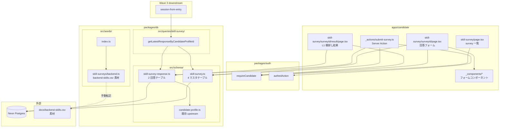
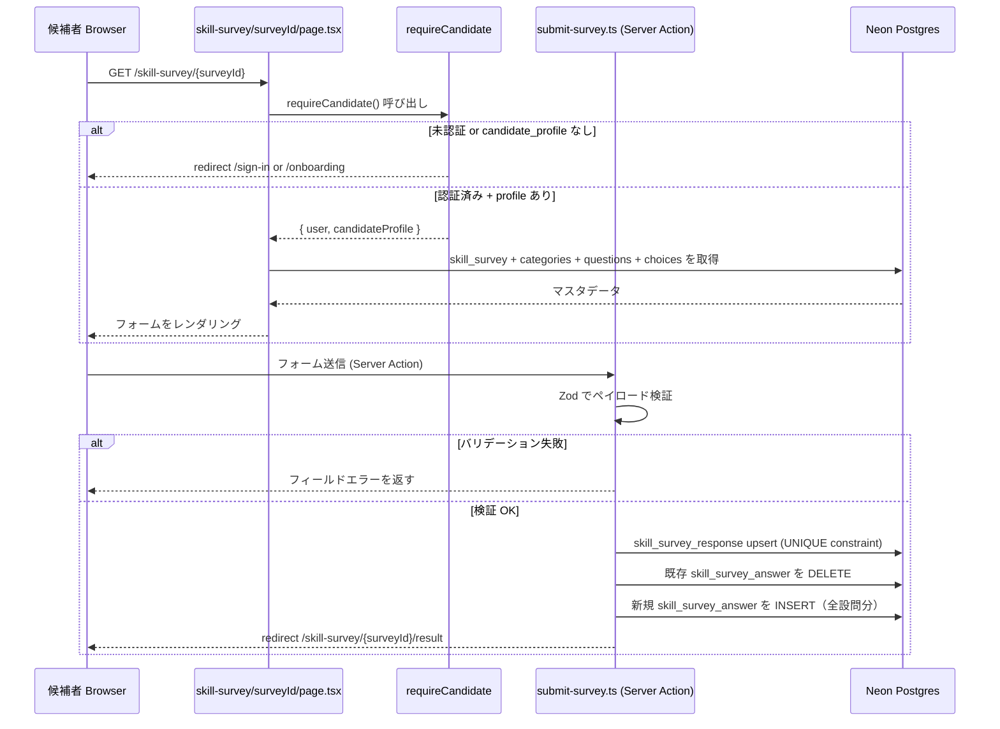
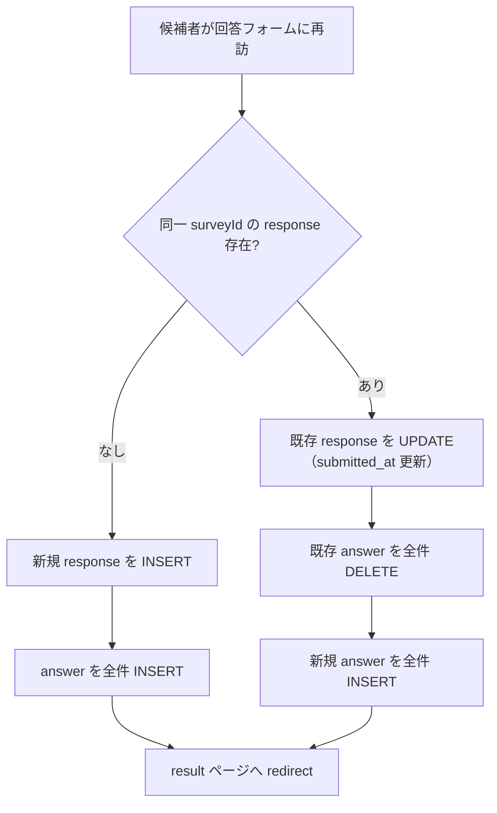
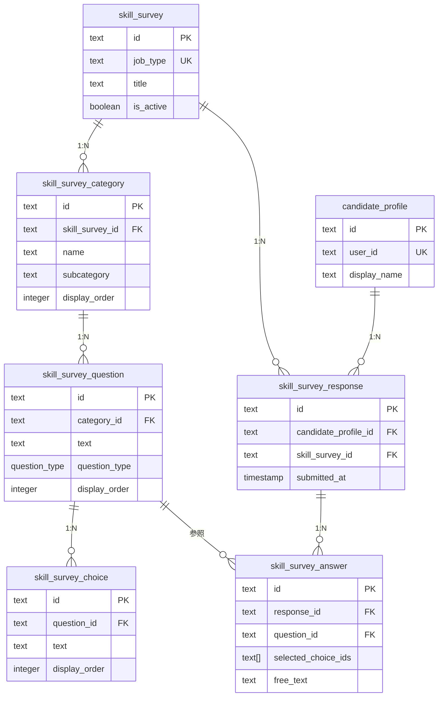
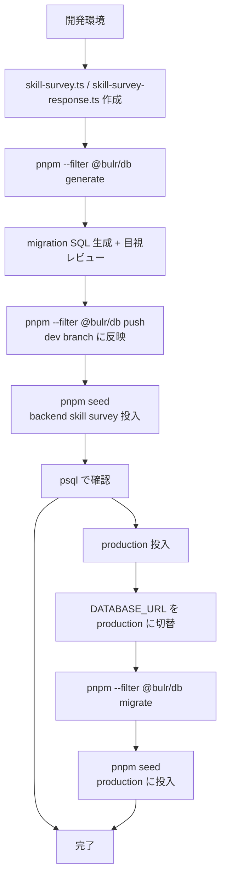
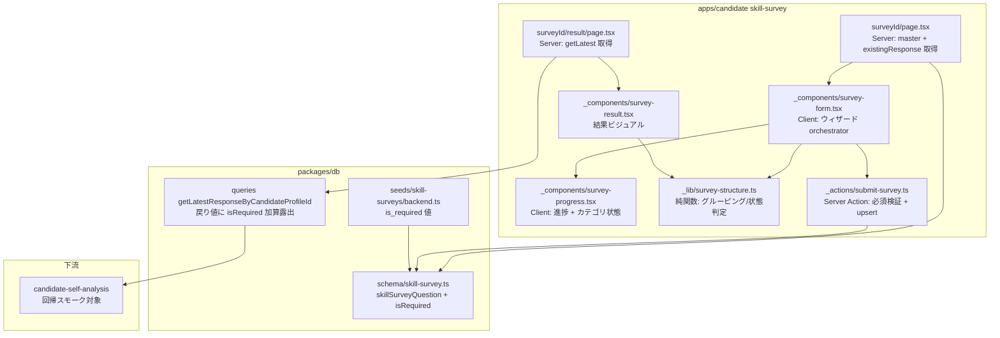
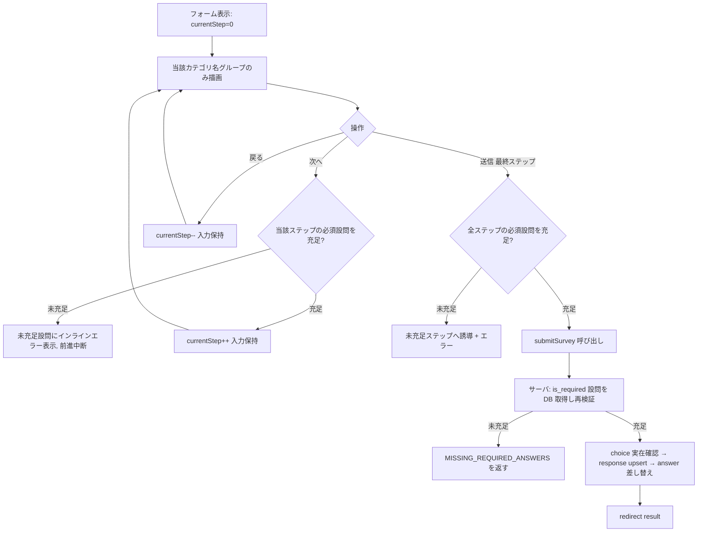
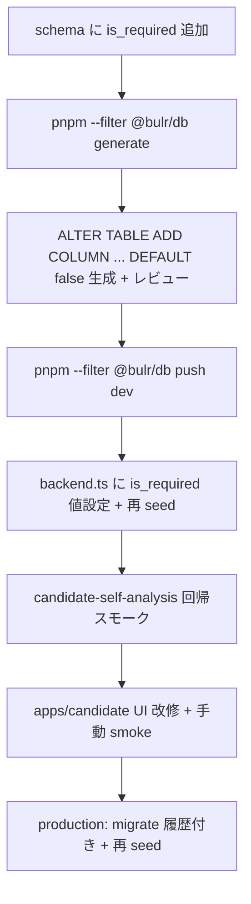

# Design Document — skill-survey

## Overview

本 spec は Wave 2 の 3 番目の feature であり、候補者向けアプリ `apps/candidate`（bulr.net）にバックエンド職種向けスキルアンケートを実装する。候補者は静的な構造化フォーム（選択式中心＋一部記述）に回答し、L1 棚卸し結果を確認できる。LLM は使用せず、数値スコア・他者比較・年収査定は出さない。

**Users**: 候補者（bulr.net を利用するエンジニア求職者）が回答フォームと結果表示の直接受益者。Wave 3 `session-from-entry` の開発者は `getLatestResponseByCandidateProfileId` クエリ関数の消費者。

**Impact**: `packages/db` に 6 テーブル（マスタ 4 + 回答 2）を追加し、seed スクリプトでバックエンド職種マスタを投入する。`apps/candidate` に `/skill-survey/*` ルートを新設し、Wave 3 向けの公開 seam（読み出しクエリ）を確立する。

### Goals

- `skill_survey` 4 階層マスタスキーマ（survey → category → question → choice）を Drizzle で定義し migration を生成する
- `skill_survey_response` / `skill_survey_answer` 回答スキーマを定義し migration を生成する
- `docs/backend-skills.csv` を素材に `packages/db/src/seeds/skill-surveys/backend.ts` を作成し、idempotent upsert で投入できるようにする
- `apps/candidate/app/skill-survey/*` でマスタ駆動の回答フォームと L1 棚卸し結果表示を実装する
- `packages/db/src/queries/skill-survey/` に `getLatestResponseByCandidateProfileId` を実装し Wave 3 に安定した seam を提供する

### Non-Goals

- LLM によるスキル要約・自然言語フィードバック（Wave 4 `mock-interview` 吸収）
- 数値スコアリング・年収査定・他者比較（設計メモ §9 L3 注記で明示却下）
- `assessment_pattern` 選定ロジック（Wave 3 `session-from-entry`）
- admin CMS でのマスタ管理（Wave 4 `admin-operations`）
- バックエンド以外の職種 survey（後続 spec or 同 spec 拡張）
- `packages/i18n` の新設（日本語 UI のみ、既存方針に準拠）

---

## Boundary Commitments

### This Spec Owns

- `packages/db/src/schema/skill-survey.ts` — `skill_survey` / `skill_survey_category` / `skill_survey_question` / `skill_survey_choice` テーブル + `question_type` pgEnum
- `packages/db/src/schema/skill-survey-response.ts` — `skill_survey_response` / `skill_survey_answer` テーブル
- `packages/db/src/schema/index.ts` — 上記 2 ファイルの barrel export 追加
- `packages/db/drizzle/*_skill_survey*.sql` — drizzle-kit 生成マイグレーション（6 テーブル分）
- `packages/db/src/seeds/skill-surveys/backend.ts` — バックエンド職種シードデータ
- `packages/db/src/seeds/index.ts` — backend seed の呼び出し追加
- `packages/db/src/queries/skill-survey/index.ts` — `getLatestResponseByCandidateProfileId` 関数
- `packages/db/src/queries/index.ts` — skill-survey クエリの barrel export 追加
- `apps/candidate/app/skill-survey/page.tsx` — survey 一覧ページ
- `apps/candidate/app/skill-survey/[surveyId]/page.tsx` — 回答フォームページ
- `apps/candidate/app/skill-survey/[surveyId]/_actions/submit-survey.ts` — 送信 Server Action
- `apps/candidate/app/skill-survey/[surveyId]/result/page.tsx` — L1 棚卸し結果ページ
- `apps/candidate/app/skill-survey/_components/*` — フォーム・結果表示コンポーネント

### Out of Boundary

- `candidate_profile` スキーマ・`requireCandidate` ガード（`candidate-auth-onboarding` 所有）
- `assessment_pattern` への接続（Wave 3 `session-from-entry` 担当）
- 招待トークン・エントリーフロー（Wave 3）
- admin CMS（Wave 4 `admin-operations`）
- AI 解析・LLM 要約（永久 out of scope）

### Allowed Dependencies

- `packages/auth` → `requireCandidate`、`authedAction`（`candidate-auth-onboarding` が確立）
- `packages/db` → `candidateProfile` テーブル参照（FK として）
- `apps/candidate` → `@bulr/db`、`@bulr/auth`、`@bulr/ui`、`@bulr/types`
- 依存方向: `apps/candidate → packages/*` の単方向（逆方向禁止）

### Revalidation Triggers

- `getLatestResponseByCandidateProfileId` のシグネチャ・戻り値型の変更 → Wave 3 `session-from-entry`、Wave 4 `mock-interview` の全利用箇所を再確認
- `skill_survey_response` / `skill_survey_answer` スキーマへのカラム追加 → 後続 Wave 3/4 spec の利用箇所を再確認
- `skill_survey_question.question_type` enum 値の追加 → 回答フォームレンダリングロジックと Zod 検証スキーマを更新
- `candidate_profile.id` 型の変更（`candidate-auth-onboarding`）→ FK 定義と全クエリを再確認

---

## Architecture

### Existing Architecture Analysis

Wave 2 `candidate-auth-onboarding` 完了時点で以下が整備済み:

- `packages/db/src/schema/candidate-profile.ts`: `candidate_profile` テーブル（`id` text PK）
- `packages/auth/src/guards.ts`: `requireCandidate()` — 認証済み + `candidate_profile` 存在確認
- `packages/auth/src/server-entry.ts`: `authedAction` ラッパーを re-export
- `apps/candidate/lib/auth.ts`: `createAuth` factory で候補者テンプレートを注入したインスタンス

Stage 1 `assessment-pattern-seed` が確立した seed パターン:

- `packages/db/src/seeds/patterns/*.ts` — カテゴリ別データファイル
- `packages/db/src/seeds/assessment-patterns.ts` — 集約 + 件数チェック純関数
- `packages/db/src/seeds/index.ts` — エントリーポイント
- idempotent upsert: `db.transaction` + `onConflictDoUpdate({ target: uniqueKey, set: { ...fields } })`

本 spec はこのパターンを踏襲し、seed 手法の一貫性を保つ。

### Architecture Pattern & Boundary Map



**Key Decisions**:

- **4 階層正規化マスタ**: survey → category → question → choice の 4 テーブル構成。CSV の「カテゴリ / サブカテゴリ / 質問 / 回答」構造に対応。admin CMS（Wave 4）が個別エンティティを CRUD できるようにするため、1 テーブル非正規化は採用しない
- **再回答 = upsert（最新版保持）**: `skill_survey_response` に `UNIQUE(candidate_profile_id, skill_survey_id)` 制約を設け、`onConflictDoUpdate` で既存レスポンスを上書き。回答履歴は保持しない（Wave 2 制約「将来像は見据えるが実装は最小」）
- **seed のカテゴリ/サブカテゴリ扱い**: CSV の「カテゴリ」列が `skill_survey_category.name` に、「サブカテゴリ」列が `skill_survey_question` の親グループとして `display_order` でソートされる。現段階では subcategory を別テーブルとして正規化せず、`skill_survey_category` に `subcategory` カラムを追加して扱う（Wave 4 admin CMS で必要なら分離）
- **Zod バリデーション配置**: 送信ペイロードの Zod スキーマは `apps/candidate/app/skill-survey/[surveyId]/_actions/submit-survey.ts` 内に定義する。`packages/types` には置かない（runtime 依存を持ち、かつ候補者アプリ固有のため）
- **Server Component ファースト**: フォームデータ取得・DB アクセスは Server Component で完結。インタラクティブな選択操作のみ Client Component（`'use client'`）で分担

### Technology Stack

| Layer | 選択 / バージョン | 本 spec での役割 | 備考 |
|-------|-----------------|----------------|------|
| DB / ORM | Drizzle ORM 0.45.x + Neon Postgres | 6 テーブル定義・クエリ | 既存バージョン継続 |
| Migration | drizzle-kit 0.31.x | migration 生成・適用 | 既存 |
| Frontend | Next.js 16 App Router + React 19 | 回答フォーム・結果表示 | 既存 |
| Validation | Zod 4.x | 送信ペイロード検証 | 既存 |
| Seed Runtime | `tsx` ^4 | `packages/db/src/seeds/index.ts` 実行 | 既存 |
| Auth Guard | Better Auth 1.6.x + `requireCandidate` | ルート保護 | `candidate-auth-onboarding` が確立 |
| UI | Tailwind CSS 4 + shadcn/ui ベース | フォーム・結果 UI | 既存 |

---

## File Structure Plan

### Directory Structure

```
bulr-app-mvp/
├── packages/
│   └── db/
│       └── src/
│           ├── schema/
│           │   ├── skill-survey.ts              # ★新規: 4 マスタテーブル + question_type pgEnum
│           │   ├── skill-survey-response.ts     # ★新規: response + answer テーブル
│           │   └── index.ts                     # ★変更: 上記 2 ファイルを barrel export に追加
│           ├── seeds/
│           │   ├── skill-surveys/
│           │   │   └── backend.ts               # ★新規: backend-skills.csv 素材からのシードデータ
│           │   └── index.ts                     # ★変更: backend seed 呼び出しを追加
│           ├── queries/
│           │   ├── skill-survey/
│           │   │   └── index.ts                 # ★新規: getLatestResponseByCandidateProfileId
│           │   └── index.ts                     # ★変更: skill-survey クエリを barrel export に追加
│           └── drizzle/
│               └── *_skill_survey*.sql           # ★新規 (drizzle-kit 自動生成)
│
└── apps/
    └── candidate/
        └── app/
            └── skill-survey/
                ├── page.tsx                     # ★新規: survey 一覧（Server Component）
                ├── _components/
                │   ├── survey-list.tsx           # ★新規: 利用可能 survey カード一覧
                │   ├── survey-form.tsx           # ★新規: 回答フォーム Client Component
                │   ├── question-single.tsx       # ★新規: single_choice 設問
                │   ├── question-multi.tsx        # ★新規: multi_choice 設問
                │   └── question-free-text.tsx    # ★新規: free_text 設問
                └── [surveyId]/
                    ├── page.tsx                  # ★新規: 回答フォームページ（Server Component）
                    ├── _actions/
                    │   └── submit-survey.ts      # ★新規: 送信 Server Action + Zod 検証
                    └── result/
                        └── page.tsx              # ★新規: L1 棚卸し結果（Server Component）
```

### Modified Files

- `packages/db/src/schema/index.ts` — `skill-survey.ts` と `skill-survey-response.ts` の `export *` を追加
- `packages/db/src/seeds/index.ts` — `runBackendSkillSurveySeed()` の呼び出しを追加
- `packages/db/src/queries/index.ts` — `skill-survey/index.ts` の re-export を追加

---

## System Flows

### 回答フォーム送信フロー



### 再回答フロー（最新版保持）



---

## Requirements Traceability

| 要件 | サマリー | コンポーネント | インターフェース | フロー |
|------|---------|--------------|--------------|------|
| 1.1〜1.6 | マスタスキーマ 4 テーブル | `MasterSchemaModule` | `skill-survey.ts` DDL | migration フロー |
| 2.1〜2.5 | 回答スキーマ 2 テーブル | `ResponseSchemaModule` | `skill-survey-response.ts` DDL | migration フロー |
| 3.1〜3.5 | backend seed スクリプト | `BackendSeedModule` | `seeds/skill-surveys/backend.ts` | seed 投入フロー |
| 4.1〜4.7 | 回答フォーム UI | `SurveyListPage`, `SurveyFormPage`, `SurveyFormComponent`, `SubmitSurveyAction` | `/skill-survey/*` | 回答フォーム送信フロー |
| 5.1〜5.5 | L1 棚卸し結果表示 | `SurveyResultPage` | `/skill-survey/[surveyId]/result` | — |
| 6.1〜6.5 | Wave 3 読み出し API | `SkillSurveyQueryModule` | `getLatestResponseByCandidateProfileId` | — |
| 7.1〜7.4 | アクセス制御・入力検証 | `RequireCandidate`, `SubmitSurveyAction` | `requireCandidate()`, Zod schema | 回答フォーム送信フロー |

---

## Components and Interfaces

### コンポーネント一覧

| コンポーネント | ドメイン/レイヤー | 意図 | 要件カバレッジ | キー依存 | コントラクト |
|-------------|----------------|------|-------------|---------|------------|
| `MasterSchemaModule` | packages/db/schema | 4 マスタテーブル + pgEnum | 1.1〜1.6 | Drizzle ORM | State |
| `ResponseSchemaModule` | packages/db/schema | 2 回答テーブル | 2.1〜2.5 | Drizzle ORM, candidateProfile FK | State |
| `BackendSeedModule` | packages/db/seeds | backend-skills.csv から seed データ | 3.1〜3.5 | tsx, MasterSchemaModule | Batch |
| `SkillSurveyQueryModule` | packages/db/queries | Wave 3 向け読み出しクエリ | 6.1〜6.5 | ResponseSchemaModule, MasterSchemaModule | Service |
| `SurveyListPage` | apps/candidate | survey 一覧（Server Component） | 4.1, 7.1 | requireCandidate, MasterSchemaModule | State |
| `SurveyFormPage` | apps/candidate | 回答フォームページ（Server Component） | 4.2, 4.3, 7.1 | requireCandidate, MasterSchemaModule | State |
| `SurveyFormComponent` | apps/candidate | インタラクティブなフォーム（Client Component） | 4.2, 4.3, 4.4 | SubmitSurveyAction | State |
| `SubmitSurveyAction` | apps/candidate | 送信 Server Action + Zod 検証 | 4.4, 4.5, 7.2, 7.3 | authedAction, ResponseSchemaModule | Service |
| `SurveyResultPage` | apps/candidate | L1 棚卸し結果（Server Component） | 5.1〜5.5, 7.1 | requireCandidate, ResponseSchemaModule | State |

### packages/db (schema)

#### MasterSchemaModule

| フィールド | 詳細 |
|----------|------|
| Intent | `skill_survey` 4 階層マスタテーブルと `question_type` pgEnum を Drizzle で定義する |
| Requirements | 1.1, 1.2, 1.3, 1.4, 1.5, 1.6 |

**Responsibilities & Constraints**

- `packages/db/src/schema/skill-survey.ts` に定義
- `pgEnum('question_type', ['single_choice', 'multi_choice', 'free_text'])` を `questionType` で export
- 4 テーブルを `skillSurvey` / `skillSurveyCategory` / `skillSurveyQuestion` / `skillSurveyChoice` という名前で export
- `skill_survey_category` に `subcategory` カラム（nullable text）を追加し CSV の「サブカテゴリ」列を保持する（正規化は Wave 4 に延期）
- 各テーブルの `id` は `text('id').primaryKey().$defaultFn(() => nanoid())`
- FK は ON DELETE CASCADE ではなく、論理的な削除なし方針（`is_active` で休眠）を維持

**Physical Data Model**

```sql
skill_survey (
  id           text        PRIMARY KEY,
  job_type     text        NOT NULL UNIQUE,   -- 'backend' 等
  title        text        NOT NULL,
  description  text,
  is_active    boolean     NOT NULL DEFAULT true,
  created_at   timestamp   NOT NULL DEFAULT now(),
  updated_at   timestamp   NOT NULL DEFAULT now()
)

skill_survey_category (
  id               text    PRIMARY KEY,
  skill_survey_id  text    NOT NULL REFERENCES skill_survey(id),
  name             text    NOT NULL,
  subcategory      text,                      -- CSV サブカテゴリ列
  display_order    integer NOT NULL,
  created_at       timestamp NOT NULL DEFAULT now(),
  updated_at       timestamp NOT NULL DEFAULT now()
)

skill_survey_question (
  id           text        PRIMARY KEY,
  category_id  text        NOT NULL REFERENCES skill_survey_category(id),
  text         text        NOT NULL,
  question_type question_type NOT NULL,
  display_order integer    NOT NULL,
  created_at   timestamp   NOT NULL DEFAULT now(),
  updated_at   timestamp   NOT NULL DEFAULT now()
)

skill_survey_choice (
  id            text    PRIMARY KEY,
  question_id   text    NOT NULL REFERENCES skill_survey_question(id),
  text          text    NOT NULL,
  display_order integer NOT NULL,
  created_at    timestamp NOT NULL DEFAULT now()
)
```

**Dependencies**

- Inbound: `packages/db/src/schema/index.ts`（barrel）、BackendSeedModule、SubmitSurveyAction、SkillSurveyQueryModule
- Outbound: drizzle-orm 0.45、nanoid ^5

**Contracts**: State [x]

#### ResponseSchemaModule

| フィールド | 詳細 |
|----------|------|
| Intent | `skill_survey_response` / `skill_survey_answer` テーブルを Drizzle で定義する |
| Requirements | 2.1, 2.2, 2.3, 2.4, 2.5 |

**Responsibilities & Constraints**

- `packages/db/src/schema/skill-survey-response.ts` に定義
- `skill_survey_response` に `UNIQUE(candidate_profile_id, skill_survey_id)` 制約（再回答 upsert のため）
- `skill_survey_answer.selected_choice_ids` は `text('selected_choice_ids').array()`（nullable、`multi_choice` 用）
- `skill_survey_answer.free_text` は nullable text

**Physical Data Model**

```sql
skill_survey_response (
  id                    text      PRIMARY KEY,
  candidate_profile_id  text      NOT NULL REFERENCES candidate_profile(id),
  skill_survey_id       text      NOT NULL REFERENCES skill_survey(id),
  submitted_at          timestamp NOT NULL DEFAULT now(),
  created_at            timestamp NOT NULL DEFAULT now(),
  updated_at            timestamp NOT NULL DEFAULT now(),
  UNIQUE(candidate_profile_id, skill_survey_id)
)

skill_survey_answer (
  id                text      PRIMARY KEY,
  response_id       text      NOT NULL REFERENCES skill_survey_response(id) ON DELETE CASCADE,
  question_id       text      NOT NULL REFERENCES skill_survey_question(id),
  selected_choice_ids text[]  NULL,       -- single_choice / multi_choice 用
  free_text         text      NULL,       -- free_text 用
  created_at        timestamp NOT NULL DEFAULT now()
)
```

**Dependencies**

- Inbound: `packages/db/src/schema/index.ts`、SubmitSurveyAction、SkillSurveyQueryModule
- Outbound: drizzle-orm 0.45、nanoid、`candidate_profile`（upstream FK）、`skill_survey`（マスタ FK）

**Contracts**: State [x]

### packages/db (seeds)

#### BackendSeedModule

| フィールド | 詳細 |
|----------|------|
| Intent | `docs/backend-skills.csv` を素材に backend 職種 skill survey マスタを idempotent upsert で投入する |
| Requirements | 3.1, 3.2, 3.3, 3.4, 3.5 |

**Responsibilities & Constraints**

- `packages/db/src/seeds/skill-surveys/backend.ts` を新規作成
- `packages/db/src/seeds/index.ts` から `runBackendSkillSurveySeed(db)` として呼び出される（`assessment-pattern-seed` パターンを踏襲）
- CSV の行を TypeScript リテラルとして事前定義済みの構造体に手動転記
- upsert の conflict target（各テーブルに DB レベルの UNIQUE インデックスを作成すること → task 1.1 参照）:
  - `skill_survey`: `job_type`（UNIQUE 制約済み）
  - `skill_survey_category`: `(skill_survey_id, name, subcategory)` の複合 UNIQUE インデックス
  - `skill_survey_question`: `(category_id, body)` の複合 UNIQUE インデックス（`text` カラム名が予約語と衝突する場合は `body` 等に変更）
  - `skill_survey_choice`: `(question_id, label)` の複合 UNIQUE インデックス（`text` カラム名が予約語と衝突する場合は `label` 等に変更）
- **各テーブルの id は初回生成後不変**: `onConflictDoUpdate` の `set` に `id` を含めない。これにより再 seed 時も `skill_survey_answer.question_id` FK が dangling にならない（DELETE + INSERT による再構築方式は禁止）
- 完了後にカテゴリ数・設問数・選択肢数をコンソールに出力

**Contracts**: Batch [x]

##### Batch / Job Contract

- Trigger: `packages/db/src/seeds/index.ts` から呼び出し、`pnpm seed` 相当のコマンドで実行
- Input: `db` client インスタンス（seeds/index.ts から注入）
- Output: Neon Postgres の 4 マスタテーブルにレコードを upsert + コンソールログ
- Idempotency: 2 回実行で DB 状態が変わらない（`onConflictDoUpdate` で保証）

**Implementation Notes**

- `assessment-pattern-seed` の `scripts/seed-assessment-patterns.ts` パターンを参照し、seeds/index.ts をエントリーポイントとして踏襲する
- CSV のすべての行を包含するが、完全自動パースは行わず TypeScript リテラルとして手動転記（管理性と型安全性のため）

### packages/db (queries)

#### SkillSurveyQueryModule

| フィールド | 詳細 |
|----------|------|
| Intent | Wave 3 `session-from-entry` 等の downstream が消費する `getLatestResponseByCandidateProfileId` クエリ関数を提供する |
| Requirements | 6.1, 6.2, 6.3, 6.4, 6.5 |

**Responsibilities & Constraints**

- `packages/db/src/queries/skill-survey/index.ts` に実装
- 関数シグネチャを安定させ、Wave 3 / Wave 4 での breaking change を防ぐ
- Drizzle ORM のみ使用（素の SQL 結合は禁止）
- `getLatestResponseByCandidateProfileId` は `packages/db/src/queries/skill-survey/` に配置し、`packages/db` のバレル（`@bulr/db/queries` 相当）から公開する。Wave 3 `session-from-entry` が `apps/business` から本クエリを参照する際は、`packages/db` のバレル経由で直接 import する（`apps/candidate` のコードは参照しない）。apps → apps 依存禁止を保ったまま read-only seam を提供する。

**Contracts**: Service [x]

##### Service Interface

```typescript
// packages/db/src/queries/skill-survey/index.ts
// Wave 2 全体で統一パターン: packages/db/src/queries/* のクエリ関数は singleton db を
// '../../client' から直接 import する（DI 引数を取らない）。
// これは resume-registration の getPrimaryResumeDocument 設計と整合する。

import { db } from '../../client';
import { skillSurveyResponse, skillSurveyAnswer, skillSurveyQuestion } from '../../schema';
import { eq, and } from 'drizzle-orm';

export type SkillSurveyResponseWithAnswers = {
  response: typeof skillSurveyResponse.$inferSelect;
  answers: Array<{
    answer: typeof skillSurveyAnswer.$inferSelect;
    question: typeof skillSurveyQuestion.$inferSelect;
  }>;
};

export async function getLatestResponseByCandidateProfileId(
  candidateProfileId: string,
  surveyId: string,
): Promise<SkillSurveyResponseWithAnswers | null>;
```

- Preconditions: `candidateProfileId` と `surveyId` が空でない文字列
- Postconditions: レスポンスが存在すれば `SkillSurveyResponseWithAnswers`、存在しなければ `null`
- Invariants: 取得するデータは必ず `candidate_profile_id = candidateProfileId` にスコープされる（他候補者データへのアクセスなし）

### apps/candidate

#### SurveyFormPage + SurveyFormComponent + SubmitSurveyAction

| フィールド | 詳細 |
|----------|------|
| Intent | マスタ駆動で回答フォームをレンダリングし、Zod 検証済みの送信を Server Action で処理する |
| Requirements | 4.2, 4.3, 4.4, 4.5, 4.6, 4.7, 7.2, 7.3, 7.4 |

**Responsibilities & Constraints**

- `apps/candidate/app/skill-survey/[surveyId]/page.tsx`: Server Component。`requireCandidate` でガード後、マスタを全件取得して Client Component に props として渡す
- `apps/candidate/app/skill-survey/_components/survey-form.tsx`: `'use client'` コンポーネント。カテゴリ → 設問の順にレンダリング。`single_choice` → radio、`multi_choice` → checkbox、`free_text` → textarea を切り替える
- `apps/candidate/app/skill-survey/[surveyId]/_actions/submit-survey.ts`: `authedAction` でラップ。Zod でペイロード検証後、DB upsert を実行

**Contracts**: Service [x]

##### Service Interface

```typescript
// _actions/submit-survey.ts

const submitSurveySchema = z.object({
  surveyId: z.string().min(1),
  answers: z.array(
    z.object({
      questionId: z.string().min(1),
      selectedChoiceIds: z.array(z.string()).optional(),
      freeText: z.string().max(2000).optional(),
    }),
  ),
});

export const submitSurvey = authedAction(
  submitSurveySchema,
  async ({ surveyId, answers }, { userId }) => {
    const { candidateProfile } = await requireCandidate();
    // candidateProfile.id を使って以下を実行:
    // 1. skill_survey_response を upsert
    // 2. 既存 skill_survey_answer を DELETE（ON DELETE CASCADE で自動）
    // 3. 新規 skill_survey_answer を INSERT
    // 4. redirect('/skill-survey/{surveyId}/result')
  },
);
// 注意: authedAction の ctx は { userId } のみ提供する。candidateProfileId は
// requireCandidate() を内部で呼び出して取得する（authedAction + requireCandidate() 二重呼び出しパターン）。
// candidateAction は Wave 2 スコープ外。
```

#### SurveyResultPage

| フィールド | 詳細 |
|----------|------|
| Intent | 候補者の最新回答をカテゴリ・設問別に構造化表示する L1 棚卸し結果ページ |
| Requirements | 5.1, 5.2, 5.3, 5.4, 5.5, 7.1 |

**Responsibilities & Constraints**

- `apps/candidate/app/skill-survey/[surveyId]/result/page.tsx`: Server Component
- `requireCandidate` でガード後、`getLatestResponseByCandidateProfileId` でデータ取得
- 回答なしの場合は `/skill-survey/[surveyId]` にリダイレクト
- 数値スコア・他者比較・年収は表示しない（UI に該当要素を含めない）
- 自由記述は候補者が入力したテキストをそのまま表示（LLM 変換なし）

---

## Data Models

### 論理データモデル



### データライフサイクル

| テーブル | Create | Read | Update | Delete |
|---------|--------|------|--------|--------|
| `skill_survey` | seed スクリプト | フォームレンダリング・Wave 3 クエリ | seed 再実行（is_active 保護付き） | 物理削除なし（is_active=false） |
| `skill_survey_category` | seed スクリプト | フォームレンダリング | seed 再実行 | 物理削除なし |
| `skill_survey_question` | seed スクリプト | フォームレンダリング | seed 再実行 | 物理削除なし |
| `skill_survey_choice` | seed スクリプト | フォームレンダリング | seed 再実行 | 物理削除なし |
| `skill_survey_response` | Server Action（初回） | 結果表示・Wave 3 クエリ | Server Action（再回答）= upsert | 物理削除なし（Wave 5+ で候補者データ削除機能） |
| `skill_survey_answer` | Server Action | 結果表示・Wave 3 クエリ | 再回答時に DELETE + INSERT | ON DELETE CASCADE（response 削除時） |

---

## Error Handling

### Error Strategy

- 認証エラーは多層防御（proxy.ts → Server Component `requireCandidate` → `authedAction`）の各レイヤーで独立処理
- フォーム検証エラーは Zod parse 結果をクライアントに返す（`authedAction` ラッパーの規約に準拠）
- 回答なし状態での result ページアクセスは Server Component レベルで redirect

### Error Categories and Responses

- **未認証アクセス** (UNAUTHORIZED): `requireCandidate` が throw → `authedAction` が `/sign-in` にリダイレクト
- **candidate_profile 未作成** (CANDIDATE_PROFILE_MISSING): `requireCandidate` が throw → `/onboarding` にリダイレクト
- **フォーム検証エラー**: Zod parse 失敗 → フィールドエラーをクライアントに返す
- **存在しない surveyId**: Server Component で `notFound()` を呼ぶ
- **回答なしで result アクセス**: Server Component で `/skill-survey/[surveyId]` にリダイレクト

---

## Testing Strategy

### 手動 Smoke Test（Stage 1 方針）

本 spec は Stage 1 方針に沿い自動テストフレームワークを導入しない。完了確認は以下の手動 smoke test で行う。

1. **スキーマ・マイグレーション**
   - `pnpm --filter @bulr/db generate` で 6 テーブル分の migration ファイルが生成される
   - `pnpm --filter @bulr/db push` で dev branch への反映が成功する
   - Neon Console / psql で `\d skill_survey`、`\d skill_survey_response` 等のカラム一覧が仕様通りであることを確認

2. **seed 投入**
   - `pnpm seed`（または相当コマンド）で backend skill survey のカテゴリ・設問・選択肢が投入される
   - 2 回連続実行でレコード数が変わらない（冪等性）
   - ログにカテゴリ数・設問数・選択肢数が出力される

3. **回答フォーム**
   - 候補者としてサインイン後、`/skill-survey` で survey 一覧が表示される
   - `/skill-survey/{surveyId}` でカテゴリ → 設問 → 選択肢がレンダリングされる
   - 未認証でのアクセスが `/sign-in` にリダイレクトされる
   - フォーム送信後に `/skill-survey/{surveyId}/result` にリダイレクトされる

4. **再回答**
   - 同一 surveyId に 2 回回答した場合、`skill_survey_response` テーブルのレコード数が増えない（upsert）
   - 2 回目の結果が result ページに表示される

5. **L1 棚卸し結果**
   - 回答済みのカテゴリ・設問・選択内容が構造化表示される
   - 数値スコア・他者比較・年収が表示されない
   - 自由記述が入力テキストそのままで表示される
   - 回答なし状態での result アクセスがフォームページにリダイレクトされる

6. **Wave 3 読み出し API**
   - `getLatestResponseByCandidateProfileId(candidateProfileId, surveyId)` が TypeScript strict mode で import・呼び出しできる
   - 回答あり → `SkillSurveyResponseWithAnswers` を返す
   - 回答なし → `null` を返す

7. **ビルドとタイプチェック**
   - `pnpm build` が全 packages・apps で成功する
   - `pnpm typecheck` が全 workspace で成功する

---

## Security Considerations

- `requireCandidate` は多層防御の一部として実装し、proxy.ts のみに依存しない（CVE-2025-29927 教訓）
- 全スキルアンケートルートは `requireCandidate` でガードし、`authedAction` ラッパーを経由してのみ mutation を許可
- DB クエリは必ず `candidate_profile_id` でスコープし、他候補者データへのアクセスを防止
- Zod スキーマで free_text を 2000 文字以上で reject（DoS 防止）
- `selected_choice_ids` の値は DB に保存する前に、実際に `skill_survey_choice` に存在する ID であることをサーバーサイドで検証する

---

## Migration Strategy



- migration 連番は drizzle-kit が自動付与（glob パターンで参照、ハードコードしない）
- `assessment-pattern-seed` が先行 migration を持つため、本 spec の migration はより大きな連番になる
- production 投入は `migrate`（履歴管理付き）を使用し `push` は禁止

---
---

# Wave 5 UX 洗練 設計（要件 8〜12）

> 本セクションは実装済みコア（要件 1〜7）の上に追加する Wave 5 増分の設計。roadmap.md `## Existing Spec Updates` に基づき、回答 UX の洗練（多段ステップ／必須検証／結果ビジュアル）を扱う。コア設計（上記）はそのまま有効で、本増分はそれを **改修・拡張** する。

## Overview（Wave 5 増分）

実装済みの skill-survey 回答体験を洗練する。回答フォームを **distinct トップレベルカテゴリ名単位の多段ステップ（ウィザード）** に再構成し、進捗表示・設問単位の必須検証・選択肢レンダリング改善を加える。L1 棚卸し結果ページは構造化カードと回答状態表示でビジュアルを向上し、`candidate-self-analysis` への導線を設ける。

**Impact**: 新規テーブルは追加しない。`skill_survey_question` に `is_required` 列を**加算的**に追加するのみ。回答スキーマ（`skill_survey_response` / `skill_survey_answer`）と `getLatestResponseByCandidateProfileId` の既存契約は不変に保ち、下流 `candidate-self-analysis` を回帰させない。途中保存（未送信入力の永続化）は実装しない。

### Goals（増分）

- 回答フォームを 9 ステップ（distinct category.name）のウィザード化し、進捗インジケータとカテゴリ回答状態を表示する
- `skill_survey_question.is_required` を加算的に追加し、必須検証をクライアント／サーバ両側で強制する
- 選択肢レンダリングとサブカテゴリ・グルーピング・自由記述入力体験を改善する
- L1 棚卸し結果を構造化カード＋回答済み/未回答表示に刷新し、自己診断への導線を設ける

### Non-Goals（増分）

- 途中保存・下書きの永続化（未送信入力のセッションをまたぐ保存）
- 強み・弱みの解釈／数値スコア／成長アクション提案（`candidate-self-analysis` 所有）
- 回答スキーマ・読み出しクエリの破壊的変更、新規テーブル追加
- バックエンド以外の職種 survey

---

## Boundary Commitments（Wave 5 増分）

### This Increment Owns

- `packages/db/src/schema/skill-survey.ts` — `skillSurveyQuestion` への `isRequired` 列追加（加算的）
- `packages/db/drizzle/*_*.sql` — `is_required` 列追加の drizzle-kit 生成マイグレーション
- `packages/db/src/seeds/skill-surveys/backend.ts`（＋seed runner）— `is_required` 値の設定（最小必須ポリシー）
- `apps/candidate/app/skill-survey/_components/survey-form.tsx` — ウィザード化・必須検証・進捗統合（改修）
- `apps/candidate/app/skill-survey/_components/survey-progress.tsx` — 進捗インジケータ（新規）
- `apps/candidate/app/skill-survey/_lib/survey-structure.ts` — グルーピング／回答状態判定の純関数（新規・form と result が共有）
- `apps/candidate/app/skill-survey/_components/survey-result.tsx` — 結果ビジュアル表示（新規・presentational）
- `apps/candidate/app/skill-survey/[surveyId]/result/page.tsx` — 結果ビューと自己診断導線の組み込み（改修）
- `apps/candidate/app/skill-survey/[surveyId]/_actions/submit-survey.ts` — サーバ側必須検証の追加（改修）

### Out of Boundary（増分）

- `skill_survey_response` / `skill_survey_answer` スキーマと `getLatestResponseByCandidateProfileId` のシグネチャ（不変。`isRequired` の加算的露出を除く）
- `candidate-self-analysis` の集計・要約・成長アクション（同 spec 所有）
- `candidate_profile` / `requireCandidate` / `authedAction`（`candidate-auth-onboarding` 所有）
- admin CMS でのマスタ管理（Wave 4 `admin-operations`）

### Allowed Dependencies（増分）

- `apps/candidate → @bulr/db`（`skillSurveyQuestion.isRequired` を含むマスタ型）、`@bulr/auth`（`requireCandidate` / `authedAction`）
- `survey-structure.ts`（純 TS、`'use client'` なし）は client（survey-form）と server（result page）の双方から import 可
- 依存方向: `apps/candidate → packages/*` の単方向を維持

### Revalidation Triggers（増分）

- `is_required` 追加後 → `candidate-self-analysis`（`@bulr/ai-self-analysis` + `apps/candidate/app/self-analysis/*`）の回帰スモークを必須実行（要件 12.3）
- `getLatestResponseByCandidateProfileId` 戻り値・回答スキーマに**加算的でない**変更を入れる場合 → Wave 3 / Wave 4 / candidate-self-analysis の全利用箇所を再確認
- ウィザードのステップ単位（distinct category.name）を変更 → 進捗計算・必須検証・結果グルーピングを再確認

---

## Architecture（Wave 5 増分）

### 主要決定

- **ステップ単位 = distinct `skill_survey_category.name`（≈9 ステップ）**: 45 の `(name, subcategory)` 行を 1 ステップにすると 45 ステップとなり UX 破綻。サブカテゴリはステップ内のグループ見出しとして表示する。これは `candidate-self-analysis` の「カテゴリ名集約」と整合する。グルーピングは `survey-structure.ts` の純関数 `groupByCategoryName` が単一の真実。
- **全回答 state は単一 Client Component に集約（既存踏襲）、表示のみステップ単位**: `survey-form.tsx` が全設問の回答 state を保持し、`currentStepIndex` で 1 カテゴリ名グループのみを描画する。途中保存なし（リロード／離脱で未送信入力は破棄）。
- **必須検証は二層**: クライアントは「次へ／送信」操作時に当該ステップ（送信時は全ステップ）の必須設問を検証。サーバは `submit-survey.ts` が DB から `is_required=true` の設問を引き、ペイロードの充足を再検証して未充足を拒否する（クライアント検証を信頼しない）。
- **`is_required` は加算的列**: `boolean NOT NULL DEFAULT false`。バックフィル不要。`$inferSelect` 経由で読み出しクエリ戻り値に加算的に現れるのみ。
- **結果ビジュアルは「棚卸しの構造化表示」に限定**: カテゴリ名カード → サブカテゴリ → 設問。回答済み/未回答バッジ。数値スコア・強み弱み解釈・他者比較・成長アクションは出さない（`candidate-self-analysis` へ導線で委譲）。

### Boundary Map（増分）



### Technology Stack（増分）

既存スタックの範囲内。新規ライブラリ・依存は導入しない（ウィザード状態は React `useState`、ドラッグ&ドロップ等は不要）。

---

## File Structure Plan（Wave 5 増分）

### New Files

```
apps/candidate/app/skill-survey/
├── _lib/
│   └── survey-structure.ts          # ★新規: groupByCategoryName / isRequiredSatisfied / categoryStatus（純関数）
└── _components/
    ├── survey-progress.tsx           # ★新規: 進捗インジケータ + カテゴリ回答状態（Client, presentational）
    └── survey-result.tsx             # ★新規: L1 棚卸し結果の構造化カード表示（presentational）
```

### Modified Files

- `packages/db/src/schema/skill-survey.ts` — `skillSurveyQuestion` に `isRequired: boolean('is_required').notNull().default(false)` を追加
- `packages/db/drizzle/*` — `is_required` 列追加マイグレーション（drizzle-kit 自動生成）
- `packages/db/src/seeds/skill-surveys/backend.ts` — `BackendSurveySeedData` の question 型に `isRequired` を追加し、最小必須ポリシーで値設定。seed runner の question upsert `set` に `is_required` を含める（id 不変方針は維持）
- `apps/candidate/app/skill-survey/_components/survey-form.tsx` — 単一ページ縦並べ → distinct category.name 単位のウィザードに改修。`currentStepIndex` 管理、戻る/次へ、最終ステップで送信、ステップ単位＋送信時の必須検証、`survey-progress.tsx` 統合、サブカテゴリ・グループ見出し、必須マーク表示
- `apps/candidate/app/skill-survey/[surveyId]/_actions/submit-survey.ts` — DB から `is_required=true` 設問を取得し、ペイロード充足をサーバ側検証。未充足は `MISSING_REQUIRED_ANSWERS` で拒否（既存の choice 実在確認・upsert ロジックは維持）
- `apps/candidate/app/skill-survey/[surveyId]/result/page.tsx` — master 木（`skillSurveyCategory` + `skillSurveyQuestion` + `skillSurveyChoice` を survey 単位で取得し `CategoryWithQuestions[]` に組み立て）と `getLatestResponseByCandidateProfileId` の回答を `answersToStateMap` で Record 化し、`survey-result.tsx` に渡す。choice id→label 解決は既存どおり Map で行う。既存の「未提出時リダイレクト」（要件 5.5）と「数値スコア・他者比較を出さない」（要件 5.4）は維持。**45 行 category id 単位の独自グルーピングは廃し** `groupByCategoryName` に統一（Issue 1 対応）
- `apps/candidate/app/skill-survey/[surveyId]/page.tsx` — 原則変更なし（master query は `isRequired` を含む question 行を加算的に返す。必要なら型の通過のみ）

---

## System Flows（Wave 5 増分）

### ウィザード遷移と必須検証フロー



**フロー決定**: 「次へ」は当該ステップのみ検証、「送信」は全ステップ検証。サーバは必ず DB の `is_required` を真実として再検証する（クライアント改ざん耐性）。進捗の「回答済み」判定は `survey-structure.ts` の `categoryStatus` に集約し、form と progress で共有する。

---

## Requirements Traceability（要件 8〜12）

| 要件 | サマリー | コンポーネント | インターフェース | フロー |
|------|---------|--------------|--------------|------|
| 8.1〜8.8 | カテゴリ名単位ウィザード＋進捗 | `SurveyForm`(改), `SurveyProgress`, `SurveyStructureLib` | `groupByCategoryName`, `currentStepIndex` | ウィザード遷移フロー |
| 9.1〜9.2 | `is_required` 加算的列 | `MasterSchemaModule`(改) | `skillSurveyQuestion.isRequired` | migration |
| 9.3 | seed が is_required 設定 | `BackendSeedModule`(改) | seed upsert set | seed フロー |
| 9.4〜9.5, 9.7, 9.8 | クライアント必須検証・必須マーク | `SurveyForm`(改), `SurveyStructureLib` | `isRequiredSatisfied` | ウィザード遷移フロー |
| 9.6 | サーバ必須検証 | `SubmitSurveyAction`(改) | `MISSING_REQUIRED_ANSWERS` | 必須検証フロー |
| 10.1〜10.6 | サブカテゴリ・グルーピング/選択肢/自由記述/インラインエラー | `SurveyForm`(改), `SurveyStructureLib` | render 分岐 | — |
| 11.1〜11.5 | 結果ビジュアル＋自己診断導線 | `SurveyResultView`, `SurveyResultPage`(改) | `survey-result.tsx` | — |
| 12.1〜12.5 | 既存契約維持・回帰防止・途中保存なし | `MasterSchemaModule`(改), `SubmitSurveyAction`(改), 全増分 | 加算的変更のみ | — |

---

## Components and Interfaces（Wave 5 増分）

### コンポーネント一覧（増分）

| コンポーネント | レイヤー | 意図 | 要件 | キー依存 | コントラクト |
|-------------|--------|------|------|---------|------------|
| `SurveyStructureLib` | apps/candidate _lib | グルーピング・回答状態判定の純関数 | 8.1, 8.3, 9.5, 9.7, 9.8, 10.1, 11.2 | なし（純 TS） | Service |
| `SurveyForm`(改) | apps/candidate Client | ウィザード orchestrator・必須検証 | 8.x, 9.4, 9.5, 9.7, 9.8, 10.x | SurveyStructureLib, SubmitSurveyAction, SurveyProgress | State |
| `SurveyProgress` | apps/candidate Client | 進捗 + カテゴリ回答状態 | 8.2, 8.3 | SurveyStructureLib | State |
| `SubmitSurveyAction`(改) | apps/candidate Server Action | サーバ側必須検証追加 | 9.6 | requireCandidate, MasterSchemaModule | Service |
| `MasterSchemaModule`(改) | packages/db schema | `is_required` 加算列 | 9.1, 9.2, 12.1, 12.2 | drizzle-orm | State |
| `BackendSeedModule`(改) | packages/db seeds | is_required 値設定 | 9.3 | MasterSchemaModule | Batch |
| `SurveyResultView` | apps/candidate | 結果ビジュアル（presentational） | 11.1〜11.5 | SurveyStructureLib | State |

> presentational（`SurveyProgress` / `SurveyResultView`）は新規境界を持たないため summary 中心。ロジックを持つ `SurveyStructureLib` / `SurveyForm` / `SubmitSurveyAction` を下記で詳述。

### SurveyStructureLib（_lib/survey-structure.ts）

| フィールド | 詳細 |
|----------|------|
| Intent | ウィザードのステップ構造と回答状態判定を form/result/progress 間で共有する純関数群 |
| Requirements | 8.1, 8.3, 9.5, 9.7, 9.8, 10.1, 11.2 |

**Contracts**: Service [x]

```typescript
// apps/candidate/app/skill-survey/_lib/survey-structure.ts
import type { SkillSurveyCategory, SkillSurveyQuestion, SkillSurveyChoice } from '@bulr/db/schema';

export type QuestionWithChoices = SkillSurveyQuestion & { choices: SkillSurveyChoice[] };
export type CategoryWithQuestions = SkillSurveyCategory & { questions: QuestionWithChoices[] };

/** distinct category.name 単位でステップを構成。各ステップ内はサブカテゴリ行を保持し displayOrder 昇順。 */
export interface SurveyStep {
  categoryName: string;
  stepIndex: number;
  subgroups: Array<{ subcategory: string | null; questions: QuestionWithChoices[] }>;
  questionIds: string[];
}

export interface AnswerState { selectedChoiceIds?: string[]; freeText?: string }

export function groupByCategoryName(categories: CategoryWithQuestions[]): SurveyStep[];

/** 内容ベースの回答済み判定（単一の真実）。single/multi は選択肢 1 件以上、free_text は空白以外。
 *  answer 行の有無では判定しない（submit は空回答も全設問 INSERT するため）。progress・result・必須充足が共有。 */
export function isAnswered(q: QuestionWithChoices, a: AnswerState | undefined): boolean;

/** 必須充足: is_required=false は常に true。is_required=true は isAnswered と同基準。 */
export function isRequiredSatisfied(q: QuestionWithChoices, a: AnswerState | undefined): boolean;

/** カテゴリ（ステップ）の回答状態。必須設問がある場合は全必須充足で 'answered'、
 *  無い場合は isAnswered な設問が 1 問以上で 'answered'。progress と result が同一定義を参照。 */
export function categoryStatus(
  step: SurveyStep,
  answers: Record<string, AnswerState>,
): 'answered' | 'unanswered';

/** DB の answers 配列（getLatestResponseByCandidateProfileId 由来）を questionId キーの
 *  Record<string, AnswerState> に正規化する。result ページが progress と同じ型でヘルパーを使うためのアダプタ。 */
export function answersToStateMap(
  answers: Array<{ answer: { questionId: string; selectedChoiceIds: string[] | null; freeText: string | null } }>,
): Record<string, AnswerState>;
```

- Preconditions: `categories` は displayOrder 昇順（page.tsx の master query 順）
- Postconditions: `groupByCategoryName` の返すステップ順は category.name の最小 displayOrder 昇順で安定
- Invariants: `'use client'` を付けない純 TS モジュール（server の result page と client の form / progress が同一実装を import する）
- **回答済みの単一定義**: `isAnswered` を唯一の判定関数とし、progress バー（8.3）・result バッジ（11.2）・必須充足（9.x）はこれを基準に揃える。answer 行の有無では判定しない（Issue 2 対応）

### SurveyForm（改修・_components/survey-form.tsx）

| フィールド | 詳細 |
|----------|------|
| Intent | 全回答 state を保持しつつ 1 ステップ（category.name グループ）のみ描画するウィザード orchestrator |
| Requirements | 8.1〜8.8, 9.4, 9.5, 9.7, 9.8, 10.1〜10.6 |

**Responsibilities & Constraints**

- 既存 props（`survey`, `categories`, `existingResponse`）を維持。内部で `groupByCategoryName(categories)` により `SurveyStep[]` を導出
- `currentStepIndex` state を追加。描画は当該ステップの subgroups（サブカテゴリ見出し → 設問）のみ
- 「戻る」「次へ」「送信」ボタンを末尾に配置。最終ステップでのみ送信ボタン（要件 8.6）。入力 state は全設問分を保持し、ステップ間で失われない（要件 8.4, 8.5）
- 「次へ」時に当該ステップの `isRequiredSatisfied` を全必須設問に対して検証。未充足はインラインエラー表示し前進中断（要件 9.5）。free_text 2000 字超も同様に中断（要件 10.5、既存ロジック流用）
- 「送信」時に全ステップの必須充足を検証。未充足があれば該当ステップへ誘導
- 必須設問に視覚マーク（例: `*`）を表示（要件 9.4）。`single_choice`→radio / `multi_choice`→checkbox（選択状態を明確化）/ `free_text`→textarea + 残り文字数（既存踏襲、要件 10.2〜10.4）
- `existingResponse` のプリフィルは既存 `buildInitialAnswers` を維持（要件 8.7）
- `SurveyProgress` に `steps` と `answers` を渡し進捗・カテゴリ状態を表示

**Contracts**: State [x]（クライアント UI 状態。サーバ契約は SubmitSurveyAction 側）

### SubmitSurveyAction（改修・_actions/submit-survey.ts）

| フィールド | 詳細 |
|----------|------|
| Intent | 既存の choice 実在確認・upsert に加え、サーバ側で必須設問の充足を再検証する |
| Requirements | 9.6, 12.1, 12.2 |

**Responsibilities & Constraints**

- Zod `submitSurveySchema` の**形は変更しない**（surveyId + answers[]）。必須情報はクライアント送信を信頼せず DB から取得
- upsert 前に、当該 survey の `skill_survey_question`（`is_required=true`）を DB 取得し、各必須設問に対しペイロード内の回答が充足（single/multi は choice 1 件以上、free_text は非空白）しているか検証
- 未充足があれば `{ ok: false, error: { code: 'MISSING_REQUIRED_ANSWERS', message } }` を返す（既存 `INVALID_CHOICE_IDS` と同じ envelope 規約）
- 既存の choice 実在確認・`onConflictDoUpdate` upsert・answer 全件差し替え・`redirect` は維持（回答スキーマ不変＝要件 12.1）

**Contracts**: Service [x]

```typescript
// 追加するエラーコード（envelope は既存規約に準拠）
type SubmitSurveyError =
  | { code: 'INVALID_CHOICE_IDS'; message: string }      // 既存
  | { code: 'MISSING_REQUIRED_ANSWERS'; message: string }; // ★追加
```

### MasterSchemaModule（改修・schema/skill-survey.ts）

| フィールド | 詳細 |
|----------|------|
| Intent | `skill_survey_question` に `is_required` を加算的に追加する |
| Requirements | 9.1, 9.2, 12.1, 12.2 |

**Physical Data Model（差分のみ）**

```sql
ALTER TABLE skill_survey_question
  ADD COLUMN is_required boolean NOT NULL DEFAULT false;
-- response/answer テーブルは変更なし（要件 12.1）
```

- `$inferSelect` 経由で `getLatestResponseByCandidateProfileId` の戻り値 question に `isRequired` が加算的に現れる（要件 9.2 の許容範囲）。既存フィールドは不変

**Contracts**: State [x]

### BackendSeedModule（改修）・SurveyProgress・SurveyResultView

- **BackendSeedModule**: `BackendSurveySeedData` の question 型に `isRequired: boolean` を追加。最小必須ポリシー（推奨: 各トップレベルカテゴリ先頭の経験設問のみ true）で値を設定。seed runner の question upsert の `set` に `is_required` を含める（id 不変方針維持、要件 3 の冪等性は保持）
- **SurveyProgress**（presentational）: `steps: SurveyStep[]` と `answers` を受け、現在位置（例「カテゴリ 3 / 9」）と各カテゴリの回答済み/未回答（`categoryStatus`）を表示。要件 8.2, 8.3
- **SurveyResultView**（presentational）: 入力は **result ページが組み立てた master 木（`CategoryWithQuestions[]`）＋回答 state Map**（下記 result page 参照）。`groupByCategoryName` で form と同一のカテゴリ名 → サブカテゴリ → 設問構造に整形し、`categoryStatus` / `isAnswered`（共有定義）で回答済み/未回答バッジを描画。選択肢は choice id → label を解決して表示、自由記述はそのまま整形表示、自己診断への導線リンクを置く。数値スコア・強み弱み解釈・他者比較・成長アクションは描画しない。要件 11.1〜11.5
  - **データ整合の要点（Issue 1 対応）**: 既存 result ページは answer 中心（`responseData.answers` フラット + 45 行 category id 単位）でグルーピングしていたが、本増分では form と同じ `groupByCategoryName`（distinct category.name 単位）に統一する。実装者が独自グルーピングを書かないよう、入力は必ず master 木 + `answersToStateMap` 経由の Record に揃える。

---

## Error Handling（Wave 5 増分）

- **必須未充足（クライアント）**: 「次へ／送信」中断 + 未充足設問近傍にインラインエラー（要件 9.5, 10.6）
- **必須未充足（サーバ）**: `MISSING_REQUIRED_ANSWERS` を envelope で返却。クライアントはフォームエラー表示（要件 9.6）
- **free_text 2000 字超**: 既存のクライアント検証を維持しステップ前進/送信を中断（要件 10.5）
- 既存のエラー（`INVALID_CHOICE_IDS`、未認証リダイレクト、未提出 result リダイレクト）は不変

---

## Testing Strategy（Wave 5 増分）

Stage 1 方針に従い手動 smoke test で確認する。

1. **スキーマ・マイグレーション**: `is_required` 列追加マイグレーションが生成・適用され、`skill_survey_response` / `skill_survey_answer` に差分が無い（`git diff` でスキーマ確認）
2. **seed**: 再 seed で `is_required` が設定され、2 回実行で冪等（件数・id 不変）
3. **ウィザード**: `/skill-survey/{surveyId}` が 9 ステップ（distinct category 名）で表示され、進捗（n/9）とカテゴリ回答状態が出る。次へ/戻るで入力が保持される。最終ステップでのみ送信ボタンが出る。既存回答ありの再訪で全ステップにプリフィルされる
4. **必須検証（クライアント）**: 必須設問未回答で「次へ／送信」が中断し、該当設問にエラーが出る。必須マーク（`*`）が表示される
5. **必須検証（サーバ）**: クライアント検証を迂回した必須未充足ペイロードが `MISSING_REQUIRED_ANSWERS` で拒否される（DevTools で改ざん送信、または一時テスト）
6. **選択肢・自由記述**: サブカテゴリ見出しでグルーピング表示、radio/checkbox の選択状態が明確、自由記述の残り文字数が出る
7. **結果ビジュアル**: 結果ページがカテゴリ名 → サブカテゴリ → 設問の構造化カードで表示され、回答済み/未回答バッジが出る。数値スコア・強み弱み解釈・他者比較・成長アクションが**無い**。自己診断への導線リンクが機能する。未提出時はフォームへリダイレクト
8. **回帰（最重要）**: `candidate-self-analysis`（`/self-analysis`）が `is_required` 追加後も従来どおり動作する（要件 12.3）
9. **ビルド/型**: `pnpm build`・`pnpm typecheck` が全 workspace で成功する

---

## Migration Strategy（Wave 5 増分）



- 加算的列（`DEFAULT false`）のためバックフィル・ダウンタイム不要
- production は `migrate`（履歴管理）で適用し `push` は使わない（コア方針踏襲）
