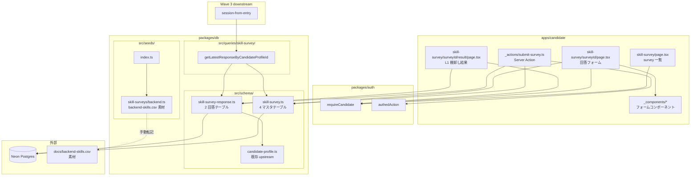
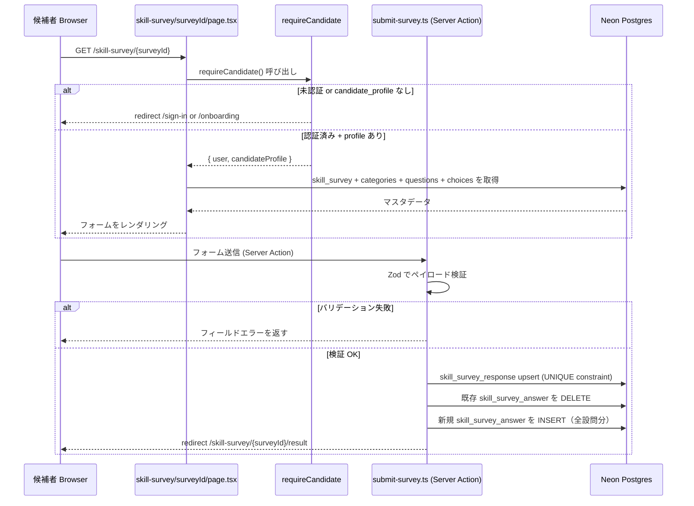
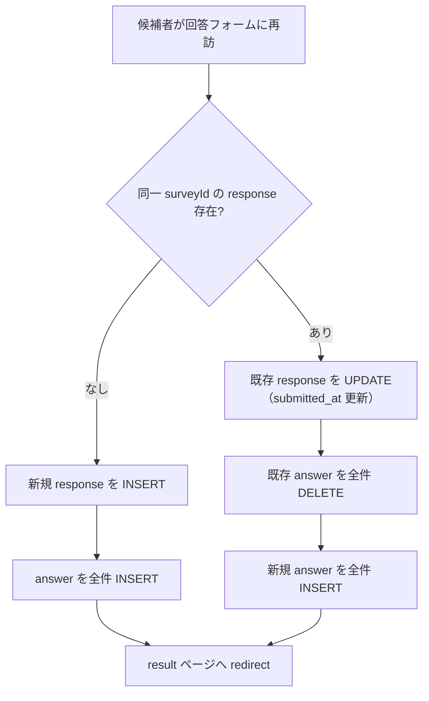
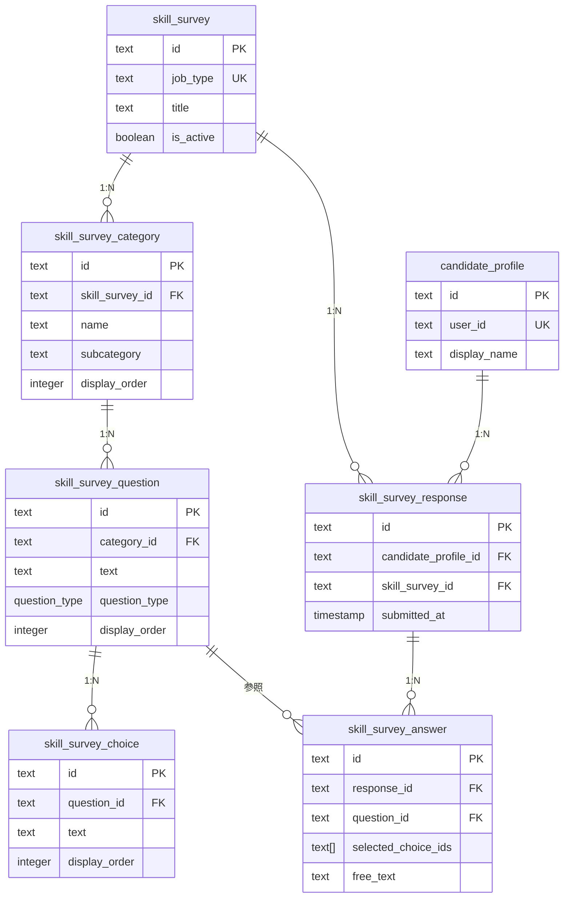
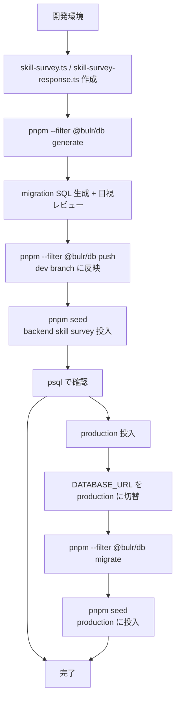

# Design Document — skill-survey

## Overview

本 spec は Wave 2 の 3 番目の feature であり、候補者向けアプリ `apps/candidate`（bulr.net）にバックエンド職種向けスキルアンケートを実装する。候補者は静的な構造化フォーム（選択式中心＋一部記述）に回答し、L1 棚卸し結果を確認できる。LLM は使用せず、数値スコア・他者比較・年収査定は出さない。

**Users**: 候補者（bulr.net を利用するエンジニア求職者）が回答フォームと結果表示の直接受益者。Wave 3 `session-from-entry` の開発者は `getLatestResponseByCandidateProfileId` クエリ関数の消費者。

**Impact**: `packages/db` に 6 テーブル（マスタ 4 + 回答 2）を追加し、seed スクリプトでバックエンド職種マスタを投入する。`apps/candidate` に `/skill-survey/*` ルートを新設し、Wave 3 向けの公開 seam（読み出しクエリ）を確立する。

### Goals

- `skill_survey` 4 階層マスタスキーマ（survey → category → question → choice）を Drizzle で定義し migration を生成する
- `skill_survey_response` / `skill_survey_answer` 回答スキーマを定義し migration を生成する
- `docs/backend-skills.csv` を素材に `packages/db/src/seeds/skill-surveys/backend.ts` を作成し、idempotent upsert で投入できるようにする
- `apps/candidate/app/skill-survey/*` でマスタ駆動の回答フォームと L1 棚卸し結果表示を実装する
- `packages/db/src/queries/skill-survey/` に `getLatestResponseByCandidateProfileId` を実装し Wave 3 に安定した seam を提供する

### Non-Goals

- LLM によるスキル要約・自然言語フィードバック（Wave 4 `mock-interview` 吸収）
- 数値スコアリング・年収査定・他者比較（設計メモ §9 L3 注記で明示却下）
- `assessment_pattern` 選定ロジック（Wave 3 `session-from-entry`）
- admin CMS でのマスタ管理（Wave 4 `admin-operations`）
- バックエンド以外の職種 survey（後続 spec or 同 spec 拡張）
- `packages/i18n` の新設（日本語 UI のみ、既存方針に準拠）

---

## Boundary Commitments

### This Spec Owns

- `packages/db/src/schema/skill-survey.ts` — `skill_survey` / `skill_survey_category` / `skill_survey_question` / `skill_survey_choice` テーブル + `question_type` pgEnum
- `packages/db/src/schema/skill-survey-response.ts` — `skill_survey_response` / `skill_survey_answer` テーブル
- `packages/db/src/schema/index.ts` — 上記 2 ファイルの barrel export 追加
- `packages/db/drizzle/*_skill_survey*.sql` — drizzle-kit 生成マイグレーション（6 テーブル分）
- `packages/db/src/seeds/skill-surveys/backend.ts` — バックエンド職種シードデータ
- `packages/db/src/seeds/index.ts` — backend seed の呼び出し追加
- `packages/db/src/queries/skill-survey/index.ts` — `getLatestResponseByCandidateProfileId` 関数
- `packages/db/src/queries/index.ts` — skill-survey クエリの barrel export 追加
- `apps/candidate/app/skill-survey/page.tsx` — survey 一覧ページ
- `apps/candidate/app/skill-survey/[surveyId]/page.tsx` — 回答フォームページ
- `apps/candidate/app/skill-survey/[surveyId]/_actions/submit-survey.ts` — 送信 Server Action
- `apps/candidate/app/skill-survey/[surveyId]/result/page.tsx` — L1 棚卸し結果ページ
- `apps/candidate/app/skill-survey/_components/*` — フォーム・結果表示コンポーネント

### Out of Boundary

- `candidate_profile` スキーマ・`requireCandidate` ガード（`candidate-auth-onboarding` 所有）
- `assessment_pattern` への接続（Wave 3 `session-from-entry` 担当）
- 招待トークン・エントリーフロー（Wave 3）
- admin CMS（Wave 4 `admin-operations`）
- AI 解析・LLM 要約（永久 out of scope）

### Allowed Dependencies

- `packages/auth` → `requireCandidate`、`authedAction`（`candidate-auth-onboarding` が確立）
- `packages/db` → `candidateProfile` テーブル参照（FK として）
- `apps/candidate` → `@bulr/db`、`@bulr/auth`、`@bulr/ui`、`@bulr/types`
- 依存方向: `apps/candidate → packages/*` の単方向（逆方向禁止）

### Revalidation Triggers

- `getLatestResponseByCandidateProfileId` のシグネチャ・戻り値型の変更 → Wave 3 `session-from-entry`、Wave 4 `mock-interview` の全利用箇所を再確認
- `skill_survey_response` / `skill_survey_answer` スキーマへのカラム追加 → 後続 Wave 3/4 spec の利用箇所を再確認
- `skill_survey_question.question_type` enum 値の追加 → 回答フォームレンダリングロジックと Zod 検証スキーマを更新
- `candidate_profile.id` 型の変更（`candidate-auth-onboarding`）→ FK 定義と全クエリを再確認

---

## Architecture

### Existing Architecture Analysis

Wave 2 `candidate-auth-onboarding` 完了時点で以下が整備済み:

- `packages/db/src/schema/candidate-profile.ts`: `candidate_profile` テーブル（`id` text PK）
- `packages/auth/src/guards.ts`: `requireCandidate()` — 認証済み + `candidate_profile` 存在確認
- `packages/auth/src/server-entry.ts`: `authedAction` ラッパーを re-export
- `apps/candidate/lib/auth.ts`: `createAuth` factory で候補者テンプレートを注入したインスタンス

Stage 1 `assessment-pattern-seed` が確立した seed パターン:

- `packages/db/src/seeds/patterns/*.ts` — カテゴリ別データファイル
- `packages/db/src/seeds/assessment-patterns.ts` — 集約 + 件数チェック純関数
- `packages/db/src/seeds/index.ts` — エントリーポイント
- idempotent upsert: `db.transaction` + `onConflictDoUpdate({ target: uniqueKey, set: { ...fields } })`

本 spec はこのパターンを踏襲し、seed 手法の一貫性を保つ。

### Architecture Pattern & Boundary Map



**Key Decisions**:

- **4 階層正規化マスタ**: survey → category → question → choice の 4 テーブル構成。CSV の「カテゴリ / サブカテゴリ / 質問 / 回答」構造に対応。admin CMS（Wave 4）が個別エンティティを CRUD できるようにするため、1 テーブル非正規化は採用しない
- **再回答 = upsert（最新版保持）**: `skill_survey_response` に `UNIQUE(candidate_profile_id, skill_survey_id)` 制約を設け、`onConflictDoUpdate` で既存レスポンスを上書き。回答履歴は保持しない（Wave 2 制約「将来像は見据えるが実装は最小」）
- **seed のカテゴリ/サブカテゴリ扱い**: CSV の「カテゴリ」列が `skill_survey_category.name` に、「サブカテゴリ」列が `skill_survey_question` の親グループとして `display_order` でソートされる。現段階では subcategory を別テーブルとして正規化せず、`skill_survey_category` に `subcategory` カラムを追加して扱う（Wave 4 admin CMS で必要なら分離）
- **Zod バリデーション配置**: 送信ペイロードの Zod スキーマは `apps/candidate/app/skill-survey/[surveyId]/_actions/submit-survey.ts` 内に定義する。`packages/types` には置かない（runtime 依存を持ち、かつ候補者アプリ固有のため）
- **Server Component ファースト**: フォームデータ取得・DB アクセスは Server Component で完結。インタラクティブな選択操作のみ Client Component（`'use client'`）で分担

### Technology Stack

| Layer | 選択 / バージョン | 本 spec での役割 | 備考 |
|-------|-----------------|----------------|------|
| DB / ORM | Drizzle ORM 0.45.x + Neon Postgres | 6 テーブル定義・クエリ | 既存バージョン継続 |
| Migration | drizzle-kit 0.31.x | migration 生成・適用 | 既存 |
| Frontend | Next.js 16 App Router + React 19 | 回答フォーム・結果表示 | 既存 |
| Validation | Zod 4.x | 送信ペイロード検証 | 既存 |
| Seed Runtime | `tsx` ^4 | `packages/db/src/seeds/index.ts` 実行 | 既存 |
| Auth Guard | Better Auth 1.6.x + `requireCandidate` | ルート保護 | `candidate-auth-onboarding` が確立 |
| UI | Tailwind CSS 4 + shadcn/ui ベース | フォーム・結果 UI | 既存 |

---

## File Structure Plan

### Directory Structure

```
bulr-app-mvp/
├── packages/
│   └── db/
│       └── src/
│           ├── schema/
│           │   ├── skill-survey.ts              # ★新規: 4 マスタテーブル + question_type pgEnum
│           │   ├── skill-survey-response.ts     # ★新規: response + answer テーブル
│           │   └── index.ts                     # ★変更: 上記 2 ファイルを barrel export に追加
│           ├── seeds/
│           │   ├── skill-surveys/
│           │   │   └── backend.ts               # ★新規: backend-skills.csv 素材からのシードデータ
│           │   └── index.ts                     # ★変更: backend seed 呼び出しを追加
│           ├── queries/
│           │   ├── skill-survey/
│           │   │   └── index.ts                 # ★新規: getLatestResponseByCandidateProfileId
│           │   └── index.ts                     # ★変更: skill-survey クエリを barrel export に追加
│           └── drizzle/
│               └── *_skill_survey*.sql           # ★新規 (drizzle-kit 自動生成)
│
└── apps/
    └── candidate/
        └── app/
            └── skill-survey/
                ├── page.tsx                     # ★新規: survey 一覧（Server Component）
                ├── _components/
                │   ├── survey-list.tsx           # ★新規: 利用可能 survey カード一覧
                │   ├── survey-form.tsx           # ★新規: 回答フォーム Client Component
                │   ├── question-single.tsx       # ★新規: single_choice 設問
                │   ├── question-multi.tsx        # ★新規: multi_choice 設問
                │   └── question-free-text.tsx    # ★新規: free_text 設問
                └── [surveyId]/
                    ├── page.tsx                  # ★新規: 回答フォームページ（Server Component）
                    ├── _actions/
                    │   └── submit-survey.ts      # ★新規: 送信 Server Action + Zod 検証
                    └── result/
                        └── page.tsx              # ★新規: L1 棚卸し結果（Server Component）
```

### Modified Files

- `packages/db/src/schema/index.ts` — `skill-survey.ts` と `skill-survey-response.ts` の `export *` を追加
- `packages/db/src/seeds/index.ts` — `runBackendSkillSurveySeed()` の呼び出しを追加
- `packages/db/src/queries/index.ts` — `skill-survey/index.ts` の re-export を追加

---

## System Flows

### 回答フォーム送信フロー



### 再回答フロー（最新版保持）



---

## Requirements Traceability

| 要件 | サマリー | コンポーネント | インターフェース | フロー |
|------|---------|--------------|--------------|------|
| 1.1〜1.6 | マスタスキーマ 4 テーブル | `MasterSchemaModule` | `skill-survey.ts` DDL | migration フロー |
| 2.1〜2.5 | 回答スキーマ 2 テーブル | `ResponseSchemaModule` | `skill-survey-response.ts` DDL | migration フロー |
| 3.1〜3.5 | backend seed スクリプト | `BackendSeedModule` | `seeds/skill-surveys/backend.ts` | seed 投入フロー |
| 4.1〜4.7 | 回答フォーム UI | `SurveyListPage`, `SurveyFormPage`, `SurveyFormComponent`, `SubmitSurveyAction` | `/skill-survey/*` | 回答フォーム送信フロー |
| 5.1〜5.5 | L1 棚卸し結果表示 | `SurveyResultPage` | `/skill-survey/[surveyId]/result` | — |
| 6.1〜6.5 | Wave 3 読み出し API | `SkillSurveyQueryModule` | `getLatestResponseByCandidateProfileId` | — |
| 7.1〜7.4 | アクセス制御・入力検証 | `RequireCandidate`, `SubmitSurveyAction` | `requireCandidate()`, Zod schema | 回答フォーム送信フロー |

---

## Components and Interfaces

### コンポーネント一覧

| コンポーネント | ドメイン/レイヤー | 意図 | 要件カバレッジ | キー依存 | コントラクト |
|-------------|----------------|------|-------------|---------|------------|
| `MasterSchemaModule` | packages/db/schema | 4 マスタテーブル + pgEnum | 1.1〜1.6 | Drizzle ORM | State |
| `ResponseSchemaModule` | packages/db/schema | 2 回答テーブル | 2.1〜2.5 | Drizzle ORM, candidateProfile FK | State |
| `BackendSeedModule` | packages/db/seeds | backend-skills.csv から seed データ | 3.1〜3.5 | tsx, MasterSchemaModule | Batch |
| `SkillSurveyQueryModule` | packages/db/queries | Wave 3 向け読み出しクエリ | 6.1〜6.5 | ResponseSchemaModule, MasterSchemaModule | Service |
| `SurveyListPage` | apps/candidate | survey 一覧（Server Component） | 4.1, 7.1 | requireCandidate, MasterSchemaModule | State |
| `SurveyFormPage` | apps/candidate | 回答フォームページ（Server Component） | 4.2, 4.3, 7.1 | requireCandidate, MasterSchemaModule | State |
| `SurveyFormComponent` | apps/candidate | インタラクティブなフォーム（Client Component） | 4.2, 4.3, 4.4 | SubmitSurveyAction | State |
| `SubmitSurveyAction` | apps/candidate | 送信 Server Action + Zod 検証 | 4.4, 4.5, 7.2, 7.3 | authedAction, ResponseSchemaModule | Service |
| `SurveyResultPage` | apps/candidate | L1 棚卸し結果（Server Component） | 5.1〜5.5, 7.1 | requireCandidate, ResponseSchemaModule | State |

### packages/db (schema)

#### MasterSchemaModule

| フィールド | 詳細 |
|----------|------|
| Intent | `skill_survey` 4 階層マスタテーブルと `question_type` pgEnum を Drizzle で定義する |
| Requirements | 1.1, 1.2, 1.3, 1.4, 1.5, 1.6 |

**Responsibilities & Constraints**

- `packages/db/src/schema/skill-survey.ts` に定義
- `pgEnum('question_type', ['single_choice', 'multi_choice', 'free_text'])` を `questionType` で export
- 4 テーブルを `skillSurvey` / `skillSurveyCategory` / `skillSurveyQuestion` / `skillSurveyChoice` という名前で export
- `skill_survey_category` に `subcategory` カラム（nullable text）を追加し CSV の「サブカテゴリ」列を保持する（正規化は Wave 4 に延期）
- 各テーブルの `id` は `text('id').primaryKey().$defaultFn(() => nanoid())`
- FK は ON DELETE CASCADE ではなく、論理的な削除なし方針（`is_active` で休眠）を維持

**Physical Data Model**

```sql
skill_survey (
  id           text        PRIMARY KEY,
  job_type     text        NOT NULL UNIQUE,   -- 'backend' 等
  title        text        NOT NULL,
  description  text,
  is_active    boolean     NOT NULL DEFAULT true,
  created_at   timestamp   NOT NULL DEFAULT now(),
  updated_at   timestamp   NOT NULL DEFAULT now()
)

skill_survey_category (
  id               text    PRIMARY KEY,
  skill_survey_id  text    NOT NULL REFERENCES skill_survey(id),
  name             text    NOT NULL,
  subcategory      text,                      -- CSV サブカテゴリ列
  display_order    integer NOT NULL,
  created_at       timestamp NOT NULL DEFAULT now(),
  updated_at       timestamp NOT NULL DEFAULT now()
)

skill_survey_question (
  id           text        PRIMARY KEY,
  category_id  text        NOT NULL REFERENCES skill_survey_category(id),
  text         text        NOT NULL,
  question_type question_type NOT NULL,
  display_order integer    NOT NULL,
  created_at   timestamp   NOT NULL DEFAULT now(),
  updated_at   timestamp   NOT NULL DEFAULT now()
)

skill_survey_choice (
  id            text    PRIMARY KEY,
  question_id   text    NOT NULL REFERENCES skill_survey_question(id),
  text          text    NOT NULL,
  display_order integer NOT NULL,
  created_at    timestamp NOT NULL DEFAULT now()
)
```

**Dependencies**

- Inbound: `packages/db/src/schema/index.ts`（barrel）、BackendSeedModule、SubmitSurveyAction、SkillSurveyQueryModule
- Outbound: drizzle-orm 0.45、nanoid ^5

**Contracts**: State [x]

#### ResponseSchemaModule

| フィールド | 詳細 |
|----------|------|
| Intent | `skill_survey_response` / `skill_survey_answer` テーブルを Drizzle で定義する |
| Requirements | 2.1, 2.2, 2.3, 2.4, 2.5 |

**Responsibilities & Constraints**

- `packages/db/src/schema/skill-survey-response.ts` に定義
- `skill_survey_response` に `UNIQUE(candidate_profile_id, skill_survey_id)` 制約（再回答 upsert のため）
- `skill_survey_answer.selected_choice_ids` は `text('selected_choice_ids').array()`（nullable、`multi_choice` 用）
- `skill_survey_answer.free_text` は nullable text

**Physical Data Model**

```sql
skill_survey_response (
  id                    text      PRIMARY KEY,
  candidate_profile_id  text      NOT NULL REFERENCES candidate_profile(id),
  skill_survey_id       text      NOT NULL REFERENCES skill_survey(id),
  submitted_at          timestamp NOT NULL DEFAULT now(),
  created_at            timestamp NOT NULL DEFAULT now(),
  updated_at            timestamp NOT NULL DEFAULT now(),
  UNIQUE(candidate_profile_id, skill_survey_id)
)

skill_survey_answer (
  id                text      PRIMARY KEY,
  response_id       text      NOT NULL REFERENCES skill_survey_response(id) ON DELETE CASCADE,
  question_id       text      NOT NULL REFERENCES skill_survey_question(id),
  selected_choice_ids text[]  NULL,       -- single_choice / multi_choice 用
  free_text         text      NULL,       -- free_text 用
  created_at        timestamp NOT NULL DEFAULT now()
)
```

**Dependencies**

- Inbound: `packages/db/src/schema/index.ts`、SubmitSurveyAction、SkillSurveyQueryModule
- Outbound: drizzle-orm 0.45、nanoid、`candidate_profile`（upstream FK）、`skill_survey`（マスタ FK）

**Contracts**: State [x]

### packages/db (seeds)

#### BackendSeedModule

| フィールド | 詳細 |
|----------|------|
| Intent | `docs/backend-skills.csv` を素材に backend 職種 skill survey マスタを idempotent upsert で投入する |
| Requirements | 3.1, 3.2, 3.3, 3.4, 3.5 |

**Responsibilities & Constraints**

- `packages/db/src/seeds/skill-surveys/backend.ts` を新規作成
- `packages/db/src/seeds/index.ts` から `runBackendSkillSurveySeed(db)` として呼び出される（`assessment-pattern-seed` パターンを踏襲）
- CSV の行を TypeScript リテラルとして事前定義済みの構造体に手動転記
- upsert の conflict target（各テーブルに DB レベルの UNIQUE インデックスを作成すること → task 1.1 参照）:
  - `skill_survey`: `job_type`（UNIQUE 制約済み）
  - `skill_survey_category`: `(skill_survey_id, name, subcategory)` の複合 UNIQUE インデックス
  - `skill_survey_question`: `(category_id, body)` の複合 UNIQUE インデックス（`text` カラム名が予約語と衝突する場合は `body` 等に変更）
  - `skill_survey_choice`: `(question_id, label)` の複合 UNIQUE インデックス（`text` カラム名が予約語と衝突する場合は `label` 等に変更）
- **各テーブルの id は初回生成後不変**: `onConflictDoUpdate` の `set` に `id` を含めない。これにより再 seed 時も `skill_survey_answer.question_id` FK が dangling にならない（DELETE + INSERT による再構築方式は禁止）
- 完了後にカテゴリ数・設問数・選択肢数をコンソールに出力

**Contracts**: Batch [x]

##### Batch / Job Contract

- Trigger: `packages/db/src/seeds/index.ts` から呼び出し、`pnpm seed` 相当のコマンドで実行
- Input: `db` client インスタンス（seeds/index.ts から注入）
- Output: Neon Postgres の 4 マスタテーブルにレコードを upsert + コンソールログ
- Idempotency: 2 回実行で DB 状態が変わらない（`onConflictDoUpdate` で保証）

**Implementation Notes**

- `assessment-pattern-seed` の `scripts/seed-assessment-patterns.ts` パターンを参照し、seeds/index.ts をエントリーポイントとして踏襲する
- CSV のすべての行を包含するが、完全自動パースは行わず TypeScript リテラルとして手動転記（管理性と型安全性のため）

### packages/db (queries)

#### SkillSurveyQueryModule

| フィールド | 詳細 |
|----------|------|
| Intent | Wave 3 `session-from-entry` 等の downstream が消費する `getLatestResponseByCandidateProfileId` クエリ関数を提供する |
| Requirements | 6.1, 6.2, 6.3, 6.4, 6.5 |

**Responsibilities & Constraints**

- `packages/db/src/queries/skill-survey/index.ts` に実装
- 関数シグネチャを安定させ、Wave 3 / Wave 4 での breaking change を防ぐ
- Drizzle ORM のみ使用（素の SQL 結合は禁止）
- `getLatestResponseByCandidateProfileId` は `packages/db/src/queries/skill-survey/` に配置し、`packages/db` のバレル（`@bulr/db/queries` 相当）から公開する。Wave 3 `session-from-entry` が `apps/business` から本クエリを参照する際は、`packages/db` のバレル経由で直接 import する（`apps/candidate` のコードは参照しない）。apps → apps 依存禁止を保ったまま read-only seam を提供する。

**Contracts**: Service [x]

##### Service Interface

```typescript
// packages/db/src/queries/skill-survey/index.ts
// Wave 2 全体で統一パターン: packages/db/src/queries/* のクエリ関数は singleton db を
// '../../client' から直接 import する（DI 引数を取らない）。
// これは resume-registration の getPrimaryResumeDocument 設計と整合する。

import { db } from '../../client';
import { skillSurveyResponse, skillSurveyAnswer, skillSurveyQuestion } from '../../schema';
import { eq, and } from 'drizzle-orm';

export type SkillSurveyResponseWithAnswers = {
  response: typeof skillSurveyResponse.$inferSelect;
  answers: Array<{
    answer: typeof skillSurveyAnswer.$inferSelect;
    question: typeof skillSurveyQuestion.$inferSelect;
  }>;
};

export async function getLatestResponseByCandidateProfileId(
  candidateProfileId: string,
  surveyId: string,
): Promise<SkillSurveyResponseWithAnswers | null>;
```

- Preconditions: `candidateProfileId` と `surveyId` が空でない文字列
- Postconditions: レスポンスが存在すれば `SkillSurveyResponseWithAnswers`、存在しなければ `null`
- Invariants: 取得するデータは必ず `candidate_profile_id = candidateProfileId` にスコープされる（他候補者データへのアクセスなし）

### apps/candidate

#### SurveyFormPage + SurveyFormComponent + SubmitSurveyAction

| フィールド | 詳細 |
|----------|------|
| Intent | マスタ駆動で回答フォームをレンダリングし、Zod 検証済みの送信を Server Action で処理する |
| Requirements | 4.2, 4.3, 4.4, 4.5, 4.6, 4.7, 7.2, 7.3, 7.4 |

**Responsibilities & Constraints**

- `apps/candidate/app/skill-survey/[surveyId]/page.tsx`: Server Component。`requireCandidate` でガード後、マスタを全件取得して Client Component に props として渡す
- `apps/candidate/app/skill-survey/_components/survey-form.tsx`: `'use client'` コンポーネント。カテゴリ → 設問の順にレンダリング。`single_choice` → radio、`multi_choice` → checkbox、`free_text` → textarea を切り替える
- `apps/candidate/app/skill-survey/[surveyId]/_actions/submit-survey.ts`: `authedAction` でラップ。Zod でペイロード検証後、DB upsert を実行

**Contracts**: Service [x]

##### Service Interface

```typescript
// _actions/submit-survey.ts

const submitSurveySchema = z.object({
  surveyId: z.string().min(1),
  answers: z.array(
    z.object({
      questionId: z.string().min(1),
      selectedChoiceIds: z.array(z.string()).optional(),
      freeText: z.string().max(2000).optional(),
    }),
  ),
});

export const submitSurvey = authedAction(
  submitSurveySchema,
  async ({ surveyId, answers }, { userId }) => {
    const { candidateProfile } = await requireCandidate();
    // candidateProfile.id を使って以下を実行:
    // 1. skill_survey_response を upsert
    // 2. 既存 skill_survey_answer を DELETE（ON DELETE CASCADE で自動）
    // 3. 新規 skill_survey_answer を INSERT
    // 4. redirect('/skill-survey/{surveyId}/result')
  },
);
// 注意: authedAction の ctx は { userId } のみ提供する。candidateProfileId は
// requireCandidate() を内部で呼び出して取得する（authedAction + requireCandidate() 二重呼び出しパターン）。
// candidateAction は Wave 2 スコープ外。
```

#### SurveyResultPage

| フィールド | 詳細 |
|----------|------|
| Intent | 候補者の最新回答をカテゴリ・設問別に構造化表示する L1 棚卸し結果ページ |
| Requirements | 5.1, 5.2, 5.3, 5.4, 5.5, 7.1 |

**Responsibilities & Constraints**

- `apps/candidate/app/skill-survey/[surveyId]/result/page.tsx`: Server Component
- `requireCandidate` でガード後、`getLatestResponseByCandidateProfileId` でデータ取得
- 回答なしの場合は `/skill-survey/[surveyId]` にリダイレクト
- 数値スコア・他者比較・年収は表示しない（UI に該当要素を含めない）
- 自由記述は候補者が入力したテキストをそのまま表示（LLM 変換なし）

---

## Data Models

### 論理データモデル



### データライフサイクル

| テーブル | Create | Read | Update | Delete |
|---------|--------|------|--------|--------|
| `skill_survey` | seed スクリプト | フォームレンダリング・Wave 3 クエリ | seed 再実行（is_active 保護付き） | 物理削除なし（is_active=false） |
| `skill_survey_category` | seed スクリプト | フォームレンダリング | seed 再実行 | 物理削除なし |
| `skill_survey_question` | seed スクリプト | フォームレンダリング | seed 再実行 | 物理削除なし |
| `skill_survey_choice` | seed スクリプト | フォームレンダリング | seed 再実行 | 物理削除なし |
| `skill_survey_response` | Server Action（初回） | 結果表示・Wave 3 クエリ | Server Action（再回答）= upsert | 物理削除なし（Wave 5+ で候補者データ削除機能） |
| `skill_survey_answer` | Server Action | 結果表示・Wave 3 クエリ | 再回答時に DELETE + INSERT | ON DELETE CASCADE（response 削除時） |

---

## Error Handling

### Error Strategy

- 認証エラーは多層防御（proxy.ts → Server Component `requireCandidate` → `authedAction`）の各レイヤーで独立処理
- フォーム検証エラーは Zod parse 結果をクライアントに返す（`authedAction` ラッパーの規約に準拠）
- 回答なし状態での result ページアクセスは Server Component レベルで redirect

### Error Categories and Responses

- **未認証アクセス** (UNAUTHORIZED): `requireCandidate` が throw → `authedAction` が `/sign-in` にリダイレクト
- **candidate_profile 未作成** (CANDIDATE_PROFILE_MISSING): `requireCandidate` が throw → `/onboarding` にリダイレクト
- **フォーム検証エラー**: Zod parse 失敗 → フィールドエラーをクライアントに返す
- **存在しない surveyId**: Server Component で `notFound()` を呼ぶ
- **回答なしで result アクセス**: Server Component で `/skill-survey/[surveyId]` にリダイレクト

---

## Testing Strategy

### 手動 Smoke Test（Stage 1 方針）

本 spec は Stage 1 方針に沿い自動テストフレームワークを導入しない。完了確認は以下の手動 smoke test で行う。

1. **スキーマ・マイグレーション**
   - `pnpm --filter @bulr/db generate` で 6 テーブル分の migration ファイルが生成される
   - `pnpm --filter @bulr/db push` で dev branch への反映が成功する
   - Neon Console / psql で `\d skill_survey`、`\d skill_survey_response` 等のカラム一覧が仕様通りであることを確認

2. **seed 投入**
   - `pnpm seed`（または相当コマンド）で backend skill survey のカテゴリ・設問・選択肢が投入される
   - 2 回連続実行でレコード数が変わらない（冪等性）
   - ログにカテゴリ数・設問数・選択肢数が出力される

3. **回答フォーム**
   - 候補者としてサインイン後、`/skill-survey` で survey 一覧が表示される
   - `/skill-survey/{surveyId}` でカテゴリ → 設問 → 選択肢がレンダリングされる
   - 未認証でのアクセスが `/sign-in` にリダイレクトされる
   - フォーム送信後に `/skill-survey/{surveyId}/result` にリダイレクトされる

4. **再回答**
   - 同一 surveyId に 2 回回答した場合、`skill_survey_response` テーブルのレコード数が増えない（upsert）
   - 2 回目の結果が result ページに表示される

5. **L1 棚卸し結果**
   - 回答済みのカテゴリ・設問・選択内容が構造化表示される
   - 数値スコア・他者比較・年収が表示されない
   - 自由記述が入力テキストそのままで表示される
   - 回答なし状態での result アクセスがフォームページにリダイレクトされる

6. **Wave 3 読み出し API**
   - `getLatestResponseByCandidateProfileId(candidateProfileId, surveyId)` が TypeScript strict mode で import・呼び出しできる
   - 回答あり → `SkillSurveyResponseWithAnswers` を返す
   - 回答なし → `null` を返す

7. **ビルドとタイプチェック**
   - `pnpm build` が全 packages・apps で成功する
   - `pnpm typecheck` が全 workspace で成功する

---

## Security Considerations

- `requireCandidate` は多層防御の一部として実装し、proxy.ts のみに依存しない（CVE-2025-29927 教訓）
- 全スキルアンケートルートは `requireCandidate` でガードし、`authedAction` ラッパーを経由してのみ mutation を許可
- DB クエリは必ず `candidate_profile_id` でスコープし、他候補者データへのアクセスを防止
- Zod スキーマで free_text を 2000 文字以上で reject（DoS 防止）
- `selected_choice_ids` の値は DB に保存する前に、実際に `skill_survey_choice` に存在する ID であることをサーバーサイドで検証する

---

## Migration Strategy



- migration 連番は drizzle-kit が自動付与（glob パターンで参照、ハードコードしない）
- `assessment-pattern-seed` が先行 migration を持つため、本 spec の migration はより大きな連番になる
- production 投入は `migrate`（履歴管理付き）を使用し `push` は禁止
