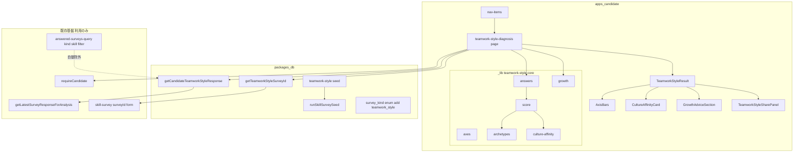
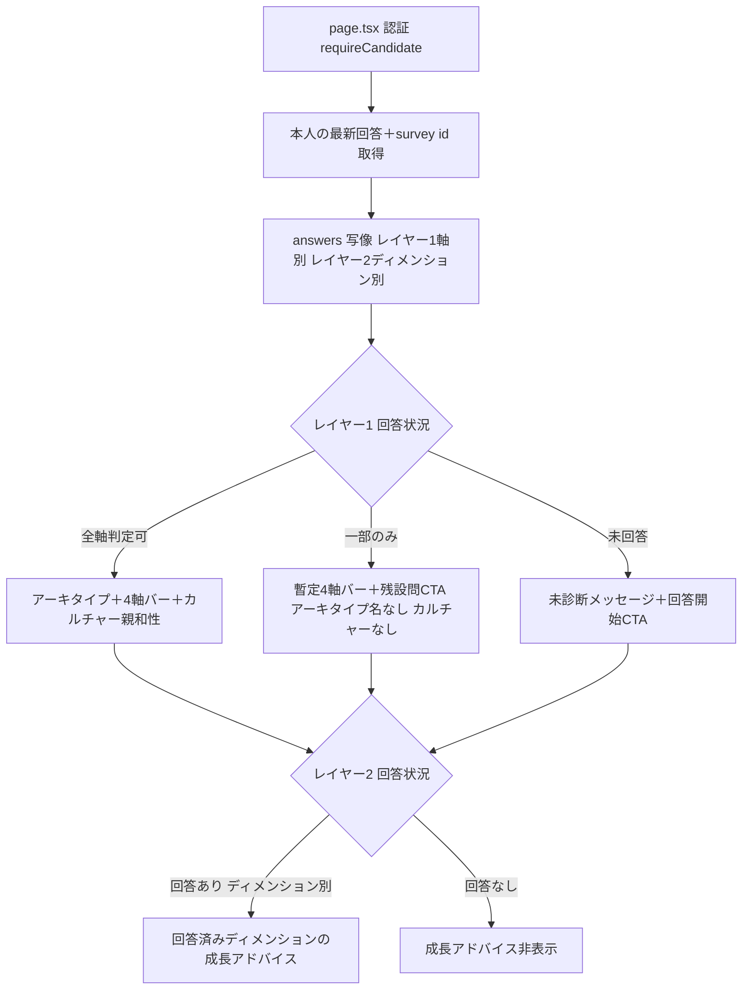

# Design Document — teamwork-style-diagnosis

## Overview

**チームワーク・スタイル診断** は、認証済み候補者が「他者・チームとどう関わるか（対人・協働の型）」を自己診断し、非評価の 4軸×2極＝16タイプのアーキタイプ、そこから導かれるカルチャー親和性、および成長アドバイスを受け取る、診断ファミリー3つ目の原子診断である。playstyle-diagnosis / thinking-style-diagnosis / worklife-disposition-survey が確立した骨格「サーベイ → 決定論スコアリング（純関数・ライブ算出・非永続）→ 結果体験（軸バー＋アーキタイプ＋共有）」を**加算的に複製**して構築する。

**Users**: apps/candidate の認証済み候補者。対人・協働アンケートに回答し、`/teamwork-style-diagnosis` で自分のタイプ・カルチャー親和性・成長アドバイスを受け取る。

**Impact**: 既存機能の動作は一切変えない。新規ルート `/teamwork-style-diagnosis`、新規アンケート種別 `kind='teamwork_style'`、新規 seed／query／app-local コアを**加算のみ**で導入する。マージ済みの playstyle・thinking-style・worklife-disposition・スキルアンケート基盤は改修しない。一覧除外は既存の `kind='skill'` フィルタにより自動成立し、除外用のコード改修は不要。

### Goals

- 対人・協働スタイルを 4軸×2極＝16タイプ で決定論導出し、独立した結果体験（アーキタイプ・4軸可視化・カルチャー親和性・成長アドバイス・共有）を提供する。
- 「盛られやすい」社会性領域に対し、レイヤー1＝二者択一・レイヤー2＝SJT のハイブリッド形式で妥当性を高める。
- 既存 playstyle・thinking-style・worklife-disposition・スキルアンケート基盤の動作を変えない（加算のみ）。

### Non-Goals

- 面接官向けの社会性問診パターン（派生 spec B、assessment-engine が担当。本 spec のレイヤー1軸語彙・SJT シナリオを再利用）。
- 診断結果の永続化・履歴・版間比較（別 spec、self-analysis-history の系譜）。
- 社会性スコアの高低による合否判定・レッテル付け（評価的スコアは作らない）。
- 会社ごとのカルチャー適合（本人×特定チームの相性予測）。
- 診断ファミリー共通基盤（axis-bars / score / result の共有コア）の抽出・汎用化（3実例が揃った後に別 spec）。
- RPGクラス診断・診断アーキタイプへのチームワーク・スタイルの給餌。

## Boundary Commitments

### This Spec Owns

- チームワーク・スタイルの 4軸×2極＝16タイプ 定義（軸・極・アーキタイプ）と、二者択一回答から軸×極を決定論導出するライブ算出ロジック。
- レイヤー2（成長ディメンション3種）の SJT 回答から発達段階を推定し、非評価の成長アドバイスへ写像するロジック。
- レイヤー1の4軸コードから一方向にカルチャー親和性を導出するロジック（キュレーテッド・コンテンツ）。
- 独立した結果画面（none/partial/full 分岐・4軸バー・アーキタイプカード・カルチャー親和性・成長アドバイス・共有パネル）と専用ページ `/teamwork-style-diagnosis`。
- チームワーク・スタイルアンケート（`kind='teamwork_style'`）の seed と、その回答取得・survey id 解決 query。
- `survey_kind` enum への `'teamwork_style'` 値追加 migration、および pgEnum 配列・seed runner の `kind` union 型への値追加。
- 回答へ直行する deep-link 導線とナビ入口。
- 本診断が自己分析一覧・自己分析生成対象へ漏出しないことを固定する回帰テスト。

### Out of Boundary

- 面接官向け問診パターン（spec B）の実装。
- 結果の永続化・履歴・版比較。
- playstyle / thinking-style / worklife-disposition 診断コードの改修。
- 共有コア（score/axis-bars 等）の抽出・汎用化。
- 既存スキルアンケート基盤（回答保存・提出・フォーム UI）の変更。
- `/skill-survey` トップ一覧のフィルタ挙動変更（現状 kind 無フィルタで診断も表示され得る＝既存仕様。本 spec では変更しない）。

### Allowed Dependencies

- 既存スキルアンケート基盤（`skillSurvey` 4階層スキーマ、`getLatestSurveyResponseForAnalysis`、`/skill-survey/[surveyId]` 回答フォーム、seed runner `runSkillSurveySeed`）を**利用のみ**。
- 認証ヘルパー `requireCandidate()`（`@bulr/auth/server`）。
- 依存方向 types → db → ai → apps を厳守。本 spec は db（schema/seed/query）と app に閉じ、`@bulr/types`・`@bulr/ai` は変更しない（型は app-local）。

### Revalidation Triggers

- 既存スキルアンケート基盤の回答スキーマ／`getLatestSurveyResponseForAnalysis` の契約変更。
- `survey_kind` enum の再定義、または seed runner `kind` union の変更。
- 一覧除外フィルタ（`answered-surveys-query.ts`）の包含条件変更（現在 `kind='skill'` 包含 → 変えると `teamwork_style` が一覧へ漏出しうる）。
- `question_type` enum の変更（本 spec は `single_choice` に依存）。

## Architecture

### Existing Architecture Analysis

thinking-style-diagnosis は次の層構成で実装されている（research.md 参照）:

- `apps/candidate/app/_lib/thinking-style/` に app-local 純関数コア（axes / score / answers / archetypes、型も app-local）
- `thinking-style-diagnosis/page.tsx`（Server Component：認証・本人スコープ取得・ライブ算出・deep-link 解決）＋ `_components/`（result / axis-bars / share-panel）
- `packages/db/src/queries/thinking-style/`（survey id 解決・本人回答取得）
- `packages/db/src/seeds/skill-surveys/thinking-style.ts`（seed）＋ `runner.ts`（汎用4階層 upsert）＋ `seeds/index.ts`（登録）
- `survey_kind` enum への値追加 migration

本 spec は同型を踏襲しつつ、次を**意図的に踏襲/逸脱**する:

1. **型は app-local**（thinking-style と同じ）: クロスパッケージ消費者を持たないため `@bulr/types` に足さない。
2. **legacy 互換なし**（thinking-style と同じ）: 新規診断で旧レコードなし。
3. **スコアリングは形式に合わせて再設計**（逸脱）: Likert 平均ではなく、二者択一の極ピック多数決（レイヤー1）＋ SJT の発達段階集約（レイヤー2）。
4. **表示レイヤーを2要素追加**（拡張）: カルチャー親和性カードと成長アドバイスセクション。axis-bars / result / share-panel は thinking-style と同型を app-local に複製（共通基盤抽出は Non-Goal）。

### Architecture Pattern & Boundary Map



**Architecture Integration**:

- Selected pattern: 既存 diagnosis 骨格の加算複製（app-local 純関数コア＋Server Component＋seed＋query）。
- Domain/feature boundaries: 診断ロジックは app-local `_lib` に閉じ、データ取得は db query に閉じる。表示は presentational。
- Existing patterns preserved: 認証ゲート、本人スコープ取得、ライブ算出・非永続、deep-link＋フォールバック、テキストのみ共有、`kind='skill'` 一覧除外。
- New components rationale: カルチャー親和性・成長アドバイスは本診断固有の出力のため新設。
- Steering compliance: 依存方向 types→db→ai→apps、app→packages 単方向、ブランド/文面は app 側。

### Technology Stack

| Layer | Choice / Version | Role in Feature | Notes |
| --- | --- | --- | --- |
| Frontend | Next.js App Router（既存） / React Server Component | 結果ページ・表示コンポーネント | 新規依存なし |
| Data / Storage | PostgreSQL＋Drizzle ORM（既存 `skillSurvey` 4階層） | アンケートマスタ・回答参照 | テーブル追加なし。`survey_kind` enum 値追加のみ |
| Runtime | 既存 seed runner / drizzle-kit migration | seed 投入・enum 追加 | migration は生成時点最新の次番号（`0024_*` 目安） |

新規ライブラリ導入なし。recharts 等の追加も不要（軸バーは既存 thinking-style と同型の自前表示）。

## File Structure Plan

### Directory Structure（新規作成）

```
apps/candidate/app/
├── _lib/teamwork-style/
│   ├── axes.ts               # 4軸・8極の定義とラベル・極対応・中点（app-local union 型を含む）
│   ├── answers.ts            # survey category 名 → 軸/成長ディメンション への写像、scorer 入力生成
│   ├── score.ts              # 二者択一の極ピック多数決 → 軸スコア 0-100・二値化・completeness 算出（純関数）
│   ├── archetypes.ts         # 16タイプのキュレーテッド定義（name/description/nextStep）
│   ├── culture-affinity.ts   # 4軸コード → カルチャー親和性（キュレーテッド、一方向導出）
│   └── growth.ts             # SJT 回答 → 成長ディメンション段階 → 非評価の成長アドバイス文
└── teamwork-style-diagnosis/
    ├── page.tsx              # Server Component：認証・本人取得・ライブ算出・deep-link 解決・分岐描画
    └── _components/
        ├── axis-bars.tsx              # 4軸バイポーラ表示（数値非表示、判定済み/未回答）
        ├── teamwork-style-result.tsx  # none/partial/full 分岐で各要素を合成
        ├── culture-affinity-card.tsx  # カルチャー親和性の提示（full のみ）
        ├── growth-advice-section.tsx  # 成長アドバイス（回答済みディメンションのみ）
        └── teamwork-style-share-panel.tsx  # アーキタイプ名のみのテキスト共有

packages/db/src/
├── queries/teamwork-style/
│   ├── get-teamwork-style-survey-id.ts        # kind='teamwork_style' の survey id 解決（null 可）
│   ├── candidate-teamwork-style-response.ts    # 本人の最新回答取得（getLatestSurveyResponseForAnalysis 利用）
│   └── index.ts                                # barrel
└── seeds/skill-surveys/
    └── teamwork-style.ts     # runTeamworkStyleSkillSurveySeed（survey→7カテゴリ→設問→選択肢）
```

### Modified Files

- `packages/db/src/schema/skill-survey.ts` — `surveyKind` pgEnum 配列に `'teamwork_style'` を追加。
- `packages/db/drizzle/0024_*.sql`（新規 migration） — `ALTER TYPE "public"."survey_kind" ADD VALUE 'teamwork_style';`（drizzle-kit 生成。番号は生成時点の最新の次を採番）。
- `packages/db/src/seeds/skill-surveys/runner.ts` — `SkillSurveySeedData.kind` の union（`'skill' | 'playstyle' | 'thinking_style' | 'worklife_disposition'`）へ `'teamwork_style'` を追加。
- `packages/db/src/seeds/index.ts` — `runTeamworkStyleSkillSurveySeed` の static export＋dynamic import 登録。
- `packages/db/src/queries/index.ts` — `export * from './teamwork-style/index';` を追加。
- `apps/candidate/app/_components/nav-items.ts` — 「チームワーク・スタイル診断」→ `/teamwork-style-diagnosis` のナビ項目を追加。

### 変更不要（明示）

- `packages/db/src/queries/self-analysis/answered-surveys-query.ts` — `kind='skill'` フィルタにより `teamwork_style` は自動除外。**改修しない**（回帰テストのみ追加）。
- `question_type` enum — `single_choice` を流用するため変更なし。

## System Flows

### 結果ページの充足度分岐（レイヤー1＝アーキタイプ/カルチャー、レイヤー2＝成長）



- 認証失敗時は既存規約に従い `UNAUTHORIZED→/sign-in`、`CANDIDATE_PROFILE_MISSING→/onboarding` へ遷移。
- 結果は最新回答からライブ算出し永続化しない。再訪時は最新回答を反映。
- deep-link は `getTeamworkStyleSurveyId()` で `/skill-survey/{surveyId}` を組み立て、未 seed 時は `/skill-survey` へフォールバック（機能低下せず）。

## Requirements Traceability

| Requirement | Summary | Components | Interfaces | Flows |
| --- | --- | --- | --- | --- |
| 1.1–1.4 | 認証・本人スコープ | page.tsx | requireCandidate, candidateTeamworkStyleResponse | 分岐フロー先頭 |
| 2.1 | ナビ入口 | nav-items | — | Nav→Page |
| 2.2–2.3 | 回答 deep-link＋フォールバック | page.tsx | getTeamworkStyleSurveyId | 分岐フロー deep-link |
| 2.4 | 同一アンケートに L1/L2 設問 | teamwork-style seed | runSkillSurveySeed | — |
| 3.1 | ライブ算出・非永続 | page.tsx, score, growth | — | 分岐フロー |
| 3.2–3.4 | none/partial/full（L1） | teamwork-style-result, score | scoreTeamworkStyle | L1 分岐 |
| 3.5 | 成長アドバイス（L2 回答時） | growth-advice-section, growth | deriveGrowthAdvice | L2 分岐 |
| 3.6 | 最新反映 | page.tsx | candidateTeamworkStyleResponse | Fetch |
| 4.1–4.3 | 4軸→16タイプ・決定論 | axes, score, archetypes | scoreTeamworkStyle, resolveArchetype | — |
| 4.4 | 数値非表示のバイポーラ表示 | axis-bars | AxisBarsProps | — |
| 4.5 | 価値中立の両極 | axes, archetypes | — | — |
| 4.6 | 二者択一（両選択肢好ましい） | teamwork-style seed, answers | — | — |
| 5.1–5.2 | 3ディメンション・SJT | teamwork-style seed, growth | deriveGrowthAdvice | L2 分岐 |
| 5.3–5.4 | 非評価・比較なしの成長提示 | growth-advice-section, growth | — | — |
| 6.1–6.3 | カルチャー親和性の一方向導出 | culture-affinity, culture-affinity-card | deriveCultureAffinity | Full |
| 7.1–7.4 | テキストのみ共有・生データ非含有 | teamwork-style-share-panel | — | Full |
| 8.1–8.3 | 一覧除外・既存不変 | （変更不要）answered-surveys-query | — | Exclude 自動除外 |
| 9.1–9.4 | 非評価・加算共存・playstyle 非交差 | axes, score, 全表示 | — | — |
| 10.1–10.4 | スコープ境界 | （Non-Goal で担保） | — | — |

## Components and Interfaces

| Component | Domain/Layer | Intent | Req Coverage | Key Dependencies (P0/P1) | Contracts |
| --- | --- | --- | --- | --- | --- |
| score.ts | app core | 二者択一→軸スコア・二値化・completeness | 3.2–3.4, 4.1–4.3 | axes (P0) | Service, State |
| answers.ts | app core | category→軸/ディメンション写像 | 2.4, 4.6, 5.1 | axes (P0) | Service |
| archetypes.ts | app core | 16タイプ・キュレーテッド | 4.3, 4.5 | axes (P0) | State |
| culture-affinity.ts | app core | 4軸コード→カルチャー親和性 | 6.1–6.3 | axes (P0) | Service |
| growth.ts | app core | SJT→段階→非評価アドバイス | 5.1–5.4 | answers (P0) | Service |
| getTeamworkStyleSurveyId | db query | survey id 解決 | 2.2–2.3 | skillSurvey (P0) | Service |
| candidateTeamworkStyleResponse | db query | 本人最新回答取得 | 1.3, 3.6 | getLatestSurveyResponseForAnalysis (P0) | Service |
| teamwork-style seed | db seed | アンケート投入（L1/L2） | 2.4, 4.6, 5.1–5.2 | runSkillSurveySeed (P0) | Batch |
| page.tsx | app UI | 認証・取得・算出・分岐描画 | 1.x, 2.2, 3.x | 上記コア・query (P0) | State |
| teamwork-style-result | app UI | none/partial/full 合成 | 3.2–3.5 | 各表示子 (P0) | — |
| axis-bars / culture-affinity-card / growth-advice-section / share-panel | app UI | 各表示 | 4.4, 6.x, 5.3, 7.x | result (P1) | — |

### app core

#### score.ts

| Field | Detail |
| --- | --- |
| Intent | レイヤー1の二者択一回答を軸スコア（0-100）へ集約し、中点50で二値化、completeness を算出する純関数 |
| Requirements | 3.2, 3.3, 3.4, 4.1, 4.2, 4.3 |

**Responsibilities & Constraints**

- 各軸ごとに、割り当てられた二者択一回答の「高極ピック率」を 0-100 に正規化し平均、中点50で二値化（`>50`→第2極 / `<=50`→第1極＝既定極）。
- 全4軸が1問以上判定可能なら `completeness='full'`、一部のみ `'partial'`、皆無 `'none'`。
- 決定論（同一回答→同一結果）。数値はビューへ渡さず内部利用のみ（表示は極とマーカー位置）。
- 不変条件: reverse 概念を持たない（選択肢が極を直接示す）。同数時は既定極を採用。

**Dependencies**: Inbound: page.tsx (P0) / Outbound: axes.ts（軸・極・中点）(P0)

**Contracts**: Service / State

##### Service Interface

```typescript
// すべて app-local 型（@bulr/types へは足さない）
type TeamworkAxis =
  | "candor"        // 率直さ: 直言(direct) ⇔ 調停(mediating)
  | "decisionFocus" // 判断の重心: 課題(task) ⇔ 関係(relational)
  | "distance"      // 距離感: ドライ(dry) ⇔ ウェット(wet)
  | "dissent";      // 異論への構え: 統一(align) ⇔ 多様(diverge)

type TeamworkPole =
  | "direct" | "mediating"
  | "task" | "relational"
  | "dry" | "wet"
  | "align" | "diverge";

interface TeamworkAnswer {
  axis: TeamworkAxis;
  /** 選択された極が高極(第2極)なら true。answers.ts が choice.level から解決 */
  pickedHighPole: boolean;
}

type Completeness = "none" | "partial" | "full";

interface TeamworkProfile {
  completeness: Completeness;
  /** 判定済み軸のみ極を持つ。未判定軸は undefined */
  poles: Partial<Record<TeamworkAxis, TeamworkPole>>;
  /** バー描画用の軸別寄り(0-100)。ビューはマーカー位置のみ使用し数値表示しない */
  axisScores: Partial<Record<TeamworkAxis, number>>;
  /** full のときのみ 16タイプの安定コード */
  code?: TeamworkCode;
}

function scoreTeamworkStyle(answers: TeamworkAnswer[]): TeamworkProfile;
```

- Preconditions: `answers` は本人の最新回答から写像済み。
- Postconditions: `completeness==='full'` のとき `code` と全軸 `poles` が確定。
- Invariants: 純関数・副作用なし・決定論。

#### answers.ts

| Field | Detail |
| --- | --- |
| Intent | survey のカテゴリ名を4軸（L1）／3成長ディメンション（L2）へ写像し、scorer/growth 入力を生成 |
| Requirements | 2.4, 4.6, 5.1 |

**Implementation Notes**

- Integration: `TEAMWORK_CATEGORY_AXIS`（L1 カテゴリ→軸）と `TEAMWORK_CATEGORY_DIMENSION`（L2 カテゴリ→成長ディメンション）の2マップ。二者択一の選択肢 `choice.level`（0=第1極 / 1=第2極）から `pickedHighPole` を解決。SJT は `choice.level`（発達段階 0..k）を growth へ渡す。
- Validation: 未知カテゴリは無視（既存 answered 判定と整合）。
- Risks: seed のカテゴリ命名と本マップの同期。seed 側 category 名を単一ソースにする。

#### culture-affinity.ts

| Field | Detail |
| --- | --- |
| Intent | 4軸コードから「活きるカルチャー」を一方向に導出（キュレーテッド） |
| Requirements | 6.1, 6.2, 6.3 |

##### Service Interface

```typescript
interface CultureAffinity {
  /** 主たるカルチャー型（少数の固定セットから1つ） */
  primary: CultureType;
  /** 相性の良い補助型（任意・0..2件） */
  secondary: CultureType[];
  /** 個人起点の説明（特定企業適合・合否を含まない） */
  description: string;
}

type CultureType =
  | "debateOpen"     // 議論歓迎・high-candor
  | "consensusHarmony" // 合意形成・和
  | "resultsPro"     // 成果主義・プロフェッショナル
  | "familyRelational"; // 家族的・関係重視

/** full 未満では呼ばない（呼ばれた場合 null を返す） */
function deriveCultureAffinity(code: TeamworkCode | undefined): CultureAffinity | null;
```

- Postconditions: `code` 未確定なら `null`（6.3）。個人起点の記述のみで企業適合・合否を含めない（6.2）。

#### growth.ts

| Field | Detail |
| --- | --- |
| Intent | レイヤー2 SJT 回答を成長ディメンション別に集約し、非評価の成長アドバイスへ写像 |
| Requirements | 5.1, 5.2, 5.3, 5.4 |

##### Service Interface

```typescript
type GrowthDimension = "selfAwareness" | "perspectiveTaking" | "selfRegulation";

/** 内部段階。画面には出さず、アドバイス文の選択にのみ使う */
type GrowthStage = "emerging" | "developing" | "strong";

interface GrowthAdvice {
  dimension: GrowthDimension;
  /** 本人向けの伸びしろ文脈のアドバイス（数値・順位・合否を含まない） */
  advice: string;
}

interface GrowthAnswer {
  dimension: GrowthDimension;
  /** SJT 選択肢の発達段階 0..k */
  level: number;
}

/** 回答が1件以上あるディメンションのみ返す（3.5, 5.x） */
function deriveGrowthAdvice(answers: GrowthAnswer[]): GrowthAdvice[];
```

- Invariants: 出力に数値スコア・段階ラベル・他者比較を含めない（5.3, 5.4）。段階は内部のみ。

### db query（thinking-style と同型）

- `getTeamworkStyleSurveyId(db, ...)`：`kind='teamwork_style'` の survey を1件解決、未 seed 時 `null`。
- `getCandidateTeamworkStyleResponse(db, candidateProfileId)`：本人の最新回答を `getLatestSurveyResponseForAnalysis` 経由で取得、無ければ `null`。
- barrel `index.ts` と `queries/index.ts` 再export。

### app UI（presentational・summary-only）

- `axis-bars.tsx`：4軸をバイポーラ表示。判定済みはマーカー位置、未回答は淡色トラック＋「未回答」。**数値・偏差値・順位・%を一切描画しない**（4.4, 9.2）。
- `culture-affinity-card.tsx`：`CultureAffinity` を提示（full のみ、6.x）。
- `growth-advice-section.tsx`：`GrowthAdvice[]` を伸びしろ文脈で提示（5.3, 5.4）。回答済みディメンションのみ。
- `teamwork-style-share-panel.tsx`：アーキタイプ名のみのテキスト共有。`navigator.clipboard`／`navigator.share` があれば利用、無くてもクラッシュしない。生データ・数値・PII 非含有（7.x）。
- `teamwork-style-result.tsx`：`data-testid` を `teamwork-style-result-{none|partial|full}` とし各要素を合成。

## Data Models

新規テーブルなし。既存 `skillSurvey` 4階層（survey → category → question → choice）を利用。

### seed 構造（`kind='teamwork_style'`, `jobType='teamwork_style'`）

| 階層 | 内容 |
| --- | --- |
| survey | title「チームワーク・スタイル診断」、`kind='teamwork_style'`、`isActive=true` |
| category（7） | L1: 率直さ / 判断の重心 / 距離感 / 異論への構え（各1カテゴリ）＋ L2: 自己認識 / 他者視点 / 感情の自己制御（各1カテゴリ）。category 名は answers.ts のマップと単一ソース |
| question | L1: `single_choice` 二者択一（**各軸に奇数問＝必須制約**、下記 isRequired）。L2: `single_choice` SJT（body にシーン、選択肢が対処行動） |
| choice | L1: 2択、`level`＝0(第1極)/1(第2極)。L2: 発達段階 `level`＝0..k。`label` は両選択肢とも好ましい表現（4.6） |

- **isRequired ポリシー（確定）**: **L1 設問＝ `isRequired: true`（必須）／L2（SJT）設問＝ `isRequired: false`（任意）**。既存 submit アクションが必須未回答をサーバ側で拒否するため、この分割により「タイプ＋カルチャーは L1 全回答で必ず確定し、成長アドバイスは回答した人だけ上乗せ」となる（3.5 の条件分岐が実意味を持つ）。
- **partial（3.3）の位置づけ**: L1 全必須のため、提出後の L1 は常に full。partial は thinking-style と同様の**防御的分岐**（未提出中・欠損時のフォールバック）として実装する。
- **奇数問制約（4.5）**: 各軸の L1 二者択一は**奇数問**とし、同数タイによる第1極バイアスを避ける（Open Question から必須制約へ格上げ）。
- `question_type` は既存 `single_choice` を流用（enum 変更なし）。
- `scoringKind` は本診断の算出を app-local で行うため必須ではない（既存カラムは任意）。

### enum 追加

```sql
-- packages/db/drizzle/0024_*.sql（drizzle-kit 生成・番号は最新の次）
ALTER TYPE "public"."survey_kind" ADD VALUE 'teamwork_style';
```

pgEnum 配列（`skill-survey.ts`）にも `'teamwork_style'` を追加し、TS 型と DB 型を一致させる。

## Error Handling

### Error Strategy

- 認証: `requireCandidate()` の `AuthError` を既存規約で処理（`UNAUTHORIZED→/sign-in`、`CANDIDATE_PROFILE_MISSING→/onboarding`）。
- 未 seed: `getTeamworkStyleSurveyId` が `null` → deep-link を `/skill-survey` 一覧へフォールバック（機能低下せず、2.3）。
- 共有非対応環境: clipboard/share API 不在でもクラッシュせず表示維持（7.3）。
- 未回答/部分回答: エラーではなく none/partial の正規状態として描画（3.2, 3.3）。

### Monitoring

- 追加のログ/メトリクスは不要（非永続・読み取りライブ算出）。既存の Server Component エラーバウンダリに従う。

## Testing Strategy

### Unit Tests（app-local 純関数）

- `score.test.ts`: 全4軸フル回答→`completeness='full'` と決定論的 `code`（4.1–4.3）。一部回答→`'partial'` かつアーキタイプ未確定（3.3）。同数時に既定極を採用。無回答→`'none'`（3.2）。
- `answers.test.ts`: category 名→軸/ディメンション写像、`choice.level`→`pickedHighPole`／SJT `level` 解決、未知カテゴリ無視（2.4, 4.6, 5.1）。
- `archetypes.test.ts`: 16コードすべてに name/description/nextStep が存在し重複なし（4.3）。
- `culture-affinity.test.ts`: 代表コード→期待カルチャー型、`code=undefined`→`null`（6.1, 6.3）。記述に企業名・合否語を含めない（6.2）。
- `growth.test.ts`: ディメンション別 level 集約→アドバイス、未回答ディメンション除外、出力に数値・順位を含めない（5.1–5.4）。

### Integration Tests（packages/db）

- `teamwork-style-survey.integration.test.ts`: seed 投入後 `kind='teamwork_style'` の4階層が期待どおり生成（2.4）。
- `get-teamwork-style-survey-id.integration.test.ts`: seed 有→id 解決、無→null（2.2, 2.3）。
- `candidate-teamwork-style-response.integration.test.ts`: 本人最新回答のみ取得（1.3, 3.6）。
- `teamwork-style-list-exclusion.integration.test.ts`: `teamwork_style` 回答が `/self-analysis` 回答済み一覧・自己分析対象に**現れない**（8.1, 8.2）。既存 `kind='skill'` フィルタで成立することを固定。

### E2E/UI Tests

- `teamwork-style-diagnosis.e2e.test.tsx`: 未回答→`result-none`＋回答CTA（3.2）。部分→`result-partial`＋暫定バー＋残設問CTA、アーキタイプ名なし・カルチャーなし（3.3, 6.3）。フル→`result-full`＋アーキタイプ＋カルチャー＋（回答時）成長アドバイス、**数値非表示**（3.4, 3.5, 4.4, 9.2）。
- `teamwork-style-share-panel.test.tsx`: 共有テキストがアーキタイプ名のみで生データ/数値/PII を含まない、API 不在でもクラッシュしない（7.1–7.4）。

## Security Considerations

- 本人スコープ限定（`candidateProfile.id`）。他候補者データ非表示（1.3, 1.4）。
- 共有はアーキタイプ名のみ。回答生データ・成長詳細・数値・PII を出力しない（7.2）。
- 非評価原則：合否・優劣・数値を UI 全体で出さない（9.1, 9.2）。個人起点のカルチャー導出のみで「本人×特定チーム」予測を行わない（6.2, 10.4）。

## Open Questions / Risks

- **[確定]** isRequired ポリシー: L1＝必須 / L2（SJT）＝任意。各軸の L1 は奇数問。 → seed 構造に反映済み。
- 各軸あたりの L1 問数（奇数）と SJT 問数（各成長ディメンションの最小信頼問数）の具体値は tasks/seed 作成時に確定。
- **コンテンツ妥当性（要ルーブリック）**: (a) カルチャー型セット（4型）の定義と 16タイプ→カルチャーの割付表、(b) SJT 選択肢の発達段階（level）付けルーブリック、を seed 作成前に design のコンテンツ表として先に固定する。16タイプ名・説明・nextStep のコピーも同様。SJT シナリオは spec B 流用を見据えた汎用シーンに限定。
- migration 番号はマージ時衝突に注意（過去に 0019 振り直しの先例）。生成時点の最新の次番号で採番し、マージ直前に再確認。
