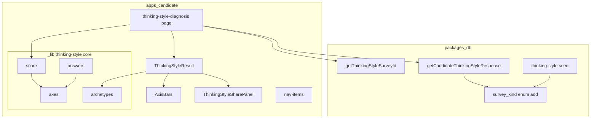
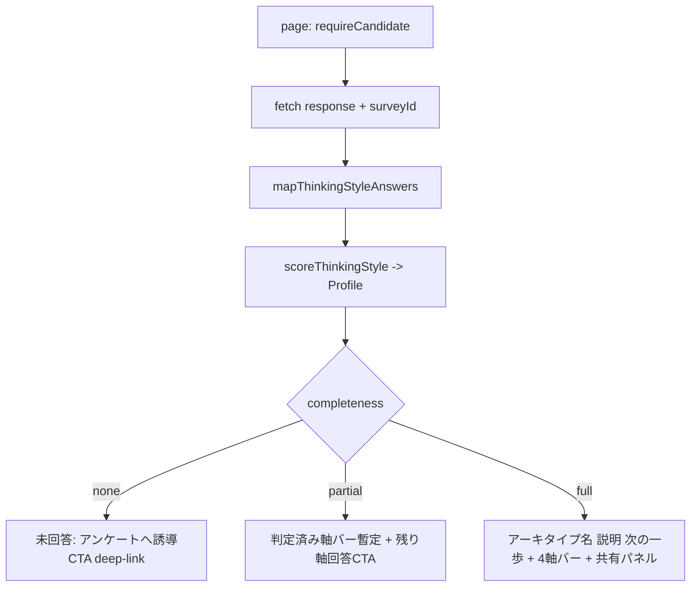
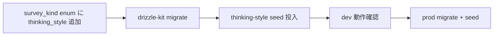

# Design Document — thinking-style-diagnosis

## Overview

**思考スタイル診断** は、Webエンジニア候補者が「どう考える・学ぶか」を4軸で自己診断し、16タイプのアーキタイプの1つとして結果を受け取る独立診断機能である。診断ファミリーの2つ目の原子診断であり、`playstyle-diagnosis`（PR #40 マージ済）で確立した骨格「サーベイ→決定論スコアリング（純関数・ライブ算出）→結果型→結果ビュー（軸バー＋アーキタイプカード＋共有）」を**加算的に複製**して構築する。

**Users**: 認証済み候補者が、気質（どう働くか）とは直交する「思考の向き」を自己認識するために利用する。

**Impact**: 既存機能の動作は一切変えない。新規ルート `/thinking-style-diagnosis`、新規アンケート種別 `kind='thinking_style'`、新規 seed を**追加のみ**で導入する。マージ済みの playstyle・RPGクラス診断コードは改修しない。

### Goals

- 思考スタイルを 4軸×2極＝16タイプ で決定論導出し、独立した結果体験（アーキタイプ・4軸可視化・共有）を提供する。
- playstyle と同型の構造で実装し、将来（別 spec）の共通基盤抽出の2実例目を揃える。
- 既存の playstyle・RPGクラス診断・スキルアンケート基盤の動作を変えない。

### Non-Goals

- 思考スタイル診断結果の DB永続化・履歴・版間比較（別 spec）。
- 診断ファミリー共通ハブ／共有コアの抽出・汎用化（2実例が揃った後に別 spec）。
- 実測テスト型（正誤問題）の地頭診断。
- RPGクラス診断への思考スタイルの給餌（合成診断側の拡張）。

## Boundary Commitments

### This Spec Owns

- 思考スタイルの 4軸×2極＝16タイプ 定義（軸・極・アーキタイプ）と、軸×極から決定論導出するライブ算出ロジック。
- 独立した思考スタイル診断の結果画面（none/partial/full 分岐・4軸バー・キュレーテッド説明・共有パネル）と専用ページ `/thinking-style-diagnosis`。
- 思考スタイルアンケート（`kind='thinking_style'`）の seed と、その回答取得・survey id 解決 query。
- `survey_kind` enum への `'thinking_style'` 値追加 migration。
- 思考スタイル回答へ直行する deep-link 導線とナビ入口。

### Out of Boundary

- 思考スタイル結果の永続化・履歴・版比較。
- playstyle / RPGクラス診断コードの改修（気質判定・クラス生成・保存フロー）。
- 共有コア（score/axis-bars 等）の抽出・汎用化。
- 既存スキルアンケート基盤（回答保存・提出・フォーム UI）の変更。

### Allowed Dependencies

- 既存スキルアンケート基盤（`skillSurvey`/`skillSurveyResponse` スキーマ、`getLatestSurveyResponseForAnalysis`、`/skill-survey/[surveyId]` フォーム、seed runner `runSkillSurveySeed`）を**利用のみ**。
- 認証ヘルパー `requireCandidate()`。
- 依存方向 types→db→ai→apps を厳守（本 spec は db query と app に閉じ、`@bulr/types`・`@bulr/ai` は変更しない）。

### Revalidation Triggers

- 既存スキルアンケート基盤の回答スキーマ／`getLatestSurveyResponseForAnalysis` の契約変更。
- `survey_kind` enum の再定義。
- 一覧除外フィルタ（`answered-surveys-query.ts`）の包含条件変更（現在 `kind='skill'` 包含 → 変えると thinking_style が一覧に漏出しうる）。

## Architecture

### Existing Architecture Analysis

playstyle-diagnosis は次の層構成で実装されている（research.md 参照）: `@bulr/types` に気質型 → `apps/candidate/app/_lib/temperament/` に純関数コア → `playstyle-diagnosis/` に Server Component + 表示 → `packages/db` に survey id/回答 query → `packages/db/seeds` に seed。RPGクラス診断（`packages/ai` + `class-diagnosis/`）が気質判定を共有消費している点が、thinking-style との**唯一の構造的差**である。

本 spec は同型を踏襲しつつ、以下2点を**意図的に改善（逸脱）**する:

1. **型を app ローカルに置く**: thinking-style はクロスパッケージ消費者を持たない（クラス診断・ai が消費しない）。消費者ゼロの型を共有 `@bulr/types` に足すのは依存方向のアンチパターンのため、型は `apps/candidate/app/_lib/thinking-style/` に閉じる。
2. **legacy 互換を持たない**: 新規診断で旧レコードが存在しないため、playstyle の legacy 正規化に相当するものを作らない。

### Architecture Pattern & Boundary Map



**選定パターン**: playstyle と同一の「純関数コア＋Server Component ライブ算出＋DB永続化なし」。**新コンポーネント根拠**: 各ファイルは playstyle 対応物の思考スタイル版（自己完結・非改修加算）。**Steering 準拠**: 依存方向単方向、数値スコア非表示、決定論、apps→packages 単方向依存。

### Technology Stack

| Layer | Choice / Version | Role in Feature | Notes |
| --- | --- | --- | --- |
| Frontend | Next.js 16 App Router / React Server Components | 専用ページ・結果表示・共有 | 既存スタック踏襲。新ライブラリなし |
| Data / Storage | Postgres + drizzle（`survey_kind` enum 拡張） | アンケート種別・回答参照 | ALTER TYPE ADD VALUE の migration 1本 |
| Seed | 既存 `runSkillSurveySeed` | 思考スタイルアンケート投入 | 冪等 upsert |

## File Structure Plan

### New Files

```
apps/candidate/app/_lib/thinking-style/     # 思考スタイル判定コア（app ローカル・自己完結）
├── axes.ts        # ThinkingStyleAxis(4)/Pole/Code/Completeness/Summary 型 + AXES/AXIS_LABELS/POLE_LABELS/AXIS_POLES/MIDPOINT(=50)
├── archetypes.ts  # Archetype 型 + THINKING_STYLE_ARCHETYPES: Record<Code,{name,shortLabel,description,nextStep}>（16・キュレーテッド）
├── score.ts       # AxisReading/Profile/Answer 型 + scoreThinkingStyle(answers)->Profile / deriveCode / toSummary
└── answers.ts     # THINKING_STYLE_CATEGORY_AXIS（seed カテゴリ名->軸）+ THINKING_STYLE_MAX_LEVEL(=4) + mapThinkingStyleAnswers(response)->Answer[]

apps/candidate/app/thinking-style-diagnosis/
├── page.tsx                          # Server Component: requireCandidate->fetch(response+surveyId)->score->deep-link->render
└── _components/
    ├── thinking-style-result.tsx     # 結果プレゼン（none/partial/full 分岐）
    ├── axis-bars.tsx                 # 4軸バイポーラバー（数値非表示）
    └── thinking-style-share-panel.tsx # 'use client'。toThinkingStyleShareText + コピー/Web Share（PII非含）

packages/db/src/queries/thinking-style/
├── get-thinking-style-survey-id.ts   # getThinkingStyleSurveyId(): kind='thinking_style' survey の id or null
├── candidate-thinking-style-response.ts # getCandidateThinkingStyleResponse(candidateProfileId): SurveyResponseForAnalysis|null
└── index.ts                          # バレル

packages/db/src/seeds/skill-surveys/thinking-style.ts  # thinkingStyleSurveySeed（kind/jobType='thinking_style'、4カテゴリ×6問）
```

### Modified Files

- `packages/db/src/schema/skill-survey.ts` — `surveyKind` pgEnum に `'thinking_style'` 追加。
- `packages/db/drizzle/NNNN_*.sql`（新規 migration）— `ALTER TYPE survey_kind ADD VALUE 'thinking_style'`（drizzle-kit 生成）。
- `packages/db/src/queries/index.ts`（または該当バレル）— `queries/thinking-style` を re-export。
- `packages/db/src/seeds/index.ts` — `runThinkingStyleSkillSurveySeed` を登録し `main()` で呼ぶ。
- `apps/candidate/app/_components/nav-items.ts` — `/thinking-style-diagnosis`（思考スタイル診断）を追加。

**非改修（重要）**: `answered-surveys-query.ts` は変更しない。既存フィルタ `eq(kind,'skill')` が包含型のため `thinking_style` は自動除外される（R5.5）。除外は integration test で担保する。playstyle・class-diagnosis・`@bulr/types`・`@bulr/ai` は一切触らない。

## System Flows

### 状態導出（充足度）と表示



- **deep-link**: `getThinkingStyleSurveyId()` が返す id で `href = surveyId ? /skill-survey/${surveyId} : /skill-survey`。none/partial のCTA先。
- **中点拮抗（R3.4）**: 軸スコアが midpoint(50) ちょうどのとき既定極を採用し `balanced=true` を結果に反映。
- **再訪最新化（R3.5）**: 永続化なし＝毎回ライブ算出のため、更新後回答が自動反映。

## Requirements Traceability

| Req | Summary | Components | Interfaces/Contracts |
| --- | --- | --- | --- |
| 1.1–1.6 | 16タイプ4軸決定論モデル・気質軸と別個 | axes.ts, score.ts, archetypes.ts | `scoreThinkingStyle`/`deriveCode`/`THINKING_STYLE_ARCHETYPES` |
| 2.1–2.5 | 結果表示（アーキタイプ/4軸/数値非表示/キュレーテッド/専用ページ） | thinking-style-result.tsx, axis-bars.tsx, page.tsx | `ThinkingStyleResultProps`, `AxisBarsProps` |
| 3.1–3.5 | 充足度に応じた導出/誘導・中点拮抗・再訪最新化 | score.ts(completeness), thinking-style-result.tsx | `Profile.completeness`, none/partial/full 分岐 |
| 4.1–4.3 | 共有（アーキタイプ名のみ/PII非含/保存不要） | thinking-style-share-panel.tsx | `toThinkingStyleShareText(archetype)` |
| 5.1–5.5 | 4軸アンケート・軸対応・向き一貫性・冪等・一覧分離 | thinking-style.ts(seed), THINKING_STYLE_CATEGORY_AXIS | seed 構造 + 既存除外フィルタ（非改修） |
| 6.1–6.3 | deep-link CTA・ナビ入口・本人スコープ | page.tsx, nav-items.ts, queries | `getThinkingStyleSurveyId`, `requireCandidate` |

## Components and Interfaces

| Component | Layer | Intent | Req | Contracts |
| --- | --- | --- | --- | --- |
| thinking-style core | app _lib | 軸定義・スコアリング・アーキタイプ・回答マッピング（純関数） | 1, 3, 5 | State(型) |
| page.tsx | app route | auth→fetch→score→deep-link→render | 2, 3, 6 | — |
| ThinkingStyleResult | app UI | 充足度分岐プレゼン | 2, 3 | State(props) |
| AxisBars | app UI | 4軸バイポーラ可視化（数値非表示） | 2 | State(props) |
| ThinkingStyleSharePanel | app UI | 共有テキスト生成・コピー/Share | 4 | State(props) |
| DB queries | db | survey id 解決・本人回答取得 | 5, 6 | Service |
| seed | db | 思考スタイルアンケート投入 | 5 | Batch |

### app core（`_lib/thinking-style/`）

**軸とコード（axes.ts）**

- `ThinkingStyleAxis = 'abstractConcrete' | 'logicIntuition' | 'convergentDivergent' | 'theoryPractice'`
- 極（各軸 low=第1極 / high=第2極）:
  - `abstractConcrete`: `abstract` ⇔ `concrete`
  - `logicIntuition`: `logic` ⇔ `intuition`
  - `convergentDivergent`: `convergent` ⇔ `divergent`
  - `theoryPractice`: `theory` ⇔ `practice`
- `ThinkingStylePole` = 上記8極の union。
- `ThinkingStyleCode = ` `` `${AbstractPole}-${LogicPole}-${ConvergePole}-${TheoryPole}` `` （canonical order、16通り）。
- `AXES`（canonical order 配列）、`AXIS_LABELS: Record<Axis,{first,second,title}>`、`POLE_LABELS: Record<Pole,string>`、`AXIS_POLES: Record<Axis,{low,high}>`、`THINKING_STYLE_MIDPOINT = 50`。
- `ThinkingStyleCompleteness = 'none' | 'partial' | 'full'`、`ThinkingStyleSummary = { poles: Partial<Record<Axis,Pole>>; balancedAxes: Axis[]; code: Code | null; completeness }`。

**スコアリング（score.ts）** — Contracts: State

```typescript
interface AxisReading { score: number; pole: ThinkingStylePole; determined: boolean; balanced: boolean }
interface ThinkingStyleProfile { axes: Record<ThinkingStyleAxis, AxisReading>; completeness: ThinkingStyleCompleteness; code: ThinkingStyleCode | null }
interface ThinkingStyleAnswer { axis: ThinkingStyleAxis; level: number; reverse: boolean; maxLevel: number }

function scoreThinkingStyle(answers: ThinkingStyleAnswer[]): ThinkingStyleProfile
function deriveCode(poles: Record<ThinkingStyleAxis, ThinkingStylePole>): ThinkingStyleCode
function toSummary(profile: ThinkingStyleProfile): ThinkingStyleSummary
```

- Preconditions: `answers` は0件以上。reverse は向きを吸収済みでなく、`scoreThinkingStyle` 内で `reverse ? (maxLevel - level) : level` により正規化。
- Postconditions: 各軸 score を 0..100 に clamp、`>50`→high極 / `<50`→low極 / `=50`→既定極(low)かつ `balanced=true`。判定軸数 0/1–3/4 → completeness none/partial/full。full 時のみ `code` 非null。
- Invariants: 同一 answers → 同一 Profile（決定論・LLM非依存）。`deriveCode` は AXES 順連結。

**回答マッピング（answers.ts）**

```typescript
const THINKING_STYLE_CATEGORY_AXIS: Record<string, ThinkingStyleAxis>  // seed カテゴリ名 -> 軸
const THINKING_STYLE_MAX_LEVEL = 4
function mapThinkingStyleAnswers(response: SurveyResponseForAnalysis | null): ThinkingStyleAnswer[]
```

- `THINKING_STYLE_CATEGORY_AXIS` = `{ '抽象と具体': 'abstractConcrete', '論理と直感': 'logicIntuition', '収束と発散': 'convergentDivergent', '理論と実践': 'theoryPractice' }`。
- `mapThinkingStyleAnswers`: response のカテゴリを軸へ写像、選択肢 `level` を抽出し `{ axis, level, reverse, maxLevel: 4 }` を emit。reverse 判定は seed 側メタ（設問の逆転フラグ）に対応（playstyle と同契約）。

**アーキタイプ（archetypes.ts）**

```typescript
interface Archetype { name: string; shortLabel: string; description: string; nextStep: string }
const THINKING_STYLE_ARCHETYPES: Record<ThinkingStyleCode, Archetype>  // 16・コンパイル時完備
```

- 16の `name`/`description`/`nextStep` は決定論キュレーテッド手書き（LLM不使用）。

### db（`queries/thinking-style/`）— Contracts: Service

```typescript
function getThinkingStyleSurveyId(): Promise<string | null>              // kind='thinking_style' survey id
function getCandidateThinkingStyleResponse(candidateProfileId: string): Promise<SurveyResponseForAnalysis | null>
```

- `getThinkingStyleSurveyId`: `skillSurvey` を `eq(kind, 'thinking_style')` で1件 SELECT（seed は1件のみ投入）。
- `getCandidateThinkingStyleResponse`: 上記 survey を特定し `getLatestSurveyResponseForAnalysis(candidateProfileId, surveyId)` を委譲。**本人スコープ限定**（R6.3）。

### UI（Summary-only + Implementation Note）

- **ThinkingStyleResult**（`{ profile: ThinkingStyleProfile; thinkingStyleSurveyHref: string }`）: completeness で none/partial/full を分岐。full は `THINKING_STYLE_ARCHETYPES[profile.code]` の name/description/nextStep + `AxisBars` + `ThinkingStyleSharePanel`。数値非表示（R2.3）。
- **AxisBars**（`{ axes: Record<ThinkingStyleAxis, AxisReading> }`）: AXES 順に4本のバイポーラトラック。determined はマーカー位置のみ（数値ラベルなし）、未判定はグレー＋「未回答」。
- **ThinkingStyleSharePanel**（`{ archetype: Archetype }`, `'use client'`）: `toThinkingStyleShareText(archetype)` を preview、clipboard コピー＋Web Share フォールバック。PII・スコア・code・数値を含めない（R4.2）。

**Implementation Note**: 3 UI とも playstyle 対応物の思考スタイル版。挙動契約は同一、固有語（気質→思考スタイル）と軸/アーキタイプ内容のみ差し替え。

## Data Models

### 型（app ローカル）

`@bulr/types` は変更しない。上記 `_lib/thinking-style/{axes,score}.ts` に型を定義（クロスパッケージ消費者なし）。legacy 型は作らない。

### seed（`seeds/skill-surveys/thinking-style.ts`）

```
thinkingStyleSurveySeed: SkillSurveySeedData = {
  jobType: 'thinking_style', kind: 'thinking_style', title: '思考スタイル診断',
  categories: [
    { name:'抽象と具体', subcategory:'思考スタイル', displayOrder:0, questions:[ natural×3, reverse×3 ] },
    { name:'論理と直感', ... }, { name:'収束と発散', ... }, { name:'理論と実践', ... },
  ],
}
```

- 各設問 `scoringKind='polarity'`（既存 enum 値・新規追加不要）、選択肢 `level` 0..4、`maxLevel=4`。
- **向き契約（R5.3）**: 保存 `level` = 第2極（具体／直感／発散／実践先行）寄りの強さ。natural は「強くそう思う→level4」、reverse は逆転して「強くそう思う→level0」。
- `subcategory` は非null必須（`'思考スタイル'`）。`runSkillSurveySeed(db, thinkingStyleSurveySeed, { logLabel:'thinking-style' })` で `onConflictDoUpdate(jobType)` 冪等（R5.4）。

### enum migration

`survey_kind` に `'thinking_style'` を追加（`ALTER TYPE ... ADD VALUE`）。drizzle-kit generate で1本生成。マージ時の番号衝突は既存運用（振り直し）で解消。

## Error Handling

- **未認証**: `requireCandidate()` が sign-in へリダイレクト（既存挙動）。
- **survey 未 seed / 未回答**: `getThinkingStyleSurveyId()`→null または response→null のとき、page は completeness=none として誘導CTAを表示（エラーにしない、graceful degradation）。
- **code 欠落**: partial/none 時 `profile.code` は null。Result は full 分岐に入らずアーキタイプ参照を行わない（型で保証）。
- **共有 API 不在**: clipboard/Web Share 不可環境は no-op で劣化（例外を投げない）。

## Testing Strategy

### Unit（co-located `.test.ts(x)`・DB不要）

- `score.test.ts`: reverse 正規化、midpoint 既定極＋balanced、completeness none/partial/full 境界、`deriveCode` の AXES 順連結・16 code 決定論（1.2,1.4,3.4）。
- `archetypes.test.ts`: `THINKING_STYLE_ARCHETYPES` が16 code 完備・name 一意（1.3）。
- `answers.test.ts`: カテゴリ→軸写像、level/reverse/maxLevel 抽出（5.2,5.3）。
- `axis-bars.test.tsx`: determined/未判定の描画・数値ラベル非表示（2.2,2.3）。
- `thinking-style-result.test.tsx`: none/partial/full 分岐の表示要素（2.1,3.1–3.3）。
- `thinking-style-share-panel.test.tsx`: `toThinkingStyleShareText` が PII/数値/code を含まない（4.1,4.2）。

### Integration（`packages/db/src/__tests__/*.integration.test.ts`・fileParallelism:false・inline env）

- `thinking-style-survey.integration.test.ts`: seed 後 `kind/jobType='thinking_style'` が1件・期待 title・subcategory 非null・4カテゴリ×6問（5.1,5.4）。
- `get-thinking-style-survey-id.integration.test.ts`: 解決 id が直接 SELECT と一致、未seed時 null（6.1）。
- `candidate-thinking-style-response.integration.test.ts`: 本人回答の取得・他者スコープ非取得（6.3）。
- `thinking-style-list-exclusion.integration.test.ts`: `thinking_style` が `getAnsweredSurveysForCandidate` の一覧に含まれない（既存フィルタで自動除外を担保、5.5）。

### E2E/UI（jsdom, `@bulr/candidate test`）

- `/thinking-style-diagnosis` の none/partial/full レンダリング、4軸バー、共有パネル、deep-link href（2,3,6）。

## Migration Strategy



- enum 追加は後方互換（既存値不変）。ロールバックは新規ルート/seed 未使用化で無害。

## Implementation Order（依存の波及順）

1. app core（`_lib/thinking-style/` axes→score→answers→archetypes）＋ unit test（DB非依存・並行可）。
2. schema enum 追加＋migration。
3. seed（`thinking-style.ts`）＋barrel 登録。
4. db queries（get-survey-id / response）＋barrel＋integration test。
5. UI（axis-bars→result→share）＋page＋nav＋UI test。
6. 一覧除外の integration test（非改修の確認）。

## Open Questions / Risks

- **16アーキタイプ命名**: 手書きキュレーテッドのため実装時に16名称・説明・次の一歩を確定（設計外の文言作業）。playstyle の命名トーンに揃える。
- **軸④「理論⇔実践」設問の校正**: 学習の向きを測る設問が思考の他3軸と相関しすぎないよう、seed 設問文で独立性を担保（実装時レビュー観点）。
- **複製の技術的負債**: score/axis-bars の2系統重複は既知。抽出は Out of Boundary（別 spec）。
