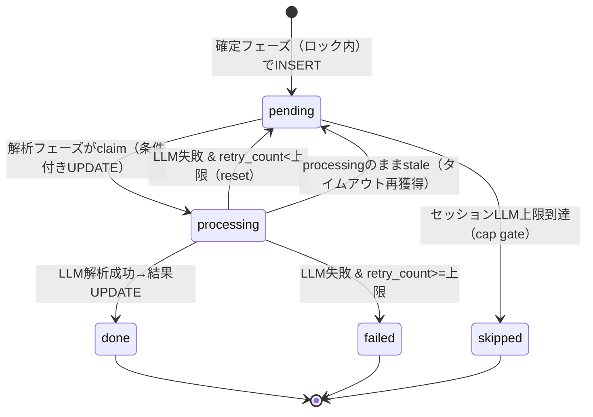
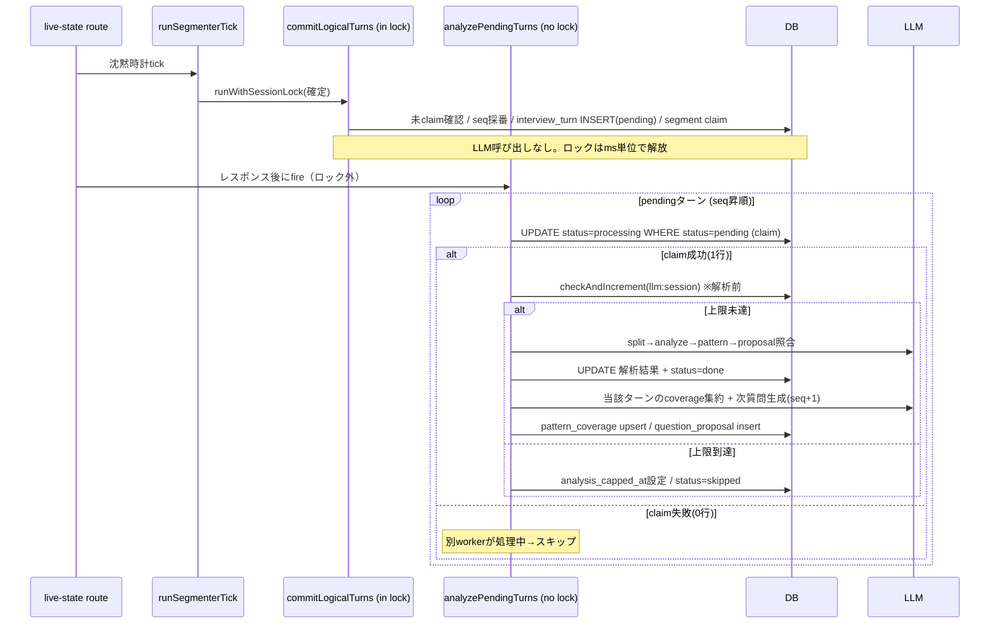
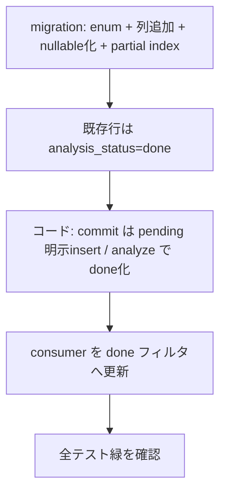

# Design Document

## Overview

**Purpose**: ライブ面接キャプチャの `TurnPipeline` を「ターン確定（トランザクショナル・高速・冪等）」と「LLM 解析編成（トランザクション境界外・at-least-once・ターン単位のエラー隔離）」に分離し、コネクションプール枯渇・無限リトライ/コスト保護失効・解析コンテキスト欠落を解消する。

**Users**: 面接官（ライブ画面の応答性）と運用者（コスト・信頼性）が恩恵を受ける。外部から観測可能な振る舞い（ライブ画面のレスポンス契約、レポート内容、冪等性）は不変に保つ。

**Impact**: 現在 `processTurn`（約460行）が `pg_advisory_xact_lock` の tx 内で 1 ターンあたり最大 5 回の LLM 呼び出しを行っている構造を、`interview_turn` に解析状態列を持たせた 2 フェーズ（確定フェーズ = ロック内・LLM なし / 解析フェーズ = ロック外・at-least-once）に再構成する。

### Goals

- LLM 呼び出しを advisory lock と転写取り込みのクリティカルパスから外す（Req 1）。
- ターン単位のエラー隔離と再試行上限で、無限リトライとコスト保護失効を止める（Req 2, 3, 4）。
- 解析フェーズを確定済み（コミット済み）ターンに対して行うことで、先行ターンを後続ターンの解析コンテキストに反映する（Req 5）。
- 冪等性（`turn_fingerprint`、`pattern_coverage` upsert、並行 claim）とライブ画面レスポンス契約を維持する（Req 6, 7）。

### Non-Goals

- LLM プロンプト内容の変更（Req 9.3）。
- キャプチャ状態機械 `capture_status` の遷移変更（Req 9.1）。
- ターン分割ロジック `evaluate` の入出力変更（Req 9.2）。
- ライブ状態 API のクライアント向けレスポンス契約の変更（Req 7.2）。

## Boundary Commitments

### This Spec Owns

- `interview_turn` の解析状態（`analysis_status` / `analysis_retry_count` / `analysis_started_at`）とそのライフサイクル。
- ターン確定フェーズ（segment claim + `interview_turn` の pending insert + `sequence_no` 採番）のトランザクション境界。
- LLM 解析編成フェーズ（話者分離 / ターン分析 / パターン解決 / 質問候補照合 / カバレッジ集約 / 次質問生成）のロック外・at-least-once 実行と並行 claim。
- セッション単位 LLM 上限カウントの計上タイミング（解析前）と再試行時の非巻き戻し。

### Out of Boundary

- LLM の出力内容・プロンプト・評価ロジックそのもの（`@bulr/ai` の解析関数の内部は変更しない）。
- `capture_status` 状態機械、`evaluate`、転写取り込み経路（recall webhook / chunks route）の受理ロジック。
- ライブ画面のクライアントコンポーネント（レスポンス契約を維持するため変更しない）。

### Allowed Dependencies

- `@bulr/db`（`interview_turn` スキーマ + drizzle マイグレーション）。
- `@bulr/ai`（`splitInterviewerCandidate` / `analyzeTurn` / `aggregatePatternCoverage` / `proposeNextQuestions`。呼び出し方のみ変更、内部は不変）。
- `@bulr/lib` の rate-limit（`checkAndIncrement` を executor 注入で tx/非tx 双方から使用）。
- `segmenter.ts` の `runWithSessionLock` / `evaluate`（確定フェーズのみで使用）。

### Revalidation Triggers

- `interview_turn` の解析フィールドを NOT NULL 前提で読む consumer（レポート / 一覧 / 履歴 / heatmap）は、pending ターンの存在を考慮する必要が生じる → 下記 Modified Files の consumer は再検証対象。
- ライブ状態 API のレスポンス形状を変える場合はクライアント再検証が必要（本設計では変えない）。
- 元スペック `realtime-interview-capture` の冪等性契約（`turn_fingerprint`、`pattern_coverage` upsert）に依存する箇所。

## Architecture

### Existing Architecture Analysis

- `runWithSessionLock(sessionId, fn)`（`segmenter.ts`）が `pg_advisory_xact_lock` を取得した tx を提供。tick（live-state route 経由）・webhook segment insert・chunks route が同一ロックキーを共有。
- `writeBackLogicalTurns` → `processTurn` が同一 tx 内で: ①未claim確認 → ②duration → ③**LLM 話者分離** → ④**LLM ターン分析** → ⑤パターン解決 → ⑥質問候補照合 → ⑦`interview_turn` INSERT → ⑧segment claim → ⑨rate-limit increment → ⑩**LLM カバレッジ集約** → ⑪**LLM 次質問生成**、を実行。
- **FK 制約**: `transcript_segment.logical_turn_id → interview_turn.id` により、segment claim の前に `interview_turn` の行が存在する必要がある（現行は analysis 後に INSERT するため LLM がクリティカルパスに入る）。
- `interview_turn` の `llm_analysis` / `pattern_match_confidence` / `question_source` / `question_text` は現在 NOT NULL かつ LLM 由来。

### 採用アーキテクチャ: 解析状態機械による 2 フェーズ分離（Approach A）

`interview_turn` を「pending で先に確定 → 後段で解析結果を UPDATE」する staged-fill 方式を採用する。segment claim の FK 先（`interview_turn.id`）を確定フェーズで即座に用意できるため、**新テーブルも FK 付け替えも不要**。LLM 由来列を nullable 化し、`analysis_status` で解析ライフサイクルを管理する。

代替案（B: segment claim 先を新 `logical_turn` staging テーブルへ付け替え、`interview_turn` は解析後にのみ INSERT）は consumer 変更を避けられる利点があるが、新テーブル + FK 付け替え + claim セマンティクス変更というスキーマ churn が大きいため見送る（`research.md` に比較を記録）。



**確定フェーズ（ロック内・LLM なし・高速）**: `evaluate` の確定ターンごとに、未claim確認 → `sequence_no = MAX+1` 採番 → `interview_turn` を `analysis_status='pending'` + 生 transcript（`{interviewer:'', candidate:'', raw}`）+ 構造フィールド（duration / fingerprint）で INSERT（`onConflictDoNothing`）→ segment claim（`logical_turn_id = turnId`）。ロック保持時間はミリ秒オーダーに短縮。

**解析フェーズ（ロック外・at-least-once・ターン単位隔離）**: pending ターンを `sequence_no` **厳密昇順**で取得し、各ターンを `pending→processing` の条件付き UPDATE で claim（並行 tick の二重処理を防ぐ）。cap gate（`checkAndIncrement` を解析前に実行）→ 話者分離 → ターン分析 → パターン解決 → 質問候補照合 → 行を `done` に UPDATE → **当該ターン単位で**カバレッジ集約（Prepare-1a/1b）+ 次質問生成（`prepared_for_turn_no = sequence_no+1`）を実行する。**per-turn の cadence と採番は現行を維持する**（tx 分離の目的はロック外へ出すことであり、per-turn を batch 化することではない = Issue 2 対応）。失敗はターン単位で捕捉し retry_count を増やして `pending`（上限到達で `failed`）へ。

### Technology Stack

| Layer | Choice / Version | Role in Feature | Notes |
| --- | --- | --- | --- |
| Backend / Services | Next.js 16 Route Handler (nodejs) | tick / finalize が解析フェーズを起動 | 新規ランタイム依存なし |
| Data / Storage | PostgreSQL + drizzle-orm 0.45 | `interview_turn` に状態列追加 + LLM 列 nullable 化 | drizzle-kit migration 1 本 |
| Concurrency | pg_advisory_xact_lock（確定のみ）+ 行レベル条件付き UPDATE（解析 claim） | 確定は直列化、解析は行単位 at-most-once | ロック内から LLM を排除 |

## File Structure Plan

### 新規ファイル

```
apps/business/lib/capture/
├── turn-commit.ts        # 確定フェーズ: commitLogicalTurns（ロック内・LLMなし・segment claim + pending insert）
└── turn-analysis.ts      # 解析フェーズ: analyzePendingTurns（ロック外・claim + LLM編成 + retry/cap）
```

> `turn-pipeline.ts` の `processTurn` を上記 2 モジュールへ分解する。共有ヘルパ（sequence 採番、fingerprint、話者テキスト解決）は必要に応じて `turn-pipeline.ts` に残すか小さな内部モジュールに切り出す。

### Modified Files

- `apps/business/lib/capture/turn-pipeline.ts` — `processTurn` を確定/解析へ分解し、`writeBackLogicalTurns` は確定フェーズ（`commitLogicalTurns`）に委譲。rate-limit increment を解析フェーズの解析前へ移動。
- `apps/business/lib/capture/segmenter-tick.ts` — tick の consumer を「確定のみ」に変更。解析フェーズはロック外で別途起動する経路を追加。
- `apps/business/app/api/interview/sessions/[sessionId]/live-state/route.ts` — レスポンス構築後、`runSegmenterTick`（確定）に続けて `analyzePendingTurns`（解析・ロック外）を fire する。
- `apps/business/lib/capture/finalize-session.ts` — セグメント flush（確定）→ `analyzePendingTurns`（未解析ターンの解析）→ 既存の未カバレッジ再集約（現行ステップ⑤）→ レポート生成、の順を保証する。これにより解析フェーズで遅延・失敗した兄弟ターンの coverage が最終化前に収束する（Req 8, Issue 3 対応）。
- `packages/db/src/schema/interview-turn.ts` — `turn_analysis_status` enum 追加、`analysis_status`/`analysis_retry_count`/`analysis_started_at` 列追加、`llm_analysis`/`pattern_match_confidence`/`question_source`/`question_text` を nullable 化。
- `packages/db/drizzle/NNNN_*.sql` — 上記のマイグレーション + 既存行を `analysis_status='done'` へ backfill。
- `packages/lib/src/rate-limit.ts` — `checkAndIncrement(key, opts, executor = db)` へ executor 引数を追加（tx 外実行に対応、turn-pipeline の SQL 複製を解消）。
- **pending ターン耐性（解析フィールド null 許容）が必要な consumer**:
  - `apps/business/lib/capture/live-state.ts` — coverage 分類は `analysis_status='done'` の turn の `pattern_id` のみ対象。
  - `apps/business/lib/queries/get-report-data.ts` / `packages/db/src/queries/interview/load-session-with-turns.ts` / `load-recent-turns.ts` — 解析済みターンのみ集計・履歴対象にする。
  - `packages/ai/src/lib/aggregate-heatmap.ts`、`packages/db/src/queries/admin/session-detail-query.ts` / `session-list-query.ts`、`apps/business/lib/interview/turns-next-events.ts`、`app/api/interview/turns/next/route.ts`、`proposal/regenerate/route.ts` — 解析フィールド null の可能性を考慮（done ターンで判定）。

## System Flows

### 確定フェーズ（ロック内）と解析フェーズ（ロック外）



- **並行安全性**: 確定は advisory lock で直列化。解析は行レベルの条件付き UPDATE（`WHERE analysis_status='pending' RETURNING`）で at-most-once。`processing` のまま stale（worker クラッシュ）になった行は `analysis_started_at` がしきい値より古ければ再獲得可能とする。
- **cap gate**: `checkAndIncrement` を解析の直前に実行し、失敗しても計上は残る（Req 3.2）。上限到達で当該ターンを `skipped`（終端）にし、以降の LLM を行わない（Req 3.3, 4.5）。
- **エラー隔離**: 各ターンの LLM を try/catch。失敗で `retry_count++`、上限未満は `pending` に戻し、上限到達で `failed`（終端）。他ターン・確定行はロールバックしない（Req 2）。

## Requirements Traceability

| Requirement | Summary | Components | Flows |
| --- | --- | --- | --- |
| 1.1, 1.2, 1.3 | 転写取り込み非ブロッキング | commitLogicalTurns（LLM をロック外へ） | 確定フェーズ |
| 2.1, 2.2, 2.3 | 障害隔離 | analyzePendingTurns（ターン単位 try/catch） | 解析フェーズ |
| 3.1, 3.2, 3.3 | コスト上限実効性 | checkAndIncrement（解析前・非巻き戻し）+ cap gate | cap gate |
| 4.1, 4.2, 4.3 | ポイズンターン停止 | analysis_retry_count + failed 終端 | 状態機械 |
| 5.1, 5.2 | 解析コンテキスト正確性 | loadRecentTurns（コミット済み done ターンを参照） | 解析フェーズ |
| 6.1, 6.2, 6.3 | 冪等性 | turn_fingerprint + processing claim | 状態機械 / claim |
| 7.1, 7.2 | ライブ画面無回帰 | live-state.ts（done ターンで coverage 判定） | — |
| 8.1, 8.2 | 最終化時解析保証 | finalize-session → analyzePendingTurns | finalize |
| 9.1–9.4 | 後方互換 | 状態機械/evaluate/prompt 不変 + 既存テスト追随 | — |

## Components and Interfaces

| Component | Layer | Intent | Req | Contracts |
| --- | --- | --- | --- | --- |
| commitLogicalTurns | capture/確定 | ロック内で pending ターン確定 + segment claim | 1, 6.1 | Service |
| analyzePendingTurns | capture/解析 | ロック外で pending ターンを claim して LLM 編成 | 2,3,4,5,6.2,6.3,8 | Service, Batch |
| interview_turn（拡張） | db | 解析状態を持つターン行 | all | State |
| checkAndIncrement（拡張） | lib | executor 注入で tx 外計上 | 3 | Service |

### capture / 確定

#### commitLogicalTurns

| Field | Detail |
| --- | --- |
| Intent | 確定ターンをロック内で `interview_turn`(pending) として INSERT し segment を claim する |
| Requirements | 1.1, 1.2, 6.1 |

**Responsibilities & Constraints**

- `runWithSessionLock` の tx 内で実行。LLM 呼び出しを含めない。
- 未claim確認 → `sequence_no = MAX+1` → INSERT(`analysis_status='pending'`, 生 transcript, duration, fingerprint) → segment claim。
- 冪等: `(session_id, turn_fingerprint)` 一意制約 + `onConflictDoNothing`。既 claim 済みは放棄。

##### Service Interface

```typescript
export function commitLogicalTurns(
  turns: LogicalTurn[],
  tx: DrizzleTransaction,
  sessionId: string,
): Promise<void>;
```

- Preconditions: `tx` は当該セッションの advisory lock 取得済み。
- Postconditions: 各確定ターンが `pending` で存在し、対応 segment が claim 済み。
- Invariants: LLM 呼び出しゼロ。ロック保持は DB 書き込みのみ。

### capture / 解析

#### analyzePendingTurns

| Field | Detail |
| --- | --- |
| Intent | ロック外で pending ターンを claim し、LLM 編成を at-least-once・ターン単位隔離で実行する |
| Requirements | 2.1–2.3, 3.1–3.3, 4.1–4.3, 5.1–5.2, 6.2–6.3, 8.1 |

**Responsibilities & Constraints**

- advisory lock を取得しない。`pending`（+ stale `processing`）ターンを `sequence_no` **厳密昇順**で処理。
- 各ターン: 条件付き UPDATE で `processing` claim → cap gate（解析前 increment）→ split/analyze/pattern/proposal照合 → `done` へ UPDATE → **当該ターン単位で**カバレッジ集約（Prepare-1a/1b）+ 次質問生成（`prepared_for_turn_no = sequence_no+1`）を実行（per-turn cadence 維持 = Issue 2 対応）。
- 失敗はターン単位で捕捉し `retry_count++`、上限で `failed`。他ターンに波及させない。
- **順序不整合の防止（Issue 3 対応）**: 昇順処理により先行ターンを先に `done` 化する。`failed`（終端）ターンは Prepare-1a の遷移検知において「解析不能な境界」として扱い、後続ターンの集約・採番を妨げない。遅延・失敗ターンの取りこぼしは `finalize-session` の未カバレッジ再集約が最終的に収束させる（下記）。

##### Batch / Job Contract

- Trigger: live-state tick（レスポンス後・fire-and-forget 相当、ただし完了保証は次 tick が担保）/ finalize-session。
- Idempotency & recovery: `processing` claim で at-most-once。stale `processing` は `analysis_started_at` タイムアウトで再獲得。cap/retry 上限で終端化し無限ループを防止。

##### Service Interface

```typescript
export function analyzePendingTurns(sessionId: string): Promise<{
  analyzed: number;
  failed: number;
  skippedByCap: number;
}>;
```

## Data Models

### Physical Data Model（interview_turn 変更）

新 enum + 列追加、LLM 由来 4 列を nullable 化。

```sql
CREATE TYPE turn_analysis_status AS ENUM ('pending','processing','done','failed','skipped');

-- LLM 由来列を nullable 化（pending/processing は解析前のため null 可）。
ALTER TABLE interview_turn
  ALTER COLUMN llm_analysis DROP NOT NULL,
  ALTER COLUMN pattern_match_confidence DROP NOT NULL,
  ALTER COLUMN question_source DROP NOT NULL,
  ALTER COLUMN question_text DROP NOT NULL;

-- 新規行の既定は pending。確定フェーズは analysis_status を明示せずとも pending になる。
ALTER TABLE interview_turn
  ADD COLUMN analysis_status turn_analysis_status NOT NULL DEFAULT 'pending',
  ADD COLUMN analysis_retry_count integer NOT NULL DEFAULT 0,
  ADD COLUMN analysis_started_at timestamptz;

-- 既存行は解析済みのため明示的に done へ backfill（列既定 pending の巻き添えを防ぐ）。
UPDATE interview_turn SET analysis_status = 'done';

-- done は LLM 由来列が非 null であることを DB で担保（silent な done+null を禁止）。
ALTER TABLE interview_turn
  ADD CONSTRAINT interview_turn_done_requires_analysis
  CHECK (
    analysis_status <> 'done'
    OR (llm_analysis IS NOT NULL AND pattern_match_confidence IS NOT NULL)
  );
```

- **backfill（Issue 1 対応）**: 列既定を `'pending'` にし、既存行は同マイグレーション内で明示 `UPDATE ... SET analysis_status='done'`（既存は `llm_analysis` 非 null のため安全）。これにより確定フェーズは `analysis_status` を明示しなくても `pending` になり、「指定忘れで done+null」事故を構造的に防ぐ。
- **CHECK 制約（Issue 1 対応）**: `analysis_status='done' ⇒ llm_analysis IS NOT NULL AND pattern_match_confidence IS NOT NULL` を追加し、null 解析の done 行を DB レベルで拒否する。
- **partial index**（性能）: `CREATE INDEX ON interview_turn (session_id, sequence_no) WHERE analysis_status IN ('pending','processing');` で解析対象の取得を高速化。
- **invariants**: `analysis_status='done'` の行は LLM 由来 4 列が非 null（CHECK で核 2 列を強制）。pending/processing は null 可。consumer は done のみを解析済みとして扱う。

## Error Handling

### Error Strategy

- **LLM 失敗（ターン単位）**: try/catch → `retry_count++` → `pending`（上限未満）/ `failed`（上限）。確定行・他ターンはロールバックしない。
- **セッション上限（cap）**: 解析前 `checkAndIncrement`。到達で `analysis_capped_at` 設定 + 当該ターン `skipped`。以降 LLM を実行しない。
- **worker クラッシュ（stale processing）**: `analysis_started_at` がしきい値超過の `processing` を再獲得可能にする（再度 `processing` へ claim）。
- **finalize 時**: `analyzePendingTurns` → 未カバレッジ再集約（⑤）→ レポート生成の順で、遅延・失敗ターンの coverage を収束させる（Issue 3）。上限到達等で残っても best-effort でレポート生成継続（Req 8.2、元 5.5）。

### Monitoring

- 構造化ログ: claim 成否 / 失敗 retry / cap 到達 / skipped 件数（既存の console ログ規約に合わせる）。

## Testing Strategy

### Unit Tests

- `commitLogicalTurns`: LLM を呼ばずに pending 行 + segment claim を作る / 既 claim 済みは放棄 / fingerprint 重複は no-op。
- `analyzePendingTurns`: pending→processing→done 遷移 / LLM 失敗で retry_count 増加と pending 復帰 / 上限で failed / cap 到達で skipped。
- rate-limit `checkAndIncrement(executor)`: tx 外計上が失敗時も残る。

### Integration Tests（実 DB）

- 確定フェーズがロック内で完了し、解析フェーズがロック外で done 化する（既存 `turn-pipeline.test.ts` の期待を 2 フェーズに追随）。
- 並行 `analyzePendingTurns` 2 本で同一ターンが二重解析されない（processing claim）。
- `finalize-session` が pending ターンを解析してからレポート生成（Req 8）。
- CHECK 制約 `interview_turn_done_requires_analysis` が done+null 行を拒否する（Issue 1）。
- 解析フェーズが per-turn で `question_proposal` を `prepared_for_turn_no = sequence_no+1` で生成する（Issue 2 の cadence 維持）。
- 先行ターンが `failed` でも後続ターンの解析・採番が進み、`finalize` の再集約で coverage が収束する（Issue 3）。
- `e2e-scenarios.test.ts`: 転写 → 確定 → 解析 → coverage/proposal → finalize の通し。

### Performance / Load

- 確定フェーズのロック保持時間が LLM レイテンシに依存しないこと（Req 1）。
- LLM を安定的に失敗させる入力で、retry 上限内に終端化しコストカウントが巻き戻らないこと（Req 3, 4）。

## Migration Strategy



- **ロールバック**: 新列は additive。コードを旧 `processTurn` に戻せば既存行（done）はそのまま読める。nullable 化は後方互換（既存は非 null）。切り戻し時は新規 pending 行の解析が止まる点に注意（finalize で解消可能）。
- **順序**: マイグレーション適用 → コード切替（確定/解析）→ consumer 更新 を同一 PR 内で行い、pending 行が旧 consumer に露出しないようにする。
