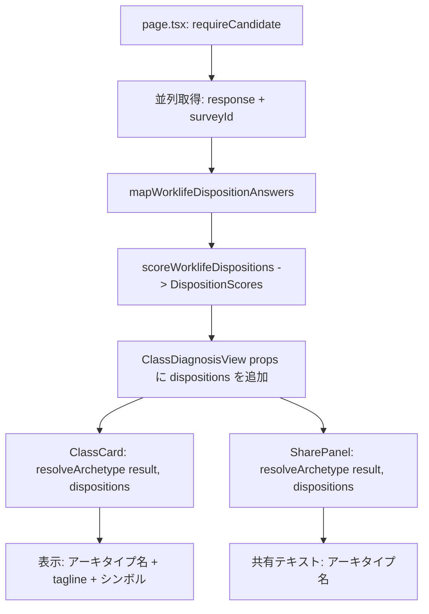

# Design Document — worklife-disposition-survey

## Overview

**働き方の志向診断（worklife-disposition-survey）** は、候補者の「何に価値を感じ・どんな行動で貢献するか」という5つの志向（改善志向 improvement／障害対応志向 incident／育成志向 mentoring／調整・橋渡し志向 coordination／新技術採用志向 newTech）を自己申告 5段階 Likert アンケートで測り、`diagnosis-archetypes` が既に受け付ける任意入力契約 `DispositionScores` を実際に供給する初の diagnosis である。

**Purpose**: `diagnosis-archetypes` の `resolveArchetype(result, dispositions?)` が常に `dispositions={}`（空）で呼ばれている現状を解消し、Optimizer / Firefighter / Mentor / Integrator / Innovator を判別可能にする。
**Users**: candidate アプリでクラス診断を閲覧する候補者本人。
**Impact**: 既存 skill_survey 4階層マスタスキーマへ**スキーマ変更なし**で新規アンケートを加算 seed する。`class-diagnosis` page.tsx / `ClassDiagnosisView` / `ClassCard` / `SharePanel` に `DispositionScores` を通す props 配線を追加する（アーキタイプ判定ロジック自体は非改修）。

### Goals

- 5志向を弁別する Likert アンケートを既存 skill_survey 基盤へ seed 追加する（スキーマ変更なし）。
- アンケート回答 → `DispositionScores`（0..100 の部分マップ）への決定論的スコアリング純関数を提供する。
- `class-diagnosis` page → `ClassDiagnosisView` → `ClassCard`/`SharePanel` へ `DispositionScores` を配線し、`resolveArchetype`/`scoreArchetype` の第2引数として実際に渡す。
- 未回答・部分回答でもクラス診断が壊れない（graceful degradation）。

### Non-Goals

- アーキタイプ定義・`resolveArchetype`/`ArchetypeSignature` 判定ロジック自体の変更（`diagnosis-archetypes` が所有）。
- 既存気質4軸（playstyle/thinking-style）の変更。
- 志向診断結果の DB 永続化・履歴・版間比較（他の診断と同様、ライブ算出のみ）。
- 志向診断専用の結果表示ページ（本 spec は `class-diagnosis` への信号供給が主目的であり、独立ビューは作らない）。

## Boundary Commitments

### This Spec Owns

- 志向カテゴリ・設問・選択肢マスタ（seed データ）と `kind='worklife_disposition'` アンケート。
- アンケート回答から `DispositionScores` を算出する決定論的スコアリング純関数（app ローカル）。
- 志向アンケートの survey id 解決・本人回答取得 query（`packages/db`）。
- `class-diagnosis` page.tsx / `ClassDiagnosisView` / `ClassCard` / `SharePanel` への `DispositionScores` props 配線（呼び出し箇所の変更のみ）。

### Out of Boundary

- `resolveArchetype` / `scoreArchetype` / `ArchetypeSignature` / `ARCHETYPES` 定義（`diagnosis-archetypes` が所有、読み取り専用 import のみ）。
- `DispositionKey` / `DispositionScores` 型定義そのもの（`diagnosis-archetypes` が所有・`dispositions.ts` からそのまま import する。再定義しない）。
- 既存気質4軸（`_lib/temperament/*`）・職掌（`_lib/vocation.ts` 等）算出ロジック。
- 志向診断専用の結果表示 UI・共有パネル（`class-diagnosis` の既存 `ClassCard`/`SharePanel` に統合する）。

### Allowed Dependencies

- `apps/candidate/app/class-diagnosis/_lib/archetype/dispositions.ts`（`DispositionKey`/`DispositionScores` 型）— 型のみ読み取り。
- 既存スキルアンケート基盤（`skillSurvey`/`skillSurveyCategory`/`skillSurveyQuestion`/`skillSurveyChoice` スキーマ、`getLatestSurveyResponseForAnalysis`、seed ランナー `runSkillSurveySeed`、`/skill-survey/[surveyId]` フォーム）を**利用のみ**。
- 認証ヘルパー `requireCandidate()`。
- 依存方向 `types → db → ai → apps` を厳守。本 spec は `packages/db`（query・seed）と `apps/candidate`（スコアリング・配線）に閉じ、`@bulr/types`・`@bulr/ai` は変更しない。

### Revalidation Triggers

- `DispositionKey`/`DispositionScores` 契約（キー集合・値域）の変更 → 本 spec のスコアリング関数の再確認。
- `ClassResult`/`resolveArchetype` シグネチャの変更 → page.tsx 配線の再確認。
- `answered-surveys-query.ts` の `kind` フィルタ包含条件の変更 → 志向アンケートの一覧露出有無の再確認。

## Architecture

### Existing Architecture Analysis

- `thinking-style-diagnosis`（PR #41）が確立した型: 型 → app ローカル純関数コア（軸/スコア/回答マッピング） → `packages/db` query → `packages/db/seeds` → Server Component。本 spec も同型を踏襲する。
- `class-diagnosis` page.tsx は既に `getCandidatePlaystyleResponse`/`getPlaystyleSurveyId` を並列取得し、ライブ算出した `TemperamentProfile` を `ClassDiagnosisView` へ渡している。志向も同じパターン（並列取得 → ライブスコアリング → props）で追加する。
- `ClassCard`/`SharePanel` は現在それぞれ内部で `resolveArchetype(result)` を**引数1つで**呼んでいる（`dispositions` 省略＝常に `{}`）。本 spec の唯一の統合作業は、この2箇所の呼び出しに `dispositions` props を追加で渡すことである。

### Dependency Direction

```
apps/candidate/app/class-diagnosis/_lib/archetype/dispositions.ts   ← 型のみ import（diagnosis-archetypes 所有）
        │
        ▼
class-diagnosis/_lib/worklife-disposition/        ← 新設（app ローカル純関数）
   category-map.ts / score.ts
        │
        ▼
class-diagnosis/page.tsx（取得＋スコアリング呼び出し）
        │
        ▼
class-diagnosis/_components/class-diagnosis-view.tsx（props 中継）
        │
        ├──► _components/class-card.tsx    ← resolveArchetype(result, dispositions)
        ▼
    _components/share-panel.tsx            ← resolveArchetype(result, dispositions)

packages/db/src/queries/worklife-disposition/   ← 新設（survey id 解決・本人回答取得）
packages/db/src/seeds/skill-surveys/worklife-disposition.ts  ← 新設（seed）
```

- スコアリング関数は `diagnosis-archetypes` の型を読み取るのみで、`resolveArchetype` 等のロジックには一切依存しない（片方向）。
- `packages/db` は `apps/*` を import しない（既存 `queries/thinking-style` と同型）。

### Technology Stack

| Layer | Choice / Version | Role in Feature | Notes |
| --- | --- | --- | --- |
| Frontend | Next.js 16 App Router / React Server Components | page.tsx でのサーバーサイド取得・配線 | 新規ルート追加なし。既存 `class-diagnosis` ページの拡張のみ |
| Data / Storage | Postgres + drizzle（`skill_survey.kind` enum に値追加） | 志向アンケート種別・回答参照 | `ALTER TYPE survey_kind ADD VALUE 'worklife_disposition'` の migration 1本のみ。テーブル構造変更なし |
| Seed | 既存 `runSkillSurveySeed` | 志向アンケート投入 | 冪等 upsert。`scoringKind='polarity'`（既存 enum 値を再利用） |

## File Structure Plan

### New Files

```
apps/candidate/app/class-diagnosis/_lib/worklife-disposition/
├── category-map.ts   # WORKLIFE_DISPOSITION_CATEGORY_MAP: seed カテゴリ名 -> DispositionKey（5件）
├── score.ts           # scoreWorklifeDispositions(answers) -> DispositionScores（純関数・決定論）
├── answers.ts          # WorklifeDispositionAnswer 型 + mapWorklifeDispositionAnswers(response) -> Answer[]
└── *.test.ts           # 未回答/部分回答/満点/クランプ/決定論の検証

packages/db/src/queries/worklife-disposition/
├── get-worklife-disposition-survey-id.ts    # getWorklifeDispositionSurveyId(): kind='worklife_disposition' survey の id or null
├── candidate-worklife-disposition-response.ts # getCandidateWorklifeDispositionResponse(candidateProfileId): SurveyResponseForAnalysis|null
└── index.ts                                   # バレル

packages/db/src/seeds/skill-surveys/worklife-disposition.ts  # worklifeDispositionSurveySeed（kind/jobType='worklife-disposition'、5カテゴリ×4問）
```

### Modified Files

- `packages/db/src/schema/skill-survey.ts` — `surveyKind` pgEnum に `'worklife_disposition'` を追加。
- `packages/db/drizzle/NNNN_*.sql`（新規 migration）— `ALTER TYPE survey_kind ADD VALUE 'worklife_disposition'`（drizzle-kit 生成）。
- `packages/db/src/seeds/skill-surveys/runner.ts` — `SkillSurveySeedData['kind']` の union に `'worklife_disposition'` を追加（既存 `'skill' | 'playstyle' | 'thinking_style'` に加算、破壊的変更なし）。
- `packages/db/src/queries/index.ts`（該当バレル） — `queries/worklife-disposition` を re-export。
- `packages/db/src/seeds/index.ts` — `runWorklifeDispositionSkillSurveySeed` を登録し `main()` で呼ぶ。
- `apps/candidate/app/class-diagnosis/page.tsx` — 志向アンケート回答＋survey id を並列取得し `scoreWorklifeDispositions` でライブ算出、`ClassDiagnosisView` へ `dispositions` prop を追加で渡す。
- `apps/candidate/app/class-diagnosis/_components/class-diagnosis-view.tsx` — `dispositions: DispositionScores` を props に追加し、`ClassCard`/`SharePanel` へそのまま中継する。
- `apps/candidate/app/class-diagnosis/_components/class-card.tsx` — `dispositions` を props に追加し、`resolveArchetype(result)` → `resolveArchetype(result, dispositions)` に変更。
- `apps/candidate/app/class-diagnosis/_components/share-panel.tsx` — `dispositions` を props に追加し、`toShareText(result)` → `toShareText(result, dispositions)`、内部の `resolveArchetype` 呼び出しへ伝播。
- 各 `class-card.test.tsx` / `share-panel.test.tsx` — `dispositions` props 未指定時（既定 `{}`）に既存テストが壊れないことを確認し、`dispositions` 指定時にアーキタイプ選択が変化するケースを追加。

**非改修（重要）**: `resolve.ts` / `signature.ts` / `definitions.ts` / `dispositions.ts`（`diagnosis-archetypes` 所有）、`_lib/temperament/*`、`_lib/vocation.ts` 等、`@bulr/types`、`@bulr/ai` は一切変更しない。`answered-surveys-query.ts` は変更しない（既存フィルタ `eq(kind,'skill')` により `worklife_disposition` は自動除外される）。

## System Flows

### 志向スコアのライブ算出と配線



- 未回答・未 seed のときは `mapWorklifeDispositionAnswers` が空配列を返し、`scoreWorklifeDispositions([])` が `{}` を返す。`resolveArchetype(result, {})` は職掌×気質のみで判定する既存挙動と完全に一致する（R4.1）。
- 永続化なし・毎回ライブ算出のため、志向アンケート回答を更新すると次回訪問時に自動反映される（playstyle/thinking-style と同方針）。

## Requirements Traceability

| Requirement | Summary | Components | Interfaces/Contracts |
| --- | --- | --- | --- |
| 1.1–1.7 | 志向アンケート定義・seed・冪等性・enum非破壊 | worklife-disposition.ts(seed), schema(surveyKind追加), runner.ts(kind union追加) | `worklifeDispositionSurveySeed`, `runWorklifeDispositionSkillSurveySeed` |
| 2.1–2.6 | 回答→DispositionScores決定論スコアリング | score.ts, answers.ts, category-map.ts | `scoreWorklifeDispositions(answers): DispositionScores` |
| 3.1–3.5 | resolveArchetype呼び出し箇所への配線・本人スコープ | page.tsx, class-diagnosis-view.tsx, class-card.tsx, share-panel.tsx, queries/worklife-disposition | `getCandidateWorklifeDispositionResponse`, `ClassCardProps.dispositions` |
| 4.1–4.4 | 未回答時のgraceful degradation | page.tsx(try/catchなしで空許容な純関数設計), score.ts, class-diagnosis-view.tsx | `scoreWorklifeDispositions([]) -> {}` |
| 5.1–5.3 | 数値非表示・共有テキスト制約踏襲 | class-card.tsx, share-panel.tsx（非改修部分の継続遵守） | 既存 `toShareText` 契約の維持 |
| 6.1–6.4 | 依存方向・DBテスト方針・一覧非露出 | queries/worklife-disposition, score.ts(app ローカル), answered-surveys-query.ts（非改修） | 既存フィルタ `eq(kind,'skill')` |

## Components and Interfaces

| Component | Layer | Intent | Req Coverage | Contracts |
|-----------|-------|--------|--------------|-----------|
| worklife-disposition/category-map.ts | app-local lib | seed カテゴリ名→DispositionKey の対応表 | 2.1, 2.6 | Data |
| worklife-disposition/answers.ts | app-local lib | 回答レスポンス→Answer[] へのマッピング | 2.1 | State(型) |
| worklife-disposition/score.ts | app-local lib（純関数） | Answer[]→DispositionScores 決定論算出 | 2.1–2.5 | Service(pure) |
| queries/worklife-disposition | db | survey id 解決・本人回答取得 | 3.1, 3.5, 6.1, 6.3 | Service |
| seeds/skill-surveys/worklife-disposition.ts | db | 志向アンケート投入 | 1.1–1.7 | Batch |
| page.tsx（改） | app route | 取得→スコアリング→配線 | 3.1, 3.2, 4.2, 4.3 | — |
| ClassDiagnosisView（改） | app UI | props 中継 | 3.2 | State(props) |
| ClassCard（改） | app UI | resolveArchetype へ dispositions 伝播 | 3.3 | State(props) |
| SharePanel（改） | app UI | resolveArchetype へ dispositions 伝播 | 3.3, 5.3 | State(props) |

### app-local lib（`_lib/worklife-disposition/`）

#### score.ts

| Field | Detail |
|-------|--------|
| Intent | 志向アンケート回答から `DispositionScores` を決定論的に算出する純関数 |
| Requirements | 2.1, 2.2, 2.3, 2.4, 2.5, 2.6, 4.1 |

**Responsibilities & Constraints**

- 純関数のみ・副作用/乱数/日付なし → 決定論（R2.2）。
- 回答が0件（未回答）のとき空オブジェクト `{}` を返す（R2.4/4.1）。
- カテゴリ単位ですべて未回答の `DispositionKey` は結果オブジェクトにキー自体を含めない（R2.3）。
- 各志向スコアは 0..100 にクランプする（R2.5）。
- `DispositionKey`/`DispositionScores` 型は `diagnosis-archetypes` の `dispositions.ts` から import し、再定義しない（R2.6）。

**Contracts**: Service [x]（純関数）

##### Service Interface

```typescript
import type { DispositionKey, DispositionScores } from '../archetype/dispositions';

/** 志向設問1問の回答。playstyle/thinking-style と同じ Likert 契約（reverse なし・単一方向の肯定強度）。 */
export interface WorklifeDispositionAnswer {
  disposition: DispositionKey;
  level: number;      // 0..maxLevel（選択肢の level をそのまま使用）
  maxLevel: number;    // 4（5段階 Likert）
}

/**
 * 志向アンケート回答から DispositionScores を決定論的に算出する。
 * カテゴリ（DispositionKey）ごとに回答の (level / maxLevel * 100) の平均を取り、
 * 0..100 にクランプする。回答が1件もない DispositionKey はキー自体を省略する。
 * 全体が空配列のときは {} を返す。
 */
export function scoreWorklifeDispositions(
  answers: WorklifeDispositionAnswer[],
): DispositionScores;
```

- Preconditions: `answers` は0件以上。`level` は `0..maxLevel` の範囲（seed の choice.level 契約により保証）。
- Postconditions: 返り値の各値は `0 <= v <= 100`。回答の無い `DispositionKey` はキー自体が存在しない。
- Invariants: 同一 `answers` → 同一 `DispositionScores`（決定論）。

**Implementation Notes**

- 集計: `disposition` ごとに `Σ(level/maxLevel*100) / count`（2桁丸め、`_lib/temperament/score.ts` の `round2` と同じ丸め方針）。
- reverse（逆転設問）は採用しない: 各志向は「その行動をどれだけ好む・重視するか」という単一方向の同意強度であり、playstyle/thinking-style のような両極対立軸ではないため、全設問 natural（肯定表現）のみで構成する。

#### answers.ts

| Field | Detail |
|-------|--------|
| Intent | `SurveyResponseForAnalysis` を `WorklifeDispositionAnswer[]` へ写像 |
| Requirements | 2.1 |

```typescript
const WORKLIFE_DISPOSITION_CATEGORY_MAP: Record<string, DispositionKey>; // seed カテゴリ名 -> DispositionKey（5件）
function mapWorklifeDispositionAnswers(
  response: SurveyResponseForAnalysis | null,
): WorklifeDispositionAnswer[];
```

- `response === null`（未回答）のとき空配列を返す。
- カテゴリ名が `WORKLIFE_DISPOSITION_CATEGORY_MAP` に無い設問は無視する（防御的）。

### db（`queries/worklife-disposition/`）— Contracts: Service

```typescript
function getWorklifeDispositionSurveyId(): Promise<string | null>;
function getCandidateWorklifeDispositionResponse(
  candidateProfileId: string,
): Promise<SurveyResponseForAnalysis | null>;
```

- `getWorklifeDispositionSurveyId`: `skillSurvey` を `eq(kind, 'worklife_disposition')` で1件 SELECT（`thinking-style` の対応物と同型）。
- `getCandidateWorklifeDispositionResponse`: 上記 survey を特定し `getLatestSurveyResponseForAnalysis(candidateProfileId, surveyId)` に委譲。本人スコープ限定（R3.5）。

### UI（Summary-only + Implementation Note）

- **ClassCard（改）**: props に `dispositions: DispositionScores`（既定値 `{}`）を追加。内部の `resolveArchetype(result)` 呼び出しを `resolveArchetype(result, dispositions)` に変更する以外の表示ロジックは変更しない。
- **SharePanel（改）**: props に `dispositions: DispositionScores`（既定値 `{}`）を追加。`toShareText(result, dispositions)` として `resolveArchetype` へ伝播。共有テキストの構成要素（アーキタイプ名／className／称号／固定ブラーブ）は変更しない（R5.3）。
- **ClassDiagnosisView（改）**: `dispositions` props を追加受領し、`ClassCard`/`SharePanel` へそのまま中継する（新規ロジックなし、単純な prop drilling）。

**Implementation Note**: UI 側の変更はすべて「既存の関数呼び出しに第2引数を足す」「props を1つ追加して中継する」に限定され、表示構造・スタイルは一切変更しない。

## Data Models

### seed（`seeds/skill-surveys/worklife-disposition.ts`）

```
worklifeDispositionSurveySeed: SkillSurveySeedData = {
  jobType: 'worklife-disposition', kind: 'worklife_disposition', title: '働き方の志向診断',
  categories: [
    { name:'改善志向', subcategory:'働き方の志向', displayOrder:0, questions:[ natural×4 ] },
    { name:'障害対応志向', subcategory:'働き方の志向', displayOrder:1, questions:[ natural×4 ] },
    { name:'育成志向', subcategory:'働き方の志向', displayOrder:2, questions:[ natural×4 ] },
    { name:'調整・橋渡し志向', subcategory:'働き方の志向', displayOrder:3, questions:[ natural×4 ] },
    { name:'新技術採用志向', subcategory:'働き方の志向', displayOrder:4, questions:[ natural×4 ] },
  ],
}
```

- 各設問 `questionType='single_choice'`・5択・`scoringKind='polarity'`（既存 enum 値を再利用。追加不要）。選択肢 `level` 0..4（「全くそう思わない」=0 〜「強くそう思う」=4）、`maxLevel=4`。
- 全設問 natural（肯定表現）のみ（reverse なし、上記 score.ts Implementation Notes 参照）。
- `subcategory` は非 null 必須（`'働き方の志向'`）。`runSkillSurveySeed(db, worklifeDispositionSurveySeed, { logLabel: 'worklife-disposition' })` で `onConflictDoUpdate(jobType)` 冪等（R1.6）。
- カテゴリ名は `WORKLIFE_DISPOSITION_CATEGORY_MAP` の安定キーのため変更しない。

### enum migration

`survey_kind` に `'worklife_disposition'` を追加（`ALTER TYPE ... ADD VALUE`）。drizzle-kit generate で1本生成。マージ時の番号衝突は既存運用（振り直し）で解消。`score_kind` enum は変更しない（既存 `'polarity'` を再利用）。

## Error Handling

- **未認証**: `requireCandidate()` が sign-in へリダイレクト（既存挙動、変更なし）。
- **survey 未 seed / 未回答**: `getWorklifeDispositionSurveyId()` が null、または response が null のとき、`mapWorklifeDispositionAnswers` が空配列を返し `scoreWorklifeDispositions([])` が `{}` を返す。`resolveArchetype(result, {})` は disposition 未提供時と等価に動作し、エラーにしない（R4.1–4.3）。
- **カテゴリ名不一致**: seed のカテゴリ名を変更した場合でも `mapWorklifeDispositionAnswers` は未知カテゴリを無視するのみでクラッシュしない（防御的実装）。
- **既存状態分岐への非干渉**: `class-diagnosis-view.tsx` の NoVocation/Empty/PartialNoTemperament/Complete/VizOnly/Stale 分岐条件（`hasSkill`/`hasPlaystyle`/`isStale` 等）は `dispositions` の有無を条件に含めない（R4.4）。

## Testing Strategy

### Unit（`_lib/worklife-disposition/*.test.ts`・DB不要）

1. `score.test.ts`: 空配列 → `{}`（R2.4/4.1）、単一 `DispositionKey` の複数回答平均が正しく 0..100 に収まる（R2.1/2.5）、未回答カテゴリはキー省略（R2.3）、同一入力の反復呼び出しで同一結果（決定論, R2.2）。
2. `answers.test.ts`: `response=null` → 空配列、カテゴリ名→`DispositionKey` の写像が正しい、未知カテゴリは無視（R2.1）。

### Integration（`packages/db/src/__tests__/*.integration.test.ts`・fileParallelism:false・inline env・クリーンDB前提）

1. `worklife-disposition-survey.integration.test.ts`: seed 後 `kind/jobType='worklife-disposition'` が1件・期待 title・5カテゴリ×4問・`subcategory` 非null・再実行で重複行が増えない（冪等性, R1.1–1.6）。
2. `get-worklife-disposition-survey-id.integration.test.ts`: 解決 id が直接 SELECT と一致、未 seed 時は null（R3.1相当, 6.1）。
3. `candidate-worklife-disposition-response.integration.test.ts`: 本人回答の取得・他者スコープ非取得（R3.5）。
4. `worklife-disposition-list-exclusion.integration.test.ts`: `worklife_disposition` が `getAnsweredSurveysForCandidate` の一覧に含まれない（既存フィルタで自動除外を担保、R6.4）。

### Component / UI（既存テストへ追加、jsdom）

1. `class-card.test.tsx`: `dispositions` 未指定（既定 `{}`）で既存の表示結果が変化しないことの回帰確認、`dispositions` を強く与えた場合に Optimizer/Firefighter/Mentor/Integrator のいずれかへ選択が変化することの確認（R3.3）。
2. `share-panel.test.tsx`: `dispositions` 指定時に `toShareText` のアーキタイプ名部分が変化すること、共有テキストに回答ラベル・数値・志向名そのものが含まれないこと（R3.3, 5.1–5.3）。
3. `class-diagnosis-flow.test.ts`（既存フローテスト）: 志向アンケート未回答でも `NoVocation`/`Empty`/`PartialNoTemperament`/`Complete` 等の既存状態分岐がすべて変わらず動作すること（R4.4）。
